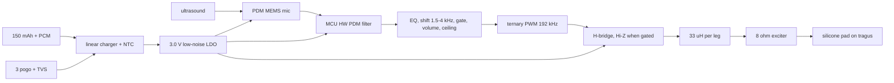

# B-r4 Blind design: playback audible in a quiet suburb and on a street, >=8 h, thinnest pod
Author: blind designer, 2026-10-08. Read only BRIEF-blind.md. Basis tags: [B]=brief figure, [R]=recalled from memory (no source fetched, unverified), [E]=my estimate/arithmetic, [G]=measurement gate (must be measured before freeze). No web research done, so no number here has a dated primary source; every [R] must be checked.

## 1. The one design
Per side, one pod on the arm, X 29.5 to 59.5 mm behind the hinge (inside the vision line and short of the Ear (open) hook, [B]). Power: one 150 mAh protected LiPo pouch, 3.0 V low-noise LDO for everything analog, MCU core SMPS only (D11). Output transducer: a small electromagnetic (moving-coil) contact exciter, 8 ohm, ~10 x 6 x 2.6 mm, ~0.5 g [R, class of part; no part number chosen], at the tragus on the end of a swept-back printed spring arm. Coupling: 6 mm silicone pad (Shore ~30A, 0.8 mm skin, insulating the metal) pressed on the skin in front of the tragus at >=1 N [B], so tragus cartilage conducts and the tragus acts as a partial ear-canal seal (D1 claim, ~10 dB over cheekbone [B]).

Choice reasons, bluntly:
- Electromagnetic over piezo bender: piezo is thinner but wants 10-30 V; I may not add a boost converter (D11), and a 3 V bridge cannot drive it hard enough [R]. Moving-coil runs directly from the 3.0 V rail: a bridge swings 6 V differential, so full-scale into 8 ohm is (3 V rms-peak)^2/8 ~ 0.56 W peak per the ceiling, plenty against the few mW needed [E]. Cost: exciter is 2.6 mm thick vs ~1 mm piezo. It sits on the pad arm, not in the pod, so it does not set pod thickness.
- Ternary (3-level) PWM at ~192 kHz instead of the 2-level in the brief: at zero signal both legs switch together, the coil sees ~0 V, so idle ripple current ~0. With 2-level PWM, an 8 ohm / ~20 uH coil would draw ~25-40 mA ripple at idle [E: V/(2*pi*f*L)=3/(25 ohm)]; that alone would cost >4 h of runtime. Add 33 uH series per leg [E] to cut worst-case ripple to ~3 mA.
- Bridge idles Hi-Z (both legs off) whenever the processed envelope is below the noise gate: nothing can hiss (T6).

## 2. Audibility argument (the extra requirement)
Define "SPL-eq" = level in an occluded-ear-simulator that gives the same loudness as the contact vibration. Everything below is [E] on [R] inputs.
- Quiet suburb ~35 dBA overall [R]; at 1.5-4 kHz a 450 Hz critical band holds ~15-20 dB SPL. Hearing threshold at 3 kHz ~ -5 dB SPL [R], hers better. Comfortable >=35 dB SPL-eq. Easily met.
- Day-to-day street ~65 dBA [R]; urban noise falls ~5-6 dB/oct above 500 Hz [R], so in-band third-octave level at 3 kHz ~45 dB, critical band ~48. Detection needs SNR ~0-5 dB, comfortable +15: target **65 dB SPL-eq** in 1.5-4 kHz on a sustained or loud call. Add 6 dB headroom: ceiling 71 dB SPL-eq (far under 85 dB, no hearing risk).
- Volume: 6 steps x 6 dB, range ~35 to 71 dB SPL-eq. Fixed gain + stepped volume, no AGC (D3). Ceiling soft clip identical both sides (D17).
- Exciter sensitivity S (dB SPL-eq at 1 W electrical) is THE unknown. Bone/cartilage contact devices run well below earphones (~130 dB/W [R]); I assume S = 90 dB/W [R/guess]. Required average audio power P = 10^((67-S)/10) W (67 = 65 + 2 dB margin).

| S, dB/W | P_avg audio for 67 dB | worst-day runtime, 150 mAh aged | verdict |
|---|---|---|---|
| 90 | 5 mW | 12.7 h | design point |
| 85 | 16 mW | 8.9 h | passes, marginal |
| 80 | 50 mW | ~4.5 h | fails; fallback needed |
| 70 | 500 mW | n/a | infeasible |

Gate G1: measure S with the real pad on her tragus (and a coupler) at 1.5/2/3/4 kHz. **If S < 85 dB/W the design fails the 8 h street requirement**; fallback is a 200 mAh cell (+0.8 g, +1 mm) or accept loud-street = 6 h. I will not hide this: loudness per watt is unproven for any bone device at this size.

## 3. Battery math (all currents drawn from the cell; LDO is linear so rail current = cell current)
| load | worst day (street, S=90) | normal day |
|---|---|---|
| ultrasonic PDM MEMS mic (Knowles SPH0641-class, ~1.0 mA at ultrasonic clock) [R] | 1.0 mA | 1.0 |
| MCU (Cortex-M33-class, hardware PDM filter, core SMPS, ~16-32 MHz) [R] | 2.0 | 2.0 |
| LDO Iq + charger leakage + NTC bias [R] | 0.05 | 0.05 |
| audio: P_avg /(0.85 bridge eff) /3.7 V (5 mW worst; 1 mW normal) [E] | 1.6 | 0.3 |
| residual ripple current in coil (33 uH per leg) [E] | 3.0 | 1.0 |
| bridge gate/switching loss (~1 nC, 192 kHz, 2 legs, 3 V) [E] | 0.4 | 0.4 |
| **total** | **8.05 mA** | **4.75 mA** |

Cell: 150 mAh x 0.85 usable (3.3 V cutoff) = 128 mAh new; x 0.80 end-of-life = 102 mAh aged [R fractions].
- Worst day: 128/8.05 = 15.8 h new; 102/8.05 = **12.7 h aged** (spec 8 h).
- Normal day: 128/4.75 = 27 h new; 102/4.75 = **21 h aged** (spec ~12 h).
- Cell size: 555 mWh at 3.7 V; at ~450 Wh/L [R] = 1230 mm^3 = 3.2 x 14 x 27.5 mm, ~2.6 g (2.1 g/cm^3 [R]).
- Dominant loss is not the output; it is ripple + mic + MCU. Cutting ripple (ternary + inductors) is worth more than any codec choice.
Charge: standalone linear charger with NTC/JEITA gate (BQ2406x-class, TI [R]); 40 mA (0.27C, under 0.5C limit [B]) to 4.2 V, ~4.5 h incl. taper; cell has protection PCM (R23); dock 3 magnetic pogo contacts + TVS (B6); no output while docked (bridge Hi-Z by firmware and by hardware pull-down at dock-sense).

## 4. Size, mass, balance
Pod: **4.9 T x 27 H x 30 L mm**, starting 29.5 mm from the hinge (vision line [B], estimate). Thickness: cell 3.2 + 0.3 swell + 2 x 0.6 wall + 0.2 gap = 4.9. Height 27 = cell 14 + PCB strip 11 + walls/gap 2. PCB: 0.8 mm, parts both sides (~0.5 mm each) in a 30 x 11 strip beside the cell, not over it. I trade HEIGHT for THICKNESS (O27 order, with O34b allowing height). Length is pinned at ~30 mm by the vision line and hook margin, not by choice: if E10 moves the vision line rearward, pod shrinks in height first.

| item | g |
|---|---|
| 150 mAh pouch + PCM | 2.6 |
| PCB + parts | 0.7 |
| exciter | 0.5 |
| pad + swept spring arm + 2 x enamelled wire | 0.6 |
| printed shell (PA12 [R] ~1.0 g/cm^3, 0.6 mm wall, ~2180 mm^2) | 1.3 |
| clasp + fixings | 0.5 |
| **total per side** | **6.2 (+-0.6)** |

Balance [E, geometry assumed: nose pads 25 mm ahead of hinge, ear support 100 mm behind]: pod centroid ~45 mm gives ear share (45+25)/125 = 56%: **ear ~3.5 g, nose ~2.7 g** per side. Beats 7.3-8.8 g by ~1.1-2.6 g, and both shares are below the 15 g pain figure [B].

## 5. Diagram: block and arm section

```
 side view along the arm (not to scale)              top view of pod (T = 4.9)
 hinge          X=29.5            X=59.5   hook      |wall .6|cell 3.2+.3|gap .2|wall .6|
   |   [ vision line ]  +----pod 30 x 27----+  ~ ~ ~  arm side <--- skin side
   |                    | cell 14 | PCB 11  |          clasp (printed, swappable) on arm
                        +---------+---------+
 mic port: front-lower wall, 2 mm mesh, away from wires
 exciter wire pair (2 x 38 AWG) exits rear-lower edge -> swept spring arm (PA12, ~40 mm)
 -> 6 mm silicone pad at tragus, preload >=1 N; arm passes below/in front of the Ear (open) pod
```
Assembly order (hand, ~11 steps): 1 print shell/clasp/arm; 2 solder exciter wires, pot joints; 3 route wires in arm channel, glue exciter into arm tip; 4 press silicone pad; 5 PCB (JLC-assembled) into shell strip, mic to port; 6 wire pair to PCB pads; 7 cell lead to PCB, PCM check; 8 insulate cell, seat in shell; 9 dock pogo seat; 10 close shell (snap + 2 pins), seal bead; 11 clip clasp to glasses and set preload.

## 6. Key numbers and what is lost
- Output band 1.5-4 kHz [B]; ceiling 71 dB SPL-eq [E]; self-noise: bridge Hi-Z below gate, LDO <~10 uVrms [R class], PWM 192 kHz inaudible; no ultrasound = no output = T6.
- Part count ~9 active parts (MCU, mic, bridge, charger, LDO, TVS, crystal, button, LED) + ~28 passives + cell + exciter + 3 printed bodies. Roughly equal to existing architecture; saves nothing here.
- Beats: mass (6.2 vs 7.3-8.8 g), thickness 4.9 mm, runtime 12.7/21 h aged vs 8/12 h (large margin, which is what lets the cell be 150 mAh not 175).
- Loses: height 27 mm (tall for an arm pod); the sensitivity S is an unproven assumption (table in section 2); exciter is a custom/unnamed part class I could not source; ternary PWM and inductors add firmware work and ~6 passives.
- Stretched: (1) 2-level PWM replaced by ternary [brief says architecture is not a mandate]; (2) read "~60 mm usable" as X 29.5-59.5 because of the vision line, flagged. Evidence to unstretch: E10 measured field; G1 sensitivity; G2 measured ripple current with the real coil (target <3 mA, else raise L); G3 contact-force/pain test 2 h (T5); G4 coupler tragus-vs-cheek delta ~10 dB [B, D1].
