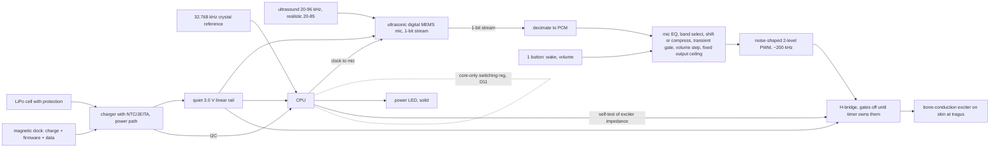

# Requirements brief for blind designers
Audience: agents designing the device from scratch. You must NOT read our board, parts, layout or shell. Sources: docs/spec.md (cited as S§n / D-n / O-n / R-n) and docs/system/00-whole.md (functions only). No number here is invented; "none in spec" means the spec gives none.

## 1. Purpose (owner's words)
"A wearable that lets the owner hear ultrasound (roughly 20–96 kHz) in real time, in stereo, by shifting it down into a comfortable audible band and delivering it by bone conduction. It mounts on her everyday prescription glasses and must feel like an extension of her body, not a gadget." (S§1.1, locked, quoted verbatim)
Success tests (S§1.3): T1 house walk (Transient-only mode tolerable); T2 dusk nature sit, bats comfortable not shrill; T3 eyes-closed left/right pointing better than chance; T4 Ear Opens worn and playing phone audio, no fit interference, both streams distinguishable; T5 2+ h no pressure pain (temples, transducer site) incl. talking and eating; T6 no ultrasound present = inaudible, no hiss, no whine.
Priorities ranked (S§2): 1 comfort/size/weight, 2 power draw, 3 simplicity/part count, 4 cost, 5 sound pleasantness.
Personal device, not a product: 2 pods (+ spares) worn constantly, outdoors, for years; optimise comfort, reliability, durability, serviceability (cell replaceable), diagnosability; unit cost and scale are not goals; schematic should not need changes after freeze, firmware only (O19).
Quality bar: evidence-gated; proof it works over fastest path (owner memory rule, not a spec item).

## 2. Logical block diagram (functions and signals, per side) (S§3, D2, 00-whole F1–F15)
Two identical, fully independent units, one per temple arm; no wire or radio between them (S§3, D2).

Functions to cover (00-whole F1–F15): hear 20–85 kHz; process; drive exciter; self-test exciter impedance; charge; temperature-safe charge; system rail; battery level; dock detect; USB data/firmware load; wake/button; power LED; charger link; debug/flash/test access; ESD at exposed contacts. Modes (D12): Full; Transient-only (indoor default; steady tones suppressed, changing sounds passed); Off (silent, MCU deep sleep, mic unpowered, bridge stopped). No output while docked (O32 + R23). Mapping is your choice; the above is the existing architecture, not a mandate.

## 3. Envelope and space (S§1.2, S§8, O27)
- Clips onto her everyday prescription glasses via removable 3D-printed clasps (S§1.2.1). Frame adapter must be swappable for new frames without reprinting the pod body (S§8 v0.14).
- Wear position: on the temple arm between eye and ear, from just behind the hinge to at least 5 mm ahead of the Ear (open) hook; ~60 mm usable length (S§8 v0.8). Driver pod of the Ear (open) sits over the ear opening between helix root and tragus and shifts during wear: do not touch it (S§1.2.2).
- Nothing behind the ear or toward the neck; bulk goes at the front near the hinges (S§1.2.4; D18 reading: only the cell may move rearward along the arm, in front of the ear; O4).
- Vision no-go: no part visible with eyes straight ahead (S§8 v0.9). Working line: X ≥ 29.5 mm from the hinge, an estimate. Spec basis: 110° temporal field + 5 mm margin (S§8 v0.9; E10 measures her real field, S§12). Treat as a soft estimate; flag if your concept needs to cross it.
- Size priority, owner ruling: 1) THIN, 2) SHORT (vertical height), 3) length last. May be as long as the arm allows; must not be a "brick" (O27). Note later case-specific ruling: height may exceed O27 order when it shortens length (O34b); a designer's concept should state which axis it trades.
- Output site: skin just in front of the tragus, base, mid-tragus height (D1); fallback root of cheekbone arch. Contact force is a test item (E2 "≥1 N", S§10 S2). Pad must reach the tragus from the pod by an arm swept back from the pod's rear-lower edge, not hitting the Ear (open) (S§8 v0.8).
- Transducer metal and solder joints insulated from skin; sealing is critical for daily outdoor use (O12b, O19).

## 4. Power (S§7, D18, O16, O28, O32, R23)
- Runtime ≥ 8 h worst day, ~12 h normal day (D18; reading B, O28). Nightly charging (D18).
- Cell candidates in spec: ~105 mAh minimum, ~150 mAh sized bay (D18); 175 mAh protected pouch chosen in O16. Choose your own, justify mass and runtime.
- Cell safety: protection circuit in the cell (R23); charger with NTC/JEITA temperature gating (R23, O16); charge current ≤ 0.5C (S§9 B3); no output while docked (R23, O32); supervised first charge (R23). Owner never wears while docked (O32).
- Rail: bridge supply on a regulated rail, not directly on the battery, so gain does not track charge (S§7 ≈1.8 dB). Quiet rail for mic and bridge (D11).
- Switching regulation only per D11: MCU core only; everything else linear; self-noise no louder than the ambient background (S§1.2.3, D11). Fixed-frequency not burst mode.
- Charging path: magnetic dock/cable also carrying firmware load (O12a). Dock-side exposed contacts need ESD protection (S§9 B6).

## 5. Acoustic in and out
- Input: ultrasonic mic band ~20–96 kHz in the locked text; realistically 20–85 kHz (00-whole F1, D14). Mic port geometry, mesh and wall reshape response, so an EQ stage and acoustic-path rules are needed (D13, S§8).
- Processing: output band ≈ 1.5–4 kHz, floor at or above ~1.5 kHz so unlinked units' random phase does not scramble direction (D9, D2). Floor tuned to her upper hearing limit as a constant, identical both sides (D10). Fixed gain plus manual stepped volume, no AGC (D3). Fixed output ceiling (soft clip) identical both sides; pop-free start and mode changes (D17). Digital DSP, not analog division (D4). Each side processes its own mic so the interaural level difference (main cue) survives (D2).
- Output: bone/cartilage conduction at the tragus; the spec's literature predicts ~10 dB more loudness and 25–40 dB left/right isolation than the cheekbone (D1). Output PWM kept well above her hearing (S§1.2.3).
- Loudness targets: no numeric dB SPL target in the spec. Requirement forms only: loud enough (R1, test S2), no louder than ceiling (D17), and self-noise no louder than ambient (S§1.2.3, T6). State your own number and basis.
- Her hearing is unusually good at high frequencies (hears charger/LED-driver whine) (S§1.2.3).

## 6. Comfort, wear, mass (S§1.2.4, S§8, O19)
- Total ~7.3–8.8 g per side against ~8 g target and ~15 g "glasses start hurting" (S§8 mass line, `[Low]` confidence). Nose-pad pressure is the usual comfort failure; split load between nose pads and ears by placing the cell back along the arm (S§8 balance table: ~3.1–3.7 g nose, 4.2–5.1 g ear for cell-before-hook layouts). Her instruction: "design for balance as needed" (D18).
- No pressure pain at temples or transducer site over 2+ h incl. eating and talking (T5). Snag on hair is a risk (R16). No UV or glow prints (owner, S§8 v0.14). Look: 3D-printed, cyberpunk, not a brick (S§8 v0.14).

## 7. Buildability (S§1.2, D8, O19, O21)
- Factory assembly at JLCPCB (D8); prefer Basic parts, then Extended (CLAUDE.md fabricator rule). Owner hand-assembles everything else: the design must show mounting, fixing, wiring and assembly sequence (owner memory rule, not in spec). Housing, clasps and adapter are 3D printed. Wiring along the arm: battery and exciter pairs, routed away from mic port and clock lines (S§8).
- Serviceable: cell replaceable after aging, repair by owner (O19).
- Programming/test access: SWD pads or dock (S§3, O12a).

## 8. Hard no's
- No orders before design freeze (O21). Nothing bought; propose only.
- Installed software must be FOSS (owner rule, CLAUDE.md memory; online services fine).
- Switching regulators only as D11 allows (MCU core SMPS; self-noise no louder than ambient) (S§1.2.3, D11).
- Nothing in her peripheral vision (S§8 v0.9), nothing behind the ear or toward the neck (S§1.2.4), no touching the Ear (open) pod or using it as output (S§1.2.2).
- No wires or radio between the two sides (D2). No AGC (D3). Do not edit S§1.
- Working rules (S§0): gloss every part number, primary sources with dates, 2–3 options with a recommendation (owner decides), be blunt, show diagrams.

## 9. What to return
1. Concept: one page plus a diagram (block, plus a section through the arm showing stack-up, mounting, fixing and wiring order).
2. Key numbers, each with basis: pod L x W x H on the arm and its start distance from the hinge; mass per side and nose/ear split; cell capacity and runtime (worst and normal day, with current budget); output band and ceiling; self-noise estimate vs ambient; charge current and cell-safety chain; part count; hand-assembly steps count.
3. Which metric it beats and by how much, against these figures quoted in the spec: pod thickness (O27 first), height, length, mass ~7.3–8.8 g, runtime 8 h worst/12 h normal, part count (S§2 rank 3), and the T1–T6 tests. Say plainly what it loses.
4. Which hard no's you stretched, if any, and the evidence you would need to unstretch them.
