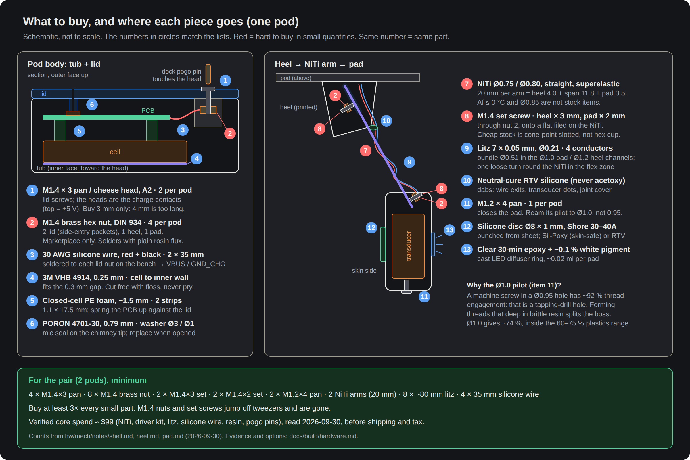
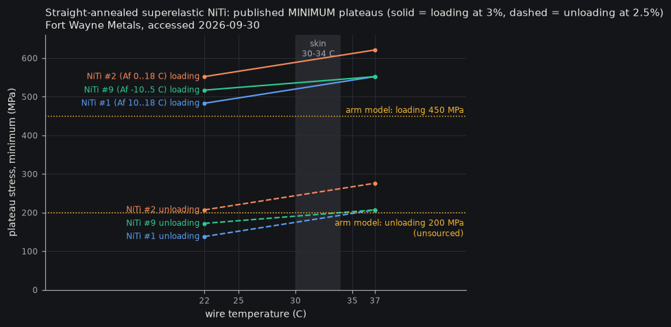

# Build hardware & materials: rev 1 pod (= the prototype)

**Date:** 2026-09-30. Every price, stock figure and data-sheet number below was read on **2026-09-30** unless another date is given.
**Scope:** what to buy and why: fasteners, NiTi wire, arm conductors, adhesives and consumables, resin, the charging-dock pogo pins, tools. No CAD.
**Interface:** `hw/mech/frame.py` (`FASTENERS`, `RESIN`, `NITI_D`, `SOCKET_D`, `LID_SCREWS`, `WIRE_PADS`). Where this page disagrees with it, see "Interface requests" at the end.
**Cross-checked against** the module notes `hw/mech/notes/shell.md`, `heel.md`, `pad.md` and `electronics.md` (all 2026-09-30), so the counts below are what the pods actually use.
**Numbers:** `docs/build/hardware_checks.py` recomputes every derived figure on this page and writes `hw/mech/out/parts/hardware/checks.json`. Run it inside the memory fence; it takes about 1 s.
**Builder's short version:** `hw/mech/notes/hardware.md`.

**Evidence tags:**
- **[V]** read on the maker's or seller's own page or data sheet.
- **[S]** seen only in a search-result snippet, because the page blocks automated readers (Accu, McMaster, Digi-Key, eBay, Amazon). Check it before ordering.
- **[U]** not verified (marketplace listing, or no price shown).

---

## 0. Bottom line (blunt)

1. **Nobody sells hobby-quantity NiTi with a published unloading plateau.** The only primary numbers are Fort Wayne Metals' *minimums* for straight-annealed wire.
   - Interpolated to skin temperature (32 °C) they give an unloading plateau of **184–253 MPa**, so the model's **200 MPa is plausible as a floor**.
   - The same data puts the **loading plateau at 517–598 MPa, 15–35 % above the model's 450 MPa**. The force while putting the glasses on will be higher than the model says.
   - Only the real pod on a kitchen scale (T5) settles it.
2. **Af ≤ 0 °C is not available off the shelf in 0.75–0.85 mm.**
   - Kellogg's 0.75 mm superelastic wire is Af 0–10 °C.
   - Nexmetal's 0.8 mm wire is only the "Standard (above freezing)" grade; its −20 °C and −30 °C grades come only in 0.3/0.5/1.0 mm and larger.
   - **0.85 mm is not a stock size anywhere I found.** Buy 0.75 + 0.80 now; 0.838 mm (0.033″) is quote-only at Kellogg's.
3. **Two of the four fasteners in `frame.FASTENERS` are hard to buy in small quantities:**
   - **M1.4 brass nuts:** marketplace only. Accu stocks M1.4 DIN 934 nuts only in stainless steel, which won't solder with rosin flux.
   - **M1.4 cup-point set screws, 2–3 mm:** FastenerMart sells 45 for $55.97, in black alloy steel. A camera-repair shop sells M1.4 *cone-point, slotted* ones instead.
   - Options are in §2.
4. **PTFE wire at ≤ 0.3 mm OD doesn't exist in hobby channels.**
   - The thinnest PTFE 36 AWG is 0.36–0.51 mm OD, and PTFE can't be glued for strain relief.
   - **Recommended instead: 7 × 0.05 mm served litz, ~0.21 mm OD, $0.71 for 10 m.**
5. **The resin rules in `frame.RESIN` are mostly right.**
   - `min_slot = 0.3` is below Formlabs' 0.4 mm "engraved detail" limit, so slots that narrow will fuse shut. Use 0.4.
   - Pilot holes for self-tapping screws at 79 % of the screw diameter are tight for a brittle photopolymer; ~85 % is the usual guidance.
6. **Charging through the lid screws works, with three conditions:**
   - The dock must hold the pod down: two pogo pins push 1.2 N.
   - A2 screws are essentially non-magnetic, so magnets won't grip them.
   - The charger must not back-feed VBUS from the battery, or the screw heads sit live and corrode in sweat. The electronics note covers this: undocked, the +5 V screw sits at ≤ 0.4 V (MCP73831 reverse leakage ≤ 2 µA into a 200 kΩ divider, per that note; I haven't re-read the datasheet).
7. **The module notes change the counts.** Each pod uses **4 brass nuts** (lid 2, heel 1, pad 1), **2 set screws** (heel M1.4 × 3, pad M1.4 × 2), 2 lid screws and 1 M1.2 screw (§0.5). My first list allowed for the lid nuts only.
   - **Lid screws are M1.4 × 3 only.** The shell note's longest safe screw is 3.6 mm, so a × 4 screw hits the bottom of its blind hole.
8. **The pad's Ø0.95 pilot is too tight for its M1.2 eyeglass screw.** Driven into that hole, a machine screw forms threads at **~92 % engagement**: that is tapping-drill size. Plastics guidance is 60–75 %. **Ream it to Ø1.0 (~74 %).** Numbers in §2.1.
9. **The heel note's optional Loctite 222 is risky on resin.** Henkel's own data sheet says it is "not normally recommended for use on plastics" because of stress cracking (TDS, May 2022). Leave it out, or test one drop on a scrap of support raft first.
10. **Only litz fits the pad's Ø1.0 conductor channel with real margin.**
    - Four 0.21 mm litz wires bundle to Ø0.51, leaving 0.49 mm.
    - The Cooner fallback leaves 0.08 mm, and thick-wall PTFE doesn't fit at all (§3).
11. **The pre-wired 0402 LED (§3) is no longer needed.** The pad board carries a JLC-placed LED (pad and electronics notes), so it is struck from the shopping list.

---

## 0.5 Where each part goes (per pod)

*Source: `docs/build/hardware-map.svg`; render with `docs/diagrams/render.sh` inside the memory fence.*

| Bought part | Lid / tub (shell.md) | Heel (heel.md) | Pad (pad.md) | **Per pod** | **2 pods** | Buy (×≈3 for losses) |
|---|---|---|---|---|---|---|
| M1.4 × 3 pan/cheese head, A2 | 2 (charge contacts) | – | – | **2** | 4 | 12+ (kit) |
| M1.4 brass hex nut, DIN 934 | 2 (side-entry pockets) | 1 | 1 | **4** | 8 | 20+ |
| M1.4 set screw | – | 1 × 3 mm | 1 × 2 mm | **2** | 2 + 2 | 6 of each length |
| M1.2 × 4 pan | – | – | 1 (cup closure) | **1** | 2 | 10+ (kit) |
| NiTi, cut 20 mm | – | 4.0 mm in socket | 3.5 mm in socket | **1 arm** | 2 | 5 ft (76 arms) |
| Litz 7/44 | – | through the heel Ø1.0 channel (Ø1.6 counterbore) | through the strut Ø1.2 bore (Ø1.6 counterbore) | **4 × ~80 mm** | 0.64 m | 10 m |
| 30 AWG silicone wire | 2 × 35 mm (nut → VBUS / GND_CHG) | – | – | **70 mm** | 0.14 m | 2 m red + 2 m black |
| VHB 4914 0.25 mm | cell → wall | – | – | 1 patch | 2 | 1 roll |
| PE foam ~1.5 mm | 2 strips 1.1 × 17.5 | – | – | 2 | 4 | 1 sheet |
| PORON 0.79 mm | washer Ø3 / Ø1 | – | – | 1 | 2 | 1 sheet (consumable) |
| Silicone sheet 1 mm | – | – | disc Ø8 | 1 | 2 | 1 sheet |
| Clear epoxy + white | – | – | ~0.02 ml ring | – | – | 1 kit |
| Neutral RTV | dots at nut slots (optional) | land opening, rear gap | transducer dots, contact | dabs | – | 1 tube |

---

## 1. NiTi wire (the arm spring)

### 1.1 What the design needs
- Straight, **already superelastic** wire. In the trade that is "straight-annealed": drawn, then heat-treated straight by the maker. **No heat step on the bench, ever** (owner, 2026-09-30).
- **Af** (austenite-finish temperature) as low as available.
  - Above Af the wire springs back by itself; below it, it stays bent until warmed.
  - On skin (~30–34 °C) any Af ≤ ~15 °C is superelastic. A lower Af only matters on a cold day before the wire warms.
- **Diameter:** 0.75 / 0.80 / 0.85 mm, so the bench can pick the force (force ∝ d³).
- **Cut length per arm:** heel socket 4.0 + span 11.8 + pad socket 3.5 = **19.3 mm**. Cut 20 mm and trim. The span is `frame.SPAN` = 11.81 mm, from running `frame.py`.

### 1.2 Who sells it

| Supplier | What | Af | Sizes near 0.8 mm | Straight? | Price (2026-09-30) | Tag |
|---|---|---|---|---|---|---|
| **Kellogg's Research Labs** (US, hobby/research) | Round wire, "SE" (superelastic) option, NiTi alloy | "SuperElastic 0–10 °C, springy and superelastic in room temperature" | **0.75 mm** (dropdown: 0.1…0.75, 1, 1.25 mm); "all sizes 0.010–0.100″ on 0.001″ intervals available" on request | "trained 'generally' straight. It will have some curvature … we don't have a reel to reel furnace" (FAQ) | **SKU W-NITI-0.75-SE: $13.49 per 5 ft (1.52 m)**, in stock; 1.0 mm SE $15.99 | [V] |
| **Nexmetal** (US) | "Nitinol Superelastic Wire ASTM F2063" (F2063 = the implant-grade NiTi chemistry standard) | "Standard (Above Freezing)"; Low Temp −20 °C Af and Ultra-Low −30 °C Af in 0.3/0.5/1.0 mm and larger only | **0.8 mm** Standard only | Sold per foot or metre; "longer quantities automatically ship on a spool" | **0.8 mm: $1.74/ft, $5.69/m** | [V] |
| **Fort Wayne Metals** (US, OEM) | NiTi #1/#2/#3/#4/#9 straight-annealed | #9: active Af −10…5 °C; #2: 0…18 °C | 0.0254–1.02 mm | Yes, straight-annealed | Quote only, industrial | [V] (data) |
| **Confluent Medical** (US, OEM) | SE508 / SE510 | SE510 finished-product Af −65…10 °C; SE508 −25…30 °C | Any | Yes | Quote only | [V] (data) |
| Goodfellow (UK/US, research) | NiTi spooled wire | "Af below 37 °C" (too warm a spec to rely on) | Not listed | Spooled | "starting at $293" | [V], **reject** |
| Dynalloy Flexinol | Shape-memory *actuator* wire | 70 / 90 °C | ≤ 0.51 mm | – | – | **Wrong product**: it is not superelastic at room temperature |
| Amazon / eBay / AliExpress "superelastic 0.8 mm straight" | Unknown grade | Not stated | 0.8 mm | Claimed | – | [U], **avoid**: no Af, no traceability |

### 1.3 Plateau data: the unloading plateau the model guesses at 200 MPa

Definitions per ASTM F2516 (the tension-test standard for superelastic NiTi):
- **Upper (loading) plateau:** stress at 3 % strain while loading.
- **Lower (unloading) plateau:** stress at 2.5 % strain while unloading. [S]

*Regenerate with `python3 docs/build/plot_niti_plateaus.py` (inside the memory fence).*

**Fort Wayne Metals, straight-annealed, MINIMUM values** (fwmetals.com superelastic page) [V]:

| Grade | Active Af | Upper @22 °C | Lower @22 °C | Upper @37 °C | Lower @37 °C | **Upper @32 °C** (interp.) | **Lower @32 °C** (interp.) |
|---|---|---|---|---|---|---|---|
| NiTi #1 | 10…18 °C | > 483 | > 138 | > 552 | > 207 | ~529 | ~184 |
| NiTi #2 | 0…18 °C | > 552 | > 207 | > 621 | > 276 | ~598 | ~253 |
| NiTi #9 | −10…5 °C | > 517 | > 172 | > 552 | > 207 | ~540 | ~195 |
| NiTi #4 | 14…22 °C | > 448 | > 48 | > 552 | > 138 | ~517 | ~108 |

All in MPa. Notes from FWM: "Permanent set < 0.5% after strained to 8%"; elongation > 10 %; typical for 0.0254–1.02 mm wire. The 32 °C columns are my linear interpolation between FWM's two test temperatures, not FWM data.

Other primary sources:
- **Confluent SE508 data sheet** (CONF-WDS-V3) [V]:
  - Loading plateau ≥ 380 MPa at 3 % (room temperature, tension); a second SE508 sheet says 450 MPa minimum.
  - Permanent set ≤ 0.3 % after 6 %. E 41–75 GPa.
  - **No unloading plateau given.**
- **Stoeckel & Yu, "Superelastic Ni-Ti Wire", Wire Journal International, March 1991, pp. 45–50** (Confluent reference 056) [V]:
  - An Fe-doped wire with Af ≈ −20 °C runs at "approximately 95 ksi (650 MPa)" loading and "55 ksi (370 MPa)" unloading at room temperature.
  - A binary wire with Af ≈ 10 °C gives the most elasticity near room temperature.
  - *The lower the Af, the higher both plateaus at a given temperature.*
- **Temperature slope:** from FWM's 22 → 37 °C points, ~4.6 MPa/°C for grades #1 and #2 and ~2.3 MPa/°C for #9. The repo's research note quotes 6–7 MPa/°C (Confluent). Either way, a cold morning gives a softer arm.

**What this means for the arm model** (the force on a fully developed plateau scales with σ·d³):

| If the wire behaves like… | Loading plateau ÷ 450 | Unloading plateau ÷ 200 | Effect vs the model |
|---|---|---|---|
| FWM #1 minimum (Af 10–18) | ×1.18 | ×0.92 | Higher peak when putting on; settled force ~8 % lower |
| FWM #2 minimum (Af 0–18) | ×1.33 | ×1.26 | Everything ~25–33 % stronger |
| FWM #9 minimum (Af −10…5) | ×1.20 | ×0.98 | Higher peak; settled force as modelled |
| Diameter 0.75 instead of 0.80 | ×0.82 | ×0.82 | – |
| Diameter 0.838 (0.033″) | ×1.15 | ×1.15 | – |

**Verdict.**
- The 200 MPa lower plateau is a defensible **minimum** for a cold-Af binary wire at skin temperature.
- **450 MPa loading is optimistic-low.** Expect the "putting on" peak to be ~20 % higher than the model's figure.
- Kellogg's and Nexmetal publish neither number. Their wire is the right *kind*, but the force has to be measured on the real pod.

### 1.4 Options (owner decides)

| | A. Kellogg's 0.75 SE + Nexmetal 0.80 Standard | B. Kellogg's 0.75 SE only, plus a quote for 0.030/0.032/0.033″ SE | C. OEM grade with data (FWM #9 or Confluent SE510) |
|---|---|---|---|
| Cost | ~$13.49 + ~$5.22 (3 ft) + shipping | $13.49 + quote | Quote; minimum order likely far above hobby scale |
| Data | Af only (0–10 °C / "above freezing") | Af only | Full plateau minimums, Af guaranteed |
| Gets the 0.75/0.80/0.85 bench set? | 0.75 + 0.80 | 0.75 + 0.76–0.84 in 0.025 mm steps if quoted | Any size |
| **Recommendation** | **Yes, buy now.** Cheap, in stock, and covers the 0.75 proposal (spec O7b) and its neighbour. | Ask in parallel if 0.85 matters | Only if T5 shows the hobby wire's force scatter is unacceptable |

### 1.5 Handling without heat (fits the owner's rule)
- **Residual bow (Kellogg's says "generally straight"):**
  - Roll each 20 mm piece on glass to find the plane of its bow, and mark it with a paint dot.
  - The filed flats set the wire's rotation in both sockets: the flat faces the bend's neutral axis (heel note). So **choose the bow's direction when you file**:
    - File the flats so the bow lies **perpendicular** to the bend plane, where it doesn't change the preload.
    - Or put the bow *in* the bend plane on purpose, to add or remove a little preload.
  - This needs no heat and no change to the design.
- **Cutting:**
  - NiTi is "quite hard to cut" (Nexmetal) and notches ordinary flush cutters.
  - Use a hard-wire (piano-wire) cutter or a thin abrasive disc.
  - With a disc, cut wet (dip it, or cut under a drip) so the last few tenths of a millimetre aren't heat-treated. Then stone the end square.
- **Fixing: set screw on a filed flat, no glue.** This is what the heel and pad notes now do, and it lets the arm come apart.
  - File a ~0.1 mm-deep flat on each end, inside the socket length only: 4.0 mm at the heel end, 3.5 mm at the pad end. Use a **diamond needle file**, because NiTi wears out ordinary steel files (heel note).
  - Keep it cool: file slowly, or dip the wire in water. Mark the flat's direction with a pen line along the wire.
  - **Never let the flat or the set screw reach the bending span.** A flat or a screw point there is a stress raiser, and the wire cracks there first.
- **If you ever glue instead** (not the current design): abrade with 220–400 grit, wipe with IPA, and glue within ~30 minutes. NiTi's oxide bonds only moderately (`tragus-arm.md`).

---

## 2. Fasteners

Standards glossed:
- **DIN 84 / ISO 1207:** slotted cheese-head machine screw.
- **DIN 7985:** cross-recess (Phillips) pan-head machine screw.
- **DIN 934:** full-height hex nut.
- **DIN 916 / ISO 4029:** hex-socket set screw, cup point.
- "A2" = 18-8 / 304 stainless; "A1" = 303 stainless; "45H" = hardened alloy steel (rusts).

| Item (frame key) | Standard dimensions (source) | Where to buy in small quantities | Price (2026-09-30) | Tag | Notes |
|---|---|---|---|---|---|
| **M1.4 × 3 pan or cheese head, machine thread** (`M1.4_pan`: head 2.6 × 0.9). **3 mm only for the lid**: the shell note allows ≤ 3.6 mm | DIN 84 M1.4: dk max 2.6 (min 2.46), k max 0.9 (min 0.76), pitch 0.3 (Aspen Fasteners spec table) [V]. Accu micro pan-head M1.4: head ~2.5 × 0.8 [S]. | 1. **Eyeglass / micro-screw assortment** (e.g. Thincol 600-pc M1–M1.6 kit; Walmart "M1.2 M1.4 M2" kit). 2. **Accu** SIP-M1.4-3-A2 / SIP-M1.4-4-A2 (A2 Phillips pan, DIN 7985H; no minimum order). 3. Amazon "M14-30-M-SS-P", 100 pcs. | Walmart kit "Style D" $13.99 [S]; Accu: price not readable [S]; Aspen DIN 84: **$332.91 for 75 (not hobby)** [V] | [S]/[U] | The frame's 2.6 × 0.9 is the DIN 84 *maximum*, so a pocket sized to it fits either head style. |
| **M1.2 × 3 / × 4 pan, self-tapping into resin** (`M1.2_pan`: head 2.2 × 0.8) | DIN 84 M1.2: dk 2.3, k 0.8 (table) [S]. | **HVAZI "M1–M1.7 304 stainless Phillips pan head self-tapping" kit** (560 or 1,200 pcs) [S]. ⚠ Accu's M1.2 × 3 listings are *RENY* (glass-filled nylon), not steel [S]. | Kit price not readable [U] | [S] | **Eyeglass screws are machine screws, not self-tappers.** The pad drives one straight into resin (the M1.2 × 4 cup closure). That works only with the right pilot: **Ø1.0, not 0.95** (§2.1). A real self-tapper (sharp point, coarser thread) from the HVAZI kit is the more forgiving choice in the same hole. |
| **M1.4 brass hex nut, DIN 934** (`M1.4_nut`: s 3.0, m 1.2) | M1.4: across-flats 3 mm, thickness 1.2 mm (Accu spec snippet) [S]. Matches `pocket_af = 3.1`. | 1. **eBay** "Hex Nuts BRASS M0.8 … M1.4 … DIN 934" (several sellers, ~US$2.65/pack) [U]. 2. Accu stocks M1.4 DIN 934 only in **303 / 316 stainless** (brass "on request") [S]. | ~$2.65 [U] | [U] | **Brass is the right choice:** it solders with ordinary rosin flux. Stainless needs acid flux, which you don't want near electronics. Solder the wire to the nut *before* it goes into its pocket. |
| **M1.4 set screw, cup point, 2–3 mm** (`M1.4_set`, key 0.7) | DIN 916 M1.4: hex socket s = 0.7 (0.711–0.724), cup Ø 0.45–0.7, socket depth 0.6 (Fuller Fasteners table) [V]. | 1. **FastenerMart SHA545-530**: M1.4 × 3, DIN 916, 45H alloy steel, plain finish, **45 pcs $55.97 ($1.244 each)** [V]. 2. **Polar Bear Camera** (UK) M1.4 × 2 / 2.5 / 3 mm **cone point, slotted**, stainless-look "Silver", **£6.99 per pack** (quantity not stated) [V]. 3. McMaster lists an "M1.4 Set Screws" category; lengths and price not readable [S]. 4. Model Fixings (UK) stocks stainless M1.4 grub screws only at 5 mm, "currently unavailable" [V]. | see left | [V] | No cheap, available M1.4 × 2–3 cup point with a hex socket exists. See options below. |

**Set screw options (owner decides):**
- **(a) Polar Bear M1.4 cone-point slotted:** cheap and in stock. The cone digs into the NiTi's filed flat harder than a cup would, but that sits inside the socket, off the bending span. Needs a 1.0 mm slotted bit instead of the 0.7 hex.
- **(b) FastenerMart M1.4 × 3 cup point, 45H:** exactly what the frame drew, but $56 for 45 and plain steel that rusts. That's acceptable inside the sealed heel.
- **(c) M1.6 × 3 or × 4 cup point, A2** (Model Fixings MF-GS11S, M1.6 × 4, 5 pcs £1.50 [V]; FastenerMart A2 M1.6 × 2.5 / × 4 [V]). It uses **the same 0.7 mm hex key** (DIN 916 M1.6 s = 0.7 [V]) but needs a ~1.25 mm pilot and ~0.2 mm more wall.
- **Recommendation: (a) for rev 1.** It is the only option that is cheap, small and available today. Choose (c) if a hex drive matters to you more than 0.2 mm of wall.
  - **Why the point shape barely matters here:** neither the heel nor the pad relies on the point biting. Both clamp onto a **filed flat**, and the flat's end shoulder stops the wire pulling out (heel and pad notes).
  - The sockets are no longer glued. The screw keeps the flat pressed against its side of the socket, and the flat's shoulder takes the pull.
  - **Lengths:** buy 3 mm for the heel and 2 mm for the pad. Polar Bear lists 2, 2.5 and 3 mm.
  - **Drive access:** a 1.0 mm slotted blade fits the Ø1.5–1.6 access holes both notes ream, so (a) needs no CAD change.
- The heel note *prefers* an ISO 4026 **flat point** (the flat-ended set screw). I found no hobby source in M1.4: FastenerMart's page blocks automated reads [U]. Its fallback, the ISO 4029 cup point, is option (b).

### 2.1 Screws into resin: how big the pilot hole should be

A machine screw driven into a plain hole forms its own thread. The fraction of a full thread it forms is the **thread engagement**. Computed from the ISO 68-1 basic profile (internal thread depth H1 = 0.541 × pitch); see `hardware_checks.py`:

| Screw (pitch) | Pilot Ø | Engagement | Verdict for photopolymer |
|---|---|---|---|
| M1.2 (0.25) | **0.95** (pad.md, `frame.FASTENERS`) | **92 %** | Tapping-drill size: it has to form a full-depth thread, and the boss can split |
| M1.2 (0.25) | **1.00** | **74 %** | **Use this.** It sits at the top of the 60–75 % plastics range (Toray guidance) |
| M1.2 (0.25) | 1.05 | 55 % | Strips after a few cycles |
| M1.4 (0.30) | 1.10 (`frame.FASTENERS`) | 92 % | Too tight (no M1.4 screw goes into bare resin in the current design) |
| M1.4 (0.30) | 1.15 / 1.20 | 77 % / 62 % | Use if one ever does |

- **Into the brass nuts:** a DIN 934 M1.4 nut is 1.2 mm thick, which is **4 full threads** at pitch 0.3. That's enough for the set screws and the lid screws.
- **Threadlocker:** the heel note offers Loctite 222 (purple, low strength) as optional.
  - Henkel's TDS (May 2022, read 2026-09-30) [V]: "This product is not normally recommended for use on plastics (particularly thermoplastic materials where stress cracking of the plastic could result). Users are recommended to confirm compatibility…"
  - Cured photopolymer is a cross-linked thermoset, so the risk is probably lower, but nobody publishes data on it.
  - **Recommendation:** don't use it in rev 1. If a set screw backs out under the transducer's vibration, test one drop on a scrap of support raft from the same print first. That's a scrap, not a jig.

**Drivers:**
- **Recommended: iFixit Mako 64-bit driver kit, $39.95** [V]. It includes Phillips #000/#00/#0, slotted 1.0 and 1.5 mm, and **hex H0.7**, covering every screw above in one kit.
- **Alternative, single Wiha PicoFinish drivers** (wihatools.com) [V]:
  - Phillips #00 (26132), $6.93.
  - Phillips #0 (26135), $6.93.
  - Slotted 1.5 mm (26024), $7.11.
  - Hex metric 7-piece set (26393), $52.44. The 0.7 mm size is listed for the 26390 set [S], and the Wiha 263P 0.7 × 40 driver is sold singly [S].
- **Cheapest:** Model Fixings 0.7 mm hex key, MF-HK-07, £0.60 [V].

---

## 3. Arm conductors (4: OUT_A, OUT_B, LED+, LED−)

**Requirement:**
- Four conductors from the board's rear wire pads (`frame.WIRE_PADS`) through the heel, down the flex zone beside the NiTi, into the pad.
- ~80 mm each per pod.
- Must survive repeated bending at the NiTi root.

**Why fine strands matter.** The NiTi bends to roughly 8 mm radius at the root (5 % strain at r = 0.4 mm). A strand of diameter d bent to that radius sees a strain of d / (2 × 8 mm):
- 0.1 mm solid wire: **0.62 %** strain on every cycle, low-cycle-fatigue territory for copper.
- 0.05 mm strand: **0.31 %**.
- 0.025 mm strand: **0.16 %**.

Hence stranded or litz wire, loosely helixed around the NiTi (one turn per ~10 mm, as in `tragus-arm.md`).

| | **A. 7/44 served litz** (7 enamelled strands of 44 AWG = 0.05 mm, polyester-yarn serving) | B. Cooner Wire NUF38-1650 (38 AWG, 16 strands of 50 AWG = 0.025 mm, PVC 5 mil wall) | C. 36 AWG 7/44 PTFE, MIL-W-16878/6 type ET |
|---|---|---|---|
| OD | **~0.21 mm** (Elecify) [V] | 0.015″ = **0.38 mm** (Cooner catalogue) [V] | 0.014–0.020″ = **0.36–0.51 mm** (Nassau National Cable) [V] |
| Resistance (40 mm run) | 1.25 Ω/m → ~50 mΩ | 2.2 Ω/m → ~90 mΩ | ~54 mΩ |
| Colours | None (one colour) | 10 standard colours | MIL-STD-104 colours |
| Glue / strain relief | Yarn and enamel take epoxy and CA | PVC takes epoxy and CA | **PTFE takes nothing** without etching or the 770 primer |
| Solder prep | Strip the yarn; the enamel must burn off at ~380–400 °C (solderability not stated by the seller) [U] | Ordinary strip | Ordinary strip |
| Price | **10 m for $0.71** [V] | Quote only [U] | "$0.00/ft" placeholder, minimum 1 ft [U] |
| Fits a 1.4 mm sleeve with 0.8 NiTi + 4 wires? | Yes: bundle ≈ 0.8 + 2 × 0.21 = 1.22 mm | No: bundle ≈ 1.56 mm, needs ≥ 1.6 mm ID | No |

**Does the bundle fit the printed channels?** The pad strut's conductor channel is Ø1.0 × ~10.5 mm (pad note); the heel channel is Ø1.2 (heel note). Four equal round wires need a circle of 2.414 × their OD:

| Wire | OD | 4-wire bundle | Margin in pad Ø1.0 | Margin in heel Ø1.2 |
|---|---|---|---|---|
| **A. 7/44 litz** | 0.21 | **0.51** | **0.49** | **0.69** |
| "0.25–0.3 mm" (what the module notes ask for) | 0.30 | 0.72 | 0.28 | 0.48 |
| PTFE 36 AWG, thin wall | 0.36 | 0.87 | 0.13 | 0.33 |
| B. Cooner NUF38-1650 | 0.38 | 0.92 | **0.08** (won't pull through 10.5 mm) | 0.28 |
| PTFE 36 AWG, thick wall | 0.51 | 1.23 | **−0.23 (doesn't fit)** | −0.03 |

**Recommendation: A.**
- Thinnest, finest strands, cheapest, it glues, and it is the only option with real margin in the pad channel.
- Identify conductors with a continuity check, then a paint dot (red/black/blue/white) at both ends.
- B is the fallback if you want colour-coded, tougher insulation, but only if the pad channel grows to Ø1.2. C is out.
- The heel, pad and electronics notes all say "PTFE-insulated or litz, 0.25–0.3 mm OD". PTFE at that OD doesn't exist in hobby channels (§0, point 4), so in practice that means litz.

**Charge-nut leads (lid nut → VBUS / GND_CHG):**
- The shell note asks for 30 AWG silicone wire, about 35 mm; the electronics note says 0.3 mm PTFE, about 20 mm.
- **Use the shell note's choice:** **Adafruit 30 AWG silicone-cover stranded wire**, OD 0.8 mm, −60…200 °C, 331 Ω/km, **2 m for $0.75** per colour, in stock (adafruit.com product 2051) [V]. Silicone survives the iron next to a resin pocket, and RTV sticks to it.
- **Buy red and black.** Red is VBUS (the top nut), black is GND_CHG. Polarity is the one wiring mistake here that can damage the board.
- It doesn't flex in use, so strand fatigue doesn't matter. It runs only inside the tub.

**LED leads: not needed any more.**
- The pad board carries a JLC-placed Everlight 16-213/BHC-AN1P2 (C131223, a 0402 blue chip LED), per the pad and electronics notes.
- So the Eve-Modeler L0402 pre-wired LEDs (20 for $8.99 [V]) are off the list. If the pad board is ever dropped, they're the fallback; their **solid 0.1 mm** leads would then need splicing to litz inside the pad, before the flex zone.

**Sleeve (optional, cosmetic):**
- With the pad note's recommended strut (conductors in their own channel), no sleeve is needed.
- The heel note offers a 4 mm piece of **black Ø1.0 mm ID silicone tube** over the bundle in the rear gap, to hide it.
- If the pad switches to its option A2 (conductors outside the strut), use ~1.0–1.5 mm ID tube. Generic "silicone tube" from a marketplace [U].
- Fit it with IPA as lubricant (`tragus-arm.md`), and seal the ends with Sil-Poxy or neutral RTV (§4).

---

## 4. Adhesives & consumables

| Use | Product (gloss) | Key data (source) | Price | Tag |
|---|---|---|---|---|
| **LED diffuser ring, NiTi sockets, general structural** | **Loctite EA E-30CL** (Henkel 2-part epoxy, 2:1, formerly Hysol E-30CL) | 30 min work life at 25 °C; tack-free 160 min; "ultra clear", colourless to slightly yellowish; shear 3100 psi (21 MPa) (TDS Jan-2018 via Mouser) [S] | 50 mL dual cartridge (needs a gun and mix nozzles); price not read [U] | [S] |
| Hobby equivalent | Any **water-clear 30-minute epoxy** in syringes | Choose 30-min over 5-min: fewer bubbles, more time to place the wire | – | [U] |
| **White pigment for the diffuser** | **Smooth-On UVO, white** (pigment paste for epoxy and urethane) | Dose 0.01–3 % of total weight; above ~1 % turns opaque (Smooth-On TB) [S]. **For a glowing ring start at ~0.1 %**, a pinhead in a 1 g mix. | not read [U] | [S] |
| Tacking, resin-to-resin, wicking into joints | **Loctite 406** (low-viscosity ethyl cyanoacrylate for plastics and rubber) | 12–25 mPa·s; gap fill 0.12 mm; −40…120 °C; fixture < 5 s on rubber, 2–10 s on ABS (Henkel) [S] | [U] | [S] |
| Making PTFE / PP / silicone gluable with CA | **Loctite SF 770** (amine primer) | For PE, PP, PTFE and "thermoplastic rubber" (Henkel TDS) [S] | [U] | [S] |
| Sealing, potting the wire exit, sleeve ends near copper | **DOWSIL 3140 RTV Coating** (Dow one-part silicone; MIL-A-46146 = US spec for **non-corrosive** RTV) | Tack-free 105 min; full cure 24–72 h (Ellsworth) [V]; viscosity 34,400 cP; elongation 419 % [S] | **$60.45 / 90 mL** (Ellsworth) [V] | [V] |
| Hobby equivalent | Any **neutral-cure** ("alkoxy" or "oxime", "electronics-safe", "sensor-safe") RTV | **Never acetoxy RTV** (smells of vinegar): its acetic acid corrodes copper and solder. Avoid "kitchen & bath" grades: they contain mildewcide, which you don't want on skin. | – | [U] |
| **Bonding the silicone contact pad** | **Smooth-On Sil-Poxy** (one-part silicone adhesive) | "Cured Sil-Poxy is certified skin safe"; handle after 1 h, full cure 24 h; Shore 40A (Smooth-On TB) [S]. Bonds silicone to silicone and "some plastics": **add a mechanical key on the resin side** (lip or through-holes). | 0.5 oz / 3 oz tubes [U] | [S] |
| **Cell to inner wall, 0.3 mm gap** (`frame.TAPE`) | **3M VHB 4914** (white acrylic foam tape, **0.25 mm**, "thinnest tape in 3M's VHB line") [S]. Alternative: 3M VHB 5907, 0.20 mm, black [S]. | 0.25 mm leaves 0.05 mm in the 0.3 mm allowance. | [U] | [S] |
| ⚠ Disassembly | VHB is permanent | **Never pry a LiPo pouch.** Saw through the tape with dental floss, or soak the edge with IPA and wait. | | |
| **Mic gasket washer, 0.8 mm** (`frame.MIC_SEAL`) | **Rogers PORON 4701-30** (very soft closed-cell polyurethane foam) | Made in 0.031–0.5″ (**0.79**–12.7 mm) (Rogers) [S]. 0.79 mm is the thinnest PORON made, so 0.8 is right at the floor. | Sold through Rogers "Preferred Converters" (Insul-Fab, ADH Tapes, TBP Converting) or as McMaster "super-cushioning polyurethane" sheet (1/32″) [S] | [S] |
| **Contact pad, 1 mm silicone** | Option 1: **cast it** from Smooth-On **Dragon Skin 20/30** (platinum-cure silicone, "skin safe, certified by an independent laboratory") [S]. Option 2: punch from 1 mm platinum-cure ("food-grade") silicone sheet, Shore 30–50A [U]. | ⚠ Casting in a resin-printed mould: platinum silicone **won't cure against under-cured UV resin**. Post-cure the mould fully and test a drop first (Smooth-On "Molding UV Cured Resin" guide) [S]. | [U] | [S] |
| **PCB spring strips** (shell note: 2 × 1.1 × 17.5 mm on the cell) | Closed-cell **PE foam, ~1.5–1.6 mm, adhesive-backed** (generic craft or packaging foam) | The shell note says to start at ~1.5 mm and adjust. It's the one spring in the lid stack, so keep offcuts of 1.0 and 2.0 mm too | [U] | [U] |
| **Rigid contact variant** (pad note, 3b) | **Thin double-sided tape, ~0.1 mm, not foam** (the pad note: foam damps the vibration). A tissue or film-carrier tape in the 0.05–0.15 mm class, e.g. 3M 9080A or a transfer tape | Not checked against a data sheet on 2026-09-30 | [U] | [U] |
| **Epoxy release over the LED** (pad note) | A scrap of polyethylene film (a sandwich bag): epoxy doesn't stick to PE | – | free | – |
| Shimming a loose slide fit (pad, shell notes) | **Kapton (polyimide) tape**, 0.05–0.1 mm | – | [U] | [U] |
| Cleaning resin prints and bond surfaces | 99 % isopropyl alcohol | – | [U] | – |

**Recommendation (adhesives):**
- One clear 30-minute epoxy (now used only for the LED diffuser ring; the NiTi sockets are screwed, not glued).
- A neutral-cure RTV for seals, strain relief and the transducer dots.
- Sil-Poxy for the skin pad. The pad note uses "a thin smear of RTV"; that also works and peels off for a swap. Sil-Poxy is the one with a skin-safety statement.
- CA only for tacking parts in place.
- That makes four tubes on the bench, not eight.

---

## 5. Resin

### 5.1 Candidates (tough / ABS-like, MSLA 405 nm)

| | **Siraya Tech Blu** (regular) | **Anycubic ABS-Like 3.0** | **Elegoo ABS-Like 3.0** | Liqcreate Tough-X (rejected) |
|---|---|---|---|---|
| Tensile at break | 50 MPa | 38–45 MPa | 30–52 MPa [S] | 15 MPa |
| Elongation at break | 32 % | 25–30 % | 24 ± 10 % [S] | 100–150 % |
| Notched Izod | 45 J/m | 130 J/m (vendor claim; much higher than peers) | n/a | 72 J/m |
| HDT (heat deflection, 0.45 MPa) | **70 °C** | not given | "thermal strain temperature 80 °C" [S] | **41 °C** |
| Young's modulus | 1,800 MPa | n/a | n/a | n/a |
| Shore D | 80 | 83–86 | 75 [S] | 60 |
| Shrinkage | n/a | 3.9–4.9 % (volume) | 3.72–4.24 % (volume) [S] | n/a |
| Screws / drilling | "tappable" (Siraya) | not stated | "can withstand drilling holes" (Elegoo) | – |
| Price, 1 kg | **$32.65** (siraya.tech) [V] | **$21.59** (US / other warehouse), $25.48 (EU warehouse); list $32.99 / $35.00 [V] | **$17.99** (us.elegoo.com) [V] | not shown [V] |

Sources: siraya.tech product table, store.anycubic.com, us.elegoo.com, liqcreate.com (all read 2026-09-30).

**Why Tough-X is out:**
- HDT 41 °C: the arm and heel would creep on a warm day, and glasses left in a car reach 60 °C or more.
- 15 MPa tensile won't hold a self-tapping thread in a 0.6–0.8 mm wall.

**Options (owner decides):**
- **(a) Siraya Blu for every part.** **Recommended.** It is the only candidate with a complete published data sheet: strength, elongation, HDT 70 °C and modulus.
- (b) Anycubic ABS-Like 3.0. Cheaper, with a higher claimed impact strength, but no HDT figure.
- (c) Blu blended with Siraya Tenacious 65D (28 MPa, 70 % elongation, HDT 55 °C) for snap and flexure parts. Siraya says Tenacious "can easily mix" with other resins but publishes **no ratio** [V], so a blend is guesswork. For rev 1, get flex from geometry, not from a second resin.

⚠ **Heat:** even Blu's 70 °C is marginal for glasses left on a car dashboard in summer. Tell the owner, don't design around it.

### 5.2 Tolerances: what the sources say vs `frame.RESIN`

| Rule | Source (read 2026-09-30) | `frame.RESIN` | Verdict |
|---|---|---|---|
| Min wall | Formlabs Form 2: supported and unsupported 0.4 mm; Form 4: 0.2 mm [V]/[S] | 0.6 min, 0.8 preferred | OK, with margin for MSLA. |
| Min hole | Form 2: "Holes with a diameter of less than 0.8 mm may close"; Form 4: 0.5 mm [V]/[S] | NiTi socket 0.85, pilots 0.95/1.1 | **At the limit.** Print them undersize, or as a dimple, and **drill to size after post-cure.** |
| Engraved slot / gap | Form 2: "Details recessed less than 0.4 mm deep or 0.4 mm wide may fuse" [V] | `min_slot 0.3` | **Too small → 0.4.** |
| Embossed detail | Form 2: 0.1 mm [V] | `min_feature 0.3` | OK. |
| Clearance between parts | Form 2: 0.5 mm between separate parts; 0.2 mm for "assembly connections" (Form 4) [S] | `slide_fit 0.15` | Tight. 0.15 per side works only if holes are reamed or the slider is sanded; plan to fit by hand. |
| Exposure bleed (hole shrink) | J. Mrázek, 2022-06-24, measured on MSLA: **10–110 µm** per edge, resin-dependent; linear shrinkage 0.3–0.6 %; compensated to within 70 µm over 80 mm [V] | `hole_over 0.1` (on diameter) | Mid-range. The real number depends on resin and exposure, so drill critical holes rather than trusting it. |
| Self-tapping pilot | Toray (thermoplastic guidance): pilot ≈ 85 % of nominal, 50–70 % thread engagement; boss OD 2.5–3 × pilot [S] | M1.4: 1.1 (79 %); M1.2: 0.95 (79 %) | **Open up to M1.4: 1.15–1.2, M1.2: 1.0.** Photopolymer is more brittle than the thermoplastics this guidance was written for. |

**Practical recipe (no test jig; the real parts are the test):**
1. Model every critical hole **0.2–0.3 mm undersize**, or as a 0.3 mm-deep dimple. That covers the NiTi sockets, screw pilots, set-screw holes, the pogo-target screw holes and the mic port.
2. Wash, dry, and post-cure **fully** before drilling. Under-cured resin smears, and it also poisons platinum silicone and epoxy cure.
3. **Blind sockets trap liquid resin.** Drill them open after post-cure, then flush with IPA, or the epoxy won't cure at the bottom.
4. Drill by hand with a pin vise, in steps (e.g. 0.6 → 0.8 → 0.85), and check against the **actual measured wire diameter + 0.05 mm**.

---

## 6. Charging dock: pogo pins onto the two lid screw heads

The lid screws (`frame.LID_SCREWS`, at z = +2.7 and −6.4, 9.1 mm apart) carry VBUS and GND_CHG through the captured brass nuts to the board.

| | **A. Mill-Max 0906-1-15-20-75-14-11-0** (through-hole solder-tail spring pin, radius tip, standard spring) | B. Adafruit P75-A2 "cupped head" pogo (10-pack, product 2428) |
|---|---|---|
| Force / stroke | **60 gf** at full stroke; max stroke 0.06″ = **1.52 mm** (Mill-Max data sheet, updated 2021-07-28) [V] | not stated; length 16.5 → 13.8 mm (2.7 mm travel) [V] |
| Contact | 20 mΩ max; 6.5 A at 30 °C rise; gold over nickel; BeCu spring; 100k–1M cycles [V] | gold plated [V] |
| Mounting | 0.508 mm board hole, 0.432 mm tail [V] | 1 mm body, "fits protoboards" [V] |
| Tip vs an M1.4 pan head (Ø 2.5–2.6) | Radius tip on a domed head: point contact; the dock must locate the pod | **Cup self-centres on the dome** |
| Price / stock | **$0.73 each, 78,716 in stock** (Digi-Key) [S] | **$4.95 / 10, OUT OF STOCK** (adafruit.com) [V] |

**Recommendation: A**, in a printed cradle that locates the pod by its frame adapter, so the pins land within ±0.5 mm of the screw centres. Buy 4 for the dock plus 4 spares.

**Dock and electrical cautions:**
1. **Hold-down:** two pins push ~1.2 N.
   - A2 / 18-8 stainless screws are essentially non-magnetic, so a magnet in the dock won't hold them.
   - Use gravity in a cradle, a clip on the frame adapter, or a small steel disc hidden in the pod with a magnet in the dock. The disc is a CAD change, so I've listed it as a request.
2. **Polarity:** the dock must be keyed (asymmetric cradle) so VBUS can't land on GND_CHG.
3. **Exposed VBUS:**
   - The charger must block reverse current from the battery. Otherwise the outer screw heads sit at VBAT all day, and sweat between them will corrode them by electrolysis.
   - **Addressed in the electronics note:** undocked, the +5 V screw sits at ≤ 0.4 V (MCP73831 reverse leakage ≤ 2 µA into a 200 kΩ divider). ESD on that screw is handled there too.
   - It still says: **wipe the pod before docking.** Docked and wet, the +5 V screw corrodes.
   - Spec B6 also asks for ESD protection on exposed contacts.
4. **Spec mismatch (from the electronics note):** the spec still says *magnetic* pogo charging (§3, §8, B6). Screw-head contacts need the owner's OK and a spec edit.
5. **Contact material:** stainless heads against gold pogo tips are fine at charge currents (≤ 0.2 A). Wipe them with IPA if charging gets intermittent.

---

## 7. Tools (bench)

Merged from the heel, pad, shell and electronics notes, so one kit covers every module.

| Tool | Spec | Used for | Tag |
|---|---|---|---|
| Driver kit | iFixit Mako 64: PH000/00/0, slotted 1.0/1.5, **hex H0.7**, $39.95 | Lid screws, M1.2 screw, set screws (hex or slotted) | [V] |
| 0.7 mm hex key (only if not buying the Mako) | Model Fixings MF-HK-07, £0.60 | DIN 916 M1.4 / M1.6 set screws | [V] |
| Pin vise + micro drills | HSS set 0.3–1.6 mm in 0.1 mm steps [S], **plus a single 0.85 mm**. Carbide PCB drills come in 0.05 mm steps, but on 3.175 mm shanks: the pin vise must take 3.2 mm, and carbide snaps if levered. | Sizes the notes call for: heel 0.85 / 1.2 / 1.5; pad 0.85 / **1.0** (pilot, §2.1) / 1.0 (channel) / 1.4 / 1.6; shell 1.0 / 1.6. For 0.75 or 0.85 mm wire, ream the sockets 0.80 or 0.90 | [S]/[U] |
| Diamond needle files | Fine, flat and round | Filing the flats on the NiTi (it wears out steel files); easing nut-slot mouths | [U] |
| NiTi cutting | Hard-wire (piano-wire) cutter rated ≥ 1 mm, or a thin abrasive disc used wet; a fine stone to square the ends | Cutting the 20 mm arms | [U] |
| Punches | Ø1.0 and Ø3.0 (mic washer), **Ø8.0** hollow punch (contact disc). Leather punch set or biopsy punches | Foam washer, silicone disc | [U] |
| 1 ml syringe + blunt 25G needle (0.51 mm OD) | – | Epoxy into the LED ring; IPA flush of sockets and channels | [U] |
| Fish wire | 0.3–0.4 mm music wire, or fishing line | Pulling the 4 conductors through the heel channel | [U] |
| Calipers | 0.01 mm resolution | Measure every NiTi piece, every drill, and the nut thickness | – |
| Handling | Fine tweezers (one insulated pair), 5–10× loupe, scalpel, flat-nose pliers, 400–800 grit paper on a flat block, steel rule | All modules | – |
| Soldering | Fine conical tip; ~380–400 °C to burn off the litz enamel; rosin flux; 0.3 mm solder; ESD wrist strap (electronics note) | Nuts, board pads, pad board | – |
| Kitchen scale | 0.1 g resolution | The T5 force check (1 N ≈ 102 g) | – |
| Programming (electronics note; not researched here) | ST-Link V2 (a clone is fine), 1 × 5 2.54 mm header, later a 5-pin 1.27 mm pogo probe | Flashing | – |

---

## 8. Shopping list (2 pods + spares)

Prices as read on 2026-09-30, before shipping and tax. Counts per pod come from §0.5. "Buy" includes spares (≈ 3× for the tiny parts).

| # | Item | Spec | Per pod → 2 pods | Buy | Source | Price (2026-09-30) | Tag |
|---|---|---|---|---|---|---|---|
| 1 | NiTi wire, 0.75 mm | Superelastic, Af 0–10 °C, "generally straight", SKU W-NITI-0.75-SE | 1 arm (20 mm) → 2 | 5 ft (≈ 76 arms) | kelloggsresearchlabs.com | $13.49 | [V] |
| 2 | NiTi wire, 0.80 mm | Superelastic "Standard (above freezing)", ASTM F2063. Ask for straight cut lengths, not a spool | (alternative diameter for T5) | 3 ft | nexmetal.com | $1.74/ft → $5.22 | [V] |
| 3 | NiTi wire, 0.838 mm (0.033″) | Superelastic, Kellogg's custom size | (third diameter for T5) | 5 ft | Kellogg's, by quote | quote | [U] |
| 4 | M1.4 × 3 pan or cheese head, A2 | Head ≤ 2.6 × 0.9. **3 mm only** (lid allows ≤ 3.6) | 2 → 4 | 12+ | Eyeglass / micro-screw kit, or Accu SIP-M1.4-3-A2 | kit ~$14 | [S] |
| 5 | M1.2 × 4 pan | Eyeglass screw into a **Ø1.0** pilot, or a true self-tapper | 1 → 2 | 10+ | Same eyeglass kit, or HVAZI M1–M1.7 self-tapping kit | in kit / not read | [S] |
| 6 | M1.4 brass hex nut, DIN 934 | s 3.0, m 1.2, **brass** (solderable) | 4 → 8 | 20+ (2 packs) | eBay brass DIN 934 M1.4 | ~$2.65/pack | [U] |
| 7a | M1.4 × 3 set screw (heel) | (a) cone point, slotted; or (b) DIN 916 cup, 45H, hex 0.7 | 1 → 2 | 6 | (a) polarbearcamera.com pbl-cp-s1430c; (b) FastenerMart SHA545-530 | (a) £6.99/pack; (b) $55.97 / 45 | [V] |
| 7b | M1.4 × 2 set screw (pad) | (a) cone point, slotted | 1 → 2 | 6 | polarbearcamera.com pbl-cp-s1420c | £6.99/pack | [V] |
| 8 | Driver kit | PH000/00/0, slotted 1.0/1.5, hex 0.7 | – | 1 | iFixit Mako 64 | $39.95 | [V] |
| 9 | Arm conductors | 7/44 served litz, OD ~0.21 mm | 4 × ~80 mm → 0.64 m | 10 m | elecify.com | $0.71 | [V] |
| 10 | Charge-nut leads | 30 AWG silicone, OD 0.8 mm, **red + black** | 2 × 35 mm → 0.14 m | 2 m of each colour | adafruit.com 2051 (and its colour variants) | $0.75 per 2 m → $1.50 | [V] |
| 11 | Clear epoxy, 30 min | Loctite EA E-30CL, or any water-clear 30-min epoxy | ~0.02 ml | 1 | Mouser / Ellsworth, or hobby shop | not read | [S] |
| 12 | White pigment for epoxy | Smooth-On UVO white | a pinhead | 1 small | Smooth-On dealers | not read | [S] |
| 13 | Cyanoacrylate | Loctite 406 (+ SF 770 primer optional) | tacking | 1 | Henkel distributors | not read | [S] |
| 14 | Neutral-cure RTV | DOWSIL 3140 (MIL-A-46146), or any neutral "sensor-safe" RTV. **Never acetoxy** | dabs | 1 | Ellsworth | $60.45 / 90 mL | [V] |
| 15 | Silicone adhesive (skin-safe) | Smooth-On Sil-Poxy | contact disc | 1 × 0.5 oz | Smooth-On dealers | not read | [S] |
| 16 | Double-sided foam tape | 3M VHB 4914, 0.25 mm | cell patch | 1 small roll | 3M distributors / marketplace | not read | [S] |
| 17 | PORON foam, 0.79 mm | Rogers 4701-30, adhesive-backed if available | 1 washer → 2 | 1 small sheet | McMaster "super-cushioning polyurethane" 1/32″, or a Rogers converter | not read | [S] |
| 18 | Contact-pad silicone | 1 mm platinum-cure sheet, Shore 30–40A (pad default: punch Ø8), **or** Dragon Skin 20 to cast | 1 disc → 2 | 1 sheet | Marketplace / Smooth-On dealers | not read | [S]/[U] |
| 19 | PE foam, closed-cell, adhesive | ~1.5 mm, plus 1.0 and 2.0 mm offcuts for tuning | 2 strips → 4 | 1 sheet each | craft / packaging | not read | [U] |
| 20 | Thin double-sided tape, ~0.1 mm | Rigid-contact variant only (pad 3b) | 1 → 2 | 1 roll | marketplace | not read | [U] |
| 21 | Kapton tape | 0.05–0.1 mm | shims | 1 roll | marketplace | not read | [U] |
| 22 | Resin | Siraya Tech Blu 1 kg (recommended), or Anycubic ABS-Like 3.0 | – | 1 kg | siraya.tech / store.anycubic.com | $32.65 / $21.59 | [V] |
| 23 | Pogo pins (dock) | Mill-Max 0906-1-15-20-75-14-11-0 | 2 per dock | 4 + 4 spares | Digi-Key | $0.73 each | [S] |
| 24 | Pin vise + micro drills | 0.3–1.6 HSS set, plus a single 0.85 | – | 1 set + single | hobby / PCB-drill sellers | not read | [U] |
| 25 | Diamond needle files | Fine | – | 1 set | hobby | not read | [U] |
| 26 | Punches | Ø1.0, Ø3.0, Ø8.0 | – | 1 each | leather-craft or biopsy punches | not read | [U] |
| 27 | Hard-wire cutter or abrasive discs | For NiTi | – | 1 | hardware store | – | [U] |
| 28 | Syringes + blunt needles | 1 ml, 25G blunt | – | 5 | marketplace | – | [U] |
| 29 | IPA 99 % | Cleaning, flushing sockets | – | 1 L | – | – | [U] |
| 30 | Silicone tube (optional, cosmetic) | Black, Ø1.0 ID | 4 mm → 8 mm | 0.2 m | marketplace | not read | [U] |
| – | ~~Pre-wired 0402 blue LED~~ | **Removed:** the pad board carries a JLC-placed LED | – | – | – | – | – |

**Verified spend for the core items** (1, 2, 8, 9, 10, 22, 23 × 8): **$99.36**, computed by `hardware_checks.py`. That's before shipping, tax, the [S]/[U] items and the two Polar Bear packs (2 × £6.99; not converted, because I have no dated exchange rate).

---

## 9. Unverifiable or open (flagged)

1. **NiTi plateaus for the wire you'll actually buy.** Neither Kellogg's nor Nexmetal publishes them. The FWM minimums are a proxy, and the real pod plus a kitchen scale (T5) is the measurement.
2. **Kellogg's 0.85 mm-class sizes:** the page says 0.001″ steps are "available", but only 0.75 and 1.0 mm show in the order dropdown. Needs a quote.
3. **Nexmetal straightness:** wire ships per foot, and longer orders on a spool. A spool's bend (0.8 mm wire on a ~100 mm spool is ~0.8 % strain) is elastic and should straighten, but ask for straight cut lengths.
4. **Accu, McMaster, Digi-Key, eBay, Amazon:** prices and specs came from search snippets because the pages block automated reads. Check before ordering.
5. **Litz enamel solderability** (Elecify): not stated. If the enamel won't burn off at 400 °C, scrape it, or use a solder pot.
6. ~~Pre-wired LED~~: no longer on the list (the pad board carries the LED).
7. **Blend ratios** for Siraya Tenacious: not published.
8. **Polar Bear Camera set screws:** pack quantity not stated; "Silver" (presumably stainless) material not specified.
9. **ISO 4026 M1.4 flat-point set screws** (the heel note's preference): no hobby source found. FastenerMart's DIN 913 page refused automated reads (HTTP 403, 2026-09-30).
10. **Loctite 222 on cured photopolymer:** Henkel warns about plastics in general. I found no data for cross-linked SLA/MSLA resin.
11. **PE foam, thin double-sided tape, Kapton, punches, syringes:** generic consumables. I've listed the spec only, with no dated price.
12. **Charge-nut wire:** the shell note (30 AWG silicone, ~35 mm) and the electronics note (0.3 mm PTFE, ~20 mm) disagree. I've listed the shell's choice; the two notes should agree.

---

## 10. Interface requests (for whoever owns `hw/mech/frame.py`)

1. `RESIN["min_slot"]`: 0.3 → **0.4 mm** (Formlabs: narrower recesses "may fuse").
2. `FASTENERS["M1.4_pan"]["pilot"]` 1.1 → **1.15–1.2**; `FASTENERS["M1.2_pan"]["pilot"]` 0.95 → **1.0**.
   - That's ~74–77 % thread engagement (ISO 68-1 profile, §2.1), against 92 % at today's values.
   - Also: print pilots undersize and drill them, since holes < 0.8 mm "may close".
3. `FASTENERS["M1.4_set"]`: allow **M1.4 cone-point slotted** (a 1.0 mm slot instead of the 0.7 hex), because the cup-point hex version isn't a hobby stock item.
   - Alternative: M1.6 × 3 cup point. It uses the same 0.7 key but needs pilot ~1.25 and +0.2 mm wall.
4. `NITI_D` bench set: change "0.75 / 0.80 / 0.85" to "**0.75 / 0.80 (stock), 0.838 (quote)**".
   - Make `SOCKET_D` "**measured wire + 0.05, drilled after cure**" rather than a fixed 0.85.
5. ~~Arm conductors need their own path~~. **Done** by the module agents: the heel has a Ø1.0 channel and the pad strut a Ø1.2 bore, both on the rear side of the sockets with Ø1.6 counterbores for the shrink tube (corrected 2026-10-07). Litz fits both with ≥ 0.49 mm margin (§3).
6. **Dock hold-down:** the A2 lid screws are non-magnetic. Either add a hidden steel disc (~Ø3 × 0.3 mm) for a dock magnet, or rely on a cradle.
7. **Circuit (not frame):**
   - ~~Confirm the charger blocks battery back-feed onto VBUS~~. The electronics note answers this: ≤ 0.4 V on the undocked screw.
   - Keep ESD protection on VBUS and GND_CHG (spec B6).
8. **Arm model:** rerun the existing sweep with the **loading plateau at 520–600 MPa** (FWM minimums at 32 °C). 450 MPa is likely low. Lower plateau 185–255 MPa.
9. **Pad module (`pad.py` / pad.md):** cup-closure pilot **Ø0.95 → Ø1.0**. 0.95 is ~92 % thread engagement for an M1.2 machine screw (§2.1).
10. **Heel note:**
    - Its NiTi spec says "Af ≤ 0 °C". The buyable wire is Af 0–10 °C (Kellogg's) or "above freezing" (Nexmetal). On skin both are superelastic, so the note should say "Af ≤ 10 °C".
    - Its optional Loctite 222 should carry Henkel's plastics warning (§2.1).
11. **Shell + electronics notes:** agree on one charge-nut lead. Proposed: **30 AWG silicone, red = VBUS, black = GND_CHG**, ~35 mm.
12. **All modules:** "4 conductors, PTFE or litz, 0.25–0.3 mm OD" should read "**7/44 litz, OD ~0.21 mm**". It's the only option with margin in the pad's Ø1.0 channel (§3).

---

## Sources (all accessed 2026-09-30)
- Fort Wayne Metals, *Superelastic Nitinol* (mechanical-property tables): https://fwmetals.com/what-we-do/materials/nitinol/superelastic-nitinol
- Confluent Medical, *Material Data Sheet: Superelastic Nitinol Alloys* (CONF-WDS-V3): https://confluentmedical.com/wp-content/uploads/2020/05/CONF-WDS-V3.pdf
- Stoeckel D., Yu W., "Superelastic Ni-Ti Wire", *Wire Journal International*, March 1991, pp. 45–50: https://confluentmedical.com/wp-content/uploads/references/056.pdf
- ASTM F2516 definitions of upper and lower plateau strength (Instron / ASTM summaries): https://www.astm.org/Standards/F2516.htm
- Kellogg's Research Labs, Round Wire (variation API: SKU W-NITI-0.75-SE $13.49): https://www.kelloggsresearchlabs.com/product/round-wire/ ; FAQ: https://www.kelloggsresearchlabs.com/nitinol-faq/
- Nexmetal, Nitinol Superelastic Wire: https://nexmetal.com/products/nitinol-superelastic-wire
- Goodfellow nitinol wire info: https://www.goodfellow.com/usa/resources/nitinol-wire-material-information/
- Dynalloy Flexinol technical data: https://dynalloy.com/technical-data-wires/
- Aspen Fasteners, DIN 84 M1.4 × 3 A2: https://www.aspenfasteners.com/m1-4-0-3-x-3mm-din-84-iso-1207-metric-machine-screws-cheese-head-slot-drive-full-thread-a2-stainless-steel/
- Fuller Fasteners, DIN 916 specifications: https://fullerfasteners.com/tech/din-916-specifications-hex-socket-set-screws-with-cup-point/
- FastenerMart, DIN 916 cup point (SHA545-530): https://www.fastenermart.com/din-916-hex-socket-set-screws-cup-point.html
- Polar Bear Camera, grub set screws: https://polarbearcamera.com/collections/grub-set-screws
- Model Fixings, stainless cup-point grub screws: https://www.modelfixings.co.uk/cup_point_grub_screws.htm
- Accu M1.4 DIN 934 nuts (snippet): https://accu-components.com/us/hexagon-nuts/7881-HPN-M1-4-A1 ; Accu M1.4 × 4 DIN 7985H (snippet): https://accu-components.com/us/phillips-pan-head-screws/65354-SIP-M1-4-4-A2
- iFixit Mako 64: https://www.ifixit.com/products/mako-driver-kit-64-precision-bits
- Wiha PicoFinish (US store): https://www.wihatools.com/products/precision-screwdrivers-picofinish
- Cooner Wire full catalogue (NUF series, p. 10): https://www.coonerwire.com/wp-content/uploads/2023/02/cooner_full_catalog.pdf
- Nassau National Cable, 36 AWG 7/44 MIL-W-16878/6 ET: https://nassaunationalcable.com/products/36-awg-7-44-stranded-mil-w-16878-6-type-et-silver-plated-copper-extruded-ptfe-250v-hookup-wire
- Elecify 7/44 litz, 10 m: https://www.elecify.com/products/1m-litz-wire-7-44awg-7-strands-x-0-05mm
- Eve-Modeler L0402 pre-wired LEDs: https://www.eve-modeler.com/products/l0402-20pcs-pre-wired-smd-0402-led-pre-soldered-micro-litz-wired
- Henkel Loctite EA E-30CL TDS (Mouser): https://www.mouser.com/datasheet/2/773/LOCTITE_EA_E_30CL_en_GL-3433800.pdf
- Henkel Loctite 406 / SF 770: https://www.henkel-adhesives.com/hn/en/product/instant-adhesives/loctite_4060.html ; https://www.mouser.com/datasheet/2/773/SF_770_EN-2328438.pdf
- Ellsworth, DOWSIL 3140 90 mL: https://www.ellsworth.com/products/conformal-coatings/silicone/dow-3140-rtv-silicone-conformal-coating-clear-90-ml-tube/
- Smooth-On Sil-Poxy TB: https://www.smooth-on.com/tb/files/Sil_Poxy_Silicone_Adhesive.pdf ; UVO TB: https://www.smooth-on.com/tb/files/UVO_COLORANTS_TB.pdf ; Dragon Skin TB: https://www.smooth-on.com/tb/files/DRAGON_SKIN_SERIES_TB.pdf ; UV-resin moulding guide: https://www.smooth-on.com/assets/pdf/Molding%20UV%20Cured%20Resin%20Best%20Practices%20Guide.pdf
- 3M VHB 5907 TDS: https://multimedia.3m.com/mws/media/2523006O/3m-vhb-tape-5907.pdf ; VHB 4914 (Tekra): https://www.tekra.com/products/adhesives/3m-vhb-tapes/3m-vhb-tape-4914
- Rogers PORON 4701-30: https://www.rogerscorp.com/Elastomeric-Material-Solutions/PORON-Industrial-Polyurethanes/PORON-4701-30
- Siraya Tech Blu: https://siraya.tech/products/blu-tough-resin-by-siraya ; Tenacious 65D TDS: https://siraya.tech/pages/65d-flexible-resin-tenacious-clear-and-obsidian-black-tds
- Anycubic ABS-Like 3.0: https://store.anycubic.com/products/abs-like-resin-3-0 ; Elegoo ABS-Like 3.0: https://us.elegoo.com/products/elegoo-abs-like-resin-v-3-0 ; Liqcreate Tough-X: https://www.liqcreate.com/product/tough-x/
- Formlabs design specs (Form 2): https://formlabs.com/support/Design-Specs ; Form 4 design guide (snippet): https://formlabs.com/white-papers/form-4-design-guide/
- J. Mrázek, "Getting Perfectly Crisp and Dimensionally Accurate 3D Prints on a Resin Printer", 2022-06-24: https://blog.honzamrazek.cz/2022/06/getting-perfectly-crisp-and-dimensionally-accurate-3d-prints-on-a-resin-printer-fighting-resin-shrinkage-and-exposure-bleeding/
- Toray, screw fastening and self-tapping in plastics: https://www.plastics.toray/technical/torelina/tec_027.html
- Mill-Max 0906-1-15-20-75-14-11-0 data sheet (updated 2021-07-28): https://datasheet.octopart.com/0906-1-15-20-75-14-11-0-Mill-Max-datasheet-180665644.pdf ; Digi-Key listing (snippet): https://www.digikey.com/en/products/detail/mill-max-manufacturing-corp/0906-1-15-20-75-14-11-0/1147049
- Adafruit Pogo Pins "Cupped Head" P75-A2: https://www.adafruit.com/product/2428
- Adafruit Silicone Cover Stranded-Core Wire, 30 AWG (product 2051): https://www.adafruit.com/product/2051
- Henkel LOCTITE 222 Technical Data Sheet, May 2022: https://datasheets.tdx.henkel.com/LOCTITE-222-en_GL.pdf
- ISO 68-1 (metric basic thread profile: H = 0.866 P, internal thread depth 5H/8) via the thread-engagement arithmetic in `docs/build/hardware_checks.py`
- Module notes this page was reconciled against (2026-09-30): `hw/mech/notes/shell.md`, `heel.md`, `pad.md`, `electronics.md`
