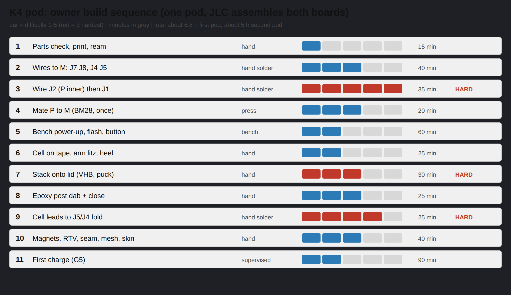

# Proof: buildability (K4 pod, owner assembles by hand)

Status 2026-10-08. Source: `docs/build/k4-assembly.md` (steps, checks), ECR-0023 add.2 (post + epoxy), `docs/diagrams/k4-assembly/`. Times are estimates [T], not measured: nothing is built yet. Verdict: buildable; **three steps are hard** and each has a cheap fix below.

## Split of work
- **JLC (reflow, both boards):** every SMD part on M and P, incl. BM28 J20/J21, mic, SW1, U1 QFN. Not JLC: pad J9 stays empty.
- **Owner:** wires to pads (reflow impossible, litz and cell leads), mate, cell, stack, close, charge.

## Build sequence (per pod)

| # | Step | Tools / consumables | Method | Diff | Min |
|---|---|---|---|---|---|
| 1 | Parts check: print tub/lid/pucks, ream mic bore D1.0, pin-gauge bore and M's hole (0.60 pass / 0.70 fail), dry-fit cell, check magnet pitch | FDM/resin printer, 1.0 reamer, pin gauges, calipers, compass | hand | 1 | 15 |
| 2 | Wires to M lid face: J7, J8 (litz), then cell leads J4, J5 (J5 last); leave J9 empty. Gate: no shorts, then 3.5-4.2 V | Iron 300 C, flux, wick, loupe, multimeter, tweezers, 7/44 litz | hand solder | 3 | 40 |
| 3 | Wires to P: J2 (inner face, before mate) then J1; joint under 0.4 mm high | same + Kapton | hand solder | **5** | 35 |
| 4 | Mate P to M: pin-1 dots, photo check, press once at the connector (BM28, 10 cycles, no key) | paint pen, phone camera, flat press tool | press | 3 | 20 |
| 5 | Bench power-up: DFU tack on R1, flash over dock pads, button test, gate G3 | bench supply 50 mA, USB dock head, dfu-util, tack wire | hand solder (tack) | 2 | 60 |
| 6 | Cell on 0.10 tape in tub; pull arm litz through heel exit; M1.4 set screw, RTV dot | transfer tape, hex key, neutral RTV, floss | hand | 2 | 25 |
| 7 | Stack onto lid: VHB ledge, 0.60 pin through bore, 30 N foam press 30 s, button puck by depth gauge, Kapton on U1 | die-cut VHB 4914, depth gauge, puck kit, foam | hand | 3 | 30 |
| 8 | Epoxy post dab (ECR-0023): 10 uL on post, close within 15 min, clamp 1 h | 30-min low-shrink epoxy, syringe, clamp | hand | 3 | 25 (+1 h cure) |
| 9 | Fold cell leads forward and solder to J5/J4 lead stubs; arm wires in 0.9 mm lane | iron, Kapton, tweezers | hand solder | 4 | 25 |
| 10 | Magnets (polarity), RTV at 4 dock windows, seam bead, hex mesh, skin over button | N52 D2.5, neutral RTV, mesh, silicone skin | hand | 3 | 40 |
| 11 | First charge G5: fire-safe bag, tile, thermocouple, USB meter, log every 5 min | bag, tile, logger | supervised | 2 | 90 |

Per-step Check / If-it-fails lines are in `docs/build/k4-assembly.md` sections 2-10; do not skip the gates.

## The 3 hardest steps and an easier alternative

1. **Step 3, J2 on P's inner face (diff 5).** Pad sits in a 0.6 mm gap, iron cannot reach after the mate, litz strands burn off enamel.
   - Alt A (recommended): **pre-tin J2 and the litz end under the microscope, then reflow with a hot-air or a hot bar on a 3D-printed holder** (a 0.5 mm slot fixture holds the wire flat). Cheap, FOSS print file.
   - Alt B: **change the board** so J2 sits on the outer face (ECR; cost: routing). Removes the step. This is the real fix; ask the owner.
   - Alt C: use a pre-crimped micro-wire/FFC stub JLC cannot fit; no.
2. **Step 9, folding cell leads to J5/J4 inside a closed-up tub (diff 4).** Two cell leads next to a live LiPo, tight space.
   - Alt A: **solder cell leads to J4/J5 in step 2 only, and never re-solder** (route the 8 mm leads in a service loop). Needs the cell pre-placed, so check lead length first.
   - Alt B: **order the cell with welded tab leads** from the supplier, so no iron touches the cell; the owner only makes a pad joint.
   - Do it on a ceramic tile, one lead taped at all times.
3. **Step 7, stack onto lid: the VHB press with the mic pin (diff 3 but misalign = rework).** Pad notches, mic tube and pin must line up at once.
   - Alt A: **printed alignment jig** (lid held in a cradle, M located on two pins). 
   - Alt B: ask JLC to supply the VHB die-cut on a **pre-registered carrier** (or laser-cut from a bought sheet by a service).
   - (Runner-up: step 4 BM28 reversed mate; the pin-1 dot rule handles it.)

## Tools (FOSS / cheap)

| Tool | Note |
|---|---|
| Iron with fine tip + flux + wick | any temperature-controlled, about 40-80 EUR |
| Loupe or USB microscope | needed for steps 2, 3, 9; about 50 EUR; viewer software FOSS (guvcview) |
| Hot-air station | alt for step 3 only; optional |
| Multimeter (diode, mA), bench supply 50 mA limit | about 30-60 EUR; supply in lab already |
| Pin gauges 0.60/0.70/1.0, calipers, depth gauge | about 30 EUR |
| 3D printer + build123d/OpenSCAD for jigs | all FOSS (build123d, repo CAD) |
| dfu-util, tools/env.sh | FOSS |
| Fire-safe bag, ceramic tile, thermocouple logger | safety, about 25 EUR |
| Consumables: litz 7/44, VHB 4914, tape, neutral RTV, epoxy, Kapton | per pod, a few EUR |

## Her total time
- Hands-on: about 405 min = **6.8 h for the first pod** (incl. 90 min supervised charge, 60 min bring-up), **about 5 h for the second** (mirror, learning curve gone). Add about 1 h epoxy cure wait and 24 h seam cure, unattended.
- Whole pair: about 12 h over 2-3 sessions. Rework budget: +30 percent.

## Open
- Cell lead exit position and wire gauge are [T] (k4-assembly.md open items).
- Pin 1 orientation of J20/J21 must be confirmed on silkscreen.
- Step 3 Alt B needs an ECR through `tools/plm.py impact`; not done here.
