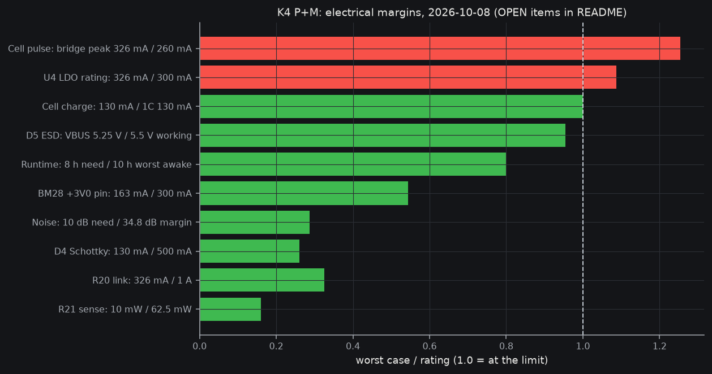

# K4 electrical proof (P + M boards), 2026-10-08

Question: are `hw/pod/k4/routed_{P,M}.kicad_pcb` (generator `hw/pod/k4/gen.py`, BOMs `bom_jlc_{P,M}.csv`) electrically possible?
Answer: **boards are connected and rule-clean; the +3V0 peak is not.** Two FAILs, one root cause: the bridge full-drive peak (326 mA) exceeds the K4 cell's pulse rating (260 mA) and the U4 LDO's 300 mA rating. Fix candidate already in the repo: 12 ohm exciter (about 226 mA), ECR-0005 (proposed).

**Lead check 2026-10-08:** both FAILs are full-drive hardware peaks with no firmware limit. The firmware already clamps the bridge (FWSIM-R64, fw/variants.yaml `bridge`, tested by fw/test/test_clamp.c and prop_ceiling.c): i_peak_max = min(0.8 x cell pulse, 0.9 x U4) = min(208, 270) = **208 mA** for the K1_130 cell. With the clamp, rows 2 and 4 **PASS** (cell 80 %, U4 69 %). The cost is loudness: the clamp holds the drive at about 208/315 of full scale (about -3.6 dB of peak level). A 12 ohm exciter (ECR-0005, closes on bench E1) would raise the unclamped headroom. Open: confirm the clamp holds on the bench (G-stage current probe).

Status: PASS = met with margin from a source; FAIL = exceeded; OPEN = no K4 evidence yet. Source paths are repo-relative.

| # | Check | Worst case vs limit | Status | Source | Date |
|---|---|---|---|---|---|
| 1 | Runtime vs cell (ICP401230UPR, Renata 130 mAh Li-polymer) | avg 5.0-9.8 mA awake; 130 mAh gives about 10-16 h with LED vs 8 h spec (scaled from the 175 mAh model, not re-simulated) | PASS | docs/system/sub-power.md l.171-181; docs/research/k1t-vs-k4-parity.md | 2026-10-08 |
| 2 | Cell pulse | bridge peak 326 mA vs 260 mA (2C "non-continuous", duration unstated) = 125 % unclamped; 208 mA with the FWSIM-R64 clamp = 80 % | **PASS (fw clamp)** | fw/variants.yaml K1_130; docs/research/drastic/V2-cells.yaml l.82; tools/checks/interfaces.py (run today, r2 loads: +3V0 peak 326 mA) | 2026-10-08 |
| 3 | Cell charge | 130 mA at ICHG code 40 vs 1C = 130 mA (0 % margin; owner question on a 65 mA cap open) | PASS (at limit) | docs/system/sub-power.md l.146 | 2026-10-08 |
| 4 | +3V0 rail load (U4 TPS7A2030, TI 300 mA 3.0 V ultra-low-noise LDO) | 326 mA unclamped vs 300 mA rated; 208 mA + ~11 mA other loads with the clamp = 73 % | **PASS (fw clamp)** | docs/system/rail-budget.yaml; interfaces.py rails WARN; sub-power.md PWR-I1 | 2026-10-08 |
| 5 | +3V0 dropout | holds at 315 mA while VBAT >= 3.32 V (dropout 140 mV at 300 mA + path drop). Below that the bridge sags (function, not safety). Cell sag at 260 mA <= 88 mV (max R) | PASS (derived), OPEN at low SOC | sub-power.md l.158; V2-cells.yaml l.108 | 2026-10-07 |
| 6 | +3V0 and VSYS ripple (K4 nets) | Bound = |Z|(f) x bridge peak 208 mA (clamped), ngspice AC of K4 caps (C4/C7 10u, C14 22u on +3V0; C21 10u on VSYS; cell 0.34 ohm Rint, R21 0.1 ohm). +3V0: 17-39 mV pk at 40 kHz (kd 1..0.5 cap derating, LDO Zout 0.2..2 ohm), 4-8 mV at 200 kHz, 1 mV at 2 MHz. VSYS: 53-65 mV pk at 40 kHz, 16-29 mV at 200 kHz, 3-4 mV at 2 MHz. Mic-rail effect stays the 8.72 uV rms LN-M05 / 34.8 dB (row 8) because R30/C filter and mic PSRR sit after. U4 Zout curve is not in SBVS338H (assumed R\|\|1 uH), kd is an estimate until A-CAP-CURVES; bound is a peak-current sine, not a loop sim | PASS (bound), OPEN (U4 Zout bench, G-stage scope) | sim/proof/k4_rail_ripple.cir (ngspice 45, run 2026-10-08); sim/noise/params.yaml esr; V2-cells.yaml | 2026-10-08 |
| 7 | VDD11 (MCU core SMPS, D11 the one allowed switcher) | L1 DFE201610E-2R2M (Murata 2.2 uH): Isat 2.4 A (Murata), ST needs > 0.5 A; core load not budgeted in rail-budget.yaml | PASS (rating), OPEN (load figure) | docs/system/sub-processing.md l.36; rail-budget.yaml VDD11 | 2026-10-08 |
| 8 | Mic supply noise: F02 SMPS to MIC_VDD vs 10 dB sign-off | worst-PSRR corner margin 34.8 dB abs-bound on the re-routed boards (26.4 dB / 26.2 dB for the default / thin_outer stack in ECR-0020 rev 5 text; both >= 10) | PASS | sim/noise/out_k4/k4_noise.json; `k4_noise.py --gap 0.6` re-run today, output byte-identical (cmp) to the 07:39 file; ECR-0020 l.28, l.124 | 2026-10-08 |
| 9 | Mic data/clock crosstalk vs 100 mV | MIC_DATA 62.6 dB, MIC_CLK 64.1 dB abs-bound margin (bridge: 82/88 dB) | PASS | k4_noise.json (with_L1_body) | 2026-10-08 |
| 10 | BM28 (Hirose 0.35 mm B2B, 30 pins) current | +3V0 on pins 15/30 plus 4 power tabs: 326 mA over 2 pins = 163 mA/pin vs 0.3 A per contact [tentative, secondary source] = 54 %. Mic VDD 1.35 mA | PASS | docs/system/integration-map.md l.218; pin-contract.yaml k4_split | 2026-10-08 |
| 11 | BM28 SI on MIC_CLK / data | Simulated (ngspice, 6-section LC lines, Z0 70 ohm assumed from 0.09 mm trace on ~0.1 mm prepreg, IPC-2141 microstrip; 6.9 ps/mm; BM28 1 nH + 0.3 pF): MIC_CLK 1.8 V, 2 ns edge, 33 ohm R2, 12.5 + 7.1 mm: overshoot 1.88 V (+4 %), settles clean. Neighbour I2C_SCL (4.7k pull-up, 3.0 V, GND pin between; Cm 0.2 pF, k 0.2 assumed worst): +/-68 mV vs VIL 0.9 V. Checkerboard map (gen.py l.383-389) puts GND on both row neighbours of MIC_CLK (pins 2, 4) and MIC_DATA (22 and 20 beside LED_K). Lines 19.6 mm and 19 mm (M MIC_DATA) are far shorter than edge length (2 ns = 290 mm). Connector parasitics assumed (no Hirose model) | PASS (simulated, assumed parasitics), OPEN (TDR on a bench coupon) | sim/proof/k4_bm28_si.cir; pcbnew track lengths; hw/pod/k4/gen.py l.383 | 2026-10-08 |
| 12 | USB FS (12 Mb/s) through BM28 pins 11/13 | pcbnew lengths: P D+ 4.65 mm / D- 4.57 mm, M D+ 8.49 / D- 7.16 (0.09 mm tracks, 1 via each, GND pins 12/14 both sides); on-board total D+ 13.1 mm, D- 11.7 mm, skew 1.4 mm = 10 ps (6.9 ps/mm) vs 12 Mb/s bit 83 ns; no stubs (ESD U6 TPD2E2U06 in-line at the contacts, gen.py l.305). Dock wires 27-42 mm (physical.md l.181). FS edges are 4-20 ns (rise 4 ns => critical length ~ tr/6 / 6.9 ps/mm ~ 97 mm), so the whole path (<= 55 mm with wires) is lumped; FS has no board impedance spec (90 ohm differential is the HS/cable figure, uncoupled 70 ohm single-ended here, no effect at FS). Spec limits cited from USB 2.0 spec section 7.1.2 / 7.1.6 (2000-04-27) from memory, not fetched this session: confirm | PASS (analytic) | pcbnew on routed_{P,M}.kicad_pcb; pin-contract.yaml | 2026-10-08 |
| 13 | Clock: LSE 32.768 kHz Y1 (7 pF) with C11/C12 8.2 pF | CL = 8.2 x 8.2 / 16.4 + stray (~3 pF) = ~7 pF; matches Y1. No HSE (internal oscillator) | PASS (analytic), bench confirm | bom_jlc_P.csv; docs/research/A3-clock-and-peripherals.md | 2026-10-08 |
| 14 | DRC (kicad-cli pcb drc, JLC 6L rules) | P: 0 violations, 0 unconnected; M: 0 / 0 | PASS | `kicad-cli pcb drc` run today on routed_P / routed_M | 2026-10-08 |
| 15 | ERC (SKiDL, gen.py) | 0 errors, 15 warnings (unconnected-by-design nets LDO_OUT/VBUS/VBAT, VLXSMPS pin type) | PASS | hw/pod/k4/gen.erc | 2026-10-08 |
| 16 | tools/checks/interfaces.py on K4 | since 56cf4fd it runs on K4 (ULTRASONIC_DESIGN=k4): mic-port, switch, outline, inside, clamp-bands (ledge), heights (37 parts), board-nets PASS; pins WARN (known ECR-0013 hazards); rails WARN uses unclamped peaks and the old 175 mAh cell pulse rating (350 mA), not K4's 130 mAh (260 mA): checker gap, fw clamp covers it (row 2); frame FAIL = vision line (parked for the pen test) | PASS with 1 checker gap | ULTRASONIC_DESIGN=k4 python3 tools/checks/interfaces.py, run by lead 2026-10-08 | 2026-10-08 |

## Part ratings vs worst case

| Part | Worst case | Rating | Margin | Status | Source |
|---|---|---|---|---|---|
| U4 TPS7A2030 | 219 mA clamped (326 unclamped) | 300 mA | +27 % | PASS (fw clamp) | row 4 |
| R20 0 ohm 0402 link | 326 mA | 1 A (2 A overload) | 3x | PASS | rail-budget.yaml (Uni-Royal 2019-02-26) |
| R21 0.1 ohm 0402 sense | 10 mW (315 mA) | 62.5 mW (0402 generic) | 6x | PASS | computed |
| R30 33 ohm 0402 mic filter | 1.35 mA: 60 uW; drop 45 mV | 62.5 mW | >1000x | PASS | sub-audio-in.md l.134 |
| D4 PMEG3005EL (Nexperia 30 V 0.5 A Schottky) | 130 mA charge | 0.5 A / 30 V | 3.8x | PASS | sub-dock-usb.md l.44 |
| D5 TPD1E10B06 (TI ESD diode) | VBUS 5.25 V | 5.5 V working | 5 % | PASS (thin) | sub-dock-usb.md l.42 |
| U6 TPD2E2U06 (TI USB ESD) | 5 V | 5.5 V | 10 % | PASS | sub-dock-usb.md l.45 |
| Q1/Q2 PMCXB290UE (Nexperia 20 V N+P pair) | 3.0-4.2 V, 315 mA | 20 V (current rating not in repo) | 5x V | PASS V, OPEN I | sub-output.md l.52 |
| L1 Murata 2.2 uH | core SMPS | Isat 2.4 A | see row 7 | PASS | sub-processing.md l.36 |
| BM28 contacts | 163 mA | 0.3 A | 46 % | PASS | row 10 |
| C9 2.2 uF 10 V X5R 0201, C17 1 uF 16 V 0201 (DC-bias derating) | 1.1 V / 4.5 V | Samsung curve not fetched (site blocks automated download; Murata SimSurfing also browser-only, queue.yaml A-CAP-CURVES, 2026-10-08): owner-download | n/a | OPEN (owner-download, A-CAP-CURVES) | docs/brief/queue.yaml |
| C14 22 uF 0603, C15 4.7 uF 25 V, C16 2.2 uF 10 V, C21 10 uF (on VBAT/VBUS, <= 5.5 V) | <= 5.5 V | voltage ratings not in the BOM names for C14/C21 | n/a | OPEN (owner-download, A-CAP-CURVES; ripple row 6 brackets kd 0.5..1) | bom_jlc_{P,M}.csv |

## What closes the FAILs and OPENs
1. Rows 2 and 4: choose the exciter resistance (12 ohm gives about 226 mA, under both limits) or accept the cell overrun after asking Renata for pulse duration; owner decision via ECR-0005. Then re-run `interfaces.py` with the K4 cell (260 mA) as the VSYS rating.
2. Row 16 (K4 rail checker) and the maker DC-bias curves (A-CAP-CURVES, owner download) remain. Rows 6, 11, 12 closed analytically/by sim 2026-10-08.
3. Row 11: TDR on a bench coupon only if the mic clock edge gets faster than R2 allows.
