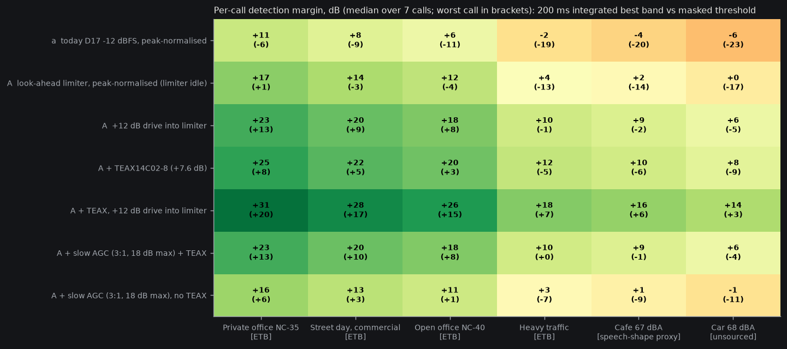

# Audibility reconciled: per-call, temporally integrated (2026-10-08)
Script `sim/acoustics/audibility_reconciled.py` (3G fence), data `sim/acoustics/out/audibility_reconciled.json`, plot below. Same programme, chain, calibration, masked threshold (max(q, ambient-4 dB)) and ambient spectra as `programme_audibility.py`; only the detection metric and the limiter/AGC models change.

## Method (why this metric)
- Programme `sim/out/nature/2_translated_only.wav` (Port Meadow bats, algo B, calls = 75 dB SPL at mic: assumption), resampled to 12.5 kS/s. 7 call events found (frames within 20 dB of loudest, merged across gaps < 0.3 s).
- **Detection level per call = max over the call of the 200 ms sliding rms in each 1/3-octave band** (1.6-4 kHz), best band vs its masked threshold. Basis: threshold of a tone burst falls ~10 dB per decade of duration up to ~200-300 ms (Plomp & Bouman 1959, JASA 31:749; abstract fetched 2026-10-08: exponential build-up, time constant ~375 ms at 250 Hz falling to ~150 ms at 8 kHz, so ~200 ms at 1.6-4 kHz; Nabelek 1978 confirms the exponential holds roughly 10-1000 ms for masked thresholds, per secondary summary); time-varying loudness (ISO 532-1:2017 / Moore-Glasberg-Baer) integrates over ~100-200 ms [recall]. Not the long-term LAeq (dilutes by silence) and not the peak (shorter than the ear's window). A 0.1 s call (event 2) is correctly diluted by 3 dB, hence the worst-call column.
- **Limiter** = numpy port of `fw/core/lahead.c` (3-sample look-ahead, soft knee at `lim_knee_pct` 70% of ceiling, 60 ms release) and a legacy instant-attack peak limiter for (a). **AGC** = my model: 1.25-5 kHz envelope, attack 20 ms / release 400 ms, 3:1, max +18 dB, then peak-normalised to ceiling and the A limiter. Not in fw.

## Findings on the crest factor
| | whole file | call peak over its 200 ms integrated level |
|---|---|---|
| A, peak-normalised | 20 dB | **13.6 dB** |
| A, +12 dB drive into limiter | 13.8 | 8.6 |
| A, AGC | 20.6 | 14.7 |
- The ear-relevant crest is **~14 dB**, not 6 (requirement doc) and not 22.6 (programme doc). Whole-file crest includes silence between passes and is irrelevant to detection.
- **Option A's limiter does nothing at "volume just reaches the ceiling"** (gain 1; crest 20.0 vs 21.3 for (a), it is idle). Its only crest effect appears when the user volume exceeds the ceiling: +12 dB drive compresses call crest 13.6 -> 8.6 dB, but the in-call peaks are soft-limited, so the limiter buys only ~+5 dB of 200 ms level for +12 dB of drive and background noise rises +12 dB (bg -47 -> -35 dBFS). It is a safety ceiling, not a loudness tool.
- **AGC** lifts quiet calls (worst call +5 dB, +13 vs +8 with TEAX) but cannot raise the loudest call (already at ceiling) and lifts the between-call noise floor by 9 dB (bg -47 -> -38 dBFS). Helps weak calls, not the median.

## One table: per-call detection margin (dB over masked threshold, median over 7 calls (worst call))
| Option | Priv. office NC-35 (39 dBA) | Street day (42) | Open office NC-40 (44) | Heavy traffic (52) | Cafe 67 [speech-shape proxy] | Car 68 [unsourced] |
|---|---|---|---|---|---|---|
| (a) today, -12 dBFS | +11 (-6) | +8 (-9) | +6 (-11) | -2 (-19) | -3.6 (-20.4) | -6 (-23) |
| (A) limiter, volume at ceiling | +17 (+1) | +14 (-3) | +12 (-4) | +4 (-13) | +2.5 (-14.1) | 0 (-17) |
| (A) +12 dB drive | +23 (+13) | +20 (+9) | +18 (+8) | +10 (-1) | +8.6 (-2.1) | +6 (-5) |
| (A) + TEAX14C02-8 | +25 (+8) | +22 (+5) | +20 (+3) | +12 (-5) | +10.1 (-6.5) | +8 (-9) |
| (A) + TEAX, +12 dB drive | +31 (+20) | +28 (+17) | +26 (+15) | +18 (+7) | +16.2 (+5.5) | +14 (+3) |
| (A) + slow AGC + TEAX | +23 (+13) | +20 (+10) | +18 (+8) | +10 (0) | +8.6 (-1.5) | +6 (-4) |
| (A) + slow AGC, no TEAX | +16 (+6) | +13 (+3) | +11 (+1) | +3 (-7) | +1.0 (-9.1) | -1 (-11) |
Margin > 0 means the call is detectable; **listening comfort wants ~+8 headroom over the ambient band** (requirement doc, [recall] basis), which is a smaller number than the margin here by about 4 dB (masking is ambient-4): median headroom over ambient for A + TEAX is +21 / +18 / +16 / +8 / +6 / +4 dB. So: A + TEAX meets the +8 target for the median call up to heavy traffic; the cafe/car cases and every worst call need drive or AGC on top. Today's (a) is audible in offices/street for the median call only.

## Which doc was wrong
- **programme-audibility.md (86f478d): wrong, and the more wrong of the two.** It compared the mean of per-band *long-term* active-frame rms (which averages silence, weak bands and 0.1 s frames) against the masked threshold, and judged "fails everywhere" by that. Detection is per call, with ~200 ms integration, in the best band. Its 22.6 dB crest compounds the error. (Its chain, calibration and ambient spectra are reused here unchanged and stand.)
- **audibility-requirement.md (c95fb0b) sections 2-4: wrong** (rms = peak - 6 dB crest, then +8 dB headroom against a long-term rms): real call crest is ~14 dB, so those sections overstate by ~8 dB for the whole-call level. Its section 0 (real programme, 2.5 kHz call-active) is the closer of the two and its A + TEAX verdict survives for the median call, but its levels are call-active rms, not integrated per-call; treat section 0 as supersession and sections 2-4 as superseded.
- The 14-17 dB gap = metric (long-term mean-band vs per-call best-band, ~11 dB: includes silence dilution, band selection, 200 ms vs 100 ms-frame rms) + crest 6 vs ~14 dB assumption (~8 dB).

## Open
Call level 75 dB SPL at mic is assumed (all margins shift 1:1); eq. SPL +-10 dB; Bl 2.4 vs 1.0 unmeasured (E1); best-band detection ignores multi-band spread and is optimistic by 1-3 dB; car spectrum (and its 68 dBA) STILL UNSOURCED: no open 1/3-octave or octave cabin table at 60-100 km/h was reachable (Staneva et al., Transp. Probl. 18(2) 2023, DOI 10.20858/tp.2023.18.2.06, has cabin octave spectra only as figures/4th-order fits; ETSI EG 202 396-1 and Acta Acustica 2023 aacus220057 were blocked) - needs a paywalled/ETSI fetch by the owner. Cafe is a proxy, not a measured cafe spectrum: shape = ANSI S3.5 normal-effort speech octave levels 45/55/65.3/69/63/55.8/49.8/44.5 dB (63-8k Hz) per Odeon Application Note Restaurants (odeon.dk, fetched 2026-10-08), level 67 dBA = lowest occupied-venue mean in the RWTH Aachen restaurant logging study (publications.rwth-aachen.de/record/772183, 67-77.8 dBA, fetched 2026-10-08), i.e. a quiet-end case; busy restaurants are 5-10 dB louder. Cafe margins moved <1 dB vs the unsourced 65 dBA row (shape change offset the +2 dB level). ISO 532-1 integration still from memory; limiter drive/AGC artifacts need a listening test and bench THD.
