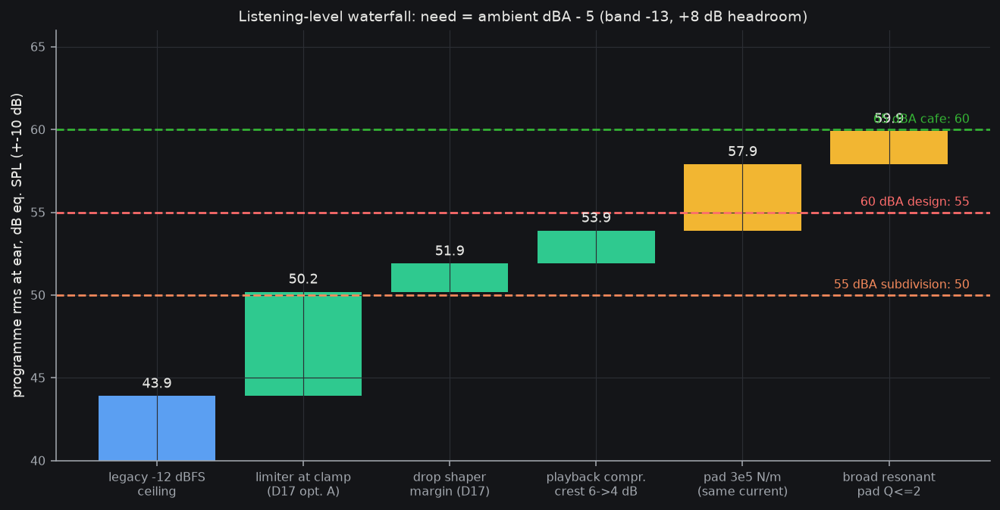

# Audibility requirement for AUDIO PLAYBACK in day-to-day life (2026-10-08, rewritten after owner correction)
Owner: "it's an audio device not an alert system." The device plays the shifted/compressed ultrasonic scene as listening audio (spec §1.1; DSP chain ends `volume -> safety ceiling` at 12.5 kS/s, spec L66). The 2-3 kHz alert-tone move (`alert_hz`) is system-sound only and is NOT counted here. Sources: [repo] = read today; [recall] = from memory, not re-fetched (no web check run), verify before external citation.

## 1. Requirement
**Design ambient 60 dBA (daytime). Programme (playback) rms at the ear >= ambient dBA - 5 = 55 dB eq. SPL, clean (THD+N <= -40 dB), central estimate, +-10 dB.** Stretch 65 dBA (cafe/shop): 60. Subdivision walk at 55 dBA: 50. Car (65-72) and arterial street are out of scope.

Ambient places (dBA): residential outdoor day 50-55 (EPA Levels Document 1974, EPA 550/9-74-004; WHO Community Noise 1999: 55 serious / 50 moderate annoyance) [recall]; subdivision with passing cars 50-60 Leq, passing car 60-70 LAmax [recall, ISO 1996-1:2016 method]; office 45-55, open plan to 60 (ASHRAE Applications ch.48) [recall]; cafe/shop 60-70 (restaurant measurement studies, Lombard literature) [recall]; car 65-72 at highway speed [recall].

**Listening headroom (replaces the 10-15 dB alert rule):** the programme must sit about +8 dB (range +4 to +10) over the ambient in the same 1.5-4 kHz band. Basis [recall]: preferred listening levels in noise sit about 6-10 dB over the background (Airo et al. 1996, Hodgetts et al. 2007 Ear & Hearing); real-life listening SNRs about +5 to +10 dB (Smeds et al. 2015 JAAA); sentence intelligibility is near ceiling by about +4 to +6 dB SNR (Plomp 1986; ANSI S3.5 SII). +4 = "follows it", +8 = target, +10 = enjoyable. Ambient in band = dBA - 13 (range -11 proof, -18 traffic typical). So need = dBA - 13 + 8 = **dBA - 5** (range dBA - 9 to dBA + 0).

## 2. Max CLEAN level at her ear (repo chain; central 2.5 kHz, nominal, front site)
Force at the 208 mA clamp (0.635 of Vdd diff): 94.5 dB re 1 uN; corrected central eq. SPL **58** for a full-scale sine (R-loudness-conflict, band 48-68).
| Ceiling | Peak (sine) eq. SPL | Programme rms (crest 6 dB; chirps are 3-12 dB under sine [repo]) | THD+N [repo C3-output-stage.md] |
|---|---|---|---|
| -12 dBFS (D17 now, 0.251) | 49.9 | **43.9** | -52 dB @12.5 ns dead time; -38 @25 ns (no compensation) |
| limiter at clamp minus shaper excursion (0.520, D17 option A, `lim_lookahead=1`) | 56.3 | **50.3** | not modelled: model stops at -12 dBFS; signal current 2.1x larger, dead-time error grows with level (-61 @-40 dBFS to -52 @-12), my extrapolation -45 +-5 dB (assumed) |
| clamp itself (0.635) | 58 | 52 | extrapolated -43 +-5 |
"Clean" = THD+N <= -40 dB (assumed; the exciter's own distortion is likely larger, C3 note). It passes at 12.5 ns dead time, fails at 25 ns uncompensated at the ceiling (-38). Bench: THD at the clamp on the real bridge (E-series current probe + FFT), not modelled.

## 3. Verdict vs ambient (programme rms, margin = delivered - need)
| Ambient | Band | Need (+8; +4..+10) | Legacy -12 dBFS 43.9 | Limiter 50.3 |
|---|---|---|---|---|
| Quiet room 35 | 22 | 30 | +14 | +20 |
| Office 50 | 37 | 45 (41-47) | -1 (+3..-3) | +5 (+9..+3) |
| Subdivision 55 | 42 | 50 (46-52) | -6 (-2..-8) | **+0 (+4..-2)** |
| **Design 60** | 47 | **55 (51-57)** | -11 | **-5 (-1..-7)** |
| Cafe/shop 65 | 52 | 60 (56-62) | -16 | -10 (-6..-12) |
Honest read: today's -12 dBFS ceiling gives quiet room and a quiet office only. The limiter makes office comfortable and a 55 dBA subdivision just adequate; 60 dBA and beyond need force-per-amp, not more current (current is pinned by the clamp and the THD ceiling).

## 4. Cheapest combination (cumulative programme rms, central)

| # | Step | dB | Cost | Size | Thermal / battery | Bench |
|---|---|---|---|---|---|---|
| 0 | Legacy -12 dBFS | 43.9 | - | - | - | - |
| 1 | `lim_lookahead=1` (fbfb38b; D17 option A) | +6.3 -> 50.2 | 0, fw | 0 | current doubles for +6 dB (see below) | owner re-signs golden vectors + D17; THD at the ceiling |
| 2 | D17: ceiling = clamp (drop 1.7 dB shaper margin) | +1.7 -> 52.0 | 0 | 0 | +1.7 dB current | fwsim: shaper never exceeds clamp; THD |
| 3 | Playback compression: crest 6 -> 4 dB (log-compression mode B is already the intended main mode, spec L222; limiter-aware makeup) | +2 -> 54.0 | 0, fw tuning | 0 | rms current up 2 dB | listening test: pumping/artifacts |
| 4 | Pad stiffness 3e5 N/m (loudness.md lever 3) | +4 -> 58.0 | ~0 (durometer/geometry) | 0 | **lowers** current for equal level | E1 force vs drive, 1 N preload |
| 5 | Broad resonant pad, Q <= 2 (narrow Q colours playback) | +2 -> 60.0 | small tooling | 0 | as 4 | E1/E2 sweep |
| 6 | **Tectonic TEAX14C02-8** (14 mm round exciter; Bl 2.4 T m, 7.8 ohm, 14 dia x 9.85 mm, 7.50 EUR; R-exciter2.md 481fa69): +7.6 dB vs assumed Bl 1.0, same clamp current so same THD | +7.6 -> 67.6 (or 65.6 without step 5) | 7.50 EUR/pod; bench-only buy (O21) | pad-size/thickness cost at the tragus (9.85 mm deep, 14 mm dia), not pod thickness; comfort test on her | lets steps 4-5 be dropped for the same level, or halves current at equal level (runtime) | band flatness is a vendor claim only: measure force vs f 1.5-4 kHz, Bl, comfort on tragus (E1) |
| opt | Other exciters: BCE-1 Bl unpublished (0..+6), BCT-3 does not fit | - | - | - | - | - |
=> **With the TEAX14C02-8 (step 6) the force-per-amp lever is a purchased part: steps 1+2+3+6 = 54.0+7.6 = 61.6 (+6.6 over the 55 need at 60 dBA, covers 65 dBA cafes at 60 need +1.6) with no pad work; with pad steps 4-5 as well 69.6 (spare dB = lower current, longer runtime).** Software-and-pad-only fallback: **Minimal: steps 1+2+3+4 = 58.0 vs 55 need at 60 dBA (+3, band -7..+13). Meets subdivision/office/shops at 60 dBA; 65 dBA cafes need step 5 (60.0) plus luck or Bl.** Rejected: clamp to 270 mA (+2.3 dB, breaks the 260 mA cell pulse rule, worse THD); 12 ohm (no volume); BCT-3 (44x32 mm, does not fit); B-loud's +15.5 and tragus 10 dB bonus (conflict doc).

**Thermal / battery at the clamp (docs/proof/thermal row 8):** rms playback current at 50.3 dB (6 dB under the 147 mA clamp sine) is about 74 rms, ~60 mA mean|i| from the 3.0 V LDO U4: ~72 mW at 1.2 V drop docked, +12 K at theta-JA 166 K/W (cap 125 C: fine). The problem is runtime: the rail budget carries 2.5 mA average for the exciter; sustained loud playback at 60 mA with ~9 mA base is ~2 h on a 130 mAh cell. Each +6 dB of force per amp (steps 4-5, Bl) halves that current, which is the second reason to prefer force-per-amp levers over more drive. Cell stays inside its 260 mA pulse rule (clamp 208).

## 5. Open (bench)
(a) THD+N at the clamp on the real bridge; (b) force vs current, pad stiffness, Bl (E1); (c) masked-listening test on her: scene playback under 55/60/65 dBA recordings, adaptive level to "comfortable", logging drive current; one afternoon settles the +8 target, the band tilt and eq. SPL uncertainty (+-10 dB) together; (d) program crest of real bat/house material; (e) U4 temp and battery current log (PWR-I12).
