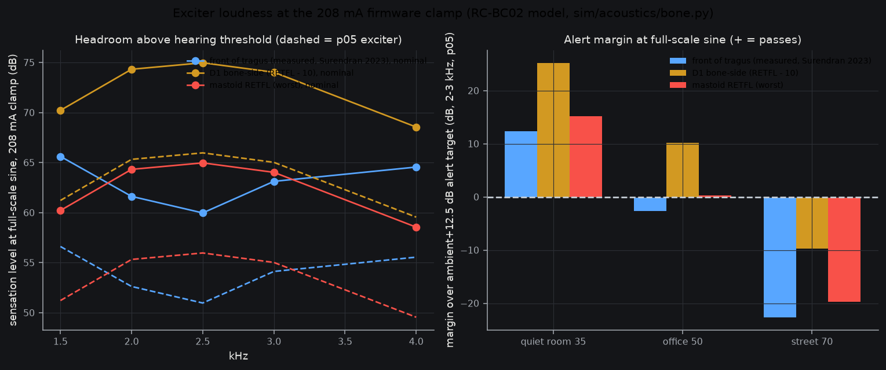
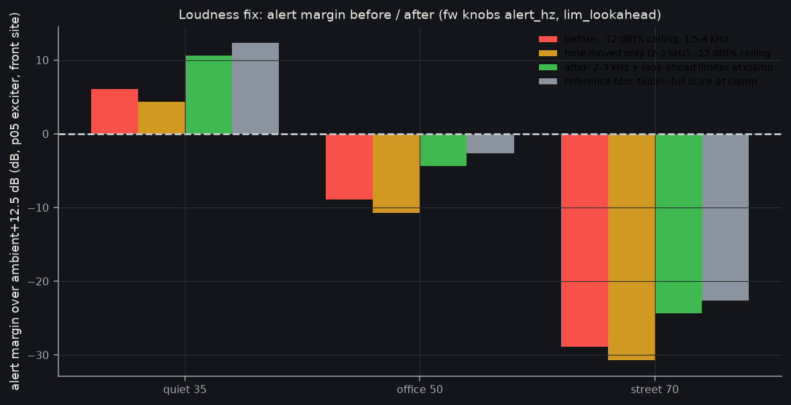

# Loudness proof: will the exciter sound okay at the 208 mA clamp? (2026-10-08)

**Verdict: yes in a quiet room and an office; no on a street.** Full-scale sine, p05 (soft-coupled) exciter, front-of-tragus threshold: alert margin over ambient+12.5 dB is **+11 to +20 dB at 35 dBA, -5 to 0 dB at 50 dBA (marginal; nominal exciter +4 to +9 dB), -20 to -25 dB at 70 dBA (fails, about 10 dB short even at nominal and best placement)**. Script: `loudness.py`; plot: `loudness.png`.

## Chain (every number sourced)
| Step | Value | Source |
|---|---|---|
| Unclamped bridge peak | 3.045 V / (8 + 1.3) ohm = 327 mA | fw/variants.yaml `bridge` (vdd, r_exciter lo, r_path) |
| Clamp | 208 mA = 0.8 x cell pulse (K1_130 260 mA); **-3.9 dB** vs 327 mA | FWSIM-R64; proof README row 2 |
| Exciter terminals at clamp | 1.66 V peak, 1.18 V rms (208 mA x 8 ohm); bridge differential 1.93 V; **173 mW** (full drive 397 mW) | I^2 R / 2 |
| Force per volt (RC-BC02 model) | 94.0 / 94.1 / 93.9 / 93.7 / 93.9 dB re 1 uN/V at 1.5 / 2 / 2.5 / 3 / 4 kHz (p05 about 9 dB lower, p95 about 7 dB higher) | sim/acoustics/out/bone_results.json `F_level_db_re_1uN_per_V_terminal`; Bl 1 N/A **assumed** (retire on bench E1) |
| Force at clamp, 1.18 V rms | **96.7 / 95.3 / 94.5 / 94.0 / 94.1 dB re 1 uN** | per-volt + 20 log 1.18 |
| Cross-check | Aeropex headset 100.5 dB re 1 uN/V at 2 kHz (Surendran 2023 Fig 2B) vs model 93.9: the model is about 7 dB **conservative** | bone.py `aeropex_anchor` |
| Threshold, front of tragus (measured, n=21, SD 6-9 dB) | 31.1 / 33.7 / 34.5 / 30.9 / 29.5 dB re 1 uN | Surendran 2023, shared-params `front_measured` |
| Mastoid RETFL (ISO 389-3) | 36.5 / 31.0 / 29.5 / 30.0 / 35.5 dB re 1 uN | Henry & Letowski 2007, shared-params |
| Sensation level (SL) at clamp, nominal, front site | 65.6 / 61.6 / 60.0 / 63.1 / 64.6 dB; D1 bone-side (RETFL-10) 68-75; mastoid worst 58-65. Pessimistic p05 exciter: 51-57 dB (front) | force - threshold |

D1 site (1-1.5 cm in front of tragus) likely lies between "front" and "mastoid"; bone-conduction.md predicts 10-15 dB less isolation and about 10 dB less sensitivity than a touching tragus pad. Contact force 1-2 N costs a few dB (bone-conduction.md s4); the force ceiling from pad lift-off at 0.3 N is 106 dB, above our 97 dB, so no clipping.

## Versus ambient (the "predict if it sounds okay" step)
Method: SL + air threshold (ISO 226, about -1 to -6 dB SPL at 2-4 kHz) = equivalent eardrum SPL (an estimate, +-10 dB). Ambient level in the 1.5-4 kHz band **assumed** dBA - 11 (typical spectra fall off with frequency); alert wanted at ambient band + 12.5 dB (10-15). Masked-detection margin is ignored (conservative toward "audible").

| Ambient | Alert needs (eq. SPL) | Device delivers (front site, p05 / nominal) | Margin p05 / nominal |
|---|---|---|---|
| Quiet room 35 dBA | 36.5 dB | 47-57 / 56-66 | +11 to +20 / +20 to +29 |
| Office 50 dBA | 51.5 dB | 47-57 / 56-66 | -5 to +5 (avg -1) / +4 to +14 |
| Street 70 dBA | 71.5 dB | 47-57 / 56-66 | -25 to -15 / -16 to -6 |

Best case (D1 closer to tragus, RETFL-10): +10 dB office-to-street improvement; street still -7 to -17 dB at p05.

## What it plays
Bat calls and alerts are a 1.5-4 kHz band, in practice a few hundred ms chirps at under full-scale rms (a chirp or noise-like mix has an rms of 3-12 dB under the full-scale sine used above; **assumed, no program-level spec**). Real usable margin is therefore **3-12 dB lower** than the table for bat calls; full-scale is only reachable for pure-tone alerts. Quiet room: fine at any level. Office: alerts OK, bat calls need near full scale. Street: neither works; the clamp is not the main cause (street needs +20 to +25 dB; the clamp costs 3.9 dB).

## Cheapest fixes (owner decides)
1. **Firmware (free), recommended first.** Put alert energy at 2-3 kHz where SL peaks and spend headroom on a compressor/limiter-aware gain so chirps reach clamp peak (a limiter may add up to +6 to +10 dB of rms). Raising the clamp to the LDO limit (0.9 x 300 = 270 mA) gives +2.3 dB but breaks the cell rule (260 mA pulse): not recommended.
2. **12 ohm ECR-0005: no loudness gain at the clamp.** The clamp is a current limit and force follows current (Bl x I), so 12 ohm only shifts where the clamp bites (unclamped peak 229 mA vs 327 mA); it cuts rail/cell stress, not volume. It needs the clamp to stay, and Bl per ohm unknown (E1).
3. **Resonance/pad tuning.** Model `levers`: pad stiffness 3e5 N/m gives +4 dB at 3 kHz vs the nominal 1e6; the exciter f0 (350 Hz nominal) sits far below the band, so a stiffer-pad or a higher-f0 exciter that resonates at 2-3 kHz could add 6-10 dB (Q 1.5-8). Needs E1/E2 measurements.
4. **Different exciter with more Bl (N/A)** is the only route to street-level alerts (+20 dB); the Aeropex-like Bl would give about +7 dB for free, if the RC-BC02 is as strong as its datasheet class (unverified).

Open: Bl, f0, true threshold at the D1 site (E1, E2); program rms of bat-call playback; ambient band-spectrum assumption (-11 dB).

## Firmware fix: before / after (2026-10-08)
Script `loudness_fw.py`, plot `loudness_fw.png`. Same chain as above (front site, p05 exciter, ambient band = dBA - 11, target +12.5 dB, mean over the alert band).

**Finding:** the shipped output stage's true-peak ceiling is -12 dBFS (0.251 of Vdd, knob `ceiling_cdb`, hard max -1200), which is **8.1 dB below** the 0.635 clamp that the tables above assume. So the real "before" is worse than the table.

| Alert margin (dB, p05 / nominal) | Quiet 35 dBA | Office 50 dBA | Street 70 dBA |
|---|---|---|---|
| Before: -12 dBFS ceiling, band 1.5-4 kHz | +6.1 / +15.1 | -8.9 / +0.1 | -28.9 / -19.9 |
| Tone to 2-3 kHz only (still -12 dBFS) | +4.3 / +13.3 | -10.7 / -1.7 | -30.7 / -21.7 |
| **After: 2-3 kHz + look-ahead limiter at the clamp** | **+10.6 / +19.6** | **-4.4 / +4.6** | **-24.4 / -15.4** |
| Reference (table above, ideal full scale at clamp) | +12.4 / +21.4 | -2.6 / +6.4 | -22.6 / -13.6 |

Net gain +4.5 dB (after - before; the band mean already sat near 2-3 kHz, so the tone move alone is -1.8 dB against the 1.5-4 kHz mean, which includes the 1.5 kHz point); the limiter supplies +6.3 dB. The limiter ceiling is the R64 clamp (0.6353) minus the noise-shaper excursion bound (0.1150) = 0.5203, 1.7 dB under the ideal, so the clamp never bites. Office goes from failing to marginal (p05) / passing (nominal); street still fails (needs +20 dB: exciter Bl, not firmware).

**Knobs** (`fw/spec/knobs.yaml`, v5): `lim_lookahead` (0 = legacy, **default 0** until the pinned golden vectors and the D17 -12 dBFS ceiling are re-signed by the owner), `lim_knee_pct` (70), `alert_hz` (2500; legacy 1000), `alert_cdb` (0), `alert_ms` (300). Code: `fw/core/lahead.c` (soft-knee limiter: 4-sample look-ahead min + moving average, one-pole release, 3-sample delay, |out| <= ceiling by construction; raised-cosine alert ramps 10 ms), `fw_alert_trigger()`. Tests: `fw/test/test_loud.c` (tone frequency, no clicks, bound/step, ceiling and clamp through `fw_dsp_out`); full `fwsim all` PASS (35 rows).

## Tactile alert option (ledger I-010, 2026-10-08)
Firmware: knobs `haptic_on` (def 0 = OFF), `haptic_hz` (200; 150-250), `haptic_n` (2; 2-3), `haptic_ms` (100), `haptic_gap_ms` (100), `haptic_cdb` (0). When on, `fw_alert_trigger` plays the burst instead of the 2-3 kHz tone, through the same limiter, D17 ceiling and R64 clamp; 10 ms raised-cosine edges, phase restarts at zero each pulse. Host tests `test_haptic_*` (frequency, step bound 0.16 = carrier bound at 250 Hz, clamp/ceiling).

**Force at 208 mA** (bone.py network, nominal, current-driven so the clamp is exact): peak force 0.049 / 0.107 / 0.222 N at 150 / 200 / 250 Hz = **90.7 / 97.5 / 103.9 dB re 1 uN rms**; skin-load displacement **1.9 / 4.0 / 8.2 um peak** (the model rises toward the 350 Hz exciter resonance; Bl 1 N/A and tissue values assumed, as above). Sound check: the 200 Hz burst is also audible/bone-conducted, but it is a sensation-level question handled by the tone chain.

**Vibrotactile thresholds (from memory of the literature, NOT re-fetched this session; Consensus quota exhausted, verify before relying):**
- Glabrous skin, large contactor (2.9 cm^2), 250 Hz: about 0.1-0.3 um peak (Verrillo 1963, JASA 35:1962; Bolanowski et al. 1988, JASA 84:1680).
- Small contactor (no spatial summation, our pad is well under 1 cm^2): about +15 to +20 dB (Verrillo 1963 area slope about 3 dB per doubling).
- Hairy/facial skin: about 10-20 dB less sensitive than the fingertip (Verrillo 1971 hairy-skin work; face is among the more sensitive hairy sites, Weinstein 1968 for pressure).
=> plausible threshold at the tragus, 200-250 Hz: about 0.1-0.3 um x 7 (+17 dB) x 3-10 (+10-20 dB) = **roughly 2-20 um peak**, centre about 6 um.

**Margin estimate:** 200 Hz nominal 4 um vs 2-20 um: **-14 to +6 dB, centre about -4 dB (marginal, may be below threshold)**; at 250 Hz 8.2 um: **-8 to +12 dB, centre about +2 dB**. So 250 Hz is the better default for detectability (set `haptic_hz` 250); a 10-20 dB suprathreshold alert (comfortably felt on a street) is NOT demonstrated. Pad contact force and stiffness shift this; the estimate has about +-15 dB uncertainty. Retire on bench E1: drive 250 Hz burst, owner reports detection at 6 dB steps.
Verdict: option is cheap and safe (current-limited, no new hardware) but unproven; do not enable by default.
