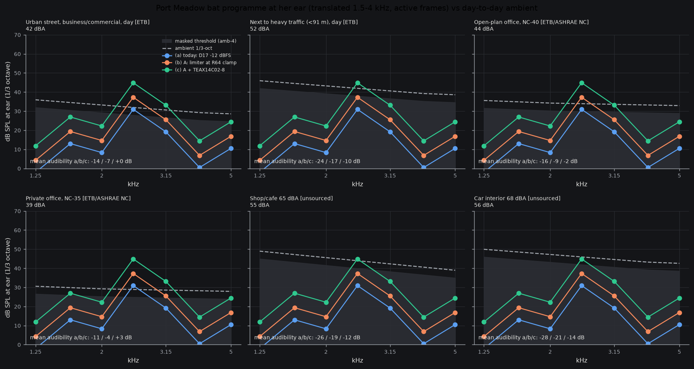

# Programme audibility: the real nature programme at her ear (2026-10-08)
Owner: simulate against what the device really plays (full-spectrum nature recording). Script `sim/acoustics/programme_audibility.py`, plot below.

## Programme and chain
- **Programme:** `sim/out/nature/2_translated_only.wav` = `sim/dsp/nature_demo.py` algo B (transient mode) on four Port Meadow bat passes (Zenodo 22079773, CC-BY-4.0, downloaded 2026-09-30); recording scaled so the loudest call = 75 dB SPL bat at the mic (assumption in the demo). Peak -9.5 dBFS, rms -32.1 dBFS, **crest factor 22.6 dB whole file, 19.8 dB over active frames** (102 of 199 100 ms frames within 20 dB of the loudest). `bats.npz` not used: it holds ADF input words only (no output taps); this wav is the same chain's output.
- **Level to ear:** programme peak-normalised to each option's ceiling (volume "just reaches it"), x 327 mA full-scale bridge current (clamp 208 mA = 0.635, never reached), force/current from `bone_tf.json` (nominal; calibrated -3.0 dB to loudness.py's per-volt chain), minus front-of-tragus threshold (Surendran 2023), plus air threshold q = eq. SPL (loudness.md method, +-10 dB). Analysed on 1/3-octave bands 1.25-5 kHz; means below use 1.6-4 kHz.
- **Options:** (a) today, D17 -12 dBFS ceiling (0.251); (b) A: `lim_lookahead=1`, ceiling 0.5203 (+6.3 dB); (c) A + TEAX14C02-8 (+7.6 dB, vendor Bl 2.4 vs assumed 1.0, R-exciter2.md).

## Result at her ear (active frames; whole file is 2.9 dB lower)
| | peak 1/3-oct (2.5 kHz) eq. SPL | LAeq (active / whole file) |
|---|---|---|
| (a) -12 dBFS | 31 dB | 32.6 / 29.7 dBA |
| (b) A | 37 dB | 38.9 / 36.1 dBA |
| (c) A + TEAX | 45 dB | 46.5 / 43.7 dBA |

**The real programme is 14-17 dB quieter than the 6 dB-crest assumption in audibility-requirement.md** (sec 2 table says 43.9 / 50.3 programme rms for (a)/(b); real LAeq is 32.6 / 38.9). Cause: sparse, call-shaped programme (crest 20-23 dB vs 6 assumed). Peak-limiting alone does not fix it; only compression/makeup does.

## Ambient spectra (sources fetched 2026-10-08)
- Outdoor, octave bands 63-8000 Hz: Engineering ToolBox "Outdoor Ambient Sound Pressure Levels" (2003), https://www.engineeringtoolbox.com/outdoor-noise_d_62.html (secondary; its own primary not given). Rows used: daytime business/commercial (42 dBA computed; stand-in for the street; **no "residential outdoor day" row exists**, suburban day is not tabulated) and within 91 m of continuous heavy traffic (52 dBA).
- Office: NC-40 (open plan) and NC-35 (private) octave levels, Engineering ToolBox "Noise Criterion (NC) Levels" (2004), https://www.engineeringtoolbox.com/nc-noise-criterion-d_725.html (NC curves are ASHRAE/ANSI; fetched via ETB, not primary).
- **[unsourced]** shop/cafe (assumed 65 dBA) and car interior (assumed 68 dBA): no spectrum could be fetched (searched 2026-10-08: Cluj-Napoca paper has street spectra in figures only; Rovetti 2018 eatery abstract has no data; car papers' tables inaccessible). Shape assumed = traffic row, scaled to the assumed dBA. Treat as indicative only.
- The sourced spectra are quieter (39-52 dBA) than the 50-70 dBA design points in audibility-requirement.md ([recall] numbers there); the 60 dBA design case is therefore between my street and heavy-traffic rows, still unsourced as a spectrum.
- Octave bands interpolated log-linearly to 1/3 octave, minus 4.8 dB. Masked threshold per band = max(q, ambient - 4 dB) (critical-ratio, as loudness.py).

## Verdict: mean per-band audibility (programme minus masked threshold, dB, 1.6-4 kHz) / headroom over ambient (target +8, audibility-requirement.md [recall] basis)
| Ambient | (a) today | (b) A | (c) A+TEAX | (c) if crest were compressed to 6 dB |
|---|---|---|---|---|
| Private office NC-35 (39 dBA) | -10.6 / -14.6 | -4.2 / -8.2 | **+3.4 / -0.6** | +17 / +13 |
| Urban street day (42 dBA) | -13.5 / -17.5 | -7.2 / -11.2 | +0.4 / -3.6 | +14 / +10 |
| Open-plan office NC-40 (44 dBA) | -15.6 / -19.6 | -9.2 / -13.2 | -1.6 / -5.6 | +12 / +8 |
| Heavy traffic (52 dBA) | -23.5 / -27.5 | -17.2 / -21.2 | -9.6 / -13.6 | +4 / 0 |
| Shop/cafe 65 dBA [unsourced] | -25.5 / -29.5 | -19.2 / -23.2 | -11.6 / -15.6 | +2 / -2 |
| Car 68 dBA [unsourced] | -27.5 / -31.5 | -21.2 / -25.2 | -13.6 / -17.6 | 0 / -4 |
Reading (audibility is the mean over 1.6-4 kHz; the call energy sits mostly at 2.5 kHz, where the peak band is 5-15 dB higher, so some calls clear the mask even where the mean does not; plot shows the 2.5 kHz peak crossing the threshold in street/office for b and c).

1. **(a) today: fails everywhere**, including a private office (-11 dB mean); only the 2.5 kHz peak band is near threshold in a private office.
2. **(b) A: still fails** in every ambient (-4 dB in a private office); the limiter alone does not rescue sparse bat programme.
3. **(c) A + TEAX: marginal** in private office/street (audible, below +8 headroom), fails open-plan, traffic, cafe, car; it works for the real programme only with crest compression (last column) added.

## Open
Programme gain assumption (bat calls = 75 dB SPL at mic) sets all absolute levels; real recordings of the owner's ambient would settle ambient spectra; Bl 1.0 and TEAX Bl 2.4 are unmeasured (E1); eq. SPL uncertainty +-10 dB. Next lever suggested: compress/makeup the translated programme (crest 20 -> 6 dB is worth about +14 dB; check artifacts by listening).
