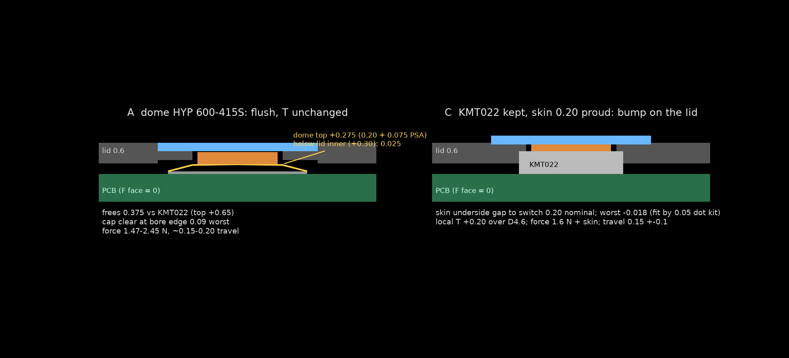

# K1-thin button (issue #11): dome vs proud skin
date: 2026-10-09 | design: k1t (0.6 lid) on phase2 board `hw/pod/draft_r2/out/routed.kicad_pcb` | src: sim/out/mech/button_concepts.json (sim/checks/button_concepts.py, 2026-10-07), pcbnew read-only 2026-10-09

 (script: img/k1t_button_section.py; matplotlib, not build123d)

Problem: KMT022NGJLHS (C&K IP68 tact, 3.0x2.6x0.65) top sits +0.35 above lid inner face; lid 0.6 less 0.25 skin recess leaves 0.35: margin -0.05 (WARN), no room for pre-gap or tolerance.

## A. HYP 600-415S metal snap dome (Phi4) on new F pads
- Part: 600-415S-150 = LCSC C256252, Extended, stock 8080, $0.0048; -250 = C256257, stock 9750, $0.0081 (jlc.py, 2026-10-09T00:32Z). Dome H 0.20 +-0.05, 150/250 gf (1.47/2.45 N), 1M cycles; dwg 600-0000-000 rev F. Not SMT: hand-placed after reflow, +0.075 PSA overlay.
- Height: dome top +0.275 above F face (inner lid +0.30) vs KMT022 +0.65: frees 0.375. Cap clear at bore edge 0.09 worst; puck guide 0.25; T unchanged (flush). Loses KMT022's IP68 as 2nd barrier (skin bond stays the seal).
- Collisions (pcbnew, SW1 at 18.5,6.0, F.Cu, board is 4-layer): KMT022 pads (BTN, +3V0) replaced by centre pad (r<0.5) + ring (r 1.5-2.0). Centre: 2 GND vias at r 0.44 (conflict unless ring/centre nets swapped or vias moved). Ring crossings, foreign nets: I2C_SCL x2 segments, CHG_INT x2, I_SENSE (+via r1.15), GA_N (+via r1.67), GND vias r1.54/2.21/2.22; BTN exits through a ring gap; +3V0 vias r1.8/1.94 same net as ring (tent). So 4 signal nets + 3 GND vias cross the ring zone.
- Re-route scope: move 4 nets (I2C_SCL, CHG_INT, I_SENSE, GA_N) off F under r<2.1 to inner layers or around, relocate 3 GND vias, DRC, re-release, ~2-3 h Claude time by hand-edit (no autorouter; earlier "~1.5 h, local edit" in k1t-vs-k4-parity.md understated the ring crossings). I2C_SCL sits on the way to U-devices: re-check I2C timing/noise after. Segmenting the ring into 3 arcs would cut crossings; unverified.
- Feel: crisp metal click, force chosen from a cents set (150/180/200/250 gf); travel ~0.15-0.20.

## C. Keep KMT022, skin proud over SW1 (no board change)
- Bump height 0.20 over D4.6 (0.10 proud fails: worst fit -0.118). Skin underside gap 0.20 nominal; worst -0.018 with selective-fit dot kit (4 thicknesses, 0.05 steps) -> usable, ~0.06 after fitting.
- Look: a 0.2 mm pillow on the outer face, local T +0.20 (flush design T 8.5 -> 8.7 where the bump is); doubles as a find-by-touch cue, but it is the one raised feature on a flat wearable.
- Print: lid unchanged (0.6, bore); skin is silicone, bump from skin + nub dot; no new printed tolerance beyond the dot kit. Pre-press risk: -0.018 worst means up to 0.02 of the switch's 0.05 minimum travel is consumed (no click loss, but no margin).
- Force/travel: 1.6 N (C221707) plus skin; switch travel 0.15 +-0.1, ~0.1-0.2 dead travel in the skin: soft over a click. Keeps KMT022 IP68.

## Compare
| | A dome | C proud skin |
|---|---|---|
| thickness | flush, frees 0.375 | +0.20 local |
| board | F-copper edit, 4 nets re-routed, DRC, re-release (~2-3 h) | none (~20 min) |
| feel | crisp, tunable 150-250 gf | soft, 1.6 N |
| risk | hand-placed dome, lost IP68 2nd barrier | -0.018 worst margin, bump visible |
| BOM | 2 cents-parts, drops C221707 ($0.39) | unchanged |

## Recommendation
A, per thin-first. C is the no-board-change fallback if re-routing the 4 nets proves ugly, or to ship the first prototype fast. Final feel is her call: buy a 150/180/200/250 gf set with the freeze order (O21) and press them through a skin coupon. Needs an ECR + docs/system update + `tools/plm.py` clearing before the board edit (not done here).
