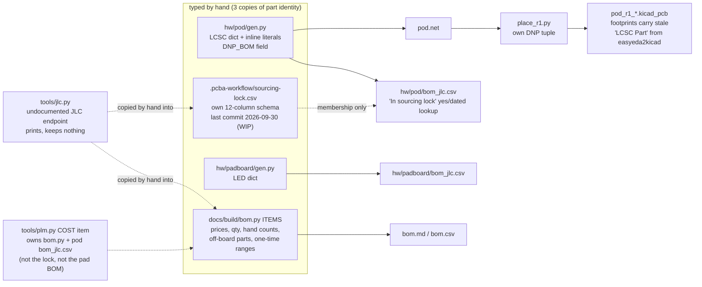
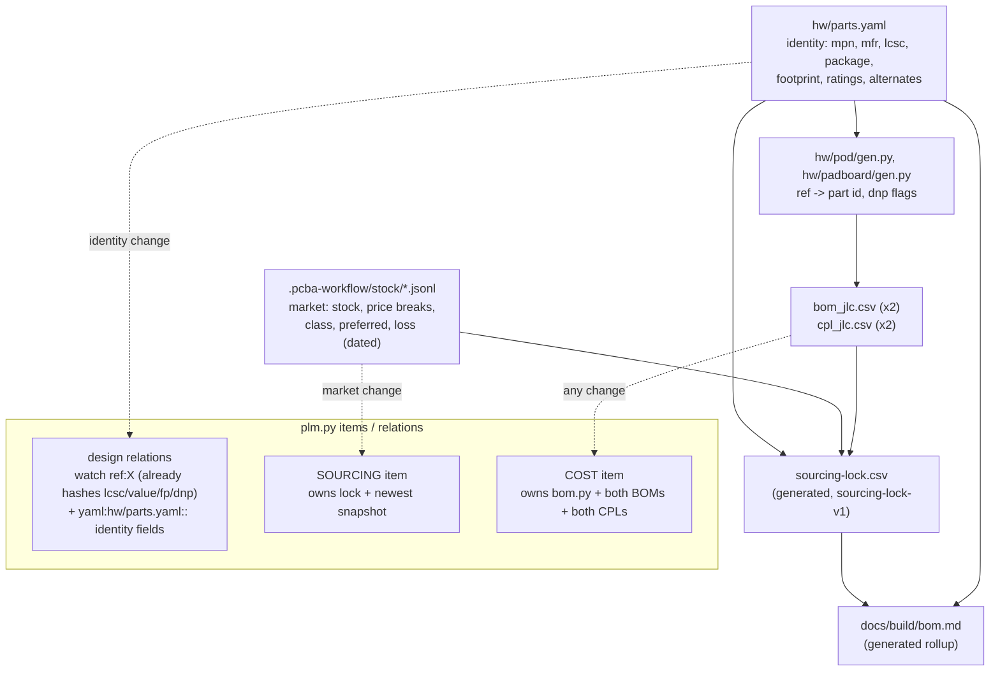

# BOM management, FOSS only: what we have, what established practice does, what to change

Status: research notes, 2026-10-01 (read-only study: nothing installed, no existing file edited, nothing committed).
**Constraint:** FOSS only (owner).
**Judged:**
- `docs/build/bom.py` (and its generated `bom.md`/`bom.csv`);
- `hw/pod/gen.py` (and its generated `bom_jlc.csv`), plus `hw/padboard/gen.py` and its `bom_jlc.csv`;
- `.pcba-workflow/sourcing-lock.csv` and `tools/jlc.py`;
- `.claude/skills/qualify-pcba-sourcing/` (its validator and lock template);
- `tools/plm.py` and `docs/system/plm/items.yaml`;
- the rev-1 draft board `hw/pod/draft_r1/pod_r1_routed.kicad_pcb` and the footprint library `hw/lib/lcsc/`.

Sibling notes: `plm-tools.md` (PLM servers, KiBot) and `method.md` (interface method). This file goes deeper on BOM only.
Where they overlap, I re-read every licence and release myself.

**Dates.**
- Web sources: accessed 2026-10-01 (local date).
- Live JLC queries: 2026-10-02T00:25Z to 00:32Z UTC, which is still 2026-10-01 locally.
- Anything I could not read at the primary source is marked *unverified*.

---

## 1. Bottom line

- **Keep our own scripts. Don't adopt a BOM server.**
  - No FOSS tool fits a SKiDL-generated schematic plus JLCPCB plus off-board hand-built parts plus git-diffable state.
  - **Servers:** InvenTree (MIT) and Part-DB (AGPL-3.0) are good inventory servers. They are the wrong shape: a database and web server plus a worker, the data isn't in git, and their LCSC lookups use the same kind of undocumented endpoint we already use.
  - **JLC output generators:** KiBot (AGPL-3.0) and KiKit (MIT) both need a `.kicad_sch` schematic file to make the JLC BOM. We have none, because SKiDL writes a netlist straight to the board.
- **Our BOM data is already drifting, measurably.** Part identity is typed by hand in three places: `gen.py`, `sourcing-lock.csv` and `bom.py`. A read-only cross-check found the following today (§4):
  - **Lock gaps:** 16 of 29 JLC BOM lines are not in the sourcing lock, including the MCU, mic, charger, switch and USB ESD.
  - **Dead lock rows:** 8 lock rows marked RECOMMENDED name parts the schematic no longer uses (MCP73831, KXT321, ...).
  - **Miscounts:** `bom.py` counts 23 capacitors (the schematic has 22) and counts R20/R21 twice.
  - **Wrong schema:** the lock fails the vendored skill's own validator: `BLOCKED`, 30 missing columns.
- **The draft board carries the wrong LCSC numbers on 3 parts:**
  - Q1/Q2 carry `C552750`, which is PMCXB900UELZ, a different Nexperia FET pair.
  - SW1 carries `C221708`, which is KMT031NGJLHS, a different switch variant.
  - Cause: the `LCSC Part` property that easyeda2kicad embedded in footprints we reused for sibling parts.
  - Nothing reads it today, because the JLC BOM comes from SKiDL. But every board-side JLC tool (kicad-jlcpcb-tools, KiBot's `_field_lcsc_part`) would read it and order the wrong part.
  - The board becomes the PCB source of truth once placement starts (CLAUDE.md).
- **Recommendation (option A, §9):**
  - One **parts catalogue** in git (`hw/parts.yaml`) that both SKiDL generators read.
  - Everything else is **generated**: the JLC BOM per board, the CPL (via `kicad-cli pcb export pos`), the sourcing lock (in the vendored skill's schema, from append-only dated stock snapshots), and the cost rollup.
  - One **check script** (`tools/bom_check.py`) asserts they agree.
  - **Automate first:** the check script. It is read-only, about 150 lines, and catches every defect in §4.
- **Data source (owner question, §6):**
  - `tools/jlc.py` uses JLCPCB's **undocumented** website endpoint. So does the FOSS ecosystem: jlcparts, kicad-jlcpcb-tools' database, Part-DB's and Ki-nTree's LCSC lookups.
  - JLCPCB also runs a **documented, keyed, free-on-application Components API** (`api.jlcpcb.com`). It's a proprietary service, so it's your call.
  - Paid aggregators (Octopart/Nexar) are excluded. Every distributor API KiCost uses is keyed and proprietary.
- **Sourcing risk, right now:** STM32U575CIU6Q (C5271013) had **8 in stock** at 2026-10-02T00:25Z.
  - Rev 1 needs 2-3 of them. Attrition is 0 for this part.
  - Pre-buying or reserving them through JLC is your order and your payment. It's the only mitigation that doesn't touch the design.

---

## 2. Glossary (part numbers in this note)

- **STM32U575CIU6Q** (LCSC C5271013): ST Cortex-M33 MCU, QFN-48, with the internal core SMPS ("Q" suffix). U1.
- **SPH0641LU4H-1** (C2879853): Knowles PDM MEMS microphone with an ultrasonic mode. U2.
- **BQ25180YBGR** (C3682423): TI linear Li-ion charger with power path and I2C, 8-ball DSBGA. U3.
- **TPS7A2030PDQNR** (C5220164): TI 300 mA, 3.0 V low-noise LDO. U4.
- **TPD2E2U06DRLR** (C1972959): TI 2-channel ESD array for USB D+/D-. U6.
- **PMCXB290UE(Z)** (C19654206): Nexperia complementary N+P MOSFET pair, DFN1010B-6 (SOT1216). Q1/Q2 in the H-bridge.
- **PMCXB900UELZ** (C552750): a *different* Nexperia N+P pair in the same SOT1216 package. It is the part the board wrongly names for Q1/Q2.
- **KMT022NGJLHS** (C221707): C&K KMT0 IP68 tactile switch, 1.6 N. SW1.
- **KMT031NGJLHS** (C221708): another KMT0 variant. It is the part the board wrongly names for SW1.
- **KXT321LHS** (C221821): C&K 3x2 mm tactile switch. The old SW1, before Rev D.
- **MCP73831 / MCP73832** (C424093 / C38066): Microchip single-cell linear chargers. The old U3, before Rev D.
- **DFE201610E-2R2M** (C337891): Murata 2.2 uH metal-alloy inductor, 0806. L1, on the MCU's SMPS.
- **PESD5V0S1BL** (C84374): Nexperia 5 V bidirectional ESD diode, DFN1006. D1/D2, fitted DNP (footprint placed, part not fitted).
- **ESD9X5.0ST5G** (C87910): onsemi 5 V unidirectional ESD diode, SOD-923. D3.
- **1N5819WS** (C191023): 40 V Schottky diode, SOD-323. D4, against reverse docking.
- **NCP15XH103F03RC** (C77131): Murata 10 k NTC thermistor, B 3435 K, 0402. RT1.
- **Q13FC13500004** (C32346): Epson FC-135 32.768 kHz crystal. Y1.
- **C12530**: Samsung 2.2 uF 0402 X5R **6.3 V** capacitor. C8/C9.
- **C107369**: Samsung 2.2 uF 0402 **10 V** capacitor. It is what the lock still recommends for C8/C9.
- **16-213/BHC-AN1P2/3T** (C131223): Everlight blue 0402 LED. D1 on the pad board.
- **Renata ICP501233PA-02:** 175 mAh Li-ion pouch cell with a protection circuit (PCM). Off-board.
- **RC-BC02:** bone-conduction exciter. Off-board.
- **Xinyangze YZT0675 / YZP0048** (C5126848 / C5126845): 5-pin magnetic pogo connector, target side / cable side. Off-board.

---

## 3. What we have (current data flow)



**What is already good, and stays:**
- **SKiDL as the identity source:** `gen.py` puts an `LCSC` field on every placed part, and fails loudly on a missing one ("missing LCSC: none").
- **JLC-shaped BOM:** the generated `bom_jlc.csv` has the right columns: Comment, Designator, Footprint, LCSC Part #. JLC's KiCad guide (accessed 2026-10-01) asks for exactly these.
- **Honest failure in `jlc.py`:** it raises on a changed response shape instead of guessing, and stamps every query with a UTC time.
- **Off-board parts as first-class lines:** `bom.py` treats them as real lines, with fractional quantities (0.1 of a NiTi pack, 0.05 of a litz reel). No FOSS tool does that better.
- **Part changes already turn relations SUSPECT:** `plm.py`'s `ref:` watch hashes `value`, `fp`, `lcsc` and `dnp` per part, so a part swap in the schematic flags every relation that watches the ref.

---

## 4. Defects found today (read-only checks, reproducible)

Method: a throw-away script in my scratchpad compared `hw/pod/bom_jlc.csv`, `.pcba-workflow/sourcing-lock.csv`, `bom.py` `ITEMS` and the routed board.
That is exactly what `tools/bom_check.py` (recommended) would do on every change.

| # | Finding | Evidence | Consequence |
|---|---|---|---|
| D1 | **16 of 29 JLC BOM lines have no lock row**: U1 C5271013, U2 C2879853, U3 C3682423, U6 C1972959, SW1 C221707, RT1 C77131, C8/C9 C12530, C22 C15195, and 8 resistor lines | `bom_jlc.csv` column "In sourcing lock" = "dated lookup" for those; lock last committed 2026-09-30 (`1047803 WIP: sourcing lock`); `gen.py` changed since: Rev D, Rev E, audit | The most design-critical parts have no dated stock/price evidence in the lock. Their dates live only in prose (`bom.py` notes, `gen.py` docstring) |
| D2 | **8 lock rows marked RECOMMENDED are not in the schematic**: MCP73831 C424093, KXT321 C221821, CL05A225KP5NSNC C107369, PESD5V0S1BL C84374 (now DNP), 22k C25768, 10 uF 0402 C15525, C0G 22 pF C1555, C0G 100 pF C1546 | same comparison | An agent reading the lock gets a pre-Rev-D design |
| D3 | **Lock and schematic disagree on a rating rule.** The lock row `C_VDD11 2x2.2uF` says "ST requires >=10 V rating ... Basic 0402 C12530 is only 6.3 V". `gen.py` (assembly-cost audit) chose C12530, "6.3 V on a 1.1 V rail" | `.pcba-workflow/sourcing-lock.csv` row 8 vs `gen.py` docstring and `LCSC["C2u2"]` | Not mine to settle. The processing/power team must check it against the primary source (ST DS13737, the STM32U575 datasheet) and record the answer. No tool compares the two today |
| D4 | **Wrong LCSC numbers on the board.** Q1/Q2 carry `LCSC Part = C552750` (PMCXB900UELZ); SW1 carries `C221708` (KMT031NGJLHS). The schematic says C19654206 and C221707 | `grep '"LCSC Part"' hw/pod/draft_r1/pod_r1_routed.kicad_pcb`; identities from `tools/jlc.py C552750 C221708` at 2026-10-02T00:27Z. Source: `hw/lib/lcsc/lcsc.pretty/SOT1216_...kicad_mod` and `SW-SMD_4P-...kicad_mod` embed the number of the part they were fetched for | Harmless while the BOM comes from SKiDL. Wrong parts get ordered the day anyone generates a BOM from the board. kicad-jlcpcb-tools matches any field starting `lcsc` or `jlc` (`footprint_helpers.py` `_is_assignment_alias`, read 2026-10-01). KiBot's JLC template reads `_field_lcsc_part` |
| D5 | **The board has no schematic LCSC field at all.** Only the 11 easyeda2kicad footprints carry one (stale or not). 65 footprints carry none | same board scan | The board can't serve as a BOM source without a copy step |
| D6 | **DNP is defined twice**: `gen.py` custom field `DNP_BOM = "dnp"` on D1/D2; `place_r1.py` `DNP = ("D1", "D2")` | both files | Change one and forget the other: the CPL and BOM disagree. SKiDL 2.3 already writes KiCad's native `dnp` / `exclude_from_bom` netlist properties if you set `part.dnp = True` (`skidl/tools/kicad10/gen_netlist.py` lines 222-228, installed copy, read 2026-10-01) |
| D7 | **Hand counts in `bom.py` are wrong.** "0402/0603 capacitors 23"; the schematic has 22. "0402 resistors 21" plus separate R20 and R21 rows: the schematic has 21 *including* R20/R21, so 2 are double-counted | `bom_jlc.csv` sums | Cents, but it proves a hand-kept rollup drifts within a day |
| D8 | **Lock schema does not match the vendored skill.** `validate_sourcing_lock.py` returns `BLOCKED`, "missing headers: reference, function, quantity_per_board, ... evidence_url" (30 fields) | `python3 .claude/skills/qualify-pcba-sourcing/scripts/validate_sourcing_lock.py .pcba-workflow/sourcing-lock.csv` | The skill's gate can't pass. CLAUDE.md says the skills' artifacts live in `.pcba-workflow/` |
| D9 | **`jlc.py` drops cost-relevant fields** that JLC returns: `preferredComponentFlag` (Preferred Extended = no $3 loading fee on Economic), `lossNumber` (JLC attrition per line), `minPurchaseNum`, `componentAlternativesCode` | raw response keys for C12530, 2026-10-02T00:29Z | Loading fees and attrition are guessed. Today all 11 Extended types are plain Extended (0 preferred), so the fee count happens to be right |
| D10 | **The one-time costs are guesses** ($93-195 per order). JLC publishes the schedule. | JLC PCBA FAQ "Last updated on Sep 09, 2026", accessed 2026-10-01: "Setup fee: $8.00 Stencil: $1.50 SMT Assembly: $0.0017 per joint ... we charge $3 per extended component" | A generated rollup can replace two of the four guessed rows (the board order and shipping stay estimates) |
| D11 | **The pad board is outside the cost tracker.** `items.yaml` COST owns `bom.py` and `hw/pod/bom_jlc.csv` only, not `hw/padboard/bom_jlc.csv` and not the lock | `items.yaml` lines 83-87 | A pad-board part change never flags COST |
| D12 | **Designator collision if the boards share a panel.** `bom.py` says the pad board is "same panel"; pod D1 (DNP ESD) and pad D1 (LED) share a designator | both `gen.py` files | A merged BOM/CPL would map one designator to two parts. Rename one (e.g. pad LED -> D101) before panelising. Whether JLC rejects or mis-matches it: *unverified* |
| D13 | **Off-board lines have no per-line source URL or date** | `bom.py` `ITEMS`: exciter "listing URLs were never saved"; dates only in the module docstring | Violates the §0 rule "primary sources, with dates" at line level |

**An illustrative order rollup** (what the generated cost script would print). Assumptions:
- 3 assembled pod boards, using the 2026-10-02T00:32Z snapshot;
- the price break matched to the quantity;
- JLC attrition per line (`lossNumber`);
- 205 SMT pads per board (counted on the routed draft).

The numbers:
- **Parts:** $14.93 per board at quantity 1. **$47.61 for 3 boards including attrition.**
- **Loading:** 10 Extended types on the pod: **$30**. The pad board's LED makes 11.
- **Joints:** 205 x 3 x $0.0017 = **$1.05**.
- **Setup + stencil:** **$8 + $1.50** per the FAQ. Pricing for double-sided assembly is *unverified*: it may double.

---

## 5. Tools (licence read from the repository file named; dates from GitHub release/commit Atom feeds)

Legend for the activity columns: R = latest release, C = latest commit on the default branch (both from the repo's `releases.atom` / `commits.atom`, accessed 2026-10-01).

| Tool | Licence (file read) | R / C | Footprint | CLI / API | Git-friendly | Fit to KiCad 10 + SKiDL + JLC | Verdict |
|---|---|---|---|---|---|---|---|
| **InvenTree** (parts, BOMs, stock, pricing server) | **MIT** (`LICENSE`: "MIT License Copyright (c) 2017 - InvenTree Developers") | R 1.5.6, 2026-09-26 / C 2026-09-29 | Web server + background worker (django-q2) + database (Postgres recommended, SQLite with single-thread worker limits) + proxy; Redis optional ("InvenTree Processes" docs) | REST API, `inventree-python` (MIT); KiCad HTTP-library plugin `inventree_kicad` (MIT) | No: state lives in SQL | BOM features are strong: substitute lines, optional/consumable lines, BOM checksum + "validated" flag, "Used In", supplier price breaks, BOM pricing. But no SKiDL path; LCSC import only through `inventree-part-import` (MIT-text licence), which offers web scraping, and through Ki-nTree | **adapt-ideas** (§7 P4, P6). Revisit only if you start tracking bench stock across many builds |
| **PartKeepr** | GPL-3.0 (`LICENSE`) | R 1.4.0, **2018-04-28** / C **2023-01-10** | PHP + MySQL/Postgres; README: "PHP between 7.0 and 7.1" (EOL) | REST | No | None | **skip** (dead in practice; not marked archived) |
| **Binner** | GPL-3.0 (`LICENSE`) | R v2.6.25, 2026-03-22 / C 2026-04-10 | .NET service + its own DB or Postgres/SQLite/SQL Server; Docker image | REST | No | Supplier lookups: Digi-Key, Mouser, Arrow, Octopart/Nexar, TME (all keyed proprietary APIs); no LCSC/JLC. **Open-core:** README "additional features and limitations can be unlocked with a paid license ... Max 3 Users"; hosted binner.io has paid tiers | **skip**. The free core is GPL, but nothing fits, and the paid tier is excluded by your constraint |
| **Part-DB** (part-db-symfony / Part-DB-server) | **AGPL-3.0** (`LICENSE`; README "AGPL v3.0 (or at your opinion any later)") | R 2.19.2, 2026-09-28 / C 2026-09-28 | PHP 8.2 + SQLite/MySQL/Postgres; Docker image | REST API; KiCad HTTP library integration; KiCad BOM import into projects | No | Its LCSC provider uses `https://wmsc.lcsc.com/ftps/wm` (source `LCSCProvider.php`). Its docs say plainly: "LCSC ... does not offer a public API ... this internal API is not intended or endorsed by LCSC and it could break at any time" | **skip** (an inventory server). Quoted here because it names the same endpoint risk we carry |
| **KiCost** | MIT (`LICENSE`, (c) 2015 XESS) | R v1.1.21, 2026-07-08 / C 2026-07-08 | pip; CLI + GUI | CLI | Spreadsheet output (xlsx) | Docs: "Currently all the APIs needs some kind of key/token, lamentably we no longer have an API that doesn't need it." Sources: Digi-Key, Mouser, Element14, TME, Nexar (free plan 1000 parts/month). LCSC came only via KitSpace, and the changelog for 1.1.16 (2023-04-10) says "disabled KitSpace API, no longer available" | **skip**: no JLC/LCSC pricing, and every source is a keyed proprietary API |
| **Ki-nTree** | GPL-3.0 (`LICENSE`) | R 1.2.1, 2026-03-25 / C 2026-07-09 | pip; GUI (needs InvenTree for its main job) | Mostly GUI | Writes KiCad libs (kiutils) | README: "requires a Digi-Key production API instance", plus Mouser and Element14 keys; LCSC via `https://wmsc.lcsc.com/ftps/wm/product/detail?productCode=` (`lcsc_api.yaml`); "tested for Python 3.9 to 3.12" (we run 3.14) | **skip** |
| **kicad-jlcpcb-tools** (Bouni) | **MIT** (`LICENSE`, (c) 2022 bouni) | R 2026.04.03 (2026-04-23) / C 2026-09-28 | KiCad PCB-editor action plugin; downloads a split SQLite parts DB rebuilt daily (`update_parts_database.yml`, cron 05:00) from jlcparts data | **GUI plugin, no CLI** | Writes LCSC into schematic fields; keeps a zip backup | KiCad 10 design variants: per-variant Value/LCSC/BOM/POS/POP. JLC rotation-correction manager (from matthewlai/JLCKicadTools). Reads any field matching `^(lcsc|jlc)`, so it would trip on D4 | **adapt-ideas**: its rotation-corrections data and variant BOM/POS/POP flags. You could also run it in a joint layout session as a visual cross-check, once D4 is fixed |
| **KiBot** | **AGPL-3.0** (`LICENSE`) | R tag `v2_k10_1_9_0`, 2026-07-28 / C 2026-07-28 | pip; full features need KiAuto etc.; Docker images optional | YAML-driven CLI | Config in git; outputs reproducible | Built-in `JLCPCB` template (gerbers, drill, position with `_rot_footprint_jlcpcb`, BOM with `_field_lcsc_part`, compress). But the BOM output "is compatible with KiBoM, but doesn't need to update the XML netlist because the components are loaded **from the schematic**" (docs, BoM output), so no `.kicad_sch` means no JLC BOM from KiBot. Its `kicost` output inherits KiCost's keyed APIs | **watch**: adopt for fab outputs only if we ever generate a `.kicad_sch` |
| **KiKit** (`kikit fab jlcpcb`) | **MIT** (`LICENCE`, (c) 2020 Jan Mrazek) | R v1.8.1, 2026-08-05 / C 2026-09-25 | pip | CLI | Yes | Docs: assembly needs "`--assembly` option and also provide the board `--schematic`". Good patterns: `--field CFG1_LCSC,LCSC` (ordered fallback, i.e. alternates and configurations as fields), `JLCPCB_IGNORE`, `--missingError`, a per-footprint `JLCPCB_CORRECTION` field | **adapt-ideas** (P4) |
| **jlcparts** (yaqwsx: JLC catalogue builder + static site) | **MIT** (`LICENSE`, (c) 2024 Jan Mrazek) | no releases / C 2026-06-23 | Python CLI; publishes a multi-part zip of a SQLite cache at `yaqwsx.github.io/jlcparts/data/` (cache.zip + .z01 + .z02 = about 116 MB, sizes checked 2026-10-02T00:3xZ) | CLI (`jlcparts fetchdb`, ...) | No (a binary DB) | **Data provenance:** its CI uses `JLCPCB_APP_ID/ACCESS_KEY/SECRET_KEY` against the **official** `open.jlcpcb.com` component API, `LCSC_KEY/SECRET` against LCSC's agent API, *and* the same undocumented website endpoint we use, now on a `/v2` path with an XSRF cookie (`jlcparts/jlcpcb.py`, `lcsc.py`). The data licence is not stated | **watch**: a possible offline fallback and parametric search for alternates (owner question Q1) |
| **easyeda2kicad** | **AGPL-3.0** (`LICENSE`) | R v1.0.1, 2026-04-06 / C 2026-04-08 | pip; CLI | CLI | Writes `.kicad_sym` / `.kicad_mod` | Already in use. Undocumented source `https://easyeda.com/api/products/{lcsc_id}/components`. **It writes `LCSC Part` into footprints**: the root cause of D4 when a footprint is reused | **adopt** (keep), *plus* strip `LCSC Part` from library footprints |
| **JLC2KiCad_lib** | MIT (`LICENSE`) | R v1.3.2, 2026-09-11 | pip; CLI | CLI | Same as above | Same EasyEDA data path; generates approximate courtyards | **skip** (it duplicates easyeda2kicad) |
| **KiCad 10: `kicad-cli pcb export pos`** | GPL-3.0-or-later (`LICENSE.README`: "The majority of KiCad's source code is ... GPLv3 or later") | 10.0.6 installed | Already installed | CLI: `--format csv --units mm --exclude-dnp --variant ...` (local `--help`) | Text output | Works from the board alone. It's the right source for the JLC CPL (rename the columns; apply rotation corrections) | **adopt** (now) |
| **KiCad 10: design variants, BOM presets, `sch export bom`, database (ODBC) and HTTP libraries** | as above | 10.0 docs, accessed 2026-10-01 | none | `sch export bom --variant --preset --exclude-dnp` | `.kicad_sch` text | Variants: per-variant DNP, and **independent** "exclude from BOM" / "exclude from position files" flags; field overrides "to point to an alternate sourcing option"; "Variant data flows from the schematic to the PCB, not the other way around". All of it needs a `.kicad_sch`, which we don't have. Database and HTTP libraries feed KiCad's symbol chooser, which SKiDL doesn't use | **adapt-ideas**: copy the semantics (three independent flags, field overrides for alternates) into our catalogue and generators |
| **SKiDL 2.3 BOM capabilities** | MIT (`LICENSE`, (c) Dave Vandenbout) | R 2.3.0, 2026-07-28 / C 2026-08-10 | installed | Python | Yes | `part.dnp` / `part.exclude_from_bom` become KiCad netlist properties (use them; D6). `generate_xml()` for KiCad 10 writes fields as **s-expressions inside XML** (`gen_xml.py` line 48: `(field (name X) value)` within `<fields>`), so XML-BOM consumers (KiBoM, KiCost) won't see LCSC. No variant support | **adopt** the native DNP attributes. Keep our own CSV writer (`gen.py bom()`); skip SKiDL's XML BOM |
| **InteractiveHtmlBom** | MIT (`LICENSE`, (c) 2018 qu1ck) | R 2026-09-10 / C 2026-09-28 | KiCad plugin + CLI | CLI | One self-contained HTML | An assembly aid for hand rework and off-board wiring on your bench; not a BOM manager | **watch** (useful at bring-up) |
| **KiBoM** | MIT (`LICENSE.md`) | R 1.9.1, 2023-11-15 / C 2025-03-24 | pip | CLI | CSV/HTML | Superseded by KiCad's internal BOM and KiBot | **skip** |
| **JLCKicadTools** (matthewlai) | GPL-3.0 (`LICENSE`) | C 2025-05-01 | Python | CLI | CSV | The origin of the JLC rotation-correction table used by Bouni's plugin | **adapt-ideas** (the corrections data) |
| **inventree-part-import** (30350n) | MIT text (`LICENSE`, (c) 2023 Max Schlecht; standard MIT permission text) | not checked | CLI | CLI | No (writes to InvenTree) | Suppliers DigiKey, LCSC, Mouser, Reichelt, TME; `scrape` option ("this can get you temporarily blocked") | **skip** (needs InvenTree) |
| **Octopart / Nexar API** | proprietary service | n/a | SaaS | keyed | n/a | Free plan 1000 parts/month (KiCost and Part-DB docs) | **excluded-not-foss** |
| **Digi-Key / Mouser / Element14 / TME APIs** | proprietary services (free developer keys) | n/a | SaaS | keyed | n/a | Not JLC data. Only relevant for off-board parts such as the Adafruit bench cell | **excluded-not-foss** (ask you before using any of them) |
| **JLCPCB Components API** (`api.jlcpcb.com` / `open.jlcpcb.com`) | proprietary service, documented | n/a | SaaS | keyed (app ID + access key + secret, signed requests per jlcparts' client) | n/a | Landing page (accessed 2026-10-01): Components API gives "real-time pricing, inventory data, and component specifications"; "apply for free API access". Eligibility and terms not shown (*unverified*) | **excluded-not-foss** as a tool: owner question Q1 |
| **JLCPCB website parts-search endpoint** (what `tools/jlc.py` calls) | none: undocumented, unauthenticated | worked 2026-10-02T00:32Z | none | POST JSON | n/a | The whole FOSS JLC ecosystem leans on it (jlcparts, which now uses `/v2` and an XSRF cookie; Bouni via jlcparts) | **watch**: keep it, harden it (§6), owner question Q1 |

---

## 6. Data sources: what is FOSS-compatible and what breaks

There is **no FOSS-licensed source of live JLC stock and price.** The data belongs to JLCPCB and LCSC. Every option is a proprietary service; they differ in being documented and keyed, or undocumented and open.

| Source | Documented? | Key? | Who uses it | Risk |
|---|---|---|---|---|
| JLC website endpoint `.../smtGood/selectSmtComponentList` (`tools/jlc.py`) | **No** | No | us; jlcparts (`/v2` path + XSRF-TOKEN cookie); kicad-jlcpcb-tools (indirectly) | It can change or vanish without notice. jlcparts already moved to `/v2`, and our v1 path still answered at 2026-10-02T00:32Z. Terms of use not checked (*unverified*) |
| JLCPCB Components API (`open.jlcpcb.com`) | Yes | Yes (free on application) | jlcparts CI | Needs an account and approval, and the terms bind you. It's the stable route if JLC keeps it |
| LCSC internal `wmsc.lcsc.com/ftps/wm/...` | No | No | Part-DB, Ki-nTree | Part-DB's docs say it "could break at any time" |
| LCSC agent API `ips.lcsc.com/rest/wmsc2agent` | Partly | Yes (key + SHA-1 signature) | jlcparts | Agent access, approval *unverified* |
| EasyEDA `easyeda.com/api/products/{id}/components` | No | No | easyeda2kicad, JLC2KiCad_lib | Footprints/symbols only; same volatility |
| jlcparts published SQLite dump | Static files | No | anyone | Third-party snapshot, refreshed by its CI (cron at 03:00, 11:00 and 19:00 UTC). It depends on the maintainer's keys. Data licence unstated |
| Octopart/Nexar, Digi-Key, Mouser, Element14, TME | Yes | Yes | KiCost, Binner, Ki-nTree, Part-DB | Proprietary; excluded by your constraint |

**Hardening `jlc.py` (whichever source you pick):**
1. **Keep the evidence.** Write every query as one JSON line to an append-only `.pcba-workflow/stock/YYYY-MM-DD.jsonl`, with the UTC stamp and the fields that matter: stock, price breaks, `componentLibraryType`, `preferredComponentFlag`, `lossNumber`, `minPurchaseNum`. That's about 30 lines per refresh, diffable, and the dated primary evidence §0 asks for.
2. **Keep the shape guard**, which already exists. Add a smoke test on two known parts that runs before any lock refresh.
3. **Add a fallback.** If the endpoint breaks, read the last snapshot; a lock older than its max age then turns BLOCKED, it doesn't silently reuse stale data. Optionally, read a jlcparts dump if you approve it.
4. **Don't parse JLC's web pages.** Use JSON only.

---

## 7. Established practice ("BOM as code") vs ours

| # | Practice | Primary source (accessed 2026-10-01) | Here | Gap |
|---|---|---|---|---|
| P1 | **One source of truth for part identity**: the part number lives on the schematic part, and every BOM/CPL is generated | KiCad 10 docs (fields; "Variant data flows from the schematic to the PCB"); JLC KiCad guide (BOM columns); KiKit/KiBot JLC outputs | SKiDL is our schematic. A catalogue keyed by part id, read by both `gen.py` files, carries MPN/manufacturer/LCSC/ratings/alternates | Identity typed in 3 places (D1, D2, D7) |
| P2 | **BOM and CPL from the same revision, cross-checked**; fail on missing part numbers | KiKit `--missingError`; KiBot JLCPCB template (BOM + position + compress in one run); vendored `release-pcba-fabrication` skill | `gen.py` -> BOM; `kicad-cli pcb export pos` -> CPL; the check asserts the same refs, minus DNP and pads | No CPL generator; no BOM-CPL check |
| P3 | **Three independent flags**: DNP, exclude from BOM, exclude from position file; per variant | KiCad 10 docs, "Excluding from outputs": "These flags are independent of each other and independent of DNP" | Use SKiDL's native `dnp` / `exclude_from_bom` and add an `exclude_from_pos` field. `place_r1.py` reads the flags from `pod.net`; no second list | D6 |
| P4 | **Alternates as data with approval**, not as prose | KiKit `--field CFG1_LCSC,LCSC` (ordered fallback); InvenTree "Substitute BOM Line Items"; KiCad 10 variant field overrides "to point to an alternate sourcing option"; vendored `substitution-gate.md` (pin-by-pin comparison, owner approval for critical parts) | Catalogue entry: `alternates: [{lcsc, mpn, status: approved / candidate / rejected, evidence, approved_by, date}]`. An alternate BOM is a *variant* run of the generator, never a silent swap | Alternates sit in lock rows with no link to refs and no approval field |
| P5 | **Dated sourcing lock with a maximum age, validated** | vendored `qualify-pcba-sourcing` (`validate_sourcing_lock.py --max-age-days 14`); its gate: "A stock/price-only refresh invalidates sourcing and order approval; it does not invalidate the circuit" | Generate the lock in the skill's `sourcing-lock-v1` schema from catalogue + snapshot + generated BOM quantities; the validator must PASS | D1, D2, D8 |
| P6 | **A BOM change invalidates approval automatically** (a checksum) | InvenTree "BOM Checksum": a "hash of the BOM line items"; the "validated" flag clears on any line change | Our `plm.py` baseline already *is* this mechanism. Point it at the right things (§8) | The lock and pad BOM aren't watched; price-only changes would flag design relations if we watched whole files |
| P7 | **Cost from the published fee schedule**, quantity breaks, attrition, per order of N boards | JLC FAQ (setup $8, stencil $1.50, $0.0017/joint, $3 per Extended type, Preferred Extended exempt on Economic); `lossNumber` in the JLC response | Generated rollup per pod, per pair, per JLC order (N parameter) | D9, D10 |
| P8 | **Stock and lifecycle checks on every change, with thresholds** | Standard CI practice; the skill's validator | `bom_check.py --live` warns when stock < 10 x order need (U1 today: 8 vs 3) and fails when stock < need | Recorded as a note only |
| P9 | **Treat undocumented APIs as volatile**: guard, cache, fallback | Part-DB docs warning; the jlcparts endpoint drift | §6 hardening | No snapshot, no fallback |
| P10 | **Where-used** from part to refs to blocks to interfaces | InvenTree "Used In"; our `plm.py impact` | `plm.py impact part:<id>` / `lcsc:Cxxxx` (§8) | Impact takes `ref:` but not a part or LCSC number |

**Lifecycle, bluntly:** no FOSS-compatible source gives lifecycle status (active / NRND / EOL).
- JLC's response has no lifecycle field. It has `noBuyReason`, `estimateDate` and `idleFlag`, which aren't the same thing.
- Lifecycle data sits behind proprietary APIs (Nexar, Digi-Key).
- So lifecycle stays a **manual, dated** column, read from manufacturer product pages, for the design-critical parts only: U1, U2, U3, U4, U6, Q1/Q2, SW1. That's 7 lookups, not a tool.

---

## 8. Linking BOM data to the relation tracker (`tools/plm.py`)

The split that matters is what changed. **Identity** changes (MPN, package, footprint, rating) are design changes. **Market** changes (stock, price) are sourcing changes. The vendored skill draws the same line. Mixing them would turn every daily stock refresh into a wave of SUSPECT design relations.



Concrete additions to the model, for whoever implements them under an ECR:

1. **A new watch kind `yaml:PATH::KEY`**: the hash of one catalogue entry's identity fields only. Price and stock fields are excluded. Design relations that watch `ref:U1` can add `yaml:hw/parts.yaml::stm32u575ciu6q` to catch a catalogue edit before the schematic is regenerated.
2. **A SOURCING item** that owns `.pcba-workflow/sourcing-lock.csv` and the newest snapshot. Relations:
   - `R-SRC-PROC`: U1 supply risk to SUB-PROCESSING.
   - `R-SRC-COST`.
   - One relation per design-critical part that has an approved alternate (that alternate is a pending interface change).
3. **COST owns more:** `hw/padboard/bom_jlc.csv` and both CPLs, which fixes D11.
4. **`plm.py impact lcsc:C12530` or `impact part:<id>`:** resolves through the circuit to refs (C8, C9), then to blocks (CORE_SMPS), then to items and relations. It's the "Used In" query.
5. **ECR template:** a part swap ECR lists its substitution-gate evidence (pin map, package drawing, ratings) and the regenerated lock line. Its approval is the owner's when the part is design-critical, per the skill's gate.

---

## 9. Options and recommendation

**Option A (recommended): keep and extend our scripts, with one catalogue and everything else generated.**
- New `hw/parts.yaml`: one entry per orderable part, on-board and off-board. Example:

  ```yaml
  stm32u575ciu6q:
    mpn: STM32U575CIU6Q
    mfr: STMicroelectronics
    lcsc: C5271013
    package: UFQFPN-48 7x7
    footprint: Package_DFN_QFN:QFN-48-1EP_7x7mm_P0.5mm_EP5.6x5.6mm
    class: Extended
    design_critical: true
    lifecycle: {status: active?, source: <st.com URL>, checked: <date>}
    alternates: []
  exciter_rc_bc02:
    off_board: true
    source_url: <listing>
    pack_price: ...
    pack_qty: ...
    quoted_on: <date>
  ```
- `gen.py` (both boards) reads the catalogue; `R()`/`C()` take a part id instead of the `LCSC` dict.
- `bom.py` becomes a pure rollup: board lines come from the generated BOMs, prices from the newest snapshot, off-board quantities from a short `assembly` table, and fees from the JLC FAQ schedule with N boards as a parameter.
- `tools/bom_check.py` runs the contract checks; the next section lists them.
- **Effort:** about 1-2 days in total, staged. **Footprint:** zero new installs. **Git:** everything is text.

**Option B: InvenTree as the parts/BOM/stock database** (MIT), with `inventree-python` and the KiCad HTTP plugin.
- **Gains:** a UI, stock tracking, substitutes and BOM pricing.
- **Costs:**
  - an always-on web server, worker and database on your shared laptop;
  - state outside git;
  - a sync layer from SKiDL that we'd still write;
  - LCSC data through scraping or keys anyway.
- Overkill for 2 boards and 2 pods. Revisit if you start keeping a real parts stock across many builds.

**Option C: switch to a KiCad-native schematic (`.kicad_sch`)** so that KiBot/KiKit JLC outputs and KiCad 10 variants work as designed.
- It contradicts the CLAUDE.md rule that SKiDL generators are the schematic source of truth.
- It's a big process change, and it's yours to decide.
- Not justified by BOM needs alone.

**My recommendation: A**, borrowing:
- KiCad 10's three independent flags (P3);
- KiKit's ordered field fallback for alternates (P4);
- InvenTree's checksum/validated idea, which `plm.py` already implements (P6);
- the vendored skill's lock schema and validator (P5).

### What to automate first (in order)
1. **`tools/bom_check.py`, read-only, now.** Checks:
   - (a) every placed part has an LCSC;
   - (b) board footprint LCSC fields equal the schematic's, or are absent (D4);
   - (c) one DNP set across `pod.net` and the board (D6);
   - (d) BOM refs equal CPL refs, minus DNP and pads;
   - (e) every BOM line has a lock row no older than N days (D1);
   - (f) no lock row is RECOMMENDED for a part the schematic doesn't use (D2);
   - (g) no rating notes in the lock contradict the chosen part; a manual flag list to start with (D3);
   - (h) the `bom.md` totals equal a recomputation (D7);
   - (i) `--live`: stock is at least the order need times a margin.

   It exits non-zero on errors, so `plm.py status` or a pre-commit hook (with your OK) can call it.
2. **Fix D4 (ECR):**
   - delete `LCSC Part` from the 11 `hw/lib/lcsc/lcsc.pretty/*.kicad_mod` files;
   - have `place_r1.py` copy the netlist's `LCSC` (and later `MPN`) into each footprint's `LCSC` field;
   - re-run the check.
3. **Regenerate the sourcing lock** in `sourcing-lock-v1` from the generated BOMs plus fresh `jlc.py` snapshots, so the validator passes or names real `USER_REVIEW` items. Mark U1 `USER_REVIEW` for stock.
4. **`jlc.py` snapshots** (§6): add the four dropped fields.
5. **Catalogue plus the generated cost rollup** (Option A body).
6. **CPL generation** (`kicad-cli pcb export pos --format csv --units mm --exclude-dnp`, columns renamed to Designator / Mid X / Mid Y / Layer / Rotation), then a rotation sanity check in JLC's placement preview. That preview stays a human step, per the `operate-jlcpcb-order` skill.
7. **`plm.py` model changes** (§8).

---

## 10. Owner questions

- **Q1. Stock/price data source** (FOSS-only applies to tools; this is data). Options:
  - **(a) Keep the undocumented JLC website endpoint, hardened per §6.** Zero setup, and it worked on 2026-10-02. It can break any day.
  - **(b) Apply for JLCPCB's documented Components API.** Free on application, keyed, and it binds you to JLC's terms.
  - **(c) (a), plus the jlcparts public dump as a fallback.** About 116 MB, third-party, data licence unstated.

  **My recommendation:** (a) now, and apply for (b) in parallel if you're comfortable holding a JLC developer account. Their terms are *unverified* until you read them.
- **Q2. Securing U1 for the rev-1 order** (8 in stock on 2026-10-02). JLC offers consigned or pre-bought parts (FAQ: "Customers have the option to consign their own parts to our stock"). The order and payment are yours. The alternative is to wait and risk a blocked order.
- **Q3. C8/C9 rating (D3).** It needs a design-team answer against ST's datasheet before freeze. It's listed here only because the BOM tooling surfaced it.
- **Q4. Panelising the pad board with the pod (D12).** If yes, the pad LED gets a non-colliding designator.

---

## 11. Sources (all accessed 2026-10-01 local; API timestamps in UTC as given)

**Repository files read in this project:**
- `docs/build/bom.py`, `docs/build/bom.md`;
- `hw/pod/gen.py`, `hw/pod/bom_jlc.csv`, `hw/pod/place_r1.py`;
- `hw/padboard/gen.py`, `hw/padboard/bom_jlc.csv`;
- `.pcba-workflow/sourcing-lock.csv`;
- `tools/jlc.py`, `tools/plm.py`, `docs/system/plm/items.yaml`, `docs/system/README.md`, `docs/system/integration-map.md`;
- `.claude/skills/qualify-pcba-sourcing/{SKILL.md,LICENSE (MIT, (c) 2026 keitark),assets/sourcing-lock.csv,scripts/validate_sourcing_lock.py}`;
- `hw/pod/draft_r1/pod_r1_routed.kicad_pcb`, `hw/lib/lcsc/lcsc.pretty/*.kicad_mod`;
- installed SKiDL 2.3.0 `skidl/tools/kicad10/gen_netlist.py`, `gen_xml.py`.

**Live queries:**
- `tools/jlc.py` / its `_post()` against `https://jlcpcb.com/api/overseas-pcb-order/v1/shoppingCart/smtGood/selectSmtComponentList`, 2026-10-02T00:25Z-00:32Z;
- `kicad-cli` 10.0.6: `sch export bom --help`, `pcb export pos --help`, `pcb export --help`.

**Licences** (raw files at `https://raw.githubusercontent.com/<repo>/HEAD/<file>`):
- inventree/InvenTree `LICENSE`
- partkeepr/PartKeepr `LICENSE`
- replaysMike/Binner `LICENSE`
- Part-DB/Part-DB-server `LICENSE`
- hildogjr/KiCost `LICENSE`
- sparkmicro/Ki-nTree `LICENSE`
- Bouni/kicad-jlcpcb-tools `LICENSE`
- INTI-CMNB/KiBot `LICENSE`
- yaqwsx/KiKit `LICENCE`
- yaqwsx/jlcparts `LICENSE`
- TousstNicolas/JLC2KiCad_lib `LICENSE`
- uPesy/easyeda2kicad.py `LICENSE`
- devbisme/skidl `LICENSE`
- openscopeproject/InteractiveHtmlBom `LICENSE`
- SchrodingersGat/KiBoM `LICENSE.md`
- matthewlai/JLCKicadTools `LICENSE`
- 30350n/inventree-part-import `LICENSE`
- afkiwers/inventree_kicad `LICENSE`
- inventree/inventree-python `LICENSE`
- KiCad: `https://gitlab.com/kicad/code/kicad/-/raw/master/LICENSE.README`

**Releases and activity:** `https://github.com/<repo>/releases.atom` and `/commits.atom` for each repo above.

**READMEs and source files:**
- PartKeepr README (PHP 7.0-7.1);
- Binner README (paid licence, supplier APIs);
- Part-DB README;
- KiCost README;
- Ki-nTree README and `kintree/config/lcsc/lcsc_api.yaml`;
- kicad-jlcpcb-tools README, `footprint_helpers.py`, `.github/workflows/update_parts_database.yml`;
- jlcparts README, `.github/workflows/update_components.yaml`, `jlcparts/jlcpcb.py`, `jlcparts/lcsc.py`;
- easyeda2kicad `easyeda2kicad/easyeda/easyeda_api.py` and README;
- JLC2KiCad_lib README;
- inventree-part-import README;
- inventree_kicad README;
- KiBot `kibot/resources/config_templates/JLCPCB.kibot.yaml`;
- KiKit `docs/fabrication/jlcpcb.md`.

**Docs:**
- KiCad 10 Schematic Editor manual, `https://docs.kicad.org/10.0/en/eeschema/eeschema.html` (Design variants; Database libraries; BOM presets; DNP);
- KiBot BoM output, `https://kibot.readthedocs.io/en/latest/configuration/outputs/bom.html`;
- KiCost docs, `https://hildogjr.github.io/KiCost/docs/_build/singlehtml/index.html` (changelog 1.1.16 2023-04-10; API keys);
- InvenTree: `https://docs.inventree.org/en/latest/manufacturing/bom/`, `/start/processes/`, `/part/pricing/`;
- Part-DB info providers, `https://docs.part-db.de/usage/information_provider_system.html`.

**JLCPCB:**
- `https://jlcpcb.com/help/article/pcb-assembly-faqs` ("Last updated on Sep 09, 2026": fees, Preferred Extended, consignment);
- `https://jlcpcb.com/help/article/how-to-generate-the-bom-and-centroid-file-from-kicad` (BOM fields);
- `https://jlcpcb.com/help/article/bill-of-materials-for-pcb-assembly` ("Last updated on Sep 09, 2026");
- `https://api.jlcpcb.com/` (Components API, "apply for free API access").

**Size checks:** `https://yaqwsx.github.io/jlcparts/data/cache.zip`, `.z01`, `.z02` (HEAD requests, 2026-10-02T00:3xZ).

**Not verifiable here:**
- JLCPCB API terms and eligibility;
- whether JLC rejects duplicate designators in a panel;
- double-sided setup and stencil pricing;
- lifecycle status of every part.
