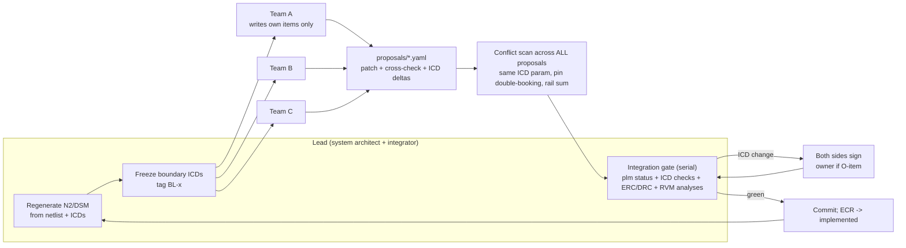

# Interface-driven development for one owner, a lead AI and parallel AI design teams

Status: research notes, 2026-10-01 (read-only study; nothing installed, no existing file edited) · Constraint: **FOSS only** (owner) · Judges: `docs/system/README.md`, `docs/system/integration-map.md`, `tools/plm.py`, `docs/system/plm/items.yaml`, `docs/system/plm/ecr/ECR-0001..0005.md`, and the one subsystem doc that existed at the time of writing (`docs/system/sub-audio-in.md`, uncommitted draft by another workflow).

All web sources accessed **2026-10-01**. Where I could not read the primary text, the claim is marked *unverified*.

---

## 1. Bottom line

- **What's solid:** generating the integration map from the SKiDL source, Doorstop-style suspect stamps on the symbols and nets that actually carry each interface, and the 8-point cross-check. Few small teams have anything this good.
- **The biggest hole:** the tracker detects *change*, not *inconsistency*.
  - Two live defects are the kind it can never catch: the mic port 0.75 mm off the lid bore (`sub-audio-in.md` Open issue 1), and LDO peaks of 315 mA against a 300 mA rating (ECR-0005).
  - Both were found by people reading. Neither would turn anything red today.
  - Established practice fixes this with **interface parameters with an owner, a value and a tolerance (an ICD)**, plus a check that runs on every change. Software calls this a **contract test**.
- **The tracker isn't running yet:**
  - No `baseline.json` is committed and there are no git tags.
  - `plm.py status`, run fenced on 2026-10-01, reports **50 UNREVIEWED, 12 MISSING-DOC, 0 SUSPECT**. Nothing can turn SUSPECT until a baseline exists.
- **Sign-off is one-sided:**
  - One `review --by X` clears an interface. NASA requires unanimous approval for interfaces that need sign-off from all sides.
  - ECSS separates the single-ended **IDD** from the agreed **ICD**. Our subsystem docs' "Interfaces" tables are IDDs: one side's view.
- **ECR impact is too broad to act on:**
  - ECR-0004 (the footprint for the Q1/Q2 bridge transistors) lists 14 relations and 11 docs.
  - `plm.py impact ref:Q1` lists exactly 2 relations. The ECR path rolls impact up to whole items.
  - The §10 cross-check is still `_(fill in)_` in all five ECRs.
- **No requirement-to-verification matrix exists:**
  - T1–T6 (success tests), D12/D17/D18 ("as requirements") and the §7 runtime figures are not linked to the checks in `sim/checks/` or the bench E-items.
  - That is the right side of the V, and it's missing.
- **Overkill, so don't do it:**
  - A SysML v2 or Capella model.
  - Separate ECO/ECN documents and a formal configuration control board (CCB).
  - Formal configuration audits (FCA/PCA).
  - Hard check-out locks as the main coordination tool between AI teams.
- **Multi-agent rule of thumb, from the sources in §3.9:**
  - Parallel teams only inside clusters the dependency matrix says are loosely coupled.
  - Freeze the interfaces at their boundaries *before* spawning them.
  - The lead integrates their results one at a time, through an automated gate.
  - Don't rely on agents coordinating with each other in real time.

---

## 2. Glossary of part numbers used here

- **STM32U575CIU6Q:** ST Cortex-M33 microcontroller with an internal core SMPS, QFN-48.
- **TPS7A2030:** TI 300 mA, 3.0 V low-noise LDO.
- **PMCXB290UE:** Nexperia complementary N+P MOSFET pair in SOT1216 (DFN1010B-6). Q1 and Q2 in the bridge.
- **SPH0641LU4H-1:** Knowles/Syntiant PDM MEMS microphone with an ultrasonic mode.
- **KMT0:** C&K IP68 tactile switch family.
- **BQ25180:** TI I²C Li-ion charger with power path.
- **RC-BC02:** bone-conduction exciter module.

---

## 3. Established practice (with sources)

### 3.1 Interface management and ICDs

- **NASA SE Handbook (SP-2016-6105 Rev 2), §6.3 Interface Management** ([nasa.gov/reference/6-3-interface-management](https://www.nasa.gov/reference/6-3-interface-management/), accessed 2026-10-01):
  - Outputs are the IRD (Interface Requirements Document), the ICD (Interface Control Document/Drawing), the IDD (Interface Definition Document) and the ICP (Interface Control Plan).
  - Quote: *"For interfaces that require approval from all sides, unanimous approval is required."*
  - An **Interface Working Group (IWG)** of people from the interfacing parties *"has the responsibility to ensure accomplishment of the planning, scheduling, and execution of all interface activities."*
  - Quote: *"Changing interface requirements late in the design or implementation life cycle is more likely to have a significant impact on the cost, schedule, or technical design."*
- **ECSS-E-ST-10-24C Rev.1, Interface management, 15 Nov 2024** (replaces the 1 Jun 2015 edition; [ecss.nl page](https://ecss.nl/standard/ecss-e-st-10-24c-rev-1-interface-management-15-november-2024/), accessed 2026-10-01):
  - Process: *"identification, requirements specification, definition, approval and control, implementation, verification and validation of interfaces."*
  - It defines four documents:
    - IRD (requirements);
    - **IID** (Interface Identification Document: the list of interfaces);
    - **IDD** (Interface Definition Document, the **single-end** ICD: one side's definition);
    - **ICD** (both sides, agreed).
  - The full PDF wasn't read, so the detailed approval clauses are *unverified*.
- **What this means here:**
  - `items.yaml` relations are an IID: they list which interfaces exist.
  - Each subsystem doc's "Interfaces" table is an IDD.
  - There is **no ICD layer**: no single record per interface that both sides agree to and that holds values and tolerances.

### 3.2 N² charts and Design Structure Matrices (DSM)

- **N² chart:**
  - Functions or subsystems go on the diagonal. The off-diagonal cell (i, j) holds what i passes to j.
  - NASA moved N² diagrams out of the Rev 2 handbook into the "Expanded Guidance for Systems Engineering", Appendix F ([nasa.gov appendix F stub](https://www.nasa.gov/reference/appendix-f-functional-timing-and-state-analysis/), accessed 2026-10-01). The expanded text itself wasn't read.
- **DSM:**
  - A square matrix of dependencies, read in the "row impacts column" convention or its transpose ([dsmweb.org intro](https://dsmweb.org/introduction-to-dsm/), accessed 2026-10-01).
  - Its two analyses are *"sequencing (to minimize cost and schedule risk in processes)"* and *"clustering (to facilitate modularity)."*
- **Primary literature** (bibliographic metadata checked through Crossref, 2026-10-01; full text not read):
  - Steward, D. V., "The design structure system: A method for managing the design of complex systems", *IEEE TEM* EM-28(3):71-74, Aug 1981. The origin of **partitioning**:
    - reorder the matrix so that feedback marks collapse into the smallest coupled blocks;
    - those blocks are the strongly connected components;
    - everything else can be done in sequence.
  - Browning, T. R., "Applying the design structure matrix to system decomposition and integration problems: a review and new directions", *IEEE TEM* 48(3), 2001. It covers component, team, activity and parameter DSMs, plus clustering of component DSMs into modules and teams. (The four-type description is from memory of the paper, *unverified* this session.)
- **Team boundaries** (Sosa, Eppinger & Rowles, "The misalignment of product architecture and organizational structure in complex product development", *Management Science*, Dec 2004; abstract via [Crossref](https://api.crossref.org/works/10.1287/mnsc.1040.0289), accessed 2026-10-01):
  - On an aircraft-engine programme, they mapped design interfaces against which teams actually talked to each other.
  - The paper reports *"how boundary effects moderate the impact of design interface strength."*
  - The lesson used here (the paper's detailed findings are *unverified*): **interfaces that cross team boundaries are the ones that go unattended.** Cluster first, then draw the team lines.
- **What this means here:**
  - Our integration map §3 is an N² in list form (net → blocks). It isn't drawn as a matrix.
  - Relations are **undirected** (`a`/`b`), so no sequencing is possible: you can't tell who produces a value and who consumes it.

### 3.3 Contract-first and consumer-driven contracts

- **Robinson, "Consumer-Driven Contracts: A Service Evolution Pattern", 12 Jun 2006** ([martinfowler.com](https://martinfowler.com/articles/consumerDrivenContracts.html), accessed 2026-10-01):
  - Each consumer states the parts of the provider it actually relies on, as **executable assertions**.
  - The provider then knows *"how [it] can evolve ... without breaking existing functionality."*
- **Pact docs** ([docs.pact.io](https://docs.pact.io/), accessed 2026-10-01): *"Contract testing is a technique for testing an integration point by checking each application in isolation to ensure the messages it sends or receives conform to a shared understanding that is documented in a 'contract'."*
- **What transfers to hardware:** a contract is a list of interface parameters. Each has one **owner (provider)**, a value, a tolerance and its consumers. Each consumer writes the check it depends on. Examples:

| Interface kind | Parameter (owner → consumer) | Executable check that's possible today |
|---|---|---|
| Mechanical | mic port centre in pod coordinates (board placement → lid bore) | footprint hole centre + `PLACE[U2]` + `shell_r1.PCB` vs `shell_r1.MIC`, abs(Δ) ≤ 0.1 mm |
| Mechanical | switch actuator centre and travel (board → lid plunger) | `PLACE[SW1]` vs `shell_r1.SWITCH`/`plunger` |
| Electrical | rail peak and average current vs the source's rating (each load → power) | Σ loads on +3V0 ≤ TPS7A2030 rating |
| Electrical / off-board | number of arm wires × litz diameter vs the heel channel and strut bore (output + UI → arm) | count of off-board arm nets vs `heel.CH_D` |
| Firmware pin contract | pin → required peripheral signal (schematic → firmware) | every MCU net's function exists on that pin in **ST's STM32_open_pin_data** (BSD-3-Clause), and no pin has two jobs |
| Acoustic | duct length, diameter, seal (board + body → mic) | sum of bore lengths and the gap vs the §8 duct rules |

- **The firmware pin contract was proven by hand on 2026-10-01.**
  - Source: `STM32U575CIUxQ.xml` from [github.com/STMicroelectronics/STM32_open_pin_data](https://github.com/STMicroelectronics/STM32_open_pin_data), whose LICENSE file is BSD-3-Clause.
  - It confirms pin 31 PA10 = TIM1_CH3 and pin 28 PB15 = TIM1_CH3N (the claim behind ECR-0003; the ECR said "re-verify").
  - It also confirms pin 30 PA9 = TIM1_CH2, pin 18 PB0 = TIM1_CH2N, pin 16 PA6 = ADC1_IN11, PB3 = ADF1_CCK0 and PB4 = ADF1_SDI0.
  - The same file lists PB3/PB4's reset-default debug roles (JTDO/TRACESWO, NJTRST). That reset-state fact belongs in the firmware pin contract too.

### 3.4 Configuration management (EIA-649 concepts)

- **NASA SE Handbook §6.5** ([nasa.gov/reference/6-5-configuration-management](https://www.nasa.gov/reference/6-5-configuration-management/), accessed 2026-10-01):
  - Five CM functions: planning, identification, change control (a CCB), status accounting and verification/audit.
  - It follows SAE/EIA-649B and 649-2.
  - Four baselines: **functional** (SDR), **allocated** (PDR), **product** (CDR) and **as-deployed** (ORR).
  - A **major** change is one that affects *"the baseline specification, cost, safety, compatibility with interfacing products ..."*.
- **SEBoK "Configuration Management"** ([sebokwiki.org](https://sebokwiki.org/wiki/Configuration_Management), last modified 2026-10-01, accessed 2026-10-01):
  - A baseline *"can only be changed through formal change procedures."*
  - Its pitfalls list includes "insufficient checks". Its good practices include "automated status accounting".
- **EIA-649C itself:** not read (SAE page didn't render; the standard is paywalled). The concepts above come from NASA and SEBoK.
- **Terms as used in industry** (convention, not checked against the EIA-649C text):
  - ECR = request plus impact analysis;
  - ECO = the approved order that changes the released data;
  - ECN = the notice to whoever builds or holds existing units;
  - **effectivity** = which units or builds a change applies to.
- **What this means here:**
  - Configuration items (CIs) exist: the 16 items, plus the source-of-truth files.
  - Change control exists in part: ECRs, with the owner as the CCB.
  - Status accounting exists: `plm.py status`.
  - Missing:
    - baselines (no tags, no committed baseline);
    - effectivity: rev-1 board versus rev-2, and the test build versus the final bonded build (O10);
    - the ECR states after "proposed";
    - an ECN-equivalent for the owner's bench: a rework note once boards exist.

### 3.5 Requirements traceability and verification matrices (V-model)

- **NASA §6.2** ([nasa.gov/reference/6-2-requirements-management](https://www.nasa.gov/reference/6-2-requirements-management/), accessed 2026-10-01):
  - Bidirectional traceability is *"the ability to trace any given requirement/expectation to its parent ... and to its allocated children."*
  - After SRR, requirement changes go through *"a Configuration Control Board (CCB) or equivalent authority."*
- **NASA Appendix D, Requirements Verification Matrix** ([nasa.gov appendix D](https://www.nasa.gov/reference/appendix-d-requirements-verification-matrix/), accessed 2026-10-01):
  - Its purpose is to make sure *"all the requirements are verified"*.
  - Each row: a unique ID, the source, the requirement statement and the verification method. The methods are Test, Analysis, Inspection and Demonstration.
- **V-model:** Forsberg & Mooz, "The Relationship of System Engineering to the Project Cycle", INCOSE International Symposium, Oct 1991 (metadata via Crossref, accessed 2026-10-01; text not read).
  - The left leg decomposes. The right leg integrates and verifies.
  - Each level's verification is planned when that level is defined.
- **What this means here:**
  - The spec has requirement-like items: T1–T6 (§1.3, locked), D12/D17/D18 marked "as requirements", the §7 runtime and current budgets, the O12 IPX4/5 target and D11 self-noise.
  - Checks also exist: `sim/checks/*.py` (Analysis), ERC/DRC (Inspection), the bench E-items (Test) and the adversarial audit.
  - **Nothing joins them.** The integration map's F1–F15 are function → implementation chains, the "left leg". There is no "how do we know it works" column.

### 3.6 MBSE-lite: when SysML v2 or Capella/Arcadia pays off

- **SysML 2.0 status:** formally adopted by OMG in September 2025 ([omg.org/spec/SysML](https://www.omg.org/spec/SysML/), accessed 2026-10-01).
- **The reference implementation is active:**
  - The pilot implementation's monthly release "2026-08" came out on 11 Sep 2026.
  - It ships a Jupyter kernel and an Eclipse plugin ([releases](https://github.com/Systems-Modeling/SysML-v2-Pilot-Implementation/releases), accessed 2026-10-01).
- **Arcadia (the Capella method):** operational, then system, then logical, then physical architecture, with functional chains. Our F1–F15 rows are already functional chains with physical allocations.
- **Judgement:**
  - The project is 1 product, about 60 parts, 16 items and 1 owner.
  - The real models already exist as code: SKiDL (`gen.py`), build123d (`hw/mech`) and the DSP sims.
  - A SysML/Capella model would be a **third copy** of the architecture. It would drift unless generated from those sources, and nothing generates SysML from SKiDL or build123d today.
  - So: take the *concepts* (ports with typed interfaces; IDD versus ICD; functional chains; allocation) and keep them in YAML next to the code.
- **When to revisit:** if firmware state machines and modes (D12) grow past what a doc can hold, or a second product variant appears. Even then, SysML v2's **textual** notation is the only form that is git-diff-friendly.

### 3.7 Integration readiness and interface maturity

- **Sauser, Gove, Forbes & Ramirez-Marquez**, "Integration maturity metrics: Development of an integration readiness level", *Information Knowledge Systems Management* 9(1):17-46, Feb 2010 (metadata via Crossref, accessed 2026-10-01).
  - It proposes a 9-level Integration Readiness Level (IRL), alongside TRL.
  - The level wording (from "interface identified" up to "proven in operation") is *unverified* this session.
- **SEBoK "System Integration"** ([sebokwiki.org](https://sebokwiki.org/wiki/System_Integration), accessed 2026-10-01):
  - *"The interface management process is particularly important for the success of the integration process"*.
  - Each element is verified on its own before integration.
  - Incremental integration localises faults. "Big bang" integration finds interface problems late.
- **NASA §5.2 Product Integration** ([nasa.gov](https://www.nasa.gov/reference/5-2-product-integration/), accessed 2026-10-01):
  - Integration uses the *"specifications, Interface Control Documents (ICDs), drawings, integration plan, procedures."*
  - It first *"confirm[s] that the received products ... have been validated ... including interface requirements."*
- **What this means here:**
  - An interface needs a **maturity number** that gates releases (proposal in §6.6).
  - The rev-1 JLC order is a "big bang" integration of board + shell + arm + pad unless interface checks run first.

### 3.8 How real teams stop local optimisation breaking the system

- **Conway's law** (Conway, "How Do Committees Invent?", *Datamation*, Apr 1968; [melconway.com](https://www.melconway.com/Home/Committees_Paper.html), accessed 2026-10-01): *"organizations which design systems ... are constrained to produce designs which are copies of the communication structures of these organizations."*
  - With AI design teams, the "communication structure" is the workflow script. The architecture will follow it.
- **Mirroring hypothesis** (Colfer & Baldwin, *Industrial and Corporate Change*, 2016; abstract via [Crossref](https://api.crossref.org/works/10.1093/icc/dtw027), accessed 2026-10-01):
  - *"partial mirroring, where knowledge boundaries are drawn more broadly than operational boundaries, is likely to be a superior strategy"* in fast-moving work.
  - **Applied here:** every team *reads* the whole system and *writes* only its own items.
- **Standard defences:**
  - a **system architect / integrator** who owns the cross-cutting "bus" elements and budgets (mass, volume, current, pins);
  - interface working groups (NASA IWG);
  - **phase-gate reviews** with entrance criteria (NASA §6.7 Technical Assessment: *"establishing each review's purpose, objective, and entry and success criteria"*, [nasa.gov](https://www.nasa.gov/reference/6-7-technical-assessment/), accessed 2026-10-01);
  - budgets with margins held centrally, not by each subsystem.

### 3.9 Multi-agent AI teams

- **Anthropic, "How we built our multi-agent research system"**, 13 Jun 2025 ([anthropic.com](https://www.anthropic.com/engineering/multi-agent-research-system), accessed 2026-10-01):
  - *"Each subagent needs an objective, an output format, guidance on the tools and sources to use, and clear task boundaries."*
  - *"Without detailed task descriptions, agents duplicate work, leave gaps..."*
  - *"domains that require all agents to share the same context or involve many dependencies between agents are not a good fit for multi-agent systems today"*.
  - *"LLM agents are not yet great at coordinating and delegating to other agents in real time."*
  - Subagents should write outputs to a filesystem *"to minimize the 'game of telephone'."*
  - Multi-agent runs use *"about 15× more tokens than chats."*
- **Cognition (W. Yan), "Don't Build Multi-Agents"**, 12 Jun 2025 ([cognition.com](https://cognition.com/blog/dont-build-multi-agents), accessed 2026-10-01):
  - *"Share context, and share full agent traces"*.
  - *"Actions carry implicit decisions, and conflicting decisions carry bad results."*
  - In their example, parallel subagents built a Mario-style background and a mismatched bird for a Flappy Bird clone.
- **Cemri et al., "Why Do Multi-Agent LLM Systems Fail?"**, arXiv:2503.13657 (v1 Mar 2025, v3 Oct 2025; [arxiv.org](https://arxiv.org/abs/2503.13657), accessed 2026-10-01):
  - The MAST taxonomy has 14 failure modes in three groups: **system design issues, inter-agent misalignment, task verification**.
  - It was built from 1,600+ annotated traces.
- **Hong et al., MetaGPT**, arXiv:2308.00352 (rev. Nov 2024; [arxiv.org](https://arxiv.org/abs/2308.00352), accessed 2026-10-01):
  - "Naively chaining LLMs" leads to cascading hallucinations.
  - Encoding SOPs and structured intermediate artefacts between roles lets agents *"verify intermediate results and reduce errors."*
- **What it adds up to:** make every implicit decision an **explicit interface parameter**, freeze contracts before running agents in parallel, use structured returns, integrate one result at a time, and verify independently.

---

## 4. Our method against established practice

| Practice | What we have (evidence) | Verdict |
|---|---|---|
| Interface identification (ECSS IID) | 34 relations in `items.yaml`; integration map §3 net → blocks | **Solid**, with 3 coverage gaps (§5.3) |
| Interface definition, single-ended (IDD) | "Interfaces" tables in subsystem docs (`sub-audio-in.md`) | **Solid** where docs exist. At the status run, 12 of 14 docs were missing. Drafts of sub-power, sub-processing and sub-dock-usb appeared (untracked) during this study |
| Interface control, two-sided (ICD) | none: relation = description + watches; no values, tolerances, owner side or direction | **Missing** |
| Both-side sign-off (NASA "unanimous approval") | `plm.py review <id> --by X`: one signer clears it | **Missing** |
| Change detection (Doorstop suspect links) | sha256 stamps on files, Python symbols, dict entries, greps, nets, refs, blocks | **Solid**, and finer-grained than Doorstop (which fingerprints item text and link UIDs: [item.md](https://github.com/doorstop-dev/doorstop/blob/develop/docs/reference/item.md), accessed 2026-10-01) |
| Consistency checks (contract tests) | none at interface level; the cross-check is prose; `sim/checks` verify physics, not interfaces | **Missing**, and the most valuable addition |
| N² / DSM view | the list form exists (§3); no matrix, no direction, no clustering | **Partial** |
| Where-used / impact | `plm.py impact ref:Q1` → 2 relations (precise) | **Solid** |
| ECR impact | item-level roll-up: 13–21 relations per ECR | **Weak** (alert fatigue) |
| ECR lifecycle | `proposed`/`approved` only; cross-check unfilled in 5/5; no effectivity, no ECN | **Partial** |
| Baselines (functional / allocated / product) | no `baseline.json` in git, no tags; 50 UNREVIEWED | **Missing** (designed, not started) |
| Configuration identification and precedence | README rule 4 (spec > sources > docs), "staleness is a bug" | **Solid** |
| Requirement → design traceability | F1–F15 chains; D-/O-items cited in docs | **Partial** (functions trace to design; requirements don't trace to functions) |
| Requirement → verification (RVM, V right leg) | none | **Missing** |
| Integration readiness / maturity | none | **Missing** |
| System architect owns the "bus" items | not stated; any team can check out REG-BOARD | **Missing** (REG-BOARD has the most relations: 9) |
| Gate reviews with entry criteria | adversarial audit workflow; design-review-v1; PCBA skill gates | **Partial** (strong reviews, not tied to baselines) |
| Coordinating parallel teams | check-out flags; JSON read-modify-write without a lock | **Fragile** |
| Generated, not hand-kept, facts | net/pin/block tables generated; FUNCTIONS/RAILS/MECH hand-kept in `system_map.py` and not cross-checked | **Partial**: the "board (3.9, 6.5)" body-versus-port error lives in the hand-kept text |

---

## 5. Evidence from probes run today (2026-10-01, read-only, fenced)

### 5.1 Tracker state
`python3 tools/plm.py status`:
- 12 MISSING-DOC (every subsystem and region doc except audio-in);
- 50 UNREVIEWED (all 16 items and 34 relations);
- 0 SUSPECT; 5 open ECRs, all `proposed`.

`git ls-files docs/system` has no `baseline.json` and no `checkouts.json`, and `git tag` is empty.

### 5.2 Block N² from the generated integration map
Each cell counts the signal and rail nets shared between two blocks (GND excluded). It was computed by a throwaway script in the session scratchpad (`n2_probe.py`), which parsed `integration-map.md` §2–§3.

```
             MCU CORE CLOCK  MIC BRIDG SELFT ARMPD DOCK CHARG CELL VBATS  LDO   UI DEBUG
       MCU    ##    2    2    3    5     1     1     4    5     .    1     1    2    4
 CORE_SMPS     2   ##    .    .    .     .     .     .    .     .    .     .    .    .
     CLOCK     2    .   ##    .    .     .     .     .    .     .    .     .    .    .
       MIC     3    .    .   ##    .     .     .     .    .     .    .     .    .    .
    BRIDGE     5    .    .    .   ##     1     2     .    1     .    .     1    1    1
  SELFTEST     1    .    .    .    1    ##     .     .    .     .    .     .    .    .
  ARM_PADS     1    .    .    .    2     .    ##     .    .     .    .     .    1    .
  DOCK_USB     4    .    .    .    .     .     .    ##    1     .    .     .    .    .
   CHARGER     5    .    .    .    1     .     .     1   ##     1    1     2    2    2
 CELL_PADS     .    .    .    .    .     .     .     .    1    ##    1     .    .    .
VBAT_SENSE     1    .    .    .    .     .     .     .    1     1   ##     .    .    .
       LDO     1    .    .    .    1     .     .     .    2     .    .    ##    2    2
        UI     2    .    .    .    1     .     1     .    2     .    .     2   ##    2
     DEBUG     4    .    .    .    1     .     .     .    2     .    .     2    2   ##
```

Reading it:
- MCU and CHARGER are the electrical hubs.
- BRIDGE touches 7 of the 13 other blocks, mostly through +3V0.
- That shared rail is the path for bridge noise into the MCU and mic (`sub-audio-in.md` Open issues 7–8, MP-01).

### 5.3 Relation-model coverage against the netlist (gaps found)
- **ARM_PADS (J1, J2, J7, J8) is owned by no item.**
  - A footprint or part change on the arm wire pads makes no doc STALE.
  - Only `PLACE[J1]`/`PLACE[J7]` (R-BOARD-ARM) and the net pin lists would notice.
- **SELFTEST is owned by two items** (SUB-OUTPUT and SUB-DEBUG-TEST), so it's unclear who signs.
- **Shared-resource interfaces aren't modelled.**
  - Example: the +3V0 consumers (bridge ↔ MCU/mic, bridge ↔ UI switch contact current) affect each other through the rail, but no relation exists between those consumer pairs.
  - Rails, GND, board area, enclosure volume, mass/balance (D18) and the power budget (§7) are **budgets**. Budgets are the classic thing a system architect holds.
- **WHOLE and INTEGRATION have no relations at all.** Their staleness never propagates.

### 5.4 Item DSM from `items.yaml` (relations per pair; undirected)
Relation degree per item:

| Item | Relations |
|---|---|
| REG-BOARD | 9 |
| SUB-POWER | 8 |
| REG-POD-BODY | 8 |
| SUB-PROCESSING | 7 |
| SUB-OUTPUT | 6 |
| SUB-UI | 6 |
| REG-ARM | 5 |
| SUB-DOCK-USB | 4 |
| SUB-DEBUG-TEST | 4 |
| SPEC | 3 |
| SUB-AUDIO-IN | 3 |
| REG-PAD | 3 |
| PHYSICAL | 1 |
| COST | 1 |
| WHOLE | 0 |
| INTEGRATION | 0 |

Rough clusters, *by inspection, not by algorithm*:
- **Power/output/test:** SUB-POWER, SUB-OUTPUT, SUB-DEBUG-TEST.
- **Pin-map cluster:** SUB-PROCESSING, SUB-AUDIO-IN, SUB-DOCK-USB, SUB-UI.
- **Mechanics:** REG-POD-BODY, REG-ARM, REG-PAD, PHYSICAL.
- **Buses:** REG-BOARD and REG-POD-BODY. Nearly every cluster touches them.

These clusters, not domain names, should set the number of parallel teams: about 3, plus the lead holding the buses. RaGraph's bus-detection algorithm or NetworkX community detection would confirm or correct this (§8).

### 5.5 Impact precision
- ECR-0004 (Q1/Q2 footprint): the ECR template computed **14 relations, 11 docs**.
- `plm.py impact ref:Q1` gives **2 relations** (R-PWR-OUT-RAIL, R-OUT-BOARD) and 1 owning doc.
- ECR-0002 lists **21 relations**.
- If every ECR asks for re-review of most of the system, reviewers will rubber-stamp. The `review ALL` shortcut in `plm.py` invites exactly that.

### 5.6 Two live interface defects that change detection can't see

**Mic port alignment** (`sub-audio-in.md` Open issue 1):

| Side | Where | Position |
|---|---|---|
| Board | footprint port is 0.77 mm off the package origin; port at board x 3.15 | pod x 33.75 |
| Lid | bore position in `shell_r1.py` | pod x 34.5 |

- Both sides assumed port = origin.
- Every watch would show "unchanged and reviewed" while the holes miss by 0.75 mm.
- **A 10-line alignment check fails today. That's the point.**

**+3V0 budget** (ECR-0005):

| | Value |
|---|---|
| Bridge peak at full drive | ~315 mA |
| TPS7A2030 rating | 300 mA |

- A budget check over a loads table fails today.

---

## 6. Proposed method (concrete, git-native, FOSS, no servers)



The owner sees this as a rendered PNG once a diagram pass is done (render.sh, dark mode). This notes file is text-only by brief.

### 6.1 ICDs: grow the relations, don't replace them

Turn each `items.yaml` relation into one file `docs/system/icd/<ID>.yaml`. Keep `plm.py`'s watch syntax as the *source* pointer for each parameter, and keep the stamps per ICD file (as Doorstop keeps them per item), so parallel edits don't collide in one `baseline.json`.

```yaml
id: ICD-AUDIO-BODY            # was R-AUDIO-BODY
title: Mic acoustic port, board hole <-> lid bore
type: acoustic-mechanical
sides:
  a: {item: SUB-AUDIO-IN, steward: audio}     # provides the port position (board placement)
  b: {item: REG-POD-BODY, steward: mech}      # consumes it (lid bore)
parameters:
  - {name: port_x_pod, owner: a, unit: mm, value: 33.75, tol: 0.10,
     source: ["file:hw/lib/...Knowles_LGA-5_3.5x2.65mm_Port0.6.kicad_mod", "sym:hw/pod/place_r1.py::PLACE[U2]", "sym:hw/mech/shell_r1.py::PCB"]}
  - {name: bore_x_pod, owner: b, unit: mm, source: ["sym:hw/mech/shell_r1.py::MIC"]}
  - {name: seal, owner: b, value: "chimney or washer, no open gap", source: ["sym:hw/mech/shell_r1.py::lid_base"]}
checks: [sim/checks/interfaces.py::mic_port_alignment, sim/checks/interfaces.py::mic_duct_rules]
maturity: 2                   # see 6.6
signoff:                      # SUSPECT clears only when BOTH carry the current stamp
  a: {by: null, date: null, stamp: null}
  b: {by: null, date: null, stamp: null}
```

- **Direction (`owner`) per parameter** gives single-source values, consumers who know what they rely on (Robinson 2006), and DSM sequencing.
- Start with the interfaces that cross a board, body or arm boundary (about 12), then power↔output. Don't convert all 34 at once.

### 6.2 Executable interface checks (contract tests)

These would live in `sim/checks/interfaces.py`, run by `plm.py status`. An interface counts as "green" only when it is signed by both sides **and** its checks pass.

| # | Check | Inputs | Result if run today |
|---|---|---|---|
| 1 | mic_port_alignment | footprint NPTH, PLACE[U2], shell PCB/MIC | fails by 0.75 mm |
| 2 | rail_budget(+3V0) | loads table (owned per load) vs TPS7A2030 rating | fails, 315 > 300 mA |
| 3 | mcu_pin_contract | gen.py nets → required signal per pin vs ST `STM32U575CIUxQ.xml` (BSD-3); one job per pin; reset state listed | passes for the pins checked in §3.3 |
| 4 | switch_plunger | PLACE[SW1], shell SWITCH/plunger, KMT0 travel 0.15 mm | unknown |
| 5 | height_bands | part heights (footprint 3D or datasheet) vs 1.2 mm bands, per face | unknown (data needed) |
| 6 | arm_wire_capacity | count of off-board arm nets × litz OD vs heel CH_D and strut bore | unknown |
| 7 | edge_bands | no courtyards in the 0.6 mm clamp bands, both faces | unknown |

Also generate `firmware/pins.h` from gen.py: firmware compiles against the schematic, not a copy. That's contract-first for the hardware/firmware boundary.

### 6.3 N² and DSM, generated
- Add a **block N²** (as in §5.2) and an **item DSM** to `integration-map.md`, built from the netlist and the ICDs, with GND and rails shown separately as budget rows.
- Then:
  - **partition** the directed parameter graph (strongly connected components plus ordering): a coupled block such as board ↔ body ↔ cell needs joint iteration; the rest can be sequenced;
  - **cluster** it to choose team scopes;
  - **detect buses**: whatever every cluster touches is lead-owned.
- Render a dark-mode PNG for the owner.

### 6.4 Baselines and the ECR lifecycle

**Baselines are git tags**, each with a manifest (file hashes, plus the plm stamps at that moment):

| Tag | Contents |
|---|---|
| **BL-0** | today's set, once the docs land |
| **BL-alloc** | schematic Rev F + ICDs at ≥ L3, before layout freeze |
| **BL-product-rev1** | the exact release sent to JLC; the `release-pcba-fabrication` skill already builds the manifest |
| **BL-asbuilt-test / BL-asbuilt-final** | per O10 |

**ECR states:** `proposed → approved/rejected → implemented (commit SHAs) → verified (checks green, both sides signed) → closed`.
- Add `effectivity:`, one of `rev1-order`, `rev1-rework`, `rev2`, `test-build`, `final-build`.
- Once rev-1 boards exist, a change that applies to built boards also needs a **rework note** (the owner's ECN): what to cut, what to bodge, a photo.
- Impact is computed from the **targets** the change touches (refs, nets, symbols), as `plm.py impact` already does, not from whole items.
- The §10 cross-check becomes a required YAML block, validated with `jsonschema` (MIT, already in the venv): pins and nets must exist, rail deltas must add up.

### 6.5 Requirement → verification matrix (RVM)

`docs/system/verification.yaml` would generate a table with these columns: ID, source line, requirement (quoted, never edited, because §1 is locked), allocated items/F-rows, method (T/A/I/D), artefact, status, evidence (commit plus output path).

Seed rows:

| ID | Requirement | Method | Artefact |
|---|---|---|---|
| T1–T6 | §1.3 success tests | Test | owner field tests; plus partial Analysis: T6 ↔ `pwm_noise.py`, `pwm_ultrasonic_leak.py`, the idle detector |
| D12 | modes (Off = mic unpowered) | Analysis + Test | |
| D17 | output ceiling, pop-free start | Analysis + Test | |
| D18 | runtime ≥ 8 h and balance | Analysis | `power.py`, `balance.py` |
| | | Test | E4 |
| O12 | IPX4 minimum | Test | |
| D11 | self-noise | Test | owner listening test |

One gate rule: no baseline without every Analysis row green.

### 6.6 Interface maturity ladder (IRL-inspired, simplified)

| Level | Meaning |
|---|---|
| L0 | in the N² but no ICD |
| L1 | ICD stub: sides and stewards named |
| L2 | parameters with owner, value and tolerance (an IDD from one side) |
| L3 | both sides signed the same stamp (an ICD) |
| L4 | sources implement the values |
| L5 | executable check passes |
| L6 | verified on hardware, with bench evidence |

Gates:
- **Rev-1 JLC order:** every ICD that crosses board/body/arm/pad at ≥ L5, others ≥ L4.
- **Final bonded build (O10):** sealing, acoustic port and arm ICDs at L6.

### 6.7 Protocol for parallel AI design teams
1. **The lead is the system architect and integrator.**
   - It owns the buses: REG-BOARD, REG-POD-BODY, the MCU pin map, the rail budgets and the shared frame (`frame.py`).
   - Teams propose changes there; they never edit them.
   - The owner remains the change authority for spec and O-items (a CCB of one).
2. **Before spawning:**
   - regenerate the N²/DSM;
   - set team scopes from clusters (about 3), not domain names;
   - freeze the boundary ICDs (tag);
   - give each team: write scope (its items), read scope (everything; partial mirroring), the frozen ICDs, and a structured return schema (Anthropic 2025; MetaGPT).
3. **Teams return files, not chat:**
   - a patch, plus `proposals/<team>.yaml` with the cross-check fields;
   - ICD parameter deltas with reasons;
   - every implicit decision made explicit (Cognition principle 2).
4. **Conflict scan across all concurrent proposals before integrating:**
   - the same ICD parameter changed twice;
   - the same MCU pin claimed twice;
   - Σ rail deltas over budget;
   - the same bus item touched → integration review.
   - Today §10 item 3 asks for this ("including other domains' proposals") but no tool does it.
5. **Integration gate, run by the lead, one result at a time:**
   - apply → `plm.py status` + interface checks + ERC (+ DRC) + RVM analyses → commit;
   - ICD changes need both stewards' sign-off (the lead signs for a side that has no live team; the owner signs when an O-item is touched).
6. **Independent verification at baselines:** the adversarial-audit workflow covers MAST's "task verification" failures. Keep it.
7. **Replace check-out locks:**
   - Keep check-out only as an advisory "intent" record.
   - If it stays, make the JSON writes atomic (`fcntl.flock` or `O_EXCL` per-item lock files).
   - Today two agents checking out at the same moment can silently lose one record.

---

## 7. Overkill: don't do this

- **SysML v2 / Capella model of the pod:** a third copy of the architecture that nothing generates (§3.6). SysON (SysML v2 web modeller) needs a Spring server plus PostgreSQL in Docker (its `docker-compose.yml`, read 2026-10-01). That conflicts with the memory rules on this shared laptop.
- **Separate ECO and ECN documents, CCB meetings, formal FCA/PCA:** fold them into ECR states, the release manifest (a "PCA-lite") and the owner's rework notes.
- **Watching the whole +3V0 pin list (28 pins) as an interface:** any new decoupling capacitor makes two relations SUSPECT. Watch the budget parameters and the source part instead.
- **More items:** 16 is the right size. Fix ownership (ARM_PADS, SELFTEST) rather than splitting further.
- **`review ALL`:** remove it, or restrict it to the owner with a mandatory note listing what was checked.

---

## 8. FOSS tools (licence read from the repository's licence file unless noted)

| Tool | Licence (evidence) | Latest release / activity | Footprint | Scriptable / git | Verdict |
|---|---|---|---|---|---|
| **NetworkX** | BSD-3-Clause (`LICENSE.txt`, main) | 3.7, 2026-09-21 (PyPI); requires Python != 3.14.1 (venv is 3.14.4) | pure Python, no server | full API | **adopt**: SCC partitioning, ordering, community clustering. Not installed: owner/setup.sh decision |
| **STM32_open_pin_data** (ST) | BSD-3-Clause (`LICENSE`, master) | updated with each CubeMX release; U575CIUxQ file headed "Copyright (c) 2025" | XML data only | parse with stdlib | **adopt** as data for the MCU pin contract (§6.2 #3) |
| **jsonschema** | MIT (installed package metadata; PyPI) | 4.26.0 on PyPI; 4.19.2 in the venv | in venv already | API | **adopt** to validate ICD/ECR YAML |
| **Graphviz** | EPL-2.0 (upstream `LICENSE`, gitlab main); EPL-1.0 in the installed 14.1.2 Debian copyright | installed | CLI | text `.dot` diffs well | **adopt** (already used by `plm.py graph`) |
| **git** | GPL-2.0 (well known; not re-read) | 2.53.0 installed | - | tags = baselines | **adopt** (tags + manifests) |
| **RaGraph** (Ratio CASE) | GPL-3.0-or-later (GitLab API licence for `LICENSE.md`; PyPI License-Expression) | 1.24.1, 2026-05-18; repo active 2026-05-26 | Python; deps incl. `ratio-genetic-py` (GPLv3+ classifier, abi3 wheels); the plot extra pulls plotly + kaleido (Chromium) | API | **watch / adapt-ideas**: has DSM clustering (Markov, Tarjan), sequencing (SCC tearing, genetic) and **bus detection (gamma)**. Run once to confirm §5.4 clusters; NetworkX covers the rest |
| **Doorstop** | LGPL-3.0 (`LICENSE.md`, develop); PyPI also lists a stray "Other/Proprietary" classifier, but the file is LGPL-3 | 3.2, 2026-07-10; pushed 2026-09-28 | Python, YAML files, CLI, about 10 deps | yes | **adapt-ideas**: store review stamps *in the linked record* (per-link parent fingerprint), not one central baseline file. `plm.py` already does the rest at finer grain |
| **StrictDoc** | Apache-2.0 (`LICENSE`, main) | 0.30.1, 2026-09-16; pushed 2026-09-25 | Python, about 36 deps (FastAPI, pandas, plotly, robotframework, nuitka...); optional local web server | CLI `strictdoc export` (HTML/ReqIF/JSON/Excel); `.sdoc` text in git | **watch**: good RVM/traceability, but it would duplicate `spec.md` (§1 can't move). A YAML RVM plus a 100-line generator is enough now |
| **OpenFastTrace** | GPL-3.0 (`LICENSE.txt`, main) | 4.10.0, 2026-09-20 | Java CLI | Markdown/code tags, coverage reports | **watch**: useful later for firmware requirement → code → test tracing |
| **Sphinx-Needs** | MIT (`LICENSE`, master) | 8.5.0, 2026-09-03 | needs a Sphinx doc build | yes | **skip**: would mean converting the docs to Sphinx |
| **SysML v2 Pilot Implementation** | EPL-2.0 (`LICENSE`, master; a `LICENSE-GPL` file also present) | monthly; "2026-08" released 2026-09-11 | Eclipse plugin / Jupyter kernel (zip ~120 MB) | textual notation diffs well | **watch** (revisit per §3.6) |
| **SysON** | EPL-2.0 (`LICENSE`, main) | v2026.9.0 (Sep 2026; year inferred from the tag) | web app: Spring + PostgreSQL 15 via Docker Compose | REST | **skip**: always-on server + DB |
| **Eclipse Capella** | EPL-2.0 (`LICENSE.md`, master) | v7.1.0, "03 Aug" (year not displayed; follows v7.0.1 of 2025-03-24) | Java/Eclipse desktop | GUI-first | **skip** the tool; **adapt** the Arcadia concepts |
| **py-capellambse** | Apache-2.0 (`LICENSES/Apache-2.0.txt`, SPDX header) | 0.8.1, 2026-01-20 | Python 3.11–3.14, headless | full API | **skip** unless Capella is adopted |
| **Gaphor** | Apache-2.0 (`LICENSES/Apache-2.0.txt`) | 3.3.2, 2026-05-02 | GTK desktop (UML/SysML v1, C4) | Python API | **skip** |
| **sysml-2ls (SysIDE legacy)** | EPL-2.0 (`LICENSE`, main) | **archived 2025-10-13**; successor "Syside Editor" licence not verified as OSI | VS Code extension | - | **skip** (archived; treat the successor as excluded until a licence file proves otherwise) |
| **KiBot** | **AGPL-3.0** per `LICENSE` (PyPI says GPLv3+; the file wins) | 1.9.1, 2026-07-28: Python 3.14, *experimental* KiCad 10 | Python + many external tools | YAML config, CLI | **watch**: baseline release bundles and diffs between tags. The PCBA release skill already covers the essentials |
| **KiRI** | MIT (`LICENSE`, main) | active repo; KiCad 7+ through `kicad-cli` | shell/Python, local HTML | CLI | **watch**: visual schematic/PCB diff between commits suits the owner's visual review of ECRs. KiCad 10 support unverified |
| **Pact** (pact-python) | MIT (PyPI licence text) | 3.4.1, 2026-09-17 | software/HTTP only | - | **adapt-ideas** (consumer-driven contracts, a "can-i-deploy"-style gate); the tool itself doesn't apply |

**Excluded as non-FOSS** (not evaluated further): commercial PLM/requirements suites, proprietary DSM tools, Octopart/Nexar (paid API).

**Owner question, not dropped:** `tools/jlc.py` calls JLCPCB's **undocumented public parts-search JSON endpoint** (`jlcpcb.com/api/overseas-pcb-order/v1/...`).
- It's a vendor data source, not software, so no OSI licence applies. JLC is the chosen fabricator (D8).
- Options:
  - (a) keep it as a dated data source (**recommended**: no FOSS substitute holds JLC's live Basic/Extended class and stock);
  - (b) do manual lookups on jlcpcb.com and record them in the sourcing lock;
  - (c) drop live stock data until order time.
- The owner decides.

---

## 9. Open questions for the owner
1. **The JLC endpoint** (above): keep it as a data source?
2. **ICD sign-off:** when one side of an interface has no live team, does the lead sign for it, or do you?
   - Recommendation: the lead signs, and **you sign any ICD that touches an O-item** (sealing, button, dock, cell, LED).
3. **Gates:** adopt the maturity gates in §6.6 for the rev-1 JLC order?
4. **Installs (`tools/setup.sh`):**
   - NetworkX (BSD-3): recommended.
   - RaGraph (GPL-3.0+): optional, for one clustering run.
   - ST's pin-data XML: vendor a copy into the repo, BSD-3 notice kept.

## 10. Sources (all accessed 2026-10-01)
- NASA SE Handbook SP-2016-6105 Rev 2, online sections:
  - §6.3 https://www.nasa.gov/reference/6-3-interface-management/
  - §6.5 https://www.nasa.gov/reference/6-5-configuration-management/
  - §6.2 https://www.nasa.gov/reference/6-2-requirements-management/
  - §5.2 https://www.nasa.gov/reference/5-2-product-integration/
  - §6.7 https://www.nasa.gov/reference/6-7-technical-assessment/
  - App. D https://www.nasa.gov/reference/appendix-d-requirements-verification-matrix/
  - App. F stub https://www.nasa.gov/reference/appendix-f-functional-timing-and-state-analysis/
- ECSS-E-ST-10-24C Rev.1 (15 Nov 2024), page summary: https://ecss.nl/standard/ecss-e-st-10-24c-rev-1-interface-management-15-november-2024/
- SEBoK:
  - Configuration Management: https://sebokwiki.org/wiki/Configuration_Management
  - System Integration: https://sebokwiki.org/wiki/System_Integration
- DSM: https://dsmweb.org/introduction-to-dsm/
  - Steward 1981, doi:10.1109/TEM.1981.6448589
  - Browning 2001, doi:10.1109/17.946528
  - Sosa, Eppinger, Rowles 2004, doi:10.1287/mnsc.1040.0289 (Crossref metadata)
- Robinson 2006: https://martinfowler.com/articles/consumerDrivenContracts.html · Pact: https://docs.pact.io/
- Forsberg & Mooz 1991, doi:10.1002/j.2334-5837.1991.tb01484.x · Sauser et al. 2010, doi:10.3233/IKS-2010-0133 (Crossref metadata)
- Conway 1968: https://www.melconway.com/Home/Committees_Paper.html · Colfer & Baldwin 2016, doi:10.1093/icc/dtw027
- OMG SysML: https://www.omg.org/spec/SysML/
- Multi-agent:
  - Anthropic: https://www.anthropic.com/engineering/multi-agent-research-system
  - Cognition: https://cognition.com/blog/dont-build-multi-agents
  - Cemri et al.: https://arxiv.org/abs/2503.13657
  - MetaGPT: https://arxiv.org/abs/2308.00352
- Tool licence files and release data:
  - raw.githubusercontent.com (paths in §8), the GitLab API (RaGraph), PyPI JSON (release dates)
  - GitHub API (`pushed_at` for Doorstop, StrictDoc, Sphinx-Needs, OpenFastTrace before rate-limiting)
  - GitHub release pages (Capella, SysML v2 pilot, SysON, OpenFastTrace, KiBot)
  - `eclipse-syson/syson/main/docker-compose.yml`
  - `STMicroelectronics/STM32_open_pin_data/master/mcu/STM32U575CIUxQ.xml`
- **Not read (paywalled or not retrievable):** SAE EIA-649C text; INCOSE SE Handbook 5th ed. (Wiley 2023; incose.org returned 403); NASA Expanded Guidance App. F (N²).
