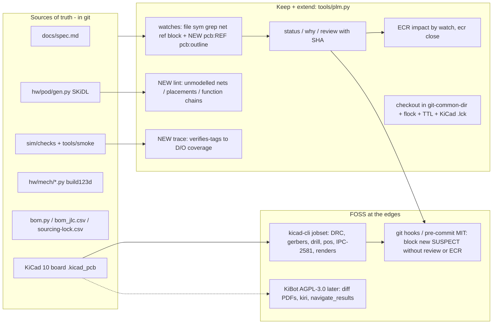

# FOSS PLM / PDM / ALM / traceability / hardware-CI tools vs our `tools/plm.py`

Status: research note, 2026-10-01 (Claude, workflow agent; read-only research, nothing installed) ·
Constraint (owner): **FOSS only**: OSI licence verified from the repo's licence file; no freeware, proprietary
"community editions", paid-tier features or SaaS · Sources: every claim is cited at the end, all accessed 2026-10-01.

Tool names are glossed on first use. "Teamcenter" = Siemens' commercial PLM (product lifecycle management) suite.

## 1. Answer first

1. **No FOSS suite does for us what Teamcenter does.** The FOSS PLM servers (OdooPLM, InvenTree, ERPNext) store
   parts, BOMs and CAD files in a database. They are built around mechanical CAD vaulting and stock, and know
   nothing about KiCad, SKiDL or build123d. Each needs Docker + PostgreSQL running permanently, and its state
   lives outside git. The FOSS requirements tools (Doorstop, StrictDoc, sphinx-needs, OpenFastTrace,
   TRLC + LOBSTER) are git-native, but they trace *requirement text to code tags*. None of them watches a net,
   a part's pins, a placement entry or a CAD constant, which is the whole point of our relations. The FOSS
   MBSE (model-based systems engineering) tools (Capella, Papyrus, SysON, the SysML v2 pilot, Gaphor) would
   become a **second model of the pod**, kept in sync by hand with `gen.py` and `shell_r1.py`. That is worse
   than what we have.
2. **Recommendation: Option B: keep `tools/plm.py` as the core and fix it. Add FOSS tools only at the edges:**
   KiCad's own `kicad-cli` jobsets now and KiBot later for design-data CI, a plain git hook (or `pre-commit`)
   for enforcement, and ideas (not code) from Doorstop, OpenFastTrace, LOBSTER and InvenTree.
3. **Be clear about today's state: `plm.py` is currently decorative.** No baseline has ever been taken, so nothing
   can turn SUSPECT. The rev-1 board is not in git and not watched. ECR impact lists 38-62 % of all
   relations, so it is noise. Nothing enforces the rule. Section 3 has the evidence; section 6 has the fixes
   (about 1-2 agent-days in total).



## 2. The yardstick: what "Teamcenter for a one-person, many-agent hardware project" means here

| Need | What it means for the pod | `plm.py` today |
|---|---|---|
| N1 Relations + suspect links | An interface (net, placement, CAD constant, spec clause) changes, and both sides get flagged | **Designed, not live.** Watch model is excellent (symbol- and dict-entry-level, netlist-aware); no baseline exists, so 0 suspect / 50 unreviewed |
| N2 Where-used / impact | "What does touching Q1 (or U3, OUT_A, `PCB`) affect?" | **Good** at watch level (`impact ref:Q1` gives 2 relations); **bad** in ECRs (item adjacency gives 14) |
| N3 Change requests | Proposal, impact, owner decision, implementing commits, closure | Half: `ecr new/list` only. No close, no SHA, cross-check section never filled (5/5 ECRs) |
| N4 Baselines / releases | A frozen, named state that a fab release or review refers to | git commits/tags exist; `baseline.json` does not exist yet; reviews store no SHA |
| N5 Check-out / conflict flags | Two teams (agents or the owner in KiCad) don't edit coupled things blind | Works on one working tree, but racy (no lock), no expiry, blind to KiCad's own `.lck` |
| N6 Requirement traceability | Spec D/O items to the design element **and** the check that verifies it | Requirement to doc only (grep on IDs); **no requirement to verification link** |
| N7 Design-data CI | ERC/DRC/BOM/fab outputs/visual diff, run on every change | Ad hoc scripts; no jobset, no hook, no PCB diff |

## 3. Current method: evidence and blunt critique

Runs on 2026-10-01 (fenced at 3 G; `plm.py status` takes 1.47 s wall and 256 MB max RSS):

```
MISSING-DOC (7)   UNREVIEWED (50)
16 items, 34 relations: 0 suspect, 0 stale, 0 broken, 50 unreviewed      (exit 1)
```

What is good, and better than any FOSS tool evaluated:
- **Watch granularity.** `sym:PATH::NAME[KEY]` hashes one dict entry of a Python file via `ast` (so comment and
  whitespace edits are ignored). `net:` / `ref:` / `block:` hash the SKiDL netlist itself. Nothing in Doorstop,
  StrictDoc, sphinx-needs, OFT or LOBSTER can watch "the `PLACE[U2]` entry" or "net `MIC_CLK`'s pin list". The
  closest is StrictDoc linking to a Python *function or class*, and Doorstop hashing a *whole file*.
- **BROKEN** (a watch that no longer resolves) is a real PLM feature: it catches a renamed net or a deleted part.
  Most requirements tools only catch dangling IDs.
- It is ~425 lines, git-diffable YAML/Markdown/JSON, needs no server, and agents can script it from the CLI.
- The generated integration map (`system_map.py`) is the right pattern: derived from the source of truth,
  never hand-edited.

What is broken or weak:
1. **No baseline, so suspect detection is off.** `docs/system/plm/baseline.json` does not exist. Until a first
   honest review is committed, every change is invisible to `status`.
2. **The board is neither in git nor watched.** `hw/pod/draft_r1/` (the rev-1 placed/routed boards, 3.4 MB) is
   untracked (`git status`: `?? hw/pod/draft_r1/`). `REG-BOARD` watches `place_r1.py` (the generator), but
   CLAUDE.md says the KiCad board becomes the source of truth once placement starts, and the owner drives KiCad
   (O14). Her moves in KiCad will flag nothing.
3. **ECR impact is too broad to be useful.** `ecr new` takes every relation of every changed item. ECR-0004
   (a footprint redraw for Q1/Q2, the H-bridge MOSFET pair) lists 14 relations and 11 docs, including the mic
   and the dock. `plm.py impact ref:Q1` lists 2. Over the 5 ECRs, impact covers 13-21 of 34 relations and
   11-12 of 14 docs. When the impact list says "everything", nobody reads it.
4. **The cross-check is not done.** All 5 ECRs still carry `_(fill in)_` in the integration-map §10 section.
   The 8-point cross-check exists only as prose.
5. **Review is a rubber stamp.** `review` re-hashes the current state and stores neither the git SHA nor the old
   watch text. A reviewer cannot ask "show me what changed since the last review". Doorstop has the same flaw.
   OpenFastTrace avoids it with explicit revision numbers.
6. **The relation model has no completeness check.** Relations are hand-kept. A *new* inter-block net (ECR-0003
   adds bridge leg B on PA10/PB15) gets no relation unless someone remembers. A renamed net goes BROKEN (good),
   but an added one goes unnoticed. `system_map.py` already computes the inter-block nets, so this is
   checkable. The hand-written FUNCTIONS chains (F1-F15) are also never validated against the netlist.
7. **Check-outs are racy.** `checkouts.json` gets a read-modify-write with no file lock (two agents can both win),
   claims never expire, and the file sits in the working tree, so separate git worktrees would not see each
   other's claims. KiCad already writes `*.lck` files when the owner opens a board; `plm.py` ignores them.
8. **No requirement-to-verification trace.** D11 (switching-regulator rule), the power budget and the O-items are
   tied to docs but not to the checks that prove them (`sim/checks/*.py`, `tools/smoke`, DRC). This is the core
   job of every ALM (application lifecycle management) tool, and we lack it.
9. **Nothing enforces anything.** No hook or CI runs `status` or regenerates the integration map. The README rule
   ("update in the same commit") depends on agent discipline.
10. **Noise risks.** `WHOLE` owns `grep:docs/spec.md::\b[DO][0-9]+\b`, so any spec line that mentions any D/O ID
    makes it STALE. `file:` watches are byte-level. Expect suspect fatigue once baselines exist; tighten these
    before the first baseline.

## 4. Tools evaluated

Licence = what the repository's licence file says (file named), not the package metadata. Where they disagree
it is noted. "Activity" = last push to the default branch (GitHub API, 2026-10-01).

### 4.1 PLM / PDM servers (items, BOMs, ECOs, check-out)

| Tool (gloss) | Licence (evidence) | Latest release | Footprint | Covers | Verdict |
|---|---|---|---|---|---|
| **Aras Innovator** (enterprise PLM platform) | **Proprietary.** Community Edition is "no subscription license fee" under a licence agreement behind a registration form; "you need to request a license key"; up to 50 named users | n/a | Windows / Windows Server, SQL Server, .NET | N1-N5 (for MCAD) | **excluded-not-foss** |
| **Odoo PLM** (`mrp_plm`, ECOs/versions/approvals) | Odoo core is LGPL-3.0 (`LICENSE`), but `addons/mrp_plm` is **absent** from the community repo (18.0 and 19.0: HTTP 404; `addons/mrp` 200), so it ships only in the separately licensed Enterprise edition | n/a | Odoo + PostgreSQL | N2-N4 | **excluded-not-foss** |
| **OCA** (Odoo Community Association) modules | per-module (not read) | OCA/manufacture 19.0 has BOM helpers only (`mrp_bom_tracking`: "Logs any change to a BoM in the chatter"); no `OCA/plm` repo (404) | Odoo + PostgreSQL | sliver of N4 | **skip** |
| **OdooPLM** (OmniaSolutions; 36 PLM modules on Odoo Community) | **AGPL-3.0** (GitHub licence detection; README: "the server modules in this repository are open source"). **CAD client is proprietary** ("a proprietary application distributed by OmniaSolutions"); its FreeCAD link goes through that client | v19.0.1.0.17, 2026-08-12; active | Docker image **2.5-4.4 GB** + PostgreSQL, always-on web server | N2 where-used, N3 ECR, N4 BOM revisions, N5 check-out, `plm_mcp` (where-used for AI agents) | **adapt-ideas** (its `plm_mcp` where-used/"what would a change affect" queries are exactly what our `impact` does). No KiCad/SKiDL/build123d integration, and DB state is not git-diffable |
| **OpenPLM** (Django PLM) | GPL-3.0+ (README in `amarh/openPLM`) | last commit **2014-11-04**; `openplm.org` now serves a gambling spam page | Python 2 / Django 1.5 era | historical | **skip** (dead) |
| **InvenTree** (parts/stock/BOM server) | **MIT** (`LICENSE`) | 1.5.6, 2026-09-26; very active | Docker recommended; Python 3.12+ web app + DB | N2 ("Used In" tab), part revisions, BOM "validated" flag auto-invalidated on change | **adapt-ideas / later.** Its BOM-validation flag is our SUSPECT idea applied to BOMs. Worth it only if the owner starts tracking bench stock |
| **Part-DB** (electronic parts inventory) | AGPL-3.0 (GitHub detection) | v2.19.2, 2026-09-28 | PHP/Symfony server + DB | inventory only | **skip** |
| **ERPNext** (FOSS ERP with BOMs) | GPL-3.0 (GitHub detection) | v15.121.6, 2026-09-30 | Frappe server, MariaDB, Redis | BOM where-used, ERP | **skip** (an ERP is the wrong tool for this) |
| **Tuleap** (ALM server) | not verified (repo mirror 404; docs redirected) | not verified | PHP + MySQL server | N3, N6 | **skip** (heavy server; licence unverified) |
| **Valispace** (engineering-parameter / requirements platform) | **Proprietary SaaS**, owned by Altium, now "Requirements Portal" | n/a | SaaS | N1, N6 | **excluded-not-foss**. No maintained FOSS equivalent found. Our Python constants modules (`frame.py`, `shell_r1.py`) with `sym:` watches already are a code-native Valispace |

### 4.2 Git-native requirements / traceability (ALM-lite)

| Tool (gloss) | Licence (evidence) | Latest release | Footprint | Covers | Fit to us | Verdict |
|---|---|---|---|---|---|---|
| **Doorstop** (requirements as YAML files in git) | **LGPL-3.0** (`LICENSE.md`; GitHub shows NOASSERTION) | v3.2, 2026-07-10; pushed 2026-09-28; Python >=3.10,<3.15 | pip; CLI + optional GUI/server | N1 (link stamps: each link stores the parent's SHA-256 fingerprint; `doorstop clear` re-stamps), N6 (`references:` to files, optional per-file sha) | Hashes **whole files** or keyword lines, not symbols or nets. Its unit is a requirement item in a parent/child document tree, while ours are undirected interfaces. Would need `docs/spec.md` split into items, which touches an owner-locked source | **adapt-ideas**: store stamps *on the relation* (merge-friendly, one file per relation if branches multiply) |
| **StrictDoc** (requirements/docs as `.sdoc` text, web UI) | **Apache-2.0** (`LICENSE`) | 0.30.1, 2026-09-16; active | pip (FastAPI, textX, lxml...); `strictdoc server` or static export | N6 strong: `File` relations down to a **Python function or class**; `@relation(REQ-1, scope=function)` markers; ReqIF import/export; experimental Git Diff/Changelog; project statistics | No suspect/stamp mechanism (it relies on git diff). Cannot watch module-level constants, dict entries or nets | **watch**: the best FOSS option *if* the owner ever restructures the spec into per-requirement items (her decision; §1 locked) |
| **sphinx-needs** (requirement objects inside Sphinx docs) | **MIT** (`LICENSE`) | 8.5.0, 2026-09-03 (PyPI) | pip + Sphinx build | N6 (need objects, links, needtable/needflow, needs.json import/export) | Docs-as-code for a Sphinx site. We write Markdown; no change detection found in the docs | **skip** |
| **open-needs** (lifecycle-object server) | MIT (GitHub detection) | `useblocks/open-needs` last push 2021-11-02; `open-needs/open-needs-server` last push 2024-06-19 | server | (N6) | dormant | **skip** |
| **OpenFastTrace (OFT)** (requirement tracing via tags in Markdown + code) | **GPL-3.0** (`LICENSE.txt`) | 4.10.0, 2026-09-20; active | Java 17+, single JAR CLI | N6 coverage reports; **explicit revisions**: "Incrementing the revision voids all existing links to this item" | No Python-symbol or netlist awareness; adds a JVM | **adapt-ideas**: let a review mark a change *semantic* (bump a relation revision) vs *cosmetic* (re-stamp only) |
| **TRLC** (BMW "Treat Requirements Like Code": typed requirement files + checker) | **GPL-3.0** (`LICENSE`) | trlc-3.1.0, 2026-09-30; active | pip | typed requirements, static checks | Same "spec split" cost as Doorstop | **skip** |
| **LOBSTER** (BMW traceability evidence report: tags in code/tests to requirements) | **AGPL-3.0** (`LICENSE.md`) | lobster-1.0.6, 2026-07-30; active | pip; graphviz for the report | N6 + verification coverage (Python, C++, gtest, JSON inputs). One input adapter targets Codebeamer (proprietary; irrelevant) | Needs TRLC (or similar) requirements as input | **adapt-ideas**: `# verifies: D11` tags in `sim/checks` + a `plm.py trace` report give 80 % of it in ~50 lines |
| **reqif** (Python ReqIF parser; ReqIF = OMG Requirements Interchange Format, XML) | **Apache-2.0** (GitHub detection) | 0.1.0, 2026-08-11 | pip | interchange only | Only useful if requirements must go to/from a customer's DOORS-type tool. Not our case | **skip** |
| **Eclipse RMF / ProR** (ReqIF reference GUI) | EPL-1.0 (Eclipse project page) | 0.14.0, **2016-03-01**; "Incubating" | Eclipse RCP | ReqIF editing | dead | **skip** |
| **rmToo** (text-file requirements tool) | not verified (GitHub: NOASSERTION; file not read) | v26.0.2, 2025-07-16; pushed 2025-09-26 | Python | N6 | not needed | **skip** |

### 4.3 MBSE / SysML

| Tool (gloss) | Licence (evidence) | Latest release | Footprint | Fit | Verdict |
|---|---|---|---|---|---|
| **Eclipse Capella** (Arcadia-method MBSE workbench) | **EPL-2.0** (`LICENSE.md`) | v7.1.0, 2026-08-03; active | Eclipse RCP desktop, Java; `.capella`/`.aird` XML models | A full functional/logical/physical architecture model. It would duplicate `gen.py` + `system_map.py` by hand, and Arcadia is a steep learning curve | **skip** for this project size |
| **py-capellambse** (headless Python read/write of Capella models) | **Apache-2.0** (`LICENSES/Apache-2.0.txt`) | v0.8.0, 2026-01-20 | pip | Makes Capella scriptable by agents, if Capella were adopted | **skip** (moot without Capella) |
| **Eclipse Papyrus** (UML/SysML 1.x modeller) | **EPL-2.0** (eclipse.dev download page) | 2025-06 (7.x); no newer release listed 15 months on | Eclipse RCP | Same duplication problem; slowing | **skip** |
| **SysML v2 Pilot Implementation** (OMG reference: textual notation, Eclipse plugins, Jupyter kernel) | **EPL-2.0** (`LICENSE`) | "2026-08", published 2026-09-11; monthly | Eclipse 2025-12 + Java 21, or Jupyter | Textual SysML v2 is git-diffable and could formally express items, ports, connections and requirements. OMG adopted SysML 2.0 in Sep 2025. The README itself calls it a pilot for prototyping | **watch** (the long-term standard way to write `items.yaml`) |
| **Eclipse SysON** (web SysML v2 modeller, by Obeo) | **EPL-2.0** (`LICENSE`) | v2026.9.0, 2026-09-09; active | `docker-compose`: `postgres:15` + Java app on :8080 | Graphical, form and textual editors; a DB-backed server | **watch** (too heavy for this machine as an always-on service) |
| **SysIDE** (`sensmetry/sysml-2ls`, SysML v2 language server) | EPL-2.0 or GPL-2.0 with Classpath Exception (`LICENSE`) | 0.9.1, 2025-10-02; **archived** | VS Code extension | discontinued as FOSS | **skip** |
| **Gaphor** (light UML/SysML modeller in Python) | **Apache-2.0** (`LICENSES/Apache-2.0.txt`; pyproject classifier) | 3.3.2, 2026-05-02; pushed 2026-09-29 | pip/GTK desktop; Python scripting API | Nice for drawing SysML block diagrams by hand; same duplication problem | **skip** (our diagrams are generated) |
| **OpenMBEE** (MMS model-management server, View Editor, MDKs) | **Apache-2.0** (exec-mms; flexo-mms-layer1-service) | exec-mms 4.0.20, 2024-03-07 (pushed 2025-11-08); Flexo MMS layer1 v0.2.2, 2026-01-28 | Java/Kotlin servers; the main authoring MDK targets Cameo (proprietary) | Built for large teams and Cameo users | **skip** |

### 4.4 Hardware design-data CI, diff and KiCad itself

| Tool (gloss) | Licence (evidence) | Latest release | KiCad 10 | Footprint | Covers | Verdict |
|---|---|---|---|---|---|---|
| **KiCad 10 built-ins** (`kicad-cli` 10.0.6 is installed) | GPL (KiCad project; not re-read here) | 10.0.0 on 2026-03-20; 10.0.6 on 2026-08-29 | native | already installed | **Jobsets** (`kicad-cli jobset run`: a saved list of outputs, run in one go); `pcb drc`; `pcb export gerbers/drill/pos/ipc2581/odb/step/render/stats`; **project-manager Git integration**; **incremental backups + Local History panel**; **design variants** (new in 10); **PCB design blocks** (new in 10); "Compare Symbol with Library". **No built-in schematic/PCB diff** (not in the KiCad 10 manual) | **adopt** jobsets now. Variants and schematic features barely apply: **our schematic is SKiDL, there is no `.kicad_sch` in the repo** |
| **KiBot** (KiCad automation runner: one YAML, all outputs) | **AGPL-3.0** (`LICENSE`; PyPI metadata says GPL-3.0, the file wins) | v1.9.1, 2026-07-28; very active | yes ("KiCad 10.0.5 or newer is recommended"; KiCad 10 variants support); Python 3.14 support added in 1.9.1 | pip into the venv; full features need KiAuto/KiDiff and extras (Docker images available but not needed) | N7: DRC/ERC filtering, gerber/drill/position, BOM, `diff` ("creates PDF files showing schematic or PCB changes"), `kiri` (interactive web diff), `navigate_results`, `pcb_variant`, `compress`. Its `kicost` output depends on distributor APIs (Octopart/Nexar etc.), so **don't use that output** | **adopt later** (when joint layout starts and visual board diffs are needed). Needs an owner OK for the install |
| **KiDiff** (PDF/visual diff of two KiCad PCB/SCH files; git diff plug-in) | **GPL-2.0** (`LICENSE`) | v2.6.0, 2026-06-01; active | via kicad-cli / KiAuto | pip; schematics need KiAuto | N7 PCB diff at review points | **adopt later** (comes with KiBot) |
| **kiri** (KiCad Revision Inspector: web UI over git history) | **MIT** (`LICENSE`) | last release 1.0.0, **2021-12-18**; commits to 2026-06-22 | uses kicad-cli for KiCad >= 7; KiCad 10 not stated | shell + Python + a local web server | visual history browsing | **watch** (KiBot's `kiri` output covers it) |
| **KiKit** (panelisation, fab presets) | **MIT** (`LICENCE`) | v1.8.1, 2026-08-05 | not checked | pip | fab presets, panels | **skip for PLM** (relevant to release, not change tracking) |
| **kicad-python** (KiCad IPC API bindings) | **MIT** (`LICENSE`, GitLab) | 0.8.0, 2026-08-30 | yes | pip; needs a running KiCad | live board queries | **watch**. For `pcb:` watches, use the already-installed `pcbnew` module (no running GUI needed) |
| **build123d** (our CAD kernel library) | **Apache-2.0** (`LICENSE`) | v0.13.0, 2026-09-21 | n/a | installed | Its own CI is plain `pytest` (`.github/workflows/test.yml`: `python -m pytest -n auto`) | **adopt the practice**: pytest geometry assertions (volume, bounding box, `intersect` volume == 0 for clashes, `MIN_GAP` from `pod.py`) and a mass-properties JSON as the git-diffable artefact. Don't diff STEP files |

### 4.5 Large files, enforcement, forge

| Tool (gloss) | Licence (evidence) | Latest release | Footprint | Covers | Verdict |
|---|---|---|---|---|---|
| **git-lfs** (large binaries out of the git object store) | **MIT** (`LICENSE.md`) | v3.8.0, 2026-08-28 | client binary; needs an LFS server | Large files; **file locking** (`git lfs lock`) is a true PDM check-out but "requires ... the Git LFS server" with the locking API | **watch**: `.git` is 17 MB and the largest tracked file is a 2.8 MB STEP model (duplicate STEP blobs are deduplicated by git). Not needed now |
| **DVC** (data version control) | **Apache-2.0** (`LICENSE`) | 3.67.1, 2026-03-31 | pip; remote storage | big data / sim outputs | **skip** (sim outputs are regenerable and gitignored) |
| **git-annex** | not verified (source host returned 403) | - | - | large files | **skip** |
| **pre-commit** (git-hook manager) | **MIT** (`LICENSE`) | v4.6.2, 2026-08-10 | pip; hooks run locally | N7 enforcement | **adopt** (or a 20-line plain `.git/hooks/pre-commit`; both are FOSS) |
| **act** (runs GitHub Actions workflows locally) | **MIT** (`LICENSE`) | v0.2.89, 2026-06-01 | needs Docker | local CI emulation | **skip**: our CI should be a local script, not GitHub Actions (GitHub is SaaS) |
| **Forgejo** (self-hosted git forge: PRs, issues, LFS locks, Actions) | **GPL-3.0** (`LICENSE`, Codeberg) | not checked | always-on Go server + DB | PR-based ECR review, LFS locking | **watch** / owner question (an always-on server on a shared laptop) |

## 5. Coverage: who does which need (yes / part / no)

| | N1 suspect relations | N2 where-used | N3 ECR | N4 baselines | N5 check-out | N6 req trace | N7 design CI | git-native | No server |
|---|---|---|---|---|---|---|---|---|---|
| `plm.py` (as is) | part (no baseline) | yes | part | part | part | part | no | yes | yes |
| `plm.py` + fixes (Option B) | **yes** | **yes** | **yes** | **yes** | **yes** | **yes** | via jobset/KiBot | yes | yes |
| OdooPLM | part (BOM/doc level) | yes | yes | yes | yes | no | no | **no** | **no** |
| InvenTree | part (BOM validated flag) | yes | no | part | no | no | no | **no** | **no** |
| Doorstop | yes (file level) | part | no | via git | no | yes | no | yes | yes |
| StrictDoc | no (git diff only) | part | no | via git | no | yes | no | yes | optional |
| OFT / LOBSTER | part (revisions) | part | no | via git | no | yes (+ verification) | no | yes | yes |
| Capella / SysON / SysML v2 | no | yes (in-model) | no | part | SysON: server-side | part | no | Capella/SysON: no; SysML v2 text: yes | Capella yes / SysON no |
| KiBot + KiDiff | no | no | no | no | no | no | **yes** | yes | yes |

## 6. Options (owner decides)

**A. Replace `plm.py` with a FOSS suite** (e.g. OdooPLM for items/ECR/check-out, plus StrictDoc for requirements,
plus KiBot for CI).
- Cost: a permanent Docker + PostgreSQL stack (the OdooPLM image is 2.5-4.4 GB) on a shared 30 GB laptop with
  a past OOM incident; two new mental models; state outside git.
- Agents would need its API and could no longer `git diff` the PLM state.
- No tool in this set understands SKiDL nets or build123d constants, so we would still need custom watch code.
- **Net: more weight, less coverage. Not recommended.**

**B. Keep `plm.py`, fix it, add FOSS at the edges (recommended).**
- Every gap in section 3 is a small, local code change.
- The edge tools (kicad-cli jobsets, KiBot/KiDiff, pre-commit) are FOSS, need no server, and are scriptable.
- Ideas borrowed: Doorstop link stamps, OFT revisions, LOBSTER verification tags, InvenTree's BOM-validated
  flag, OdooPLM's MCP-style where-used queries.

**C. Keep `plm.py` exactly as is.**
- Cheapest today, but it stays decorative: no baseline, the board unwatched, ECR impact = everything, no
  enforcement.
- It would give false confidence: "status is clean" while nothing is being checked. **Not recommended.**

### Option B work list (ordered; effort = agent time)

**Now (before the joint layout session, O14):**
1. **Take the first baseline honestly** once the subsystem/region docs exist (another workflow is drafting them;
   7 are MISSING-DOC today). Review each relation against its doc, then commit `baseline.json`. Before that,
   narrow the noisy watches: `WHOLE`'s all-IDs grep becomes per-ID anchors; whole-file `file:` watches on
   `.py` files become `sym:` watches where possible. Effort 2-3 h.
2. **Put the board under git and under watch.**
   - Commit `hw/pod/draft_r1/*.kicad_pcb` and `*.kicad_pro`. Keep `.kicad_prl`, `.dsn`, `.ses` and renders
     ignored.
   - Add watch kinds: `pcb:FILE::REF` (footprint id, side, x, y, rotation, read with the installed `pcbnew`
     module), `pcb:FILE::outline`, `pcb:FILE::rules`.
   - Re-point `REG-BOARD` and the `R-*-BOARD` relations from `place_r1.py` to the board.
   - Effort 2-3 h.
3. **`plm.py lint` (completeness).**
   - Every inter-block net in `system_map` has a relation watching it.
   - Every footprint on the board is owned by an item.
   - Every net named in a FUNCTIONS chain (F1-F15) exists in the netlist.
   - Anything else reports as UNMODELLED.
   - Effort 1-2 h.
4. **ECR impact by watch, not adjacency.**
   - `ecr new --touches ref:Q1,ref:Q2,glob:hw/lib/pod.pretty/Nexperia*` lists only the relations whose watches
     match (2-3, not 14).
   - Record `git rev-parse HEAD` at raise time.
   - Add `ecr close`, which refuses while the relations it caused are SUSPECT.
   - Generate the §10 cross-check as filled-in data (nets/pins/rails diffed from the netlist) instead of
     `_(fill in)_`.
   - Effort 2-3 h.
5. **Review with evidence.**
   - `review` stores the HEAD SHA and the watch text (small).
   - `plm.py why <id>` shows `git diff <sha> -- <path>` for `file`/`sym`/`grep` watches, and a text diff for
     `net`/`ref`/`pcb` watches.
   - Optional `--semantic` flag bumps the relation's revision (the OFT idea), so cosmetic and real changes are
     told apart in the log.
   - Effort ~2 h.
6. **Check-out hardening.**
   - Move `checkouts.json` to `$(git rev-parse --git-common-dir)/plm/`, so it is shared by all worktrees and
     never committed.
   - Lock it with `fcntl.flock` and add a TTL (12 h default).
   - Treat a KiCad `*.lck` next to a watched board as "owner has REG-BOARD open" and raise a CONFLICT FLAG for
     any agent touching it.
   - Effort ~1 h.
7. **Enforcement hook** (plain `.git/hooks/pre-commit` or the `pre-commit` framework, MIT):
   - Regenerate `integration-map.md` and fail if it differs.
   - Fail on *new* BROKEN/SUSPECT unless the same commit reviews them, or the message cites `ECR-nnnn`
     (commit-msg hook).
   - Keep it fast: `status` is 1.5 s. Heavy jobs (DRC) stay out of the hook.
   - Effort ~1 h.

**Soon:**

8. **Design-data CI script** (`tools/ci.sh`, run under the 3-4 G fence):
   - A committed `.kicad_jobset` for DRC (JSON report), gerbers, drill, pos, IPC-2581 and top/bottom renders.
   - SKiDL ERC from `gen.py`.
   - `tools/smoke/run_all.py --offline`.
   - pytest geometry checks for `hw/mech`: clash = `intersect` volume > 0, gaps >= `MIN_GAP`, mass and centre
     of mass written to JSON and diffed in git.
   - Effort half a day.
9. **Requirement-to-verification trace** (`plm.py trace`, the LOBSTER idea without LOBSTER):
   - Add `# verifies: D11, O12` tags in `sim/checks/*.py` and smoke tests.
   - Report D/O items with no verifying check, and tags citing IDs that no longer exist.
   - Effort ~2 h.
10. **KiBot + KiDiff** (AGPL-3.0 / GPL-2.0) once the owner is moving parts in KiCad: a `diff` output between the
    last release tag and HEAD for visual board review, plus `navigate_results` as one browsable page. Requires
    an install into `/opt/ultrasonic-tools/venv` (owner approval). Effort half a day.

**Later / watch:**
- SysML v2 textual models (pilot, SysON) as a formal replacement for `items.yaml` if the product family grows.
- StrictDoc, if the spec is ever split into per-requirement items.
- git-lfs, if binaries (renders, photos, STEP) push `.git` into the hundreds of MB.
- InvenTree, if bench stock tracking is wanted.

## 7. Owner questions (separate from the tool choice)

- **Q1: JLCPCB parts endpoint (`tools/jlc.py`).**
  - What it is: JLC's undocumented public JSON search endpoint (`jlcpcb.com/api/overseas-pcb-order/v1/...`).
    It is a free proprietary data service, not a FOSS tool, so it falls outside the FOSS rule's "tools" but is
    not FOSS either. Flagged, not dropped.
  - Options:
    - (a) keep it as a data source, with dated queries as now (recommended: it is the authoritative source for
      the fab we use);
    - (b) switch to `yaqwsx/jlcparts` (MIT tool; it builds a database from JLC's own published parts data, so
      the data owner is the same) or `Bouni/kicad-jlcpcb-tools` (MIT; downloads a parts database);
    - (c) manual lookups on jlcpcb.com.
  - Your call.
- **Q2: GitHub as the remote.**
  - GitHub is SaaS. Under the FOSS rule nothing in this plan uses GitHub Actions or other GitHub-only features;
    all CI runs locally.
  - A self-hosted Forgejo (GPL-3.0) would add FOSS PR review and LFS locks, at the cost of an always-on server.
    Recommendation: keep GitHub as a plain remote; your call.
- **Q3: KiBot install.** KiBot (AGPL-3.0) means `pip install kibot` (+ KiDiff) into the shared venv. AGPL
  obligations only bite if we distribute or serve modified KiBot; internal use is fine. Approve when layout
  starts?

## 8. Sources (all accessed 2026-10-01)

Local evidence (2026-10-01): `python3 tools/plm.py status` (fenced 3 G; 1.47 s, maxrss 261528 kB, exit 1);
`plm.py impact ref:Q1`; `git status` (`?? hw/pod/draft_r1/`); `ls docs/system/plm` (no `baseline.json`);
`grep -c "_(fill in)_" docs/system/plm/ecr/*.md` (1 in each of 5); `kicad-cli version` = 10.0.6;
`du -sh .git` = 17 MB; `git ls-files | grep .kicad_sch` = none.

Repository metadata (licence detection, last push, latest release): `https://api.github.com/repos/<owner>/<repo>`
and `.../releases/latest` for: doorstop-dev/doorstop, strictdoc-project/strictdoc, useblocks/sphinx-needs,
useblocks/open-needs, open-needs/open-needs-server, itsallcode/openfasttrace, eclipse-capella/capella,
Systems-Modeling/SysML-v2-Pilot-Implementation, eclipse-syson/syson, gaphor/gaphor, strictdoc-project/reqif,
git-lfs/git-lfs, treeverse/dvc, INTI-CMNB/KiBot, leoheck/kiri, INTI-CMNB/KiDiff, yaqwsx/KiKit, gumyr/build123d,
inventree/InvenTree, OmniaGit/odooplm, bmw-software-engineering/lobster, bmw-software-engineering/trlc,
Open-MBEE/exec-mms, Open-MBEE/flexo-mms-layer1-service, Part-DB/Part-DB-server, dbinfrago/py-capellambse,
pre-commit/pre-commit, nektos/act, sensmetry/sysml-2ls, odoo/odoo, frappe/erpnext, florath/rmtoo, amarh/openPLM,
yaqwsx/jlcparts, Bouni/kicad-jlcpcb-tools. PyPI JSON (`https://pypi.org/pypi/<pkg>/json`) for sphinx-needs,
doorstop, strictdoc, kibot, kidiff, trlc, bmw-lobster-core, gaphor, capellambse, reqif, dvc, kicad-python.

Licence files read (raw.githubusercontent.com unless noted):
- doorstop `LICENSE.md` (LGPL-3.0)
- strictdoc `LICENSE` (Apache-2.0)
- sphinx-needs `LICENSE` (MIT)
- openfasttrace `LICENSE.txt` (GPL-3.0, via the GitHub licence API)
- capella `LICENSE.md` (EPL-2.0)
- SysML-v2-Pilot-Implementation `LICENSE` (EPL-2.0)
- syson `LICENSE` (EPL-2.0)
- gaphor `LICENSES/Apache-2.0.txt` + `pyproject.toml`
- py-capellambse `LICENSES/Apache-2.0.txt`
- sysml-2ls `LICENSE` (EPL-2.0 / GPL-2.0+CE)
- git-lfs `LICENSE.md` (MIT)
- KiBot `LICENSE` (AGPL-3.0)
- KiDiff `LICENSE` (GPL-2.0)
- kiri `LICENSE` (MIT)
- KiKit `LICENCE` (MIT)
- build123d `LICENSE` (Apache-2.0)
- InvenTree `LICENSE` (MIT)
- dvc `LICENSE` (Apache-2.0)
- lobster `LICENSE.md` (AGPL-3.0)
- trlc `LICENSE` (GPL-3.0)
- pre-commit `LICENSE` (MIT)
- act `LICENSE` (MIT)
- odoo `LICENSE` (LGPL-3.0)
- Forgejo `https://codeberg.org/forgejo/forgejo/raw/branch/forgejo/LICENSE` (GPL-3.0)
- kicad-python `https://gitlab.com/kicad/code/kicad-python/-/raw/main/LICENSE` (MIT)

Docs and pages:
- **Doorstop**: `https://raw.githubusercontent.com/doorstop-dev/doorstop/HEAD/docs/reference/item.md` (fingerprints,
  link stamps, `references` + sha) and `.../docs/cli/validation.md` (suspect links, `doorstop clear`).
- **StrictDoc**: `https://raw.githubusercontent.com/strictdoc-project/strictdoc/HEAD/docs/strictdoc_01_user_guide.sdoc`
  (language-aware parsing, Python function/class relations, Diff/Changelog) and
  `https://strictdoc.readthedocs.io/en/stable/stable/docs/strictdoc_01_user_guide.html`.
- **sphinx-needs**: `https://sphinx-needs.readthedocs.io/en/latest/`.
- **OpenFastTrace**: `https://raw.githubusercontent.com/itsallcode/openfasttrace/main/README.md` (Java 17, JAR CLI)
  and `.../doc/user_guide/introduction/concepts_and_terms.md` (revision voids links).
- **LOBSTER**: `https://raw.githubusercontent.com/bmw-software-engineering/lobster/HEAD/README.md`.
- **Aras**: `https://aras.com/en/download` (Community Edition: licence agreement via form, licence key,
  50 named users, Windows/SQL Server/.NET), `https://aras.com/en/subscription`.
- **Odoo**:
  - `https://raw.githubusercontent.com/odoo/odoo/{18.0,19.0}/addons/{mrp,mrp_plm}/__manifest__.py`
    (200 / 404);
  - `https://www.odoo.com/page/editions` (Enterprise "(licensed)");
  - `https://www.odoo.com/documentation/19.0/applications/inventory_and_mrp/plm.html` (ECOs, versions,
    approvals).
- **OdooPLM**: `https://raw.githubusercontent.com/OmniaGit/odooplm/HEAD/README.md` (Docker 2.5-4.4 GB,
  PostgreSQL, proprietary CAD client, `plm_mcp`).
- **OCA**: `https://raw.githubusercontent.com/OCA/manufacture/HEAD/README.md`; `OCA/plm` README 404.
- **OpenPLM**: `https://raw.githubusercontent.com/amarh/openPLM/HEAD/README` (GPL-3.0+); commits API (last
  2014-11-04); `https://www.openplm.org/` (spam page).
- **InvenTree**: `https://docs.inventree.org/en/latest/manufacturing/bom/` ("Used In", validated flag),
  `https://docs.inventree.org/en/latest/part/revision/`, `https://docs.inventree.org/en/latest/start/`.
- **Valispace**: `https://www.valispace.com/` (Altium, Requirements Portal).
- **SysML / MBSE**:
  - `https://www.omg.org/spec/SysML/` (SysML 2.0 adopted September 2025);
  - `https://github.com/Systems-Modeling/SysML-v2-Pilot-Implementation` (Eclipse 2025-12, Java 21, pilot);
  - `https://github.com/eclipse-syson/syson` + `docker-compose.yml` (postgres:15);
  - `https://eclipse.dev/papyrus/download.html`, `https://projects.eclipse.org/projects/modeling.papyrus`;
  - `https://projects.eclipse.org/projects/modeling.mdt.rmf` (RMF 0.14.0, 2016-03-01, EPL-1.0);
  - `https://www.openmbee.org/`;
  - Gaphor README; py-capellambse README.
- **KiCad**:
  - `https://www.kicad.org/blog/2026/03/Version-10.0.0-Released/` (variants, PCB design blocks, pin/gate swap);
  - `https://www.kicad.org/blog/` (10.0.6 on 2026-08-29);
  - `https://docs.kicad.org/10.0/en/kicad/kicad.html` (Git integration, incremental backups / Local History,
    jobsets; no diff);
  - `https://docs.kicad.org/10.0/en/eeschema/eeschema.html` (design variants, database libraries, design
    blocks, Compare Symbol with Library).
- **KiBot**: `https://raw.githubusercontent.com/INTI-CMNB/KiBot/master/CHANGELOG.md` (1.9.0/1.9.1 KiCad 10,
  Python 3.14), `https://kibot.readthedocs.io/en/latest/` and `.../configuration/outputs.html` (output list,
  `diff`, `kiri`).
- **KiDiff and kiri**: KiDiff README (git plug-in, KiAuto dependency); kiri README (kicad-cli for KiCad >= 7).
- **git-lfs**: `https://raw.githubusercontent.com/git-lfs/git-lfs/HEAD/docs/man/git-lfs-lock.adoc` and
  `.../docs/api/locking.md` (locks need the LFS server's locking API).
- **build123d CI**: `https://raw.githubusercontent.com/gumyr/build123d/HEAD/.github/workflows/test.yml`.
- **jlcparts**: `https://raw.githubusercontent.com/yaqwsx/jlcparts/HEAD/README.md` (database from JLC's published
  parts data).

Unverified (stated as such above): Tuleap licence; rmToo licence; git-annex licence; KiCad's own licence (not
re-read); kiri on KiCad 10; per-module OCA licences; absence of change detection in sphinx-needs (not found in the
docs page read). The web-search budget was exhausted, so no broad search for other FOSS "Valispace-like" tools was
possible. Unknown tools may exist.
