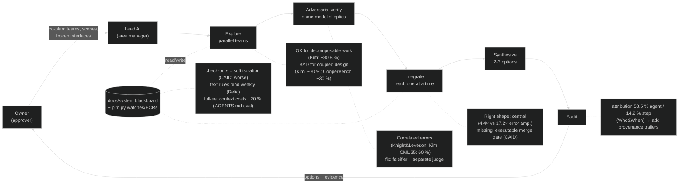

# Prior art: generative project management and multi-agent orchestration (2023-2026)

Status: research notes, 2026-10-01 · Lens: multi-agent LLM orchestration, why it fails, verification, human approval gates, project memory, documentation drift, LLMs in project/change management · Author: research subagent (read-only; nothing installed, no existing file edited). Constraint: **FOSS only** for anything recommended for adoption.

Companion notes, not repeated here: `llm-design-agents.md` (agent loops per engineering domain), `classic-concurrent-engineering.md` (1985-2020 agent-based concurrent engineering, the blackboard papers B2/B3), `../methodology/method.md` (interfaces, ICDs, DSM). MAST, MetaGPT and the Anthropic research-system post are also cited there. This note goes deeper on them from the orchestration side.

**How this was searched.** WebSearch was out of budget (200/200 used by earlier workflows), and Semantic Scholar returned HTTP 429. Discovery used the Hugging Face papers index (`hf://papers` search), OpenAlex, arXiv abstract/HTML pages, HF `paper.md` full text, and project READMEs. Licences were read from each repo's LICENSE file (GitHub API `repos/<r>/license` until it rate-limited, then `raw.githubusercontent.com/<r>/<branch>/LICENSE`). All access dates are **2026-10-01**. Each entry says how deep I read it. Coverage leans toward arXiv/HF; proprietary tools were not evaluated.

---

## 1. Bottom line (blunt)

1. **Multi-agent is not better or worse in general. Whether it pays depends on the task, and that is now measured.**
   - Kim et al. (260 configurations, 2025/26):
     - **+80.8 %** on decomposable tasks;
     - **−70 %** on sequential constraint satisfaction;
     - extra agents *hurt* once a single agent already succeeds more than about **45 %** of the time.
   - Independent agents with no central verification amplify errors **17.2×**; a central orchestrator holds that to **4.4×**.
   - Our coupled design decisions are sequential constraint satisfaction: LDO current vs bridge peaks (ECR-0005), mic port vs lid bore, pin map vs layout. **Parallel teams belong on decomposable work** (research, option generation, audits). Coupled decisions go through one integrator, one at a time.
2. **Agents working as peers do worse than one agent.**
   - CooperBench (2026): two agents sharing a job score **30 % lower** than one agent doing both halves.
   - The failures are communication, commitment and expectation failures.
   - MAST: inter-agent misalignment is 32.2 % of observed failures, and verification failures are another 24.6 %.
3. **Our check-out mechanism is the kind of isolation that measurably fails.**
   - CAID (CMU, 2026) compared two ways of keeping agents apart:
     - "soft isolation": one shared workspace, a manager assigns non-overlapping files and warns agents off each other's work;
     - physical isolation: one `git worktree` per agent, with a test-gated merge.
   - Soft isolation lost on both benchmarks. On PaperBench it scored **below a single agent** (55.5 vs 57.2).
   - `plm.py checkout` is soft isolation: an advisory flag in a shared working tree. It has **never been used**: on 2026-10-01 there is no `docs/system/plm/checkouts.json`, and no `baseline.json` either.
4. **A second copy of the same model is not an independent check.**
   - Knight & Leveson (1986): 27 independently written programs failed *together* far more often than chance.
   - Kim et al. (ICML 2025): when two LLMs are both wrong, they agree on the same wrong answer **60 %** of the time.
   - Panickssery et al. (2024): LLMs recognise and favour their own output.
   - Homogeneous debate makes it worse:
     - conformity up to 85.5 %;
     - correct answers present in the pool are thrown away by the vote (up to 32 points);
     - it often fails to beat chain-of-thought or self-consistency, at 2-3× the tokens.
   - Self-correction without external feedback does not work (Huang et al., ICLR 2024).
   - What does help:
     - **external executable feedback** (MetaGPT's tests; CAID's test-gated merge);
     - **adversarial debate in front of a separate judge** (Khan et al. 2024: a non-expert judge reached 76 %, and humans 88 %, against 48 % and 60 % baselines).
   - So the "adversarial verify" step is worth its tokens only when the skeptic must return a **falsifier** (a failing check, or a primary-source quote with a page number) and a different party judges.
5. **Rules written as text don't bind; rules that execute do.**
   - Relic (Sep 2026): a fresh agent team that inherited no protocol was correct **25.4 %** of the time. With the same rules as readable text: **34.6 %**. With the rules as executable bindings: **41.2 %**.
   - Gloaguen et al. (2026): repository context files *lower* coding-agent success and cost **20 % more** tokens. Repo overviews didn't help; "human-written context files should describe only minimal requirements".
   - Our `docs/system/README.md` rule is a text protocol that every agent must read in full. Expect it to cost tokens without binding behaviour, until it runs as a gate.
6. **Agents are bad at noticing that what they were told has gone stale, so the tooling has to notice.**
   - STALE (2026): the best model noticed invalidated memories only **55.2 %** of the time.
   - A live example, found while writing this note: the audit workflow's injected CONTEXT (`.claude/workflows/adversarial-methodology-audit.js` line 58) tells every agent "ngspice 42", but the installed version is **ngspice-45.2** (CLAUDE.md is correct).
   - Nothing watches agent-facing prompts or context files today.
7. **Nobody can reliably find which agent broke something after the fact.** On Who&When (ICML 2025), the best method named the responsible agent **53.5 %** of the time and the decisive step **14.2 %**. Without provenance on every change, our audits cannot attribute a cross-domain bug to the team or step that caused it.
8. **The owner gate should be tiered by reversibility, with planning done together up front.**
   - Magentic-UI (Microsoft, 2025):
     - a simulated user, consulted in only **10 %** of tasks, lifted task completion from **30.3 % to 51.9 %**;
     - real users liked co-planning best;
     - real users found approvals for low-risk actions "excessive".
   - Its action guard has three tiers: always ask / never ask / an LLM judge decides.
9. **"Generative project management" as published is thin.**
   - The two LLM-for-project-management studies I opened are single-shot, qualitative ChatGPT tests from 2023:
     - project plans: AI and human plans were found complementary;
     - construction risk: accuracy was "moderate", better at risk response than at risk identification.
   - I found **no published work where agents run engineering change control** (ECRs, where-used, suspect links).
   - The closest work is all software-only and recent: CAID (dependency graph + worktrees + test-gated merge), Claim Plane (declared change intents admitted before writing) and Relic (protocols as executable team memory).
10. **No framework is worth adopting as a runtime.**
    - Orchestration already exists here as Claude Code workflow scripts.
    - LangGraph (MIT) has the cleanest model for approval interrupts with durable checkpoints. Borrow the idea, not the dependency.
    - AutoGen is in maintenance mode.
    - MetaGPT's last PyPI release was March 2025.
    - Plain `git worktree` (git, GPL-2.0, already installed: 2.53.0) is the one primitive to adopt.

---

## 2. Our process against the evidence (diagram)

| Our step / artifact | What the evidence says | Verdict | Change proposed |
|---|---|---|---|
| **Explore** (parallel teams) | Kim et al.; Anthropic 2025 ("many dependencies between agents are not a good fit"); Croto (quality drops past 4 teams without pruning) | Right for research, option generation and audits. Wrong for coupled design edits | Parallel only where the DSM / `plm.py impact` says the work is decoupled. Cap option teams at 3-4 and prune before synthesis |
| **Adversarial verify** | Huang; Knight & Leveson; Kim (correlated errors); Panickssery; Zhang (MAD); Bertalanič & Fortuna; Khan (debate + judge) | Weakest link. Same-model skeptics share blind spots, and peer debate converges on the majority | The skeptic must return a runnable failing check or a primary-source quote with a page. Give it the sources and the claim, not the author's reasoning. The owner or the lead judges between the two sides |
| **Integrate** | Kim (central verification: 4.4× vs 17.2×); CAID (test-gated merge) | Right shape | Merge one team at a time from a worktree. The gate is `plm.py status` plus `sim/checks` plus ERC/DRC, which are the executable contracts proposed in `method.md` |
| **Synthesize** | Anthropic 2025 (outputs to files, not a "game of telephone"); Croto (prune, then aggregate hierarchically) | OK | Synthesize from files on disk. Drop weak options before the synthesis prompt |
| **Audit** | MAST (checklist); Who&When (attribution is hard) | OK, but it can't attribute | Add `Workflow:` / `Agent:` / `ECR:` commit trailers so `git log` attributes each change |
| **docs/system** (blackboard) | MetaGPT (shared pool where roles subscribe to what they need); AGENTS.md eval (overviews don't help; +20 % cost) | Watches are a good subscription key. Mandatory full-set reading is costly | Give each agent the docs `plm.py impact` returns for its items, plus minimal rules, instead of the whole set |
| **plm.py check-outs** | CAID (soft isolation loses); Claim Plane (fail closed on undeclared writes) | Advisory and unused | Use a worktree per team. A pre-commit hook refuses edits to owned files without a check-out |
| **ECRs** | Claim Plane (a change intent names its base commit, resources, and committed vs contingent operations); Relic | Ahead of the published work | Raise the ECR *before* work starts, recording the base commit and the contingent items. Close it only after its SUSPECT relations are reviewed (already the rule; enforce it) |
| **Owner gate** | Magentic-UI (three-tier action guard; co-planning; approval fatigue); Feng et al. (the "approver" autonomy level); LangGraph interrupts | Right role. Risk of fatigue or bottleneck | Tier the gate by reversibility (§5, lesson 7). Show the workflow plan before spawning teams |
| **Memory and context files** (CLAUDE.md, MEMORY.md, workflow CONTEXT) | STALE (55.2 %); Agent READMEs (they evolve like configuration code); our own ngspice 42/45.2 drift | Unwatched | Make them PLM items with `grep:` watches on version and path claims |

---

## 3. Works opened

Each entry gives: what they did, the result, and the lesson for us. "Abstract" means only the abstract or summary page was read.

### A. Why multi-agent LLM systems fail

**A1. Cemri, Pan, Yang, … Zaharia, Gonzalez, Stoica. "Why Do Multi-Agent LLM Systems Fail?"** (MAST), arXiv 2503.13657, v1 2025-03-17, v3 2025-10-26. The venue is not shown on the pages I opened. https://arxiv.org/abs/2503.13657 and https://huggingface.co/papers/2503.13657. Read: the abstract plus HF's taxonomy and intervention summary.
- *Did:* annotated 1,642 traces from 7 multi-agent frameworks. Experts agreed at κ = 0.88; the LLM annotator agreed with the experts at κ = 0.77.
- *Result:* 14 failure modes in three categories.
  - **FC1 system design: 43.1 %**
    - step repetition 15.7 %;
    - unaware of termination conditions 12.4 %;
    - disobeying the task spec 11.8 %.
  - **FC2 inter-agent misalignment: 32.2 %**
    - reasoning-action mismatch 13.2 %;
    - task derailment 7.4 %;
    - failing to ask for clarification 6.8 %;
    - information withholding 0.85 %.
  - **FC3 task verification: 24.6 %**
    - incorrect verification 9.1 %;
    - no or incomplete verification 8.2 %;
    - premature termination 6.2 %.
  - Interventions on ChatDev: better prompts went from 25.0 % to 34.4 %; a new topology reached 40.6 %.
- *Lesson:* use MAST as a lint checklist for every workflow script:
  - an explicit termination condition;
  - an explicit "ask the lead or owner when unsure" path;
  - a verification step that checks the *objective*, not just that the output looks well formed.
  - Information withholding is rare in their data. Failing to ask and reasoning-action mismatch are not.

**A2. Zhang, Yin, … Wang, Wu. "Which Agent Causes Task Failures and When? On Automated Failure Attribution of LLM Multi-Agent Systems."** ICML 2025 (PMLR 267), spotlight according to the repo README. arXiv 2505.00212. https://arxiv.org/abs/2505.00212. Read: HF full text (abstract, introduction, problem statement).
- *Did:* built the Who&When dataset of failure logs from 127 multi-agent systems, each annotated with the responsible agent and the decisive error step.
- *Result:* the best method found the responsible agent **53.5 %** of the time and the step **14.2 %**. On hand-crafted systems, step accuracy was 8.77 %. o1 and R1 were "not practically usable".
- *Lesson:* don't expect an audit agent to reconstruct who broke an interface. Record provenance when the change is made: a commit trailer naming the workflow, agent label and ECR.

**A3. Khatua, Zhu, … Pei, Yang. "CooperBench: Why Coding Agents Cannot be Your Teammates Yet."** arXiv 2601.13295, v1 2026-01-19, v2 2026-01-26. https://arxiv.org/abs/2601.13295. Read: abstract.
- *Did:* more than 600 paired coding tasks across 12 libraries in 4 languages. Each agent implements its own feature, and the two features can conflict.
- *Result:* the "curse of coordination". Two agents together score **30 % lower** than one agent doing both features. The failures were:
  - **communication** ("vague, ill-timed, and inaccurate");
  - **commitment** (agents deviate from what they agreed);
  - **expectation** (wrong beliefs about the other agent's plan).
- *Lesson:* don't build designs that rely on teams negotiating with each other in real time. Freeze interfaces before spawning teams (as `method.md` §1 already says) and route every cross-team change through the lead.

### B. When multi-agent beats a single agent, and when it doesn't

**B1. Kim, Gu, Park, … Du, Patel, Althoff, McDuff, Liu. "Towards a Science of Scaling Agent Systems."** arXiv 2512.08296, v1 2025-12-09, v3 2026-04-08. https://arxiv.org/abs/2512.08296. Read: arXiv HTML v3, with the results sections extracted.
- *Did:* 260 configurations: 6 benchmarks, 3 model families, and 5 architectures (a single agent, plus independent, centralized, decentralized and hybrid multi-agent).
- *Result:*
  - **Task shape decides.** Decomposable financial reasoning gained +80.8 % under centralized coordination. Sequential planning (PlanCraft) lost −70 %: "all multi-agent variants universally degrade performance on tasks requiring sequential constraint satisfaction".
  - **Error amplification** relative to a single agent: centralized 4.4×, hybrid 5.1×, decentralized 7.8×, independent 17.2×.
  - **Capability saturation:** when a single agent already scores above about 45 %, extra agents give negative returns.
  - **Tool-heavy tasks pay coordination overhead:** efficiency fell from 0.466 to 0.074-0.234.
  - **Token overhead:** centralized +285 %, hybrid +515 %. Successes per 1,000 tokens: 67.7 for one agent vs 13.6 for hybrid.
- *Lesson:* the most quantitative guide available. Our domain is tool-heavy (KiCad, ngspice, build123d, FEM), and its coupled decisions are sequential constraint satisfaction. Keep the central integrator. Run teams in parallel only on decomposable work. Measure the single-agent baseline before adding teams.

**B2. Anthropic Engineering. "How we built our multi-agent research system."** 13 June 2025. https://www.anthropic.com/engineering/multi-agent-research-system. Read: full post.
- *Result:*
  - A lead plus subagents beat a single Opus 4 by 90.2 % on internal research evals.
  - Token usage alone "explains 80% of the variance" (BrowseComp).
  - Multi-agent runs use about 15× the tokens of chat.
  - Not a good fit: work with "many dependencies between agents". Coding has "fewer truly parallelizable tasks than research".
  - The lead saves its plan to memory, because context beyond 200k tokens is truncated.
  - Subagents write their outputs to files.
  - Small evals of about 20 queries; evaluate the end state.
  - Resume from checkpoints, because "minor system failures can be catastrophic".
  - Effort scales with the task: 1 agent for simple facts, 2-4 for comparisons, more than 10 for complex research.
- *Lesson:* much of the multi-agent gain comes from spending more tokens. Before scaling a workflow, compare it with one agent given the same budget on one real task. The checkpoint and resume pattern (`export_done.py` and `done`) is already in our audit script. Good.

**B3. Erik S. and Barry Zhang (Anthropic; bylines as shown on the page). "Building effective agents."** 19 Dec 2024. https://www.anthropic.com/engineering/building-effective-agents. Read: full post.
- *Result:*
  - Distinguishes **workflows** ("predefined code paths") from **agents** (the LLM directs its own process).
  - Advice: "add multi-step agentic systems only when simpler solutions fall short".
  - Orchestrator-workers suits work where "you can't predict the subtasks". Evaluator-optimizer suits work with "clear evaluation criteria".
  - Pause for human feedback "at checkpoints or when encountering blockers".
  - Agent-computer interface: design tool interfaces poka-yoke (mistake-proof).
- *Lesson:* our scripted pipeline is a *workflow* in this sense. That's the safer category; keep it. Evaluator-optimizer only pays where the criteria are executable, which again points at contract checks.

**B4. Xia, Deng, Dunn, Zhang. "Agentless: Demystifying LLM-based Software Engineering Agents."** arXiv 2407.01489, v2 2024-10-29. https://arxiv.org/abs/2407.01489. Read: abstract.
- *Result:* a fixed three-phase pipeline (localize → repair → validate) scored 32.00 % on SWE-bench Lite at $0.70 a task, ahead of every open-source agent at the time. It also found benchmark problems with "insufficient/misleading issue descriptions".
- *Lesson:* a simple fixed pipeline with a validation step is a strong baseline. Bad task specs sink agents. In our terms, bad specs are agent prompts and stale context (§1 point 6).

**B5. Geng & Neubig (CMU). "Effective Strategies for Asynchronous Software Engineering Agents"** (CAID). arXiv 2603.21489, v1 2026-03-23, revised 2026-07-08. https://arxiv.org/abs/2603.21489. Read: HF full text, sections 1-4.1.
- *Did:*
  - A manager builds a dependency graph and hands tasks to engineers.
  - Each engineer works in its **own git worktree**, self-verifies and commits.
  - The manager merges into main and re-plans. Communication is structured JSON plus commits, "rather than free-form dialog".
  - Built on the OpenHands SDK v1.11.0.
- *Result:*
  - Gains with matched models: PaperBench 57.2 → 63.3 (Claude Sonnet 4.5) and 10.4 → 36.7 (MiniMax 2.5); Commit0-Lite 53.1 → 59.1.
  - **Soft isolation** (shared workspace, manager assigns non-overlapping files and warns) reached only 56.1 on Commit0 and **55.5 on PaperBench, below the single agent's 57.2**.
  - Doubling a single agent's iterations barely helped, or hurt.
  - Running a single agent first and multi-agent as a fallback cost almost the sum of both for little gain.
- *Lesson:* the strongest positive evidence for parallel teams. Its preconditions are physical isolation, an explicit dependency graph, and a **merge gated by executable tests**. We have the dependency graph (`items.yaml`, the integration map). We lack physical isolation and an executable merge gate. Add both before trusting parallel *design* teams.

### C. Coordinating through shared artifacts and controlling change

**C1. Hong et al. "MetaGPT: Meta Programming for a Multi-Agent Collaborative Framework."** (Full author list not read this session.) arXiv 2308.00352, v7 2024-11-01. The HTML I opened does not state a venue; the ICLR 2024 venue is *unverified* here. https://arxiv.org/abs/2308.00352. Read: arXiv HTML, mechanism and ablation sections.
- *Did:*
  - SOP roles (PM, architect, project manager, engineer, QA) that exchange **structured documents**, not dialogue.
  - A **shared message pool with publish-subscribe**: "agents utilize role-specific interests to extract relevant information".
  - Executable feedback: engineers run unit tests.
- *Result:*
  - Executable feedback added +4.2 % on HumanEval and +5.4 % on MBPP, and cut human revision cost from 2.25 to 0.83.
  - Role ablation: an engineer alone scored executability 1.0 with 10 revisions; all five roles scored 4.0 with 2.5 revisions.
- *Lesson:* our `docs/system` + watches setup is a publish-subscribe blackboard, but agents subscribe by *artifact content* (net, ref, symbol) rather than by role. That is finer-grained, which is good. Use it for context selection too (lesson 5).

**C2. Nikolaev. "Claim Plane: Enforceable Change Intents and Dynamic Scope for Parallel Coding Agents."** arXiv 2607.21909, 2026-07-24. https://arxiv.org/abs/2607.21909. Read: abstract.
- *Did:*
  - A worker declares a **ChangeIntent** before writing anything: its base commit, typed resources, dependencies, and operations marked committed or contingent.
  - A contingent edit triggers atomic "scope promotion" and re-admission against the claims currently active.
  - The system **fails closed** on undeclared writes and on ambiguous authority.
- *Result:* 6 of 6 pairs passed with full serialization. Dynamic scope kept half the pairs running in parallel. The author says the sample is "intentionally too small for comparative claims". No code is linked from the abstract page.
- *Lesson:* this is our ECR plus check-out, made enforceable and moved *before* the write. It's a useful design reference for a pre-commit hook. It's thin evidence, so don't over-build.

**C3. Pugachev. "CodeCRDT: Observation-Driven Coordination for Multi-Agent LLM Code Generation."** arXiv 2510.18893, 2025-10-18. https://arxiv.org/abs/2510.18893. Read: abstract.
- *Result:* agents coordinate by watching a shared CRDT (conflict-free replicated data type) state.
  - 100 % convergence with zero merge failures, but a **5-10 % semantic conflict rate**.
  - Speed-up varied from +21.1 % to −39.4 %.
- *Lesson:* even when no edit is ever lost, 5-10 % of concurrent changes still conflict in meaning. Text-level merge safety is not interface safety, which is why the merge gate must run checks.

**C4. Du, Zhang, … Pei, Zhu, You. "Relic: From Multi-Agent Collaboration to Persistent Organizational Capability."** arXiv 2609.32965, v1 2026-09-26, v2 2026-09-29. https://arxiv.org/abs/2609.32965. Read: abstract (HF had no full text).
- *Did:* recurring collaboration failures become **executable protocols** that bind triggers, responsibilities, required evidence and consequences. The team proposes, adopts, revises and retires them. Their motivating example is ours: "one coding agent changes an interface … another continues to develop on the old version where existing tests become stale".
- *Result:*
  - Complete-contract delivery rose from 14.06 % to 19.76 %.
  - **Fresh-member transfer:** 25.4 % with no protocol, 34.6 % with the rules as text, **41.2 % with executable bindings**.
  - CooperBench: 367/477 (76.9 %).
- *Lesson:* the strongest evidence for turning the `docs/system/README.md` rules into hooks and gates. A fresh subagent is a "fresh member" every time. *Code licence:* PolyForm Noncommercial, so it is **not FOSS**. Take the idea, not the code.

**C5. Du, Qian, … Han. "Multi-Agent Collaboration via Cross-Team Orchestration"** (Croto). Findings of ACL 2025. arXiv 2406.08979, v2 2025-06-06. https://arxiv.org/abs/2406.08979. Read: arXiv HTML v2, method and results.
- *Did:* several teams develop solutions independently. Low-quality solutions are pruned, and the rest are aggregated hierarchically by an aggregator role that "greedily integrates strengths and eliminates weaknesses".
- *Result:* quality 0.789 with 4 teams, **0.775 with 8 teams unpruned**, 0.840 with 8 teams pruned. They attribute the drop to "difficulty in effectively synthesizing an excessive volume of solution features". On their quality metric, ChatDev scored 0.779 and MetaGPT 0.545.
- *Lesson:* this matches our "2-3 options" rule. More option teams only help if weak options are pruned before synthesis.

### D. Verification, debate and correlated errors

**D1. Huang, Chen, Mishra, Zheng, Yu, Song, Zhou. "Large Language Models Cannot Self-Correct Reasoning Yet."** ICLR 2024. arXiv 2310.01798, v2 2024-03-14. https://arxiv.org/abs/2310.01798. Read: abstract.
- *Result:* "LLMs struggle to self-correct their responses without external feedback, and at times, their performance even degrades".
- *Lesson:* verification needs an external signal: a simulation, a check, a datasheet. Re-reading the same reasoning is not verification.

**D2. Khan, Hughes, … Bowman, Rocktäschel, Perez. "Debating with More Persuasive LLMs Leads to More Truthful Answers."** arXiv 2402.06782, v4 2024-07-25. The ICML 2024 venue is *unverified*: it is not shown on the page I opened. https://arxiv.org/abs/2402.06782. Read: abstract.
- *Result:* two expert debaters argue opposite answers and a *non-expert* judge decides. Judge accuracy: models 76 %, humans 88%, against naive baselines of 48 % and 60 %.
- *Lesson:* the format that works pits two sides against each other, with evidence, in front of a *separate* judge. For owner decisions this is our "2-3 options with trade-offs" rule, made adversarial: one agent argues each option and the owner judges.

**D3. Zhang, Cui, Chen, Wang, Zhang, Wang, Wu, Hu. "Stop Overvaluing Multi-Agent Debate — We Must Rethink Evaluation and Embrace Model Heterogeneity."** arXiv 2502.08788, v3 2025-06-21. https://arxiv.org/abs/2502.08788. Read: abstract.
- *Result:* across 5 debate methods, 9 benchmarks and 4 models, multi-agent debate "often fail[s] to outperform simple single-agent baselines such as Chain-of-Thought and Self-Consistency", even with more compute. **Mixing different models** consistently helps.
- *Lesson:* where a different model is available to one verifier, use it. Otherwise diversify the *information* each verifier gets.

**D4. Bertalanič & Fortuna. "The Cost of Consensus: Isolated Self-Correction Prevails Over Unguided Homogeneous Multi-Agent Debate."** arXiv 2605.00914, 2026-04-29 (ACM Conference on AI and Agentic Systems). https://arxiv.org/abs/2605.00914. Read: abstract.
- *Result:* in homogeneous debate (7-8B models):
  - sycophantic conformity up to 85.5 %;
  - sound reasoning overturned by peers up to 70.0 % of the time;
  - plurality voting threw away correct answers already in the pool (an oracle gap up to 32.3 points);
  - 2.1-3.4× the tokens of isolated self-correction.
- *Lesson:* skeptics should not see each other's verdicts before they commit their own. Never decide by majority vote of agents. Small models only, so the evidence is indicative.

**D5. Kim, Garg, Peng, Garg. "Correlated Errors in Large Language Models."** ICML 2025. arXiv 2506.07962, 2025-06-09. https://arxiv.org/abs/2506.07962. Read: abstract.
- *Result:* across more than 350 LLMs, "models agree 60% of the time when both models err". Correlation is driven by shared provider and architecture, and the larger, more accurate models are highly correlated *even across providers*. The effect carries into LLM-as-judge use.
- *Lesson:* our "independent re-derivations (N-version checks)" in the audit workflow are not independent in the statistical sense. Count them as one check, plus some decorrelation from different prompts. They are not N checks.

**D6. Panickssery, Bowman, Feng. "LLM Evaluators Recognize and Favor Their Own Generations."** arXiv 2404.13076, 2024-04-15. The NeurIPS 2024 venue is *unverified*. https://arxiv.org/abs/2404.13076. Read: abstract.
- *Result:* self-recognition correlates linearly with self-preference bias. Human raters show no such bias.
- *Lesson:* a reviewer from the same model family rates the work more kindly than it deserves. That is one more reason to require falsifiers, not scores.

**D7. Knight & Leveson. "An experimental evaluation of the assumption of independence in multiversion programming."** IEEE Transactions on Software Engineering, 1986. https://doi.org/10.1109/tse.1986.6312924. Read: abstract, via OpenAlex.
- *Result:* 27 versions written independently from one spec at two universities were put through 1 million tests. Each version was individually very reliable, but tests where more than one version failed were "substantially more than expected".
- *Lesson:* this is the seminal precedent for D5. Independent authors fail together, because the hard parts of the spec are hard for everyone. Here the "spec" is the prompt plus the shared context files. Decorrelate by giving verifiers *primary sources*, not the author's summary.

### E. Human-in-the-loop governance

**E1. Mozannar, Bansal, … Kamar, Amershi (Microsoft Research). "Magentic-UI: Towards Human-in-the-loop Agentic Systems."** arXiv 2507.22358, 2025-07-30. https://arxiv.org/abs/2507.22358. Read: arXiv HTML v1, evaluation sections extracted.
- *Did:* mechanisms for co-planning, co-tasking, multi-tasking, action guards and long-term memory, built on a multi-agent system (Magentic-One).
- *Result:*
  - GAIA: autonomous **30.3 %**. With a simulated user who had side information: **51.9 %**, and help was asked in only **10 %** of tasks.
  - **Action guard tiers:** always ask (irreversible, e.g. uploads); never ask (e.g. scrolling); "maybe" goes to an LLM judge.
  - User study (n = 12): co-planning was the favourite. Approvals for low-risk actions felt "excessive", and users wanted clarifying questions instead.
- *Lesson:* a little well-placed owner input buys a lot. Tier the owner gate by reversibility. Show the plan before the work, not just the result after.

**E2. Feng, McDonald, Zhang. "Levels of Autonomy for AI Agents."** arXiv 2506.12469, v2 2025-07-28 (Knight First Amendment Institute essay series). https://arxiv.org/abs/2506.12469. Read: abstract.
- *Result:* five autonomy levels, defined by the user's role: operator, collaborator, consultant, **approver**, observer. Autonomy is treated as a design choice, separate from capability. It also proposes "autonomy certificates" for multi-agent systems.
- *Lesson:* name the level per activity in the spec:
  - the owner is the **approver** for decisions and orders;
  - the owner is a **collaborator** in layout (O14);
  - the owner is an **observer** for regenerated files.
  - That gives the reversibility tiers a written basis.

**E3. LangGraph documentation, "Interrupts" (human-in-the-loop).** https://docs.langchain.com/oss/python/langgraph/interrupts. Read: the page (it shows no date or version; current PyPI release `langgraph` 1.2.12).
- *Result:*
  - `interrupt()` pauses a graph and persists its state through a **checkpointer** keyed by `thread_id`. `Command(resume=…)` continues it.
  - Patterns: approve/reject, review-and-edit, tool approval.
  - Caveat: the node "restarts from the beginning", so code before the interrupt runs again.
- *Lesson:* the useful idea is *durable pause and resume at an approval point*. Our equivalent: a workflow writes its pending decision to a file (an ECR or O-item), stops, and is resumed with its `done` map. No new dependency is needed.

### F. Long-horizon memory, context files, documentation drift

**F1. Gloaguen, Mündler-Sasahara, Müller, Raychev, Vechev. "Evaluating AGENTS.md: Are Repository-Level Context Files Helpful for Coding Agents?"** arXiv 2602.11988, v1 2026-02-12, v3 2026-09-29. https://arxiv.org/abs/2602.11988. Read: HF full text (abstract and introduction).
- *Result:*
  - Context files "tend to *reduce* task success rates compared to providing no repository context", and add **more than 20 %** inference cost.
  - Agents do follow the instructions in them.
  - Repository overviews "are not helpful".
  - "Unnecessary requirements from context files make tasks harder; … describe only minimal requirements."
- *Lesson:* this applies directly to the rule "agents get this set as mandatory context". Hand each agent the docs its scope touches (from `plm.py impact`), not the whole set. Keep CLAUDE.md lean.

**F2. (First author not shown in the text I read) …, Hao Li, Yutaro Kashiwa, Brittany Reid, … Bram Adams, Ahmed E. Hassan, Hajimu Iida. "Agent READMEs: An Empirical Study of Context Files for Agentic Coding."** arXiv 2511.12884, 2025-11. https://arxiv.org/abs/2511.12884. Read: HF full text (abstract and introduction). The `paper.md` author header was truncated, so the full author list is *unverified*.
- *Result:* across 2,303 context files from 1,925 repositories, the files "evolve like configuration code", through frequent small additions, and are hard to read. Non-functional requirements are rarely stated (security 14.5 %, performance 14.5 %).
- *Lesson:* treat CLAUDE.md, MEMORY.md, skills and the workflow CONTEXT strings as configuration under change control. Watch them with `plm.py`.

**F3. Chao, Bai, Sheng, Li, Sun. "STALE: Can LLM Agents Know When Their Memories Are No Longer Valid?"** arXiv 2605.06527, 2026-05-07. https://arxiv.org/abs/2605.06527. Read: abstract.
- *Result:* the best model scored 55.2 %. There is "a pervasive gap between retrieving updated evidence and acting on it". *Implicit* invalidation, where nothing explicitly negates the old fact, is the hard case.
- *Lesson:* agents won't notice for themselves that "ngspice 42" or a superseded part is stale. The STALE/SUSPECT flags must come from tooling. Extend the watches to the agent-facing text (§1 point 6).

**F4. Panthaplackel, Li, Gligoric, Mooney. "Deep Just-In-Time Inconsistency Detection Between Comments and Source Code."** AAAI 2021. arXiv 2010.01625. https://arxiv.org/abs/2010.01625. Read: abstract.
- *Result:* the paper detects, at the moment code changes, that a comment has become inconsistent, before the change is committed. It beats baselines.
- *Lesson:* this validates our timing: the STALE flag is raised at change time. Our hash flags are coarse ("something changed"). The paper's step is semantic ("this sentence is now false"). A cheap version for us: `grep:` watches on the specific numbers and versions a doc asserts.

**F5. Packer, Wooders, Lin, Fang, Patil, Stoica, Gonzalez. "MemGPT: Towards LLMs as Operating Systems."** arXiv 2310.08560, v2 2024-02-12. https://arxiv.org/abs/2310.08560. Read: abstract.
- *Result:* "virtual context management": memory tiers, paging between fast and slow memory, and interrupts.
- *Lesson:* `docs/system` is already a paged, tiered memory (whole → integration map → subsystem). The lead should page in by impact, not load everything.

### G. LLMs in project management (the "generative PM" literature)

**G1. Barcauí & Monat. "Who is better in project planning? Generative artificial intelligence or project managers?"** *Project Leadership and Society*, 2023, article 100101. https://doi.org/10.1016/j.plas.2023.100101. Read: abstract via OpenAlex (the Elsevier page redirected).
- *Result:* a qualitative comparison of a GPT-4 project plan and a human project manager's plan, across scope, schedule, cost, resources, quality, stakeholders, communication and risk. The two were "complementary", and human expertise was still needed to refine the AI output.

**G2. Aladağ. "Assessing the Accuracy of ChatGPT Use for Risk Management in Construction Projects."** *Sustainability* 15(22):16071, 2023. https://doi.org/10.3390/su152216071. Read: abstract via OpenAlex (the MDPI page returned 403).
- *Result:* experts in focus groups judged ChatGPT "moderate" overall: better at risk *response and monitoring* than at risk *identification and analysis*.
- *Lesson for G1 and G2:* published LLM-for-project-management work is single-shot and qualitative. Nothing I found has agents operating change control. The weak spot they report, identifying risks, is exactly where our tooling has to carry the load: what a change touches comes from `plm.py impact`, not from an agent's judgment.

### H. Framework papers and READMEs (for the licence table)

**H1. Wu, Bansal, … Wang. "AutoGen: Enabling Next-Gen LLM Applications via Multi-Agent Conversation Framework."** arXiv 2308.08155, v2 2023-10-03. https://arxiv.org/abs/2308.08155. Read: the abstract, plus the README at https://github.com/microsoft/autogen.
- The README says: "AutoGen is now in maintenance mode … New users should start with Microsoft Agent Framework."

---

## 4. FOSS tools (licences read from each repo's LICENSE file, 2026-10-01)

| Tool | Licence (evidence) | Verdict | Use here |
|---|---|---|---|
| **git worktree** (git 2.53.0, already installed) | GPL-2.0 (`COPYING` in git/git master: "the only valid version of the GPL … is … v2") | **try** | One worktree and branch per design team. The lead merges one at a time through a gate (CAID). Nothing new to install |
| **LangGraph** | MIT (`LICENSE`, GitHub licence API); PyPI 1.2.12 | **watch** | Borrow the interrupt + checkpoint + resume pattern for approval gates. Don't adopt the runtime: Claude Code workflows already orchestrate |
| **OpenHands** (agent SDK) | MIT (`LICENSE`: "Copyright © 2025 OpenHands contributors"); PyPI `openhands-ai` 1.11.0, 2026-07-09 | **watch** | CAID was built on it. Only relevant if we ever need a model-agnostic runner. Not needed now |
| **Who&When code** (mingyin1/Agents_Failure_Attribution) | MIT (`LICENSE`, "Copyright (c) 2025 Ming Yin") | **watch** | Its attribution prompts could run over workflow journals. At 53.5 % / 14.2 % accuracy, provenance trailers are cheaper and better |
| **CrewAI** | MIT (`LICENSE`); PyPI 1.15.23, 2026-09-28 | **skip** | Sequential and hierarchical "crews" duplicate our workflow scripts. Telemetry is on by default (README: disable with `OTEL_SDK_DISABLED`) |
| **AutoGen** | Code MIT (`LICENSE-CODE`); docs CC-BY-4.0 (`LICENSE`) | **skip** | In maintenance mode per its README |
| **AG2** (AutoGen fork) | Apache-2.0 (`LICENSE`); PyPI 1.1.1, 2026-09-29 | **skip** | Conversation patterns we don't need. Free chat is what MAST blames |
| **MetaGPT** | MIT (`LICENSE`); last PyPI 0.8.2, 2025-03-09 | **skip** | Stagnant. Its SOP and structured-document idea is already how we work |
| **ChatDev** (includes Croto/MacNet on branch `macnet`) | Apache-2.0 (`LICENSE`, main) | **skip** | Software-only. Borrow Croto's prune-then-aggregate idea |
| **CAMEL** | Apache-2.0 (`LICENSE`, master); PyPI 0.2.90 | **skip** | A role-playing chat framework. No fit |
| **Magentic-UI** | MIT (`LICENSE`, "Copyright (c) 2025 Microsoft") | **skip** | Built for web browsing. Borrow the three-tier action guard |
| **Letta** (MemGPT) | Apache-2.0 (`LICENSE`); PyPI 0.34.1 | **skip** | Our memory is versioned files in git, which is better for audit |
| **Agentless** | MIT (`LICENSE`, "Copyright (c) 2024 OpenAutoCoder") | **skip** | Specific to SWE-bench. The lesson is the pipeline shape |
| **MAST** (multi-agent-systems-failure-taxonomy/MAST) | **No LICENSE file** (404 on `main` and `master`; README present) | **excluded-not-foss** | Use the published taxonomy as a checklist. Ideas are free; the code is not licensed |
| **Relic** (Hongyi-Du/Relic) | **PolyForm Noncommercial 1.0.0** (`LICENSE`), not OSI-approved | **excluded-not-foss** | Take the idea (protocols as executable gates) only |
| **CAID** (JiayiGeng/async-swe-agents → JiayiGeng/CAID) | **No LICENSE file** (404 on `main` and `master`) | **excluded-not-foss** | The pattern needs only git. No code required |

The Claim Plane and CodeCRDT abstract pages link no code, so there is nothing to evaluate.

---

## 5. Lessons (ranked), each with evidence and how to apply it

1. **Run in parallel only what is decomposable. Serialize coupled design decisions through the lead.** *(now)*
   - *Evidence:* Kim et al. (−70 % on sequential constraint satisfaction; error amplification 17.2× vs 4.4×); CooperBench (−30 %); Anthropic 2025.
   - *Apply:* in each workflow script, give parallel phases only to research, option generation and audit. Design edits that touch a relation in `items.yaml` are integrated one at a time by the lead.
2. **Physically isolate design teams: one git worktree and branch per team, with a merge gate.** *(now)*
   - *Evidence:* CAID (soft isolation 55.5 vs single agent 57.2 vs worktree 63.3 on PaperBench); CodeCRDT (5-10 % semantic conflicts even with lossless merging).
   - *Apply:* the workflow creates `git worktree add <scratch>/wt/<team> -b team/<team>`. The lead merges and runs `plm.py status`, the `sim/checks` scripts and ERC/DRC as the gate. This turns `plm.py checkout` from an honour system into a structure.
3. **Make "adversarial verify" produce falsifiers, decorrelate it, and never decide by vote.** *(now)*
   - *Evidence:* Huang (ICLR 2024); Knight & Leveson (1986); Kim (ICML 2025, 60 % shared errors); Panickssery (2024); Zhang (2025); Bertalanič & Fortuna (2026); Khan (2024).
   - *Apply:*
     - The verifier's verdict is "refuted" only with a runnable failing check or a primary-source quote with a page number, and "unverified" otherwise.
     - Give verifiers the claim plus the primary sources, not the author's reasoning.
     - Skeptics commit their verdicts before seeing each other's.
     - Count same-model re-derivations as one check, not N.
     - For owner decisions: one advocate per option, and the owner judges.
4. **Turn the `docs/system` rules into executable gates.** *(soon)*
   - *Evidence:* Relic (25.4 → 34.6 → 41.2 %: no rules, text, executable); Claim Plane (fail closed on undeclared writes).
   - *Apply:* a pre-commit hook (written by the lead after the owner approves) that:
     - refuses a commit touching an item's owned files unless `plm.py status` is clean or the message cites an open ECR;
     - requires `Workflow:` / `Agent:` / `ECR:` trailers on agent commits.
5. **Shrink what agents must read.** *(soon)*
   - *Evidence:* Gloaguen et al. (context files: lower success, +20 % cost; overviews unhelpful); MetaGPT (role-based subscription); MemGPT (page in on demand).
   - *Apply:* replace "agents get this set as mandatory context" with "agents get `00-whole.md` plus the docs `plm.py impact <their items>` lists". Measure on one task before and after.
6. **Put the agent-facing text under PLM watches.** *(soon)*
   - *Evidence:* Agent READMEs (context files evolve like configuration code); STALE (55.2 %); the live drift (the audit CONTEXT says ngspice 42; installed is 45.2).
   - *Apply:* add an item `AGENT-CONTEXT` that owns `CLAUDE.md`, `.claude/workflows/*.js` and `.claude/skills/*/SKILL.md`. Put `grep:` watches on tool-version and path claims, and relate it to `tools/env.sh` and `tools/setup.sh`.
7. **Tier the owner gate by reversibility, and co-plan before spawning.** *(soon)*
   - *Evidence:* Magentic-UI (30.3 → 51.9 % with help asked in only 10 % of tasks; co-planning was preferred; approval fatigue); Feng et al. (autonomy levels).
   - *Apply:*
     - **Always ask:** orders and payments, §1, D/O-items, ECRs that touch owner decisions.
     - **Never ask:** regenerated files, doc wording.
     - **Lead judges** (and logs): part swaps within an approved option, footprint fixes.
     - Before any multi-team workflow, show the owner the plan (teams, write scopes, frozen interfaces) as one picture.
8. **Record provenance so failures can be attributed.** *(later)*
   - *Evidence:* Who&When (53.5 % agent, 14.2 % step, even for strong models).
   - *Apply:* the trailers from lesson 4. The audit's first step is `git log --format=%(trailers)` over the suspect files.
9. **Cap option teams at 3-4 and prune before synthesis.** *(later)*
   - *Evidence:* Croto (4 teams 0.789; 8 unpruned 0.775; 8 pruned 0.840).
   - *Apply:* this matches spec §0 rule 4. The synthesizer receives only options that passed verification.
10. **Benchmark each workflow against one agent on a matched budget before scaling it.** *(later)*
    - *Evidence:* Anthropic (tokens explain 80 % of variance); Kim (saturation above about 45 %); CAID (where multi-agent did win, it was measured against a matched single agent).
    - *Apply:* pick one real past task (for example the ECR-0005 LDO question) and run it both ways with the same token cap.
11. **Lint the workflow scripts against MAST.** *(later)*
    - *Evidence:* MAST (step repetition 15.7 %, missing termination conditions 12.4 %, no or incorrect verification 17.3 %).
    - *Apply:* every agent prompt states a termination condition, an escalation path ("if unsure, return QUESTION with …"), and an objective check.

---

## 6. Options for the owner (per spec §0 rule 4)

| | A. Gates on the current process | B. A + adopt LangGraph as the runtime | C. A + mostly single-agent design |
|---|---|---|---|
| What | Lessons 1-7: worktrees, merge gate, falsifier verifiers, pre-commit hook, slimmer context, watched prompts, tiered approvals | Same, but re-host the workflows in LangGraph for durable interrupts and checkpoints | Same as A, and the lead does *all* design edits serially. Agents are used only for research, options and audits |
| Cost | A few scripts and a hook. No installs | A new Python dependency, and porting the workflows | Slower wall-clock time on design work |
| Evidence for it | CAID, Relic, Kim, Magentic-UI | Adds nothing over A on outcomes | Kim (sequential tasks), CooperBench, Anthropic ("coding has fewer parallelizable tasks") |
| Risk | Gates add friction. Owner fatigue if mis-tiered | Two orchestrators drift apart | The lead's context becomes the bottleneck. One model's blind spots go unchecked if verification stays same-model |

**Recommendation: A, run with C's rule for coupled work.** Design edits that cross a relation are made serially by the lead in a worktree and merged through the gate. Parallel teams do research, options and audits. Skip B: it duplicates what the workflow scripts already do.

---

## 7. What is novel here (in what I opened)

- **No published system combines all three:**
  - agent teams working on a multi-domain *physical* design;
  - generated change control with content-hash watches on cross-domain artifacts (nets, refs, CAD symbols, placement entries), SUSPECT/STALE flags, check-outs and ECRs;
  - a single human approver.
- **The nearest works are all software-only, and all from 2026:**
  - CAID: a dependency graph, worktrees and a test-gated merge;
  - Claim Plane: change intents admitted before writing;
  - Relic: executable team protocols.
- **The genuinely new mechanism is subscription by artifact content.** MetaGPT's agents subscribe by role. Ours subscribe by the exact net, part or CAD symbol that carries an interface, which is the right key for physical design.
- **It is ahead of the published evidence, not just ahead of the field.** There is no benchmark for multi-agent physical design. Every number above comes from software or reasoning tasks. Transfer is plausible but unproven.

## 8. Risks and failure modes to watch

- **Monoculture verification.** Same-model auditors give false confidence. N re-derivations count as about one check (D5, D7).
- **Soft isolation in a shared tree.** Silent overwrites and stale assumptions between teams (CAID). The check-out mechanism has never run.
- **Context bloat.** The mandatory reading set grows with every subsystem doc. Cost rises over 20 % and success may fall (F1).
- **Approval fatigue or bottleneck.** If everything asks, the owner rubber-stamps. If nothing asks, decisions drift (E1).
- **Drift in agent-facing text.** Prompts and context files go stale without anyone noticing (ngspice 42 vs 45.2). Agents won't catch it (F3).
- **Unattributable failures.** Without provenance, audits guess (A2).
- **Error amplification at merge.** Parallel outputs combined without a central check compound errors up to 17.2× (B1).
- **Token and RAM cost on a shared machine.** About 15× the tokens of chat (B2), and every agent can start a simulation. This is the 2026-09-30 OOM incident in another form; keep the 5-agent cap and the 3 GB fences.
- **Weak transfer.** The evidence base is software and Q&A. Physical-design interfaces (tolerances, geometry) are less testable than unit tests, so the merge gate will have holes where contract checks don't exist yet.

## 9. Not opened / unverified (pointers only)

- Cognition, "Don't Build Multi-Agents" (2025): cited in `method.md`, not re-opened here.
- "Revisiting Multi-Agent Debate as Test-Time Scaling" (arXiv 2505.22960), "Who&When Pro" (2607.09996), "AgentRoom" (2608.23740), "STORM: Multi-agent Collaboration with State Management" (2605.20563), "AgenticFlict" (2604.03551), "Do Context Files Help Coding Agents?" (2607.27250): seen only as titles in HF search results. Not read.
- Venues marked *unverified* above (MetaGPT ICLR 2024, Khan ICML 2024, Panickssery NeurIPS 2024) were not shown on the pages opened.
- Microsoft Agent Framework (AutoGen's successor): not opened, so its licence is not checked.

## 10. Sources (all accessed 2026-10-01)

- MAST: https://arxiv.org/abs/2503.13657 · https://huggingface.co/papers/2503.13657
- Who&When: https://arxiv.org/abs/2505.00212 (HF `paper.md`) · code https://github.com/mingyin1/Agents_Failure_Attribution
- CooperBench: https://arxiv.org/abs/2601.13295
- Kim et al., scaling agent systems: https://arxiv.org/abs/2512.08296 · https://arxiv.org/html/2512.08296v3
- Anthropic, multi-agent research system: https://www.anthropic.com/engineering/multi-agent-research-system
- Anthropic, building effective agents: https://www.anthropic.com/engineering/building-effective-agents
- Agentless: https://arxiv.org/abs/2407.01489
- CAID: https://arxiv.org/abs/2603.21489 (HF `paper.md`)
- MetaGPT: https://arxiv.org/abs/2308.00352 · https://arxiv.org/html/2308.00352
- Claim Plane: https://arxiv.org/abs/2607.21909
- CodeCRDT: https://arxiv.org/abs/2510.18893
- Relic: https://arxiv.org/abs/2609.32965 · licence https://raw.githubusercontent.com/Hongyi-Du/Relic/main/LICENSE
- Croto: https://arxiv.org/abs/2406.08979 · https://arxiv.org/html/2406.08979v2
- Huang et al.: https://arxiv.org/abs/2310.01798
- Khan et al.: https://arxiv.org/abs/2402.06782
- Zhang et al. (MAD): https://arxiv.org/abs/2502.08788
- Bertalanič & Fortuna: https://arxiv.org/abs/2605.00914
- Kim et al. (correlated errors): https://arxiv.org/abs/2506.07962
- Panickssery et al.: https://arxiv.org/abs/2404.13076
- Knight & Leveson 1986: https://doi.org/10.1109/tse.1986.6312924 (abstract via api.openalex.org)
- Magentic-UI: https://arxiv.org/abs/2507.22358 · https://arxiv.org/html/2507.22358v1
- Feng et al.: https://arxiv.org/abs/2506.12469
- LangGraph interrupts: https://docs.langchain.com/oss/python/langgraph/interrupts
- Gloaguen et al. (AGENTS.md): https://arxiv.org/abs/2602.11988
- Agent READMEs: https://arxiv.org/abs/2511.12884
- STALE: https://arxiv.org/abs/2605.06527
- Panthaplackel et al.: https://arxiv.org/abs/2010.01625
- MemGPT: https://arxiv.org/abs/2310.08560
- Barcauí & Monat 2023: https://doi.org/10.1016/j.plas.2023.100101 (abstract via OpenAlex)
- Aladağ 2023: https://doi.org/10.3390/su152216071 (abstract via OpenAlex)
- AutoGen: https://arxiv.org/abs/2308.08155 · README https://github.com/microsoft/autogen
- Licence files: `raw.githubusercontent.com/<repo>/<branch>/LICENSE` for every repo in §4, plus the GitHub API `repos/<r>/license` for MetaGPT, ChatDev, AutoGen, AG2, CrewAI and LangGraph; git: https://raw.githubusercontent.com/git/git/master/COPYING
- Local evidence: `.claude/workflows/adversarial-methodology-audit.js` line 58 ("ngspice 42"); `ngspice -v` → ngspice-45.2; `docs/system/plm/` holds no `checkouts.json` or `baseline.json` (checked 2026-10-01).
