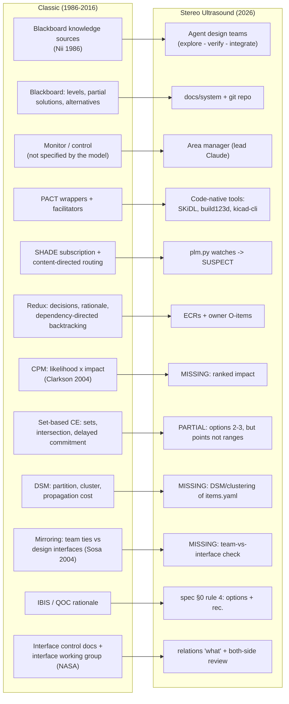

# Prior art: agent-based concurrent engineering and design coordination (1985-2020)

Status: research notes, 2026-10-01 · Lens: the pre-LLM precedent for our agent "design teams" + blackboard + PLM ·
Author: Claude (research subagent, read-only). Nothing here changes the spec; the lessons at the end are proposals for the owner to decide.

**Method and honesty notes.** Every work listed under "Opened" was opened on 2026-10-01. I note for each one whether I
read the **full text** or only the **abstract/landing page**. Anything I only saw as metadata (title, venue, year) sits in
"Not opened / unverified" and is cited only as a pointer. The session's WebSearch budget was already used up, so
discovery went through the OpenAlex, Semantic Scholar and CrossRef APIs plus direct fetches. Nii (1986) is a scanned PDF,
which I OCR'd locally with tesseract. Most 1990s papers (IEEE, Springer, SAGE) are paywalled or behind bot challenges, so
for several of the founding systems (PACT, SHADE, Redux) I read the abstract plus a detailed contemporary review
(Whitfield et al. 2000, full text) rather than the original paper.

---

## Bottom line (blunt)

1. **What we're building has a name and a 30-year history.** It is *agent-based concurrent engineering*: tool-wrapping
   agents that coordinate through a shared design record (PACT 1993, SHADE 1993, Redux/Next-Link 1995, DIDE 1997).
   It was a well-funded DARPA/Stanford/NRC research line, and it **faded** without reaching industry.
   - Industry bought centralised PDM/PLM (Teamcenter, Windchill) instead.
   - Shen et al. (2008) say it plainly: the agents built "are actually not very 'intelligent'". Shared ontologies were
     the bottleneck, and "progress in this area has not been satisfactory".
2. **The three things that killed it are mostly gone for us:**
   - every tool had to be wrapped in a hand-built agent (ours are code-native: SKiDL, build123d, kicad-cli);
   - agents had to agree on a formal ontology (KIF/KQML) before they could talk (LLMs read native files and prose);
   - the agents had no judgment (LLMs do, though they are fallible).
   This is a real edge, not hype.
3. **The problems that were never solved are still ours:**
   - *Control:* which agent acts next. Nii (1986) says the blackboard model "does not specify" it.
   - *Notification overload:* PACT broadcast every change to every agent, and SHADE had to add content-based routing.
   - *Convergence on tightly coupled decisions* (Klein et al. 2003).
   - *Keeping the dependency model true:* change-propagation research has 0 reported ongoing industrial deployments
     among the methods Brahma & Wynn (2022) classified.
4. **Our PLM already re-invents SHADE + Redux, and that's good.** Content-hash "watches" are SHADE's
   *subscription/content-directed routing*, and SUSPECT relations are Redux's *dependency-directed change notification*.
   What we lack is what the later work added on top:
   - **likelihood × impact** ranking of relations (Clarkson et al. 2004);
   - **margins** and change multipliers (Eckert, via Brahma & Wynn 2022);
   - **set-based** exchange of feasible ranges instead of point values (Toyota, Sobek et al. 1999);
   - a **mirroring check** between team structure and product structure (Sosa et al. 2004).
5. **One live warning from our own data:** relation `R-PWR-OUT-RAIL` records "~315 mA peaks vs the LDO's 300 mA rating".
   In Eckert's terms that is a consumed margin, which turns a component into a **change multiplier**: any further load
   on +3V0 propagates. The PLM records it as prose, so `plm.py status` cannot see it.

---

## Map: classic idea → our equivalent

---

## Opened works

### A. Agent-based concurrent-engineering frameworks (the direct ancestors)

**A1. Cutkosky, Engelmore, Fikes, Genesereth, Gruber, Mark et al. (1993), "PACT: an experiment in integrating concurrent
engineering systems", *IEEE Computer* 26(1).** https://doi.org/10.1109/2.179153. Abstract read via OpenAlex
(https://api.openalex.org/works/doi:10.1109/2.179153). The full text is paywalled; I also used Whitfield 2000 (A5) and
Shen 2008 (A6), which describe it in detail.
- *What they did:* the Palo Alto Collaborative Testbed linked four existing systems across sites and disciplines:
  - NVisage (distributed knowledge-based integration);
  - DME (device modelling and simulation);
  - Next-Cut (mechanical design and process planning);
  - Designworld (digital electronics design, simulation, assembly, test).
  An agent architecture linked them, with *wrappers* around legacy tools and *facilitators* routing messages
  (KQML/KIF, see A7). They ran experiments in distributed simulation and incremental redesign.
- *Result / failure:* PACT worked as a demo, and Shen 2008 calls it "one of the earliest successful projects".
  - Whitfield 2000: the PACT group "realized that the answer lay not in unifying the systems, but in providing an
    over-arching framework that could coordinate the tools without having to change them". That is our approach exactly.
  - The failure was *notification*. A design change was "broadcast to all of the agents within the community … for
    larger teams … the method would result with excessive unnecessary communication" (Whitfield 2000, p. 55).
- *Lesson:* wrap tools, don't unify them (we do). **Route change notifications narrowly, and rank them.**

**A2. McGuire, Kuokka, Weber, Tenenbaum (1993), "SHADE: Technology for knowledge-based collaborative engineering",
*Concurrent Engineering: Research and Applications* 1(3).** https://doi.org/10.1177/1063293x9300100301. Abstract read via
OpenAlex.
- *What they did:* SHAred Dependency Engineering. Its three parts:
  - "a shared knowledge representation (language and domain-specific vocabulary)";
  - "protocols supporting information exchange for change notification and subscription";
  - "facilitation services for content-directed routing and intelligent matching of information consumers and producers".
  Its stated aim is a balance between isolated special-purpose CAE and inflexible integrated CAE.
- *Result:* it fixed PACT's broadcast problem with content-based routing (Whitfield 2000). Industrial uptake: none that I
  could verify.
- *Lesson:* `plm.py` watches are SHADE subscriptions. The weak part of SHADE was the *shared vocabulary*, which needed a
  formal ontology. We avoid that because watches point at concrete artefacts (`net:`, `ref:`, `sym:`), not at concepts.
  Keep it that way.

**A3. Petrie, Webster, Cutkosky (1995), "Using Pareto optimality to coordinate distributed agents", *AI EDAM* 9(4):
269-281.** https://www.cambridge.org/core/product/identifier/S0890060400002821/type/journal_article. Abstract read.
- *What they did:* in the Redux model of design, "some aspects of dependency-directed backtracking can be interpreted
  as tracking Pareto optimality". This was implemented in Next-Link, which "allows existing software tools to communicate
  with each other and a Redux agent over the Internet". The demonstrator was electrical cable-harness design.
- Whitfield 2000 adds Petrie's motivation: "even in small design projects, people lose their ability to maintain a
  comprehensive picture of the history and interplay of design decisions, constraints and rationales". Redux' was then
  used in Procura to propagate change across *both* the design and the plan/schedule.
- *Lesson:* Redux is the closest ancestor of our ECR + O-item + SUSPECT machinery. The idea we lack is **decision
  maintenance**: a *decision* carries its premises, and when a premise changes the *decision* (not only the doc) is
  flagged for the decision-maker.

**A4. Shen & Barthès (1997), "An experimental environment for exchanging engineering design knowledge by cognitive
agents", IFIP / Springer (the DIDE line).** https://doi.org/10.1007/978-0-387-35192-6_2. Abstract read via OpenAlex.
- *What they did:* "an experimental design environment organized as a population of asynchronous cognitive agents",
  demonstrated "on a small mechanical design". Shen 2008 places DIDE among the few *autonomous-agent* (non-federated)
  architectures.
- *Lesson:* the fully autonomous variant was the least adopted. Federated systems with a facilitator or mediator
  dominated. Our area-manager pattern is the federated one, and the record supports it.

**A5. Whitfield, Coates, Duffy, Hills (2000), "Coordination approaches and systems, Part I: a strategic perspective",
*Research in Engineering Design* 12.** https://strathprints.strath.ac.uk/6391/6/strathprints006391.pdf. **Full text read.**
- *What they did:* a review of design coordination: DAI coordination techniques, PACT, SHADE, SHARE, Madefast, Redux',
  ARCHON, workflow and organisation models.
- *Key findings:*
  - "domain independent mechanisms need to be augmented with domain specific mechanisms to facilitate coordination";
  - "cooperation needs to be augmented with rationale to achieve coordinated behaviour … otherwise chaos may occur";
  - Madefast (Cutkosky et al. 1996): the team "realized that it was as important for the tools to capture the processes
    and rationale leading to the design as well as the design itself".
- *Lesson:* generic agent protocols are not enough. The coordination layer has to know engineering-specific things
  (margins, tolerances, budgets). Our relations' `what:` text holds that knowledge, but only as prose.

**A6. Shen, Hao, Li (2008), "Computer supported collaborative design: retrospective and perspective", *Computers in
Industry* 59(9): 855-862.** Accepted manuscript at
https://nrc-publications.canada.ca/eng/view/accepted/?id=7bea1fe7-935c-4a42-9fe0-97d00295f6b8. **Full text read.**
- *What they did:* a retrospective on 15 years of computer-supported collaborative design (CSCD): blackboard,
  Contract-Net, agents, Web services, PDM/PLM.
- *Key statements:*
  - "those agents that have so far been implemented in various prototype and industrial applications are actually not
    very 'intelligent'";
  - "Most systems use federated system architectures, e.g., a facilitator approach in PACT";
  - on ontologies: "One of the most difficult tasks … is to agree on the ontological commitments … progress in this area
    has not been satisfactory";
  - industry adopted PDM/PLM, which they call "the system-level integrated implementation of the current collaborative
    technologies", with team, product-structure, workflow and change management.
- *Lesson:* this is the post-mortem. Three causes: unintelligent agents, ontology cost, and PLM winning commercially. LLMs
  attack the first two. Our git-native PLM is the third, done locally.

**A7. Finin, Fritzson, McKay, McEntire (1994), "KQML as an agent communication language", CIKM '94.**
https://doi.org/10.1145/191246.191322. Abstract read via OpenAlex.
- *What they did:* KQML was the message format and protocol used by PACT-era testbeds "in such areas as concurrent
  engineering", with "communication facilitators which coordinate the interactions of other agents".
- *Lesson:* the 1990s needed a formal *agent communication language* because agents could not read each other's
  representations. Our agents talk in prose plus files. Don't rebuild KQML. Do keep the few machine-checkable anchors
  (watches, net names) that prose can't guarantee.

### B. Blackboard architectures (classic and LLM-era)

**B1. Nii, H. P. (1986), "The blackboard model of problem solving and the evolution of blackboard architectures", *AI
Magazine* 7(2): 38-53.** https://ojs.aaai.org/aimagazine/index.php/aimagazine/article/view/537. **Full text read**
(scanned PDF, OCR'd locally).
- *Core model:*
  - "Communication and interaction among the knowledge sources take place solely through the blackboard";
  - "the knowledge sources are self-activating";
  - the blackboard holds "input data, partial solutions, alternatives, and final solutions (and, possibly, control data)",
    "hierarchically organized into levels of analysis";
  - "Only the knowledge sources are allowed to make changes to the blackboard."
- *The weak point:* "There is no control component specified in the blackboard model." Real systems add a *monitor* that
  picks who goes next, for example "a person with a piece that bridges two solution islands". But "the monitor has the
  power to violate one essential characteristic of the original blackboard model, that of opportunistic problem solving".
- *Lesson:* docs/system plus the repo is a blackboard with levels (whole → subsystem/region → source files). The area
  manager is Nii's monitor. **Write down the monitor's selection rule.** Nii's own example criterion, *bridge two
  solution islands*, is a good default: integration work before local polishing.

**B2. Han & Zhang (2025), "Exploring advanced LLM multi-agent systems based on blackboard architecture", arXiv:2507.01701
(submitted 2025-07-02).** https://arxiv.org/abs/2507.01701. Abstract read.
- *What they did:* LLM agents share all information on a blackboard. Agents are "selected based on the current content
  of the blackboard", repeating "until a consensus is reached".
- *Result:* "the best average performance" against static and dynamic multi-agent baselines with fewer tokens, on
  commonsense, reasoning and maths benchmarks. These are **not engineering tasks**.

**B3. Salemi, Parmar, Goyal, Song, Yoon, Zamani, Pfister, Palangi (2025, v2 2026-01-31), "LLM-based multi-agent
blackboard system for information discovery in data science", arXiv:2510.01285.** https://arxiv.org/abs/2510.01285.
Abstract read.
- *What they did:* a central agent posts requests to a blackboard and subordinate agents "volunteer to respond based on
  their capabilities". This removes the need for "a rigid central controller that requires precise knowledge of each
  sub-agent's capabilities".
- *Result:* "13%-57% relative improvements in end-to-end success" over master-slave baselines on KramaBench, DSBench and
  DA-Code variants.
- *Lesson for B2 and B3:* the blackboard pattern is being re-discovered for LLM swarms with measured gains, but only on
  data and reasoning benchmarks. Engineering transfer is unproven. Our hybrid (monitor plus blackboard) matches B3's shape.

### C. Coordination theory and negotiation

**C1. Malone & Crowston (1994), "The interdisciplinary study of coordination", *ACM Computing Surveys* 26(1): 87-119.**
https://doi.org/10.1145/174666.174668. Abstract read (CrossRef/OpenAlex).
- *Core claim:* "coordination can be seen as the process of managing dependencies among activities". Each dependency
  type needs its own coordination process: "shared resources, producer/consumer relationships, simultaneity constraints,
  and task/subtask dependencies".
- *Lesson:* our relations are untyped. A shared-resource relation (current budget, board area, MCU pins, mass) needs an
  *allocation ledger*. A producer/consumer relation (netlist → layout → CAM) needs *ordering*. A geometric fit needs
  *intersection*. Typing the relation tells the area manager which mechanism to apply.

**C2. Klein, Sayama, Faratin, Bar-Yam (2003), "The dynamics of collaborative design: insights from complex systems and
negotiation research", *Concurrent Engineering: R&A* 11(3).** https://doi.org/10.1177/106329303038029. Abstract read
(OpenAlex). The full text was behind a bot wall.
- *Claim:* collaborative design "is typically expensive and time-consuming because strong interdependencies between
  design decisions make it difficult to converge on a single design that satisfies these dependencies and is acceptable
  to all participants".
- *Lesson:* parallel agent teams on a **tightly coupled** cluster will thrash. Find the coupled clusters (DSM, section E)
  and give each one to one team, or run them serially.

### D. Set-based concurrent engineering (Toyota)

**D1. Ward, Liker, Cristiano, Sobek (1995), "The second Toyota paradox: how delaying decisions can make better cars
faster", *Sloan Management Review* (April 1995).**
https://sloanreview.mit.edu/article/the-second-toyota-paradox-how-delaying-decisions-can-make-better-cars-faster/.
Article page read.
- *Claims:*
  - "delaying decisions, communicating 'ambiguously,' and pursuing excessive numbers of prototypes, enables Toyota to
    design better cars faster and cheaper";
  - "The manager's job is to prevent people from making decisions too quickly";
  - 27 months concept-to-production vs 37 for Chrysler's LH.
- *Caveat:* these are case-study figures from one firm, not a controlled comparison.

**D2. Sobek, Ward, Liker (1999), "Toyota's principles of set-based concurrent engineering", *Sloan Management Review*
40(2), Winter 1999.** https://sloanreview.mit.edu/article/toyotas-principles-of-setbased-concurrent-engineering/.
Article page read.
- *Principles:*
  1. **Map the design space:** define feasible regions; explore trade-offs with multiple alternatives; communicate *sets*
     (trade-off curves, design matrices), not single designs.
  2. **Integrate by intersection:** look for intersections of feasible sets; impose minimum constraint (drawings with
     "nominal dimensions only, no tolerances" handed to manufacturing); seek conceptual robustness.
  3. **Establish feasibility before commitment:** narrow gradually while adding detail; **"stay within sets once
     committed"**; keep "a conservative solution" as a fallback; manage uncertainty at process gates.
  - The chief engineer "controls the narrowing process, insisting on broad exploration, resolving disagreements".
- *Lesson:* our explore stage already produces 2-3 options per decision (spec §0 rule 4). That is set-based *at decision
  time*. What we don't do is have teams publish **feasible ranges** on the shared parameters (board outline, height band,
  current, mass) so the integrator can **intersect** them. The owner is the chief engineer who narrows.

### E. Design Structure Matrix and the mirroring hypothesis

**E1. Browning (2001), "Applying the design structure matrix to system decomposition and integration problems: a review
and new directions", *IEEE Trans. Engineering Management* 48(3).** https://doi.org/10.1109/17.946528. Abstract read
(OpenAlex).
- *Content:* four DSM types:
  - component/architecture DSMs;
  - team/organisation DSMs ("designing integrated organization structures that account for team interactions");
  - activity/schedule DSMs (information flow);
  - parameter DSMs.
  The paper also discusses "barriers to their use".
- *Lesson:* `items.yaml` *is* a component DSM in list form. Nobody has drawn it as a matrix or clustered it.

**E2. Sosa, Eppinger, Rowles (2004), "The misalignment of product architecture and organizational structure in complex
product development", *Management Science* 50(12).** https://doi.org/10.1287/mnsc.1040.0289. Abstract read.
- *What they did:* mapped design interfaces onto team communication in a large commercial aircraft-engine programme.
  They studied two cases: "(1) known design interfaces not addressed by team interactions, and (2) observed team
  interactions not predicted by design interfaces". Organisational and system boundaries, interface strength, indirect
  interactions and modularity explain the misalignment.
- *Lesson:* this gives a concrete check for us. Every relation that crosses two agent teams' areas should show a review
  by *both* sides. Relations with no cross-team review are Sosa's case (1): **unattended interfaces**.

**E3. MacCormack, Rusnak, Baldwin (2012), "Exploring the duality between product and organizational architectures: a test
of the 'mirroring' hypothesis", *Research Policy* 41(8). HBS working paper 08-039.** http://www.hbs.edu/research/pdf/08-039.pdf.
**Full text (working paper) read.**
- *Result:* in every matched pair, the product of the loosely coupled organisation was more modular, with differences
  "up to a factor of eight" in **propagation cost**. Propagation cost is "the density of the visibility matrix", meaning
  "the percentage of system elements that can be affected, on average, when a change is made to a randomly chosen
  element".
- *Lesson:* propagation cost is a one-number health metric we can compute from `items.yaml` (transitive closure of the
  relation graph) and track over time.

**E4. Colfer & Baldwin (2016), "The mirroring hypothesis: theory, evidence, and exceptions", *Industrial and Corporate
Change* 25(5): 709-738.** https://doi.org/10.1093/icc/dtw027. Abstract read (OpenAlex). The full-text links refused the
fetch.
- *Claims:*
  - mirroring "conserves scarce cognitive resources";
  - in a review of 142 studies, mirroring is "prevalent … but not universal";
  - "partial mirroring, where knowledge boundaries are drawn more broadly than operational boundaries, is likely to be a
    superior strategy";
  - "studies of open collaborative projects … were not supportive of the hypothesis … digital technologies make possible
    new modes of coordination".
- *Lesson:* the scarce resource for LLM agents is the **context window**, so mirroring pressure applies to us. The
  recommended fix, *partial mirroring*, is what docs/system/README rule 3 already does: every team reads the whole set,
  and each team writes only what it has checked out. Keep it.

### F. Engineering change propagation

**F1. Clarkson, Simons, Eckert (2004), "Predicting change propagation in complex design", *J. Mechanical Design* 126(5).**
https://doi.org/10.1115/1.1765117. Abstract read.
- *What they did:* studied Westland Helicopters rotorcraft design, built "mathematical models to predict the risk of
  change propagation in terms of likelihood and impact of change", and wrote a prototype tool (the Change Prediction
  Method, CPM).
- *Lesson:* attach likelihood and impact to relations and rank the impact list by risk.

**F2. Brahma & Wynn (2022), "Concepts of change propagation analysis in engineering design", *Research in Engineering
Design* 34 (open access, CC-BY).** https://doi.org/10.1007/s00163-022-00395-y. Full text read from the Chalmers copy:
https://research.chalmers.se/publication/532073/file/532073_Fulltext.pdf.
- *Margins:*
  - "The way a change propagates or gets absorbed depends on margins";
  - "A design can have elements which are known change multipliers. Change may propagate readily if margins of such
    change multipliers get consumed (Eckert et al. 2004)".
- *Design freeze* redirects propagation: frozen parts force changes elsewhere.
- *Elicitation:* expert elicitation is subjective, and "no process participant knows the entire design in detail".
  "Many models are based on eliciting a model of the design at a fixed point in time and little attention is given to
  updating the model as the design evolves."
- *Evaluation table:* of the publications classified, 70 only illustrate the method on an example the authors built
  themselves, and **0** report "deployed in industry and ongoing successful use by practitioners".
- *Lesson:*
  - our relations partly self-update, because watches resolve against the live netlist. That is an advance over CPM's
    static matrices;
  - margins are the missing field;
  - any likelihood numbers we add must be **calibrated on our own review history**, or they are just more expert
    guesses.

### G. Design rationale (IBIS, QOC, and why rationale systems failed)

**G1. Conklin & Begeman (1988), "gIBIS: a hypertext tool for exploratory policy discussion", *ACM TOIS* 6(4): 303-331.**
https://doi.org/10.1145/58566.59297. Abstract read (CrossRef).
- *What they did:* a graphical tool for IBIS (Issue-Based Information System: issues → positions → arguments) to
  "facilitate the capture of early design deliberations"; "the IBIS method is still incomplete".

**G2. Burgess Yakemovic & Conklin (1990), "Report on a development project use of an issue-based information system",
CSCW '90: 105-118.** https://doi.org/10.1145/99332.99347. Abstract read.
- *What they did:* a field study at NCR where IBIS was used "over an extended period of time" with "very simple
  technology".
- *Result:* Lee (G3) reports their finding that reconstructing rationale "helped them identify several design omissions
  that would have cost three to six times more than the cost of capturing and reconstructing the rationales".

**G3. Lee, J. (1997), "Design rationale systems: understanding the issues", *IEEE Expert* 12(3): 78-85.**
http://www.cs.northwestern.edu/~paritosh/papers/sketch-to-models/LeeDesignRationaleSystems.pdf. **Full text read.**
- *Core finding:* "a design rationale system will not be used if the cost outweighs the benefits … who will bear the
  cost of producing design rationales … and why?" And: "When the cost bearer is not the same as the beneficiary,
  providing a cost-effective system becomes more problematic … many groupware systems fail exactly because of this
  mismatch" (citing Grudin).
- *Capture trade-off:* reconstruction after the fact gives better rationale but costs a lot. Record-as-you-go risks
  "excessive overhead" that disrupts design.

**G4. Grudin (1996), "Evaluating opportunities for design capture", in *Design Rationale* (Moran & Carroll, eds.).**
https://doi.org/10.1201/9781003064053-21. Abstract read (Semantic Scholar).
- *Claim:* "Some development projects have good reason to avoid investing resources early in development, even when great
  benefits may accrue later. Many off-the-shelf product development efforts are arguably of this nature."

**Lesson from G1-G4:** rationale systems died on capture cost borne by people who didn't benefit. For us the
**capture cost is close to zero**, because agents write it as a side effect. The failure mode flips. It becomes
**unread volume**: the owner is the beneficiary *and* pays the reading cost.
- Our spec rule ("2-3 options + recommendation, owner decides") is already QOC in practice: Questions, Options, Criteria.
- The fix is a fixed, short structure and retrieval from the item a decision concerns. More capture would not help.

### H. Interface management in large programmes

**H1. NASA Systems Engineering Handbook, §6.3 Interface Management (web edition, page dated 2023-07-26; the handbook is
NASA/SP-2016-6105 Rev 2).** https://www.nasa.gov/reference/6-3-interface-management/. Page read.
- *Process:*
  - identify internal and external interfaces;
  - document them in IRDs/ICDs (interface requirements and interface control documents);
  - set up an Interface Working Group that "establishes communication links between those responsible for interfacing
    systems";
  - for multi-party interfaces "unanimous approval is required";
  - late changes are "more likely to have a significant impact on the cost, schedule, or technical design".
- *Lesson:* each of our relations is a mini-ICD. "Unanimous approval" translates to: a relation is re-baselined only
  when **both** owning teams have reviewed it. The README says "both sides' owners must check it", but it isn't
  enforced:
  - `cmd_review` in `tools/plm.py` (checked 2026-10-01) re-baselines a relation on a single `--by`;
  - `review ALL` re-baselines every item and relation in one call.
  Options: (A, recommended) record per-side sign-offs, and keep the relation SUSPECT until both items' owners have
  reviewed it; (B) keep a single reviewer but forbid `ALL` for relations.

---

## Not opened / unverified (cited as pointers only; do not quote)

| Work | Why it matters | Status |
|---|---|---|
| Eppinger, Whitney, Smith, Gebala (1994), "A model-based method for organizing tasks in product development", *Res. Eng. Design* 6:1-13, doi:10.1007/BF01588087 | The DSM partitioning/tearing paper | Metadata only (Springer bot wall) |
| Eckert, Clarkson, Zanker (2004), "Change and customisation in complex engineering domains", *Res. Eng. Design* 15:1-21 | Origin of change multipliers/absorbers/carriers | Metadata only; concept verified only through F2's citation |
| Jarratt, Eckert, Caldwell, Clarkson (2011), "Engineering change: an overview and perspective on the literature", *Res. Eng. Design* 22:103-124 | Standard review | Metadata only |
| Giffin, de Weck, Bounova, Keller, Eckert, Clarkson (2009), "Change propagation analysis in complex technical systems", *J. Mech. Des.* 131(8) | Large empirical change-request dataset | Metadata only (repositories behind challenges) |
| Klein (1991), "Supporting conflict resolution in cooperative design systems", *IEEE SMC* 21:1379-1390 | Conflict-resolution expertise for design agents | Metadata only |
| Lander & Lesser (1997), "Sharing metainformation to guide cooperative search among heterogeneous reusable agents", *IEEE TKDE* 9:193-208 | Negotiated search among design agents (TEAM) | Metadata only |
| Petrie (1993), "The Redux' server", CoopIS '93 | Redux' itself | Metadata only |
| Marik & McFarlane (2005), "Industrial adoption of agent-based technologies", *IEEE Intelligent Systems* 20(1):27-35 | Why industry didn't adopt agents | Metadata only |
| MacLean, Young, Bellotti, Moran (1991), "Questions, options, and criteria: elements of design space analysis", *HCI* 6 | QOC | Not opened |
| Kunz & Rittel (1970), "Issues as elements of information systems" | IBIS origin | Not opened |
| Singer, Doerry, Buckley (2009), "What is set-based design?", *Naval Engineers J.* | SBD outside Toyota | Metadata only |
| Eppinger & Browning (2012), *Design Structure Matrix Methods and Applications*, MIT Press | DSM handbook | Metadata only |

---

## Why the classic systems faded (synthesis, sourced)

| Cause | Evidence | Still true for us? |
|---|---|---|
| Every legacy tool needed a hand-built wrapper agent | PACT (A1, A5) | **Mostly no.** Our tools are scriptable code: SKiDL, pcbnew API, build123d, kicad-cli. |
| Agents needed a shared formal ontology (KIF/KQML) to talk | A6 ("not satisfactory"), A7 | **Mostly no.** LLMs read native formats and prose. The residual risk is silent semantic drift between teams. |
| Agents had no judgment ("not very intelligent") | A6 | **Partly.** LLMs have judgment but also confabulate. That is why adversarial verify and numeric checks matter. |
| Broadcast change notification swamped agents | A5 on PACT | **Yes, in small.** ECR-0001 lists 14 relations to re-check, all at equal weight. |
| Rationale capture cost fell on people who didn't benefit | G3, G4 | **Inverted.** Capture is cheap; *reading* cost is the problem. |
| Dependency models elicited by experts went stale or were subjective | F2 | **Partly.** Watches self-update from the netlist and source symbols, but `items.yaml` is still hand-kept and holds no likelihood or margin. |
| No evidence of benefit at real scale | F2 (0 deployed), A6 | **Yes.** We are n=1. Measure on our own history. |
| Industry bought centralised PDM/PLM instead | A6 §5.7 | Our `plm.py` is that convergence, git-native. |

## What transfers directly to LLM agent swarms

- **Knowledge sources → domain teams.** Nii's independence rule ("solely through the blackboard") means teams must
  not pass results to each other only in chat or in a workflow's return value. Anything another team depends on goes on
  the blackboard (docs/system, items.yaml, source files).
- **Monitor → area manager.** The model doesn't specify control (Nii). Write the selection rule down, or it becomes ad hoc.
- **Facilitator / content routing → watches.** Keep watches concrete. Add ranking (likelihood × impact) so the
  monitor's attention goes to the top of the list.
- **Redux decision maintenance → O-items with premises.**
- **Set-based design → explore stage publishing ranges.** The owner narrows, and a team must stay inside its published
  set unless an ECR lets it out.
- **DSM / propagation cost / mirroring → structure checks on `items.yaml`** and on who-reviewed-what.

## What does NOT transfer cleanly

- **Toyota's physical prototype sets.** For a hand-built rev-1 prototype, physical sets are expensive. Keep sets in
  simulation and CAD. Rev 1 is the prototype (owner rule).
- **Organisation-scale mirroring evidence** (aircraft engines, software firms) studies humans with fixed communication
  costs. Agents' "communication" is reading files. The context window is the scarce resource, so the analogy is
  plausible but unmeasured.

---

## Lessons (proposals; owner decides, per spec §0 rule 4)

**L1. Record margins on relations; a consumed margin flags a change multiplier.** Priority: now.
- *Evidence:* F2 (Eckert's multipliers); our `R-PWR-OUT-RAIL` (~315 mA peak vs 300 mA LDO rating) is already negative.
- *Options:*
  - (A, recommended) an optional `margin: {value, limit, unit, source: sim/checks/...}` on relations, with
    `plm.py status` listing margin ≤ 0 as **MULTIPLIER**;
  - (B) a margins table in each subsystem doc only;
  - (C) do nothing.
  (A) is cheap, and it makes a known hot spot visible to every team.

**L2. Rank impact lists by likelihood × impact (CPM) instead of a flat list.** Priority: soon.
- *Evidence:* A1/A5 (broadcast overload), F1 (likelihood × impact), ECR-0001 (14 equal-weight relations).
- *Options:*
  - (A, recommended) optional `likelihood` and `impact` (1-3) on relations, with `impact`/`ecr new` sorting by product;
  - (B) rank by graph centrality only, with no hand numbers;
  - (C) keep flat.
- Calibrate (A) later with L7.

**L3. Draw `items.yaml` as a DSM; cluster it; compute propagation cost; find "bus"/multiplier items; never split a
coupled cluster across parallel teams.** Priority: soon.
- *Evidence:* E1, E3, C2. Candidate bus items by inspection: `hw/mech/frame.py`, REG-BOARD.
- *Apply:* a read-only script exports items and relations to a matrix and renders it dark-mode for the owner. Run SCC /
  Markov clustering and bus detection (RaGraph or NetworkX, see FOSS tools). The workflow script then assigns one team
  per coupled cluster.

**L4. Mirroring check: compare who-reviewed-what against the relation graph.** Priority: soon.
- *Evidence:* E2 (unattended interfaces), E4 (partial mirroring).
- *Apply:* from `plm.py review --by` history, list cross-team relations never reviewed by both teams. Keep the current
  rule (read all, write only checked-out items). That rule is partial mirroring, and the evidence supports it.

**L5. Set-based exchange: teams publish feasible ranges on shared parameters; the integrator intersects; the owner
narrows; staying in the set is binding.** Priority: soon (next multi-team workflow).
- *Evidence:* D1, D2.
- *Apply:* in the explore stage, each option declares ranges for the shared parameters (board outline, height band,
  +3V0 current, mass, cost) in a small YAML on the blackboard. The integrate stage computes the intersection and shows it
  to the owner. Leaving a published set needs an ECR. Every set keeps a conservative fallback option.

**L6. Decision maintenance (Redux): each owner decision lists the premises it rests on, as watches.** Priority: soon.
- *Evidence:* A3; Petrie as quoted in A5.
- *Apply:* `decisions:` entries in `items.yaml` (O-/D-ids) with watches on the parts and numbers assumed. When a premise
  changes, `plm.py status` shows **SUSPECT DECISION: O12** for the owner, separately from doc staleness.

**L7. Calibrate on our own history; don't trust expert numbers.** Priority: later.
- *Evidence:* F2 (0 deployed; subjective elicitation).
- *Apply:* `plm.py review` records an outcome (`no-op` or `fixed`). After about 30 reviews, compute the empirical
  propagation rate per relation and replace the hand likelihoods.

**L8. Rationale: short, fixed shape, findable from the item.** Priority: later.
- *Evidence:* G2-G4 (capture cost vs beneficiary; 3-6x omission payoff).
- *Apply:* the ECR/O-item body follows the MADR headings (Context, Decision drivers, Considered options, Outcome,
  Consequences, Confirmation), capped at about 15 lines. Each item doc links its decisions. Volume is the risk now,
  not scarcity.

**L9. Type the relations by dependency kind so the right coordination mechanism applies.** Priority: later.
- *Evidence:* C1.
- *Apply:* `kind: resource | flow | fit | timing`. Resource relations (current, area, pins, mass) point to a budget
  ledger with per-team allocations.

**L10. Don't rebuild KQML: no formal ontology layer.** Priority: now (a standing "don't").
- *Evidence:* A6, A7.
- *Apply:* keep watches on concrete source-of-truth artefacts. Resist adding a schema for "concepts".

**L11. Write down the monitor's selection rule.** Priority: later.
- *Evidence:* B1 (no control in the model; the "bridges two solution islands" heuristic), B3.
- *Apply:* one paragraph in docs/system/README giving the order of work:
  1. highest-risk SUSPECT relations;
  2. tasks that bridge two converged areas;
  3. local refinement.

---

## FOSS tools (FOSS-only rule; licences checked 2026-10-01)

| Tool | Licence (evidence) | Verdict | Use here |
|---|---|---|---|
| **RaGraph** 1.24.1 (Ratio CASE) | **GPL-3.0-or-later**. Evidence: `LICENSE.md` at https://gitlab.com/ratio-case-os/python/ragraph/-/raw/main/LICENSE.md opens "GNU GENERAL PUBLIC LICENSE Version 3"; PyPI metadata `License-Expression: GPL-3.0-or-later`. Dual-licensed: a proprietary licence is also offered, but the GPL option is OSI-approved. | **try** (scratch analysis first; not installed; adding it to `tools/setup.sh` needs owner OK) | DSM plots of `items.yaml`; Markov / hierarchical-Markov clustering; SCC-tearing sequencing; "gamma" bus detection ("hubs or integrative components", i.e. multiplier candidates); a compatibility analysis with BDD enumeration of feasible variant configurations, a direct fit for L5 set-based intersection. Module list read from the wheel without installing. GPL is fine for internal use; the repo has no LICENSE file, so decide before distributing any code that imports it. |
| **NetworkX** 3.7 | **BSD-3-Clause**. Evidence: https://raw.githubusercontent.com/networkx/networkx/main/LICENSE.txt "NetworkX is distributed with the 3-clause BSD license"; PyPI `License-Expression: BSD-3-Clause`. | **try** (lighter option if GPL is unwanted; not in the project venv today) | Propagation cost (transitive-closure density, E3); SCC condensation for DSM partitioning; centrality for bus items. About 30 lines on top of `plm.py`'s model loader. |
| **MADR** (Markdown Architectural Decision Records) | **MIT OR CC0-1.0**. Evidence: `LICENSE` at https://raw.githubusercontent.com/adr/madr/develop/LICENSE reads "MIT OR CC0-1.0". | **try** (template only, no tooling) | Headings for ECR / O-item bodies (L8): status, decision-makers, consulted, informed, Context and Problem Statement, Decision Drivers, Considered Options, Decision Outcome, Consequences, Confirmation, Pros and Cons. |
| **log4brains** | **Apache-2.0**. Evidence: `LICENSE` at https://raw.githubusercontent.com/thomvaill/log4brains/master/LICENSE (Apache License 2.0). | **skip** | A Node web viewer for ADRs. Adds a toolchain for no gain over docs/system and the existing rendered pages. |
| Cambridge Advanced Modeller (the CPM implementation from F1's group) | **Unverified.** The page https://www-edc.eng.cam.ac.uk/cam/ returned 404 on 2026-10-01, and I found no OSI licence file. | **skip** (not adoptable under the FOSS-only rule until an OSI licence is verified) | Prior art only. Its likelihood × impact idea is reimplementable in a few lines. |

---

## Risks and failure modes (what bit the classics, and how it would bite us)

1. **Review fatigue → rubber-stamp re-baselining.**
   - Broadcast notification swamped PACT.
   - For us: `plm.py review` turns into clicking through.
   - *Guard:* rank the list (L2), and require the review note to cite evidence (script output, render) rather than "checked".
   - Today `plm.py review ALL` re-baselines everything in one call on one signature (see H1), which is the easiest
     rubber stamp there is.
2. **Hand-kept relation model is incomplete.**
   - An interface with no relation is invisible: thermal, acoustic leakage, EMI from the H-bridge into the mic, mass and
     centre-of-mass balance. None of these appear in the netlist.
   - Change-propagation research (F2) says elicited models are subjective and go stale.
3. **Mirroring trap (Conway's law).**
   - Work gets partitioned because it is easy to hand to a workflow, not because the physics is decoupled.
   - A 34 × 13 mm wearable is **tightly coupled**: board outline ↔ shell ↔ cell ↔ arm wire path ↔ routing.
   - Parallel teams on that cluster will thrash (C2).
4. **Monitor bottleneck.** The area manager is Nii's serial monitor. It is a single point of failure and limited by its
   context window. Opportunistic work by teams is lost if the monitor over-controls (B1).
5. **Set-based cost on a hand-built prototype.**
   - Physical sets multiply prints and boards.
   - Keep sets in simulation and CAD.
   - Converge before fabrication; rev 1 is the prototype.
6. **Rationale flood.**
   - Agents write unlimited rationale, and the owner can't read it all.
   - Unread rationale is worse than none, because it creates false assurance.
7. **Weak evidence base.**
   - LLM-blackboard gains (B2, B3) are on non-engineering benchmarks.
   - Toyota figures (D1) come from a single-firm case study.
   - CPA methods have 0 reported ongoing industrial use (F2).
   - Treat every borrowed idea as a hypothesis and measure it on our own history (L7).
8. **Semantic drift without an ontology.** Dropping KQML-style formality (L10) means two teams can use the same word for
   different things ("board height", "pod x"). The guard is concrete, machine-checked anchors: watches, net names,
   symbol names, `frame.py` constants.
