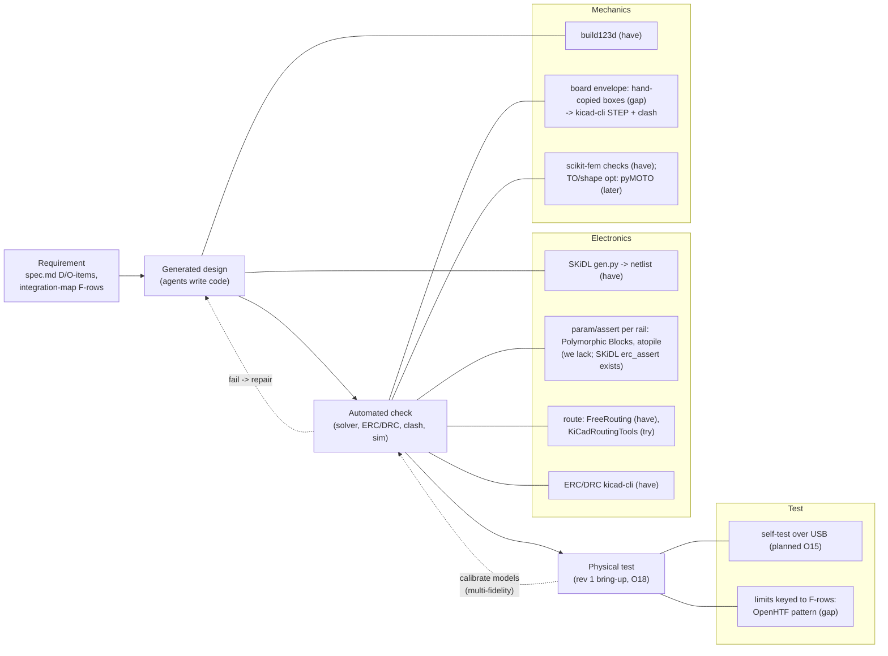

# Prior art: generative design and logic-to-hardware (hardware as code)

Status: research notes, 2026-10-01 · Lens: generative design / topology optimisation, design-space exploration, code-defined electronics and mechanics, ECAD-MCAD exchange, synthesis from specifications, closing the loop to physical test · Author: research subagent (read-only; nothing installed, nothing in the repo changed except this file) · Sibling notes: `llm-design-agents.md` (LLM agent loops), `classic-concurrent-engineering.md`

## Bottom line

1. **What this project does is not "generative design" in the Autodesk sense.** That term means an optimiser grows a shape from loads, constraints and a manufacturing method. Here, agents *write* the design as code and checkers verify it. Almost nothing in the repo is optimised yet: numbers come from reasoning plus a check script. That is a gap, not a flaw. The prior art says optimisers pay off where a cheap model can be trusted, and this pod has two candidates: the NiTi arm geometry and the board placement.
2. **The pieces of hardware-as-code are all mature in FOSS. The joins between domains are not.** Electronics-as-code with automatic part selection and electrical assertions has existed since 2020: Polymorphic Blocks (UIST'20), then atopile, circuit-synth and tscircuit. Code CAD (build123d, CadQuery) and FOSS topology optimisation (pyMOTO, BESO, TopOpt.jl) are mature too. Nothing I opened links **ECAD parameters, MCAD geometry and physical-test limits to the same requirement IDs, with change detection across all three**. `tools/plm.py` already attempts that link, and it is the real novelty here.
3. **The state of the art for "requirement -> generated design -> automated check -> physical test" is two-thirds automated.** The physical-test leg is still a separate world. The convincing closed loops are old and narrow: Lipson & Pollack's evolved, 3D-printed robots (Nature 2000) and NASA's evolved ST5 antenna (built, tested and flown in 2006). Both worked because the simulator was fast and trusted, and a physical test confirmed it. Newer evidence says to let the LLM propose structure and let a numeric optimiser or solver set the numbers. Pure-LLM design loses on constraint satisfaction (BikeBench 2025), and on 10x10 topology-optimisation layouts every model tested, Claude Opus 4 included, scored **0 % exact match** (SPhyR 2025/26).
4. **Three findings need action now** (details under Lessons):
   - (a) **KiCad's SWIG `pcbnew` Python bindings are deprecated and slated for removal in KiCad 11.** Seven of our scripts import them. The replacement IPC API is GUI-only in KiCad 9/10.
   - (b) **The mechanical model copies board and part positions by hand.** `kicad-cli` 10 can export the real board as STEP for an automatic clash check.
   - (c) **SKiDL 2.3.0 has `erc_assert()`.** It gives the cheap version of Polymorphic Blocks' voltage and current checks, and `hw/pod/gen.py` doesn't use it.

## How this was searched (and its limits)

- WebSearch was out of budget (200/200 used by earlier agents), and the Consensus quota was spent.
- The GitHub REST API was rate-limited (60/60).
- Semantic Scholar answered DOI lookups intermittently (HTTP 429 between them). ACM DL, Nature, Autodesk and the FreeCAD wiki returned 403, cookie walls or bot walls.
- Discovery therefore ran through:
  - the Hugging Face papers index (`hf://papers` search, and `paper.md` full text);
  - arXiv abstract pages;
  - Semantic Scholar by DOI;
  - PubMed metadata (Lipson & Pollack);
  - NASA NTRS;
  - project READMEs and LICENSE files fetched raw from `raw.githubusercontent.com` / `gitlab.com/-/raw`;
  - PyPI JSON for versions and Python support;
  - the locally installed `kicad-cli` 10.0.6 and SKiDL 2.3.0.
- **Every licence below was read from the repository's own licence file**, except KiCad StepUp: its raw licence file path did not resolve, so the licence comes from the README's licence section.
- All access dates are 2026-10-01.
- **Not opened, so cited only as unverified prior art:** Autodesk generative design pages (403); the ProSTEP iViP IDX (ECAD/MCAD incremental exchange) specification page (404 twice); the FEMbyGEN FreeCAD workbench wiki (bot wall); the full PDFs of the ACM papers (403; abstracts were read via Semantic Scholar).

## The loop, and where prior art and our repo sit

Reading the colours in words: **have** = in the repo today; **gap** = prior art shows a cheap fix we haven't adopted; **try/later** = a FOSS tool worth a fenced trial.

## Works opened

### A. Electronics as code: specification to parts to netlist

**1. Polymorphic Blocks: Unifying High-level Specification and Low-level Control for Circuit Board Design.**
- Lin, Ramesh, Chi, Jain, Nuqui, Dutta, Hartmann. UIST 2020. DOI 10.1145/3379337.3415860.
- Read: the abstract via the Semantic Scholar API, the repo README and `reference.md` at https://github.com/BerkeleyHCI/PolymorphicBlocks.
- **What it does:** a Python hardware-description language (HDL) for boards.
  - Abstract blocks such as a generic `Resistor` or `LinearRegulator(3.3*Volt(tol=0.05))` are *refined* into concrete parts at the top level. Refinements can apply to a whole class or to one instance.
  - Discretes are picked automatically from a parts table.
  - Typed ports (`VoltageSink`, `Ground`) carry voltage and current parameters that **propagate through connections**. Assertions then check them, which "automat[es] some common datasheet parameter checking".
  - It generates a stable KiCad netlist and a JLC BOM.
- **Limits, stated by the authors:** the checks are "not a design assurance tool"; performance parameters beyond maximum ratings are out of scope; the parts come from a **2022 JLC table**, and "JLC no longer makes parts tables publicly available".
- **Licence:** BSD-3-Clause (LICENSE file). Python 3.10-3.13 per the README badge, so 3.14 is unverified.
- **Lesson:** the typed-port electrical model is exactly what our `integration-map.md` rail-load table does by hand. It can be made executable.

**2. Design Space Exploration for Board-level Circuits: Exploring Alternatives in Component-based Design.**
- Lin, Ramesh, Pandhare, Tay, Dutta, Hartmann, Mehta. CHI 2024. DOI 10.1145/3613904.3642009. Abstract read via Semantic Scholar.
- **What it does:** a user-guided sweep over part alternatives (for example, which microcontroller). It marks invalid options and plots trade-offs such as power against size. The authors pitch it as a "middle ground" between full automation (limiting) and full manual work (a high skill barrier). Small, in-depth user study.
- **Lesson:** this is our §0 rule 4 ("2-3 options with a recommendation, owner decides") done as a computation rather than prose. Sweep the alternatives, grey out the invalid ones, and show the Pareto plot.

**3. atopile.** https://github.com/atopile/atopile (README read; docs.atopile.io now redirects to the editor).
- **What it does:** a declarative `.ato` language with "units, tolerances, and assertions". "The compiler solves constraints, picks parts, runs checks, and updates your `.kicad_pcb`", with "automatic parametric picking of discrete components".
- **Maturity:** PyPI v0.15.9 (2026-09-12), about 2,800 commits. It **requires Python >=3.14,<3.15**, so it matches Valhalla exactly but is tightly pinned.
- **Licence:** MIT (LICENSE).
- **Lesson:** the strongest current FOSS answer to "component selection by constraint solving". Adopting it means rewriting `gen.py` in a new language, which is wrong for rev 1. Watch it for rev 2.

**4. circuit-synth.** https://github.com/circuit-synth/circuit-synth (README read).
- **What it does:** Python to KiCad schematic and PCB generation (KiCad 8+). It back-annotates KiCad's reference renumbering into the Python source ("round-trip"), and checks JLC and DigiKey stock.
- It ships **Claude Code agents and slash commands**: `circuit-architect`, `simulation-expert`, `component-search`, `/analyze-fmea` (failure-mode analysis), `/generate-validated-circuit`.
- **Maturity:** PyPI v0.12.1 (2026-01-09), Python >=3.12.
- **Licence:** MIT (LICENSE).
- **Lesson:** the nearest public relative of this repo's working style, one Claude-agent team over Python to KiCad. It is single-domain: there is no mechanics, no change tracking, and no human decision gate in what I read. It confirms that our cross-domain layer is the unusual part.

**5. tscircuit** and **@tscircuit/capacity-autorouter.** https://github.com/tscircuit/tscircuit, https://github.com/tscircuit/tscircuit-autorouter (READMEs read).
- **What it does:** circuits written in TypeScript/React. Its autorouter is a "pipeline" of "hundreds of algorithms" using hypergraph successive approximation; input and output is its own SimpleRouteJson.
- Autoplacement is still on the roadmap: positions are given by hand as `pcbX`/`pcbY`.
- **Licence:** MIT (both LICENSE files).
- **Lesson:** the bug-report-to-fixture-to-snapshot-test workflow is a good pattern. The stack (bun/TypeScript) doesn't fit ours.

### B. PCB placement and routing beyond FreeRouting

**6. KiCadRoutingTools (KRT).** Haas, 2026. https://github.com/drandyhaas/KiCadRoutingTools (README read).
- **What it does:** a Rust-accelerated grid A* router for **KiCad 9 and 10**, driven by a CLI (`py_router/route.py in.kicad_pcb out.kicad_pcb --nets ...`). It has rip-up and reroute, QFN/BGA fan-out, plane via connections, `place_optimize.py` ("placement for routability"), and `check_drc.py` / `check_connected.py`.
- **Process worth copying:** every router change is A/B-tested by replaying a corpus of open-source boards and grading DRC violations and unconnected nets.
- **Limits it states:** no push-and-shove, no blind or buried vias, no per-region rules.
- **Licence:** MIT (LICENSE). Python 3.9+, numpy, scipy, shapely, plus a prebuilt Rust binary.
- **Independent benchmark (PCBWorld, arXiv 2607.05915, Table 3, read as HF full text):**
  - On 99 open-source boards (D3-A), clean-pass rate, meaning fully connected with zero error-level DRC violations: Freerouting **0.80** (7.1 s), KRT **0.74** (0.65 s), GPT-5.4 agent 0.65.
  - On the 10 harder boards (D3-B): Freerouting **0.78**, KRT **0.20**, every LLM agent **0.00**.
- **Lesson:** a credible second-opinion router that fits a CLI. Even the best FOSS router leaves about one board in five not clean, which supports the owner's decision to do layout together (O14).

**7. OrthoRoute.** https://github.com/bbenchoff/OrthoRoute (README read). GPU PathFinder (a negotiated-congestion router) on a Manhattan lattice, built as a KiCad IPC-API plugin.
- Its own README warns: "not a general-purpose PCB autorouter ... useful to about five people on the planet". It quotes PCBWorld: 1-2 % clean pass on ordinary boards.
- **Licence:** MIT.
- **Lesson:** skip it. It's a useful example of a README that states its own failure envelope, which our tool docs should do too.

**8. NS-place: Net Separation-Oriented PCB Placement via Margin Maximization.**
- Cheng, Ho, Holtz. arXiv 2210.14259 (2022; DOI points to ASP-DAC). https://arxiv.org/abs/2210.14259 (abstract read).
- **What it does:** seed layouts, then coordinate descent on a max-margin "net separation" objective, then MILP (mixed-integer linear programming) legalisation.
- **Results on 14 boards** with an open-source router, against manual and wirelength-minimal placements: up to 25 % less routed wirelength, 50 % fewer vias and 79 % fewer DRC violations. No code link on the abstract page.
- **Lesson:** placement is the lever for routability. Our `place_r1.py` already scores courtyard overlaps and pad clashes. A *net-separation* or congestion term is the published next step, and the repo has a congestion script (commit b252122).

### C. Code-defined mechanics and ECAD-MCAD exchange

**9. KiCad's own scripting interfaces (primary docs).**
- (a) https://dev-docs.kicad.org/en/apis-and-binding/pcbnew/: "The SWIG-based Python bindings in KiCad are deprecated as of KiCad 9.0 and will be removed in a future version. The current plan is to remove the SWIG bindings in KiCad 11.0."
- (b) https://dev-docs.kicad.org/en/apis-and-binding/ipc-api/for-addon-developers/: "The IPC API in KiCad 9 and 10 only supports communication with a running instance of the KiCad GUI. Support for running in headless mode through `kicad-cli` was added for KiCad 11." It also says there is no plotting or export through the API in 9/10, and in 9/10 only the PCB editor supports it.
- (c) `kicad-python`, the official IPC bindings: https://gitlab.com/kicad/code/kicad-python README. MIT (LICENSE, relicensed at 0.2.0). PyPI v0.8.0 (2026-08-30).
- (d) Local check: `kicad-cli` 10.0.6 `pcb export` offers `step`, `stpz`, `brep`, `xao`, `glb`, `stl`, `ipc2581`, `odb` and others. **No IDF/IDX.**
- KiCad licence: GPL-3.0-or-later (LICENSE.README and LICENSE on GitLab).
- **Lesson:** our headless agent scripts can only use SWIG on KiCad 10, and SWIG goes away in 11. Pin KiCad 10 for rev 1, and keep `pcbnew` calls behind one adapter so the KiCad 11 migration touches one file.

**10. KiCad StepUp.** https://github.com/easyw/kicadStepUpMod (repo page and README read).
- **What it does:** a FreeCAD workbench. It loads a KiCad board with its 3D parts and exports STEP, can "check interference and collisions for enclosure and footprint design", and can PUSH/PULL the board edge between the FreeCAD Sketcher and `kicad_pcb`. It supports KiCad 5.1 to 10.x and FreeCAD 0.19 to 1.0.
- **Licence:** AGPL-3.0, per the README's licence section. The raw licence file path did not resolve.
- **Lesson:** the idea is right: the real board, with real component bodies, inside the real enclosure, collision-checked. The tool is a GUI workbench. For agents, the same loop is `kicad-cli pcb export step`, then build123d `import_step`, then a boolean intersection or distance check.

**11. CadQuery assemblies.** https://cadquery.readthedocs.io/en/latest/assy.html (read).
- **What it does:** constraint types (Point, Axis, Plane, PointInPlane, PointOnLine, Fixed*). `solve()` sets up "an optimization problem ... minimize the sum of all cost functions".
- The docs say nothing about collision checking.
- **Licence:** Apache-2.0 (LICENSE). PyPI v2.8.0, Python >=3.11.
- **Lesson:** constraint-placed assemblies would replace hard-coded offsets such as `(0, -6, 0)` in `shell_r1.py`. build123d has its own joints, so there's no reason to switch kernels.

### D. Generative design and topology optimisation (SIMP / BESO / level-set)

Glossary:
- **SIMP** (Solid Isotropic Material with Penalisation): each finite element gets a density between 0 and 1, and stiffness scales as density^p, so in-between densities are penalised toward solid or void.
- **BESO** (Bi-directional Evolutionary Structural Optimisation): elements are added and removed by a sensitivity ranking.
- **Level-set:** the boundary is the zero contour of a field that evolves.
- **MMA** (Method of Moving Asymptotes): the standard gradient optimiser for these problems.

**12. DTU TopOpt group: apps and software.** https://www.topopt.mek.dtu.dk/apps-and-software (read).
- **What it offers:** the 99-line and 88-line MATLAB codes; a "200-line" Python code; a large-scale PETSc C++ framework; a level-set MATLAB code; buckling and contact codes; Grasshopper and mobile apps.
- **Licences: not stated on the page** for most codes. Some are marked only "Free".
- The seminal paper behind it: *Efficient topology optimization in MATLAB using 88 lines of code*, Andreassen et al., Struct. Multidisc. Optim. 2011, DOI 10.1007/s00158-010-0594-7. Metadata only via Semantic Scholar (1,678 citations); no abstract was returned.
- **Lesson:** the canonical teaching codes. Because their licence is unstated, read them for understanding and don't vendor them.

**13. pyMOTO: Modular Topology Optimization in Python.** https://github.com/aatmdelissen/pyMOTO (README read). Zenodo DOI 10.5281/zenodo.8138859 (2023).
- **What it does:** "modules" (filter, FE assembly, linear solve) each carry their own sensitivities, and the chain rule assembles the total gradient ("semi-automatic", like backpropagation). It covers 2D/3D, static and dynamic analysis, **compliant mechanisms**, thermo-mechanics and stress constraints, with OC/MMA/GCMMA optimisers.
- **Maturity:** PyPI v2.0.1 (2026-05-07), Python >=3.9. Depends on numpy, scipy, sympy and matplotlib.
- **Licence:** MIT (LICENSE).
- **Lesson:** the best fit for our numpy/scipy/scikit-fem stack if we ever optimise a compliant part, such as the NiTi arm cross-section or a printed spring.

**14. ToPy.** https://github.com/williamhunter/topy (README read). Compliance, mechanism and heat problems from a text "TPD" problem file.
- The author says it is "fairly old" (2005-2009), the stable release is Python 2, and master is "unstable" on Python 3.
- **Licence:** MIT (LICENSE.md). Skip: too old.

**15. beso (FreeCAD/CalculiX BESO).** https://github.com/fandaL/beso (README read).
- **What it does:** Python BESO driving the CalculiX solver, with a FreeCAD GUI. Needs CalculiX >=2.17 and FreeCAD >=0.18.
- **Licence:** LGPL-3.0 (LICENSE).
- **Lesson:** this is the FOSS answer to "FreeCAD FEM workbench plus topology optimisation". It's heavy for us: it adds two big tools for a part that is mostly governed by packaging.

**16. TopOpt.jl.** https://github.com/JuliaTopOpt/TopOpt.jl (README read). Continuum and truss topology optimisation in Julia, with "automatic differentiation through every objective and constraint". Tarek & Ray, CMAME 2020.
- **Licence:** MIT (LICENSE.md). Skip: it would add a language.

**17. SPhyR: Spatial-Physical Reasoning Benchmark on Material Distribution.** Siedler. arXiv 2505.16048 (v3, Feb 2026). https://arxiv.org/abs/2505.16048; results read in the HF full text, §6.1 Table 2.
- **What it tests:** LLMs predict topology-optimised material layouts on 10x10 grids from forces and supports, **without a solver**.
- **Results, "Full" task (whole layout):** exact match is **0 % for every model**, including Claude Opus 4 and Gemini 2.5 Pro. On easy one-cell tasks, Claude Opus 4 reaches 82 % exact match.
- Authors: LLMs "struggle with tasks requiring physical intuition and structural coherence".
- **Lesson:** no agent should be trusted to "eyeball" load paths, stiffness or a mechanical layout. Every mechanical number that matters needs a solver run in `sim/checks/`.

### E. Design-space exploration, surrogates and the LLM-plus-optimiser hybrid

**18. OpenMDAO: an open-source framework for multidisciplinary design, analysis, and optimization.**
- Gray, Hwang, Martins, Moore, Naylor. Struct. Multidisc. Optim. 2019. DOI 10.1007/s00158-019-02211-z. Abstract read via Semantic Scholar (622 citations).
- **What it does:** Newton-type solvers for coupled models, plus coupled derivatives that exploit sparsity. The authors list applications including "structural topology optimization".
- **Licence:** Apache-2.0 (LICENSE.txt). PyPI v3.45.1 (2026-09-11).
- **Lesson:** this is the right tool when several models feed each other and you want gradients, for example battery against weight against balance against arm stiffness. At our scale a plain script plus pymoo is enough. Watch it.

**19. pymoo: Multi-objective Optimization in Python.** Blank & Deb. IEEE Access 8 (2020) 89497-89509. https://arxiv.org/abs/2002.04504 (read).
- **What it does:** constrained multi-objective algorithms such as NSGA-II/III, with parallel evaluation, visualisation and multi-criteria decision-making helpers.
- **Licence:** Apache-2.0 (LICENSE). PyPI v0.6.2 (2026-06-28), **classifiers list Python 3.14**.
- **Lesson:** the right size of tool for turning "2-3 options" into a Pareto front over a few geometric parameters.

**20. BikeBench: A Bicycle Design Benchmark for Generative Models with Objectives and Constraints.**
- Regenwetter, Abu Obaideh, Chiotti, Lykourentzou, Ahmed. arXiv 2508.00830 (May 2025, rev. Oct 2025). https://arxiv.org/abs/2508.00830 (read).
- **Finding:** "LLMs and tabular generative models fall short of hybrid GenAI+optimization algorithms in design quality, constraint satisfaction, and similarity scores." Code, data and leaderboard are released.
- **Lesson:** a generator alone isn't enough. Pair it with an optimiser and a checker.

**21. A Hybrid Nested Harness for Decoupling Structure and Parameters in LLM-Driven Optimization.**
- Gallego. LM4Sci Workshop @ COLM 2026. arXiv 2608.08156. https://arxiv.org/abs/2608.08156 (read).
- **What it does:** "an outer loop has the LLM propose a structural sketch, with numeric gaps, and an inner numerical optimizer tunes the sketch" (CMA-ES, gradient methods or MCMC). It beats both LLM-only and optimiser-only search across three domains.
- Code: https://github.com/vicgalle/hybrid-nested-search (MIT, LICENSE).
- **Lesson:** this is the division of labour our design teams should formalise. The agent picks the topology, for example the arm shape family or the bridge architecture. Then `scipy.optimize` or pymoo fills in the numbers against a `sim/checks` model.

**22. Understanding the Challenges in Iterative Generative Optimization with LLMs.**
- Nie et al. arXiv 2603.23994 (Mar 2026, rev. May 2026). https://arxiv.org/abs/2603.23994 (read).
- **Findings:** "only 9% of surveyed agents used any automated optimization". The hidden decisions that decide success are what the optimiser may modify, which execution feedback counts as evidence, and how errors are aggregated. The starting artifact determines which solutions are reachable.
- **Lesson:** every agent loop we run should state those three things explicitly: editable files, which checker output counts, and the starting design.

**23. Multi-fidelity Bayesian Optimization: A Review.** Do & Zhang. AIAA Journal 63:6 (2025) 2286-2322. arXiv 2311.13050. https://arxiv.org/abs/2311.13050 (read).
- **What it covers:** Gaussian-process multi-fidelity surrogates plus acquisition rules for combining cheap low-fidelity runs with costly high-fidelity ones.
- **Open gaps it names:** constrained, high-dimensional, under-uncertainty and multi-objective cases.
- **Lesson:** this is the formal frame for O18 ("rev 1 fails informatively"). The physical prototype is the expensive, high-fidelity sample, and its job is to *calibrate* the cheap models (NiTi preload, acoustic port, exciter |Z|), not only to pass or fail.

### F. Closing the loop to physical test

**24. Automatic design and manufacture of robotic lifeforms.** Lipson & Pollack. *Nature* 406:974-978, 2000-08-31. DOI 10.1038/35023115. Abstract read via PubMed (PMID 10984047). nature.com itself was behind an auth redirect.
- **What they did:** machines are "evolved through simulations from basic building blocks (bars, actuators and artificial neurons)". The fittest are "fabricated robotically using rapid manufacturing technology". This is "autonomy of design and construction using evolution in a 'limited universe' physical simulation coupled to automatic fabrication".
- **Lesson:** the first full requirement-to-physical loop. It worked because the design space was deliberately *limited* to parts the simulator modelled well. Constrain the generator to what the checker can verify.

**25. Automated Antenna Design with Evolutionary Algorithms.** Hornby, Globus, Linden, Lohn. AIAA Space 2006, 2006-09-19. NASA NTRS 20060024675, https://ntrs.nasa.gov/citations/20060024675 (read).
- **What they did:** evolved the ST5 wire antenna and a TDRS-C Yagi element. Both were "fabricated and tested", and "laboratory results correspond well with simulation".
- **Results:** about **3 person-months** against about 5 conventionally. When the mission changed, "a new antenna evolved in a few weeks".
- Journal version: Hornby et al., *Evolutionary Computation* 2011, DOI 10.1162/EVCO_a_00005 (metadata only).
- **Lesson:** the payoff from generative design is mostly **re-design speed when requirements change**, which happens to us through O-items. That speed exists only if the evaluator is automated and trusted.

**26. OpenHTF.** https://github.com/google/openhtf (README read). The "open-source hardware testing framework".
- **How it works:** tests are *phases*, and data comes in as *measurements* "declared along with a specification" (limits). Any measurement out of spec fails the run. *Plugs* wrap instruments, and *stations* record where a test ran.
- **Licence:** Apache-2.0 (LICENSE). PyPI v1.6.1 (2025-03-05), Python >=3.10; **Python 3.14 is untested**.
- **Lesson:** the missing piece between our spec and the bench. Declare every bring-up and self-test measurement with limits and a requirement ID, so a physical result can mark a PLM relation SUSPECT the way a code change does.

**27. labgrid.** https://github.com/labgrid-project/labgrid (README read). Embedded-board control for test automation, with remote access to boards on other hosts.
- **Licence:** LGPL-2.1-or-later (LICENSE). PyPI v26.0, Python 3.14 classifier.
- **Lesson:** aimed at Linux-class boards in a lab farm. Overkill for one STM32 pod. Skip.

**28. KiBot.** https://github.com/INTI-CMNB/KiBot (README read). Scriptable generation of KiCad fabrication and documentation outputs for CI/CD.
- **Licence:** AGPL-3.0 (LICENSE). PyPI v1.9.1 (2026-07-28).
- **Lesson:** we already script `kicad-cli` directly. KiBot is a reference for which outputs a release should contain, not a tool we need.

**29. SKiDL `erc_assert`** (primary source: the installed package, SKiDL 2.3.0, `inspect.getdoc(skidl.erc_assert)`, read 2026-10-01).
- "Add an ERC assertion to this object or its class. assertion: A string containing a Python expression that should evaluate to True ... severity: Level of severity (ERROR, WARNING, or OK)".
- `hw/pod/gen.py` calls `skidl.ERC()` (line 286) but has no assertions.
- **Licence:** MIT (LICENSE). PyPI 2.3.0 lists Python 3.14.
- **Lesson:** the zero-new-dependency way to borrow Polymorphic Blocks' electrical checks.

### Cited as prior art only (not opened; unverified)
- **Autodesk Fusion generative design.** Pages returned 403. Commercial; it defines the "goals + constraints + manufacturing method -> many outcomes" pattern. Not recommended (proprietary).
- **ProSTEP iViP ECAD/MCAD collaboration format (IDX).** The incremental change-proposal exchange between ECAD and MCAD. The spec page returned 404, so its contents are unverified. `kicad-cli` 10 doesn't export it anyway.
- **FEMbyGEN FreeCAD workbench.** Wiki bot wall; repo not found at the guessed path.

## FOSS tools: verdicts for our stack (SKiDL + KiCad 10 + build123d + Python 3.14 + CLI agents)

| Tool | Licence (file) | Fit | Verdict |
|---|---|---|---|
| SKiDL 2.3.0 `erc_assert` | MIT | Already installed; Py 3.14 | **Try now** |
| `kicad-cli pcb export step` (KiCad 10.0.6) | GPL-3.0-or-later | Installed; feeds build123d `import_step` | **Try now** |
| KiCadRoutingTools | MIT | KiCad 9/10, CLI, Python + Rust binary | **Try** (lead agent only, fenced, owner OK; never parallel) |
| pymoo | Apache-2.0 | Py 3.14 classifier; pure Python | **Try soon** (NiTi arm / balance Pareto) |
| pyMOTO | MIT | numpy/scipy, Py >=3.9 | Later (only if a compliant part needs topology optimisation) |
| kicad-python (IPC API) | MIT | GUI-only on KiCad 10; headless from 11 | Watch (migrate at KiCad 11) |
| atopile | MIT | Py >=3.14,<3.15; new language | Watch (rev 2 candidate) |
| circuit-synth | MIT | Py >=3.12; Claude Code agents | Watch (agent patterns) |
| Polymorphic Blocks (edg) | BSD-3-Clause | Py 3.10-3.13; 2022 parts table | Watch (borrow the port model, not the tool) |
| OpenHTF | Apache-2.0 | Py >=3.10, 3.14 untested; last release 2025-03 | Watch (borrow the measurement+limit pattern) |
| OpenMDAO | Apache-2.0 | Heavy for our scale | Watch |
| SMT (surrogates) | BSD-3-Clause | Only if a sim gets slow | Watch |
| Optuna | MIT | Py 3.14; single-objective black-box | Watch (pymoo covers it) |
| BoTorch | MIT | PyTorch dependency | Skip |
| beso | LGPL-3.0 | Needs CalculiX + FreeCAD | Skip |
| ToPy | MIT | Python-2 era | Skip |
| TopOpt.jl | MIT | Julia | Skip |
| DTU TopOpt codes | not stated | MATLAB mostly | Skip (read only; licence unstated) |
| CadQuery | Apache-2.0 | Same kernel as build123d | Skip (borrow the assembly-constraint idea) |
| OpenSCAD | GPL-2.0 + CGAL exception | Mesh CSG, no B-rep | Skip |
| python-solvespace | GPL-3.0 | Last release 2022, Py <=3.11 | Skip |
| KiCad StepUp | AGPL-3.0 (README) | FreeCAD GUI workbench | Skip for agents (owner may use it for a visual check) |
| OrthoRoute | MIT | Backplanes only | Skip |
| tscircuit + autorouter | MIT | TypeScript/bun | Skip |
| labgrid | LGPL-2.1+ | Linux board farms | Skip |
| KiBot | AGPL-3.0 | Duplicates our kicad-cli scripts | Skip |

Copyleft note: GPL/AGPL/LGPL are OSI-approved, so all of these are FOSS. Obligations apply only if we *distribute modified tool code* (or, for AGPL, serve it over a network). They don't attach to the board or CAD files we generate.

## Lessons (ranked)

**Now**
1. **Make the rail and pin-rating table executable.**
   - Evidence: Polymorphic Blocks' typed ports with propagated voltage and current limits plus assertions; SKiDL 2.3.0 `erc_assert` exists; `gen.py` has none.
   - How: a small table of `(net, Vmin, Vmax, Imax_budget)` plus per-part absolute maximums (MCU pins at 3V0, VBUS 5.5 V on the charger, bridge gate drive). An `erc_assert` per net, and a failing assertion fails `gen.py`.
2. **Stop hand-copying the board into the mechanics.**
   - Evidence: `hw/mech/shell_r1.py` hard-codes `PCB = dict(x0=30.6, ...)` and `SWITCH = (52.6, ZC)  # board x 22.0 (hw/pod/place_r1.py)`. `pod.py` checks clearances against nominal boxes. `kicad-cli` 10.0.6 exports STEP; StepUp shows the clash-check idea.
   - How: `kicad-cli pcb export step`, then build123d `import_step`, then intersect and distance-check against tub, lid, plunger and cell. Add a PLM watch on the exported STEP's hash so a board move marks the shell relation SUSPECT automatically.
3. **Pin KiCad 10 for rev 1 and isolate `pcbnew`.**
   - Evidence: SWIG is deprecated in 9 and to be removed in 11; the IPC API is GUI-only in 9/10. Seven repo files import `pcbnew`.
   - How: one adapter module that every script uses; plan the IPC-API port as an ECR when KiCad 11 ships.
4. **LLM for structure, solver for numbers.**
   - Evidence: SPhyR (0 % on full layouts), BikeBench (hybrids win), the hybrid nested harness.
   - How: every design-team brief states which choices are the agent's (topology) and which must come out of a `sim/checks` script (values). Reviewers reject any interface number without a script.

**Soon**

5. **Turn "2-3 options" into a computed Pareto plot where a cheap model exists.**
   - Evidence: the CHI'24 design-space sweep; pymoo.
   - How: start with the NiTi arm (force, strain, mass, from `sim/checks/niti_*.py`) and pod balance (`balance.py`). Render dark-mode with `tools/plotstyle.py` and mark invalid points in grey.
6. **Give KiCadRoutingTools one fenced trial on the rev-1 board** as a second-opinion router.
   - Evidence: PCBWorld Table 3; KiCad 10 support; QFN fan-out.
   - How: lead agent only, `systemd-run ... MemoryMax=4G`, never in a parallel workflow, with the owner's go-ahead (CLAUDE.md bans autorouters for parallel agents). Compare unconnected count and DRC against the FreeRouting result.
7. **Declare bring-up and self-test measurements with limits and requirement IDs.**
   - Evidence: OpenHTF's measurement-with-spec model; the NASA/GOLEM loops.
   - How: a YAML of `{F-row, measurement, limits, method}` for rev 1 (rail voltages, sleep current, exciter |Z| sweep, mic noise floor). Results land in the PLM as a `test` relation, so a failed measurement opens an ECR the same way a code change does.

**Later**

8. **Use calibration, not just pass/fail.**
   - Evidence: the multi-fidelity BO review; O18.
   - How: for each sim model, record the sim-vs-measured delta from rev 1 and keep a correction factor next to the model.
9. **Topology or shape optimisation only for the parts stiffness actually governs.**
   - Evidence: pyMOTO handles compliant mechanisms; the housing is packaging-governed.
   - How: if the NiTi strut cover or a printed spring needs it, use pyMOTO in 2D first.
10. **Re-evaluate atopile for rev 2's schematic language.**
    - Evidence: parametric picking plus KiCad layout sync, and it's on Python 3.14.
    - How: only after rev 1 ships; port one block as a spike.

## What is novel here (honest)

**Not novel:**
- code-defined schematics (SKiDL, Polymorphic Blocks, atopile, circuit-synth);
- code CAD (build123d, CadQuery);
- topology optimisation and design-space sweeps;
- generator, checker and repair loops;
- Claude-Code-driven circuit generation (circuit-synth ships exactly that).

**Novel, in nothing I opened:**
1. One git-native, content-hash change-tracking layer (`plm.py` watches, SUSPECT/STALE flags, check-outs, ECRs) spanning **electronics, mechanics and docs**, written so that parallel agent teams can see each other's footprint.
2. A single human decision owner gating generated designs through logged O-items.
3. A generated "big picture" (the integration map from the netlist) used as mandatory context for every change.

The prior-art projects either stop at the netlist or treat the MCAD side as a one-way export. **Also not yet done here** (so not yet a claim): closing the loop through physical test, and genuine optimisation.

## Risks and failure modes

- **KiCad 11 breaks headless scripting:** placement, render and smoke tests stop working when SWIG is removed. The IPC API can't stand in on 10.
- **Silent drift between hand-copied mechanical constants and the board.** A PLM watch on `PLACE[...]` flags that something changed, not that the shell is now wrong.
- **Plausible-but-unsolved numbers from agents.** SPhyR and BikeBench show LLMs fail at physical and constraint reasoning without a solver.
- **Autorouters aren't finishers.** On small open boards the best FOSS clean-pass rate was about 0.80, and on harder ones 0.20-0.78. Expect hand finishing on a dense 34 x 13 mm board.
- **Optimising a wrong model optimises its error:** resin anisotropy and creep, NiTi hysteresis, unmodelled skin coupling. Optimiser output needs the physical-test leg.
- **Parts data staleness.** Polymorphic Blocks' 2022 JLC table is the example. Any optimiser-driven part pick must use our own dated JLC queries (`tools/jlc.py`).
- **Tool churn and pinning:**
  - atopile pins Python 3.14 exactly;
  - OpenHTF's last release was 2025-03, and Python 3.14 is untested;
  - python-solvespace stopped at 3.11;
  - ToPy is Python-2 era.
- **Machine safety.** Optimisation sweeps and routers are bulk jobs. They need the memory fences (3 G in workflows, 4 G otherwise), and no autorouter may run in a parallel workflow.
