# Prior art: LLM / agentic systems for physical engineering design (2023-2026)

Status: research notes, 2026-10-01 · Lens: LLM agents for circuits, PCB, CAD, robots, simulation, systems engineering · Author: research subagent (read-only; nothing installed)

**Bottom line.** The loop each design team runs is well-trodden prior art: generate code, check it with a tool, repair from the tool's error message. It works when the checker is cheap and exact, as with Verilog testbenches (94-96 % on VerilogEval v2) and KiCad DRC. It fails when the checker is weak or missing, as with FEA set-up (2 of 15 targets computed), large-board routing (0 % complete) and spatial CAD.

The layer this project adds has no direct prior art in anything I opened. That layer is several agent teams across several domains, plus generated change tracking (watches, SUSPECT flags, check-outs, ECRs) and one human who makes the decisions. In the multi-domain work I found, humans did the integration (the MIT quadcopter) or the cross-domain constraints were hard-coded into the generator (Text2Robot). The closest pieces are ASIC-Agent's integration sub-agent (one domain), the Brown set-based-design team (a human manager with validated tools) and MAST (failure modes of generic multi-agent systems). The biggest transferable lesson is to turn every interface into an **executable pass/fail check with a localized error message**, not just a hash that says "something changed".

## How this was searched (and its limits)

WebSearch was unavailable: the session's budget was used up. The Semantic Scholar and arXiv export APIs returned HTTP 429, and DBLP was blocked by a bot wall. Discovery therefore ran through the Hugging Face papers index (`hf://papers` search), and papers were read through HF's `paper.md` full text, arXiv abstract and HTML pages, and project READMEs. Licences were checked with the GitHub API `repos/<r>/license` endpoint, which reads the LICENSE file. All access dates are 2026-10-01.

Coverage is therefore biased toward arXiv papers that HF indexes. Commercial tools (Flux Copilot, Quilter, JITX, Zoo text-to-CAD) were **not opened** and are not cited.

## Map: where the prior art sits relative to our stack

```mermaid
flowchart LR
  subgraph SingleDomain["Single-domain agent loops (well covered)"]
    A1["Analog: AnalogCoder, AnalogSAGE<br/>oracle = ngspice"]
    A2["RTL: VerilogCoder, MAGE, Spec2RTL<br/>oracle = testbench / waveform"]
    A3["Schematic: PCBSchemaGen (SKiDL), CircuitLM<br/>oracle = datasheet KG + subgraph match"]
    A4["Routing: PCBWorld<br/>oracle = KiCad DRC per step"]
    A5["CAD: CADCodeVerify, CADTests, Physics-in-the-Loop<br/>oracle = VLM / B-rep tests / FEA"]
    A6["FEA set-up: FEABench, MechAgents, AbaqusAgent<br/>oracle = solver output (weak)"]
  end
  subgraph Multi["Multi-domain attempts (thin)"]
    M1["Makatura 2023: cabinet + quadcopter<br/>human integrates"]
    M2["Text2Robot: constraints hard-coded"]
    M3["EmbedAgent: circuit + firmware<br/>~50-65 % on simple tasks"]
    M4["ASIC-Agent: integration sub-agent<br/>(one domain)"]
  end
  subgraph Ours["This repo: the gap"]
    O1["Cross-domain change tracking<br/>plm.py watches, SUSPECT, check-out, ECR"]
    O2["Agent teams + one human decision owner"]
  end
  SingleDomain --> Multi --> Ours
```

## Works opened

Every entry below was opened, at the URL given, on 2026-10-01. "Abstract only" means only the abstract or a summary was read.

### Electronics: schematic, PCB, analog, embedded

**1. PCBWorld: A Benchmark Environment for Engine-Grounded PCB Design Automation.** Song et al. (LG AI Research), KDD 2026 Workshop on Evaluation and Trustworthiness of Agentic AI. arXiv 2607.05915, read as HF full text: https://arxiv.org/abs/2607.05915

- **Architecture.** A Gym environment over KiCad 9.0.8. It exposes 58 Python APIs: the push-and-shove router (KiCad's interactive router, which nudges existing traces aside) and the DRC (Design Rule Check). Agents route a board one native operation at a time, and DRC feedback comes back after every step. The same environment serves RL policies and tool-calling LLM agents.
- **Verification.** KiCad DRC, which has 38 checks, plus completion and wirelength metrics. It was evaluated on 679 real open-source boards.
- **Engine engagement (D3-A real boards, GPT-5.4).** The interactive mode won on every metric:

  | Mode | Completion (CP) | Design-rule violations (DRV) per board |
  |---|---|---|
  | Interactive (feedback after every step) | 0.65 | 1.31 |
  | Plan-and-execute (whole plan, then run) | 0.19 | 16.28 |
  | Engine-free (writes `.kicad_pcb` text directly) | 0.02 | 34.58 |

  In engine-free mode, nano-sized models produced unparseable boards 10 % of the time.
- **Scale.** Every LLM scored CP 0.00 on the large-board split (D3-B). Freerouting scored 0.78 there. LLM agents were about 200x slower than a small PPO policy (94 s against 0.43 s per board).
- **Lesson.** Agents must act *through* the engine with per-step checks. Writing geometry blind, or writing raw board files, fails. Keep rule-based routers for bulk copper and use agents for judgement.
- **Licence.** BSD-3-Clause, with a GPLv3 engine submodule (GitHub API and README).

**2. PCBSchemaGen: Constraint-Guided Schematic Design via LLM for PCBs.** Zou et al., 2026. arXiv 2602.00510, read as HF full text: https://arxiv.org/abs/2602.00510

- **Generation.** A training-free LLM writes **SKiDL**. The authors chose it because Python is the densest representation and the one LLMs know best, which independently validates our choice.
- **Verifier.**
  - Python and SKiDL syntax, then ERC.
  - Rules drawn from a **knowledge graph (KG)** built from datasheets: 36 pin-role types, with each IC compressed from about 16k tokens of datasheet to about 300 tokens.
  - **Subgraph isomorphism**, using the VF2 matching algorithm, against a rule graph of the required topology.
- **Benchmark.** 23 tasks mixing analog, digital and power.
- **Ablations.**
  - Feedback that says *where* the error is (which pin, which net) is indispensable on hard tasks. A bare pass/fail signal is not enough.
  - Removing in-context examples drops hard-task success from 78.1 % to 43.8 %.
  - Most successes arrive within 3 retries, so they cap retries at 3.
- **Verifier accuracy.** A blind expert reviewed 460 samples and agreed with the verifier at Cohen's κ = 0.913.
- **Failure modes.** Misunderstanding one pin's function, such as the Kelvin-source pin on a SiC half-bridge. Wrong feedback-resistor values. Open models degrade above about 20 devices or 70 pins.
- **Cost.** About 23k tokens, US$0.07 and 2.4 minutes per task.
- **Licence: unverified.** The repo URL given in the paper, https://github.com/HZou9/PCBSchemaGen, returned 404 on 2026-10-01.

**3. CircuitLM: Multi-Agent LLM-Aided Design Framework for Generating Circuit Schematics.** Hasan et al., 2026. arXiv 2601.04505, read as HF text (intro and method): https://arxiv.org/abs/2601.04505

- **Pipeline.** Five stages: identify components, retrieve canonical pinouts from a vector database of 50 verified parts, an expert agent reasons step by step, write CircuitJSON, then draw an SVG.
- **Evaluation.** The verifier is an LLM "QA agent" plus a library-compliance score, tested on 100 microcontroller-centric prompts.
- **Lesson.** Grounding in a curated pinout database cuts pin hallucination. An LLM grading an LLM is a weak oracle. Code and data were "to be released on acceptance".

**4. EmbedAgent / EmbedBench: Benchmarking LLMs in Embedded System Development.** Xu et al., ICSE 2026 (doi 10.1145/3744916.3787788). arXiv 2506.11003, read as HF text: https://arxiv.org/abs/2506.11003

- **Roles.** Programmer (writes code for a given schematic), Architect (designs the circuit and the code) and Integrator (ports both to another board). 126 cases across Arduino, ESP32 and Pico.
- **Verification.** Virtual hardware in Wokwi, which is proprietary, watched for real behaviour. The authors note that judging by serial-port output "can be misleading".
- **Results.** Best pass@1 is 55.6 % with a schematic given and 50.0 % when the model designs the circuit itself. ESP-IDF migration reaches only 29.4 %. Retrieval plus compiler feedback lifts these to 65.1 % and 53.1 %.
- **Representation.** In some cases a reasoning model did *better* designing its own circuit than with a given schematic. How the interface between hardware and firmware is represented matters.

**5. AnalogCoder: Analog Circuit Design via Training-Free Code Generation.** Lai et al., AAAI 2025 oral. arXiv 2405.14918: https://arxiv.org/abs/2405.14918. README: https://github.com/laiyao1/AnalogCoder

- **Architecture.** A single agent writes PySpice code. ngspice is the oracle, through testbench check scripts.
- **Reuse.** A library of validated sub-circuits that later designs compose.
- **Result.** 20 circuits designed, 5 more than plain GPT-4o.
- **Licence.** MIT (GitHub API).

**6. AnalogSAGE: Self-evolving Analog Design Multi-Agents with Stratified Memory.** Gao et al., 2025. arXiv 2512.22435, read as HF text: https://arxiv.org/abs/2512.22435

- **Architecture.** Three stage agents (topology selection, refinement, sizing) with four memory layers. Each layer keeps only the context its stage needs, plus experience learned from failed runs. Simulation uses ngspice on SKY130, an open process design kit with real device models.
- **Result.** 10x overall pass rate and 48x pass@1 against earlier frameworks.
- **Licence.** No LICENSE file found by the GitHub API (xz-group/AnalogSAGE).

### Digital RTL (where agents are strongest, because the oracle is exact)

**7. VerilogCoder.** Ho, Ren, Khailany (NVIDIA), AAAI 2025. arXiv 2408.08927: https://arxiv.org/abs/2408.08927

- **Agents.** A planner using a task-and-circuit relation graph, a coder, and a verification group: syntax checker, simulator and an **AST-based waveform tracer** that localizes functional bugs.
- **Result.** 94.2 % on VerilogEval-Human v2.

**8. MAGE: A Multi-Agent Engine for Automated RTL Code Generation.** Zhao et al., arXiv 2412.07822 (Dec 2024), abstract only: https://arxiv.org/abs/2412.07822

- **Method.** Several agents with high-temperature candidate sampling, plus **Verilog-state checkpoint checking**: intermediate simulation states are checked, not only the final output.
- **Result.** 95.7 % on VerilogEval-Human v2.

**9. Spec2RTL-Agent.** Yu et al. (NVIDIA), arXiv 2506.13905 (2025), abstract only: https://arxiv.org/abs/2506.13905

- **Method.** Reasoning, coding and reflection modules. The reflection module traces where an error came from.
- **Result.** It goes via an intermediate representation with strong tooling (HLS C++) and needs up to 75 % fewer human interventions.

**10. Chip-Chat: Challenges and Opportunities in Conversational Hardware Design.** Blocklove et al., MLCAD 2023. arXiv 2305.13243: https://arxiv.org/abs/2305.13243

- A human engineer co-architected an 8-bit processor with ChatGPT. It was taped out on a SkyWater 130 nm shuttle, billed as the first "wholly-AI-written HDL for tapeout".
- The human set the constraints and steered throughout. It is the clearest early example of the human-architect, AI-writer split we use.

**11. ASIC-Agent.** Allam, Mansour, Shalan, arXiv 2508.15940 (2025), read as HF text: https://arxiv.org/abs/2508.15940

- **Agents.** Sub-agents for RTL, verification, OpenLane hardening and **Caravel chip integration**, working in a sandbox with iverilog, yosys and OpenLane.
- **Knowledge base.** A vector store holding documentation, API references and a curated **error knowledge base**.
- **Result.** Claude 4 Sonnet was the best base model.
- **Relevance.** A dedicated integration agent with error memory is the closest thing to our "integrate" step, but it covers one domain.
- **Licence.** The benchmark repo has no LICENSE file found by the API.

### Mechanical CAD and design for manufacture

**12. CADCodeVerify (Generating CAD Code with Vision-Language Models for 3D Designs).** Alrashedy et al., arXiv 2410.05340 (v2 Feb 2025): https://arxiv.org/abs/2410.05340

- **Method.** A vision-language model renders the generated object, writes its own validation questions about it, and feeds the answers back.
- **Result.** Only modest gains: a 7.3 % lower point-cloud distance and a 5.0 % higher success rate with GPT-4. Introduces the CADPrompt benchmark (200 prompts).

**13. Text-to-CAD Evaluation with CADTests (CADTestBench).** Mallis et al., NeurIPS 2026 (per the README). arXiv 2605.07807: https://arxiv.org/abs/2605.07807. HTML: https://arxiv.org/html/2605.07807. Repo: https://github.com/dimitrismallis/CADTestBench

- **Tests.** Executable **Python predicates over the generated boundary-representation (B-rep) solid**, run through CadQuery. Six categories:
  - solid and shell validity;
  - topology counts;
  - geometric types;
  - dimensions and ratios, including wall thickness;
  - volume;
  - spatial arrangement (symmetry, alignment, feature placement).
- **Test quality.** Each test is linked to a requirement, and the test suites were refined by **mutation analysis**: deliberately broken models must fail them.
- **Results.** Test-guided refinement improved pass rate by about 10 %. Best result: 81.0 % pass and 96.2 % requirement score (Claude 4.6 Sonnet with test logs). Test verdicts agreed with humans 93.8 % of the time, against an AUC of 0.663 for Chamfer distance (a shape-similarity score).
- **Licence.** MIT (GitHub API).

**14. Physics-in-the-Loop: A Hybrid Agentic Architecture for Validated CAD Engineering Design.** Berger et al. (TU Dresden / MAN / DFKI), arXiv 2605.19717 (2026), read as HF text (abstract and intro): https://arxiv.org/abs/2605.19717

- **Method.** Agents plan, generate, evaluate and revise. The feedback signal is a validated knowledge-based engineering tool that checks a load case, not a picture.
- **Result.** 4.2x the structural complexity of earlier agentic CAD and a 3.5 % higher compile rate.
- **Argument.** Visual-feedback systems such as CADCodeVerify "do not verify the structural integrity" and only produce simple shapes.

**15. AgentsCAD: Automated DFM for FDM parts.** George et al. (CMU), arXiv 2607.02448 (2026), abstract and intro: https://arxiv.org/abs/2607.02448

- **Pipeline.** Parse a STEP file, detect overhangs above 45°, build a face-adjacency graph and optionally label features with a GNN. Claude proposes reorientations or fillets; a GPT-4o vision model checks renders.
- **Evidence.** One test case (a birdhouse). Watch only.

### Robots and end-to-end attempts

**16. How Can Large Language Models Help Humans in Design and Manufacturing?** Makatura et al. (MIT / UW / Harvard), arXiv 2307.14377 (July 2023). Abstract: https://arxiv.org/abs/2307.14377. The PDF was read (sections 3, 9, 10).

- **Scope.** GPT-4 across text-to-spec, design, design spaces, performance prediction, inverse design and manufacturing. **A cabinet and a quadcopter were fabricated**; the quadcopter combines a frame, parts, a controller and simulation.
- **Nine properties**, including these four limitations:
  - **L.1** weak spatial and analytical reasoning;
  - **L.2** inaccurate results and justifications. A shelf bracket rated for 300 lb was claimed to hold 1000 lb;
  - **L.3** quality drops as concurrent requests grow. Their remedy: partition the task and verify components separately;
  - **L.4** iterative editing regenerates the design and "overlooks elements specified in previous prompts".
- **Integration was human.** For the quadcopter, humans gave "low-level instructions to guide adjustments" for part mounting and balance.

**17. Text2Robot: Evolutionary Robot Design from Text Descriptions.** Ringel et al. (Duke), arXiv 2406.19963 v3 (Feb 2025), read as HTML: https://arxiv.org/abs/2406.19963

- **Method.** Text-to-3D models seed walking-robot shapes. Body and controller are co-optimized in Isaac Gym, a physics simulator.
- **Electronics and manufacturability were hard-coded into the generator:**
  - snap-in boxes for the servos;
  - a central channel for the controller, Raspberry Pi and battery;
  - 4 cm limb offsets.
- **Physical result.** **Four robots built**. Simulation-trained gaits transferred to the real robots, with "primitive" sim-to-real.
- **Limits.** Quadrupeds with 8 motors only, manual assembly, fixed prompt.

### Simulation and FEA set-up by LLM agents

**18. FEABench: Evaluating Language Models on Multiphysics Reasoning Ability.** Mudur et al. (Google / Harvard), NeurIPS 2024 workshops. arXiv 2504.06260, read as HF full text: https://arxiv.org/abs/2504.06260

- **Task.** Drive COMSOL (proprietary) through its API from a natural-language problem.
- **Results.**
  - The best agent produced executable code 88 % of the time, but computed a valid target in only **2 of 15** problems.
  - The one "correct" answer was COMSOL's **default 20 °C value**, a coincidental match against a true 18.3 °C.
  - The physics block was the least executable part of the code.
  - Grounding the model with the API's list of physics interfaces raised interface factuality from 0.54 to 1.0.
  - A Python-only SWE-agent produced 11 valid targets but only 4 within 10 %.
- **Lesson.** "It runs" is not "it is right". Every simulation needs a check that its output is not a default value and an independent analytic bound.

**19. MechAgents.** Ni & Buehler (MIT), arXiv 2311.08166 (Nov 2023), abstract only: https://arxiv.org/abs/2311.08166

- **Teams.** Two-agent teams write, run and self-correct FEM code for elasticity problems. Larger teams split into planner, formulator, coder, executor and critic, and correct each other.
- **Evidence.** Proof of concept; metrics are not detailed in the abstract.

**20. AbaqusAgent (A Multi-AI-agent Framework Enabling End-to-end FEA for Solid Mechanics).** Sarker et al., arXiv 2606.00138 (2026), abstract only via the HF fallback: https://arxiv.org/abs/2606.00138

- **Agents.** Six: interpreter, architect, input writer, runner, **reviewer** and visualizer.
- **Result.** 86 % success on 50 problems.
- **Licence.** Code is MIT (GitHub API), but it drives Abaqus, which is proprietary. Prior art only.

### Systems engineering, project management, multi-agent failure

**21. SysTemp: A Multi-Agent System for Template-Based Generation of SysML v2.** Bouamra et al. (Siemens DISW / Lyon), arXiv 2506.21608 (2025), read as HF text: https://arxiv.org/abs/2506.21608

- **Problem.** Fewer than 150 public SysML v2 examples exist, and the parser does not explain its errors. Frontier LLMs performed poorly on their benchmark.
- **Method.** Several agents, with a template generator plus parser feedback.
- **Lesson.** LLMs are weak in formats with little training data. Our Python and YAML model is the LLM-friendly choice.

**22. Agentic Risk-Aware Set-Based Engineering Design.** Brown University (Karniadakis group), arXiv 2604.16687 (2026), read as HF text: https://arxiv.org/abs/2604.16687

- **Team.** A human **Manager** directs a Coding Assistant, a Design Agent, a Systems Engineering Agent and an Analyst Agent.
- **Process.**
  - Manager and Coding Assistant first build a **validated tool suite**. Only then do the agents explore.
  - Agents keep a *set* of candidates open and prune it. This is Toyota-style set-based design: delay commitment, eliminate infeasible regions.
  - Risky candidates are filtered by CVaR, the expected shortfall in the worst cases.
  - A curated final set goes back to the human.
- **Relevance.** Closest to our area-manager pattern and to the "2-3 options, owner decides" rule.

**23. Why Do Multi-Agent LLM Systems Fail? (MAST).** Cemri et al. (UC Berkeley), arXiv 2503.13657 (v2 Oct 2025), read as HF full text: https://arxiv.org/abs/2503.13657

- **Taxonomy.** 1642 traces from 7 frameworks, 14 failure modes, human agreement κ = 0.88.
- **FC1, system design.** Disobeying the task spec (11.8 %), step repetition (15.7 %), not recognizing that the task is done (12.4 %).
- **FC2, agents misaligned with each other.** Proceeding on a wrong assumption instead of asking (6.8 %), reasoning and action not matching (13.2 %), withholding information.
- **FC3, verification.** No or incomplete verification (8.2 %), incorrect verification (9.1 %).
- **Interventions.** Clearer role specifications gave +9.4 %. A **high-level objective verification step gave +15.6 %**.
- **Verifiers.** Most verifiers are superficial ("checking if the code compiles"). The authors call for multi-level verification.
- **Licence.** The repo had no LICENSE file found by the GitHub API, so it is excluded as a tool. The taxonomy is usable as an idea.

Also glanced at, but too thin to count: *Harnessing Multi-Agent LLMs for Complex Engineering Problem-Solving: A Framework for Senior Design Projects* (arXiv 2501.01205, abstract only). It is an educational persona-agent framework with no hard verification.

## What the prior art says about multi-domain integration

The owner's worry is one domain breaking another. Five things stand out:

1. **Almost every paper is single-domain with one oracle.** Multi-domain cases either hand integration to a human or remove it by construction:
   - Makatura's quadcopter got human "low-level instructions" for mounting and balance.
   - Text2Robot hard-coded the electronics channel and the servo boxes into the geometry generator.
2. **Performance falls as domains combine.** EmbedAgent's circuit-plus-firmware tasks are simple, yet top out at about 50-65 %. PCBSchemaGen degrades on mixed analog, digital and power boards above about 20 devices.
3. **Integration agents exist, but only inside one domain.** ASIC-Agent's Caravel sub-agent integrates a digital block into a chip harness. Nobody I found tracks *change propagation* across electrical, mechanical and firmware artifacts among concurrent agent teams.
4. **Generic multi-agent research puts the failure in the seams.** MAST's FC2 failures (withholding information, wrong assumptions) are exactly how one team breaks another. MAST also found that standardizing message formats does not fix them.
5. **Verification at the seam has to be executable and localized** (PCBSchemaGen, CADTests, PCBWorld). Rendered pictures and LLM judges are weak oracles (CADCodeVerify, CircuitLM).

## FOSS tools (licences verified from each repo's LICENSE file via the GitHub API, 2026-10-01)

| Tool | Licence | Verdict | Use here |
|---|---|---|---|
| CADTestBench (dimitrismallis/CADTestBench) | MIT | **try (pattern)** | Copy the *pattern*: B-rep predicates per requirement, with mutation-tested suites. Port to build123d, which sits on the same OpenCASCADE kernel through OCP. No install needed to borrow the idea. |
| PCBWorld (LGAI-Research/PCBWorld) | BSD-3-Clause (engine submodule GPLv3) | watch | A DRC-in-the-loop routing environment, built on KiCad 9.0.8 (we run 10). Owner-driven layout (O14) and the no-autorouter-in-parallel rule mean: read, don't run. |
| AnalogCoder (laiyao1/AnalogCoder) | MIT | skip (idea only) | Its sub-circuit skill library and ngspice testbench loop are ideas we can reuse. Its op-amp benchmark is not our problem. |
| SKiDL (devbisme/skidl) | MIT | already in use | PCBSchemaGen independently picked SKiDL as the best LLM-facing schematic format. |
| AbaqusAgent (LIRAM-LIN/AbaqusAgent) | MIT code, but drives proprietary Abaqus | skip | Its role split (reviewer agent) is the only takeaway. |
| SysML v2 Pilot Implementation (Systems-Modeling/SysML-v2-Pilot-Implementation) | EPL-2.0 | skip | SysTemp shows LLMs are weak at SysML v2. Our YAML plus Python PLM is lighter and LLM-friendly. |
| Doorstop (doorstop-dev/doorstop) | LGPL-3.0 (LICENSE.md text) | skip | Its suspect-link idea is already re-implemented in `tools/plm.py`. |
| MAST (multi-agent-systems-failure-taxonomy/MAST) | no LICENSE file found | excluded-not-foss | Use the paper's taxonomy as an audit checklist, not the code. |
| PCBSchemaGen (HZou9/PCBSchemaGen) | unverified (repo 404) | excluded-not-foss (until verifiable) | Re-implement the idea (pin-role cards plus rule graph) ourselves. |
| AnalogSAGE (xz-group/AnalogSAGE) | no LICENSE file found | excluded-not-foss | Stratified memory as an idea only. |

## Lessons for this project

**Now**

1. **Give `plm.py` relations an executable check, not only a hash watch.** Today SUSPECT means "something changed". Prior art says the change only matters if an interface predicate now fails, and agents repair best when the failure names the pin, net or feature.
   - *How:* add an optional `check:` field to relations in `docs/system/plm/items.yaml`, pointing at a script that exits non-zero with a localized message. `plm.py status` would run the checks on SUSPECT relations. A pass plus a review re-baselines; a fail blocks.
   - *Evidence:* PCBSchemaGen's feedback-granularity ablation, CADTests, MAST FC3.
2. **Verifiers check spec numbers and catch placeholder values, not "it ran".**
   - *How:* every `sim/checks` script asserts against the spec's numeric limit, asserts the output is not a default or zero, and carries an analytic bound. `niti_closed_form.py` next to `niti_arm_real.py` is the right model. Today almost no script in `sim/checks` or `hw/mech` asserts anything; they print numbers.
   - *Evidence:* FEABench (the 20 °C default "pass"; 88 % executable but 2 of 15 valid). MAST: the high-level objective verification step gave +15.6 %.
3. **Agents act through the engine with a check after every step; no blind geometry.**
   - *How:* layout or placement edits by an agent run `kicad-cli pcb drc` (or the pcbnew courtyard and overlap checks) after each small batch, and the violations go back into the next step. Agents never hand-write coordinates for many parts in one shot, and never edit `.kicad_pcb` text directly.
   - *Evidence:* PCBWorld. Interactive mode averaged 1.31 DRC violations per board, plan-and-execute 16.28, engine-free 34.58. Every LLM completed 0 % of large boards.
4. **Pin-role cards plus netlist rules for every IC on the pod board.**
   - *How:* for each IC (MCU, charger, LDO, bridge FETs, mic), write a ~300-token card from the datasheet: pin roles plus rules such as "EN must not float", "VDDA decoupled to its own GND return", "Kelvin pin to source only". A checker in `hw/pod/` walks the SKiDL circuit and applies the rules. Tie the cards to `docs/research/datasheet-provenance.md`.
   - *Evidence:* PCBSchemaGen (16k to 300 tokens per IC; expert agreement κ = 0.913; the top failure mode is misreading one pin's function).

**Soon**

5. **CADTests-style predicates for the mechanics.**
   - *How:* write pytest predicates over the build123d solids in `hw/mech`: minimum wall, cell-bay clearance, board-to-lid gaps against the PCB height bands, port diameter, button travel. Each test links to a spec or O-item ID. Mutation-test them: shrink a wall by 0.2 mm and the suite must fail.
   - *Evidence:* CADTests (93.8 % human agreement against 0.663 AUC for shape-similarity metrics; mutation-refined suites).
6. **One source for every cross-domain constraint.**
   - *How:* board outline, connector, LED and button positions, and keep-outs live in one Python module that `hw/pod` placement and `hw/mech` both import. A plm relation watches that module, not two copies.
   - *Evidence:* Text2Robot. The cross-domain constraints were built into the generator, which is why its physical builds worked.
7. **Edit, don't regenerate; then run regression predicates.**
   - *How:* agent teams patch named functions or dict entries (already watched as `sym:` in plm). The predicates from lessons 1, 4 and 5 run before commit, to catch constraints silently dropped by a rewrite.
   - *Evidence:* Makatura L.4 (regeneration "overlooks elements specified in previous prompts").
8. **Use MAST as the audit checklist for the workflow scripts.**
   - *How:* the adversarial-methodology-audit gets checks for:
     - explicit termination criteria;
     - role specs;
     - an "assumptions made" section in every team's return, which becomes O-items instead of silent guesses;
     - a final objective-level verifier, separate from the step-level ones.
   - *Evidence:* MAST (role-spec intervention +9.4 %; objective verification +15.6 %; FC2.2 proceeding on wrong assumptions).
9. **A library of proven sub-circuits.**
   - *How:* the H-bridge, LDO, PDM mic front end and charger blocks become SKiDL sub-circuit functions. Each carries its sim check and pin-role rules and is reused across revisions.
   - *Evidence:* the AnalogCoder skill library, PCBSchemaGen sub-circuit reuse, AnalogSAGE memory.

**Later**

10. **Set-based exploration with a risk filter for open trade-offs.**
    - *How:* for decisions such as the exciter drive scheme or the arm stiffness, keep a set of candidates alive and prune with an explicit risk number (worst-case margin against the spec). The owner validates the tools before agents explore.
    - *Evidence:* Brown set-based design (2026).
11. **Watch engine-grounded agent environments** (PCBWorld) for a DRC-review agent once they support KiCad 10, without running autorouters in parallel.
12. **Do not adopt SysML v2.**
    - *Evidence:* SysTemp (LLMs perform poorly in this low-data format).

## Risks and failure modes (from the literature, mapped to us)

- **Superficial verification.** Compiles, runs or renders gets mistaken for correct: FEABench, MAST FC3, ChatDev's chess program.
- **Placeholder and default values passing as results.** FEABench's 20 °C.
- **An LLM judging an LLM.** Shared blind spots: CircuitLM's QA agent, CADCodeVerify's VLM. *Inference, not tested here:* our "adversarial verify" step has the same risk when the verifier is the same model family without a tool oracle.
- **Iterative edits silently dropping earlier constraints.** Makatura L.4.
- **Spatial reasoning and large-geometry tasks.** 0 % on large boards (PCBWorld); placement and orientation errors (Makatura L.1).
- **Hallucinated part data.** Bracket rated for 300 lb claimed as 1000 lb (Makatura). Our rule of primary sources with dates is the right defence.
- **Misreading a single pin.** PCBSchemaGen's Kelvin-source failure.
- **Information withholding and wrong assumptions between teams.** MAST FC2. Check-out conflict flags only catch overlapping *claims*, not semantic dependencies that are not modelled as relations.
- **SUSPECT fatigue.** *Inference, not tested:* hash watches flag every change, and reviewers may start to rubber-stamp. Executable checks (lesson 1) reduce the noise.
- **Scale and transfer.** Benchmarks are toy-sized: 23 schematics, 15 FEA problems, 126 embedded cases. Results will not transfer cleanly to a wearable that couples acoustic, electrical and mechanical behaviour. Many 2026 sources are preprints or workshop papers.
- **Speed and cost.** LLM routing took 94 s per board against 0.43 s for a small RL policy and much less for Freerouting. Use tools for bulk work and agents for judgement.

## What is novel here (blunt)

The single-domain loop is **not novel**. "Generate code, run a tool, repair from its error" is standard across RTL, analog, schematic, CAD and FEA. Its success tracks how good the oracle is.

**Novel, as far as this search reached:**

- **Code-defined artifacts in every domain at once:** SKiDL, pcbnew, build123d, ngspice and scikit-fem in one repo, under one human who owns every decision.
- **Generated project management over them:**
  - a git-native PLM whose watches are computed from the netlist and from Python symbols;
  - SUSPECT and STALE flags;
  - check-out conflict flags between agent teams;
  - ECRs tied to owner decisions.

No opened work tracks change impact across domains among concurrent agent teams. The closest are ASIC-Agent (an integration agent in one domain), the Brown set-based team (a human manager, one physics domain), MAST (generic failures, no physical artifacts) and classic PLM and Doorstop (no agents).

The honest caveat: the search ran without web search, so commercial or industrial systems (Siemens, PTC or Synopsys agent work) may exist and were not seen.
