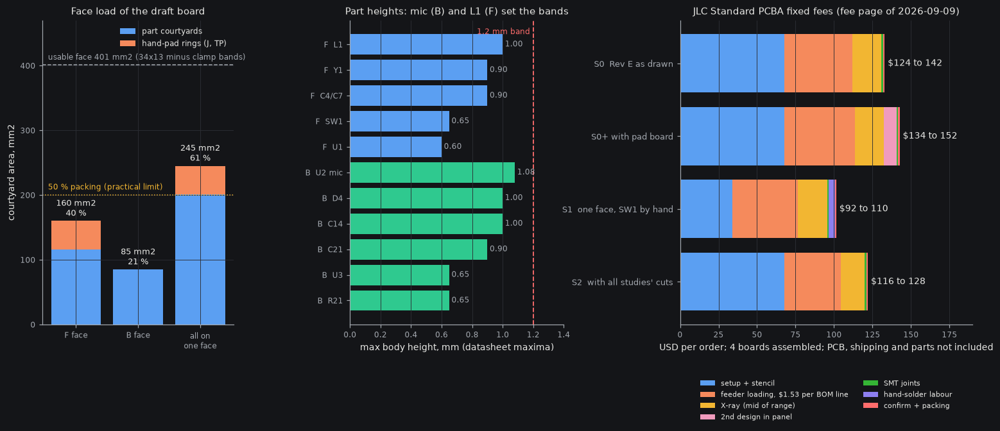

# Simplification study: board physical build and assembly (sides, layers, packages, JLC fees, panel)

Status: opportunity study, read-only; nothing in the schematic, board, CAD or spec was changed. 2026-10-02 (UTC; the run was ordered 2026-10-01 local). Domain: the board as a manufactured object: assembled sides, layer count, fine-pitch packages and the JLC capabilities they hit, thickness, panel and snap-off test frame (O9), hand pads, dock connector.
Scoring rule: spec O19/O20 (personal device, rev 1 is the final device): reliability and size/comfort first and co-equal, then daily convenience, diagnosability (O18) and firmware knobs, then serviceability, money last. Cost is reported, never allowed to outweigh reliability.
Docs read first: `docs/system/` README, 00-whole, integration-map (incl. §10), physical, reg-board, reg-pod-body, sub-audio-in, sub-ui, sub-debug-test, sub-dock-usb, sub-output, `docs/build/bom.md`, `docs/research/pcb-mech-interface.md`, `sot1216-footprint.md`, `methodology.md`, ECR-0001..0013, and the three sibling studies (`power.md`, `periphery.md`, `output.md`). `plm.py impact` was run on ref:Q1, ref:U2, ref:U3, ref:U4, ref:SW1, ref:TP1, ref:J3, ref:D1, block:DEBUG, block:ARM_PADS, block:CELL_PADS, net:DOCK_VBUS/USB_DP/OUT_A/TS, file:hw/pod/place_r1.py, file:hw/mech/shell_r1.py, COST; the relations are listed per opportunity in the structured result.

## 0. Bottom line (blunt)

1. **The order structure in the repo is out of date, and it matters more than any part choice.** JLC's own fee page ("Last updated on Sep 09, 2026", read 2026-10-02) charges Standard PCBA a **$1.53 feeder-loading fee for every part type, Basic or Extended**, $51.12 setup + $16.42 stencil for a double-sided job, and an **X-ray fee for every BGA / QFN / LGA / leadless body**. For this board that is about **$124-142 of fixed JLC assembly fees per order** (4 boards assembled), against the **$58-100** that `bom.md` assumes (Economic-era "setup + $3 per Extended"). "Fewer Extended parts" is no longer the lever; **fewer BOM lines and fewer hidden-joint packages** are. The owner's budget line (O13, about $300) is tighter than `bom.md` says.
2. **Economic PCBA is impossible for this board, whatever else is decided.** It is one-sided only, takes IC pitch >= 0.4 mm and BGA pitch >= 0.5 mm (U3 is a 0.4 mm DSBGA, Q1/Q2 are 0.35 mm), and offers 0.8 mm boards only in its 2-layer HASL rows. So **Standard PCBA, a panel of at least 70 x 70 mm, 5 mm rails and fiducials**, always. The 34 x 13 board can never ship single. That makes the O9 snap-off test frame free: the rails are the frame.
3. **Stay double-sided. Single-sided assembly is a trap here.** The mic must be on B (port through the board to the lid) and the switch must be on F (under the plunger), so "all on one face" needs SW1 hand-soldered (breaks D8, and it is the part pressed 1.2-2.0 N every day) and 245 mm2 of parts and hand pads on one 401 mm2 face (61 %; a 0.4 mm BGA board is hard past ~50 %). It saves $33.77 per order and about 0.6 mm of pod thickness, but it **forbids** the size shrink O20 wants. Rejected (section 2).
4. **Stay 4-layer, 0.8 mm.** 2-layer loses the one thing that makes the SMPS, the 4 MHz PDM clock, the 200 kHz bridge and USB quiet (a solid GND plane 0.1 mm-class away), and every failure that follows is hardware-only. 0.8 mm exists because the mic port is a through-board duct; 1.0 or 1.6 mm buys nothing (the board bends 8 micrometres at the button, derived).
5. **The two fine-pitch packages the draft is built on are on JLC's edge, not inside it.** U3 (BQ25180 DSBGA) has 0.184 mm pads against JLC's published 0.2 mm BGA-pad minimum (0.2-0.25 mm pads need ENIG); Q1/Q2 (PMCXB290UE DFN1010B-6) have 0.16 x 0.20 mm lands against a 0.25 x 0.25 mm "minimum SMD pad" (the Nexperia redraw is 0.20 x 0.25, still under), sit exactly on the Standard 0.35 mm pitch limit and the 0.15 mm pad gap limit, and have a 0.05 mm resist web against JLC's 0.10 mm. I back **OUT-06 (SOT-563 pair) and PWR-01 (BQ25186, WSON-10)** from the siblings on JLC-process grounds; both also cut hidden-joint X-ray parts.
6. **Cheap, real wins that nobody owns yet:** (a) put the TP pogo row, the O18 spare-pin hooks and, optionally, a USB-C "dock simulator" **on the snap-off frame**, off the board (-8 mm2 on F, bring-up before any cable); (b) free **bare fit and acoustic coupons** in the dead area of the 70 x 70 panel; (c) a **fab spec** that avoids two JLC surcharges the draft design triggers (0.15 mm drill vias; 3-3.5 mil track/space is +20 % of the order) and takes ENIG; (d) **narrow the board to the cell's 12 mm and shorten it to ~30 mm**, which closes the foam-floor problem (risk 12), buys 1.0 mm of pod height and doubles the wire-stowage volume; (e) **split the J pads over both faces by hazard class** so a solder bridge cannot join VBAT to DOCK_VBUS (risk 1).
7. **Total effect if the recommended set is adopted (this study alone):** board 34 x 13 -> about 30 x 12 (-82 mm2, -19 %), pod envelope about -450 mm3 (-6.6 %, all of it height, z), bare-FR4 -0.12 g, 0 placements changed here, hand-wire pads 12 -> 8 if the siblings' cuts land (split over two faces), in-pod TP pads 6 -> 0 (5 stubs), fixed JLC fees -$8 to -$14 per order from fewer BOM lines and X-ray parts when combined with the siblings' cuts, +$2 to +$10 for frame hooks and coupons. Money is the last criterion; the numbers are there so she can see them.

## 1. What JLC actually charges (primary pages, read 2026-10-02)

### 1.1 Fee table (Standard PCBA is the only usable tier)

Source: https://jlcpcb.com/help/article/pcb-assembly-price, "Last updated on Sep 09, 2026" (raw page text; WebFetch gave the same table).

| Fee | Economic | **Standard** | Applies to us |
|---|---|---|---|
| Setup | $8.18 | **$25.56 single-side / $51.12 double-side** | $51.12 |
| Stencil | $1.53 | **$8.21 / $16.42** | $16.42 |
| Panel with more than one design | $8.21 | $8.21 | only if the pad board or a coupon is a second *assembled/panelised design* |
| SMT joints | $0.0016 | $0.0016 (to 50 k joints) | 186 joints x 4 boards = $1.19 |
| Feeder loading | **$3.07 per Extended** | **$1.53 per Basic or Extended** (text: "all basic and extended components require feeder loading") | 29 BOM lines = $44.37 |
| X-ray (by component quantity) | n/a | 1-10 pcs $1.64/pc; 11-50 $0.82; 51-200 $0.49; 201-500 $0.33 | BGA, QFN, LGA and other leadless bodies: 3-8 per board |
| Hand-soldering labour / manual joints | $3.58 per order / $0.0164 per joint | same | 0 unless a part is hand-fitted |
| Confirm parts placement | $0.45 | $0.45 | $0.45 |
| Packing | free | $0.50 + $0.00003 x PCB area (cm2) | $0.50 + $0.15 |
| Pre-reflow soldering | $0.016/joint | $0.016/joint | **undefined on the page**: if it applied to every joint it would be +$11.90 per order (unverified; ask at quote) |
| Handling fee / single-board surcharge | - / $0.48 per board | "Panelizing PCBs can help avoid this surcharge" | avoided by the panel |

"Preferred Extended (no loading fee)" **does not exist on this page**; the parts API's `preferredComponentFlag` is false for every one of the 15 BOM lines checked (2026-10-02T05:2xZ). In Standard, Basic and Extended cost the same $1.53, so `gen.py` L34, `bom.md` L48 and the sibling studies' "+1 Extended type = ~$3" should all read **$1.53 per type, Basic or Extended**, and removing a *Basic* line saves as much as removing an Extended one. Spec section 0 item 5 ("Basic parts carry no setup fee, Extended a small one") is also stale for Standard.

### 1.2 Capabilities that decide the tier

Source: https://jlcpcb.com/capabilities/pcb-assembly-capabilities (undated page), read 2026-10-02.

| Feature | Economic | Standard |
|---|---|---|
| Sides | single only | single and double |
| Board size | single 10 x 10 to 470 x 500; panel 10 x 10 to 250 x 250 | **single 70 x 70 to 460 x 500; panel 70 x 70 to 250 x 250** |
| Edge rails / fiducials | not necessary | **necessary** (order form: "Please add two 5mm edge rails along the longer sides") |
| Layers / thickness | 2, 4, 6; standard stack-up only; 0.8 mm appears once (Green, HASL, 2-30 pcs) in the first (2-layer, inferred from row order) group; 4-layer rows start at 1.0 mm; HASL only except 1.6 mm | 1-32 layers, any thickness, any stack-up, ENIG etc. |
| Minimum package / IC pin pitch / BGA pitch | 0402 / **0.4 mm / 0.5 mm** | 0201 / **0.35 mm / 0.3 mm** |
| Reflow peak | 255 +/- 5 C | 240 +/- 5 C |
| Build time | 1-3 days | >= 4 days |
| X-ray | "only for certain parts, such as BGA" | same; FAQ: BGA, QFN, LGA "required ... applied automatically", fee in the quote |

PCB fabrication (https://jlcpcb.com/capabilities/pcb-capabilities, read 2026-10-02) numbers used below: 4-layer min track/space 0.09 mm (3.5 mil); **3.0-3.5 mil on 4-8 layers = +20 % of the order amount** (extra-charge article, Sep 09, 2026); SMD pad-to-pad 0.15 mm; minimum SMD pad 0.25 x 0.25 mm; BGA pad 0.2 mm (0.2-0.25 mm pad needs ENIG), BGA pad to trace >= 0.1 mm; solder-mask bridge 0.10 mm (green); via 0.15/0.25 mm minimum, **additional charge when the via hole is < 0.3 mm and the via diameter <= 0.4 mm; for multilayer a 0.2 mm hole is free at diameter >= 0.45 mm** (quote-form text); thickness tolerance +/-0.1 mm below 1.0 mm (0.8 mm = 0.7-0.9); routed edge +/-0.2 mm (high precision +/-0.1 mm needs >= 50 x 50 mm and 3 tooling holes of >= 1.5 mm); V-cut +/-0.4 mm and an extra charge when a board side is under 15 mm; small-board burr/corner fee $0.05/pc under 15 mm; "Single PCB" delivery of anything <= 30 mm on a side costs extra (panel it).

### 1.3 What this does to one order

Model: `sim/checks/assembly_fees.py fees` (new, constants from the page above). 2 panels assembled = 4 pod boards (2 to wear + 2 spares; JLC holds only 8 of the MCUs, ECR-0008). X-ray shown as a range: low = fewest hidden-joint parts with the tier price on every piece, high = most parts priced tier by tier.

| Scenario | Fixed JLC assembly fees per order | per pod board | Note |
|---|---|---|---|
| S0 Rev E as drawn, double-sided, 29 BOM lines, hidden-joint parts U1 U2 U3 U4 Q1 Q2 | **$124-142** | $31-35 | 44.37 feeder + 67.54 setup/stencil + $10-28 X-ray |
| S0+ with the pad board in the panel | $134-152 | $33-38 | +$8.21 panel fee, +$1.53 (LED), + a PCB different-design fee (unquoted) |
| S1 all on one face, SW1 hand-soldered | $92-110 | $23-28 | -$33.77 setup/stencil, -$1.53 (no SW1 line), +$3.84 hand work |
| **S2 double-sided with the siblings' cuts + OUT-06/PWR-01** (24 lines; hidden: U1 U2 U3 U4) | **$116-128** | $29-32 | -$7.65 feeder, $0 to -$6.6 X-ray |

Not quotable from a static page (the interactive quote form is the only source; an unauthenticated call to its price endpoint returned 404): **PCB fabrication** (5 panels, 4-layer, 0.8 mm, ENIG, the via and different-design surcharges) and **shipping**. Order of magnitude from memory of earlier JLC quotes, **unverified**: $35-90 for 5 panels, $20-60 shipping (`bom.md`). Parts for 4 boards at the `bom.md` price: $91.60 (no cell, exciter or dock head). So one order is about **$270-385 before the cells and exciters** against O13's ~$300 milestone. The form's own text: "PCB Qty ... for panelized designs, it is the number of panels", minimum 5, so "5 boards" means **5 panels**.

Economic, for the record: 8.18 + 1.53 + 10 x 3.07 = $40.41 of fixed fees, about $85-100 below S0. It cannot be had (section 4); at quantity 2 and O19's ranking it would not be worth the HASL finish on 0.4 mm parts anyway.

## 2. One face or two (question 1)

### 2.1 Measurements (pcbnew on `hw/pod/draft_r1/pod_r1_placed.kicad_pcb`, fenced 3 GB, 2026-10-02; `sim/checks/assembly_fees.py faces`)

| | F (lid side) | B (cell side) | all on one face |
|---|---|---|---|
| Placed parts / courtyard area | 21 / **116.2 mm2** | 35 / **85.1 mm2** | 56 / 201.3 mm2 |
| Hand pads (J1-J12, TP1-TP6) rings | 18 / 43.9 mm2 | 0 | 43.9 |
| Total vs one usable face (34 x 13 = 442, minus two 0.6 mm clamp bands = **401.2 mm2**) | 160 = 40 % | 85 = 21 % | **245 = 61 %** |
| Tallest part (datasheet max, `part_heights.yaml`) | L1 1.00, Y1 0.90, C4/C7 0.90, SW1 0.65, U1 0.60 | **U2 mic 1.08**, D4 1.00, C14 1.00, C21 0.90 | band 1.2 mm each face |

Courtyards are KiCad footprints incl. the draft's tight DFN/DSBGA ones; routing space is extra. Rule of thumb for a hand-routed 4-layer with a 0.4 mm BGA: about 50 % packing is the practical ceiling (derived judgement, not a source).

### 2.2 Why not one face

- **The two face-bound parts sit on opposite faces.** U2 (SPH0641LU4H-1: Syntiant/Knowles ultrasonic PDM MEMS microphone, LGA-5, bottom port) ports through the board to the lid, so it is on B. SW1 (KMT022NGJLHS: C&K IP68 nano tact switch, top-actuated, 3.0 x 2.6 x 0.65 mm) must sit under the plunger on F. One face means either SW1 hand-soldered (D8 says the owner hand-solders only wires, cell, exciter; and a sealed switch pressed daily is the last joint to hand-make) or a different button (O16(7) is an owner decision; a metal dome on bare pads is periphery's call and ties to the skin seal, sub-ui issue 4).
- **Mic on F needs a top-port mic.** The siblings found none: SPH0641LM4H-1 (C497724, 384 in stock) and TDK T5838 (C7230692, 684) are the same 3.5 x 2.65 mm family (bottom-port per sub-audio-in; I did not open their datasheets, unverified).
- **Area.** 245 mm2 = 61 % of the 34 x 13 face. With all the siblings' cuts (about -45 to -50 mm2, de-duplicated by hand, unverified) it is ~50 %: it would fit at today's size and **not one mm2 smaller**, while O20 asks for smaller. Double-sided at 30 x 12 holds today's parts at 42 % / 32 % per face (section 7).
- **Saving.** $33.77 per order (S1 vs S0) and, on the y stack, the F band could fall from 1.2 to about 0.85 mm (SW1 0.65 + clearance), -0.35 mm of thickness = -200 mm3 of envelope. Real but small, and the same y gain is partly available without single-sided assembly (ASM-10).
- **Double reflow.** The first-reflowed face sees two passes. Murata's own DFE201610E sheet (J(E)TE243A-0001 p.5, local copy read 2026-10-02) says "Reflow times: 2 times max" for L1, so a double-sided job leaves L1 at its limit with no room for a JLC rework. JLC does not say which face goes first (unverified); put it in the order remark, or choose an inductor with a higher count (power/MCU decision).

Verdict: **keep double-sided (O13 already says so).** Revisit only if SW1 becomes a bare dome or a side-actuated part *and* a top-port ultrasonic mic exists, i.e. never in rev 1.

## 3. 2-layer vs 4-layer (question 2)

- **Price.** JLC publishes no static price for a 34 x 13 board; the only primary number is the home page's "From $2.00 / 5 pcs" (FR-4, 1-32 layers, read 2026-10-02), which is a 2-layer floor, not a quote. The fee article adds that a *panelised* order loses the single-board special price (engineering + board fee) and "different designs in one file" cost extra. From memory the 4-layer-vs-2-layer delta on an order this size is **about $15-40**, unverified; read it off the live form (steps in section 9). Not a deciding number.
- **Engineering.** The draft is 774 mm of track: F 214, In2 374, B 186; 120 vias (47 GND fan-out, 73 signal); In2 carries 48 % of all routing. A 2-layer board has to absorb that 374 mm on two faces that already carry the parts, in a 34 x 13 area, around a 0.5 mm-pitch QFN-48 and a 0.4 mm ball array, with **no plane under the 3 MHz-class SMPS loop (L1, C7-C9), the 4 MHz PDM clock/data, the 200 kHz x 0.3 A bridge edges (10-30 ns) or USB FS**. Return currents then have to be routed by hand and every layout mistake is a noise or ESD failure: **hardware-only**, found late, in the ultrasonic band where the mic is (MP-01, D11). O18 says to rule those out before the build.
- **Today's routing state says layers are not the limit.** The 7 unrouted nets (ECR-0002) are placement and ball-escape problems: OUT_A stub to the DNP footprint D1; BTN across the MCU; two I2C_SDA hops (pull-ups far from U3); N$3 (R11 far from pin 31); VSYS and VBUS at U3's inner balls (cap order). None needs a fifth layer; the siblings' cuts (R11, R15-R17, D1/D2, the U3 package change) remove 6 of the 7 (BTN is the one left).
- **Verdict: 4-layer, solid In1 GND, In2 for signals.** Reject 2-layer (rejected ideas).

## 4. Fine-pitch packages and what each one costs at JLC (question 3)

Pad sizes and gaps measured on the draft footprints (pcbnew, 2026-10-02); JLC limits from section 1.2.

| Part (what it is) | Package, pitch | Measured pads / gap | JLC limit it touches | Fee / process effect | Larger or safer alternative (and its price) |
|---|---|---|---|---|---|
| U1 STM32U575CIU6Q (ST Cortex-M33 MCU, SMPS) | UFQFPN-48 7 x 7, 0.5 mm, EP 5.6 | pads 0.25 x 0.875, gap 0.25 | none (Standard and Economic both take 0.5 mm) | QFN: **X-ray**; 9 open 0.15 mm vias in the EP wick solder to B (tent B or accept; epoxy-filled caps cost extra, unquoted) | LQFP-48: +26 mm2, 1.6 mm tall vs 1.2 band: no |
| U2 SPH0641LU4H-1 (ultrasonic PDM mic) | LGA-5 3.5 x 2.65 | 0.3 x 0.3 and 0.73 x 0.52; port NPTH 0.6 | NPTH >= 0.5 mm ok | LGA: **X-ray**; B face (second or first reflow unknown) | none |
| U3 BQ25180 (TI 1 A I2C charger, power path) | DSBGA-8, **0.4 mm** balls | **0.184 x 0.184**, gap 0.216 | **BGA pad 0.2 mm min; 0.2-0.25 needs ENIG; min SMD pad 0.25** | BGA: **X-ray**; no track fits between balls; unreworkable by hand | **BQ25186 WSON-10** (PWR-01): leadless, all pads at the edge, but still hidden joints (X-ray stays) |
| U4 TPS7A2030 (TI 300 mA 3.0 V LDO) | X2SON-4 1 x 1, 0.65 | EP 0.48 x 0.48 | none | leadless: **X-ray** | same chip in SOT-23-5 (C963429, 5,899 in stock, $0.2309): visible joints but **1.45 mm tall** (TI DBV drawing) vs the 1.2 mm band: no |
| Q1, Q2 PMCXB290UE (Nexperia 20 V N+P pair) | DFN1010B-6 / SOT1216, **0.35 mm** | lands **0.16 x 0.20** (Nexperia redraw 0.20 x 0.25), gap **0.15** | min SMD pad 0.25 x 0.25; Standard pitch limit 0.35; pad gap limit 0.15; resist web 0.05 vs 0.10; paste area ratio 0.53 at a 0.12 mm stencil (IPC-7525 wants 0.66) | DFN: **X-ray**, 4 criteria at their limit | **OUT-06: DMC2400UV-7 (Diodes pair, SOT-563 0.5 mm, C177025, 98 in stock, $0.0765)**: +6.4 mm2, gate charge 0.05 mA lower, the SPICE model already used for C3; fallback NTZD3155CT1G (onsemi, C236117, 8,748, +0.5 mA) |
| U6 TPD2E2U06 (TI 2-ch USB ESD) | SOT-553, 0.5 mm | 0.45 x 0.29, gap 0.21 | none | leaded, visible | keep |
| D3 ESD9X5.0 (onsemi 5 V TVS) | SOD-923 0.8 x 0.6 | 0.52 x 0.26 | min pad 0.25: ok (one side) | none | keep |
| D1, D2 PESD5V0S1BL | SOD-882, DNP | - | - | footprint only | delete (OUT-04) |
| L1 DFE201610E (Murata 2.2 uH) | 2016, 1.0 mm tall | 1.2 x 1.8 | **reflow rating 2 passes** | see 2.2 | pick a >= 3-pass part if JLC reworks |

Reading: three of the four hidden-joint, hard-to-rework parts are **forced** (U1, U2, U4: no real alternative), U3 and Q1/Q2 are the two that can be retired. After OUT-06 + PWR-01 the board has 4 hidden-joint parts per board (U1, U2, U3 WSON, U4) instead of 6, no BGA and nothing at the 0.35 mm pitch limit. **Ask JLC's free DFM tool (JLCDFM) to check the footprints before release** (the 0.25 mm "minimum SMD pad" and the 0.4 mm-pitch capability numbers on the same page contradict each other for any fine-pitch IC; which one JLC enforces is unknown, unverified).

## 5. Board thickness 0.8 vs 1.0 vs 1.6 (question 4a)

| | 0.8 mm | 1.0 mm | 1.6 mm |
|---|---|---|---|
| JLC 4-layer option | yes (list: 0.8 / 1.0 / 1.2 / 1.6 / 2.0; the 0.8 mm layer stack is not on the static page: unverified) | yes | yes (default) |
| Tolerance | +/-0.1 mm | +/-10 % | +/-10 % |
| Mic duct (board part) | 0.8 mm: meets spec section 8 "board <= 0.8" | +0.2 mm | +0.8 mm: breaks the rule |
| Pod y | 0 | +0.2 mm = +116 mm3 | +0.8 mm = +462 mm3 |
| Bend at SW1, 2 N, 12.4 mm span (derived, E 20 GPa assumed, simple beam) | 8 um | 4 um | 1 um |
| Fixes | - | nothing | nothing |

The 0.15 mm switch travel is lost to the foam and edge compliance (hundreds of micrometres), not to board bending. **Keep 0.8 mm.** Set the stack-up in the KiCad file (it still says 1.6, reg-board issue 2) and write 0.8 mm and 4-layer ENIG on the order. 0.8 mm +/-0.1 puts the duct at 0.7-0.9 mm. JLC lead times: PCB 24 h for green standard, +2 days for other colours; Standard PCBA >= 4 days.

## 6. Panel, snap-off frame, hand pads, dock connector (question 4b)

### 6.1 Panel and the O9 frame

Facts (process-edge article and capabilities, Sep 09, 2026 / undated, read 2026-10-02): 5 mm process edges, 2 mm tooling holes, 1 mm fiducials 3.85 mm from the panel edge; mouse-bite panels: board spacing 1.6 or 2 mm, tab >= 4 mm (5 mm with mouse bites), bites 0.5-0.8 mm at 0.2-0.3 mm spacing, "serrated edges will remain"; V-cut: zero spacing, +/-0.4 mm, extra charge under 15 mm. JLC's own "Panel by JLCPCB" is a V-cut service, so the panel is made by the owner. Stencil panelisation by the customer is free for fewer than 5 designs; by JLC it is $4.20 per design beyond 2.

Plan (diagram above): a 70 x 70 mm panel, rails on the two long sides, two pod boards (one turned 180 deg so each rear edge faces a frame island), the O9 frame on the islands and rails, and the dead area filled with bare coupons. A 2-up panel gives 10 boards per 5 fab panels (the minimum) for the price of 5 panels, and assembling 2 panels is the Standard minimum of 2 pcs anyway (assuming the form counts panels there as it does for the PCB quantity: unverified).
- Tabs on the short (x) edges where possible; any nub in the 0.6 mm clamp bands is sanded flush (the pocket wants 13.0 +0/-0.05; JLC routed tolerance is +/-0.2 regular, +/-0.1 precision).
- Panel by customer with the pad board as a second design costs $8.21 (SMT panel fee) plus a PCB different-design fee; if PER-07 (LED to the lid) lands, the pad board and that fee disappear. A pad board cannot be ordered alone anyway (5.0 x 9.3 mm is under both tiers' minimum, sub-debug-test and reg-pad issue 9).

### 6.2 Hand pads (J1-J12)

| Option | Area | Strength | Verdict |
|---|---|---|---|
| Today: 12 round 1.0 mm SMD pads, two columns at 1.6 mm pitch (x 30.9-33.5) | 23 mm2 + 16 DRC courtyard errors | wire laps flat, peel risk; 0.6 mm gaps: J3 DOCK_VBUS beside J5 VBAT | change |
| Oblong 1.0 x 1.6 staggered (round-1 option P2) | +2.2 mm of length | joints 2.2 mm apart | fine, layout call |
| PTH 0.45 mm hole, 0.9 mm pad (P3) | both faces | wire cannot peel | too much area on a 13 mm edge; no |
| Castellated half-holes | needs >= 0.5 mm holes, 1 mm from corners; 13 mm edge holds ~6 | strongest | no |
| **Split by face (ASM-09)** | rear column 2.6 -> 1.6 mm | bridges cannot cross 0.8 mm FR4 | **recommend** |

### 6.3 Dock connector board-mounted vs wired

The YZT0675 target (Xinyangze 5-pin magnetic connector, 21.2 x 6.86 x 2.8 mm, PA9T housing) is a through-hole part with 2.0 mm tails and sits in the belly, its contact face down (-z), tails up at pod y 9.75; the board is a plane at y 12.1-12.9 above the cell. A board-mounted target would need the board's plane at the belly floor: a second PCB or rigid-flex, i.e. the "custom connector board" O16(3) rules out. **Wired it stays.** The one honest improvement is a 0.1 mm **FPC tail** instead of five wires through the 0.8 mm under-cell channel (ASM-12, low confidence), which turns the wire-gauge and fill problem (sub-dock-usb issue 16) into a drawn part.

## 7. Re-sizing the outline (the O20 question this domain owns)

The pod's x-z footprint is set by the **cell** (35 x 12 x 5.3), not by the board. Today the board is 1 mm wider than the cell (13 vs 12), which is exactly why the foam strips have no floor (reg-pod-body issue 11, risk 12) and why the cavity is 13.6 mm tall. A board inside the cell's footprint closes that for free.

| Outline | Face / usable | Bare FR4 | F load / B load, today's parts and pads | with TP off (ASM-02) and dock+cell pads on B (ASM-09) |
|---|---|---|---|---|
| 34 x 13 (draft) | 442 / 401 mm2 | 0.654 g | 40 % / 21 % | 34 % / 26 % |
| **30 x 12** | 360 / 324 | 0.533 g | 49 % / 26 % | **42 % / 32 %** |
| 28 x 11 | 308 / 274 | 0.456 g | 58 % / 31 % | 49 % / 38 % |

(Courtyard areas incl. 3.11 mm2 per hand-pad ring; the siblings' cuts, about -45 to -50 mm2, would bring 30 x 12 to roughly 36 % / 23 %; F and B split: J1, J2, J5, J6, J7, J8 on F, J3, J4, J9, J10, J11, J12 on B.) Effects of 30 x 12, all derived:
- pod z -1.0 mm if the cell keeps 0.3 mm per side (cavity 13.6 -> 12.6): **-448 mm3** of the 6,816 mm3 bounding envelope (38.0 x 11.8 x 15.2); the cell's real width tolerance decides how much of it is real;
- x: nothing (the cell is 35 mm); mic port (board x 3.13) and SW1 (x 22.0) stay, the board shortens at the rear, the J column moves in to x <= 29;
- the rear wire gap grows from 2.1 to ~6 mm: **+201 mm3** of wire stowage (4 x 3.7 x 13.6), which physical.md issue 15 needs (12 loops in ~190 mm3);
- the board centre line moves from board y 6.5 to 6.0 (pod ZC unchanged), so every y in `PLACE` shifts by -0.5.
The width must be re-checked against the pouch's rounded edge so the 0.6 mm foam bands sit on the flat (11.4-12.0 mm).

## 8. Opportunities (quantified; full cross-check rows are in the structured output)

Areas are courtyards or board areas (mm2); pod volumes are bounding-envelope deltas (38.0 x 11.8 x 15.2 = 6,816 mm3; 1 mm of y = 578, of z = 448, of x = 179 mm3). $ are JLC fixed fees per order (4 boards) unless stated. Confidence is about whether it survives the full cross-check.

| Id | Change | Placements | Board area | Pod volume | $ per order | Confidence |
|---|---|---|---|---|---|---|
| ASM-01 | Order as Standard PCBA in a 70 x 70 panel (rails, fiducials, mouse bites); drop the Economic/V-cut assumptions; fix the cost model | 0 | 0 | 0 | corrects bom.md by +$24 to +$84 | high |
| ASM-02 | TP1-TP6 and the O18 spare-pin hooks onto the frame; board keeps trace stubs; optional 2 x 5 1.27 mm SWD header on the frame | 0 (-6 pads) | **-8 mm2 F** | 0 | +$1.6 (header type) | medium |
| ASM-03 | USB-C "dock simulator" on the frame (bring-up before any cable) | 0 | 0 (4 stubs) | 0 | +$1.8 | low-medium |
| ASM-04 | Bare fit and acoustic coupons in the dead panel area | 0 | 0 | 0 | +$8.21 + unquoted design fee | medium |
| ASM-05 | Fab spec: ENIG, 0.8 mm, rules >= 0.10 mm, via 0.20/0.45, +/-0.1 mm routing, full flying probe, optional serial | 0 | via ring +0.1 mm | 0 | removes two surcharges (unquoted; track/space tier is +20 % of the order) | high |
| ASM-06 | Q1/Q2 to a SOT-563 pair: the assembly case for OUT-06 | 0 | +6.4 mm2 | 0 | $0 to -$6.6 X-ray with ASM-07 | medium |
| ASM-07 | U3 to BQ25186 WSON-10: the assembly case for PWR-01 | 0 | +3.2 mm2 (power's number) | 0 | 0 | medium |
| ASM-08 | Board 34 x 13 -> about 30 x 12 | 0 | **-82 mm2 (-19 %)** | **-448 mm3** | 0 | medium-low (layout confirms) |
| ASM-09 | Split J pads over both faces by hazard class | 0 | -3 to -5 mm2 F | 0 | 0 | medium |
| ASM-10 | Height-band rebalance: F band 1.2 -> ~1.0 (L1/Y1/C4/C7) | 0 | 0 | -116 mm3 | 0 | low |
| ASM-11 | Keep BOM lines at 24-26 (each costs $1.53) as a design rule | -0 | 0 | 0 | -$7.65 vs S0 | high |
| ASM-12 | Dock FPC tail instead of five wires | 0 | 0 | 0 | + unquoted FPC | low |

Details, in order of recommendation:

### ASM-01 Standard-PCBA panel plan (do this first)
What changes: a KiCad panel file around the pod board (rails 5 mm on the long sides, 2 mm tooling holes, 1 mm fiducials, mouse-bite tabs, board spacing 2 mm), the order spec, and four corrections: `bom.md` L47-50 (setup/stencil/Extended fees), `gen.py` L34 and spec section 0 item 5 (Basic/Extended fee wording), `methodology.md` L202-203 (its "$51.12 + $16.42" figures are right; its "$9.50 + $30 does not apply" is confirmed). It is also the O9 frame: **no board area, no extra FR4**. Risks: panel stiffness at 0.8 mm (70 x 70 is small, low risk), nubs in the clamp bands (sand), JLC DFM questions on fine pitch (run JLCDFM first). Failure class: hardware/process, found at DFM or on the placement preview (operate-jlcpcb-order), not in firmware.

### ASM-02 Test hooks on the frame (O9, O18, O20)
The TP row (6 x 0.7 mm pads at 1.27 mm pitch, board x 24.4-30.75, y 1.3, F) costs about 8 mm2 and the clamp-band clearance strip. Move the pads to the rail or island and run traces across the tab; the board keeps six **mask-covered stubs** to the tab edge (SWDIO PA13, SWCLK PA14, NRST, +3V0, GND, VSYS or fewer). The spare pins PC13, PH0, PH1, PB1, PB5, PB6, PB8, PB15 (+PA3 if periphery frees it) can ride the same tab: O18's "spare pins to pads" at zero board area. A 2 x 5 1.27 mm SMD header on the frame (HX PZ1.27-2x5P TP, C41376037, Extended, 47,479 in stock, $0.0971, JLC 2026-10-02T05:38Z) takes an ST-Link cable directly, so the printed P50 pogo jig of sub-debug-test issue 3 option B is not needed.
- **Diagnosability, stated plainly:** before snap-off nothing is lost and bring-up gets easier (header, no jig). After snap-off the in-pod SWD pads are **gone**; what replaces them: the DFU boot stub in a protected sector (sub-dock-usb issue 4A), USB CDC telemetry, the five stubs (a 0.1 mm wire tack on a 0.4 mm-wide cut trace is possible, not pleasant), and the **spare boards kept un-snapped** (4 assembled: 2 to wear, 2 for diagnosis). O18 says a removed hook must be stated: this is it.
- Failure class added: ESD/handling on an exposed cut edge only while the pod is open; hardware-only but benign. Supersedes PER-11 (drop TP6: moot, all six leave the board); compatible with PER-12 (spare-pin dots).
- Mechanical: stubs run through a tab on the top edge (clamp band, mask-covered traces are allowed there, `pcb-mech-interface.md` section 2 row 3) or on a short edge; the F strip x 24-31 y 0.6-2.4 returns to the free F region. Per-pod orientation: the TP row's up/down flip (risk 7) stops mattering.

### ASM-03 USB-C dock simulator on the frame (optional)
One 16-pin USB-C receptacle (TYPE-C-31-M-12, C165948, Extended, 447,976 in stock, $0.1857, JLC 2026-10-02T05:38Z; its shell pegs are through-hole, so a JLC wave/manual joint, or choose an SMD-only receptacle: unverified) plus two 5.1 kOhm Rd resistors (existing R18 type) on an island, traces across the rear tab to the J3/J4/J10/J11 pads' copper. Result: **USB enumeration, DFU, CDC self-test and charging can be exercised on the panel before the owner has a cable or has hand-wired the dock target** (bring-up step 6, O18 "DFU the most-verified path"). CC: the frame carries its own Rd; the board's R18/R19/J12 path is not exercised from the frame (and periphery's PER-01 may drop it). Risks: four extra mask-covered stubs on USB_DP/USB_DM/DOCK_VBUS/GND at the rear edge (a 3-5 mm open stub on a 12 Mbit/s pair is electrically negligible; DOCK_VBUS stub next to J5 VBAT needs mask and a varnish dab after snap-off). Not worth it if the owner builds the cable first; worth it if the dock target is late.

### ASM-04 Bare coupons in the dead panel area
The 70 x 70 minimum leaves about 40 % of the panel empty. Fill it with: a **fit coupon** (34 x 13 x 0.8 outline, mic hole, SW1, J and TP pad patterns, no parts) so the printed shell, the foam, the ribs and the mic-port alignment (ECR-0011) are dry-fitted with the real board thickness and finish (reg-board issue 2, risk 17); and **acoustic coupons** with port holes 0.6, 0.8, 1.0 mm (sub-audio-in issue 4 option (a), the owner's earlier coupon idea, now free of the O9 "no dev boards" rule because they are inert FR4). Cost: a second design in the panel, +$8.21 (SMT panel fee, only if the page counts unassembled designs: unverified) plus a PCB different-design fee (unquoted). No pod effect.

### ASM-05 Fab spec for the order
Write on the order: 4-layer, 0.8 mm, green, **ENIG** (U3's 0.2-0.25 mm pads need it; flat for 0.4/0.35 mm parts and for pogo contact, OSP is not allowed for contact areas, HASL is "better suited ... than designs with very fine-pitch components" per the form), 1 oz outer, **track/space >= 0.10 mm** (the draft checks at 0.09 mm = 3.54 mil, 1 % above the 3.5 mil line where +20 % of the order is charged; keep 0.10), **via 0.20 mm hole / 0.45 mm pad** (free for multilayer; today's 0.15/0.35 mm triggers the small-via charge and has the worst drill aspect ratio, 5.3:1 vs 4:1), routed edge **high precision +/-0.1 mm** (needs the 70 x 70 panel and 3 tooling holes of >= 1.5 mm: satisfied), **full flying-probe test** (O19: reliability; fee unquoted), no order-number mark (default per the form), optional serial number silk square on B under the MCU for as-built records (methodology item 10). Effects on the layout: `place.py rules()` (via 0.35/0.15), `place_r1.py` `VIA_D`, the 47-via GND fan-out re-run (not run by me), U3 escape. No electrical change.

### ASM-06 / ASM-07 The assembly case for OUT-06 and PWR-01
Nothing new electrically; this is the JLC-process evidence the siblings did not have. Q1/Q2 as built hit four JLC limits at once (section 4), the redraw (ECR-0004) still sits at the pad-gap and pitch limits with a 0.53 paste ratio; DMC2400UV-7 (SOT-563, 0.5 mm pitch, visible leads) hits none, makes the SPICE models the design numbers, and is reworkable by the owner. U3 -> BQ25186 removes the only BGA, the 0.184 mm pads and the escape problem, but keeps hidden joints (WSON): the **X-ray count per board 6 -> 4**. Combined: -8 X-ray components for 4 boards = $0 to -$6.6 per order (the low end assumes JLC flags only BGA/QFN/LGA), and no part left at JLC's pitch limit. Needs JLCDFM on the new footprints and the stock reservation (DMC2400UV-7: 98 in stock, 8 needed for 4 boards; buy all spares once, O19).

### ASM-08 Outline 30 x 12 (section 7)
Depends on ASM-02 and ASM-09 and the siblings' cuts; the layout session (O14) confirms. Do not commit the shell to it before the face-load check passes on a real placement; the sizes in the table are the budget, not a layout.

### ASM-09 J pads split by face
Today all 12 are on F in two columns, and the three worst neighbour pairs are VBAT/DOCK_VBUS (J5/J3, critical), D+/OUT_A (J10/J1), D-/OUT_B (J11/J2). Put the dock group (VBUS, GND, D+, D-, CC if kept) and J9 on **B** at the rear edge (B under the J pads is free: 4.4 x 11.5 mm) and the cell pair and arm group on **F**. A solder bridge can no longer cross; the dock wires, which arrive under the cell from the belly, land on the B face without climbing over the board edge (sub-dock-usb issue 5's "only feasible route" shortens); the rear column shrinks from 2.6 to 1.6 mm. Both pods: F faces the lid in both, B the cell, so the split is the same in each. Wire loops on B must stay under 1.0 mm (B band 1.2, cell 0.2 below). Bring-up step 1 (meter the neighbours) loses its worst pairs.

### ASM-10 Height-band rebalance (low)
F is set by L1 (1.00), then Y1 and C4/C7 (0.90); B by the mic (1.08), D4 and C14 (1.00). OUT-05 (C14 to 0402, 0.60) and a diode in SOD-523 take B's second tallest down, but the mic keeps the band at 1.2. On F a 0.8 mm 2.2 uH inductor, a 0402 10 uF cap and a 2.0 x 1.2 crystal would allow a ~1.0 mm band: -0.2 mm of y, -116 mm3. I found no 0.8 mm DFE-class inductor at JLC (unverified); not worth chasing before the SMPS inductor question (D5, sub-processing issue 11) is settled.

### ASM-11 BOM lines as a design rule
Each BOM line is $1.53 in Standard whatever its class. The siblings' cuts take the lines 29 -> 24 (LSE trio: Y1 and the 15 pF type; R18's 5k1; C14's 22 uF; C22's 10 nF). Merging further was checked and rejected (rejected ideas). Saves $7.65 per order and, more usefully, one fewer thing to source and inspect.

### ASM-12 Dock FPC tail (low)
A 5-trace, 0.1 mm polyimide tail from the target's tails to B-side pads replaces five wires in the 0.8 mm under-cell channel; JLC makes FPC (separate product, "from $2.00 / 5 pcs", home page 2026-10-02) and needs no assembly fixture for a bare tail. Adds a custom part and ten joints (same as the wires), removes loose conductors and the gauge/fill/stowage problem. Needs the belly layout settled first and O16(3) read as "no connector *board*", not "no cable". Do not start it before the target sample is in hand.

## 9. Order checklist and how to read the live quote (what I could not fetch)

On cart.jlcpcb.com/quote: Standard PCB/PCBA; layers 4; thickness 0.8; Delivery format "Panel by Customer", Different Design = 1 (or 2 with coupons), size 70 x 70, qty 5; surface finish ENIG; via 0.2 mm / 0.45 mm; Flying probe fully test; then read the price with 2-layer / 1.0 mm / HASL toggled one at a time to fill the unquoted lines of section 1.3. PCBA: Standard, both sides, qty 2 panels, edge rails "added by customer", tooling holes "added by customer", Confirm Parts Placement on. Before payment: JLCDFM, the placement preview (U2 port orientation, SW1 pin 1, Q1/Q2 or SOT-563 rotation, LED cathode), and the stock re-check (U1: 8 left).

## 10. Where this meets the sibling studies

| Sibling item | Interaction |
|---|---|
| periphery PER-11 (drop TP6, BOOT0 pad stays) | superseded by ASM-02 (all six leave the board); R1's PH3/BOOT0 pad should stay on F as a tack point (periphery 2.8) |
| periphery PER-07 (LED to the lid, no pad board) | removes the second design from the panel: -$8.21 -$1.53 and a PCB different-design fee, and the 4-layer pad-board anomaly (reg-pad issue 9) |
| periphery PER-01 / power PWR-03/04/08 (J12, J9 gone) | dock group 5 -> 4 pads: ASM-09 gets easier |
| power PWR-01 (BQ25186) | ASM-07 |
| output OUT-02 (R21 to 0402, "+1 Extended type, ~$3") | in Standard it is a **different Basic/Extended line, $1.53**, and removes the 1206 line (net 0) |
| output OUT-04 (delete D1/D2 footprints) | agreed; -1.16 mm2, one unrouted net |
| output OUT-06 (SOT-563 pair) | ASM-06: endorsed on JLC-process grounds |
| ECR-0002 (U3 cluster routing), ECR-0004 (Q1/Q2 footprint) | moot if ASM-06/07 land; ECR-0004 only if Q1/Q2 stay |
| ECR-0008 (stock reservation) | DMC2400UV-7 (98) and U1 (8) both need it |

## 11. Diagnosability (O18) in one table

| Today | What changes here | What replaces it |
|---|---|---|
| TP1-TP6 on F, under the lid | ASM-02: leave the board for the frame | frame header/pads before snap-off; DFU boot stub; USB telemetry; 5 stubs; 2 un-snapped spare boards |
| First flash needs an SWD probe (sub-debug-test issue 1) | easier: a 2 x 5 1.27 mm header on the frame plugs into an ST-Link | - |
| USB/DFU first tested through hand-wired dock wires | ASM-03: USB-C on the frame exercises U6/D4/U3 path and DFU early | - |
| Footprint-limited parts (U3 balls, Q1/Q2) hide faults (X-ray only) | ASM-06/07: visible leaded joints on the FETs, WSON for U3 | JLC X-ray report (JLC performs it, report interpretation guide on their site) |
| J-pad bridges (J3-J5 etc.) found by metering | ASM-09 makes the worst pairs impossible | bring-up step 1 stays for the rest |
| Mic port / shell fit unknown until the pod is built | ASM-04 coupons | dry-fit and acoustic duct tests on bare FR4 |

Not removed anywhere: R20/R21 isolation links, PA6 I_SENSE, MIC_VDD/clock probes (R2 pad), the DNP footprints other than D1/D2.

## 12. Rejected ideas (reasons in the structured output)

Economic PCBA · single-sided assembly (all on B with SW1 by hand; all on F with a top-port mic) · 2-layer board · 1.0 / 1.2 / 1.6 mm board · "Panel by JLCPCB" and V-cut panels · LQFP-48 MCU · TPS7A2030 in SOT-23-5 · castellated or through-hole J pads · board-mounted dock connector · merging capacitor values to save BOM lines · JLC hand-soldering the wires · metal dome instead of SW1 · TP pads on B.

## 13. Unverified / could not open

- **PCB fabrication price and shipping**: no static page; the interactive quote's price endpoint is not callable without a session (a guessed endpoint returned 404). All figures labelled "memory" are guesses.
- **"Feeder Loading $1.53 Basic/Extend"** is read as per unique part number; the page says only "all basic and extended components require feeder loading".
- **X-ray**: which of our packages JLC flags, and whether the tier price is applied to every piece or tier by tier. The fee article it links ("View X-ray inspection fee details") was not opened.
- **"Pre-reflow Soldering $0.016/joint"**: undefined on the page.
- **Economic table layer grouping** is inferred from row order.
- **JLC's choice of reflow side**, and the mic's and KMT0's reflow-pass ratings (only the Murata L1 sheet was re-read: 2 passes).
- **JLC acceptance** of 0.184 mm BGA pads, 0.16-0.25 mm lands and 0.35 mm pitch: only JLCDFM or an engineer answers this.
- **0.8 mm 4-layer stack-up** (the public page shows only 1.0 mm+ stacks).
- Beam deflection uses E = 20 GPa and a 12.4 mm simple span (assumptions, derived).
- DMC2400UV-7's genuineness at 98 pcs; any top-port ultrasonic PDM mic; a 0.8 mm DFE-class inductor at JLC; the USB-C receptacle's through-hole pegs.
- The siblings' cut areas (-45 to -50 mm2) are my hand de-duplication of their headline numbers.
- Web search quota was exhausted; every external fact comes from a direct fetch.

## 14. Sources (accessed 2026-10-02)

- JLCPCB, PCB Assembly Cost: What Does the Price Include? https://jlcpcb.com/help/article/pcb-assembly-price , "Last updated on Sep 09, 2026" (raw HTML text, SHA-less; also via WebFetch).
- JLCPCB, PCB Assembly Capabilities https://jlcpcb.com/capabilities/pcb-assembly-capabilities and PCB Capabilities https://jlcpcb.com/capabilities/pcb-capabilities (both undated pages).
- JLCPCB, Specifications for Adding Process Edges and Positioning Holes https://jlcpcb.com/help/article/specifications-for-adding-process-edges-and-positioning-holes and In what cases will there be charged extra? https://jlcpcb.com/help/article/in-what-cases-will-there-be-charged-extra , both "Last updated on Sep 09, 2026".
- JLCPCB instant-quote form (static text and order-form script strings: qty counts panels, via charge rule, finish notes, edge-rail message) https://cart.jlcpcb.com/quote ; home page https://jlcpcb.com/ ("From $2.00 / 5 pcs", "PCB Assembly From $8.00").
- JLC parts API (`tools/jlc.py`): 2026-10-02T05:22Z-05:38Z (stock, price, preferred flag, loss number).
- Murata DFE201610E spec J(E)TE243A-0001 p.5 ("Reflow times: 2 times max"), local copy `ultrasonic-scratch/ds/dfe201610e.pdf` (fetched 2026-09-30); TI TPS7A20 SBVS338H package list and DBV drawing, local copy `ultrasonic-scratch/ds/tps7a20.txt`.
- Nexperia PMCXB290UE v.1 (30 May 2023) via `docs/research/sot1216-footprint.md`; Diodes DMC2400UV DS35537 Rev 11-2 (Mar 2020) via `B-parts-selection.md` and `output.md`.
- Repo: `docs/system/*`, `docs/build/bom.md`, `hw/pod/place_r1.py`, `hw/pod/bom_jlc.csv`, `hw/mech/shell_r1.py`, `tools/checks/part_heights.yaml`, `docs/research/pcb-mech-interface.md`, `methodology.md`, `simplify/power.md`, `periphery.md`, `output.md`.

## Reproduce

`source tools/env.sh; python3 sim/checks/assembly_fees.py fees` (fee model, writes `assembly-fees.json`); `systemd-run --user --scope --quiet -p MemoryMax=3G -p MemorySwapMax=0 python3 sim/checks/assembly_fees.py faces` (courtyards per face, writes `assembly-faces.json`); `... plot` (writes `assembly-study.png`). JLC pages: `curl -A Mozilla/5.0 https://jlcpcb.com/help/article/pcb-assembly-price` and strip the HTML. Diagram: `docs/diagrams/simplify-assembly-panel.svg`, `bash docs/diagrams/render.sh` on it. Stock: `python3 tools/jlc.py C177025 C236117 C165948 C41376037 -n 1`.
