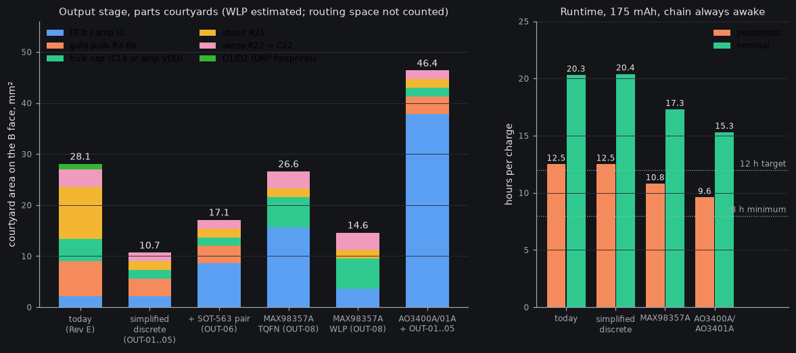

# Output stage: simplification study (H-bridge, self-test sense)

Status: opportunity study, read-only. Nothing in the schematic, board, spec or firmware was changed. 2026-10-02 · Domain: output stage (F3 drive the exciter, F4 self-test |Z|) · Scoring: spec O19 (reliability and size/comfort co-equal, then convenience, diagnosability, serviceability, money last), O20 (rev 1 is the final device), O18 (fail informatively, firmware knobs) · Evidence: `sim/checks/output_simplify.py` (new, three checks), JLC parts API 2026-10-02T04:44Z to 05:04Z, datasheets listed at the end.

## Bottom line (blunt)

1. **Do not replace the discrete bridge with an integrated amplifier for rev 1.** The best part, MAX98357A (Maxim/Analog Devices I2S-input mono class-D amplifier), idles at 2.4 mA (datasheet Rev 7, 2/16, p.4) against ~0.8 mA for today's bridge plus ~0.3 mA of MCU work it would remove. Net +1.1 to +1.6 mA whenever the chain is awake: always-awake runtime 12.5 h to 10.8 h (pessimistic). It also adds three failure classes that no firmware can fix (self-hearing with an asynchronous 330 kHz carrier, no PWM-rate knob, no dead-time knob). With the F4 self-test kept, the TQFN version (the robust package) is *much larger* than a simplified discrete bridge (26.6 mm² against 10.7 mm² of courtyard), and even the 0.4 mm-pitch WLP (14.6 mm²), the kind of package O19 wants fewer of, is bigger. The "one expensive component beats five cheap ones" rule does not pay off here: the expensive part is not the FETs.
2. **The bridge's area is not in the FETs.** Q1+Q2 are 2.2 mm² of courtyard out of 28.1 mm² for the whole stage. The biggest single item is **R21, the 1206 shunt: 10.2 mm² (36 %)**. Gate pulls are 6.9, C14 4.3, R22+C22 3.4. Five small changes (OUT-01 to OUT-05) take the stage from 28.1 to **10.7 mm² (−17.4 mm², −62 %)**, remove 3 placements (56 to 53), add no current, keep every firmware knob, and make the self-test *better*.
3. **None of this changes pod volume (0 mm³).** The pod outline is set by the 35 mm cell and the dock; the B-face height band (1.2 mm) is set by the mic (1.08) and L1 (1.00). The saving is margin in the B-face layout next to the congested U3 cluster, fewer solder joints (6 fewer), and a lower tallest part in the bridge region (C14 1.00 mm to 0.60 mm).
4. **Confirmed: Basic AO3400A/AO3401A (Alpha & Omega 30 V N and P MOSFETs, SOT-23) would cost ~2-3.4 mA of gate drive**, 7-11 times the PMCXB290UE (Nexperia 20 V complementary pair, DFN1010B-6). The earlier "~3.5 mA" is the datasheet-conditions ceiling (3.4 mA); at the real 3 V drain voltage it is nearer 2.1-2.7 mA. Either way it is out: 9.6 h always-awake (pessimistic), +36 mm² of courtyard, two more placements.
5. **New, verified in SPICE: F4 can read the *signed coil current* with no offset resistor and no filter capacitor** (sample R21 at mid-state A and mid-state B, take clip0(A) − clip0(B)). Error < 2 % in amplitude and < 1° in phase down to −32 dBFS (ideal ADC). That removes C22 and the "offset resistor" that sub-output issue 1 option D needed, and it measures the real coil current instead of supply current.

## 1. What the stage is today (numbers to beat)

| Item | Value | Source |
|---|---|---|
| Parts | Q1, Q2 (PMCXB290UE), R3-R6 (100 kΩ pulls), C14 (22 µF), R21 (0.1 Ω 1206), R22 + C22 (1 kΩ + 10 nF), D1/D2 (DNP footprints): 10 placed parts, 2 DNP | `hw/pod/bom_jlc.csv`, `gen.py` L152-178 |
| Courtyard area (B face, except R22/C22 on F) | 28.1 mm²: R21 10.24, R3-R6 6.88, C14 4.28, R22+C22 3.37, Q1+Q2 2.16, D1/D2 1.16 | KiCad 10 pcbnew on `hw/pod/draft_r1/pod_r1_routed.kicad_pcb`, 2026-10-02 |
| Current | bus 0.49 + gate 0.28 mA at 12.5 ns dead time, plus pulls 0.06 mA | `bridge_spice.py`, C3 §5 |
| Knobs (firmware) | dead time, PWM rate (200/400/800 kHz), duty ceiling, soft start, OSSI/idle levels | D6, C3 §5 |
| Self-test | R21 on the N-source return, R22/C22 low-pass to PA6 (ADC1_IN11); reads supply current i·(2d−1); |Z| at 2f needs an offset resistor | sub-output issue 1 |
| Open: ECR-0003/0004/0005 | PA10/PB15 leg B; footprint redraw; LDO 300 mA vs ~315-326 mA peaks | `docs/system/plm/ecr/` |

## 2. The integrated-amplifier question, re-opened with data

Spec D6 (L184) rejects "integrated H-bridge ICs" (DRV8837/8210/8833: 160-1,100 ns delays, 100 kHz max) and "amplifier IC + DAC" (quiescent current, one more part). The first objection is about *motor drivers* and is untouched here. The new arguments for re-opening the second: audio-class I2S amps contain the DAC (so it is not "one more part"), their dead time and edge control are designed for inductive loads, they take the bridge load off the 3.0 V LDO, and under O19/O20 part count and fragile footprints weigh more than they did. So each candidate was checked against its datasheet.

| Part (what it is) | LCSC · class · stock · price (JLC API 2026-10-02T04:44Z) | Package | Iq / idle | Supply | Verdict |
|---|---|---|---|---|---|
| **MAX98357A/B** (Maxim/ADI I2S/TDM-input mono class-D) | C910544 TQFN · Ext · 27,489 · $1.3152; C2682619 WLP · Ext · 3,323 · $0.5073 | TQFN-16 3×3×0.75, or WLP-9 1.345×1.435×0.64 at 0.4 mm pitch | **2.4 mA typ, 2.85 max at 3.7 V** (2.75 at 5 V); standby 340 µA; shutdown 0.6 µA typ, 2 max; turn-on 7 ms typ | 2.5-5.5 V: runs straight from VSYS | the only plausible one; **not recommended** (§2.1) |
| MAX98360A-D (same family, lower-power variants) | C4990962 WLP 1.4×1.4 · Ext · 54 · $3.66; C4988888 FC2QFN-10 2×2 · Ext · 70 · $6.38 | WLP / FC2QFN | 2.2 mA (WLP) and 3.35 mA (FC2QFN) per the JLC listing; datasheet **not opened** (analog.com timed out), unverified | 2.5-5.5 V | no better Iq, tiny stock, 3-5× the price: reject |
| MAX98358 (PDM-input) | C4990512 · Ext · 5 · $4.06 | TQFN-16 3×3 | not opened | 2.5-5.5 V | 5 in stock; the MCU would have to make a 1-bit PDM stream: reject |
| NAU8315YG (Nuvoton I2S class-D) | C4991453 · Ext · **0** · $0.4959 | QFN-20 4×4 | **4.0 mA idle at 4.2 V**, 0.3 µA shutdown (Rev 1.6, 28 Jun 2021 §7.3) | 2.5-5.25 V | reject: 0 stock, 4.0 mA, 4×4 mm |
| TAS2110 (TI I2S class-D with 11 V boost) | C4991172 · Ext · 227 · $2.71 | VQFN-32 4×4.5 | **2.7 mA VBAT + 7.9 mA at 1.8 V** idle (SLASET8, Dec 2019, p.10) | VBAT 2.7-5.5 V **and VDD 1.65-1.95 V** | reject: boost converter (D11), needs a 1.8 V rail, 10.6 mA idle |
| TAS2120 (TI, 14.75 V boost, 2025) | C50374562 · Ext · 39 · $2.80 | QFN 4×3.5, 0.4 mm pitch | **4.8 mW idle noise-gate on, 13.1 mW off** (VBAT 0.19 + VDD 2.3 mA at 1.8 V) (SLASFC6A) | VBAT + **VDD 1.65-1.95 V** + IOVDD | reject: boost (D11), 1.8 V rail; reports VBAT/PVDD/temperature, not speaker current |
| AW88261 (Awinic smart amp, speaker V and I sense) | C5162549 · Ext · 40 · $0.88 | FCQFN-26 2.5×2.5 | **7.5 mA VBAT + 3.5 mA DVDD** operating (V1.5, Oct 2022 §Electrical) | 3.0-5.5 V + DVDD 1.65-1.95 V, 2 MHz boost | reject: the only part with I/V sense, at 11 mA and a boost converter |
| PAM8302A / NS4150B (analog-input class-D) | C113367 · $0.32 / C189961 · $0.15 | MSOP-8 | 4 mA each per the JLC listing (datasheets not opened) | 2-5.5 V | reject: needs an analog input; both MCU DAC pins are taken (PA4 VBAT_SENSE, PA5 MIC_VDD) |
| TPA2011D1 (TI analog class-D) | C468251 · Ext · 8,344 · $0.69 | DSBGA-9 | 1.5 mA typ, 2.3 max at 3.6 V (SLOS626B, via `tws/power.md` [S14], not reopened) | 2.5-5.5 V | reject: analog input, WLCSP |

### 2.1 MAX98357A in detail (the only candidate that survives the screen)

What is attractive, all from the Rev 7 datasheet unless stated:
- **Reset-safe with no parts.** SD_MODE has a 100 kΩ pull-down inside (R_PD, p.7): an undriven pin means shutdown, outputs high-impedance. R3-R6 and the whole "TIM1 pins float at reset" argument disappear. It also has 2.8 A current limit and thermal protection, which the bridge lacks (sub-output issue 6, "no hardware fault cut-off").
- **Works from VSYS (2.5-5.5 V).** The exciter load leaves +3V0, so the ECR-0005 WARN (+3V0 peak 326 mA > 300 mA) clears. Output level does not track the battery: full scale is fixed at 2.1 dBV + gain, with no supply-ratio term (p.30), so the 1.8 dB gain tracking that spec §7 feared does not occur (only at 6 dB gain and above does the 3.6 V peak full scale exceed a 3.0-3.5 V cell, which the −12 dBFS ceiling never reaches).
- **Turn-on 7 ms typ / 7.5 max** (p.4), inside the 10 ms look-back buffer of the idle detector (C9), so shutdown in idle is usable. Shutdown costs 0.6 µA typ (2 µA max).
- **Pins exist.** SAI1 block A is on **PA8 (SCK_A), PA9 (FS_A), PA10 (SD_A), AF13** (pins 29/30/31 of the UFQFPN48-SMPS), checked in ST's own open pin data (`tools/data/stm32_open_pin_data/STM32U575CIUxQ.xml`) and DS13737 Rev 10 Table 28. Those are TIM1 CH1/CH2 and the ROM-bootloader pin PA10 today, so it reuses two bridge pins and frees PA7 and PB0. One free GPIO (e.g. PB1) drives SD_MODE.

Why it still loses:
1. **Current.** 2.4 mA typ at 3.7 V against bridge 0.77-0.83 mA. The MCU side saves about 0.3 mA (the ×16 interpolator + 3rd-order shaper at the 200 kHz rate, 6-12 Mcycle/s at 23 µA each, C2 and A3 §5; TIM1 0.20 mA becomes SAI1 ~0.11 mA, DS13737 Table 72). Net **+1.1 / +1.3 / +1.6 mA** (low/nominal/high) while awake. At 175 mAh: always-awake 12.5-20.3 h becomes 10.8-17.3 h; aged cell (140 mAh) 10.0-16.3 h becomes 8.6-13.9 h. 18 %-awake use hardly moves (24.6 to 23.4 h). This is survivable, not free.
2. **The carrier is asynchronous (new argument against, from D14).** Today every harmonic of the 200.02 kHz PWM that lands near a multiple of the 4.0004 MHz mic clock folds to **DC**, because 200.02 kHz × 20 = the mic clock (D14, A3 §2). The amp's switching frequency is 330 kHz with ±20 kHz spread spectrum (p.5, p.30), unrelated to the mic clock. Its 12th harmonic (3.96 MHz ± 0.24 MHz) straddles 4.0 MHz, so anything the mic picks up of it folds into 0-280 kHz, including 20-85 kHz, as broadband noise. How much is picked up is unknown (no ultrasonic-band data in the datasheet: noise is 25 µVrms A-weighted, audio band only). Today's bridge has the same exposure for its shaped quantisation noise (MP-01: −35 dB re FS across 20-85 kHz) but **has a firmware fix** (800 kHz PWM: −59 dB, +0.8 mA). The amp has none. This is the decisive hardware-only risk.
3. **Knobs lost (O18).** No dead time, PWM rate, OSSI or edge control to tune. All the AD-modulation work in C3 becomes irrelevant (the amp's own modulator and 105 dB DAC replace it), which is good *if* it works out of the box and bad if it does not.
4. **Output rate.** LRCLK may only be 8, 16, 32, 44.1, 48, 88.2 or 96 kHz (p.16: "12 kHz … NOT supported"); 16 kHz works (voice-mode filter, −3 dB at 0.446·fs = 7.1 kHz). The planned 12.5 kS/s oscillator-bank output (8 samples per 0.64 ms hop) becomes 16.0 kS/s (10.24 samples per hop): a firmware change in sub-processing, fixable but real. SAI1 kernel clock options per RM0456 Rev 7 RCC_CCIPR2: PLL1 P, PLL2 P, PLL3 P, AUDIOCLK, HSI16 (exact divider not worked out).
5. **F4 gets weaker.** No I/V sense. A 0.1 Ω shunt in the amp's ground return reads rectified supply current: open/short and a rough R, no phase, no L.
6. **Area.** TQFN 15.6 + 10 µF 4.3 + 100 nF 1.65 + F4 parts (R21 0402, R22, C22) 5.1 = **26.6 mm²** against 10.7 mm² for the simplified discrete stage (+15.9). The WLP version is 14.6 mm² (+3.9), but WLP-9 at 0.4 mm pitch is exactly the fragile class U3 already is. Heights 0.75 mm (TQFN) and 0.64 mm (WLP), both inside the band.
7. **Diagnosability falls.** The amp has no status pin and no registers; the bridge has J1/J2 probe pads, R21 lift link and a measurable coil current.

**What would flip it:** a bench result (S2/E7) that the 200 kHz bridge noise is heard and 800 kHz does not fix it, *and* a measurement that an amp's 330 kHz skirt is quieter at the mic. That needs a rev-1 board, which defeats the point. Keep it as an ECR-ready alternative: the pin map and cross-check are in OUT-08.

## 3. Check of the AO3400A/AO3401A claim

AO3400A (Rev 3.1, Jul 2023) and AO3401A (Dec 2023) from aosmd.com:

| | AO3400A (N) | AO3401A (P) | PMCXB290UE (N / P) |
|---|---|---|---|
| Qg at VGS = 4.5 V typ | 6 nC (7 max) | 7 nC | 0.6 / 0.6 nC (0.9 / 0.8 max), VDS 10 V |
| Qg at 3.0 V, read off Fig. 7 (VDS 15 V) | ~4.0 nC | ~4.5 nC | ~0.37 nC (0.62 × the 4.5 V value, B-parts §2) |
| Rds(on) at 2.5 V | < 48 mΩ | < 85 mΩ | 0.36 / 0.98 Ω typ |
| Ciss | 630 pF | 645 pF | 43.6 pF (N) |

- Sum of four at 3.0 V under datasheet conditions: 2×4.0 + 2×4.5 = **17 nC × 200 kHz = 3.4 mA**. The earlier "~3.5 mA from ~4-6 nC each" is therefore **confirmed as an upper bound**.
- At the real drain voltage (3 V, not 15 V) the Miller charge (Qgd 1.8 / 2.5 nC at 15 V) shrinks to roughly a fifth; ~11 nC, **2.1 mA** [derived estimate, low confidence]. Use **2.1-3.4 mA total, +1.8 to +3.1 mA over today's 0.3 mA**.
- PMCXB290UE: 4 × 0.37 nC × 200 kHz = **0.30 mA**, matching `power.py`'s gate line.
- Effect: always-awake 175 mAh drops to 9.6 h pessimistic (below the 12 h target, above the 8 h minimum), 7.7 h on an aged cell (below 8 h). Area +36 mm² (SOT-23 courtyard 9.46 mm² each), four placements for two. Better Rds(on) (0.1 dB louder) is irrelevant. **Reject.**

## 4. Opportunities (all discrete-path unless stated)

Areas are courtyards from the KiCad 10 library and the draft board; they exclude routing space. Heights from `tools/checks/part_heights.yaml` (datasheet maxima).

### OUT-01 Drop the two N-gate pull-downs R4 and R6
Shoot-through needs the P and N of one leg on together. The P pull-ups (R3, R5) hold both P-FETs off from power-up and in reset, whatever the N gates do; with P off, an N-FET that floats on only grounds an output. So R4 and R6 add nothing to reset safety. In ROM DFU the bootloader leaves PA8 untouched (R3 holds it), drives PA9 high (P off) and pulls PA7 down; PB0 floats, harmless (sub-debug-test, AN2606 Table 199). ECR-0013 S2 adds a 5.1 kΩ dead-battery pull-down on PB15 after reset, also harmless to an N gate.
**−2 placements, −3.44 mm², −4 joints, −0.03 mA, −$0.005/pod.** D6 says pulls are "mandatory" (both kinds): owner confirms the narrower rule. SPICE of floating gates was tried and abandoned: ngspice's gmin makes floating nodes collapse within a millisecond, so the argument rests on the circuit logic above, not on a sim. Bring-up step 1 gains no new check.

### OUT-02 R21 from 1206 to 0402
The shunt dissipates 10 mW at the full-scale peak (0.1 Ω × 0.32 A²); a 1206 (250 mW) is 25× over-rated. 0402 candidates: Panasonic ERJ2BSFR10X (current-sense type, 166 mW, ≤ 300 ppm/°C; C409058 · Ext · 15,928 · $0.0732) or Uni-Royal 0402WGF100LTCE (62.5 mW, 800 ppm/°C; C270655 · Ext · 21,777 · $0.0116), both JLC 2026-10-02T04:57Z. Recommend the Panasonic part: lower drift keeps the |Z| calibration steady over 0-40 °C.
**−8.52 mm² (the single biggest win), height 0.65 to ≤ 0.40 mm, +1 Extended type (~$3 per order), +$0.07/pod.** Bonus: R21 sits under SW1 on the foam-floor problem (cross-risk 12); a thinner, smaller part presses less on the pouch.

### OUT-03 Drop C22 and the offset resistor: sample R21 in sync with TIM1
Replaces sub-output issue 1 options D/B. Keep R22 (1 kΩ) as pin protection; delete C22. Firmware: TIM1 TRGO = update (centre-aligned, update at overflow *and* underflow), ADC1 external trigger `adc_ext_trg9` = `tim1_trgo` (RM0456 Rev 7 Table 307), ~24.5-cycle sample time, oversampling. State A (Q1P + Q2N) is centred mid-period, state B on the period boundary; R21 carries +i in A and −i in B, so a unipolar ADC reads clip0(V_A) − clip0(V_B) = i with the sign intact.
SPICE (`output_simplify.py f4`, DMC2400UV stand-in, 8 Ω, 12.5 ns, ideal ADC): amplitude error +0.1 % (−12 dBFS), +0.5 % (−22), +1.7 % (−32) at 0.3 mH; −0.3 / −0.4 / −1.3 % at 1.26 mH; phase error −0.7 to −0.9°. A real 14-bit ADC is 0.18 mV per count = 1.8 mA of coil current per count, so oversample ≥ 16× at low drive.
**−1 placement, −1.65 mm², −2 joints, −$0.005/pod. The self-test gains the real coil current, phase, and a sweepable sample instant (a poor man's current scope for edge and shoot-through spikes).** Only runs in self-test mode, so zero battery cost in normal use.

### OUT-04 Delete the D1/D2 footprints
Both are DNP in Rev E (the outputs reach only the sealed exciter; FET body diodes clamp). The footprints still cost 1.16 mm², an Extended LCSC line in the schematic and one of the 7 unrouted nets (OUT_A stub at D1 pad, reg-board routing table #1). **−1.16 mm², 0 placements, −1 unrouted net.** If ESD ever shows up, hand-fit a diode across the arm wires.

### OUT-05 C14 from 22 µF 0603 to 1 µF 0402
The 22 µF cap is there for the audio-rate energy the bridge returns, but the SPICE (`output_simplify.py rail`, LDO modelled as 3.0 V + 0.3 Ω behind a one-way diode, MCU+mic 4.5 mA) shows the rail motion at the −12 dBFS ceiling is **7.7 mV pk-pk with 25.5 µF effective, 7.9 mV with 15.5 µF, 7.5 mV with 5 µF**: it is the LDO's series resistance, not the capacitor. Only the full-scale fault/self-test case cares (0 dBFS, 1.26 mH: 111 to 160 mV, rail max 3.09 V). The other bulk caps (C4, C7: 2 × 10 µF) already sit on +3V0. Keep a small local cap for the carrier edges (the board inductance between Q1/Q2 and C4/C7 was *not* modelled): C52923 (Samsung 1 µF 25 V X5R 0402, Basic, $0.0099, already in the BOM).
**−2.63 mm², height 1.00 to 0.60 mm, −$0.02/pod, removes the 22 µF line; smaller class-2 body for the §6 "singing" rule (issue 5).** Dropping it altogether is rejected (§6).

### OUT-06 Swap Q1/Q2 to a SOT-563 pair (DMC2400UV-7), to end the DFN1010 footprint risk
PMCXB290UE is the project's most fragile footprint (DFN1010B-6, 0.35 mm pitch, hidden drain pads, land gap at JLC's 0.15 mm minimum, ECR-0004). Diodes DMC2400UV-7 (Diodes 20 V complementary pair, SOT-563 1.6×1.6 mm, 0.5 mm pitch, visible leads, ESD-protected gates; C177025 · Ext · **98** · $0.0765) has the manufacturer SPICE model the project's whole C3 analysis already used, so the sim numbers (idle 0.49 mA, THD+N −61 / −52 dB) become the design numbers instead of a stand-in; gate charge 0.5 nC (0.25 mA, 0.05 mA *less*); Rds(on) 0.43 / 0.85 Ω at 3 V; N 1.03 A / P 0.7 A continuous. Hand-reworkable by the owner (O19 serviceability); the DFN1010 is not. Downsides: **+6.4 mm²** (4.30 vs 1.08 mm² each), stock only 98 (genuine; the 3,820 "DMC2400UV" at C2940616 is a TECH PUBLIC clone with different figures, B-parts §2), and the datasheet is still marked "advance information" (DS35537 Rev 11-2, Mar 2020). Buy all spares once (O19) or fall back to NTZD3155C (onsemi, 8,748 in stock, 1.5-1.7 nC, +0.5 mA).
**0 placements, +6.4 mm², −$0.19/pod, supersedes ECR-0004.**

### OUT-07 Close ECR-0005 in firmware, with no part change
At the D17 ceiling (−12 dBFS) the peak is ~85 mA; only full-scale tones or self-test sweeps reach 315-326 mA, and U4 (TPS7A2030 LDO) holds a 360 mA minimum current limit (SBVS338H). Clamp the TIM1 duty range so |2d−1| ≤ 0.5 (peak ≤ 161 mA, 46 % under the 300 mA rating) as a register-level ceiling, and cap the docked self-test at −12 dBFS (the same exemption ECR-0009 option a asks for). That also removes the rails-check WARN "VSYS peak 327 mA is 93 % of the cell's 2C rating". **No parts, no area; a firmware bug can still write any CCR, which costs a rail dip, not damage** (R20 is rated 1 A, rail-budget.yaml).

### OUT-08 (alternative, not recommended) MAX98357A on SAI1, powered from VSYS
Full swap, kept ready for the owner to decide. TQFN-16 recommended over WLP if ever taken. Removes Q1, Q2, R3-R6, C14 (7); adds U, 10 µF, 100 nF (3; GAIN_SLOT tied to VSYS = 6 dB, SD_MODE to a GPIO, no other parts); keeps R21 (0402) in the amp's ground return with R22/C22 as a power-based F4 (the 16 kHz filter is needed to average the 330 kHz supply-current pulses). Net **−4 placements (56 to 52)**, area 26.6 mm² (TQFN, −1.5) or 14.6 (WLP, −13.5), Extended types unchanged (PMCXB290UE out, MAX98357A in), +$1.0/pod (TQFN) or +$0.15 (WLP). Numbers and reasons in §2.1. Supersedes ECR-0003, -0004, -0005 (conflicts with ECR-0003: both want PA10).

## 5. Package view

| Variant | Parts placed in the stage | Courtyard mm² | Δ vs today | Gate/active current | Height (tallest) | Hardware-only risks added |
|---|---|---|---|---|---|---|
| Today (Rev E) | 10 (+2 DNP) | 28.1 | – | 0.83 mA | C14 1.00 | none new |
| **OUT-01…05** | 7 | **10.7** | **−17.4** | 0.80 mA | 0.60 | none |
| + OUT-06 (SOT-563) | 7 | 17.1 | −11.0 | 0.75 mA | 0.60 | stock (98) |
| OUT-08 TQFN (F4 kept) | 6 | 26.6 | −1.5 | 2.4 mA (net +1.3) | 0.75 | self-hearing, no knobs |
| OUT-08 WLP (F4 kept) | 6 | ~14.6 | −13.5 | 2.4 mA | 0.64 | same + 0.4 mm pitch |
| AO3400A/AO3401A (with OUT-01…05) | 9 | 46.4 | +18.3 | 2.1-3.4 mA | 1.1 | none, but fails runtime |

Pod volume Δ: 0 mm³ for every row (see bottom line 3). Mass: < 0.05 g either way.

## 6. Rejected ideas (reasons in the structured output)

Smart amps (TAS2110, TAS2120, AW88261, TAS2563 class) · NAU8315 · MAX98360A-D · MAX98358 · analog-input class-D (PAM8302A, NS4150B, TPA2011D1) · Basic AO3400A/AO3401A · single-ended half-bridge with a DC-block cap · bridge on VSYS with discrete FETs (P gate cannot be turned off from a 3.0 V pin at 4.2 V source) · load switch as hardware bridge enable · series gate resistors or an output filter · dropping C14 entirely · dropping R3/R5 · dropping the F4 shunt · a 100 kHz PWM.

## 7. What to verify on rev 1 (O18, firmware-fixable vs not)

| Check | Proves | If wrong |
|---|---|---|
| Meter OUT_A/OUT_B and +3V0 current at power-up, then in ROM DFU, with R4/R6 absent | OUT-01 | firmware-fixable only if a pin level is wrong; otherwise fit R4/R6 (0402 pads are free to leave as DNP footprints at 3.4 mm² cost: owner call) |
| Sweep the ADC trigger offset across the PWM period with a resistor load (8-12 Ω) on J1/J2 | OUT-03 sync sampling and shoot-through spikes | firmware: change sample instant, averaging |
| Cap-swap listening with the bridge at the ceiling | OUT-05 (singing) | hardware-only: solder a bigger 0603 on C14's pads |
| S2 mic capture, bridge at 200/400/800 kHz | MP-01 | firmware: PWM rate |

## 8. Owner decisions touched

D6 (gate pulls "mandatory": OUT-01; "amplifier IC + DAC rejected": §2), D14 (coherent carrier: §2.1), D17 (pop-free start relied on the pulls: P pull-ups still do it), O18 (OUT-03 adds knobs), O19/O20 (OUT-02, OUT-06). Open ECRs: ECR-0003 compatible with OUT-01 (R5 still holds PA10 high), ECR-0004 superseded by OUT-06 or still needed, ECR-0005 closed by OUT-07, ECR-0009 shares OUT-07's self-test cap.

## Sources (accessed 2026-10-02 unless noted)

- Maxim Integrated MAX98357A/MAX98357B, 19-6779 Rev 7, 2/16 (Adafruit-hosted copy https://cdn-shop.adafruit.com/product-files/3006/MAX98357A-MAX98357B.pdf; analog.com and maximintegrated.com timed out). SHA-256 prefix abac92d3522a204f.
- TI TAS2110 SLASET8 (Dec 2019), https://www.ti.com/lit/ds/symlink/tas2110.pdf (1afb23c1f739033b). TI TAS2120 SLASFC6A (Aug 2025), https://www.ti.com/lit/ds/symlink/tas2120.pdf (52461a31cee90780).
- Nuvoton NAU8315 Rev 1.6 (28 Jun 2021) and Awinic AW88261 V1.5 (Oct 2022), LCSC copies linked from the JLC API listings (ab25574257072985, 3b5afa386c6f2f42).
- Alpha & Omega AO3400A Rev 3.1 (Jul 2023) and AO3401A (Dec 2023), https://www.aosmd.com/res/data_sheets/AO3400A.pdf and AO3401A.pdf (9c60d0b6c1ddc760, 0d8e3261ae280e00).
- Nexperia PMCXB290UE v.1 (30 May 2023) and Diodes DMC2400UV DS35537 Rev 11-2 (Mar 2020), local copies in `ultrasonic-scratch/ds/`.
- ST DS13737 Rev 10 Tables 28 and 72, RM0456 Rev 7 Table 307 and RCC_CCIPR2 (repo copies); ST open pin data in `tools/data/stm32_open_pin_data/`.
- JLC parts API: `tools/jlc.py` queries 2026-10-02T04:44Z-05:04Z. Listing-only figures (MAX98360A, PAM8302A, NS4150B, AW8737A) are labelled unverified.
- Repo: `docs/system/*`, `docs/research/C3-output-stage.md`, `tws/power.md`, `A3-u575-plan.md`, `sim/checks/power.py`, `bridge_spice.py`.
- Not done: MAX98360A-D, MAX98358, PAM8302A/NS4150B datasheets not opened; WLP courtyard (3.6 mm²) is estimated; the RM0456 SAI divider arithmetic and a real ADC's noise in OUT-03 are unverified.
