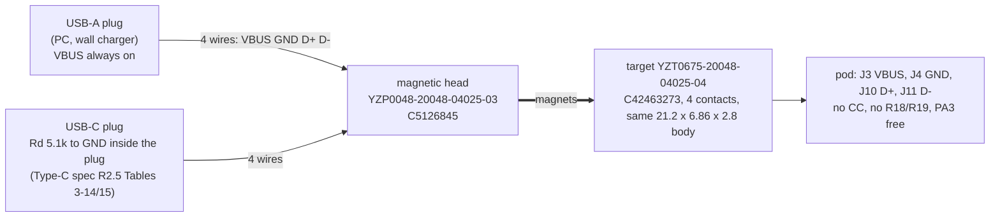
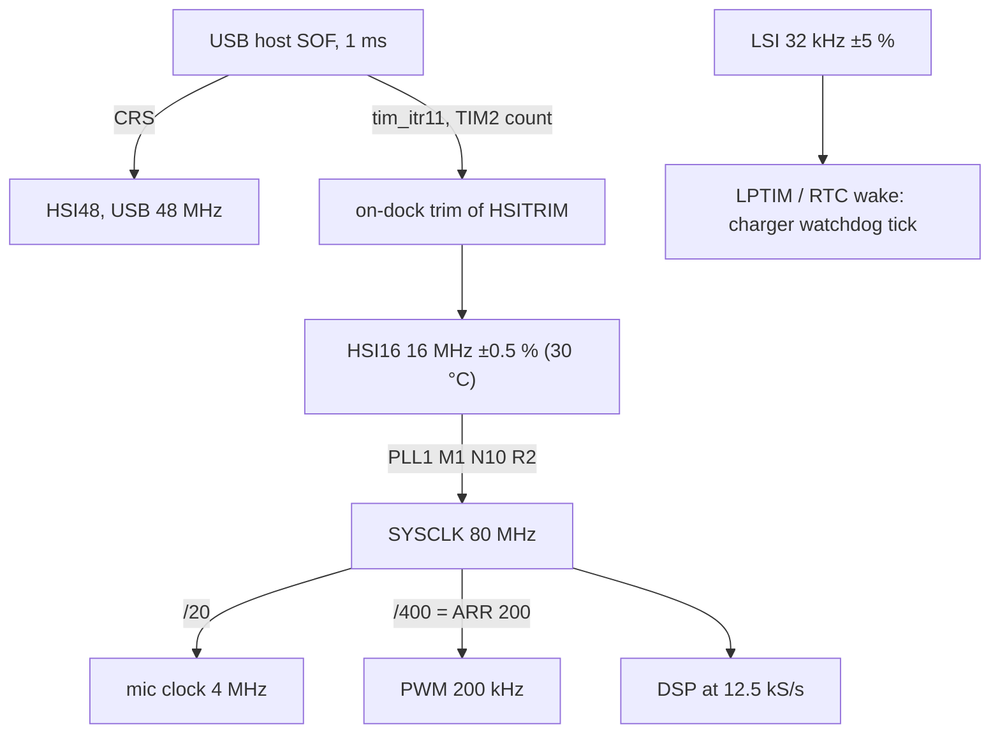

# Simplification study: MCU periphery, USB/dock, UI (button, LED)

Date: 2026-10-02 (UTC; the run was ordered 2026-10-01 local). Read-only opportunity study, nothing in the schematic, board, CAD or spec was changed. Scoring rule: spec O19/O20 (personal device, rev 1 is the final device): reliability and size/comfort first and co-equal, then daily convenience, diagnosability (O18), serviceability, money last.

Domain: the small parts around the STM32U575CIU6Q (ST Cortex-M33 MCU, QFN-48 with internal core SMPS), the magnetic dock and its USB/ESD parts, the button and the power LED. Docs read first: `docs/system/` README, 00-whole, integration-map (incl. §10), physical, sub-processing, sub-dock-usb, sub-ui, sub-debug-test, sub-power, sub-audio-in, sub-output, reg-arm, reg-pad, reg-pod-body, reg-board; ECR-0001..0012; `plm.py impact` run on every ref/net touched (relation ids are listed per opportunity in the structured result).

## 0. Bottom line (blunt)

1. **The biggest honest win is the dock.** Dropping the CC line (J12, R18, R19, PA3) is backed by the USB Type-C spec itself, removes three parts and one MCU pin, removes two real hazards (5 V into PA3 on a rotated mate; CC level confusing the ROM bootloader's USART2_RX), and turns the BOM's "wrong" 4-pin head (C5126845, 45 in stock) into the *right* head. It costs one thing: a USB-C-plug cable has to carry its own 5.1 kΩ Rd inside the plug (that is what the spec's own legacy cables do), and charge current has to be negotiated by firmware (USB enumeration or BC1.2 detection), not read from CC.
2. **Four pull-ups can go (R11, R15, R16, R17) and take 3 of the 7 unrouted nets with them.** R11 and R17 are safe. R15/R16 work if firmware runs I2C at 50 kHz or less: at 100 kHz the internal 30-50 kΩ pull-ups sit within ~15 % of the I2C standard-mode rise-time limit with 20 pF on the bus, so they are a firmware-speed knob, not a hard fix.
3. **The 32.768 kHz crystal (Y1, C11, C12) is only needed by algorithm A (heterodyne), which is the fallback.** For algorithm B the clock error maps to pitch with a factor 0.32 (derived below): the datasheet's worst-case ±0.5 % factory HSI16 gives ≤ 5.6 cents difference between the two ears, far under what the ear resolves. USB runs crystal-less by ST's own statement. Cost: +67 µA while awake, one option lost for good (A with crystal-grade pitch). It is a medium-confidence recommendation because it touches spec D16 (owner decision).
4. **The LED is the best cut that touches other domains.** Moving it from the pad (4 arm wires, pad board, PB7 wire fault paths) to the pod lid (2 arm wires, no pad board) is a large mechanical simplification. It reverses O8 ("in the pad housing"), so it is an owner option; I recommend it, with "no LED" as the extreme.
5. **I do not recommend replacing the IP68 switch with capacitive touch** (O16(7) is an owner decision and the evidence says rain, hair and the F-face area make it the riskier hardware): details in §2.6.
6. Everything else (decoupling, ESD, test pads, spare pins) is small: individually 1-2 parts. Total if the recommended set is adopted: **-10 placements (56 -> 46), -1 Extended type, about -28 mm² of courtyard area, 12 -> 9 hand-wire pads, +0.07 mA awake**, and the pad board disappears.

## 1. Scorecard

Axes: R reliability (parts, joints, fine pitch), S size/mass, C daily convenience, D diagnosability (O18), V serviceability. "+" better, "-" worse, "0" neutral. $ is reported, not scored.

| ID | Change | Placements | Area (courtyard, mm²) | Ext. types | R | S | C | D | V | $/pod | Confidence |
|---|---|---|---|---|---|---|---|---|---|---|---|
| PER-01 | Drop CC + 4-pin dock set | -2 | -5.5 | 0 | + | + | 0 | 0 (CC readout lost, hazards removed) | + | +0.10 | high (electrical) / medium (keying) |
| PER-02 | Delete R11 | -1 | -1.75 | 0 | + | + | 0 | 0 | 0 | -0.002 | high |
| PER-03 | Delete R17 | -1 | -1.75 | 0 | + | + | 0 | 0 | 0 | -0.002 | high |
| PER-04 | Delete R15, R16 | -2 | -3.5 | 0 | + | + | 0 | 0 (firmware speed knob) | 0 | -0.005 | medium |
| PER-05 | Drop LSE (Y1, C11, C12) | -3 | -9.8 | 0 | + | + | 0 | 0 (cross-check moves to USB SOF) | 0 | -0.18 | medium |
| PER-06 | Merge C20 into the pin-48 cap | -1 | -1.75 | 0 | + | + | 0 | 0 | 0 | -0.004 | medium |
| PER-07 | LED to the pod lid, pad board gone, 2 arm wires | +1 (LED) | -2.25 on the pod board, -46.5 (pad PCB) | 0 (LED type moves boards) | ++ | ++ | 0 | + | + | -1 to -4 | medium (owner decision O8) |
| PER-08 | No LED at all (extends PER-07) | -1 more (R14) | -1.75 more | -1 | + | + | - (no state light) | 0 | + | -0.03 | medium (owner decision O8) |
| PER-09 | U6 + D3 into one array | -1 | ~0 | -1 | 0 | 0 | 0 | 0 | 0 | -0.28 | low |
| PER-10 | Capacitive touch instead of SW1 | 0 | F face +10..+40 (electrode keep-clear) | -1 | ? | 0 | ? | 0 | + | -0.39 | low (not recommended) |
| PER-11 | TP set: drop TP6, no extra BOOT0 pad | 0 | -1.3 | 0 | 0 | + | 0 | + (DFU-first without a probe) | 0 | 0 | medium |
| PER-12 | Spare pins as via dots + a UART TX hook | 0 | +1.6 | 0 | 0 | 0 | 0 | + | 0 | 0 | low |

Combined (PER-01..07, 11, with PER-06 and 11 as layout-session bonuses): placements 56 -> 46; area about -28 mm² of 442 mm² (34 x 13); Extended types 10 -> 10 on the pod board (the LED moves onto it), and the 11th (the pad-board LED) is gone as a separate board; wire pads 12 -> 9; MCU spare pins 8 -> 12 (PA3, PA10, PC14, PC15 join); about 18 fewer solder joints on the pod board.

## 2. Findings

### 2.1 Dock: is CC needed? (PER-01)

**What the spec says.** USB Type-C Cable and Connector Specification, Release 2.5 (March 2026), Table 3-2 notes 1-2 and Tables 3-14/3-15:
- A Type-C plug at the *device* end of a legacy cable (the "B"-side Type-C plug of a Type-C-to-Standard-A cable) must carry Rp 56 kΩ ± 5 % to VBUS.
- A Type-C plug at the *host/charger* end of a legacy cable (Type-C to Standard-B or Micro-B) must carry **Rd 5.1 kΩ ± 20 % to GND, built into the plug**; CC is not carried down the cable, only VBUS, GND, D+, D- (Table 3-15 note 1; VBUS bypass cap not required, note 3).
- Our cable is "host-side plug -> four wires -> magnetic head", which is exactly the second shape: the pogo head plays the legacy device end. A USB-A host plug needs no CC at all (A ports always supply VBUS).

So the pod needs neither Rd nor a CC sense. The Rd lives in the owner's cable, in the Type-C plug if she uses a Type-C plug at all.

**What we lose and what replaces it.**
- CC level also told the sink how much current a Type-C source offers. The pod draws at most ~190 mA (170 mA charge + system), below the Default USB current of every source, so this only matters at a non-BC1.2 wall charger, where USB 2.0 caps an unconfigured device at 100 mA.
- Firmware policy (all knobs): boot with U3's ILIM at 100 mA (BQ25180 offers 50/100/200/300/380/500/665/1050 mA; 100 mA is 80-98 mA real, SLUSE99C §7.5); run battery-charging detection (the U575's OTG_FS core has BCDEN/DCDEN/PDEN/SDEN, RM0456 Rev 7 OTG_FS GCCFG) and/or enumerate; raise ILIM to 500 mA after a DCP is detected or the device is configured. Worst case, a flat cell charges at ~80-90 mA: about 2.1 h plus the CV taper. That is a charge-speed cost at odd chargers only (O12(c) "fastest practical charge").
- Gone with CC: sub-dock-usb issues 8 (CC has no ESD clamp) and 9's CC half; sub-debug-test's PA3 = USART2_RX problem (AN2606 Rev 69 Table 199: the ROM bootloader puts PA3 in pull-up input mode, and a Type-C source's Rp lifts CC to 0.4-1.7 V: possibly between VIL and VIH); the "5 V on CC puts 5 V through R19 into PA3" rotated-mate hazard (sub-dock-usb contact map).

**The connector part.** Maker drawings (Xinyangze, drawing A.1, 2022-03-24 for the 5-pin, 2022-03-28 for the 4-pin): the 4-pin YZT0675-20048-04025-04 target (C42463273) has the **same 21.20 x 6.86 x 2.80 mm body, the same 5.03 mm tab, the same 2.0 mm tails and Ø0.70 pins at 2.5 mm pitch**. So the belly bay does not shrink: the saving is not length but one wire, one pad and the part count. JLC parts API, 2026-10-02T04:53Z:

| Part | LCSC | Class | Stock | $ |
|---|---|---|---|---|
| YZT0675-20048-05025-01 (5-pin target, today) | C5126848 | Extended | 51 | 2.3849 |
| YZT0675-20048-04025-04 (4-pin target) | C42463273 | Extended | 19 | 2.4857 |
| YZP0048-20048-04025-03 (4-pin head, already in bom.md) | C5126845 | Extended | 45 | 2.7230 |
| YZP0048-20048-05025-01 (5-pin head the doc asks for) | C5126847 | - | **0** | - |
| YZ103915020T-04025-02 (older 4-pin family, 22.3 x 7.79 x 2.0, 2.54 pitch) | C6276862 | Extended | 155 | 1.7688 |

The 2.0 mm-thick C6276862 looks tempting (0.8 mm thinner, $0.72 cheaper) but nothing in JLC's catalogue is its head: **unverified mate, do not use**. The same-family 4-pin pair is the one with a head in stock. Target stock is thin (19): reserve it with the MCUs (ECR-0008).

**The one real risk: rotated mating with four contacts.** With two magnets at the ends the head may mate rotated 180° unless the magnet polarities are opposite (a keyed pair repels when rotated). The maker drawings give no polarity. A 4-pin set has no rotation-safe order (a 180° turn swaps pins 1<->4 and 2<->3, so one pair must be VBUS/GND). Three ways out:

| Option | Contacts | CC part | Rotation | Notes |
|---|---|---|---|---|
| A (today) | 5 | R18, R19, J12 | VBUS centre: rotation-safe | head C5126847: 0 stock at JLC |
| **B (recommended)** | 4, CC dropped | none | safe only if the magnets are keyed; D4 + hand-checked cable cover a rotated mate | verify on the sample first (already open item 2 in sub-dock-usb) |
| C | 5 contacts [GND, D+, VBUS, D-, GND] | none | rotation-safe by symmetry; D+/D- swap = no enumeration, no damage | 5-pin head hard to source |
| D | 5 (CC kept) | none: the MCU's own UCPD (USB Type-C controller) on PB15, J12 wired straight to it (FT_c pin, 5.5 V tolerant, DS13737 Rev 10 Table 26/98) | VBUS centre: rotation-safe | CC readout and Rd come from silicon (RM0456 Rev 7 §74.4.6). -2 parts but J12 and the 5-pin-head problem stay, PB15 is taken from ECR-0003's leg B, and the dead-battery Rd that works with an unpowered MCU needs the DBCC pin of the same pair (PB14 = I2C_SDA), so a flat pod still needs the cable's Rd: **little gain over B** |

Why a rotated mate survives with D4: the pod's GND would sit at the host's +5 V, DOCK_VBUS at host GND. D4 (1N5819WS, 1 A Schottky) is reverse-biased, D3 conducts forward only into the floating VBUS net, and the data lines see at most the host's pull-downs through U6's clamp (~0.3 mA). That is survival, not function: the owner flips the head. **I keep D4** (also insurance against a hand-built cable wired the wrong way).

### 2.2 Pull-ups (PER-02, PER-03, PER-04)

**R11 (100 kΩ on PA10), AN2606 evidence.** AN2606 Rev 69 (Nov 2025) Table 199: "PA10 pin: USART1 in reception mode. Used in alternate push-pull, pull-up mode." The ROM bootloader pulls PA10 up itself, which is R11's stated job (gen.py L207). Outside the bootloader PA10 resets to analog (high-Z, no current). R11 is redundant. ECR-0003 already removes it if leg B moves to PA10; deleting it is independent of that ECR (PA10 simply becomes a spare pin).

**R17 (10 kΩ on CHG_INT).** *New cross-check finding first:* PA15 and PB15 are the U575's USB Type-C (UCPD) CC pins, and **after reset a 5.1 kΩ dead-battery Rd pull-down can be active on them**: DS13737 Rev 10 Table 26 footnote 4: the PA15 pull-down is activated by a high level on PB5 (UCPD1_DBCC1), the PB15 one by a high level on PB14 (UCPD1_DBCC2); it is switched off by PWR_UCPDR.UCPD_DBDIS = 1 (RM0456 Rev 7 §10.10.12: "recommended to disable it in all cases"; §74.4.6 even says unused DBCC pins "must both be tied to ground"). In this schematic PB14 is I2C_SDA (idles high) so PB15's Rd is engaged at reset (harmless on a spare pin or on ECR-0003's N-gate, which it pulls to the safe state) and PB5 is a floating spare that can engage PA15's Rd on CHG_INT (1.0 V with today's R17; ~0.35 V with an internal pull-up). **Boot code must set UCPD_DBDIS = 1 first**, and PB5 is a pin to tie to GND with a via if the layout allows. With that rule, the R17 case follows. U3's /INT is open-drain with 128 µs active-low pulses (SLUSE99C pin table: "can be pulled up through 1 kΩ to 20 kΩ"). Internal pull-up 30/40/50 kΩ (DS13737 Rev 10 Table 93): rising edge time constant ~40 kΩ x 15 pF = 0.6 µs, 200x shorter than the pulse; EXTI edge detection is asynchronous, so the pulse wakes Stop 2 (sub-ui cites RM0456 §10.7.8: pins keep their Run configuration in Stop 2). PA15 resets as JTDI with an internal pull-up, so the line is defined from the first microsecond. Low level costs 75 µA only during a 128 µs pulse. TI's 20 kΩ ceiling is a general recommendation; the arithmetic above is what matters.

**R15/R16 (I2C, 10 kΩ each).** TI says "connect SCL/SDA through a 10 kΩ pullup" (pin table, SLUSE99C). Rise time t_r(30-70 %) = 0.8473 x R x C_bus:

| R_pu \ C_bus | 10 pF | 15 pF | 20 pF | 25 pF | 30 pF |
|---|---|---|---|---|---|
| 30 kΩ | 254 ns | 381 | 508 | 635 | 763 |
| 40 kΩ | 339 | 508 | 678 | 847 | 1017 |
| 50 kΩ | 424 | 635 | 847 | 1059 | 1271 |

Standard mode (100 kHz) allows 1000 ns. With 15-20 pF (a 10-15 mm trace, two pins) the internal resistors fit; at 25 pF and 50 kΩ they do not, and a scope probe adds 10-15 pF. At 50 kHz or below the signal windows (4-10 µs) are far larger than a 1.5 µs edge, so the bus works, but out of I2C compliance. This is why I rate it medium: it is a **firmware speed knob** (I2C2 TIMINGR, SCL 10-50 kHz; the charger needs a few registers once per dock event), but the fix for "bus too slow" is not a resistor any more. Extra facts: the ROM bootloader puts PB13 (SPI2_SCK) as an input with pull-down and PB14 (SPI2_MISO) as a push-pull output, so during ROM DFU the bus is driven or held low regardless of any pull-up (AN2606 Table 199) and U3 just sees no clock; with 10 kΩ pull-ups SCL would sit at a divider level (~0.6 V, between VIL 0.4 V and VIH 1.3 V), the no-pull-up state is the cleaner one. U3's own I2C reset timer is 500 ms (SLUSE99C §7.6).

Side effect worth stating: R11, R15, R16 are 3 of the 7 unrouted nets in the draft (N$3 and I2C_SDA x2); deleting R11/R15/R16/R17 also removes ECR-0002 items 1 and 4 and the R11 half of ECR-0003 (this study supersedes them), and the 3.0 V rail loses ~0.3 mA of pull-up current during I2C transactions.

**R10 (2.2 kΩ on BTN): keep.** C&K KMT0 rates the contact 1-50 mA (datasheet p.B-9, 21 Mar 2018), so 3.0 V / 2.2 kΩ = 1.36 mA is the design point. An internal 40 kΩ pull-down gives 75 µA (below the rated minimum: dry-circuit contact life is not guaranteed) but would turn a stuck pre-pressed switch from 4.5 days to ~83 days of cell life. I prefer to fix the pre-press risk in the plunger design and the firmware stuck-button flag (sub-ui issue 1) than to run the contact below its rating for years.

**R1 (10 kΩ, BOOT0): keep.** RM0456 Rev 7: PH3-BOOT0 is an input during reset when nSWBOOT0 = 1 (the factory default), then goes analog; no pull is documented, AN5373 Rev 7 Table 9 lists R1 as the pull-down in ST's own reference. A floating BOOT0 could enter the ROM bootloader at power-up. R1 is also the best DFU-first hook (§2.8).

### 2.3 The 32.768 kHz crystal (PER-05)

**Who needs the LSE?**

| Consumer | Needs LSE? | Evidence |
|---|---|---|
| USB FS clock (48 MHz) | No. HSI48 + CRS locked to the host's USB SOF "allows crystal-less operation" | DS13737 Rev 10 §3.47; RM0456 Rev 7 §11.4.4: "The CRS can use the USB SOF signal (only on STM32U535/545/575/585), the LSE, or an external signal"; the ROM DFU uses HSI + HSI48/CRS (AN2606 Table 199) |
| Mic clock / PWM / ADF integer ratios (D14) | No: they are ratios of one clock, any clock | A3-u575-plan §2: CCK = HCLK/20, PCM = PWM = HCLK/400 |
| Absolute frequency, algorithm B (output pitch) | No (factor 0.32 below) | derived |
| Absolute frequency, algorithm A (LO = 38 kHz) | **Yes**: 1 % error = 380 Hz between ears | A3-clock §2, spec D16 |
| RTC | Not used (no log timestamps; the host has the time) | - |
| Stop-2 wake timing (charger watchdog tick ~160 s, 40 s minimum) | No: LSI (30.4-33.6 kHz over temperature) on LPTIM/RTC is plenty | DS13737 Rev 10 Table 84; RM0456 §10 (LPTIM1/3/4 clocked by LSI in Stop) |
| MSI PLL-mode auto-calibration | Yes, but only to lock MSIS to LSE; not needed if the system clock comes from HSI16 | DS Table 82 note 2 "In PLL mode, the MSI accuracy is the LSE crystal accuracy" |
| Clock self-test (sub-debug-test list: "timer cross-counts LSE against HSI16") | Replaced by HSI16 vs USB-SOF count (below) | RM0456 Rev 7 §16.3.11 |

**Free-running accuracy, DS13737 Rev 10 (Jul 2024):** HSI16 15.92-16.08 MHz at 3.0 V/30 °C (±0.5 %), 15.84-16.16 MHz over -10..100 °C (±1.0 %), user trim step 18/29/40 kHz (0.18 % typ), 150 µA typ/210 max (Table 81). MSI range 0 is worse (47.74-48.70 MHz, drift -4/+2 %, trim step 0.4 %; Table 82), so HSI16 is the source to use. PLL1 takes 4-16 MHz input (Table 85): HSI16 -> M=1, N=10, R=2 -> 80 MHz VCO 160 MHz (RM0456 §11.4.9 and the EPOD-booster rule PLL1MBOOST for > 55 MHz; verify at the bench).

**What a clock error does to algorithm B.** map_freq(f) = 1.5 kHz x (4/1.5)^u with u = ln(f/20k)/ln(85k/20k) (`sim/dsp/pipeline.py`). A clock error e makes the analysis read the input at f/(1+e) and the output oscillators run at (1+e) times their nominal pitch. The output pitch error is therefore (1 - ln(8/3)/ln(85/20)) x e = **0.322 x e** (derived).

| Clock error e of one pod | B pitch error | cents | A (38 kHz LO) |
|---|---|---|---|
| 0.1 % | 0.032 % | 0.6 | 38 Hz |
| 0.5 % (HSI16 factory, 30 °C) | 0.161 % | 2.8 | 190 Hz |
| 1.0 % (the two pods at opposite ends of ±0.5 %) | 0.322 % | 5.6 (5-13 Hz at 1.5-4 kHz) | 380 Hz |

The frequency difference limen of a young normal ear at 1-4 kHz and 40 dB SL is of the order of 0.2-0.5 % (Wier, Jesteadt & Green, J Acoust Soc Am 61(1):178-184, 1977, doi:10.1121/1.381251; the PubMed record has no abstract, so the number is from memory: unverified). The worst factory mismatch is at or below that, with two different signals in the two ears and bone-conduction crosstalk on top. For A the same mismatch is 380 Hz: audible, which is exactly why D16 exists.

**Options.**
- **A (today):** keep Y1 + C11 + C12. Hardware cost: 3 parts, a 6.3 mm² courtyard crystal (the draft reserves 14.9 mm² for the clock region at the quiet front end), PC13 must stay static (ES0499 §2.2.1), LSE drive must be set to high (ES0499 §2.2.3/§2.2.16, gm margin only 1.25x per B-parts §4: a no-start is a hardware-only failure), MSI-PLL unlock errata handling (ES0499 Rev 12).
- **B:** no crystal, HSI16 -> PLL1, no calibration. Pitch mismatch <= 5.6 cents worst case.
- **C (recommended if the owner accepts B as the only mode):** B plus a docked trim. Each time the pod sits on the dock, firmware measures HCLK against the USB host's 1 ms SOF (RM0456 §16.3.11: OTG_FS SOF is a trigger to TIM2, tim_itr11, active in Run/Sleep; one frame = 80,000 +/- 1 counts, i.e. 12.5 ppm per frame, 0.01 ppm averaged over 1 s) and adjusts HSITRIM (0.18 % per step; residual +/-0.09 %) or, if wanted, PLL1FRACN (on-the-fly, 13 bit; costs cycle jitter 20 -> 70 ps RMS at VCO 544 MHz, Table 85, irrelevant for the mic's SNR at 80 kHz: 2*pi*80 kHz*70 ps -> -89 dB). Residual error is then the host's crystal (typ. tens of ppm) plus HSI16 temperature drift between nightly trims (<~0.2 % over 0-40 °C, derived from Table 81): 1 cent between pods. Both pods charge on the same host, so they calibrate to the same reference.

**Cost of dropping it.** Power: HSI16 150 µA typ (210 max) against MSIS at 48 MHz about 83 µA (21 + 1.3 µA/MHz x 48, DS Table 82): **+67 µA typ awake** (~1 % of the 6.8 mA nominal), Off -0.35 µA (Stop 2 3.90 vs 4.25 µA with RTC on LSE, DS Table 58). Idle mode keeps free-running MSIK/MSIS (accuracy irrelevant for the band detector). Lost for good: algorithm A with crystal-grade pitch matching, and an independent crystal reference for diagnosing clock faults. If B turns out not to fit the CPU, the fallback is 160 MHz (27-41 % busy, +1.1 mA, sub-processing key numbers), not A. If the owner wants A kept alive as insurance, keep Y1 and treat this as rejected.

### 2.4 Decoupling on the QFN-48 SMPS variant (PER-06)

Sources: AN5373 Rev 7 §2.2 and Table 9 (STM32U5 hardware getting started), DS13737 Rev 10 §5.1.6.

| Cap | What | Rule | Verdict |
|---|---|---|---|
| C1, C2, C3 | 100 nF per VDD pin (25, 36, 48) | "100 nF for each VDD pin" | mandatory |
| C4 | 10 µF 0603 on VDD | "10 µF (4.7 µF min) single cap for the package" | mandatory, one |
| C7 | 10 µF >= 10 V on VDDSMPS | DS: CIN 10 µF, ESR < 10 mΩ at 3 MHz | mandatory |
| C5, C6 | 1 µF + 100 nF on VDDA | "VDDA must be connected to two caps: 100 nF and 1 µF" | mandatory |
| C8, C9 | 2 x 2.2 µF on VDD11 | "two 2.2 µF"; DS wants >= 10 V rating (sub-processing issue 1) | mandatory |
| optional 100 nF on VDD11 | - | "recommended ... not mandatory" | already omitted |
| C20 | 100 nF at VBAT (pin 1) | "if no external battery ... recommended to connect VBAT to VDD with a 100 nF" | **recommended, mergeable**: pin 1 (VBAT) and pin 48 (VDD) are adjacent corner pins; one 100 nF within ~1.5 mm serves both |
| C10 | 100 nF on NRST | not in AN5373; NRST has an internal filter (pulses < 50 ns filtered, > 330 ns reset, DS Table 'NRST') | keep: τ = 4 ms on a TP-pad net inside an EMI-heavy pod is cheap insurance |

C4/C7 look mergeable (VDD and VDDSMPS are the same net, pins 21 and 25 are 2 mm apart) but ST's own reference (Table 9) lists two 10 µF "required for the package", and the SMPS input loop is the one place a 3 MHz switcher is allergic to shortcuts. Not recommended (see §4). **Net: only C20 is a real cut** (-1 placement, -2 joints, -1.75 mm²), and in the 19:44 draft the surviving pin-48 100 nF is 6.1 mm from the pin while C20 is 1.85 mm away, so the layout session should keep whichever one is nearer.

### 2.5 ESD at the dock (PER-09)

Today: U6 = TPD2E2U06DRLR (TI 2-channel USB clamp, SOT-553, C1972959, $0.3224) on D+/D-, D3 = ESD9X5.0ST5G (onsemi 5 V unidirectional TVS, SOD-923, C87910, $0.0478) on VBUS behind D4. The exposed DOCK_VBUS contact has no clamp (sub-dock-usb issue 15).

| Option | Parts | Area | Notes |
|---|---|---|---|
| A (today) | U6 + D3 | ~2.5 mm² parts | two placements, two types |
| B | **TPD4E05U06DQAR** (TI 4-channel unidirectional TVS, USON-10 2.5 x 1.0, C138714, $0.0838, 144,029 in stock 2026-10-02): D+, D-, VBUS (behind D4), one spare | ~2.5 mm² | SLVSBO7O (Aug 2024): breakdown 6.5 V min, 10 nA leak, ±12 kV IEC contact, 0.42-0.5 pF; fine-pitch (0.5 mm) leadless 10-pin: more fragile joints than SOT-553/SOD-923 |
| C | **USBLC6-2SC6** (ST, D+/D- + VBUS pin, SOT-23-6L, C2827654, $0.0446, 90,416 in stock) | ~8-9 mm² | ST doc 11265 Rev 5 (Oct 2011): VBR(VBUS-GND) 6 V min, 12 V at 1 A, 17 V at 5 A, IEC 8 kV contact; leaded, easy to inspect and rework, +5.5 mm² |

Moving the VBUS clamp *onto* DOCK_VBUS (before D4) would clamp the exposed contact, but a unidirectional TVS there conducts forward on a reversed dock and shorts the host through a diode (the doc's own warning). Only do that if the magnets are verified keyed. Value is low either way: -1 placement and -1 Extended type, no area or reliability gain (B) or a loss of area (C). I would take A or B depending on what the layout wants; no strong recommendation.

### 2.6 Button: IP68 switch vs capacitive touch (PER-10, owner decision O16(7): option only)

What touch would remove: SW1 (KMT022NGJLHS, C&K nano tact, IP68, C221707, Extended, $0.3902), R10, the Ø3.2 lid bore, the printed plunger, the silicone skin and its recess (a leak path), the 0.40 mm skin-span tolerance chain, and the **force path into the unsupported board** (risk 12: 1.2-2.0 N through floorless foam onto R21/Q1/Q2/U3). It would also remove the "stuck pre-pressed" failure (sub-ui issue 1).

What it adds and where it breaks:
- **TSC (touch sensing controller).** RM0456 Rev 7 §47.3: one sampling capacitor Cs per analog I/O group, one series resistor Rs per electrode ("improves ESD immunity"), spread spectrum for noise. Pins that exist on this package: group 2 = PB4 (MIC_DATA), PB5, PB6, PB7 (LED_K): sensor on PB5, Cs on PB6 (both free today). PA0..PA3 carry no TSC function on this package (DS13737 Rev 10 Table 28 shows "-" in AF9); group 1 sits on PB12..PB15, where PB13/PB14 are the I2C pins, so group 2 is the practical one.
- **No wake from Stop 2.** RM0456 Table 458/459: in Stop the TSC only keeps its registers; its interrupts do not exit Stop. Touch-wake from Off therefore needs a periodic LPTIM (LSI) wake plus a scan burst. Derived estimate, unverified: 8 scans/s x ~0.4 ms x ~0.5-1 mA = **+2-6 µA in Off** (10-25 % of the 16.5-24 µA Off estimate). E4 would measure it.
- **Electrode area.** Through ~1.7 mm of resin (1.0 lid wall + 0.7 plate) a finger changes a single-ended electrode by only a fraction of a pF; the electrode wants Ø8-10 mm of copper on the F face on the centre line (O16-5), 50-80 mm² with keep-clear. The draft has ~60 mm² "free" on F at x 24-30, but the O20 shrink may take it. That is area the F face cannot give back.
- **Rain, sweat, hair, hoods.** A film of water or a hair mat couples exactly like a finger. The U5 TSC has no hardware shield; guard or differential schemes must be built in copper geometry, i.e. **hardware-only to fix**, and I found no primary source on water immunity of this peripheral (ST AN4299 could not be fetched: st.com unreachable; label unverified). The pod sits against hair and under hoods every day. A false touch toggles modes or volume (D17's ceiling limits loudness, so it is annoying, not unsafe).
- **Firmware:** STMTouch library, baseline tracking, press-and-hold timing, debounce; stage C could model it but not rain.

My call: **keep the KMT022 for rev 1.** The mechanical switch fails in ways the owner can see and fix with a file and a drop of silicone; the capacitive one fails in ways only a new board fixes. If the owner wants the lid solid anyway, the cheap hedge is to leave PB5/PB6 unused (they are free) and put a keep-clear copper patch plus two DNP 0402 footprints next to SW1: ~5 mm² on F, and a later firmware experiment costs nothing.

### 2.7 The LED (PER-07, PER-08; owner decision O8)

Today: VSYS -> R14 2.2 kΩ -> J7 -> 80 mm litz up the arm -> blue 0402 LED (Everlight 16-213/BHC-AN1P2/3T, C131223, Extended) on the 5.0 x 9.3 x 0.8 mm pad board -> litz -> J8 -> PB7 (open drain, TIM4_CH2). Costs of the pad-LED design:

| Item | Today | LED on the pod lid (PER-07) | No LED (PER-08) |
|---|---|---|---|
| Arm wires | 4 litz (OUT_A, OUT_B, LED_A, LED_K) | 2 | 2 |
| Pod J pads | 12 | 10 (J7, J8 gone) | 10 |
| Pad board | 2-layer PCB, 4 arm pads + 2 PTH + LED, own JLC design | **none** (arm wires solder to the exciter leads in a splice pocket) | none |
| Heel channel / strut bore / counterbores (derived; heel.py/pad.py to re-run) | Ø1.0 / Ø1.2 / Ø1.6 | ~Ø0.8 / Ø1.0 / Ø1.3 (bundle Ø0.51 -> 0.42; resin holes < 0.8 may close, so 0.8 is the floor) | same |
| Pad cap face from skin (pad.py checks, 2026-10-01) | 7.5 mm | ~6.4-6.7 mm (pad.py quotes 6.4 for "no LED, no strut"): about -1.1 mm x ~100 mm² = **-110 mm³** | same |
| Pad mass (derived: board 46.5 mm² x 0.8 x 1.85 g/cm³ = 0.07 g, plus LED/epoxy ring/bezel, ~0.12-0.2 g) | 2.19 g | about -0.15 g | same |
| PB7 hazards (sub-ui issue 8, reg-pad issue 13, risk 3) | bundle fault into PB7, pad-board J2-J4 bridge, J8-J9 bridge = ship mode | gone (LED wired on the board) | gone |
| Bring-up (sub-debug-test step 5) | needs the arm and pad board | LED testable on the bare board | n/a |
| Extended types per JLC order | 10 + 1 (pad LED) | 11 (LED on the pod board) but one fewer PCB design | 10 |
| Indicator | ring glows at the tragus (outward) | point on the lid, outward | none (state by exciter ticks and USB telemetry only) |
| Power (sub-ui) | 0.14-0.73 mA on battery, 0.82-0.86 docked | same | **0** (+0.9 h always-awake pessimistic runtime: 12.5 -> 13.4 h) |

PER-07 mechanics: LED on the F face on the board centre line (O16-5), a Ø0.9-1.0 bore through lid + plate (printed undersize, drilled like the mic port) filled with clear epoxy as a light pipe (sealed, same technique as the pad ring), plus a printed boss from the lid's inner face to ~0.1 mm over the LED (F-band parts <= 1.2 mm, lid inner face 1.5 mm above F). The free F region x 24-30 fits it.

Where PER-07 hurts: it reverses an owner decision (O8), changes the exciter-lead termination (E1: the leads are unknown; a splice pocket replaces the pad-board pads) and re-solves `pad.py`/`heel.py` (and `frame.py`'s `PAD_*`, which sets the NiTi lever). It touches reg-pad, reg-arm, reg-pod-body, sub-ui, sub-power (VSYS load unchanged) and the spec. Keep-alive if the owner declines: with the LED in the pad, add the R14 split (1 kΩ in series with PB7) and reorder the pad-board pads (reg-pad issue 13 option C).

### 2.8 Test hooks, spare pins, R20, R2/C13 (PER-11, PER-12; rejections)

- **BOOT0 / DFU-first bring-up.** sub-debug-test issue 1 recommends a new BOOT0 pad (C). R1's PH3 pad is already an F-face pad: a tack wire from it to +3V0 at reset starts the ROM bootloader (AN2606 Rev 69: USB DFU on PA11/PA12, "No external pull-up resistor is required"), which flashes a blank chip with no SWD probe in the kit. So **no new pad**; the point to protect in layout is that R1's PH3 pad stays on F, not buried. After the first image, set the option bytes nSWBOOT0 = 0, nBOOT0 = 1 (AN5373 Table 4) only if the boot stub is in place (a stub in a write-protected first sector is what recovers a bad application over the dock).
- **TP6 (VSYS).** The same net is on C21 (10 µF 0603, big pads) and U4's input: probe it there. -1 pad, row 7.6 -> 6.3 mm. Row order for 5 pads (layout session): NRST, GND, SWDIO, +3V0, SWCLK, so every smear is harmless or visible (sub-debug-test issue 2).
- **Spare pins (O18).** After this study the free pins are PC13, PC14, PC15 (RTC-domain, low-drive), PH0, PH1, PB1, PB5, PB6, PB8, PB15, PA3 and, if ECR-0003 is not taken, PA10 (12). O18 asks for pads. A 0.7 mm TP each is real area; an unmasked 0.4 mm via dot beside the QFN costs ~0.2 mm² and is enough to tack a 0.1 mm wire. The one hook worth deliberately keeping: **PB6 = USART1_TX (AF7)** as a printf line when SWO is gone (PB3 is the mic clock).
- **R20 (0 Ω LDO link): keep.** A cut-trace link saves 1.75 mm² and one 0402 in the 315 mA path, but each bring-up measurement would then mean re-bridging a 0.5 mm gap; a lifted-and-refitted 0402 is the more informative hook (O18) while the rail current rating of the jumper stays an open question (sub-power issue 6).
- **R2 (33 Ω in the mic clock) and C13 (100 nF on MIC_VDD): keep.** R2 is the only MIC_CLK probe/isolation point (sub-debug-test: no pad since 1c82d5c). The GPIO edge-rate field (DS13737 Rev 10 Table 96: speed 10/11, max 2.0 ns at 10 pF, 2.5-3.3 ns at 30 pF) already sets the edge; R2 + ~15 pF only adds ~1 ns in quadrature, within the mic's <= 3 ns (Syntiant Rev B-1 p.4). Its value can become 0 Ω without a schematic change. C13 is the mic's required bypass.

## 3. Pin map after the recommended set

Freed: PA3 (CC_SENSE), PA10 (N$3, if ECR-0003 is not taken), PC14/PC15 (LSE). Used signal pins after: PA0 BTN, PA1 VBUS_SENSE, PA2 TS, PA4 VBAT_SENSE, PA5 MIC_VDD, PA6 I_SENSE, PA7/PA8/PA9/PB0 bridge, PA11/PA12 USB, PA13/PA14 SWD, PA15 CHG_INT (input, pull-up, EXTI), PB3/PB4 mic, PB7 LED_K, PB13/PB14 I2C2 (pull-ups on, <= 50 kHz), PH3 BOOT0. No pin has two jobs; PB5/PB6 stay free (TSC option and the UART hook both want PB6: pick one).

## 4. Rejected ideas

| Idea | Why not |
|---|---|
| Drop R10, use the internal pull-down | Below the KMT0's 1 mA contact rating (C&K p.B-9); the pre-press risk is cured in the plunger design and a firmware flag |
| Drop R1 | BOOT0 floats at reset with nSWBOOT0 = 1 (the factory default); R1 is also the DFU-first hook |
| Drop C10 (NRST cap) | 1 cap, inside an EMI-heavy pod, with a TP net on it |
| Merge C4 and C7 | ST's own reference lists two 10 µF "required for the package"; SMPS input loop |
| Drop R12/R13 and PA1, read VIN_PGOOD_STAT from U3 | Loses the only VBUS measurement that survives a dead or blank U3 (DSBGA 0.4 mm), and the OTG_FS core has no VBUS pin on this package (PA9 is TIM1_CH2) so firmware needs PA1 or I2C to assert B-session valid |
| Drop D4 | Hand-built cable (miswire insurance) and unknown magnet keying |
| Drop U6 and D3 (rely on the MCU's 2 kV HBM) | The dock contacts are the only exposed metal on a device worn outdoors |
| Drop R2 | Only MIC_CLK probe/isolation point; edge-rate is already a GPIO field |
| R20 as a cut trace | See §2.8 |
| 2- or 3-pin dock (charge only) | Kills DFU and the USB self-test (O12(a), O18) |
| Solder the dock target to the board | The cell sits between the board and the belly bay |
| YZ103915020T-04025-02 (C6276862) as a thinner 4-pin target | No head in JLC's catalogue: unverified mate |
| Taller sealed tact with no plunger | No verified IP68 part of the right height; owner chose IP68 (O16(7)) |

## 5. Cross-domain dependencies and owner questions

- **Owner decisions touched:** D16 (crystal), O8 (LED in the pad), O16(7) (switch), O12(a)/(c) (dock, charge speed), O18 (spare pads; diagnosability), O20.
- **ECRs:** supersedes ECR-0002 items 1 and 4 and the R11 half of ECR-0003 (PER-02..04); builds on ECR-0003's PA10/PB15 move (compatible); ECR-0008 (reserve the 4-pin target, 19 in stock); ECR-0009 (docked self-test interlock) unaffected; ECR-0010 bring-up plan gains a DFU-first step.
- **Hardware questions for the sample:** (1) are the YZT0675/YZP0048 magnets polarity-keyed? (2) does the -04025-03 head mate the -04025-04 target? (3) HSI16 -> PLL1 at 80 MHz in Range 2 with the booster; mic noise floor with the new clock source; (4) I2C2 at 50 kHz through PB13/PB14 with no pull-ups; (5) OTG_FS BCD against a plain wall charger.
- **Other agents' domains this needs:** power (ILIM policy and the I2C pull-ups), arm/pad (wire count, pad board), pod body (lid window), board/layout (pad order, spare-pin dots).

## 6. Unverified or not fetched

- Magnet polarity/keying of the Xinyangze pair; that -04025-03 mates -04025-04.
- Frequency limen figure (Wier 1977) quoted from memory; ST AN4299 (touch guidelines) and TSC water immunity: st.com unreachable and the web-search budget was exhausted.
- The TSC wake-scan power (+2-6 µA) and the HSI16 temperature drift over 0-40 °C are derived, not measured.
- Courtyard areas are estimates from KiCad library footprints (0402 ~1.75 mm², 0603 ~4.3, FC-135R 6.3 from `lcsc.pretty`, J pad ~2.0 per row slot); real layout may recover less or more.
- Pad-board JLC fee saving (reg-pad issue 9): no quote.

## 7. Sources (accessed 2026-10-01/02)

- ST DS13737 Rev 10 (Jul 2024) STM32U575xx datasheet: Tables 28, 58, 81-85, 93, 96; §3.47 (local copy, owner-supplied).
- ST RM0456 Rev 7 (Mar 2026): §10.7.8, §11.4.4, §11.4.9, §16.3.11, §47.3-47.5, Table 25 (boot), OTG_FS GCCFG (local copy, owner-supplied).
- ST AN5373 Rev 7 (Nov 2023): §2.2, Tables 4 and 9; ST AN2606 Rev 69 (Nov 2025) Table 199; ST ES0499 Rev 12 (Jun 2026).
- USB Type-C Cable and Connector Specification Release 2.5 (March 2026), https://www.usb.org/document-library/usb-type-cr-cable-and-connector-specification-release-25 : Table 3-2 notes 1-2, Tables 3-14/3-15 (local copy `typec.zip` fetched 2026-09-30).
- TI SLUSE99C (Jan 2023) BQ25180: pin table, §7.5/7.6, ILIM, STAT0; TI SLVSBO7O (Aug 2024) TPD4E05U06 https://www.ti.com/lit/ds/symlink/tpd4e05u06.pdf; ST USBLC6-2 doc 11265 Rev 5 (Oct 2011).
- C&K KMT0 datasheet p.B-9 (21 Mar 2018) via sub-ui; Syntiant SPH0641LU4H-1 Rev B-1 (2 Dec 2024) via sub-audio-in.
- Xinyangze drawings YZT0675-20048-05025-01 A.1 (2022-03-24), -04025-04 A.1 (2022-03-28), YZ103915020T-04025-02 D.0 (2015-07-08), specs for YZP0048-20048-04025-03 (2022-08-08), LCSC copies fetched 2026-09-30.
- JLC parts API, `tools/jlc.py`, 2026-10-02T04:53-04:55Z (stock and prices quoted above).
- Wier, Jesteadt, Green 1977, J Acoust Soc Am 61(1):178-184, doi:10.1121/1.381251 (PubMed 833369; abstract not available).
- Repo: `sim/dsp/pipeline.py` map_freq, `docs/research/A3-u575-plan.md`, `A3-clock-and-peripherals.md`, `B-parts-selection.md`, `tws/power.md`, `pad-led.md`, `hw/pod/gen.py` Rev E, `hw/mech/pad.py`, `docs/build/tolerances.md`.
