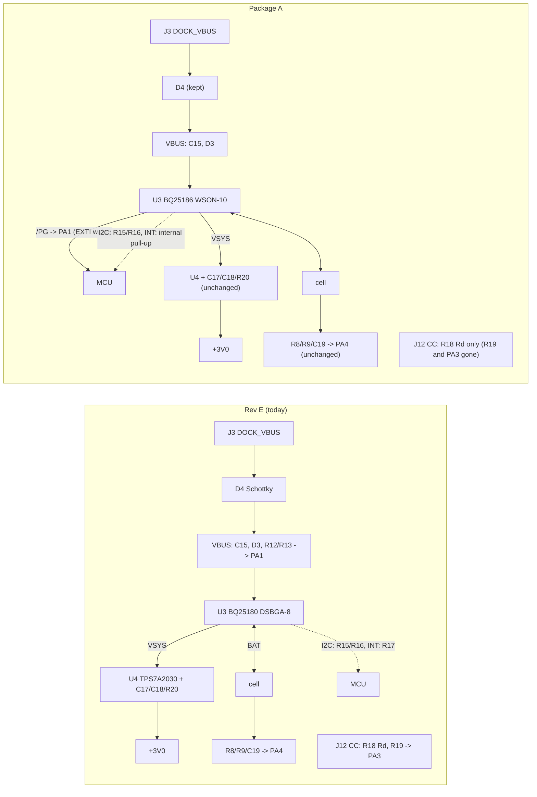

# Power architecture: simplification study (charger, regulator, sensing)

Status: opportunity study, read-only, 2026-10-02 (UTC 04:40-05:10). Nothing in the spec, schematic, board or CAD was changed. Domain: power (U3 charger, U4 LDO, VBAT/VBUS sensing, dock protection, I2C pull-ups).
Scoring rule (spec O19/O20): reliability and size co-equal, then daily convenience, then diagnosability and firmware knobs (O18), then serviceability, then money last.
Authority: `docs/spec.md`. Context read: `docs/system/README.md`, `00-whole.md`, `integration-map.md` §1-§10, `sub-power.md`, `sub-dock-usb.md`, `sub-output.md`, `sub-processing.md`, `sub-ui.md`, `sub-debug-test.md`, `reg-board.md`, `physical.md`, `rail-budget.yaml`, `pin-contract.yaml`, `audit-datasheet-claims.md` (2026-10-02), ECR-0001..0005 and ECR-0013, `docs/research/tws/power.md` and `battery.md`.
`docs/research/tws-power-size.md` (named in the brief) does not exist; the two files in `docs/research/tws/` are its content.

## Verdict, blunt

1. **No single PMIC (power-management IC) beats the two-chip design here.** The rail that matters (3.0 V, quiet, ~330 mA peaks into the bridge) needs an LDO (low-dropout linear regulator) bigger than any PMIC's own: Nordic nPM1300's is 50 mA. So U4 stays whatever you pick, and the PMIC only replaces U3 plus some satellites.
2. **The PMICs that would absorb the sensing parts all fail on package or on D11.**
   - TI BQ25155 / BQ25150 (the ones with an ADC) are 20-ball 0.4 mm chip-scale parts. TI's own BQ21080 sheet says its 8-ball part "does not need HDI" (high-density-interconnect, i.e. microvias); the 20-ball ones do not say it. The project's via rule (0.35/0.15 mm) cannot escape an inner ball at 0.4 mm pitch (derived).
   - nPM1300: JLC stocks only the 35-ball WLCSP (wafer-level chip-scale package, 2.4 x 3.1 mm); the QFN32 5 x 5 is not at JLC. 25 mm² for the QFN is more than the charger plus every satellite it absorbs.
   - nPM1100 has no I2C and a buck. Maxim/ADI MAX77654/MAX77650 are switchers (D11) with 10 and 1 pieces in JLC stock. BQ25120A/BQ25125 have a 300 mA buck (D11).
3. **What does win is smaller:** swap U3 BQ25180 (8-ball 0.4 mm DSBGA, a ball-grid chip-scale package) for **BQ25186** (same I2C register family, address 0x6A, in a leadless WSON-10 with exposed pad). It is a robustness, rework and routing win, not a part-count win. Then cut the satellites it makes redundant.
4. **Package A (recommended, all firmware-adjustable):** BQ25186 + dock detect from the charger's power-good pin (drop R12/R13) + drop CC sense (R19, PA3) + drop the INT pull-up (R17) + drop the J9 pad. Placements 56 -> 52, power-domain parts 22 -> 18, one copper pad fewer, one MCU pin freed (PA3), board face area about -8 mm² (courtyards), Extended types unchanged, about -$0.27 per pod.
5. **Package B (needs owner decisions and a bench sample):** CC moved into the cable (R18, J12), D4 removed, I2C pull-ups to the MCU's own. 52 -> 48 placements, about -24 mm² in total.
6. **(a) Bridge from VBAT/VSYS: not for rev 1.** A P-FET with its source at 3.6-4.5 V cannot be turned off by a 3.0 V GPIO; fixing it costs 4-8 parts. It also raises full-scale peaks to ~0.45 A, above the cell's 350 mA pulse rating.
7. **(b) A bigger LDO is not needed.** TPS7A2030's current limit (360 mA minimum) clears the 322 mA full-scale peak; the D17 ceiling keeps normal peaks near 85 mA. Close ECR-0005 with a firmware cap.
8. **(c) D4 is needed unless reversal cannot swap VBUS and GND.** The maker drawings do not say whether the magnets are polarity-keyed. A symmetric contact order on the existing 5-pin target makes D4 redundant, but only once CC leaves the pod.

## Where the power domain stands today

22 of the 56 placed parts (gen.py Rev E): U3, C15, C16, C21, RT1, R15, R16, R17 (charger) · D4, D3, R12, R13, R18, R19 (dock protection and sensing) · U4, C17, C18, R20 (LDO) · R8, R9, C19 (VBAT sense) · R14 (LED resistor). Plus pads J3-J6, J9, J12.

## Candidate matrix: one PMIC for U3 + U4 + satellites

JLC data from `tools/jlc.py`, 2026-10-02T04:46-04:53Z. Datasheet facts: TI PDFs fetched 2026-10-02 (hashes in Sources); Nordic from docs.nordicsemi.com pages fetched 2026-10-02 (the product-specification PDF itself sits behind a Cloudflare challenge). ADI pages timed out twice (2026-10-02): **ADI rows are unverified, from JLC listings and memory.**

| Part (what it is) | Package, JLC type, stock, price | Charger | Rails it makes | Absorbs | Cannot do | Verdict |
|---|---|---|---|---|---|---|
| **BQ25180** (TI, current U3) | DSBGA-8 1.6 x 1.1; Ext; 4,788; $2.0419 | 1 A, I2C, JEITA, ship | SYS 4.5 V | nothing extra | no PG pin, VINDPM defaults to *disabled* | baseline |
| **BQ25186** (TI, same family, 2024) | WSON-10 2.2 x 2.0 x 0.8 max, EP; Ext; **451**; $1.7818 (C44639442) | 1 A, I2C 0x6A, same register map, JEITA | SYS 4.4-5.5 V | **/PG/GPO pin = dock detect; /CE pin; VINDPM enabled by default** | no ADC | **recommended (PWR-01)** |
| **BQ25185** (TI, standalone) | same WSON-10; Ext; 3,814; $1.7297 (C19725033) | 1 A, resistor-set (ISET, ILIM/VSET), no I2C | SYS 4.5 V | 2 STAT pins; no firmware needed to charge | fixed hot/cold only (hot trip ~60 °C vs the cell's 45 °C limit), no telemetry | option, not for rev 1 (PWR-11) |
| **BQ21080** (TI) | DSBGA-8; Ext; 1,566; $2.1622 | 0.8 A, I2C | SYS 4.4-4.9 V | same as BQ25180 | no ADC | no gain |
| **BQ25155** (TI) | **DSBGA-20 2.0 x 1.6, 0.4 mm**; Ext; **25**; $1.7639 | 0.5 A, I2C | PMID 4.4-4.9 V, 150 mA LS/LDO, 1.8 V 10 mA | 16-bit ADC: VBAT, IBAT, VIN, PMID, TS, one spare input -> R8/R9/C19, R12/R13, PA1/PA2/PA4 | needs CPMID 22 µF (nom), CVDD, CLDO, CINLS and a TS bias resistor; LDO 150 mA | reject |
| **BQ25150** (TI) | same DSBGA-20; Ext; 201; $4.7193 | 0.5 A, I2C | same | same | same | reject |
| **BQ25120A / BQ25125** (TI) | DSBGA-25 2.5 x 2.5 | 0.3 A | **300 mA buck** + 100 mA LDO | - | D11 forbids the buck | reject |
| **nPM1300** (Nordic) | **WLCSP-35 2.4 x 3.1**; Ext; 1,093; $2.6710 (C25346894); QFN32 5 x 5 not at JLC | 32-800 mA, I2C (TWI) | 2 x 200 mA buck, 2 x **50 mA** LDO / 100 mA load switch | 10-bit ADC (VBAT, IBAT, NTC, die temp, VSYS, VBUS); CC1/CC2 (USB-C) detect with internal pull-downs; 3 x 5 mA low-side LED sinks; 5 GPIO; ship 370 nA | LDO 50 mA cannot carry the bridge rail; VBUS operating range 4.0-5.5 V with OVP at 5.5 V (the product page also quotes 22 V protection); WLCSP needs HDI | reject on package and size |
| **nPM1100** (Nordic) | JLC lists evaluation kits only ($41.80) | 20-400 mA | 150 mA buck | - | no I2C found; buck | reject |
| **MAX77654 / MAX77650 / MAX77734** (ADI) | WLP-30 $7.30 / WFBGA-30 $4.95 / none; stock **10 / 1 / 0** | ~300 mA (unverified) | SIMO buck-boost + LDOs (unverified) | - | switching (D11); stock | reject |
| ADP5360, MAX20303, PCA9420, AXP2101, STNS01 (not opened) | WLCSP-32 / BGA-56 / HVQFN-24 (3 pcs) or WLCSP-25 / QFN-40 5 x 5 / DFN-12 3 x 3; stock 12 / 5 / 49 + 3 / 1,341 / 2,931 | various | bucks or <=150 mA LDOs | - | D11, size, stock, or documentation (AXP2101) | reject |

What each candidate would absorb of the brief's list: VBAT sense R8/R9/C19 (ADC parts only), VBUS sense R12/R13 (ADC parts, or any part's power-good flag), CC detection J12/R18/R19/PA3 (nPM1300 only), LED driver replacing R14 (nPM1300 sinks a fixed 5 mA: 7-35 times the 0.14-0.73 mA this LED gets, and it would not remove R14 anyway), ship mode (all), button/wake and R10 (none: KMT0 needs >= 1 mA contact current, a charger's TS/MR pulse is 60 µA), NTC/JEITA (all), watchdog (all).

## Why no PMIC wins (the three numbers)

1. **Rail.** The bridge pulls up to 3.0 V / (8 + 1.22 + 0.1 Ω) = 322 mA from +3V0 (`rail-budget.yaml`: VSYS peak 327 mA). PMIC LDOs: nPM1300 50 mA, BQ25155 150 mA. U4 TPS7A2030 (TI 300 mA ultra-low-noise LDO, X2SON-4 1 x 1 mm, 7 µVrms) stays, with C17, C18, R20.
2. **Size.** The parts an ADC-PMIC could absorb are R8, R9, C19, R12, R13, R18, R19 (13.9 mm² of courtyard, KiCad stock footprints measured with pcbnew 2026-10-02: 0402 R 2.0 mm², 0402 C 1.9 mm²) plus U3 (1.57 mm²): 15.5 mm². nPM1300 is 7.4 mm² (WLCSP body) plus its caps, about 12 mm² in total: near break-even but only with a 35-ball 0.4 mm HDI part. The QFN is 25 mm².
3. **Fragility.** O19 asks for fewer fine-pitch, fragile packages. The 20- and 35-ball chip-scale parts are the most fragile things you could put on a worn, flexed 34 x 13 board, and the hardest for the owner to rework.

## What does win

### BQ25186 in place of BQ25180 (PWR-01)

| | BQ25180 (today, SLUSE99C Rev C) | BQ25186 (SLUSF69A Rev A, Jan 2025) |
|---|---|---|
| Package | DSBGA-8, 0.4 mm balls, no track fits between balls (reg-board) | **WSON-10 DLH0010A**, leadless, 10 pads 0.5 x 0.2 at 0.4 mm pitch + exposed pad 0.9 x 1.5; every pad escapes outward; 2.2 x 2.0 x 0.8 max |
| I2C | 0x6A; STAT0/1, FLAG0, VBAT_CTRL, ICHG_CTRL, CHARGECTRL0/1, IC_CTRL, TMR_ILIM, SHIP_RST, SYS_REG, TS_CONTROL, MASK_ID | **same address and register list**; ICHG_CTRL reset 0x05 (= 10 mA) and code scheme identical (code 44 = 170 mA); watchdog default 160 s register revert |
| Extra pins | - | **/PG/GPO** (open-drain "VIN valid" level; or an I2C-driven output) and **/CE** (low or open = charge enabled; 5 MΩ pull-down inside) |
| VINDPM default | **Disabled** (CHARGECTRL0 reset 0x2C); options 4.2/4.5/4.7 V | **Enabled**: reset 0x24 (figure: 4.5 V; the field table says 2b00 = VBAT + 300 mV: the datasheet disagrees with itself, read it back). Options: VBAT+300 mV, 4.5 V, 4.7 V, disabled. **No 4.2 V option**: ECR-0013's "VINDPM = 4.2 V" becomes "VBAT+300 mV" |
| Thermal | RθJA 107.1 °C/W JEDEC (65 EVM) | **68.3 °C/W** JEDEC, exposed pad soldered to In1. At 0.29 W (CC start, audit claim 7): +20 K instead of +31 K |
| Battery FET | 55 mΩ typ | 115 mΩ typ (36 mV at 315 mA, rail still holds above VBAT ~3.33 V) |
| Quiescent | 3 µA battery-only, 3.2 µA ship, 15 nA shutdown | same figures |
| Input | 25 V abs, OVP 5.7 V typ | 25 V abs, **OVP 18.5 V**; D3 (5 V TVS) is then the only sub-6 V overvoltage guard; SYS stays regulated at 4.5 V |
| Stock / price | 4,788 / $2.0419 | **451** / $1.7818 |

Footprint: EasyEDA's `WSON-10_L2.2-W2.0-P0.40-BL-EP_TI_DLH0010A` exists (generated into the scratchpad 2026-10-02, not added to the repo): courtyard 2.09 x 2.29 = 4.79 mm² vs 1.57 mm² for the DSBGA (+3.2 mm²; body +2.6 mm²). TI's land pattern needs a 0.125 mm stencil and a soldered pad. Height 0.8 mm max fits the 1.2 mm B band (`tools/checks/part_heights.yaml` has no row yet: add it, source TI DLH0010A "WSON - 0.8 mm max height").

Why it matters: three of the seven unrouted nets (ECR-0002 items 1-2, VBUS/VSYS/I2C_SDA at U3) are ball-escape problems that the WSON removes. Rework by hand is possible with hot air; a 0.4 mm DSBGA is not realistic. RθJA improvement partly pays for the cell-heating worry (R23, risk 13).

### Satellite cuts

| Id | Cut | Parts | Condition |
|---|---|---|---|
| PWR-02 | R12/R13 VBUS divider: dock detect from /PG (BQ25186) or from `STAT0.VIN_PGOOD_STAT` (either charger) | -2 | none for the I2C variant |
| PWR-03 | R19 + PA3 CC sense | -1 | none |
| PWR-06 | R17 INT pull-up -> MCU internal | -1 | PB5 strapped to GND (ECR-0013 S1) |
| PWR-08 | J9 NTC pad | -1 pad | none |
| PWR-04 | CC into the cable (R18, J12) | -1, -1 pad | owner builds the cable |
| PWR-05 | D4 removed, D3 moved to J3 | -1 | magnets keyed or PWR-04's contact order |
| PWR-07 | R15/R16 I2C pull-ups -> MCU internal | -2 | I2C <= 100 kHz, bus <= ~23 pF |

## Answers to (a), (b), (c)

### (a) Bridge from VSYS/VBAT instead of 3.0 V

- **Why the P-FET gate drive breaks.** PMCXB290UE (Nexperia 20 V complementary N+P MOSFET pair) has a P threshold of -0.45 to -1.0 V (B-parts-selection §2). With the source on VSYS and the gate at the GPIO's 3.0 V, the P-FET turns off only while VSYS <= 3.0 + 0.45 = 3.45 V (worst case; 3.7 V typical). The cell is above that for most of a discharge, and VSYS is 4.5 V docked: Vgs = -1.2 to -1.5 V, hard on, so the leg shoots through.
- **Fixes, all on the output team's side:** level-shift each P gate to VSYS (2 transistors + 2 resistors; the pull-up needs <= 1 kΩ for the edge speed, i.e. ~2 mA average per leg at 4.2 V, ~4 mA for the bridge, against a 1.0-1.5 mA budget for the whole bridge today), or an all-N bridge with two bootstrap gate drivers, or an integrated class-D amplifier on VBAT (D6 rejects those on dead-time grounds). That is +4 to +8 parts against nothing removed in the power domain.
- **What it would buy:** U4 sees ~12 mA instead of 322 mA peaks, ECR-0005 disappears, U4 stops heating at 4.5 V docked, R20 carries 10 mA. C14 (22 µF X5R) moves to VSYS.
- **What it costs elsewhere:** full-scale peak becomes 4.2 / 9.32 = 0.45 A (0.48 A docked), above the Renata cell's 350 mA 2C pulse rating (rail-budget.yaml already shows VSYS at 93 % of it at 327 mA); gain tracks the battery (firmware must scale duty by the ADC-measured rail, possible); the LDO no longer limits the cell current.
- **Dependency to state:** any proposal from the output domain that runs the bridge or an amplifier from VBAT/VSYS must bring its own gate-drive scheme and the 350 mA ceiling. Without it, this domain keeps the LDO feeding the bridge.

### (b) Is a higher-current LDO needed regardless (ECR-0005)?

No. Numbers: peak 322 mA (8 Ω; 225 mA at 12 Ω) against TPS7A2030's 300 mA rating and **360 mA minimum current limit** (SBVS338H §5.5 via sub-power). The part keeps regulating to 360 mA; above 300 mA only the dropout spec (140 mV max at 300 mA) is out of range, so +3V0 holds only while VBAT >= ~3.33 V at that instant. Normal use at the D17 ceiling (-12 dBFS) peaks near 85 mA. Only a full-scale tone or a firmware bug reaches 322 mA. Close ECR-0005 by: ceiling and self-test cap in firmware (knobs), E1 measuring the exciter (12 Ω removes the case). If she wants hardware margin independent of firmware:

| LDO | Package, JLC | Rating | Noise / PSRR | Iq | Cost |
|---|---|---|---|---|---|
| TPS7A2030 (today) | X2SON-4 1 x 1; 3,286; $0.2176 | 300 mA (limit 360) | 7 µVrms, 75 dB at 100 kHz | 6.5 µA | - |
| LP5912-3.0 (TI 500 mA low-noise LDO) | WSON-6 2 x 2; 84 pcs; $1.4062 | 500 mA | 12 µVrms, 75 dB at 1 kHz | 30 µA | +3 mm²; stock thin |
| RT9080-30GJ5 (Richtek 600 mA) | TSOT-23-5; 3,329; $0.161 | 600 mA | 42 µVrms | 2 µA | +3.4 mm² |
| TLV75530P (TI 500 mA) | X2SON-4 1 x 1; 844; $0.2324 | 500 mA | PSRR 46 dB at 100 kHz, 71.5 µVrms (1.2 V option) | 25 µA | rail noise reaches the mic: no |

Iq only matters in Off (16.5-24 µA budget); for a daily-worn personal pod the 30 µA of LP5912 costs 0.4-1 % of awake runtime, so Iq is a weak argument either way. Recommendation: **keep TPS7A2030**; its COUT range is 1-200 µF (rail already carries ~35-45 µF), CIN is recommended (>= 0.47 µF effective), not needed for stability.

### (c) Is D4 (1N5819WS, the reverse-dock Schottky) needed?

- **What D4 does.** Blocks a reversed 5 V source (U3's IN abs minimum is -0.3 V on both BQ25180 and BQ25186) and isolates the exposed J3 contact from D3. It costs about 0.3-0.4 V at 0.2 A (Schottky, **unmeasured**), which also puts ~0.07 W into the dock path instead of U3 at 170 mA.
- **Maker drawings (YZT0675-20048-05025-01 and YZP0048-20048-04025-03, both rev A.1 2022-03-24; LCSC PDFs fetched by an earlier session 2026-09-30, redrawn and read 2026-10-02):** two NdFeB magnets at the ends of a symmetric stadium outline, pins at 2.5 mm pitch, a bottom tab, **no N/S orientation anywhere**. The unlabelled end marks and the pin-1 line are not keying. Keying is therefore **unverified**: rotate the head 180° on the sample (5 minutes: if it refuses to mate, it is keyed).
- **Decision table.**

| Magnets keyed? | Contact order symmetric under a 180° turn? | D4 |
|---|---|---|
| yes | - | not needed |
| no | yes (VBUS on pin 3, GND on 2 and 4, D+/D- on 1 and 5; needs CC out of the pod, PWR-04) | not needed; a reversed mate only swaps D+/D- (no enumeration, no damage) |
| no | no (4-pin set, or CC on pin 4) | **keep D4**, or an AW32001-class charger with -5 V input tolerance (rejected: WLCSP) |

- **Recommendation:** keep D4 for rev 1 unless the sample is keyed *and* she accepts +0.07 W in U3 (0.29 W -> 0.35 W at CC start; with BQ25186 that is +24 K, still better than today's +31 K). The saving is one part and 6.55 mm².

## Opportunity list (quantified; full cross-check in the structured output)

Areas are courtyards (KiCad stock 0402 2.0/1.9 mm², SOD-323 6.55 mm², J pad ~3.5 mm² from reg-board's 2.1 mm ring; U3 swap from the footprints). Prices JLC 2026-10-02 or `bom.md`. All delta pod volume = 0 mm³ (no height change); the area figures feed the O20 re-size.

| Id | Change | Placements | Pads | Area mm² | $/pod | Confidence |
|---|---|---|---|---|---|---|
| PWR-01 | U3 BQ25180 -> BQ25186 (WSON-10, /PG, /CE, VINDPM on) | 0 | 0 | +3.2 | -0.26 | medium |
| PWR-02 | dock detect from /PG or STAT0; drop R12/R13 | -2 | 0 | -4.0 | -0.006 | medium |
| PWR-03 | drop R19 and PA3 CC sense (Rd R18 stays) | -1 | 0 | -2.0 | -0.003 | high |
| PWR-04 | CC and Rd into the cable; drop R18, J12; GND on pins 2+4 | -1 | -1 | -5.5 | -0.003 | low |
| PWR-05 | drop D4; D3 onto J3 | -1 | 0 | -6.55 | -0.014 | low |
| PWR-06 | drop R17: INT on the MCU pull-up | -1 | 0 | -2.0 | -0.003 | medium |
| PWR-07 | drop R15/R16: I2C on MCU pull-ups, <= 100 kHz | -2 | 0 | -4.0 | -0.006 | low |
| PWR-08 | delete the J9 NTC pad | 0 | -1 | -3.5 | 0 | medium |
| PWR-09 | C17 absorbed by C21 (U4 within ~3 mm of U3) | -1 | 0 | -1.9 | -0.012 | low |
| PWR-10 | R9 bottom to PB1 (switched divider) | 0 | 0 | 0 | 0 | low |
| PWR-11 | BQ25185 standalone, no I2C | -1 | 0 | -2.0 | -0.31 | low |
| PWR-12 | close ECR-0005 in firmware, keep U4 | 0 | 0 | 0 | 0 | high |

**Package A** = PWR-01, 02, 03, 06, 08: -4 placements, -1 pad, -8.3 mm² (1.9 % of one 442 mm² face), PA3 freed, about -$0.27 per pod, zero Extended-type change. **Package B** adds 04, 05, 07: -8 placements in total (56 -> 48), -2 pads, about -24 mm². PWR-09 to 11 stay separate.

## Cross-check highlights (every opportunity has its own full row in the structured output)

- **Pins (pin-contract.yaml).** PA1: VBUS_SENSE (ADC) becomes PG (GPIO input + EXTI1, internal pull-up, wake from Stop 2). PA3: CC_SENSE removed, pin freed (also USART2_RX in the ROM bootloader, so one DFU worry goes away). PA15 stays INT. PB1 only for PWR-10. No pin gets two jobs. Free pins after Package A: PC13, PH0, PH1, PB1, PB15, PB5, PB6, PB8 + **PA3**; O18 wants the freed pins on pads.
- **Rails.** No change to +3V0 loads. VBUS -25 µA while docked (R12/R13). VSYS unchanged. U3 heat: Package A better than today (RθJA 68.3 vs 107.1 K/W); with D4 removed, 0.35 W instead of 0.29 W at CC start but still +24 K versus +31 K today.
- **Off-board.** Package A: J9 gone (one wire never needed). Package B: J12 gone, dock wires 5 -> 4 (under-cell channel 0.8 mm and the ~190 mm³ slack volume get 1/12 less crowded). Cell wiring (J5/J6) unchanged.
- **Mechanical.** All parts stay on B in the 0.65-1.0 mm range (WSON 0.8 max); no keep-out touched; U3 stays 0.2 mm over the pouch (cross-domain risk 13).
- **Firmware.** Charger driver unchanged in structure (same registers); new: read PG on PA1 with EXTI, VINDPM choice ("VBAT+300 mV"), /CE tied low, optional ILIM policy (100 mA until enumeration), I2C speed knob (PWR-07). `VBUS_SENSE`/`CC_SENSE` ADC code and the CC-advert ILIM rule go away.
- **Relations (plm.py impact 2026-10-02).** R-PWR-BOARD, R-PWR-DOCK, R-PWR-PROC, R-PROC-DOCK, R-DOCK-BOARD, R-DOCK-BODY, R-COST-BOARD, R-SPEC-POWER (U3 is named in O16(2) as BQ25180: owner decision).
- **ECRs.** Builds on ECR-0013 (register plan; VINDPM 4.2 V becomes VBAT+300 mV) and ECR-0005 (closed by PWR-12). ECR-0002 items 1-2 (swap C15/C16, pull-ups beside U3) become moot with PWR-01. ECR-0003 is independent.

## Diagnosability (O18) in one table

| Today | What changes | What replaces it |
|---|---|---|
| VBUS voltage on PA1 | PWR-02 removes it | /PG level, STAT0 VIN_PGOOD, STAT1 VIN_OVP, VINDPM_ACTIVE, the J3 pad |
| CC level on PA3 | PWR-03 removes it | PG implies the source saw Rd; J12 pad |
| Charger registers | kept (BQ25186) | gained: /PG as a hardware level when I2C is dead; /CE as a hardware charge inhibit |
| TS analog on PA2 | kept | - |
| VBAT on PA4 | kept | - |
| Charger thermal headroom | better | RθJA 68.3 vs 107.1 |

An ADC-charger (BQ25155/BQ25150/nPM1300) would add IBAT (charge current), VSYS and die temperature: a real telemetry gain, purchased with the fragile package and extra passives. If she values O18 above everything, nPM1300 is the telemetry champion; this study does not recommend it.

## Rejected ideas (short; reasons are in the structured output)

Single PMIC (nPM1300, nPM1100, BQ25155/50, BQ25120A/25125, MAX77654/50/734, ADP5360, MAX20303, PCA9420, AXP2101, STNS01) · bridge from VBAT/VSYS in rev 1 · bigger LDO · drop RT1/J9 altogether (TI wants a 10 kΩ on TS when unused; hardware JEITA backstop for R23) · switching charger (D11; adds an inductor) · SW1 on TS/MR · pad LED on /PG/GPO · R20 as a cut-link · second LDO for the bridge · AW32001E (reverse-tolerant but WLCSP 0.5 mm 3 x 3 with a centre ball; datasheet watermarked confidential) · no-power-path charger · remove U4.

## Unverified / could not open

- **ADI MAX77654 / MAX77650 / MAX77734, ADP5360, MAX20303:** analog.com fetch timed out twice and the LCSC copy says "datasheet temporarily unavailable" (2026-10-02). Rows rely on JLC listings (stock) and memory.
- **STNS01, AXP2101, PCA9420:** datasheets not opened; JLC listings only.
- **nPM1300 absolute-maximum VBUS, LDO noise/PSRR, reference circuit (cap list):** the product-specification PDF is behind a Cloudflare challenge; only the HTML pages for key features, VBUSIN, ADC and pins were read. The passives count for nPM1300 is an estimate.
- **BQ25186 VINDPM reset value:** figure says 4.5 V, table says VBAT+300 mV. **Read it back on board 1.**
- **D4 forward drop at 0.2 A and magnet keying:** unmeasured.
- **Web search:** the session's search quota was exhausted (200/200); everything comes from direct fetches.

## Sources (URL, access date, SHA-256 prefix of the PDF used)

- TI BQ25186 SLUSF69A Rev A (Jan 2025): https://www.ti.com/lit/ds/symlink/bq25186.pdf, 2026-10-02, 96834a4566939677
- TI BQ25185 SLUSF65B (Oct 2023, revised Aug 2026): https://www.ti.com/lit/ds/symlink/bq25185.pdf, 2026-10-02, c73ed7d63e6532bb
- TI BQ25180 SLUSE99C Rev C: https://www.ti.com/lit/ds/symlink/bq25180.pdf, 2026-10-02, c2008f613723fec3 (same hash as `audit-datasheet-claims.md`)
- TI BQ25155 SLUSDO1B Rev B (Aug 2023): .../bq25155.pdf, 7af54e3a7e3a4537; BQ25150 SLUSD04C: .../bq25150.pdf, 4f56560384a9c581; bq25120A SLUSD08A: .../bq25120a.pdf, 0726c6421eabd7bd; BQ21080 SLUSF49 (Jan 2023): earlier-session local copy
- TI TPS7A20 SBVS338H: .../tps7a20.pdf, 663a9ff5bca60864; LP5912 SNVSA77D (Nov 2016): .../lp5912.pdf, de84246f830e2a08; TLV755P: .../tlv755p.pdf, 7eb7bc6935bf6c1d
- Nordic nPM1300 key features, VBUSIN, ADC, pin pages: http://docs.nordicsemi.com/r/bundle/ps_npm1300/page/keyfeatures_html5.html and the linked chapters, 2026-10-02; product pages https://www.nordicsemi.com/Products/nPM1300 and /nPM1100, 2026-10-02
- Awinic AW32001E V1.2 (Mar 2022), earlier-session local copy `scratchpad/chg/aw32001.txt`
- Xinyangze YZT0675-20048-05025-01 / YZP0048-20048-04025-03 drawings A.1 2022-03-24 and spec sheet A.0 2022-08-08: LCSC PDFs, earlier-session copies, read 2026-10-02
- ST DS13737 Rev 10: RPU 30/40/50 kΩ (`ultrasonic-scratch/ds/u575.txt`)
- JLC parts API (`tools/jlc.py`) 2026-10-02T04:46Z-04:56Z for every stock and price quoted
- Repo: `docs/system/audit-datasheet-claims.md` (2026-10-02), `rail-budget.yaml`, `pin-contract.yaml`, ECR-0005, ECR-0013, `tools/checks/part_heights.yaml`

## Reproduce

`source tools/env.sh; python3 tools/jlc.py BQ25186 BQ25185 BQ25180 nPM1300 -n 3`; `python3 tools/plm.py impact ref:U3` (and `net:VBUS_SENSE`, `net:CC_SENSE`, `ref:D4`); courtyards: `pcbnew.FootprintLoad(lib, name).GetCourtyard(pcbnew.F_CrtYd).BBox()` (3 GB fence); EasyEDA footprint: `easyeda2kicad --lcsc_id=C44639442 --footprint` into the scratchpad.
