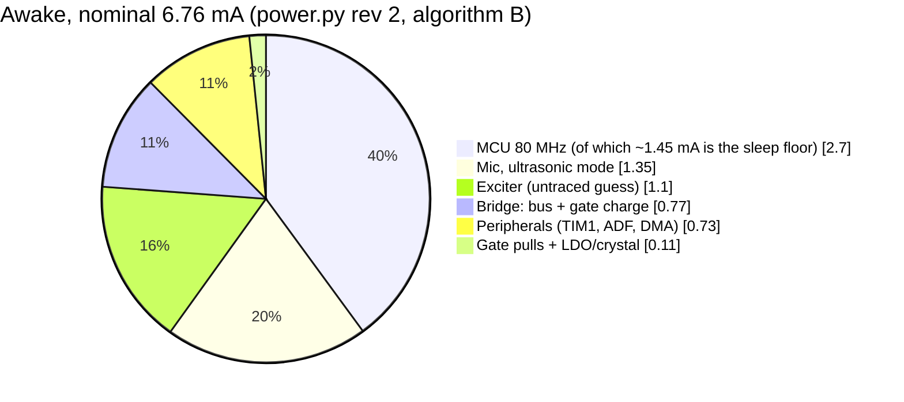
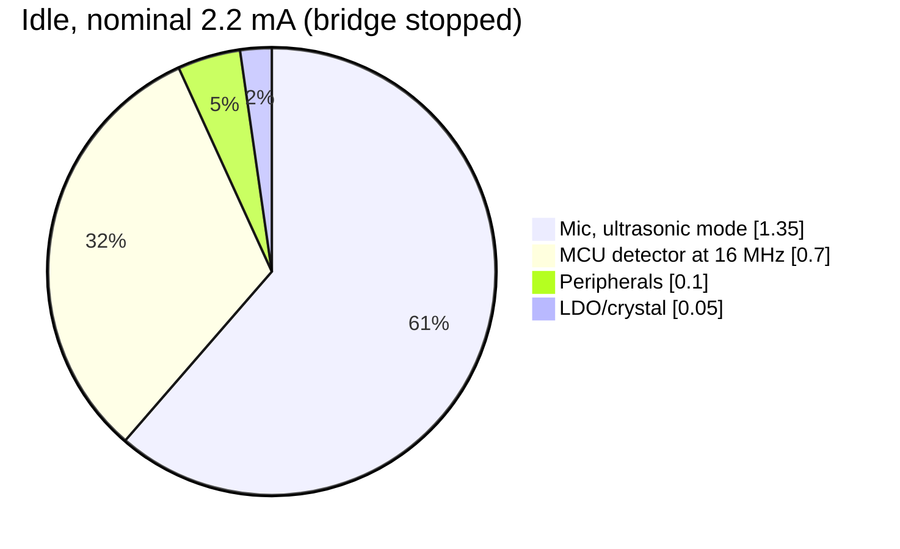

# Power architecture: how earbuds, bone-conduction headsets and hearing aids reach 5–12 h, and what transfers to us

Research note, 2026-10-01. Read-only research run: nothing in the spec, schematic, firmware or CAD changed.
All web sources were accessed **2026-10-01**. Anything I could not open is labelled **unverified**.
Cell choice and form factors are covered by the sibling note `docs/research/tws/battery.md`; this note covers *current draw*.

Baseline throughout: `sim/checks/power.py` rev 2 (spec §7 v0.14). Today's cell is the Renata 175 mAh (O16).
Scratch calculation: `/tmp/claude-1000/.../scratchpad/tws/calc.py`. It is a throwaway, not a repo check; promote it to `sim/checks/` if any of this is adopted.

---

## Bottom line (blunt)

1. **We are already in the same class as earbuds, per milliamp.**

   | Device | Average draw |
   |---|---|
   | AirPods Pro 2 | ~8.3 mA |
   | AirPods Pro 3 (ANC) | ~7.3 mA |
   | AirPods Pro 3 in *hearing-aid mode* | **~5.8 mA (~22 mW)** |
   | Nothing Ear (open) (the owner's own earbuds) | ~8.0 mA |
   | Research hearing aid, 22 nm custom chip, wireless off | ~31 mW (~8 mA) |
   | **Ours, chain awake** | **6.8 mA nominal (5.0–9.8) ≈ 25 mW** |
   | **Ours, idle** | **2.2 mA ≈ 8 mW** |

   Earbud cells are small because buyers accept 6–8 h plus a case. **We need 12 h with no case**, so we would need ~2× an earbud cell even with earbud electronics.

2. **The 175 mAh cell already meets the 12 h target, even awake all the time at the pessimistic end (13.4 h).**
   - So power work does not rescue the runtime. It buys **cell size, or headroom for longevity charging** (battery.md recommends charging to 4.10–4.15 V).
   - **Exchange rate:** 1 mA of average current over 12 h costs **14 mAh**. In the Renata cell that is **~2.8 mm of length** or **~0.34 g**.

3. **Real hearing aids draw ~10× less (~2–3 mW), and we cannot close that gap with parts.**
   - The gap is structural: 1.2–1.4 V supply, audio-band sample rates, custom chips, and receivers sealed in the ear canal.
   - Our mic alone, in ultrasonic mode, costs ~4 mW (1.35 mA × 3.0 V). That is more than a whole zinc-air hearing aid's test load.
   - **Ultrasound has a power tax, and the mic pays most of it.**

4. **Most of the earbud and hearing-aid tricks are already in our design:**
   - hardware PDM decimation (the ADF);
   - core switcher with linear rails (D11);
   - early decimation in the DSP (§5.2);
   - idle detection with look-back (C9);
   - stopping the output stage when quiet.

   What is left, in order of value:
   - **Measure E2/E4 first.** The exciter line (0.4–2.5 mA) is a guess, and physics says it is probably smaller (§3.7).
   - **Run the idle detector in Stop 2** (firmware only): about **−0.45 mA idle**.
   - **Lower the MCU clock floor** for algorithm A (Range 3, ≤55 MHz): about **−0.5 to −0.9 mA awake**. This costs PWM resolution, and B cannot use it.
   - **Mic:** a 1.8 V mic rail, or the T5838 mic. About **−0.3 to −0.5 mA, always on**. This costs a part plus level shifting, or part of the band.

5. **Do not copy these:**
   - **A buck converter for the 3.0 V rail.** In forced-PWM (the whine-safe mode) the TPS62840 draws **3 mA with no load**. That is a net loss at our 6.8 mA.
   - **An integrated class-D amplifier.** Its idle current is 1.5–2.3 mA; our discrete bridge draws 0.77 mA.
   - **Duty-cycling the mic.** It takes ≤50 ms to power up; bat calls last 2–20 ms.
   - **A charging case.** The glasses are never off-head during the day.

6. **Was this research run worth it, against a doc from memory?** Partly.
   - A memory doc would have got the list of techniques right.
   - It would have got the numbers wrong or unsourced. In particular, it would not have caught that:
     - the 3 mA forced-PWM penalty kills the buck idea outright;
     - the U575's **80 MHz sleep floor (~1.45 mA)** is larger than all the DSP work;
     - the exciter line can be bounded from physics.
   - The vendor TWS chip currents (Bestechnic, Airoha, Qualcomm, Realtek) are **not public**: their pages 404 or need an NDA. So a memory doc would have been guessing exactly there.

---

## Glossary of part numbers used here

| Part | What it is |
|---|---|
| **SPH0641LU4H-1** | Knowles (now Syntiant) PDM MEMS microphone with an ultrasonic mode. Our mic, U2 |
| **T5838** | TDK InvenSense PDM MEMS microphone: multi-mode, with on-chip acoustic activity detect (AAD). Repo backup mic (A1-A2 note) |
| **STM32U575CIU6Q** | ST Cortex-M33 MCU, 160 MHz max, internal core switcher (SMPS). Our MCU, U1 (D5) |
| **ADF / MDF** | The U575's audio digital filter / multi-function digital filter: hardware decimators that turn a PDM bitstream into PCM samples |
| **FMAC / CORDIC** | The U575's filter-math accelerator (FIR/IIR multiply-accumulate engine) and trigonometry coprocessor |
| **BQ25180** | TI linear single-cell Li-ion charger with power path. U3 |
| **TPS7A2030** | TI 3.0 V, 300 mA, low-noise LDO. U4 |
| **TPS62840** | TI 750 mA buck converter with 60 nA quiescent current. Reference point only, not in our design |
| **TPA2011D1** | TI 3.2 W mono filter-free class-D audio amplifier, 1.21 × 1.16 mm. Reference point |
| **MAX98357A** | Analog Devices (Maxim) I²S-input class-D amplifier. Reference point; datasheet **not opened** (server timeouts) |
| **RC-BC02** | Small bone-conduction exciter module, 8–12 Ω. Our transducer (D7) |
| **Radioear B71 / B81** | Audiometric bone vibrators. The B81 uses the BEST principle |
| **BEST** | Balanced electromagnetic separation transducer: a bone vibrator design whose static magnetic forces cancel |
| **Apollo4 Plus (AMAP42KP-KBR)** | Ambiq Cortex-M4F MCU, built on subthreshold-voltage circuits. Alternative-MCU reference |
| **Apple H2** | Apple's headphone chip in the AirPods Pro 2 and 3 |
| **QCC5171 / AB15xx / BES2xxx / RTL87xx** | TWS Bluetooth audio chips from Qualcomm, Airoha, Bestechnic and Realtek. **No public current figures found** |
| **Ezairo 7100 / 8300** | onsemi hearing-aid DSP chips. Datasheet download refused (HTTP 403): **not opened** |
| **Renata ICP501233PA-02** | Our cell: 3.7 V Li-ion polymer pack, 175 mAh, protection built in, ≤5.3 × 12 × 35 mm |
| **Zinc-air 312** | Hearing-aid button cell, 7.9 × 3.6 mm, 1.4 V |

---

## 1. What real devices draw

Average current = rated capacity ÷ rated runtime. This slightly *overstates* the draw, because rated runtimes run to a full discharge.

| Device | Cell | Rated runtime | Average draw | Source (accessed 2026-10-01) |
|---|---|---|---|---|
| AirPods Pro 2 (Apple H2) | 49.7 mAh, 0.182 Wh per bud | 6 h listening | **8.3 mA / 30 mW** | Apple tech specs [S1]; capacity from Wikipedia's spec table [S3] (secondary) |
| AirPods Pro 3 (Apple H2), ANC on | 58 mAh, 0.221 Wh per bud | 8 h | **7.3 mA / 28 mW** | Apple specs [S2]; [S3] |
| AirPods Pro 3, *Hearing Aid feature in Transparency* | same | **10 h** | **5.8 mA / 22 mW** | [S2]; [S3] |
| Nothing Ear (open), open-ear, BT 5.3 | 64 mAh per bud | 8 h playback, 6 h talk | **8.0 mA** playback, 10.7 mA talk (~30 mW at an assumed 3.8 V) | Nothing product page [S4] |
| Shokz OpenRun / OpenRun Pro 2 / OpenMove (bone conduction) | **not published** | 8 h / 12 h / 6 h | unknown (**unverified**) | Shokz product pages [S5] |
| Shokz OpenFit / OpenFit Air (open-ear air conduction) | not published | 7 h / 6 h (28 h with case) | unknown | [S5] |
| Research behind-the-ear hearing aid, 5 g, custom 22 nm chip | rechargeable, capacity not given | 9 h (wireless off), 6 h (on) | **31 mW** / 47 mW | Karrenbauer et al. 2023 [S8] |
| SmartHeaP hearing-aid chip alone (binaural beamformer) | – | – | **1.45 mW at 5 MHz** | Karrenbauer et al. 2025 [S9] |
| Zinc-air 312 hearing-aid cell (standard test load) | 181 mAh to 1.05 V, 1.4 V nominal, 0.5 g | IEC test 2 mA base + 10 mA pulses; "streaming" test 5 mA (15 min) / 2 mA (45 min) | **~2 mA at 1.2–1.4 V ≈ 2.4–2.8 mW** | Energizer 312 datasheet [S6] |
| **Ours, chain awake** (algorithm B) | 175 mAh | – | **6.8 mA nominal (5.0–9.8) ≈ 25 mW** | `power.py` rev 2 |
| **Ours, idle** | – | – | **2.2 mA (1.7–3.4) ≈ 8 mW** | `power.py` rev 2 |

**Reading the table:**
- The AirPods Pro 3 hearing-aid mode is the closest product to ours: mic → DSP → speaker, all day. It runs at ~22 mW with a custom chip *and* a Bluetooth link held up. **We are at ~25 mW with a general-purpose MCU.** That is not bad.
- The research hearing aid makes the point most clearly. Its chip is **1.45 mW**, yet the device draws **31 mW**: the rest goes to mics, converters, the receiver driver and regulators. A custom chip alone does not make a low-power device.
- Commercial hearing aids are ~10× lower again. They have:
  - one supply at 1.2–1.4 V, so there's no LDO loss from 3.7 V;
  - 16–32 kHz audio sampling, where we sample at 200 kS/s;
  - custom chips with filterbank coprocessors;
  - a receiver sealed in the ear canal that needs microwatts.

  We can't copy any of those four with parts we can buy.

---

## 2. Where our milliamps go, and what saving them is worth

**Exchange rates** (derived; inputs in brackets):

| Saving | Equals |
|---|---|
| 1 mA average for 12 h | **14.1 mAh** (at 85 % usable, `power.py`) |
| 14.1 mAh in the Renata cell | **~2.8 mm of cell length** (175 mAh / 35 mm = 5 mAh/mm), or **~0.34 g** (4.2 g / 175 mAh) |
| 1 M cycles/s of CPU work at 80 MHz | **~23 µA** ((3.3 mA run − 1.45 mA sleep) / 80 MHz, DS13737 Rev 8 Tables 39/46 via `A3-u575-plan.md` §5) |
| Clock running at 80 MHz, CPU asleep | **~1.45 mA** floor (Range 2, SMPS; interpolated in A3 §5 `[Med]`) |
| Each 10 pF on the mic data line | **0.06 mA** (ΔI = 0.5·V·ΔC·f at 3.0 V, 4 MHz; SPH0641 datasheet note 2) |
| Each 3 dB of output level | **half (or double) the exciter's power** |

**Small cells lose density** (repo datasheets; size from the cell name, T × W × L mm):

| Cell | Capacity | Density |
|---|---|---|
| 301120 | 40 mAh | 224 Wh/L |
| 401525 | 110 mAh | 271 Wh/L |
| LP401230 | 105 mAh | 270 Wh/L |
| Renata ICP501233 (max envelope incl. protection) | 175 mAh | 291 Wh/L |

So halving the current saves a bit *less* than half the volume.

---

## 3. Technique by technique, mapped onto our budget

Savings are nominal figures, in average battery current. "Awake" means the full chain is running; "idle" means only the detector is running.

| # | Technique | What the earbuds and hearing aids show | Our line | Realistic saving | Cost | Verdict |
|---|---|---|---|---|---|---|
| 3.1 | Dedicated low-power DSP / custom chip | Hearing-aid chip 1.45 mW at 5 MHz [S9]; device still 31 mW [S8] | MCU 2.7 mA | Only with a different MCU (3.10) | – | Not available as a part for rev 1 |
| 3.2 | Hardware PDM decimation | Every TWS chip has it | Peripherals | **Already banked:** ADF ~40 µA against MDF ~0.28 mA at 80 MHz (A3 §5), plus the CPU decimation it replaces | – | Done (A3 plan) |
| 3.3 | Hardware filter accelerator | Filterbank coprocessors in hearing aids (Ezairo: **unverified**, not opened) | MCU | FMAC costs 0.92 µA/MHz (~74 µA at 80 MHz; DS13737 Table 72). Moving 10 M cycles/s of FIR saves ~0.23 mA of CPU, so **net ~0.1–0.15 mA** | Firmware; fixed-point filters | Minor. Only worth it if B is CPU-tight |
| 3.4 | Voltage / frequency scaling | Hearing-aid chip at 5 MHz [S9] | MCU sleep floor | **−0.5 to −0.9 mA awake**: 48–55 MHz in Range 3 (run 2.2 mA, sleep 0.92 mA at 55 MHz) against 80 MHz in Range 2 (3.3 / 1.45 mA) | TIM1 is clocked from the bus, so the PWM steps shrink from 200 to ~120–137 (≈ −3.3 to −4.4 dB step resolution). D14's HCLK/400 lock must change. **Algorithm A only:** B needs 44–65 M cycles/s | Worth evaluating once A or B is chosen (S-phase) |
| 3.5 | Power gating / Stop modes in idle | Always-on low-power islands in TWS chips | Idle MCU 0.7 mA | **−0.45 mA idle** (MCU 0.7 → ~0.25 mA): Stop 2 + ADF + LPDMA into SRAM4, CPU wakes for each FFT snapshot (A3 §1.3: ~0.1 mA + 3.4 M cycles/s × ~45 µA/MHz) | Firmware. Open question: the ADF must run from MSIK in Stop 2, so the mic clock source changes on idle↔awake (A3 §1.3, S3) | **Do it.** Firmware only |
| 3.6 | Mic low-power modes, VAD/AAD wake | TWS wake on voice using the mic's own detector: T5838 AAD 20 µA, sleep 9 µA | Mic 1.35 mA (both states) | **None from modes.** SPH0641: low-power 235 µA at 768 kHz and standard 620 µA at 2.4 MHz have no ultrasonic band. T5838's AAD is a *low-pass* detector, so it can't wake on ultrasound. Power-up takes ≤50 ms and a mode change ≤10 ms, against calls of 2–20 ms | – | Not usable |
| 3.6b | Mic at lower voltage / different mic | Hearing aids run the whole chain at 1.2–1.4 V | Mic 1.35 mA | **−0.3 to −0.5 mA, always on** `[Low]`. Datasheet points: SPH0641 845 µA (1.8 V, 3.072 MHz); T5838 500 µA (1.8 V, 4.8 MHz). Ours re-derives to 1.35 mA at 3.0 V / 4 MHz | 1.8 V rail: a second 1 × 1 mm LDO plus a 2-bit level translator for clock and data. T5838: its response is published only to **50 kHz** (A1-A2 note), so part of the 20–85 kHz band is lost | Option B. Decide on the band (D13) first |
| 3.6c | Lower the PDM clock / data-line capacitance | – | Mic | 3.072 MHz instead of 4 MHz: ~0.1–0.3 mA (**unverified scaling**). Each 10 pF trimmed: 0.06 mA | 3.072 MHz breaks the HCLK/20 → /400 integer chain (decimation 15.4) | Keep the data trace short; don't change the clock |
| 3.7 | Output-stage efficiency / transducer drive | BEST transducer: +10–20 dB sensitivity at 0.1–1 kHz and **+2–10 dB at 1–10 kHz** over the B71 [S10]. B81 (BEST) more efficient at mid frequencies [S11]. Gaps in transducer coupling are "devastating for power consumption" [S12]. Force on the skin: ≤ ±2 dB over 2–5.4 N (`bone-conduction.md` §4) | Exciter 1.1 mA (guess) | **Physics bound** (lossless bridge, 3.0 V bus, 9.3 Ω loop): a −20 dBFS sine draws **1.4–1.6 mA** *while it plays*; −30 dBFS draws **0.14–0.16 mA**; −40 dBFS draws 0.014 mA. The 1.1 mA guess equals ≈ −21 dBFS playing *continuously*. With calls present 30–60 % of awake time at −30 to −20 dBFS: **~0.05–0.9 mA** | A measurement, not a design change: E2 (level needed at the tragus) and E4 (current) | **Highest-value unknown.** Run E2/E4 before cutting anything else |
| 3.8 | Class-D vs class-G/H amplifiers | Integrated class-D idle current: TPA2011D1 **1.5 mA typ / 2.3 max** at 3.6 V [S14]. MAX98357A **unverified** (not opened) | Bridge 0.77 mA | Our discrete bridge (0.49 mA bus + 0.28 mA gate, repo SPICE) **already beats integrated parts**. Dead time 12.5 → 25 ns: bus 0.49 → 0.10–0.20 mA (**−0.3 mA**), but distortion rises (C3 §5). Class-H (supply tracking) would fight AD's ripple-based linearity at 3.0 V | Distortion / complexity | Keep the discrete bridge. The dead-time trade is a C3/E-bench decision |
| 3.9 | Duty cycling and idle detection | Earbuds: in-ear detection, auto-pause. Hearing aids: no mic duty cycling | Whole chain | Already the main lever (C9): at 18 % awake, idle saves ~4.6 mA × 82 % of the time. **Stopping the bridge in squelch while awake:** 0.77 mA × the squelched fraction | Firmware, plus a pop-free restart (D17) | Done / planned. Add squelch-stops-bridge if not already in S3 |
| 3.9b | Wear detection (sleep when the glasses are off) | Earbuds use IR proximity or an accelerometer | Whole chain | Saves only off-head hours. **Untested idea:** the exciter's electrical impedance may change with and without skin load, readable on I_SENSE for free `[Low]` | Firmware, or an accelerometer | Nice to have, not a size lever |
| 3.10 | Ultra-low-power MCU | Ambiq Apollo4 Plus: **4 µA/MHz** from MRAM, 192 MHz, **1.71–2.2 V**, 146-pin 5 × 5 mm BGA [S16] | MCU 2.7 mA awake, 0.7 idle | Roughly **−2 mA awake** (about 10× better per MHz than the U575's ~41 µA/MHz), `[Low]` | Full firmware port. Needs a 1.8 V rail. BGA needs fine-pitch board vias. **Unverified:** a 4 MHz ultrasonic PDM input, and a timer with dead time for the 200 kHz bridge. JLC stock not checked | v2 candidate only |
| 3.11 | Buck vs LDO for the 3.0 V rail | TWS chips integrate bucks for ~1 V cores; we already do the same with the U575 SMPS (D11) | All +3V0 loads | An ideal 88 % buck saves 19 % at 4.2 V, 8 % at 3.7 V and 0 % at 3.4 V, **~9 % on average** (D11 says ~10 %: confirmed). But **forced-PWM TPS62840 draws 3 mA with no load** [S13]. Power-save mode is 60 nA but bursts at a load-dependent rate, the whine D11 forbids | Whine risk, plus an inductor | **Keep the LDO.** D11 stands, now with a number |
| 3.12 | Charging-case strategy | Case holds 6–10 buds' worth: AirPods Pro 2 case 523 mAh against 2 × 49.7; Pro 3 344.5 against 2 × 58 [S3]; Nothing 635 against 64 [S4]. "5 minutes in the case → ~1 h" [S1, S2] | Cell size | Only if she takes the glasses off. **(a) Midday pod swap:** the pod already slides off the frame adapter's dovetail rail (§8 v0.14), so a spare pair (O19) halves the needed capacity. **(b) Midday top-up:** 15 min at 170 mA ≈ 42 mAh (constant-current phase), enough for ~6 h idle-heavy | A daily chore; a second charged pair | Owner's call; not a design need at 175 mAh |

---

## 4. Options (owner decides)

Capacity needed for 12 h (nominal .. pessimistic), from the scratch calculation:

| Package | Awake / idle (nominal) | 12 h at 18 % awake | 12 h always awake | 175 mAh lasts, always awake |
|---|---|---|---|---|
| Baseline (power.py rev 2) | 6.76 / 2.20 mA | 43 .. 73 mAh | 95 .. 157 mAh | 22.0 .. 13.4 h |
| **A: firmware only** (3.5 Stop-2 idle; exciter re-based by E2/E4, assumed 0.05/0.3/0.9 mA) | 5.96 / 1.72 | 35 .. 59 | 84 .. 131 | 25.0 .. 16.0 h |
| **B: A + algorithm A at 48 MHz Range 3 (3.4) + mic −0.4 mA (3.6b)** | 4.18 / 1.32 | 26 .. 44 | 59 .. 95 | 35.6 .. 22.1 h |
| C: Stop-2 idle + mic −0.4 mA + Ambiq-class MCU (3.10, unverified; exciter *not* re-based, algorithm B) | 3.93 / 1.17 | 24 .. 43 | 55 .. 106 | 37.8 .. 19.8 h |

- **A (recommended now):** no hardware change.
  - Run E2/E4, set the exciter line from real numbers, and move the idle detector into Stop 2.
  - Keep the 175 mAh cell. Spend the margin on battery.md's 4.10–4.15 V longevity charge, or on bad days (cold, aged cell).
- **B (decide after E4 and the A-vs-B listening choice):**
  - Pessimistic always-awake falls to ~95 mAh, so a ~105–120 mAh cell would do.
  - That's **~11–14 mm shorter or ~1.3–1.7 g lighter** at the exchange rate in §2.
  - Costs: a 1.8 V mic rail or a narrower-band mic, coarser PWM steps, and algorithm A only.
- **C (park):** worthwhile only if a v2 wants a much smaller cell. It's a new MCU, a new toolchain, a BGA package, and unverified ultrasonic capability.

**Recommendation: A now, B as a v2 decision after E4.** At 175 mAh, rev 1 needs no hardware change for power.

---

## 5. What does not transfer, and why

- **Bluetooth duty-cycling and radio tricks:** we have no radio (D2).
- **Audio-rate processing:** hearing aids run at 16–32 kHz. Our input must run at ≥200 kS/s, and §5.2 already decimates to 12.5 kS/s as early as the algorithms allow.
- **Receivers in the ear canal:** a sealed balanced-armature receiver needs microwatts. A skin-coupled exciter needs milliwatts.
  - Placement (tragus, D1) and transducer type (BEST-class: +2–10 dB at 1–10 kHz [S10]) are the levers here. Every 3 dB halves the power.
- **The case as the main battery:** prescription glasses stay on the face. The dock is our case.
- **A single 1.2 V supply:** no off-the-shelf ultrasonic mic or 80 MHz MCU we could use runs at 1.2 V.

---

## 6. Could not verify (labelled, not guessed)

- **Shokz cell capacities.** The product pages give runtimes only. Manual mirrors (manuals.plus) returned 403, and I could not find the FCC grantee code without web search (search budget exhausted).
- **TWS chip currents** (Bestechnic BES2xxx, Airoha AB15xx/AB16xx, Qualcomm QCC51xx/QCC30xx, Realtek). Vendor pages returned 404 or render only with JavaScript; the figures are typically NDA-only.
- **onsemi Ezairo 7100/8300 datasheets** (HTTP 403), **MAX98357A** (analog.com timed out), **STM32U3** page (st.com timed out), **VARTA CoinPower** (CAPTCHA), **MED-EL ADHEAR** (404).
- **Commercial hearing-aid battery current** (ANSI S3.22 "battery current" ~1–1.5 mA): from memory, **unverified**. The Energizer IEC test load (2 mA base) is the sourced stand-in.
- **SPH0641 current at 3.0 V / 4 MHz:** the 1.35 mA in `power.py` is a re-derivation, not a datasheet point. E3/E4 should measure it. That also settles option 3.6b.

---

## Sources (all accessed 2026-10-01)

- [S1] Apple, AirPods Pro 2 tech specs: https://support.apple.com/en-us/111851 (6 h listening, 30 h with case, 5 min → ~1 h, Apple H2).
- [S2] Apple, AirPods Pro 3 specs: https://www.apple.com/airpods-pro/specs/ (8 h with ANC; 10 h with the Hearing Aid feature in Transparency; 24 h with case; Apple H2).
- [S3] Wikipedia, Template:AirPods technical specifications (raw wikitext): https://en.wikipedia.org/wiki/Template:AirPods_technical_specifications. Pro 2: 0.182 Wh, 2 × 49.7 mAh, case 523 mAh / 1.997 Wh. Pro 3: 0.221 Wh, 2 × 58 mAh, case 344.53 mAh / 1.334 Wh. *Secondary source.*
- [S4] Nothing, Ear (open) product page (embedded spec JSON): https://nothing.tech/products/ear-open. Earbud 64 mAh, case 635 mAh, playback 8 h (30 h with case), talk 6 h (24 h), BT 5.3, AAC/SBC, "10 minutes for 10 hours".
- [S5] Shokz product pages: https://shokz.com/products/openrun, /openrunpro2, /openmove, /openfit, /opendots-one. Battery life: OpenRun 8 h, OpenRun Pro 2 12 h, OpenMove 6 h, OpenFit 7 h, OpenFit Air 6 h. Weights 26.4 / 30.3 / 29 g. No capacities.
- [S6] Energizer 312 zinc-air datasheet, form 312GL0318: https://data.energizer.com/pdfs/312.pdf. 1.4 V, 181 mAh to 1.05 V at the IEC 10/2 mA test, 0.5 g, 0.2 cm³, streaming protocol 5 mA / 2 mA.
- [S7] Wikipedia, List of battery sizes (zinc-air): https://en.wikipedia.org/wiki/List_of_battery_sizes. 312: 160 mAh typical, 7.9 × 3.6 mm. *Secondary.*
- [S8] Karrenbauer, Schonewald, Klein et al., "A High-Performance, Low Power Research Hearing Aid featuring a High-Level Programmable Custom 22nm FDSOI SoC", IEEE EMBC 2023, https://doi.org/10.1109/EMBC40787.2023.10340206 (abstract via PubMed). 47 mW / 6 h with wireless, 31 mW / 9 h without, 5 g.
- [S9] Karrenbauer et al., "SmartHeaP – A High-Level Programmable and Customized Hearing Aid System on Chip…", IEEE TBioCAS 19(3):669–685, 2025, https://doi.org/10.1109/TBCAS.2024.3481044 (abstract via PubMed). Binaural beamformer at 1.45 mW at 5 MHz, 22 nm FD-SOI with adaptive body bias.
- [S10] Håkansson, "The balanced electromagnetic separation transducer: a new bone conduction transducer", JASA 113(2):818–825, 2003, https://doi.org/10.1121/1.1536633 (abstract via PubMed). Against the B71: THD −20 to −25 dB; sensitivity +10–20 dB at 100–1000 Hz and +2–10 dB at 1–10 kHz.
- [S11] Fredén Jansson, Håkansson, Johannsen, Tengstrand, "Electro-acoustic performance of the new bone vibrator Radioear B81", Int J Audiol 54(5):334–340, 2015, https://doi.org/10.3109/14992027.2014.980521 (abstract via PubMed). 10.7–22 dB higher maximum hearing level below 1.5 kHz; more efficient at mid frequencies; same impedance.
- [S12] Håkansson, Tjellström, Carlsson, "Percutaneous vs. transcutaneous transducers for hearing by direct bone conduction", Otolaryngol Head Neck Surg 102(4):339–344, 1990, https://doi.org/10.1177/019459989010200407 (abstract via PubMed). Large gaps are devastating for power consumption.
- [S13] TI TPS62840 datasheet SLVSEC6D (June 2019, rev. March 2020): https://www.ti.com/lit/ds/symlink/tps62840.pdf. 60 nA Iq; **no-load input current 3 mA in forced PWM** (VOUT 1.8 V); 1.8 MHz; selectable auto-PFM/PWM or forced PWM.
- [S14] TI TPA2011D1 datasheet SLOS626B (rev. November 2015): https://www.ti.com/lit/ds/symlink/tpa2011d1.pdf. IQ 1.5 mA typ / 2.3 mA max at 3.6 V; shutdown 0.1 µA.
- [S15] Syntiant SPH0641LU4H-1 datasheet Rev B-1, 2 Dec 2024 (local: `ultrasonic-scratch/sph0641_sq.pdf`; provenance in `docs/research/datasheet-provenance.md`). All at 1.8 V: low-power 235 µA at 768 kHz; standard 620 µA at 2.4 MHz; ultrasonic 845 µA typ / 1000 max at 3.072 MHz. ΔIDD = 0.5·VDD·ΔC·f.
- [S15b] TDK T5838 datasheet Rev 1.0, 11 Jun 2022 (local: `ultrasonic-scratch/t5838_v10.pdf`). High-quality 310 µA, low-power 120 µA, ultrasonic 500 µA (1.8 V, 4.8 MHz, 30 pF); sleep 9 µA; AAD analog 20 µA; AAD = threshold + low-pass.
- [S15c] ST DS13737 Rev 8, Aug 2023 (local: `ultrasonic-scratch/ds/u575.pdf`). Table 72: FMAC 0.92 µA/MHz and CORDIC 0.23 µA/MHz (SMPS, Range 2). Run and Sleep currents as tabulated in `docs/research/A3-u575-plan.md` §5.
- [S16] Ambiq Apollo4 Plus product page: https://ambiq.com/apollo4-plus/. 4 µA/MHz from MRAM with cache, 192 MHz, 1.71–2.2 V, 146-pin 5 × 5 mm BGA (AMAP42KP-KBR), four stereo digital mic inputs.
- Repo: `sim/checks/power.py` rev 2; `docs/spec.md` §7, §8, D11; `docs/research/A3-u575-plan.md` §1.3, §5; `docs/research/bone-conduction.md` §3–4; `docs/system/sub-power.md`, `sub-output.md`. Local cell datasheets in `ultrasonic-scratch/` (EEMB LP401230, DTP401525, 301120, Renata ICP501233 via sub-power.md).
