# Arm: NiTi spring, heel, strut, wire path
Rev MZ-2 2026-10-07: board-side wire landing moved to the Phase-2 board (B-face rear pads, stowage zone) and shell refs to shell_r2/dims_r2; arm, heel, strut and pad unchanged (Phase 2 kept X0/X1/Z0/Y_IN and the strut relief, hw/mech/notes/shell_r2.md frame).
Status: CAD rev 1, not built. `heel.py` checks.json and `pad.py` strut from 2026-10-01 00:47–00:54, built against `frame.py` (arm/pad unchanged; pod names now from the current dims since ECR-0001, 2026-10-07: heel solids identical before/after); the Phase-2 shell (`hw/mech/shell_r2.py`, `hw/current.yaml`) unions the same heel. Wire diameter is picked on the bench (T5). Updated 2026-10-07.
· Source of truth: `hw/mech/frame.py` (arm and pad interface), `hw/mech/heel.py`, `hw/mech/pad.py` (strut, pad socket), `sim/checks/niti_arm_real.py`, `sim/checks/niti_preload.py`, `docs/build/tolerances.md` (arm joint)
· Owner decisions: O7 (NiTi), O7b (20 mm, 30°, wiring A), O11 (printed strut, inward preload), O16(6) (set screws OK), O17 (pinch-free joint wiring), O19 (durable wiring, owner repairs) · ECR-0001 (frame.py constants) implemented 2026-10-07 · Open ECRs: ECR-0006 (printed dummy pair: 2 h wear test + ~1000× joint flex with a dummy litz bundle; R20, R24)

## Purpose
- Presses the pad **inward** (into the head, never backward) on the skin just in front of the tragus with **≥ 1 N**, through jaw motion (D1, T5). It is the mechanical half of **F3**.
- Carries the 4 pad wires: OUT_A, OUT_B (F3), LED_A, LED_K (**F12**). No pinch points (O17).
- Clears the Ear (open) by ≥ 5 mm (≥ 8 mm on the vertical run), deflects **away** from it when bumped, and stays low-profile against long hair (spec §8, R16).
- **The NiTi does all the flexing.** The printed strut only covers it (O11).

## Big picture

```mermaid
flowchart LR
  J["Board B face, rear pads (board x 27.0 / 28.9):<br/>J1 OUT_A · J7 LED_A (x 28.9), J2 OUT_B · J8 LED_K (x 27.0)"] --> GAP["stowage zone behind the board, pod x 60.55-66.7<br/>(upper half z 0..2.6; arm route heel.md 2026-10-07)"]
  GAP --> EXIT["heel channel exit through the tub wall, Ø0.8<br/>(66.20, 5.15, −5.50), climbs the 1.1 gap behind the cell"]
  EXIT --> CH["heel channel Ø1.0, 7.6 mm, two R0.8 bends"]
  CH --> CB1["Ø1.6 counterbore on the land"]
  CB1 -->|"shrink tube ≤ 1.1 OD, ~2 mm slack,<br/>3 mm flex zone, REAR of the NiTi"| CB2["Ø1.6 counterbore, strut top"]
  CB2 --> SB["strut bore Ø1.2, rear side"] --> R["rear riser"] --> PB["pad board J1–J4"]
```

1. A straight, already-superelastic NiTi wire (never heat-set) sits in two angled blind sockets: the heel under the rear of the pod (4.0 mm deep) and the pad's hex collar (3.5 mm). An M1.4 set screw on a filed flat locks each end. The socket angles set the direction.
2. Only the span between the heel mouth E and the pad's socket entry bends (a ≈ 11.5 mm). The pad and strut are a rigid lever (b ≈ 7.6 mm) to the skin.
3. Free, the pad sits 3.5 mm "inside" the skin (`frame.SET_DELTA`). Putting the glasses on bends the wire onto its superelastic plateau, so force changes little with fit.
4. The 4 wires run on the **rear side** end to end and never cross over the NiTi (fixed 2026-10-01). Through the 3 mm flex zone they ride in a loose shrink-tube S between two counterbores.

## Elements
| Element | What it is | Numbers (source) |
|---|---|---|
| NiTi wire | Superelastic nickel-titanium, bought straight ("straight-annealed"), Af ≤ ~15 °C. **No heat step ever** (owner, tragus-arm.md) | Ø0.80 nominal; buy 0.75/0.80/0.85 and pick on the bench (`frame.NITI_D`). Cut ≈ 19.3–20 mm (heel.md; hardware.md) |
| Heel | Keel + "pivot boss" (r 2.8 barrel, coil-spring look, nothing pivots), **printed as part of the tub** (`tub + heel_add() − heel_cut()`) | bbox x 55.1–67.3, y 0.3–5.0, z −10.05…−3.78; 0.26 g (checks.json) |
| Heel socket | Blind Ø0.85 (printed Ø0.70, reamed) × 4.0 mm along −A_E from mouth E | wall ≥ 0.80 (checks.json) |
| Heel lock | M1.4 × 3 set screw (cup or flat point, 0.7 mm hex) from the front-down side, through a captured brass M1.4 DIN 934 nut (3.0 AF × 1.2) | 4 full threads; flat filed 0.15 deep, from the wire end to 2.6 mm |
| Flare + land | R8 trumpet below E, 0.4 mm lip, flat land 1.15 mm below E | wraps only 5.7° (heel note H2) |
| Flex zone | Exposed wire s = 0–3 mm below E (`FLEX_ZONE`) | strut top ↔ land 1.50 mm, all 4 states |
| Strut | Part of the pad's cap print; rectangular chamfered cover from s = 3 mm, top face raked 13° | 5.1 × 3.35 at the top, tapering to 2.65 deep (`pad_views.png`); wire slot 0.9 mm clearance outward at the top, 0.15 at the socket |
| Pad socket + lock | Ø0.85 × 3.5 in a hex collar (7.4 AF, grown from 5.9 for the rear bore); M1.4 × 2 set screw from the **front** flat, brass nut | flat 0.1 deep (pad.py) |
| Conductors | 4 × **7/44 served litz** (7 enamelled 0.05 mm strands, yarn served), ~0.21 mm OD, 1.25 Ω/m | $0.71 / 10 m, Elecify (hardware.md §3, 2026-09-30); ~80 mm each |
| Joint protection | Thin-wall 2:1 polyolefin shrink tube, recovered ≤ 1.1 mm OD, seated in Ø1.6 counterbores (heel 1.0 deep, strut 1.7 deep) | tolerances.md |
| Seal/strain relief | Neutral-cure RTV dabs at the land opening and the rear-gap exit (bundle held on the rear wall); **never in the flared mouth** | heel.md step 7, last section |

## Interfaces
| To | Nets / features | What crosses / invariant |
|---|---|---|
| [sub-output](sub-output.md) | OUT_A (J1), OUT_B (J2) | 200 kHz, 0–3.0 V square, ~0.3 A peaks; ~0.1 Ω per conductor (derived) |
| [sub-ui](sub-ui.md) | LED_A (J7), LED_K (J8) | LED_K goes straight to PB7 (20 mA abs max). A worn wire touching OUT_A/OUT_B overloads the pin (open issue 8) |
| [reg-board](reg-board.md) | B face (toward the cell): J1 OUT_A (28.9, 9.9), J7 LED_A (28.9, 7.7) at pod x 59.45; J2 OUT_B (27.0, 10.95), J8 LED_K (27.0, 8.75) at pod x 57.55; D1.0 pads (routed.kicad_pcb probe 2026-10-07) | From the heel exit (behind the **cell**, 1.1 mm gap x 65.6–66.7) up into the stowage zone behind the board's rear edge (pod x 60.55–66.7, cell top → lid, 277 mm³ for all 12 wires: shell_r2 checks.json 2026-10-07), then forward into the 1.4 mm B gap to the pads, 1.1–3.0 mm in front of the rear edge. R-BOARD-ARM |
| [reg-pod-body](reg-pod-body.md) | Heel fused into the tub's inner-lower corner; channel exit through the tub's inner wall (y 5.1); heel top under the frame adapter | Heel top z −4.30 under the adapter's −3.9 underside; crown −3.78 under the clip lip −3.3. Strut ↔ housing 1.18–1.34 mm after the local strut relief (target 1.4; relief identical in shell_r2) |
| [reg-pad](reg-pad.md) | Pad socket entry T (66.8, 5.2, −18.42), axis 19.3° to the pad's long axis; strut bore → rear riser → pad-board pads | `frame.pad_pose(state)` moves the pad rigidly with the wire end. heel.py imports pad.py's `build_strut()`, `STRUT_B2`, `STRUT_B1_*` |
| [physical](physical.md) | `frame.py`: E (61.3, 2.0, −8.3), A_E (0.474, 0.117, −0.873), span 11.81, PAD_CONTACT (70.6, −3.0, −25.0), sweep 30° | The CAD is the **right** pod (x back, y out, z up). The left arm is its mirror image |

## Constraints
- **D1:** ≥ 1 N inward through a compliant pad. Below ~0.5 N coupling gets weaker and less repeatable (bone-conduction.md §4). The jaw condyle moves this skin.
- **O7 / O7b:** NiTi wire, 20 mm, 30° sweep, conductors beside the wire. The Ø0.75 proposal (1.0–1.3 N worn) is still "awaiting OK" in spec O7b.
- **No heat-setting** (owner, 2026-09-30): direction comes only from the angled sockets.
- **O11:** printed rectangular strut in the coil-spring look; the owner wants an inward tilt so wearing preloads the wire onto its plateau.
- **O16(6):** set screws are allowed on the NiTi (the no-screw rule is for the main housing).
- **O17:** the joint wiring needs clearance and no pinched wires.
- **O19** (spec L645): durability of wires and joints is a goal, and the owner repairs. **R24** (L617): arm wiring or the NiTi joint fatigues after days of wear; **R20** (L613): wearability. Both are tested by ECR-0006 before the board order. An arm swap today means cutting the bonded seam to desolder J1/J2/J7/J8 (physical.md Service).
- **NiTi strain:** ~6 % recoverable (model transformation strain). Nicks, flats or screw points in the bending span start cracks: flats stay inside the sockets.
- **Resin:** walls ≥ 0.6 (0.8 preferred); holes under ~0.8 mm may close; ream critical holes after curing (tolerances.md).
- **Ear (open):** ≥ 5 mm clearance, ≥ 8 mm on the vertical run, still clear if it shifts ~3 mm (§8).

## Key numbers
**Force band, as built** (`niti_arm_real.py` run 2026-10-01; a 11.5, b 7.6 from `arm_geometry.json`; set 3.5 mm, jaw ±2 mm, lower plateau 200 MPa; glasses rigid):
| Wire | Donning | Settled | Jaw band | Pad tilt | Root strain (donning) | Strut gap |
|---|---|---|---|---|---|---|
| 0.75 | 1.39 N | 0.86 N | 0.60–1.65 N | 12.9° | 1.3 % | 1.41 mm |
| **0.80** | 1.76 N | **1.02 N** | **0.76–2.01 N** | 12.7° | 1.5 % | 1.34 mm |
| 0.85 | 2.18 N | 1.20 N | 0.95–2.43 N | 12.6° | 1.7 % | 1.27 mm |

Lower plateau 150 / 250 MPa (0.80 wire): settled 0.96 / 1.14 N. Model checks: 0.5 % off 3EI/L³, 4.3 % off the fully-plastic limit.

**Inward preload (O11), with the glasses' own give** (`sim/out/mech/niti_preload_glasses.json`, 2026-09-30 23:34; 0.80 wire, nominal fit; temple stiffness k_t and twist k_th 500 N·mm/rad are **estimates until E12**). Each cell is settled force / minimum over jaw ±2 / max root strain:
| Set (free pad inside the skin) | Glasses rigid | k_t 5 N/mm | k_t 2 N/mm |
|---|---|---|---|
| **3.5 mm (built)** | 1.03 / 0.77 N / 5.0 % | 1.03 / **0.45 N** / 1.2 % | 0.96 / **0.42 N** / 1.0 % |
| 5.0 mm | 1.10 / 0.92 N / **7.1 %** | 1.31 / 0.84 N / 2.4 % | 1.28 / 0.80 N / 1.8 % |
| 8.0 mm | 1.20 / 0.99 N / **7.7 %** | 1.49 / 1.01 N / **7.0 %** | 1.52 / 1.03 N / 5.0 % |

| Other quantity | Value | Source (date) |
|---|---|---|
| Material model | loading plateau 450 MPa (Confluent SE508 ≥ 380 MPa at 3 %, RT); **unloading 200 MPa unsourced**; E 58 GPa (41–75) | niti_arm_real.py docstring; tragus-arm.md (accessed 2026-09-30) |
| Published plateau minimums, 32 °C (interpolated) | FWM #1/#2/#9 unloading ~184 / 253 / 195 MPa | hardware.md §1 (fwmetals.com, 2026-09-30) |
| Pad tilt rock over jaw ±2 mm | ~14.7° (rigid, set 3.5, 0.80) | niti_preload_sweep.json |
| Wire ↔ flare | ≥ 0.009 mm (jaw closed); pessimistic model artefact (2.5–3° root slope) | heel checks.json |
| Heel channel | Ø1.0, 7.68 mm, 187° of bends at R0.8, min wall 0.64, bundle fill 0.36; exit neck Ø0.8 (66.20, 5.15, −5.50), hole x 65.80–66.60, outer wall 0.60 | heel checks.json (2026-10-07) |
| In-pod arm route | bundle ↔ cell 0.39, ↔ rear seam 0.68, ↔ lid 1.35; wires 0.45 under the board edge, ≥ 0.45 to the other arm pads; bends ≥ R1.0 (strand strain ≤ 2.5 %); 5 mm service loop; cut lengths exit → pad 21.0–23.4 mm | heel checks.json `wire_route`; notes/heel.md last section |
| Bundle sizes | 4 × 0.21 litz = Ø0.51; heel 1.0 / strut 1.2 static bores | hardware.md §3; tolerances.md |
| Strut ↔ heel / ↔ housing (r1 relief = r2 relief) | 1.50 / 1.18–1.34 mm (target 1.4) | heel checks.json; tolerances.md (2026-10-01) |
| Strut ↔ NiTi | ≥ 0.135 mm, any state | pad checks.json |

## Open issues
1. (closed 2026-10-07 in CAD; dry fit remains) **Heel wire exit vs the cell.** The exit moved to (66.20, 5.15, −5.50) and necks to Ø0.8 through the wall: hole x 65.80–66.60, 0.20 behind the cell's rear plane, rim ↔ cell corner 0.36, outer wall 0.60 (the tub's corner chamfer is the binding limit). The bundle climbs the 1.1 gap on the rear wall (0.39 to the cell), turns over the cell at the board-B level (R1.0) into the upper stowage and fans to J1/J7/J2/J8 (0.45 under the board edge); heel checks all pass incl. `exit_in_rear_gap` True and `wire_route.pass_0.3`. Only the channel changed (tub outside the channel zone identical; heel_add, lid unchanged). Build order: notes/heel.md last section (fish with the tub empty, solder before the lid bond, RTV dot, then the cell). **Remains:** dry fit with the real ICP501233PA-02 (length tolerance, lead end) and a print check that the Ø0.8 neck reams clean.
2. **The pad can drop below 0.5 N on jaw opening** once the glasses' own give is counted: 0.42–0.45 N at the built 3.5 mm set (table). Options (owner decides after E12):
   - **(A, recommended once E12 confirms k_t ≲ 5 N/mm)** Set ~5 mm: 0.80–0.84 N minimum and 1.8–2.4 % strain. But if the glasses turn out rigid, strain hits 7.1 %, past NiTi's ~6 %.
   - **(B)** Keep 3.5 mm and use the 0.85 wire: higher force, the same dip ratio.
   - **(C)** Go deeper (≥ 6.5 mm) only with a larger root saddle. The study's R10 roots aren't in heel.py.

   Any new set re-solves `frame.py` (A_E, T, span) and moves the heel and the pad. The study has no write-up: `hw/mech/notes/preload.md` and `docs/research/contact-face-and-preload.md` (cited by spec O11) don't exist.
3. **Wire diameter is inconsistent.** frame 0.80 nominal; spec O7b proposes 0.75; bom.md buys only Kellogg's 0.75 mm. **Closes:** also buy Nexmetal 0.8 mm ($5.69/m, hardware.md) and 0.85; pick on the bench (T5); update the spec and BOM.
4. **The unloading plateau is unsourced** (200 MPa). It sets the settled force. **Closes:** coupon bend on the bench at skin temperature, before and after 100 on/off cycles (O7).
5. **Short flare (heel H2):** 5.7° of wrap. Deeper sets put the wire on the 0.4 mm lip (`on_lip` true at set ≥ 5, rigid). **Closes:** a 100-cycle bench test with the root inspected under a loupe; or `STRUT_START` 3 → 4 mm (≈ 13° wrap).
6. **Strut ↔ housing 1.18–1.34 mm vs the 1.4 target.** pad checks.json still reports 0.79 mm (FAIL), but against heel.py's old frame-based tub preview, not the real tub. **Closes:** re-run pad.py and heel.py on the shell_r2 tub (same relief as shell_r1).
7. **Stale build notes would route the wires over the NiTi.**
   - heel.md: Ø1.2 channel, "route round the inboard (head) side".
   - pad.md: front conductor channel, set screw from the rear flat, "loop on the head side".
   - hardware.md: heel Ø1.2 / pad Ø1.0.

   All of these predate the 2026-10-01 rear-side route. tolerances.md, heel.py and pad.py govern. **Closes:** update the notes before the owner builds.
8. **LED_K runs in the flexing bundle straight to PB7.** The R14 split into 1k + 1k (C11702) was proposed (electronics.md; pcb-mech-interface.md §6) but isn't in the design (gen.py: single R14 2k2; Phase 2 R14 2k2 0201 C473508, bom_jlc_mz2.csv 2026-10-07). **Closes:** a decision in sub-ui.
9. **Fit to the frame:**
   - The heel only fits under this adapter: `TEMPLE_H` 5.0 is assumed, and it collides above ~5.8 mm (heel H1/risks). **E9** measures the temple.
   - `blade.adapter()` grips only the rail's upper wing, while the pad's 1 N pushes the pod's bottom outward (heel note). That is R17 territory (reg-pod-body).
10. **Ear (open) clearance isn't re-checked** since the strut grew rearward (STRUT_B2 rear face 3.65 mm behind the wire; the rev-2 sleeve was 1.1) and the collar grew to 7.4 AF. **Closes:** E9 at true scale, then the STEP check.
11. **Diagrams:** `arm-wiring.png` (2026-09-30 17:08) is outdated: 2 wires, a Ø1.8 silicone sleeve, Ø0.75, "anchor boss + grommet", crimped/glued ends. It needs a redraw of the rear-side 4-wire route with the counterbores and shrink tube. `sim/out/mech/niti_preload.png` exists but is unreviewed.
12. **The shrink tube can only go on before fishing.** A ≤ 1.1 mm OD tube can't pass the Ø1.0 heel channel or the Ø1.2 strut bore, and the bundle's pad end is closed in the cap first. So: slide a **pre-shrunk** tube (recovered off the arm, ~5 mm) onto the bundle's free ends, then fish them through the heel channel and seat the tube ends in the two Ø1.6 counterbores with ~2 mm slack. Never heat it on the arm (owner: no heat step near the NiTi; the resin parts too). Written into physical.md's assembly order.
13. (closed 2026-10-07, ECR-0001) **Heel exit check uses the wrong cell.** heel.py's checks now read the current cell and board (frame.pod_facts(); no PCM since rev 1): exit_in_rear_gap False, channel ↔ cell 0.085 mm, pass_clear_of_cell_pcb False. The finding is issue 1, now visible in checks; the plain-shell strut clearance (blade.shell() at the r2 envelope, no strut relief) reads 0.173 mm min (was 0.314 on the pre-rev-1 box; the real tub has the relief, issue 6).

## Before you change this, check
- **Wire diameter, set or plateau:** the force tables above; strain ≤ ~6 %; the strut slot (0.9 mm top clearance from jaw-closed travel); socket ream sizes (wire + 0.05) in both heel and pad.
- **E, A_E, SET_DELTA, STRUT_START, PAD_* in frame.py:** heel.py (land, flare, channel, crown), pad.py (socket, strut, collar), shell_r2 strut relief (copied from shell_r1), Ear (open) clearance, ECR-0001.
- **Wire count or gauge** (e.g. dropping the LED or ECR changes in sub-ui/sub-output): heel Ø1.0 + Ø1.6 counterbore, strut Ø1.2 + Ø1.6, the collar's 7.4 AF, board J pads, the 1.1 mm behind the cell.
- **Housing / adapter / temple:** heel top under the adapter (−4.3) and clip lip; strut clearance; the channel exit in the rear gap (reg-pod-body).
- **Pad mass or geometry:** lever b, the pad pose and the force band (reg-pad).
- Walk any change through `integration-map.md` §10 (offboard, mechanical) and `tools/plm.py impact`.

## Change log
- 2026-10-01: created from frame.py, heel.py/pad.py checks (00:47/00:54), niti_arm_real.py (re-run today), niti_preload outputs, tolerances.md, spec v0.14. New findings: the heel exit vs rev-1 cell gap is 1.1 mm; with the glasses' give the built set dips to ~0.45 N; O11's deeper set trades minimum force for root strain; build notes and arm-wiring.png still show the old routes.
- 2026-10-07: issue 1 closed in CAD (heel exit re-routed into the rear gap, in-pod route + build order in notes/heel.md, diagram heel-wire-route.png).
- 2026-10-01 (editor pass): O19, R20/R24 and ECR-0006 added; issue 12 (shrink tube goes on pre-shrunk before fishing), issue 13 (heel exit check vs the wrong cell); the reg-board row names the 1.1 mm behind-cell gap; interface rows link their docs.
