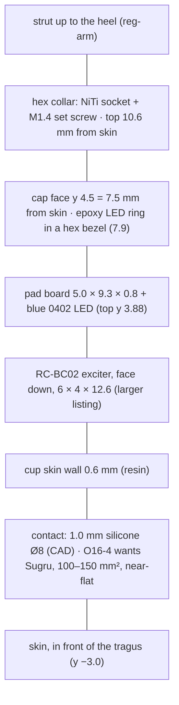

# Pad: transducer cup, contact face, pad board and LED
Rev MZ-2 2026-10-07: pad region unchanged by Phase 2 (ECR-0018 touches the pod board and shell only); reg-board row points at the Phase-2 BOM and the B-face pod-board pads.
Status: CAD rev 1, not built. `pad.py` build 2026-10-01 00:54: checks.json `all_pass` false, 2 known items (open issue 6). Pad board draft `hw/padboard/layout.py` 2026-09-30 23:37, DRC 0 violations / 0 unconnected. Exciter not measured (E1). `hw/padboard/mech.py` pod-side checks read the pre-rev-1 pod frozen in `shell.py` PRE_R1 since ECR-0001 (2026-10-07; outputs unchanged). Updated 2026-10-07.
· Source of truth: `hw/mech/pad.py`, `hw/mech/frame.py` (`PAD_*`, `TRANSDUCER`, `pad_pose`), `hw/padboard/gen.py` (pad-board schematic), `hw/padboard/layout.py` (pad positions), `hw/padboard/mech.py`, `docs/build/tolerances.md` (transducer pod)
· Owner decisions: O8 (LED, solid), O10 (test/final build), O11 (Sugru contact, swappable inserts), O12(b) (IPX4–5), O16(4) (larger near-flat pad), O16(6) (cup screw OK), O19 (serviceable by the owner) · Open ECRs: ECR-0006 (weighted printed dummy pair, 2 h wear test; R20), ECR-0007 (buy exciters now, E1/E2; R19)

## Purpose
- Couples the exciter to the skin just in front of the tragus at ≥ 1 N, pressing inward (D1). It is the skin end of **F3**.
- Insulates the exciter's metal and every solder joint from the skin (spec §8), and keeps rain and sweat out (O12(b): IPX4 minimum, IPX5 preferred).
- Carries the power LED ring (**F12**, O8: solid while on). Joins the 4 arm wires to the exciter's 2 leads and to the LED.

## Big picture

1. Two resin prints. The **cup** holds the exciter face-down on a 0.6 mm skin wall, and the contact sits on its outer face. The **cap + strut** (one print) closes the cup, clamps the pad board onto the exciter's back, carries the LED ring and the NiTi socket, and shrouds the wire.
2. A claw at the top end hooks into a window in the cup. One M1.2 screw closes the bottom end (screws are allowed on the cup: O16(6)).
3. The 4 arm wires arrive through the strut's rear bore and the rear riser, and land on the pad board's top row. The exciter's leads come up through two plated holes at the bottom end.
4. The exciter's long axis lies along the arm (30° sweep). Stood vertically, it would come within ~2 mm of the Ear (open) hook (spec §8, v0.13).

## Elements
| Element | What it is | Numbers (source) |
|---|---|---|
| Cup | Resin print; transducer cavity with a 0.6 mm skin wall | cavity 6.3 × 12.9 for a 6.0 × 12.6 part (0.15/side); outer width 7.9 (pad.py `OUT_U`); 0.27 g |
| Cap + strut | One resin print: closure, board recess, joint pockets, LED diffuser, hex collar, strut, conductor bore | 0.42 g; walls ≥ 0.6 except one internal 0.559 web |
| Contact (CAD) | Silicone disc Ø8 × 1.0, Shore A 30–40, bonded with RTV/Sil-Poxy; or a rigid printed 6 × 8 × 0.9 foot on 0.1 mm tape | `build_contacts()`; swap in a minute (pad.md option C) |
| Contact (owner target) | **Sugru** (mouldable silicone rubber) or a pre-made bone-conduction pad, ~100–150 mm², near-flat, 2 mm edge radius | spec O16(4), O11; **not in CAD yet** |
| Exciter | **RC-BC02** bone-conduction exciter (sub-output); slide fit plus two RTV dots on its long sides | leads **unknown** (E1); mass estimate 1.2 g `[Low]` |
| Pad board | 2-layer PCB, 5.0 × 9.3 × 0.8 mm, copper ≥ 0.3 mm from edges, mirror-symmetric (the left pad takes it turned over: follow the silk, not positions) | layout.py; DRC 0 (2026-09-30 23:39) |
| LED D1 | **Everlight 16-213/BHC-AN1P2/3T**: blue 0402 InGaN chip LED, 1.0 × 0.5 × 0.45 mm, **ESD 150 V HBM** | C131223 · Ext · 25,783 · $0.0291 (JLC API 2026-10-01T00:01Z) |
| LED ring | Clear slow epoxy + a speck of white, cast into a 0.6 mm ring (Ø5.3 cavity, Ø4.1 opaque printed plug, 3 spokes 0.45 × 0.5) over a PE release film | pad.md |
| Closure | M1.2 × 4 pan eyeglass screw, self-tapping into the cup; claw tip 0.45 in a 0.6 window | 2.1 mm thread engagement, 1.2 mm floor under the pilot |
| NiTi lock | Brass M1.4 DIN 934 nut in a collar slot + M1.4 × 2 cup-point set screw on a 0.1 mm flat (front side) | collar 7.4 AF |

**Wire landing on the pad board** (`hw/padboard/gen.py`, `layout.py`; KiCad coordinates, origin = LED, y negative = top end where the arm arrives):
| Pad-board pad | Net | Position, footprint | Pod-board end |
|---|---|---|---|
| J1 | OUT_A | (−1.725, −4.0), SMD 0.7 × 1.8 | J1 (same name) |
| J2 | OUT_B | (+1.725, −4.0), SMD 0.7 × 1.8 | J2 (same name) |
| J3 | LED_A ("LED+") | (−0.575, −4.0), SMD 0.7 × 1.8 | **J7** |
| J4 | LED_K ("LED−") | (+0.575, −4.0), SMD 0.7 × 1.8 | **J8** |
| J5 / J6 | OUT_A / OUT_B → exciter leads A / B | (∓1.775, +3.275), PTH Ø0.45 drill, Ø0.85 pad | — |
| D1 | LED (pad 1 = K → +x, pad 2 = A) | (0, 0), rot 180 | — |

Solder each arm wire on the **top half** of its pad: the cap's epoxy dam (r 3.25) covers the lower 0.1 mm.

## Interfaces
| To | Nets / features | What crosses / invariant |
|---|---|---|
| [sub-output](sub-output.md) | OUT_A, OUT_B → J5/J6 → exciter | 200 kHz square, ~0.3 A peaks; the exciter's ohms and leads (E1) set the cup and the holes |
| [sub-ui](sub-ui.md) | LED_A, LED_K → D1 | VSYS → R14 2k2 (pod board) → LED → PB7 open-drain; 0.14–0.73 mA on battery, 0.82–0.86 mA docked (sub-ui basis; `integration-map.md` §5 still says 0.35–0.75); duty set from VSYS (VBAT on battery, 4.5 V docked); Vf 2.7–3.7 V at 5 mA (pad-led.md). **J4 LED_K is 0.45 mm from J2 OUT_B** (issue 13) |
| [reg-arm](reg-arm.md) | Pad socket Ø0.85 × 3.5 at T (66.8, 5.2, −18.42), 19.3° to the pad axis; set screw at 2.0 mm; strut rear bore Ø1.2 + Ø1.6 counterbore → rear riser → J1–J4 | Lock the pad end **after** the heel end (heel.md step 5). The strut never touches the wire (≥ 0.135 mm) |
| [reg-pod-body](reg-pod-body.md) / [physical](physical.md) | `frame.pad_pose(state)`; PAD_CONTACT (70.6, −3.0, −25.0); pad body top z −17.24 (Ear (open) side), collar max z −14.92 | Ear (open) clearance to re-check on the real STEP (E9). Styling is still Blade (hex bezel, armour plate); O17 asks to carry the Spine theme |
| [reg-board](reg-board.md) | (separate PCB) | Same JLC order as the pod board; see open issue 9. The pad-board LED C131223 adds one Extended part type to the JLC order (count with the Phase-2 BOM `hw/pod/bom_jlc_mz2.csv`: [bom.md](../build/bom.md), reg-board Cost). Pod-board ends of the 4 wires: J1/J2/J7/J8 on the B face at board x 27.0-28.9 (Phase 2, [reg-arm](reg-arm.md)) |

## Constraints
- **D1:** ≥ 1 N inward; compliant pad ~8 mm Ø or 8 × 10 mm oval ≈ 17–20 kPa. **O16(4) (later) supersedes the size:** ~100–150 mm², near-flat, 2 mm edge radius; pre-made pads first, else Sugru.
- **§8 skin isolation:** exciter metal and solder joints fully insulated (silicone pad + sealed housing).
- **O10:** test build reachable (screws OK); final build bonded, water/sweat resistant, cut-openable. **O12(b):** IPX4 min, IPX5 preferred, light rain.
- **O8:** LED solid while on, battery cost accepted.
- **Resin:** walls ≥ 0.6; ream critical holes; resin threads last ~10 open/close cycles (pad.md risk 4).
- **LED ESD 150 V HBM:** solder the arm wires grounded.
- **Exciter orientation:** long axis along the arm (Ear (open) hook clearance ~5.8 mm, spec §8 v0.13).

## Key numbers
| Quantity | Value | Source (date) |
|---|---|---|
| Thickness from the skin | cap face 7.5 · LED bezel 7.9 · M1.2 head 8.3 · **collar top 10.6** (rev 2 housing + silicone was 6.4) | pad checks.json (2026-10-01 00:54) |
| Pad mass | 2.19 g, of which the exciter is 1.2 g `[Low]` | pad checks.json |
| Contact area / pressure at 1 N | Ø8 disc 50 mm² → 20 kPa; O16(4) 100–150 mm² → 6.7–10 kPa | derived |
| Pad tilt over jaw ±2 mm | ~15° of rock (±7° in contact-profile.png) | niti_preload_sweep.json; contact-profile.svg |
| Solder joints | ≤ 0.45 mm tall in 0.5 mm pockets: **0.05 mm to the cap**; SMD laps 1.36–1.8 mm outside the dam (≥ 1.0) | pad checks.json; tolerances.md |
| LED top | y 3.88 (0.45 LED + 0.03 solder); frame's 3.75 is too low | pad.py; Everlight DSE-0008890 Rev 3 (2013-05-29) |
| Board recess | 0.15/side; depth 0.8 nominal (JLC ±10 %: 0.72–0.88) | pad.md |
| Closure pilot | Ø1.0 in CAD since 2026-10-07 (~74 % thread engagement; was 0.95 = 92 %, split risk) | frame.FASTENERS M1.2_pan; hardware.md |
| Wall minimum | 0.60 everywhere, except 0.559 (nut hex ↔ front joint pocket), internal | pad checks.json; tolerances.md (accepted) |

## Open issues
1. **The contact face doesn't match O16(4).** The CAD carries an Ø8 disc (50 mm²) or a 6 × 8 foot. The owner asked for ~100–150 mm², near-flat, 2 mm edge radius, pre-made first. The cup face is only ~7.9 mm wide, so 100–150 mm² means ~8 × 13–19 mm (derived): the whole cup face, or an overhang. contact-profile.png recommends a ~0.6 mm crown on a 9 mm pad. Nobody has searched for pre-made pads, and `docs/research/contact-face-and-preload.md` (cited in O11) doesn't exist. Options (owner decides):
   - **(A, recommended)** A Sugru face moulded over the whole cup face (≈ 8 × 14 mm, ~110 mm²), near-flat with a slight crown and a 2 mm edge radius. It fits without changing the cup; try inserts on the bench (O11).
   - **(B)** Grow the cup face to 150 mm². That widens the pad toward the Ear (open).
   - **(C)** A pre-made pad, if one is found.
2. **Exciter size and leads are unknown (E1).** The design assumes leads leave the back face and go straight up through J5/J6. End-face leads don't fit (0.15 mm clearance, 0.78 mm web to the screw pilot). **Closes:** measure a sample before printing.
3. **Sealing isn't designed.** The cup/cap seam is a claw plus one screw, with no gasket or bond specified. Other openings: the conductor bore and riser, the closure-screw hole, the set-screw access and the nut slot (whether they reach the board cavity hasn't been checked). The only seals today are RTV dots, an RTV dab at the strut exit and the cast epoxy ring. Options:
   - **(A, recommended)** Test build: screwed and dry. Final build: a neutral-RTV bead on the seam and a dab in every opening, peelable for service (matches O10 and O16(6)).
   - **(B)** A moulded silicone gasket at the seam.
   - **(C)** Pot the cup (permanent; the exciter becomes unserviceable).
4. **Tightest fits:**
   - Solder joints have 0.05 mm to the cap, and the PTH pads sit 0.05 mm outside the dam.
   - Stack tolerance: the exciter's thickness is unknown and the board is ±0.08.

   Either can rock the cap or buzz. **Closes:** dry-fit before driving the screw; Kapton shims; flatten the joints.
5. (closed 2026-10-07) Closure pilot set to Ø1.0 in `frame.FASTENERS["M1.2_pan"]` (hardware.md: 74 % engagement; 0.95 = 92 % splits the boss). pad.py re-run: only cup cavity↔pilot wall changed, 0.775 → 0.75 (≥ 0.6); cup −0.3 mm³.
6. **checks.json `all_pass` is false:**
   - (a) the 0.559 mm internal web, accepted in tolerances.md;
   - (b) strut ↔ "tub" 0.79 mm against heel.py's old frame-based tub preview. The rev-1 shell gives 1.18–1.34 mm (tolerances.md).

   **Re-run 2026-10-07 against the real shell_r2 tub** (heel.py exports `tub_r2_with_heel.step`): (b) is now 1.176 mm worn / 1.29–1.34 other states, still below SHROUD_CLEARANCE 1.4, so `all_pass` stays false on (a) + (b). (b) is an owner decision (reg-arm issue 6, backlog ARM-6D). (b) accepted (decided 2026-10-07, decisions-log 9330d9c) (reg-arm issue 6).
7. **The collar stands 10.6 mm off the skin,** ~1.4 mm higher than rev 2 toward the Ear (open). pad.md option B2 (lower T by 1.5 mm) gets ~9.1 mm but re-solves the frame. **Closes:** E9 clearance at true scale.
8. **LED polarity:** KiCad's LED footprint has pad 1 = cathode, while Everlight numbers the anode "1". **Closes:** check the cathode mark in JLC's placement preview (operate-jlcpcb-order).
9. **Pad-board fabrication:** layout.py makes a 2-layer board, while pad.md and electronics.md put it on the pod board's panel. The pod board is 4-layer, so a shared panel makes the pad board 4-layer (derived), and JLC charges a different-design fee (electronics.md item 10). **Closes:** the JLC quote; decide panel vs separate order (O13).
10. **Stale text:**
    - pad.md predates 2026-10-01: front conductor channel, set screw from the rear flat, Ø1.0 channel, "LED+ goes to VBAT".
    - hw/padboard/gen.py docstring says "R14 2k2 from VBAT"; it's been VSYS since Rev D.
    - pad.py's `PADBOARD_REQUESTED` still holds the old J5/J6 spot (electronics.md item 8).
11. **The LED may glow faintly when "off"** from 200 kHz coupling along the arm bundle (pcb-mech-interface.md §6). Fix if seen: 1 nF across J7/J8 on the pod board.
12. **Diagrams:**
    - `contact-profile.png` predates O16(4) (9 mm pad).
    - `pad_views.png` is titled 2026-09-30, and its "rear (ear) face only 1.3 behind the wire" label is stale (now 3.65).
    - There is no pad-board pad map in `docs/diagrams/`; it only exists inside `pad_assembly_steps.png`.
13. **Pad order on the pad board puts LED_K next to OUT_B.** Top row, left to right: J1 OUT_A (−1.725), J3 LED_A (−0.575), J4 LED_K (+0.575), J2 OUT_B (+1.725): 1.15 mm pitch, 0.7 mm pads, **0.45 mm gaps**, half under the epoxy dam (`hw/padboard/layout.py` L47–50). A J2–J4 bridge drives the 200 kHz bridge output straight into PB7, which has no series resistor (20 mA absolute maximum) while it sinks the LED (gen.py L249–253). J1–J3 puts OUT_A on LED_A. Options (owner):
    - **(A)** Reorder to OUT_A, OUT_B, LED_A, LED_K, so LED_K sits only next to LED_A (a bridge there just shorts the LED).
    - **(B)** Adopt the R14 split (1k in series with PB7) on the pod board (sub-ui issue 8).
    - **(C, recommended)** Both: A costs nothing on the pad board; B also covers arm-wire chafe.
    - Add a loupe and meter check of J2–J4 to bring-up (sub-debug-test step 1, done).
14. **Mass:** the pad (2.19 g, 1.2 g of it the exciter `[Low]`) is part of a pod total that already sums to ≥ ~10.2 g against the ~8 g target (00-whole Key numbers, D18, R20); ECR-0006 ballasts a printed pair to that total.

## Before you change this, check
- **Exciter part or size:** the cup cavity and walls, lead holes J5/J6, board clamp, mass → arm force band (reg-arm), sub-output (ohms).
- **Contact face:** D1 force and pressure, the tilt rock (~15°), pad thickness, Ear (open) clearance, O16(4).
- **Pad board (pads, size, LED):** `pad.py` reads `layout.py` live (joint/dam check); board recess 5.0 × 9.3 ± 0.15; LED top vs the plug; wire order (issue 13: LED_K next to OUT_B) and the silk for the left pad.
- **Cap / collar / strut:** reg-arm (socket axis T, strut clearances, heel imports `build_strut()` and `STRUT_*`), the wire bore sizes.
- **Wire count:** the pad board's top row, the strut bore, the heel channel (reg-arm), the pod's J pads (sub-output, sub-ui).
- Walk any change through `integration-map.md` §10 (offboard, mechanical) and `tools/plm.py impact`.

## Change log
- 2026-10-01: created from pad.py checks (00:54), hw/padboard (layout 23:37, DRC 0), frame.py, tolerances.md, spec v0.14. New findings: the CAD contact is half O16(4)'s area; pad sealing isn't designed; the pilot-size conflict; the 2-layer pad board on a 4-layer panel; stale notes.
- 2026-10-01 (editor pass): issue 13 (pad-board order: LED_K 0.45 mm from OUT_B), issue 14 (mass); LED current and duty basis aligned with sub-ui (VSYS); ECR-0006/0007 and O19 in the status line.
