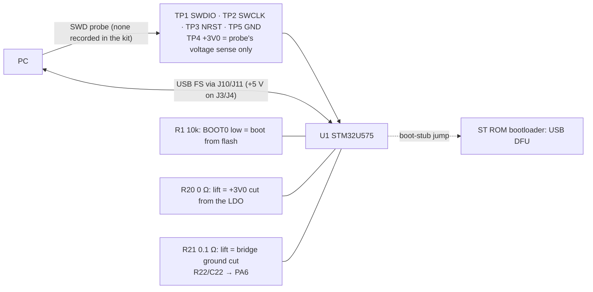

# Debug and test: SWD, test pads, test hooks, test frame, self-test, bring-up
Status: schematic Rev E, block DEBUG (TP1–TP6) + R1, R11, C10, isolation links R20 and R21 with R22/C22 (gen.py; ERC 0 errors, 2026-10-01). Board: TP row placed in the rough draft; N$3 (PA10 → R11) unrouted (`drc.json` 2026-10-01 19:44). Not done: snap-off test frame not designed; self-test firmware and its research note don't exist; no hardware ordered, so no bring-up has happened. Updated 2026-10-01.
· Source of truth: `hw/pod/gen.py` L24–30, L128–130, L171–178, L207, L254–261; `hw/pod/place_r1.py` L45–49, L58, L62, L70; `hw/lib/pod.pretty/TestPoint_Pad_D0.7mm.kicad_mod`; `docs/spec.md` O9, O13, O15, O18
· Owner decisions: O9 (rev 1 is the prototype: pads + snap-off frame), O10 (bonded final build), O13 (own bench, no tool purchases), O14 (layout together), O15 (self-test over USB; its "rev 1 may be bigger" is superseded by O20), O18 (fail informatively), O19 (diagnosability is a goal), O20 (test access must not cost size) · Open ECRs: ECR-0002 item 4 (R11 beside pin 31), ECR-0003 (drops R11), ECR-0005 (self-test drive level), ECR-0009 (no output while docked: conflicts with the docked \|Z\| sweep, open issue 12), ECR-0010 (bring-up plan + firmware before the order)

## Purpose
- Carries **F14** Debug / flash / test, and the test side of **F4** (exciter |Z| self-test; the circuit is owned by sub-output) (`integration-map.md` §1).
- **O18 is the brief:** rev 1 will partly fail. Every failure must be diagnosable from the board itself (test hooks, telemetry, isolation links), the USB/DFU update path must be the most-verified circuit, and SWD is the backup.
- **Three access paths:**
  - SWD (Serial Wire Debug, Arm's 2-wire program/debug port) for the first flash and for recovery;
  - USB through the dock pads, for firmware update (ROM DFU) and the self-test stream;
  - hand probing: pads, cap terminals and the two lift-out links.

## Big picture

1. **A blank chip can only be flashed over SWD.** R1 holds BOOT0 low, so the U575 boots from its empty flash. Unlike some STM32s, it has no "empty flash → bootloader" rule (RM0456 Rev 7 Table 25 p.192; AN2606 Rev 69 Pattern 12). So image #1 goes in through TP1/TP2 (+TP3, TP5).
2. **Image #1 unlocks USB.** It carries the app and a boot stub. From then on: the CDC self-test (CDC = USB virtual serial port) and the jump into ST's ROM DFU (USB Device Firmware Upgrade) for updates (sub-dock-usb).
3. **Isolation links:** lift R20 to meter the whole +3V0 rail or feed it from the bench; lift R21 to take the bridge's ground away.
4. **The board measures itself** (O18; table below). TP6 VSYS exists because nothing on the board can read VSYS.
5. **Reach:** every TP is on the F face, under the lid. Test build: peel the tape. Bonded build: SWD means cutting it open (O10), so DFU must be proven first.

## Elements
| Ref | What it is | Net · MCU pin | Board (x, y) face | LCSC · class · JLC stock (API 2026-10-02T00:25Z) |
|---|---|---|---|---|
| TP1–TP6 | 0.7 mm round SMD pads, copper only, for a P50 pogo pin (spring test pin on a 1.27 mm = 50 mil pitch) or a probe tip | TP1 SWDIO · PA13 (34); TP2 SWCLK · PA14 (37); TP3 NRST (7); TP4 +3V0; TP5 GND; TP6 VSYS | (24.40 + 1.27 i, 1.3) F, i = 0…5 | – |
| R1 | 10 kΩ 1 % 0402 pull-down: BOOT0 low = boot from flash | N$1 · PH3-BOOT0 (44) | (17.0, 1.6) F | C25744 · Basic · 21.8 M |
| R11 | 100 kΩ 1 % 0402 pull-up: keeps the ROM bootloader's USART1_RX from listening to noise | N$3 · PA10 (31) | (10.5, 11.2) B | C25741 · Basic · 8.26 M |
| C10 | 100 nF 0402 X7R on NRST (reset noise filter) | NRST (7) | (8.3, 7.88) F | C1525 · Basic · 21.7 M |
| R20 | 0 Ω 0402 jumper, LDO → rail | LDO_OUT → +3V0 | (23.4, 11.4) B | C17168 · Basic · 9.30 M |
| R21 | **1206W4F100LT5E**: 0.1 Ω ±1 % 250 mW 1206 low-side shunt | BRIDGE_RTN → GND | (21.6, 7.6) B | C25334 · Basic · 121,425 |
| R22, C22 | 1 kΩ / 10 nF 0402: 15.9 kHz low-pass | BRIDGE_RTN → I_SENSE → PA6 (16) | (12.6, 11.6) / (10.6, 11.6) F | C11702 / C15195 · Basic |

### Where to probe what has no pad
| Signal | Probe at | Signal | Probe at |
|---|---|---|---|
| VBAT | J5 (F) | VDD11 (~1.1 V core) | C8 (17.6, 11.5) or C9 (20.3, 8.57), F (gen.py L28–29) |
| DOCK_VBUS / VBUS | J3 (F) / C15 or R12 (B) | LDO_OUT alone (R20 lifted) | R20's LDO-side pad or C18 (24.2, 8.9), B |
| MIC_VDD | C13 (6.6, 5.0), B | **MIC_CLK (E6 duty check)** | R2 (6.6, 8.0), B: no pad since 1c82d5c |
| I_SENSE | C22, F | BTN / BOOT0 | R10 (23.0, 9.5) / R1's PH3 pad, F |
| OUT_A/B, LED_A/K | J1/J2, J7/J8 (F) | TS, CC, D+/D− | J9, J12, J10/J11 (F) |

### What the MCU can read about itself (O18 "the board measures itself")
| Readable | How | Source |
|---|---|---|
| +3V0 (= VDDA = the ADC's reference) | VREFINT (factory-calibrated) on ADC4 VIN[0] → back-calculate VDDA; also VBAT/4 on VIN[14], because the MCU's VBAT pin is tied to +3V0 | RM0456 Rev 7 Table 329 p.1383; sub-processing rule 8 |
| VDD11 core / die temperature | VCORE on ADC4 VIN[12] / VSENSE on VIN[13] | same |
| VBAT, VBUS, TS, CC | PA4 VBAT_SENSE, PA1 VBUS_SENSE, PA2 TS, PA3 CC_SENSE | integration-map §4 |
| Bridge supply current | PA6 I_SENSE (ADC1_IN11) | F4; see open issue 5 |
| Charger state | U3 status and fault registers over I2C2 (U3 has no ADC) | gen.py L28 |
| **Not readable** | VSYS (TP6 only); LDO_OUT apart from +3V0; MIC_VDD and mic current; LED current; exciter coil current | – |

### Self-test over USB (O15): plan, nothing written
The list comes from `schematic-rev1.png` ("rails, clocks, mic stream to a PC spectrogram, PWM-noise A/B, charger log") plus F4. `docs/research/self-test-firmware.md`, which O15 cites, doesn't exist.
| Test | What it does | Caveat |
|---|---|---|
| Rails | streams the table above | VSYS not covered. Docked values differ from worn ones (VSYS 4.5 V) |
| Clocks | LSE ready; MSI locked to LSE; PLL lock; HSI48/CRS synced to USB; a timer cross-counts LSE against HSI16 | Mic-clock duty (48–52 %, D13/R13) needs a scope at R2 |
| Mic stream | ADF1 at 200 kS/s → USB → spectrogram on the PC | 3.2 Mbit/s raw vs USB FS's 12 Mbit/s signalling (derived; real throughput unverified). Docked = charger and cable present: record, never listen (spec L562) |
| PWM-noise A/B | mic stream with the bridge idling at 200/400/800 kHz vs bridge stopped (or R21 lifted) | Picks the lowest PWM rate under the mic's noise floor (MP-01; sub-output issue 8). Runs docked: same ECR-0009 conflict (open issue 12) |
| Charger log | U3 status + VBAT/TS/VBUS/CC through a whole charge | Gives the unknown charge time and the TS-vs-cell check (sub-power issues 4, 10) |
| Exciter \|Z\| sweep | tone sweep at f, synchronous detection on PA6 **at 2f** plus the DC term | PA6 sees supply current i·(2d−1): \|Z\| and phase are in its 2f component, and the negative half needs an offset (sub-output issue 1, option D). Docked sweeps heat U4 (sub-power issue 5); full scale exceeds U4's 300 mA (ECR-0005). **Blocked by ECR-0009's "no output while docked" unless it gets a capped self-test exemption (open issue 12)** |

### What the ROM bootloader does to this board's pins (AN2606 Rev 69 §89 Table 199, pp.466–469)
| Pins (nets) | Bootloader sets | Effect here (derived) |
|---|---|---|
| PA2 (TS) | USART2_TX, push-pull, idles high | Drives TS to ~3.0 V: U3 reads "cold" and **pauses charging while in ROM DFU** |
| PA3 (CC_SENSE) | USART2_RX (input) | Idle level set by R18 Rd 5.1k / R19 10k: ≈ 0 V undocked. A docked USB-C source's Rp lifts CC to roughly 0.4–1.7 V (derived), possibly between VIL and VIH: the bootloader could see USART activity and pick USART2 instead of USB DFU. **Test in bring-up step 6** |
| PA4/PA5/PA6/PA7 (VBAT_SENSE, MIC_VDD, I_SENSE, GA_N) | SPI1 slave: inputs with pull-downs; PA6 = MISO push-pull | Mic unpowered (PA5 pulled down); leg-A N-FET held off; PA6 may drive I_SENSE through R22 (≤ 3 mA) |
| PB4 (MIC_DATA) | not a bootloader pin; reset state NJTRST with an internal pull-up (sub-processing) | The pull-up back-feeds the **unpowered** mic's DATA pin (MIC_VDD floating) through its I/O protection, in reset and in ROM DFU. Effect on the mic unknown; measure MIC_VDD in bring-up step 6 (sub-audio-in issue 11) |
| PA9 / PA10 (GB_P / N$3) | USART1_TX idles high / USART1_RX **with its own pull-up** | Leg-B P-FET held off; R11's job is already done by the bootloader (open issue 7) |
| PB7 (LED_K), PB6, PB8, PB15 | I2C1 open-drain + pull-ups; FDCAN1_RX pull-up; SPI2_MOSI | LED dark; free pins parked |
| PB13/PB14 (I2C_SCL/I2C_SDA) | SPI2 SCK input / MISO push-pull | PB14 drives I2C_SDA: harmless while nothing talks to U3 |
| PA11/PA12 | USB FS DFU on HSI48 + CRS, so no crystal is needed. **"VDDUSB must be connected to 3.3 V"** | +3V0 is 2.955–3.045 V (open issue 6) |

The bridge is safe in DFU: PA8 and PB0 are untouched, so R3/R6 hold those FETs off. PA7 is pulled low and PA9 driven high.

### Rev-1 bring-up sequence (proposal: no source defines one for this board; adapted from `hw/mech/notes/electronics.md` §A)
| # | Do | Measure / expect | If not |
|---|---|---|---|
| 0 | Loupe: U3 balls, U1, Q1/Q2 (EasyEDA SOT1216 pads unless ECR-0004 lands), SW1, the pad-board LED's cathode mark | – | photograph and stop |
| 1 | Meter, no power: TP4–TP5, TP6–TP5, J5–J6, J3–J4; the J-pad neighbours **J3–J5 (critical: DOCK_VBUS ↔ VBAT)**, J10–J1, J11–J2, J8–J9, J7–J2, J1–J6; on the pad board, J2–J4 (OUT_B ↔ LED_K) and J1–J3 under a loupe | no short. Record board 1's readings as the reference | find it before powering. **J3–J5 bridged = cell on the exposed dock contact** (reg-board issue 4). **J8–J9 bridged = ship mode** (sub-ui issue 8). Pad-board J2–J4 = bridge output into PB7 (reg-pad issue 13) |
| 2 | Bench 3.7 V, 50 mA limit, on J5 (+) / J6 (−) | TP6 ≈ 3.7 V; TP4 2.955–3.045 V; record the blank-chip current (no reference value exists) | Hits the limit: lift R20 → LDO_OUT alone at R20's pad → then 3.0 V into TP4 (30 mA limit) to split the LDO side from the load side |
| 3 | SWD on TP1/TP2/TP3/TP5. TP4 = sense with a genuine ST-LINK; leave it open on a clone; **never** drive the probe's 3.3 V into it | chip ID, option bytes recorded; flash the bring-up image | check NRST (TP3) idles high; SWD pull states (AN5373 §6.2.3) |
| 4 | Clocks: LSE, MSI lock, PLL; scope MIC_CLK at R2 (B) | duty 48–52 % above 2.4 MHz (D13) | E6/R13 fallback: timer-made clock (D14) |
| 5 | Tack the pad board (or any LED) to J7/J8; press SW1 | LED on/off from PB7; +1.36 mA while pressed; PA0 high | LED dark = reversed (pad-led build note) |
| 6 | USB: 5 V current-limited on J3/J4, a cut USB cable on J10/J11, J12 CC → Rd on board | CDC enumerates; **jump to ROM DFU and re-flash over USB** (O18). Repeat with 2.95 V on TP4 (R20 lifted). Repeat DFU entry with a USB-C source (CC driven) to check PA3 doesn't steal the bootloader; meter MIC_VDD in DFU (PB4 back-feed); a DFU session > 160 s with the charger watchdog armed (sub-power issue 3) | sub-dock-usb issue 6 |
| 7 | I2C2: read U3 at 0x6A; write the register plan; charge the real cell | log via the self-test | sub-power issues 2–4 |
| 8 | Mic: PA5 on, standard mode → 4 MHz; stream to the PC | spectrogram of a known source (HC-SR04 40 kHz, spec §10) | sub-audio-in |
| 9 | Bridge: 8–12 Ω resistor on J1/J2 first (electronics.md A.5), low level; then the exciter | \|Z\| sweep at low amplitude; PWM-noise A/B | lift R21 to rule the bridge out |
| 10 | Off: Stop 2, PPK2 in series with the supply | ≈ 16.5–24 µA (sub-power estimate) | +1.36 mA = SW1 pre-pressed (sub-ui issue 1) |
| 11 | Only then depanel and build into the pod | physical.md assembly order | – |

### Owner's bench (O13: "iron, flux, oscilloscope, etc.: no tool purchases")
| Have (source) | Not recorded, needed |
|---|---|
| Iron, flux, oscilloscope (O13, L639); LCR meter, **PPK2** (Nordic Power Profiler Kit II, a USB current profiler) (spec §10 L575) | **SWD probe:** none recorded. hardware.md §7 lists an ST-Link V2 clone, "not researched"; its U575 support is unverified |
| Multimeter and a current-limited bench supply: assumed by electronics.md "Testing", covered only by O13's "etc." | P50 pogo pins + printed jig; a USB cable to the J pads (the 5-pin dock head shows 0 JLC stock, sub-dock-usb issue 1) |

## Interfaces
| To | Nets / pins (as in integration-map.md) | What crosses / invariant |
|---|---|---|
| [sub-processing](sub-processing.md) | SWDIO PA13, SWCLK PA14, NRST, N$1 (PH3-BOOT0, R1), N$3 (PA10, R11) | PA13 has an internal pull-up and PA14 an internal pull-down (AN5373 Rev 7 §6.2.3 p.31). NRST's internal pull-up is 30–50 kΩ (DS13737 Rev 10 Table 100). BOOT0 is latched at reset release (RM0456 Table 25 note) |
| [sub-power](sub-power.md) | TP4 +3V0, TP6 VSYS, R20 (LDO_OUT → +3V0) | Lift R20 before feeding TP4. R20's current rating is unknown (sub-power issue 6). Battery-only power-up needs VBAT > 3.46 V max (SLUSE99C §7.5) |
| [sub-output](sub-output.md) | BRIDGE_RTN, R21, I_SENSE (R22/C22 → PA6) | Lifting R21 floats BRIDGE_RTN: keep TIM1 stopped. The F4 method's limits are in sub-output issue 1 |
| [sub-dock-usb](sub-dock-usb.md) | USB_DP/USB_DM (J10/J11), DOCK_VBUS/GND (J3/J4) | DFU is the main update path (O18). The boot stub is not designed (sub-dock-usb issue 4) |
| [sub-audio-in](sub-audio-in.md) | MIC_CLK (via R2), MIC_VDD (C13) | No pad on any mic net (cut in 1c82d5c); the mic is checked by the USB stream |
| [sub-ui](sub-ui.md) | BTN (R10), LED_K (J8) | Stuck-button flag in telemetry; LED dark in ROM DFU |
| [reg-board](reg-board.md) | TP row x 24.40–30.75, y 1.3, F; R1 F; R11, R20, R21 B | Row clears the 0.6 mm clamp band by 0.35 mm. **N$3 unrouted** (U1 pin 31 (16.44, 6.25) F → R11 (10.5, 11.71) B) |
| [reg-pod-body](reg-pod-body.md) / [physical](physical.md) | TP row under the lid | Same board, F toward the lid, mic end forward. In the right pod the TP edge (board y 0) is at the bottom: seen from outside, KiCad's top view rotated 180° (physical.md, derived) |

## Constraints
- **O9:** rev 1 is the prototype: no dev boards; debug access is the board's test pads plus a snap-off test frame on the same JLC panel.
- **O15:** self-test over USB. Its "rev 1 may be bigger for test access" is **superseded by O20** (2026-10-01, spec L646): test access must not cost size: small pads, hooks off the board where possible (snap-off frame, O9). The 34 × 13 board was grown under O15 and must be re-sized.
- **O18:**
  - instrumented to fail informatively;
  - DFU is the most-verified path, SWD the backup;
  - the board measures itself;
  - **spare MCU pins go to pads**;
  - simplification may not remove diagnosability without saying so.
- **O13:** no tool purchases; the board stays double-sided. **O14:** the layout (including the TP row) is done together.
- **O10:** final build bonded and cut-openable. SWD there means cutting it open.
- **Spec L562:** listening tests on battery only; USB streaming is for recording.
- **Pad board:** below JLC's 10 × 10 mm assembly minimum, so it rides in a panel with the pod board anyway (`pcb-mech-interface.md` §8, [Med]).

## Key numbers
| Quantity | Value | Source (date) |
|---|---|---|
| TP pads | Ø0.7 on 1.27 mm pitch = 0.57 mm copper gap; row x 24.40–30.75 (pod x 55.0–61.35), y 1.3, F | `place_r1.py` L49; `pod.pretty` footprint (2026-10-01); gap derived |
| TP row to clamp band | 0.35 mm (y 1.3 − 0.35 − 0.6) | derived; board-regions.png |
| Boot address | BOOT0 = 0 → flash 0x0800 0000; BOOT0 = 1 → bootloader 0x0BF9 0000 | RM0456 Rev 7 (Mar 2026) Table 25 p.192 |
| NRST | internal pull-up 30 / 40 / 50 kΩ; with C10, τ ≈ 4 ms | DS13737 Rev 10 (Jul 2024) Table 100 p.238; τ derived |
| ROM DFU | system clock 60 MHz from HSI; USB on HSI48 + CRS; bootloader uses 16 kB RAM from 0x2000 0000 | AN2606 Rev 69 (Nov 2025) Table 199 p.466; local copy fetched 2026-09-30 (SHA-256 b0ed4c4839c41131) |
| Battery-only power-up of U3 | VBATPOR 3.08 / 3.21 / 3.46 V | SLUSE99C (Jan 2023) §7.5 |
| +3V0 | 2.955–3.045 V | SBVS338H §5.5 via sub-power |
| R21 signal | 31–32 mV at the ~0.32 A full-scale peak (gen.py: 31 mV at 315 mA; sub-output: 0.32 A); 0.1 Ω ±1 %, 250 mW | gen.py L171–174; sub-output; JLC listing 2026-10-02T00:25Z |
| I_SENSE filter | 15.9 kHz (1 kΩ × 10 nF) | derived |
| Off current to expect | ≈ 16.5–24 µA (estimate, not measured) | sub-power |
| Mic stream | 200 kS/s × 16 bit = 3.2 Mbit/s | derived |

## Open issues
1. **First flash needs an SWD probe, and none is recorded.** Options (owner):
   - (A) Buy a probe. That breaks O13's "no tool purchases", and a V2 clone's U575 support is unverified.
   - (B) Bodge: a wire from R1's PH3 pad to TP4 at reset → ROM USB DFU through the J pads. Needs USB to work at 3.0 V (issue 6).
   - (C) Add a BOOT0 pad next to TP4 in the schematic, so a solder blob selects ROM DFU. That makes DFU the primary path even for a blank chip (O18).
   - **Recommend (C) with (A) as backup**, raised as an ECR in the simplification study.
2. **TP order puts rails beside GND:** TP4 +3V0 | TP5 GND | TP6 VSYS at 0.57 mm gaps. A smear or a pogo jig off by one pitch shorts a rail. The round-1 note ordered its pads so a smear never joins 3V0 to GND (`pcb-mech-interface.md` §8).
   - **Closes:** reorder in the layout session (O14). Candidate: NRST, GND, SWDIO, +3V0, SWCLK, VSYS, where each neighbour short is harmless or current-limited.
3. **Snap-off test frame (O9) isn't designed for the 34 × 13 board.** The round-1 concept (1×5 2.54 mm header on a strip, traces across a front-edge tab; `pcb-mech-interface.md` §8, electronics.md §A) fitted a 20 × 11.5 board with a front-edge SWD column. Options:
   - (A) Port it: header strip wired through a tab. The tab would cross the top clamp band where the lid rib presses: sand it flush and seal 6 cut trace ends.
   - **(B, recommended)** Frame with no wiring: panel tooling holes locate a printed P50 pogo jig on TP1–TP6. The same jig works on the loose board later. No cut traces.
   - (C) No frame features: tack wires to the TPs once, then use DFU.
4. **O18 gaps today.** The 8 free MCU pins (PC13, PH0, PH1, PB1, PB15, PB5, PB6, PB8) go nowhere: O18 says pads. Not readable by the MCU: VSYS, MIC_VDD, LED current, coil current. No pad on MIC_CLK. **Closes:** the simplification study must list what it keeps or drops ("may not remove diagnosability without saying so"). PC13 must stay static (ES0499 §2.2.1).
5. **Self-test exists only as a list.** No firmware, no research note. The \|Z\| sweep reads supply current; \|Z\| and phase come from its 2f component (sub-output issue 1, option D, unverified). **Closes:** write `self-test-firmware.md`; verify option D in `bridge_spice.py`; decide sub-output's options.
6. **ROM DFU supply.** AN2606 Table 199 says "VDDUSB IO must be connected to 3.3 V", but +3V0 is 2.955–3.045 V. The datasheet minimum, 3.0 V, is already marginal (sub-dock-usb issue 6). **Closes:** bring-up step 6, including 2.95 V on TP4.
7. **R11 may be redundant.** The ROM bootloader puts its own pull-up on PA10 (AN2606 Table 199), which is R11's stated purpose (gen.py L207). N$3 is also one of the 7 unrouted nets. **Closes:** confirm on board 1 (DFU entry with R11 lifted); feed ECR-0003 / the simplification study.
8. **ROM DFU pauses charging:** PA2 = USART2_TX drives TS high. Harmless for short sessions; the boot stub should leave U3 in a known state. **Closes:** check in bring-up step 6 with a cell fitted.
9. **R20 current rating unknown** (sub-power issue 6). Never feed TP4 with R20 fitted: that back-drives U4's output, and TI's behaviour for that isn't in any source.
10. **Stale docs** (not edited here): `hw/mech/notes/electronics.md` §A, `docs/research/pcb-mech-interface.md` §7–§8 and `docs/build/hardware.md` §7 still describe the round-1 SWD scheme (1×5 header, front-edge column, lid-screw charging). Two labels in `schematic-rev1.png` are stale (58 parts, R21 0.33 Ω).
11. **Diagrams missing:** a test-access map (TPs, probe points, lift links, both faces) and a bring-up flow, as PNGs. The tables and Mermaid stand in.
12. **ECR-0009 vs this self-test.** ECR-0009 (R23 safety) forbids exciter output while VBUS is present; the \|Z\| sweep and PWM-noise A/B run docked over USB. Owner decides: **(a, recommended)** a capped, self-test-only exemption written into ECR-0009 (never in normal docked use; drive ≤ ~−12 dBFS, which also covers ECR-0005 and U4 heating); or (b) run on battery, log, read back over USB. Same issue: sub-output issue 12, sub-power issue 5.
13. **O20 (2026-10-01) re-sizes rev 1.** Test access may not cost size, so the TP row, R20/R21 hooks and the 34 × 13 outline are up for review in the simplification study. O18 still says removing a hook must be stated and justified.

## Before you change this, check
- **TP pads (count, order, size, position):** P50 pitch; clamp band 0.6 mm (reg-board, reg-pod-body); jig and frame design; the right pod's 180° turn (physical).
- **R1 / BOOT0 or R11 / PA10:** the DFU path and boot stub (sub-dock-usb); RM0456 Table 25; AN2606 Table 199; ECR-0003; `integration-map.md` §4.
- **R20:** every +3V0 load (sub-power rails); USB margin; the ECR-0005 peak current through a 0402 jumper.
- **R21/R22/C22:** the F4 method (sub-output issue 1); PA6 vs a TIM1_BKIN need (sub-processing issue 6).
- **Removing any hook or pad:** O18 says it must be stated and justified.
- Walk any change through `integration-map.md` §10 and `tools/plm.py impact SUB-DEBUG-TEST`.

## Change log
- 2026-10-01: created from gen.py Rev E, place_r1.py (drc 19:44), spec v0.14 + O18. Sources: RM0456 Rev 7, DS13737 Rev 10, AN5373 Rev 7 (owner's copies), AN2606 Rev 69 (local copy) and SLUSE99C.
  - New findings: SWD is mandatory for the first flash; the ROM bootloader's effect on this board's pins (charging pauses; R11 possibly redundant); the AN2606 3.3 V note; rails beside GND in the TP row; O18 gaps; the bring-up sequence.
- 2026-10-01 (editor pass): ROM-bootloader table gains PA3 (CC level vs USART2_RX) and PB4 (NJTRST pull-up into the unpowered mic); bring-up step 1 meters J3–J5, J10–J1, J11–J2 and pad-board J2–J4; step 6 tests PA3, PB4 and the charger watchdog in DFU; \|Z\| method now the 2f lock-in; issues 12 (ECR-0009 conflict) and 13 (O20); O19/O20, ECR-0009/0010 in the status line.
