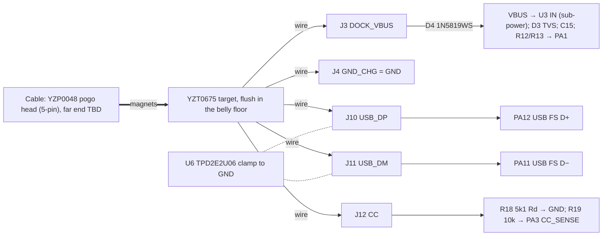

# Dock and USB: magnetic dock, USB FS, DFU, ESD, dock detect
Status: schematic Rev E, block DOCK_USB (gen.py; ERC 0 errors, 2026-10-01 19:34). Dock contacts are copper pads J3/J4/J10/J11/J12, hand-wired to a bought magnetic target. Belly bay modelled in `shell_r1.py`. Cable side, contact pin order and DFU firmware not designed yet. Updated 2026-10-01.
· Source of truth: `hw/pod/gen.py` (DOCK_USB), `hw/mech/shell_r1.py` (`DOCK`, `BAY`, `USBC_KEEPOUT`, `tub`), `hw/pod/place_r1.py`, `docs/build/bom.md`
· Owner decisions: O12(a)(b), O16(3)(5)(6), O10, O9/O15, O19 (dock and sealing are daily-use requirements) · Open ECRs: ECR-0002 (C15 swap), ECR-0003 (drops R11), ECR-0008 (connector stock), ECR-0009 (no exciter output while VBUS is present)

## Purpose
- Carries **F9** Dock detect, **F10** USB data / DFU, **F15** ESD at exposed contacts, and the input half of **F5** Charge (`integration-map.md` §1).
- **One magnetic cable** does charging + firmware (USB FS, ST ROM DFU), "we have space and budget" (O12a). It must:
  - survive upside-down / reversed docking;
  - keep the bonded final build updatable without cutting it open (O10);
  - reach IPX4 minimum, IPX5 preferred, for outdoor wear in light rain (O12b).
- Pre-built magnetic connector, no custom connector board; **space reserved for a sealed USB-C** fallback (O16-3).

## Big picture

1. **Mating:** the cable's pogo head snaps onto the target with two NdFeB magnets. Five contacts at 2.5 mm pitch carry VBUS, GND, D+, D− and CC.
2. **Power:** DOCK_VBUS goes through D4 (blocks a reversed supply) to VBUS and U3's input. D3 clamps ESD on VBUS, **behind D4**: the exposed contact itself has no clamp (open issue 15).
3. **Dock detect:** R12/R13 halve VBUS onto PA1.
4. **CC:** R18 (Rd, 5.1 kΩ) tells a USB-C charger "a sink is here", so it turns VBUS on. R19 lets PA3 read the charger's current advert.
5. **Data:** D+ and D− go straight to the U575's full-speed USB PHY. U6 clamps ESD on both. Firmware offers a CDC self-test, or jumps to ST's ROM DFU bootloader for updates.
6. **Undocked:** the exposed contacts carry no DC (assuming no J3–J5 solder bridge: J3 DOCK_VBUS sits 0.6 mm from J5 VBAT, reg-board issue 4). J3 floats behind D4 and U3's input blocking FET, and VBUS bleeds to 0 V through R12/R13. Unlike the old lid-screw scheme, sweat can't be electrolysed while worn, **provided firmware leaves PA11/PA12 in analog (reset) mode and the USB pull-up off when VBUS is absent.**

## Elements
| Ref | Part (what it is) | LCSC · class · JLC stock · $ (JLC API 2026-10-02T00:02Z) | Notes |
|---|---|---|---|
| target | **Xinyangze YZT0675-20048-05025-01**: 5-position magnetic connector, pod side. PA9T housing, brass contacts 3 µ″ Au over Ni, 2 NdFeB magnets, −20…70 °C | C5126848 · Extended · **51** · $2.38 | Hand-installed: glued into the floor window, back potted. Not JLC-placed |
| head | **YZP0048-20048-05025-01**: the 5-pin cable-side pogo head | C5126847 · Extended · **0** · $1.39 (2026-10-02T00:03Z) | **bom.md lists C5126845 = -04025-03, a 4-pin head (12 V 1 A)**: open issue 1 |
| D4 | **1N5819WS**: 40 V 1 A Schottky diode, SOD-323, in series with VBUS (reverse-dock block) | C191023 · Basic · 4.86 M · $0.014 | Listing: 600 mV at 1 A, 500 µA leakage at 40 V. Drop at ~0.2 A unmeasured |
| D3 | **ESD9X5.0ST5G**: onsemi 5 V one-way TVS, SOD-923 1.0 × 0.6 mm, VBUS (behind D4) to GND | C87910 · Extended · 43,847 · $0.048 | Listing: V_RWM 5 V, V_BR 6.2 V, 12.3 V clamp at 8.7 A, 65 pF, 1 µA |
| U6 | **TPD2E2U06DRLR**: TI 2-channel low-capacitance ESD clamp for USB, SOT-553 | C1972959 · Extended · 7,653 · $0.32 | Listing: 1.5 pF, 10 nA, 5.5 A (8/20 µs). Shunt only, not in series |
| R18 | 5.1 kΩ: USB-C **Rd** (sink identity on CC) | C25905 · Basic | |
| R19 | 10 kΩ, CC → PA3 | C25744 · Basic | Also limits current into PA3 on a CC zap |
| R12, R13 | 100 kΩ / 100 kΩ, VBUS/2 → PA1 | C25741 · Basic | 25 µA while docked |
| C15 | 4.7 µF on VBUS | C23733 · Basic | Placed at U3; ≤ 10 µF USB attach limit (gen.py) |
| J3, J4, J10, J11, J12 | 1.0 mm hand-solder pads, F face, rear column, board x 31.4, y 3.4 / 5.0 / 6.6 / 8.2 / 9.8 | – | Labels VBUS, GND_CHG, D+, D−, CC |
| R1, R11 (MCU block) | 10 kΩ BOOT0 (PH3) pull-down; 100 kΩ PA10 pull-up | C25744, C25741 · Basic | R1 makes the chip boot from flash. R11 keeps the ROM bootloader's USART1 detect quiet (ECR-0003 would drop R11) |
| USB-C fallback | **Same Sky UJ32-C-H-G-MSMT**: IP68 sealed USB-C receptacle, 6.75 × 8.55 × 2.76 mm | not fitted; price TBD (bom.md) | Keep-out only |

### Contact map (pin order on the target: **TBD, not recorded anywhere**)
| Target position | Pad | Net | Function | If the head mates rotated 180° (1↔5, 2↔4) |
|---|---|---|---|---|
| TBD | J3 | DOCK_VBUS | 5 V in | Depends on the order |
| TBD | J4 | GND | return (GND_CHG = system GND) | |
| TBD | J10 / J11 | USB_DP / USB_DM | USB FS | Swapped: no enumeration, no damage |
| TBD | J12 | CC | Rd + sense | **5 V on CC puts 5 V through R19 into PA3** |

**Recommendation:** first check on the sample whether the magnets are polarity-keyed. If not, put **VBUS on the centre pin (3)**: a reversed mate can then only swap D+/D− and GND/CC, which is harmless. D4 stays as the guard against a miswired cable.

## Interfaces
| To | Nets / pins (as in integration-map.md) | What crosses / invariant |
|---|---|---|
| [sub-power](sub-power.md) | VBUS → U3.A2 IN; C15 at U3 | U3 runs 3.0–5.5 V; overvoltage cut 5.5–5.9 V; input 25 V tolerant. ILIM 500 mA default ≥ 170 mA charge + system (170 mA is written by firmware; U3 powers up at 10 mA). Docking fires U3's power-good interrupt on CHG_INT |
| [sub-processing](sub-processing.md) | USB_DP PA12, USB_DM PA11 (AF10, HSI48 + CRS); VBUS_SENSE PA1; CC_SENSE PA3; CHG_INT PA15; N$3 PA10 (R11); N$1 PH3 BOOT0 (R1) | USB needs VDDUSB 3.0–3.6 V, internally tied to VDD on this package (A3 §3, datasheet-provenance). PA1 sits at ~2.2–2.5 V when docked: use it as an ADC input, and **wake on CHG_INT, not on PA1** (its digital-high margin is unverified) |
| [sub-ui](sub-ui.md) | BTN PA0 | Proposed DFU gesture: hold the button while docking (open issue 4) |
| [sub-debug-test](sub-debug-test.md) | TP1 SWDIO, TP2 SWCLK, TP3 NRST | SWD is the only recovery from a broken application, and the pads are reachable only with the lid off |
| [reg-board](reg-board.md) | J pads F rear (pod x 62.0); D3 (26.26, 4.6), D4 (27.22, 6.4), U6 (26.58, 8.6), R12/R13 (25.3 / 26.9, 2.2), R18 (25.3, 10.4), R19 (27.54, 10.4), all B; C15 (15.3, 2.2) B | D3 and U6 belong next to their pads, each with its own GND via. D+/D− should run as a pair. The R-DOCK-BOARD watch covers J3/J10/J12/U6/D4 |
| [reg-pod-body](reg-pod-body.md) | `DOCK` box x 31.5–52.7, y 6.32–13.18, z −13.2…−10.4; window +0.1 mm per side (21.4 × 7.06); `BAY` x 30.3–54.2, z −12.4…−8.9; `USBC_KEEPOUT` x 47.9–55.0, y 5.45–14.05, z −12.4…−9.6 | Target flush in the belly floor, glued, back potted (tolerances.md). The USB-C keep-out overlaps the target's rear 4.8 mm, so it's **either/or** |
| [physical](physical.md) / [reg-board](reg-board.md) | wires target → J3/J4/J10/J11/J12 | The route from the belly (x ≤ 54) to the rear pads (x 62, F face) isn't drawn (open issue 5) |

## Constraints
- **O12(a)** USB FS + ROM DFU through the dock. **O12(b)** IPX4 minimum / IPX5 preferred. **O16(3)** pre-built magnetic connector, own magnets OK, sealed USB-C space reserved. **O16(5)** one board for both pods. **O16(6)** no screws in the housing. **O10** final build bonded but cut-openable. **O9/O15** rev 1 = prototype, testable.
- Exposed metal = dock contacts only (F15). The ESD chain is **DOCK_VBUS (J3, exposed) → D4 → VBUS (D3)**: a positive strike reaches D3 only through D4, and a negative strike reverse-biases D4 with no clamp on DOCK_VBUS at all (open issue 15). D± get U6. **CC has no clamp** beyond R19 and the MCU pin's own protection.
- USB FS: VDDUSB 3.0–3.6 V vs the +3V0 rail at 2.955–3.045 V (TPS7A20 ± 1.5 %, SBVS338H §5.5).
- Charger input: U3 operates 3.0–5.5 V and needs VIN > VBAT + ~135 mV to leave sleep (SLUSE99C §7.5).

## Key numbers
| Quantity | Value | Source (date) |
|---|---|---|
| Target body | 21.20 × 6.86 × 2.80 mm, plus a 5.03 mm-wide tab (outline 9.17 mm) and 5 Ø0.70 solder tails 2.0 mm long (LCSC "4.8 mm") | Xinyangze drawing YZT0675-20048-05025-01 A.1, 2022-03-24 (LCSC PDF, fetched 2026-10-01) |
| Contacts | 5 at 2.5 mm pitch; 50 mΩ; 10,000 cycles; 1,000 MΩ insulation; 500 VAC withstand | same drawing + JLC listing 2026-10-02T00:02Z |
| Head rating | 12 V, 1 A (4-pin -04025-03 listing); 5-pin rating not listed | JLC listing 2026-10-02T00:02Z |
| Charge current through the dock | ≤ ~180 mA (170 mA charge + system + 0.75 mA U3 quiescent) | sub-power (derived) |
| VBUS_SENSE | VBUS/2 ≈ 2.2–2.5 V at PA1 | gen.py R12/R13 (derived) |
| ESD | D3 12.3 V clamp at 8.7 A; U6 1.5 pF, 5.5 A | JLC listings 2026-10-02T00:02Z |
| +3V0 vs USB | 2.955–3.045 V vs VDDUSB ≥ 3.0 V | SBVS338H §5.5; A3-u575-plan §3 |
| Target back face → cell bottom | 2.3 mm (z −10.4 → −8.1) for the 2.0 mm tails + wires + potting | shell_r1.py `DOCK`, `CELL` (derived) |

### DFU path (planned; nothing written yet)
1. **Dock:** U3 power-good → CHG_INT pulse → PA15 wakes the MCU from Stop 2. It writes the charger plan (sub-power) and confirms VBUS on PA1.
2. **Decide the mode:** charge only (default), CDC self-test (O15), or update.
3. **Update:** BOOT0 is tied low (R1), so the ROM bootloader is reached only by a **software jump** (the "boot stub") or by option bytes. **Before the jump the stub sets U3's WATCHDOG_SEL = 11** (disabled): the bootloader never talks I2C, so with sub-power's option B armed a session over 160 s would power-cycle the pod mid-flash. It then enumerates as USB DFU on PA11/PA12, clocked by HSI48 + CRS. R11 holds PA10 high so the bootloader's USART1 detect doesn't fire on noise. PA3 (CC_SENSE) is the bootloader's USART2_RX: check a CC level from a USB-C source doesn't divert it (sub-debug-test).
4. **Broken application:** the stub never runs, and only SWD (TP1/TP2) recovers the pod. In the bonded build that means cutting it open (O10).

## Open issues
1. **The BOM pairs a 5-pin target with a 4-pin head.**
   - C5126845 is YZP0048-20048-**04**025-03, listed as "4P".
   - The 5-pin mate, YZP0048-20048-05025-01 (C5126847), shows **0 in JLC stock** (2026-10-02T00:03Z). LCSC stock for it hasn't been checked.
   - **Closes:** buy the -05025 head (or confirm the 4-pin head mates with a 5-pin target), and fix bom.py.
2. **Contact order and magnet keying unknown** (table above). **Closes:** sample in hand; record the order in gen.py and here.
3. **The CAD envelope is incomplete.**
   - `shell_r1.DOCK` and the window ignore the drawing's 5.03 mm tab (outline 9.17 mm).
   - The 2.0 mm solder tails leave only ~0.3 mm under the cell for wire and potting.
   - LCSC calls the part a "spring pogo pin receptacle", so springs may sit on the pod side, which would be a sealing concern.
   - **Closes:** caliper a sample. Then trim the tails, decide where the tab goes (inside the bay, or cut off), and update `shell_r1.py` (reg-pod-body).
4. **Update path for the sealed pod:** pick one (owner).
   - **(A, recommended)** A small boot stub in a write-protected first flash sector. If the button is held at reset with VBUS present, it jumps to ROM DFU. A bad application can't break it. Cost: a few kB of flash.
   - (B) Dual-bank A/B images.
   - (C) Accept SWD-only recovery (cut open).
   - **Closes:** read AN2606 (ST's bootloader app note; not yet read) for U5 DFU entry, and write the stub.
5. **Wire route belly → rear pads not designed.** 5 dock wires join 4 arm wires, 2 cell leads and maybe the NTC. The rear 2.1 mm gap was checked for the 4 litz wires only (tolerances.md).
   - **The only feasible route:** from the bay, under the cell (0.8 mm: cavity floor z −8.9 to cell bottom −8.1, `shell_r1.py` L39, L42) to the rear gap (1.1 mm behind the cell), then over the board's rear edge to the F face. Wires can't reach the F face at the board's lower edge: the ribs and foam press the 0.6 mm clamp bands there, with only 0.3 mm to the wall. The strut-relief fill also blocks y 5.1–6.1 at x 62–66.7 (L86).
   - **Moving J3–J12 off the centre line does not shorten it the same way in both pods:** board y 13 is down in the left pod, board y 0 in the right (physical.md). Pads at one edge land at the top in the other pod.
   - **Not decided:** wire gauge (open issue 16), the simplification study and layout (O14).
6. **USB supply margin.** +3V0 can sit 45 mV below USB's 3.0 V VDDUSB minimum. Options:
   - **(A, recommended)** Bench-test enumeration and DFU with 2.95 V injected on TP4 (R20 lifted) before changing anything.
   - (B) A higher-voltage LDO: re-check mic, bridge gain, spec §7.
   - **Closes:** that bench test.
7. **Sealing has no analysis.** Spec O10 cites `docs/research/sealing-and-service.md`, which doesn't exist.
   - Leak paths: the glue line around the target, the contact bores, the tab.
   - Docked and wet, 5 V across 3 µ″ gold electrolyses VBUS: dry before docking.
   - **Closes:** an IPX4/IPX5 spray test of a potted target in a printed coupon.
8. **CC has no ESD clamp.** **Closes:** accept R19 + pin protection, or add a TVS (cost study decides).
9. **Cable side undocumented:** far-end plug (USB-A gives no CC; USB-C needs CC wired to the head), length, strain relief. A CC-less USB-A cable on an unenumerated PC port is limited to 100 mA (USB 2.0) while U3 starts at ILIM 500 mA and 170 mA charge: firmware should set ILIM from CC_SENSE (PA3) or from enumeration (sub-power issue 13). **Closes:** a dock/cable note + diagram.
10. **USB-C keep-out is declared but never cut or checked** in `shell_r1.py` (only defined, l.48), and it overlaps the target.
11. **Magnets near L1.** L1 sits at board (20.4, 10.64), pod x 51.0, off the centre line, so its height differs per pod (physical.md mapping): **left pod** z −6.24, ~4 mm above the target's top face (z −10.4), ~6.6 mm centre to the rear magnet; **right pod** z +2.04, ~12 mm above the target, ~14 mm to the magnet (all derived from place_r1 L41 + `DOCK`; the magnet's exact position inside the target is assumed). Field strength unknown. **Closes:** E11 (whine) and S1 must test the **left** pod, docked and undocked.
12. **ECR-0003 drops R11** and relies on R5 (P-gate pull-up) to hold PA10 high. Check that the bootloader never drives PA10 and that TIM1 reset states are compatible.
13. **Stale docs** (not edited here): `docs/build/hardware.md` §0.6 and §6, `hw/mech/notes/shell.md`, `hw/mech/notes/electronics.md`, `docs/research/pcb-mech-interface.md` §5 (lid-screw charging, MCP7383x); `B-parts-selection.md` §6; `docs/learn/make_board_parts.py` labels R1 "100 kΩ" (gen.py: 10k).
14. **Diagrams missing:** belly-bay section (target, tails, cell, potting, wire exit) and a contact-map figure. `schematic-rev1.png` omits the CC contact.
15. **No clamp on the exposed DOCK_VBUS contact.** D3 sits on VBUS behind D4 (gen.py L183–189), not on J3. The sourcing-lock note for D3 ("clamps a reversed supply to ~−0.7 V") assumed it sat on the contact side. Options (owner decides; tie it to the magnet keying and contact order, issue 2):
    - (A) Move D3 to DOCK_VBUS. A reverse-docked source then sees a forward diode short and relies on its own current limit.
    - (B) A bidirectional TVS on DOCK_VBUS (keeps D4 as the reverse block).
    - (C) Accept D4's reverse rating (1N5819WS: 40 V; its ESD rating is unknown).
16. **Dock wire gauge and type not chosen.** The only charge lead the repo specifies is Adafruit 30 AWG silicone, OD 0.8 mm (hardware.md L268–272, for the old lid-nut leads): that exactly fills the 0.8 mm channel under the cell. **Closes:** pick ≤ ~0.4 mm OD wire (PTFE or litz; D+/D− twisted), record it here, and add a fill check of the under-cell channel and the 1.1 mm behind-cell gap (11–12 wires) to physical.md.

## Before you change this, check
- **Connector part or pin order:** the contact table (reversed-mate harm); bom.py; the CAD window and tab; the cell clearance above the tails; the sealing coupon.
- **D4/D3/U6/R18/R19:** sub-power VBUS limits; ESD on every exposed contact (F15); USB attach capacitance (C15 ≤ 10 µF).
- **USB pins, BOOT0, PA10 or the rail voltage:** sub-processing pin map, the DFU path, ECR-0003, and the +3V0 tolerance vs VDDUSB.
- **Pad positions (reg-board):** the wire route and rear-gap count (physical, reg-arm). Keep the D+/D− pair together.
- **Belly bay / window / USB-C keep-out (reg-pod-body):** O12(b) sealing, O16(6) no screws, NiTi strut clearance (shell_r1 keeps the rear shallow).
- Walk any change through `integration-map.md` §10 and `tools/plm.py impact`.

## Change log
- 2026-10-01: created from gen.py Rev E, place_r1.py draft, shell_r1.py, bom.md. Added the maker drawing (YZT0675 A.1) and dated JLC listings. New findings: the 4-pin head in the BOM, the target's tab and solder tails, the reversed-mate pin-order rule, the USB 3.0 V margin, and the brick-recovery gap.
- 2026-10-01 (editor pass): ESD chain stated as built (DOCK_VBUS → D4 → VBUS with D3), issue 15 with options; issue 5 now gives the only feasible wire route and the per-pod rule; issue 11 gives L1-to-magnet distances per pod (left pod is the worst case); DFU step 3: boot stub disables the charger watchdog; issue 16 (dock wire gauge); ILIM vs cable; J3–J5 caveat; ECR-0008/0009 in the status line.
