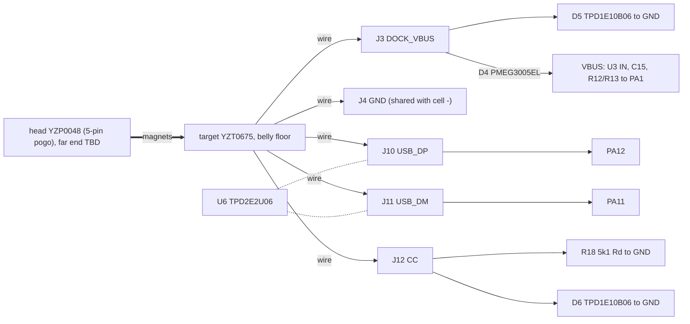

# SUB-DOCK-USB: magnetic dock, USB FS, DFU, ESD, dock detect
Rev MZ-2 2026-10-07: Phase-2 board (ECR-0018): every dock pad on B in the rear pad zone (board x 25-30), D5/D6 TPD1E10B06 beside J3/J12, D4 PMEG3005EL SOD-882, R12/R13/R18 0201; belly is all tub (shell_r2), no USB-C keep-out carried; Rev F/G facts -> "Reference design" at the end.
Status: schematic = Rev G block DOCK_USB with the MZ-2 packages (`hw/pod/pod_mz2.net`; bom_check [nets] PASS 2026-10-07). Board `hw/pod/draft_r2/out/routed.kicad_pcb` (f6291e6): DRC 0, 0 unconnected. Contact pin order, cable side, DFU firmware not designed. Updated 2026-10-07.
abbr: DK-nn = this doc's open-issue ids (stable; external docs cite "sub-dock-usb issue nn" = DK-nn). pod x = board x + 30.55, pod z = board y - 8.45 (left pod; dims_r2 PCB, bpt()). F = board face to lid, B = face to cell. MZ-2 = Phase-2 package set. VHB = 3M VHB 4914 tape.
src: `hw/current.yaml`, `hw/pod/gen.py` (block DOCK_USB; MZ2 table L93), `hw/pod/draft_r2/out/routed.kicad_pcb` (probe 2026-10-07), `hw/mech/dims_r2.py` (`DOCK`, `BAY`, `CELL`, `PCB`), `hw/mech/shell_r2.py` (tub(): dock window), `docs/build/bom.md`, `docs/system/integration-map.md` (authoritative pins/nets)
owner: O12(a)(b), O16(3)(5)(6), O10, O9/O15, O18, O19, O21, O26 · ECRs open: ECR-0008 (connector stock), ECR-0009 (no exciter output while VBUS present), ECR-0015 PER-01D/SIZ-06 (4-contact dock, USB-C fallback; not adopted), ECR-0018 (Phase 2), ECR-0019 (O31: drop the USB-C fallback; Rd/J12/D6 leave the pod; proposed) · relations: R-PWR-DOCK, R-PROC-DOCK, R-DOCK-BODY, R-DOCK-BOARD (tools/plm.py)

> 2026-10-07 (round 10, packet Q1): dims_r2.py / heel.py / dock_route.py / shell_r2.py / blade.py now take a NON-DEFAULT variant (ULTRASONIC_DESIGN=k1|k1p via hw/current.yaml blocks + hw/mech/dims.py). Phase-2 values are byte-identical (74-name dims snapshot; shell, heel, dock_route, board_in_pod, mass and interfaces outputs unchanged apart from new info fields). K1 facts: reg-pod-body.md Variants.

## Purpose
- functions: F9 dock detect, F10 USB data/DFU, F15 ESD at exposed contacts, input half of F5 charge (integration-map §1).
- O12a: one magnetic cable = charge + firmware (USB FS, ST ROM DFU). O10: bonded build updatable without cutting. O12b: IPX4 min, IPX5 preferred. O16(3): bought magnetic connector, no connector board; sealed USB-C space reserved.

## Signal path (diagram: `docs/diagrams/schematic-rev1.png`, nets == Phase 2; omits CC, DK-14)

- DOCK_VBUS (J3, exposed) -> D5 clamp beside the pad (bidirectional) -> D4 reverse block -> VBUS. src gen.py DOCK_USB.
- dock detect: VBUS/2 via R12/R13 -> PA1 VBUS_SENSE. src gen.py DOCK_USB.
- CC: J12 -> R18 Rd + D6 ESD; CC not sensed (PA3 free). ILIM policy = by USB enumeration (ECR-0013 F1). src gen.py DOCK_USB.
- data: J10/J11 -> PA12/PA11 USB FS PHY (internal pull-up), U6 shunt clamp. src gen.py DOCK_USB.
- undocked: no DC on exposed contacts: J3 floats behind D4 + U3 input blocking; VBUS bleeds to 0 V via R12/R13. Condition: firmware keeps PA11/PA12 analog (reset state) and USB pull-up off while VBUS absent.

## Elements
Positions: routed board probe 2026-10-07 (board mm), all on B. LCSC from `hw/pod/bom_jlc_mz2.csv` (2026-10-07).

| Ref | Part (gloss) | LCSC · class · stock · $ (src, date) | Placement (board x,y, face) · notes |
|---|---|---|---|
| target | Xinyangze YZT0675-20048-05025-01: 5-pos magnetic connector, pod side; PA9T, brass 3 µ″ Au/Ni, 2 NdFeB magnets, −20…70 °C | C5126848 · Ext · 51 · $2.38 (JLC API 2026-10-02T00:02Z) | hand-installed: glued in the belly window of the tub, back potted; not JLC-placed |
| head | YZP0048-20048-05025-01: 5-pin cable-side pogo head | C5126847 · Ext · 0 · $1.39 (JLC API 2026-10-02T00:03Z) | bom.md still lists C5126845 = 4-pin head (2026-10-07): DK-01 |
| D5 | TI TPD1E10B06DPYR: 1-ch bidirectional ESD diode, 5.5 V working, X1SON-2 1.0×0.6 | C48260 · Ext · 299k · $0.0417 (bom.md, JLC API 2026-10-02T23:48Z) | (25.0, 3.5) B: DOCK_VBUS pad (25.5, 3.5), 1.84 mm from J3 centre (25.1, 1.7); pad edge gap 1.0 (probe 2026-10-07). 12 pF, 100 nA max leak (sourcing-lock.csv). clamp V [TBD: tpd1e10b06.pdf not read]. bom_check stock-lock WARN: C48260 only ALTERNATE in the lock (2026-10-07) |
| D6 | same part as D5, on J12 CC (ECR-0017, O24) | C48260 | (25.0, 4.35) B: CC pad (25.5, 4.35), 1.5 mm from J12 centre (27.0, 4.35) |
| D4 | Nexperia PMEG3005EL: 30 V 0.5 A Schottky, SOD-882 (DFN1006-2), 0.50 mm max height; series DOCK_VBUS->VBUS (reverse-dock block) | C282565 · Ext · 43,342 · $0.115 (bom.md, JLC API 2026-10-07T11:31Z) | (22.9, 1.0) B. VF 295 / 430 mV typ at 100 / 500 mA; ~0.07 W, Tj ~71 °C at the ~0.2 A docked load (ECR-0018 MZV-06, PASS) |
| U6 | TI TPD2E2U06DRLR: 2-ch low-C USB ESD clamp, SOT-553 | C1972959 · Ext · 7,653 · $0.32 (JLC API 2026-10-02T00:02Z) | (25.1, 6.8) B; pins 3 USB_DP (25.8, 7.3), 5 USB_DM (24.4, 6.3), 4 GND. 1.5 pF, 10 nA, 5.5 A 8/20 µs (listing). shunt only |
| R18 | 5.1 kΩ 0201 (0201WMF5101TEE): USB-C Rd (sink identity on CC) | C270344 | (25.0, 5.25) B |
| R12, R13 | 100 kΩ / 100 kΩ 0201: VBUS/2 -> PA1 | C270364 | (17.4, 4.4 / 3.55) B. 25 µA docked |
| C15 | Murata GRM155R61E475ME15D 4.7 µF 25 V X5R 0402 on VBUS (charger IN) | C2858031 · Ext · 135k · $0.0833 (bom.md, JLC API 2026-10-02T23:50Z) | (20.9, 3.4) B beside U3 A2. ≤ 10 µF USB attach limit; 25 V per TI SLUSE99C §9.2.2.1 |
| J3 | 1.0 mm round wire pad, DOCK_VBUS | – | (25.1, 1.7) B = pod x 55.65 |
| J4 | 1.0×2.0 mm wire pad `pod:WirePad_1.0x2.0mm`, GND: dock GND + cell − | – | (27.0, 1.9) B, long axis along y, between J3 and J5 (ASM-09) |
| J10, J11, J12 | 1.0 mm wire pads USB_DP, USB_DM, CC | – | J10 (28.9, 5.5), J11 (27.0, 6.55), J12 (27.0, 4.35) B |
| R1 (MCU block) | 10 kΩ 0402 BOOT0 (PH3) pull-down (0402 kept as a hand hook, O18) | C25744 | (2.07, 3.85) B; R1 pad = DFU tack point (integration-map F14) |
| USB-C fallback | Same Sky UJ32-C-H-G-MSMT: IP68 USB-C receptacle 6.75×8.55×2.76 mm | not fitted; price TBD (bom.md) | dropped by owner ruling O31 (2026-10-08): no keep-out; fallback if the dock fails = clip-on USB-C adapter outside the pod. ECR-0019 proposes Rd R18, J12, D6 leave the pod (Rd to the head) |

Neighbour wire pads (copper edge gap, routed board probe 2026-10-07, after the J3/J4 swap 20bd842; all ≥ 0.8 mm = MZD-10 holds): J3 DOCK_VBUS–J4 GND 0.90 (dock supply short); J3–J5 VBAT 2.85 (J4 between them, ASM-09; PWR-I17 closed); J4 GND–J5 VBAT 0.90; J4–J12 CC 0.95; J4–J9 TS 0.96; J10 USB_DP–J11 USB_DM 1.17; J12 CC–J9 TS 1.17. J4 GND to D5's DOCK_VBUS pad 0.76. Check: bring-up step 1 meters neighbours (sub-debug-test).

### Contact map (target pin order TBD, not recorded: DK-02)
| Target pos | Pad | Net | If head mates rotated 180° (1↔5, 2↔4) |
|---|---|---|---|
| TBD | J3 | DOCK_VBUS | depends on order; −5 V on J3: D4 blocks, D5 (bidirectional) does not conduct |
| TBD | J4 | GND | |
| TBD | J10/J11 | USB_DP/USB_DM | swapped: no enumeration, no damage |
| TBD | J12 | CC | 5 V on CC -> R18: ~1 mA, ~5 mW; D6 (5.5 V working) does not conduct; no MCU pin |
rec: check magnet keying on a sample; if unkeyed, VBUS on centre pin 3 so a rotated mate only swaps D+/D− and GND/CC (harmless). Same rule = ECR-0015 PER-01D fail branch.

## Interfaces
| To | Nets / pins (integration-map) | Invariant |
|---|---|---|
| sub-power (R-PWR-DOCK) | VBUS -> U3.A2 IN, C15 | U3 VIN 3.0–5.5 V, OVP 5.5–5.9 V, 25 V tolerant (SLUSE99C). ILIM 500 mA default; firmware holds 100 mA until enumeration, then ICHG 170 mA (ECR-0013 F1). Docking fires U3 power-good on CHG_INT (PA15) |
| sub-processing (R-PROC-DOCK) | USB_DP PA12, USB_DM PA11 (AF10, HSI48 + CRS); VBUS_SENSE PA1; CHG_INT PA15; N$1 PH3 BOOT0 (R1) | VDDUSB 3.0–3.6 V bonded to VDD on QFN48 (A3-u575-plan §3). PA1 ~2.2–2.5 V docked: ADC input; wake on CHG_INT, not PA1 (digital-high margin unverified). PA3, PA10 not dock signals |
| sub-ui | BTN PA0 | proposed DFU gesture: button held at reset with VBUS present (DK-04) |
| sub-debug-test | TP1 SWDIO, TP2 SWCLK, TP3 NRST | SWD = only recovery from a broken app. Phase 2: TP1–TP6 are bare pads on F in per-pad VHB cut-outs, reachable only before the lid is bonded (field recovery = ROM DFU via the R1/PH3 tack pad + dock USB, ECR-0018 log 2026-10-03) |
| reg-board (R-DOCK-BOARD) | B face, rear pad zone x 25–30 (dims_r2 PAD_ZONE): J3 (25.1, 1.7), J4 (27.0, 1.9), J10 (28.9, 5.5), J11 (27.0, 6.55), J12 (27.0, 4.35); D5/D6 x 25.0 beside J3/J12; U6 (25.1, 6.8); D4 (22.9, 1.0); R18 (25.0, 5.25); R12/R13 (17.4, 4.4/3.55); C15 (20.9, 3.4) | Wire-pad gaps ≥ 0.8 mm (MZD-10; min J3–J4 0.90); J4 GND between J3 and J5 (ASM-09). Routed USB: DP 23.4 mm / 2 vias, DM 23.2 mm / 2 vias, 0.1 mm, not a coupled pair (FS 12 Mb/s, mismatch irrelevant); DOCK_VBUS 4.1 mm / 0 vias; CC 2.5 mm / 0 vias (routed board probe 2026-10-07) |
| reg-pod-body (R-DOCK-BODY) | `DOCK` x 31.5–52.7, y 5.72–12.58, z −11.75…−8.95 (YZT0675 21.2 × 6.86 × 2.8); window +0.1/side cut through the belly (shell_r2 tub()); `BAY` x 30.3–54.2, z −10.95…−8.9; seam steps so the whole belly is tub (shell_r2 docstring) | target flush in the belly floor, glued, potted. Belly depth 2.05 assumes flat (bent) tails (dims_r2 BELLY_D). No USB-C keep-out in shell_r2 (DK-10) |
| physical / reg-board | 5 wires target -> J3/J4/J10/J11/J12 | route belly (x ≤ 54.2) -> past the cell (cell x 30.6–65.6, 1.1 mm rear gap to the wall at 66.7) -> stowage space behind the board (pod x 60.55–66.7) -> B pads at pod x 55.55–60.55, soldered before the board is hung on the lid; not drawn (DK-05) |

## Constraints
- O12(a) USB FS + ROM DFU via dock; O12(b) IPX4 min/IPX5 pref; O16(3) bought magnetic connector, USB-C space reserved; O16(5) one board both pods; O16(6) no housing screws; O10 bonded but cut-openable; O9/O15 rev 1 = prototype, testable.
- F15: exposed metal = dock contacts only. ESD: J3 -> D5 (25.0, 3.5) B; J10/J11 -> U6; J4 = GND; J12 CC -> D6 TPD1E10B06 (25.0, 4.35) B (ECR-0017, O24) + R18.
- USB FS: VDDUSB 3.0–3.6 V vs +3V0 2.955–3.045 V (TPS7A20 ±1.5 %, SBVS338H §5.5); functional to 2.7 V (DS13737 Rev 10 Table 150 fn 1, verified 2026-10-02). DK-06.
- U3 needs VIN > VBAT + ~135 mV to leave sleep (SLUSE99C §7.5).

## Key numbers
| Quantity | Value | src (date) |
|---|---|---|
| target body | 21.20 × 6.86 × 2.80 mm + 5.03 mm tab (outline 9.17) + 5 × Ø0.70 tails 2.0 mm | Xinyangze drawing YZT0675-20048-05025-01 A.1, 2022-03-24 (LCSC PDF, fetched 2026-10-01) |
| contacts | 5 @ 2.5 mm; 50 mΩ; 10,000 cycles; 1,000 MΩ; 500 VAC | same + JLC listing 2026-10-02T00:02Z |
| head rating | 12 V 1 A (4-pin -04025-03); 5-pin not listed | JLC listing 2026-10-02T00:02Z |
| dock current | ≤ ~180 mA (170 mA charge + system + 0.75 mA U3 Iq) | sub-power (derived) |
| D4 drop / heat | ~0.36 V, ~0.07 W, Tj ~71 °C at ~0.2 A, 35 °C ambient | ECR-0018 MZV-06 (Nexperia data sheet read 2026-10-03) |
| VBUS_SENSE | VBUS/2 ≈ 2.2–2.5 V at PA1 | gen.py R12/R13 (derived) |
| ESD | D5 12 pF, 100 nA, clamp [TBD]; U6 1.5 pF, 5.5 A | sourcing-lock L23 (2026-09-30); JLC listing 2026-10-02T00:02Z |
| D5 working V vs VBUS | 5.5 V working vs USB 2.0 VBUS ≤ 5.25 V; USB-C vSafe5V upper limit [TBD, spec not read here] | gen.py D5 comment |
| target back face -> cell bottom | 0.85 mm (z −8.95 -> −8.1) for flat tails + wires + potting | dims_r2 `DOCK`, `CELL` (derived 2026-10-07) |

### DFU path (planned; no code)
1. dock: U3 power-good -> CHG_INT -> PA15 wakes MCU from Stop 2; firmware writes charger plan (sub-power), confirms VBUS on PA1, ILIM 100 mA until enumeration (ECR-0013 F1).
2. mode: charge only (default) | CDC self-test (O15) | update.
3. update: BOOT0 tied low (R1) -> ROM bootloader only via software jump (boot stub) or option bytes. Stub sets U3 WATCHDOG_SEL = 11 before the jump (bootloader never talks I2C; sub-power issue 3 option B would power-cycle a > 160 s session). Enumerates USB DFU on PA11/PA12, HSI48 + CRS. PA10 (GB_P): ROM loader pulls it up itself (AN2606 Table 199, gen.py) and R5 holds it high -> USART1 detect stays quiet. B-session/VBUS detection by the ROM loader on this package (no OTG VBUS pin; PA9 free) [TBD AN2606]: DK-17.
4. broken app: stub never runs -> ROM DFU by tacking BOOT0 high at the R1 pad (lid off) or SWD on TP1/TP2 (F pads, lid off); bonded build = cut open (O10).

## Open issues
- DK-01 (BOM fixed 2026-10-07) bom.py/bom.md now list the 5-pin head YZP0048-20048-05025-01 (C5126847) that mates the 5-pin target; it was C5126845 = the 4-pin -04025-03 head. JLC stock of C5126847 is 0 (JLC API 2026-10-07T17:14Z; no other 5-pin YZP0048 in stock): it is a loose cable-side buy, so check LCSC / Xinyangze at order time (order package). Fallback: ECR-0015 PER-01D 4-contact dock (drops CC; not adopted, MZD-9 keeps 5).
- DK-02 contact order + magnet keying unknown. closes: sample in hand (blocked by O21); record order in gen.py + here.
- DK-03 CAD envelope incomplete: `dims_r2.DOCK` is the 21.2 × 6.86 × 2.8 body only; the 5.03 mm tab is not modelled; the 2.05 mm belly assumes tails bent flat (BELLY_D comment, ECR-0015 SIZ-06 idea) leaving 0.85 mm under the cell for tails + wire + potting; LCSC calls it "spring pogo pin receptacle" (pod-side springs = sealing concern). closes: caliper a sample; bend/trim tails, place/cut tab, update dims_r2 (reg-pod-body).
- DK-04 sealed-pod update path (owner): (A, rec) boot stub in a write-protected first flash sector: button held at reset + VBUS -> ROM DFU; (B) dual-bank A/B; (C) SWD-only (cut open). closes: AN2606 U5 DFU entry read + stub written.
- DK-05 dock wire route routed 2026-10-07 in BOTH pods (`hw/mech/dock_route.py`, out/dock_route.json, plot sim/out/mech/dock_route.png): tails' end [A x 52.9] → flat ribbon under the cell (z −8.5) → cell-side half of the 1.1 rear gap (x 65.85; the arm bundle keeps the wall side) → climb to each pad's z → up to y 11.55 → under the board's rear edge → pad. Right pod: dock pads low (z −6.75..−1.9), arm high; worst clearance to the arm bundle 0.19 mm, to the cell 0.13, lengths 31-35 mm. **Left pod (board flipped in the mirrored shell): dock pads high (z −3.0..+1.85), arm pads low**, so the dock wires climb past the arm exit: worst 0.11 mm (VBUS vs arm bundle), lengths 34-42 mm. **v2 2026-10-07 (clearance ≥ 0.3):** the ribbon climbs in y while low (z −8.5, ~3 mm under the arm exit), then climbs in z ABOVE the cell in the stowage behind the board at y 12.55 (cell top 10.7, lid 13.2), where the arm bundle (y ≤ 11.6) never is, and drops to the edge level only at its pad's z. Worst clearances: right pod arm bundle 2.41, arm wires 0.98; left pod arm bundle 0.58, arm wires 0.98; cell 0.28, cavity walls 0.28 (= centred in the 0.8 under-cell channel); lengths 27-38 mm. Superseded: v1 climbed inside the rear gap (0.19 right / 0.11 left). Hold + check: physical.md assembly step 11. heel.py models only the right pod's arm route (new backlog ARM-LEFT).
- DK-06 USB supply margin: +3V0 down to 2.955 V vs VDDUSB 3.0 V min; functional to 2.7 V (DS13737 Rev 10 Table 150 fn 1). (A, rec) bench enumeration + full DFU at 2.95 V on TP4 (R20 lifted), sub-debug-test bring-up step 6; (B) higher-V LDO (re-check mic, bridge gain, spec §7). closes: that test.
- DK-07 sealing unanalysed: spec O10 cites `docs/research/sealing-and-service.md` (does not exist, checked 2026-10-02). Leak paths: glue line, contact bores, tab. Docked + wet: 5 V across 3 µ″ Au electrolyses VBUS: dry before docking. closes: IPX4/IPX5 spray test of a potted target in a printed coupon. Note written 2026-10-07: `docs/research/sealing-and-service.md` (leak paths S1-S7 with a seal each, service, IPX4/IPX5 coupon plan; finding: a non-porous vent membrane fails R14, so the mic path relies on a hydrophobic open mesh). Dock: path S5 (RTV glue + removable silicone potting; the pod-side spring question stays with DK-03).
- DK-09 cable side **written 2026-10-07** (diagram `docs/diagrams/dock-cable.svg`, render.sh for the PNG): **(A, rec) USB-C plug with CC wired through to the head pin that lands on J12**: a USB-C source turns VBUS on only after it sees the pod's Rd (R18 5k1) on CC, so a C plug without CC gives 0 V on every C-to-C charger; (B) USB-A plug: VBUS always on, no CC, so ILIM stays 100 mA until USB enumerates (PWR-I13; on a dumb charger the pod charges at 100 mA ≈ 0.57C). Cable ~1 m, 5 conductors (4 for USB-A), D+/D− twisted; head = YZP0048-20048-05025-01 (DK-01); strain relief = heat-shrink over the jacket and the solder cups + hot-melt fill. Pin order: from a sample (DK-02, O21). Owner builds or buys it at the order package.
- DK-10 (closed 2026-10-08, O31) the USB-C fallback reservation is dropped: owner "I think we can drop USB-c if we have a mag system working". Condition: the magnetic dock proves USB FS + ROM DFU + charging at bring-up. ECR-0019 (proposed) removes J12/R18/D6 from the pod and puts Rd in the head; the board still carries them until the K4 re-plan adopts it.
- DK-11 magnets near L1: L1 at board (15.65, 7.0) B = pod x 46.2, inside the target's x span (31.5–52.7). Left pod z −1.45, ~7.5 mm above the target top (z −8.95); right pod (board mirrored, y -> 12 − y) z −3.45, ~5.5 mm (dims_r2 bpt, derived 2026-10-07). Field unknown. closes: E11 (whine) and S1 tested on the RIGHT pod (closer), docked and undocked.
- DK-13 stale docs (not edited here; re-checked 2026-10-02): `docs/build/hardware.md` §0.6, §6; `hw/mech/notes/shell.md`; `hw/mech/notes/electronics.md`; `docs/research/pcb-mech-interface.md` §5 (lid-screw charging, MCP7383x); `B-parts-selection.md` §6; `docs/learn/make_board_parts.py` L42 R1 "100 kΩ" (gen.py L155: 10k). **Closed 2026-10-07:** values/comments fixed (learn script R1 10 kΩ, R10 2.2 kΩ; gen.py and pad.md 'VSYS'; provenance SW1 = KMT022) and dated 'superseded in parts' banners on electronics.md, shell.md, pcb-mech-interface.md, B-parts-selection.md.
- DK-14 diagrams: **drawn 2026-10-07**: belly-bay section `docs/diagrams/belly-section.svg` (make_belly_section.py, from dims_r2: window, target, flat tails [A], potting [A], ribbon to the rear gap, cell) and the cable/contact picture `dock-cable.svg` (DK-09). `schematic-rev1.svg` still omits CC (stale Rev E picture).
- DK-16 dock wire **picked 2026-10-07**: solderable polyurethane enamelled copper, heavy build (NEMA MW 79/80-C class, solder-through, no stripping): **VBUS + GND 32 AWG (OD ≤ 0.249 mm, 0.53 Ω/m)**, **D+, D−, CC 36 AWG (OD ≤ 0.160, 1.35 Ω/m), D+/D− twisted** (Elektrisola EnCuWire NEMA-inch data sheet, PDF mod 2014-04-07, SHA-256 0a275378d995e50b). At ≤ 50 mm [derived route length] and the 500 mA ILIM ceiling: 32 AWG drops 13 mV / 6.6 mW per wire (USB-FS at 12 Mbit/s over 50 mm needs no impedance control). Fill: laid flat side by side the five are 0.98 mm wide × 0.25 high (twisted pair 0.32): fits the 0.8 under-cell slack beside the tails with ≥ 0.48 for potting, or the 1.1 rear gap. Enamel is not abrasion-proof: sleeve the bundle where it turns over the cell edge (same pre-shrunk tube as the arm, reg-arm issue 12) [A]. Replaces hardware.md's Adafruit 30 AWG silicone OD 0.8 charge lead. Buying waits for O21. Unblocks DK-05 (route).
- DK-17 ROM DFU VBUS sensing. **Corrected 2026-10-07:** this package does have the OTG VBUS pin: **PA9 (pin 30) = USB_OTG_FS_VBUS** (ST open pin data `STM32U575CIUxQ.xml`), and the design leaves it NC (gen.py L343-345). RM0456 Rev 7 §OTG: VBUS sensing is needed only with HNP/SRP; a device can force B-session valid in software (OTG_GOTGCTL BVALOEN/BVALOVAL; VBDEN off). Evidence the ROM does not use PA9 for sensing: AN2606 Rev 69 Table 199 (read earlier, see sub-debug-test ROM table) lists PA9 as USART1_TX output while the loader scans interfaces. Not proven: whether the USB DFU path forces B-session itself (AN2606 STM32U5 USB section not re-read; ST refuses scripted downloads, 2026-10-07). Options (backlog DK-17D): **(A, rec)** add a series resistor DOCK_VBUS → PA9 (one 0201, value [TBD vs PA9's FT rating in DS13737]) at the next layout pass: cheap insurance for the only field-update path of a sealed pod; (B) read AN2606 in a browser first and add it only if the ROM needs VBUS; (C) leave NC and find out at bring-up step 6 (a QFN pin-30 bodge is hard). closes: AN2606 read + bring-up step 6. **Decided: option A** (decided 2026-10-07, decisions-log 9330d9c): add the DOCK_VBUS → PA9 series resistor at the next layout pass (router). **Round 8 (2026-10-07):** R24 designed but does not route locally (reg-board issue 22); backed out until a full re-route or option B/C.
- DK-18 D5 vs dock VBUS: **datasheet read 2026-10-07** (TI SLLSEB1G, rev Aug 2024, SHA-256 prefix 6ffe72cb5f5e607f): V_RWM 5.5 V; I_LEAK ≤ 100 nA at 5 V (the only point given); V_BR ≥ 6 V at 1 mA, bidirectional. USB 2.0 VBUS ≤ 5.25 V and Type-C vSafe5V ≤ 5.5 V [A: limits from memory, not re-read] sit at or below V_RWM, so D5 stays off (≤ 0.5 µW at 5 V; only while docked, so it costs nothing in the Off budget). Between 5.5 and 6 V the leakage is unspecified; a non-compliant 6 V source pushes ~1 mA (6 mW, harmless to D5). D6 on J12 CC sees ≤ 5.5 V as well. Remaining: bring-up meters DOCK_VBUS current with the cable only (sub-debug-test step 1).
- closed Rev F (gen.py docstring L37-44): DK-08 CC clamp (CC reaches no MCU pin; R19 removed), DK-12 R11 (removed; ROM loader pulls PA10 up), DK-15 exposed DOCK_VBUS clamp (D5 at J3).

## Before you change this, check
- connector part / pin order: contact map (rotated-mate harm), bom.py, CAD window + tab, cell clearance over tails, sealing coupon (DK-07).
- D4/D5/U6/R18: sub-power VBUS limits; F15 ESD on every exposed contact; C15 ≤ 10 µF.
- USB pins, BOOT0, PA10, rail voltage: sub-processing pin map, DFU path, DK-06.
- pad positions (reg-board): wire route + rear-gap count (physical, reg-arm); wire-pad gaps ≥ 0.8 mm (MZD-10) and J4 GND kept between J3 and J5 VBAT (ASM-09; place_r2 NOT_NEIGHBOURS); D5/D6 stay beside J3/J12; D+/D− together.
- belly bay/window (reg-pod-body, dims_r2 DOCK/BAY), flat-tail belly depth: O12(b), O16(6), NiTi strut clearance.
- always: integration-map §10, `python3 tools/plm.py impact SUB-DOCK-USB`, `python3 tools/checks/interfaces.py`.

## Reference design (Rev F/G)
- hw/current.yaml `reference` (env `ULTRASONIC_DESIGN=revg`): `hw/pod/draft_r1/pod_r1_routed.kicad_pcb`, `hw/mech/shell_r1.py`; history = git.
- Dock pads on F at x 31.4 (J3/J4) and 33.0 (J10/J11/J12) with J4 GND between J3 and J5 (ASM-09); 0.60 mm pad gaps (J3–J4, J3–J10, J4–J5 ...); D5 on F at (29.9, 3.2); D6 on B behind J12; D4 1N5819WS SOD-323 (C191023, Basic); R12/R13/R18 0402.
- shell_r1: `DOCK` z −13.2…−10.4, 2.3 mm from the target back face to the cell; `USBC_KEEPOUT` x 47.9–55.0 declared (overlapped the target rear by 4.8 mm), never cut.

## K4 own dock (ECR-0021, proposed; not the current design until ECR-0019/0020/0021 are adopted)
src: `docs/research/k4-dock.yaml` option_A_design (2026-10-08), `hw/mech/dims_k4.py`, `hw/mech/shell_k4.py`, `sim/checks/dock_pull.py`. [T] = inferred, not from a datasheet.
- Target YZT0675 (C5126848) is replaced by the pod's own contacts: 4 castellated half-hole ENIG pads on the 0.8 mm tab of board M, pitch 2.5, order J3 DOCK_VBUS, J11 USB_DM, J10 USB_DP, J4 GND (USB-standard order; head wire order unknown, closes at the sample, DK-02). J12/R18/D6 gone (ECR-0019); D4, D5, U6 on M.
- Head: Xinyangze YZP0048-20048-04025-03, LCSC C5126845, 4-pin pogo, stock 46 on 2026-10-08, pitch 2.5, 1 A/pin, 30 gf/pin (listing). Unpublished [T]: magnet pitch (13.2 assumed), pogo stroke (>= 0.9), tip dia, magnet polarity.
- Seating: 2 N52 D2.5 x 1.0 magnets in the belly pockets; pull about 2.2 N vs spring 1.18 N, net about +1.0 N (idealised model, real 0.7-0.9x; sim/checks/dock_pull.py). Polarity keyed opposite to the head's.
- Finish: ENIG 2-5 u-inch (hard gold not offered on castellated edges, JLC blog 2026-10-08). Wear untested (O16-connector stage D).
- Sealing: 4 windows 1.3 x 1.2 in the 0.6 wall plus a 0.1 gap; inner UV acrylic/silicone fillet; sweat leakage between 1.6 mm-spaced barrels is the risk (dock unpowered unless a head is seated).
- DK-11 (open, 2026-10-08): caliper a C5126845 sample (magnet pitch, stroke, tip, polarity) before the shell freezes; fallback A2 = bought 4-pad dock chip in a belly window, wired to M. Magnets: sourcing step, nothing ordered (O21).
- Cross-doc: reg-pod-body (windows, pockets, +1.5 mm length), physical (envelope), reg-board (M tab at mid-plane y 6.8).
