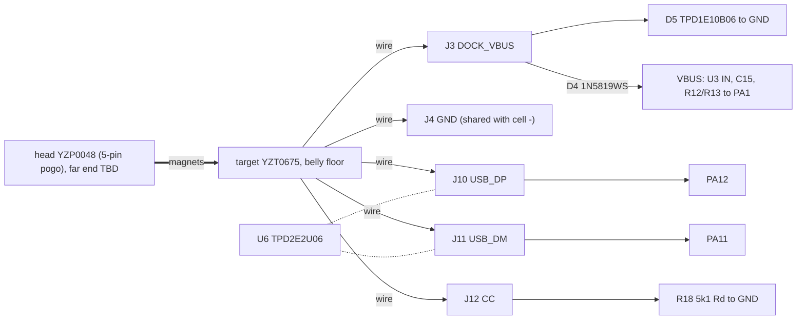

# SUB-DOCK-USB: magnetic dock, USB FS, DFU, ESD, dock detect
**Current design (2026-10-07): Phase 2, `hw/current.yaml` (ECR-0018); every tool and check defaults to it.** Dock pads J3/J4/J5/J10/J11/J12 on B in the rear columns (board x 25-29); D5/D6 ESD at J3/J12, U6 and D4 (PMEG3005EL SOD-882, C282565) on B; R12/R13 100k and R18 5k1 0201; dock target in the belly bay, the whole belly is tub; `shell_r2.py` carries no USB-C keep-out. The body below is the Rev F/G reference design (`ULTRASONIC_DESIGN=revg`) unless it says Phase 2; its Phase-2 rewrite is open.
Rev G 2026-10-02: D6 TPD1E10B06 at J12 CC (ECR-0017). Rev F 2026-10-02: D3 (behind D4) -> D5 TPD1E10B06 at J3; R19/CC_SENSE and R11 removed; J4 = shared dock GND + cell − pad between J3 and J5; C15 25 V; pads re-placed in two rear columns (gen.py docstring L35-60).
Status: schematic Rev F block DOCK_USB (gen.py, 2026-10-02); board autorouted 2026-10-02 (draft_r1/summary.json: 687 tracks, 118 vias, 2 unconnected, neither a dock net; DRC 19 courtyard overlaps: 18 J-pad ring pairs + 1 C1↔U1). Contact pin order, cable side, DFU firmware not designed. Updated 2026-10-02.
abbr: DK-nn = this doc's open-issue ids (stable; external docs cite "sub-dock-usb issue nn" = DK-nn). pod x = board x + 30.6 (place_r1.py docstring). F = board face to lid, B = face to cell.
src: `hw/pod/gen.py` (DOCK_USB L202-246), `hw/pod/place_r1.py` PLACE (L51-72), `hw/pod/draft_r1/pod_r1_routed.kicad_pcb`, `hw/mech/shell_r1.py` (`DOCK` L47, `BAY` L40, `USBC_KEEPOUT` L48, `CELL` L42), `docs/build/bom.md`, `docs/system/integration-map.md` (authoritative pins/nets)
owner: O12(a)(b), O16(3)(5)(6), O10, O9/O15, O18, O19, O21 · ECRs open: ECR-0008 (connector stock), ECR-0009 (no exciter output while VBUS present), ECR-0015 PER-01D/SIZ-06 (4-contact dock, USB-C fallback; OFF in B3 defaults) · relations: R-PWR-DOCK, R-PROC-DOCK, R-DOCK-BODY, R-DOCK-BOARD (tools/plm.py)

## Purpose
- functions: F9 dock detect, F10 USB data/DFU, F15 ESD at exposed contacts, input half of F5 charge (integration-map §1).
- O12a: one magnetic cable = charge + firmware (USB FS, ST ROM DFU). O10: bonded build updatable without cutting. O12b: IPX4 min, IPX5 preferred. O16(3): bought magnetic connector, no connector board; sealed USB-C space reserved.

## Signal path (diagram: `docs/diagrams/schematic-rev1.png`, Rev F; omits CC, DK-14)

- DOCK_VBUS (J3, exposed) -> D5 clamp at the contact (bidirectional) -> D4 reverse block -> VBUS. src gen.py L205-212.
- dock detect: VBUS/2 via R12/R13 -> PA1 VBUS_SENSE. src gen.py L231-235.
- CC: J12 -> R18 Rd only; CC not sensed (PA3 free). ILIM policy = by USB enumeration (ECR-0013 F1). src gen.py L246, L289-290.
- data: J10/J11 -> PA12/PA11 USB FS PHY (internal pull-up), U6 shunt clamp. src gen.py L236-242.
- undocked: no DC on exposed contacts: J3 floats behind D4 + U3 input blocking; VBUS bleeds to 0 V via R12/R13. Condition: firmware keeps PA11/PA12 analog (reset state) and USB pull-up off while VBUS absent.

## Elements
| Ref | Part (gloss) | LCSC · class · stock · $ (src, date) | Placement (board x,y, face) · notes |
|---|---|---|---|
| target | Xinyangze YZT0675-20048-05025-01: 5-pos magnetic connector, pod side; PA9T, brass 3 µ″ Au/Ni, 2 NdFeB magnets, −20…70 °C | C5126848 · Ext · 51 · $2.38 (JLC API 2026-10-02T00:02Z) | hand-installed: glued in belly window, back potted; not JLC-placed |
| head | YZP0048-20048-05025-01: 5-pin cable-side pogo head | C5126847 · Ext · 0 · $1.39 (JLC API 2026-10-02T00:03Z) | bom.md L31 lists C5126845 = 4-pin head: DK-01 |
| D5 | TI TPD1E10B06DPYR: 1-ch bidirectional ESD diode, 5.5 V working, X1SON-2 1.0×0.6 | C48260 · Ext · 299k · $0.0417 (bom.md L17, JLC API 2026-10-02T23:48Z) | (29.9, 3.2) F, pad edge 0.7 mm from J3; GND via 0.53 mm from its GND pad (routed pcb, 2026-10-02). 12 pF, 100 nA max leak (sourcing-lock.csv L23). clamp V [TBD: ti.com/lit/ds/symlink/tpd1e10b06.pdf not read] |
| D4 | 1N5819WS: 40 V 1 A Schottky, SOD-323, series DOCK_VBUS->VBUS (reverse-dock block) | C191023 · Basic · 4.86 M · $0.014 (JLC API 2026-10-02T00:02Z) | (27.22, 6.4) B. 600 mV at 1 A, 500 µA leak at 40 V (listing); drop at ~0.2 A unmeasured |
| U6 | TI TPD2E2U06DRLR: 2-ch low-C USB ESD clamp, SOT-553 | C1972959 · Ext · 7,653 · $0.32 (JLC API 2026-10-02T00:02Z) | (26.58, 8.6) B; 4 GND vias within 1.7 mm (routed pcb). 1.5 pF, 10 nA, 5.5 A 8/20 µs (listing). shunt only |
| R18 | 5.1 kΩ: USB-C Rd (sink identity on CC) | C25905 · Basic | (25.3, 10.4) B |
| R12, R13 | 100 kΩ / 100 kΩ: VBUS/2 -> PA1 | C25741 · Basic | (25.3 / 26.9, 2.2) B. 25 µA docked |
| C15 | Murata GRM155R61E475ME15D 4.7 µF 25 V X5R 0402 on VBUS (charger IN) | C2858031 · Ext · 135k · $0.0833 (bom.md L24, JLC API 2026-10-02T23:50Z) | (21.2, 2.2) B beside U3. ≤ 10 µF USB attach limit; 25 V per TI SLUSE99C §9.2.2.1 (gen.py L228) |
| J3 | 1.0 mm round wire pad, DOCK_VBUS | – | (31.4, 3.0) F = pod x 62.0 |
| J4 | 1.0×2.0 mm wire pad `pod:WirePad_1.0x2.0mm`, GND: dock GND + cell − | – | (31.4, 5.1) F, between J3 and J5 VBAT (ASM-09): J3–J5 edge gap 3.2 mm via J4 |
| J10, J11, J12 | 1.0 mm wire pads USB_DP, USB_DM, CC | – | (33.0, 3.0 / 4.6 / 6.2) F = pod x 63.6 |
| R1 (MCU block) | 10 kΩ BOOT0 (PH3) pull-down | C25744 · Basic | (17.0, 1.6) F; R1 pad = DFU tack point (integration-map F14) |
| USB-C fallback | Same Sky UJ32-C-H-G-MSMT: IP68 USB-C receptacle 6.75×8.55×2.76 mm | not fitted; price TBD (bom.md L33) | keep-out only (DK-10) |

Neighbour pads at 0.6 mm edge gap (solder-bridge pairs; place_r1 L51-54): J3–J4, J3–J10, J4–J11, J10–J11, J11–J12, J12–J1 (OUT_A), J4–J5 (GND–VBAT, cell short) and J4–J12 (GND–CC). Worst: J3–J10 puts DOCK_VBUS on PA12 when docked; PA12 5 V tolerance [TBD DS13737 pin table]. Check: bring-up step 1 meters neighbours (sub-debug-test).

### Contact map (target pin order TBD, not recorded: DK-02)
| Target pos | Pad | Net | If head mates rotated 180° (1↔5, 2↔4) |
|---|---|---|---|
| TBD | J3 | DOCK_VBUS | depends on order; −5 V on J3: D4 blocks, D5 (bidirectional) does not conduct |
| TBD | J4 | GND | |
| TBD | J10/J11 | USB_DP/USB_DM | swapped: no enumeration, no damage |
| TBD | J12 | CC | 5 V on CC -> R18 only: ~1 mA, ~5 mW (no MCU pin since Rev F) |
rec: check magnet keying on a sample; if unkeyed, VBUS on centre pin 3 so a rotated mate only swaps D+/D− and GND/CC (harmless). Same rule = ECR-0015 PER-01D fail branch.

## Interfaces
| To | Nets / pins (integration-map) | Invariant |
|---|---|---|
| sub-power (R-PWR-DOCK) | VBUS -> U3.A2 IN, C15 | U3 VIN 3.0–5.5 V, OVP 5.5–5.9 V, 25 V tolerant (SLUSE99C). ILIM 500 mA default; firmware holds 100 mA until enumeration, then ICHG 170 mA (ECR-0013 F1). Docking fires U3 power-good on CHG_INT (PA15) |
| sub-processing (R-PROC-DOCK) | USB_DP PA12, USB_DM PA11 (AF10, HSI48 + CRS); VBUS_SENSE PA1; CHG_INT PA15; N$1 PH3 BOOT0 (R1) | VDDUSB 3.0–3.6 V bonded to VDD on QFN48 (A3-u575-plan §3). PA1 ~2.2–2.5 V docked: ADC input; wake on CHG_INT, not PA1 (digital-high margin unverified). PA3, PA10 not dock signals since Rev F |
| sub-ui | BTN PA0 | proposed DFU gesture: button held at reset with VBUS present (DK-04) |
| sub-debug-test | TP1 SWDIO, TP2 SWCLK, TP3 NRST | SWD = only recovery from a broken app; lid-off only. TP2 SWCLK unrouted in draft (summary.json) |
| reg-board (R-DOCK-BOARD) | J3/J4 x 31.4, J10/J11/J12 x 33.0, F; D5 F at J3; D4, U6, R12/R13, R18, C15 B (table above) | D5 and U6 each with own GND via (holds in routed pcb). Routed USB: DP 22.1 mm / 3 vias, DM 21.3 mm / 2 vias, mostly In2 over In1 GND, not a coupled pair (routed pcb 2026-10-02; FS 12 Mb/s, mismatch irrelevant). Layout session (O14) may re-route |
| reg-pod-body (R-DOCK-BODY) | `DOCK` x 31.5–52.7, y 6.32–13.18, z −13.2…−10.4; window +0.1/side (21.4 × 7.06); `BAY` x 30.3–54.2, z −12.4…−8.9; `USBC_KEEPOUT` x 47.9–55.0, y 5.45–14.05, z −12.4…−9.6 | target flush in belly floor, glued, potted (tolerances.md). USB-C keep-out overlaps target rear 4.8 mm: either/or |
| physical / reg-board | 5 wires target -> J3/J4/J10/J11/J12 | route belly (x ≤ 54) -> rear pads (x 62–63.6, F) not drawn (DK-05) |

## Constraints
- O12(a) USB FS + ROM DFU via dock; O12(b) IPX4 min/IPX5 pref; O16(3) bought magnetic connector, USB-C space reserved; O16(5) one board both pods; O16(6) no housing screws; O10 bonded but cut-openable; O9/O15 rev 1 = prototype, testable.
- F15: exposed metal = dock contacts only. ESD: J3 -> D5 (at contact); J10/J11 -> U6; J4 = GND; J12 CC -> D6 TPD1E10B06 (Rev G, ECR-0017, O24; B behind J12 at (32.6, 6.2), one via) + R18.
- USB FS: VDDUSB 3.0–3.6 V vs +3V0 2.955–3.045 V (TPS7A20 ±1.5 %, SBVS338H §5.5); functional to 2.7 V (DS13737 Rev 10 Table 150 fn 1, verified 2026-10-02). DK-06.
- U3 needs VIN > VBAT + ~135 mV to leave sleep (SLUSE99C §7.5).

## Key numbers
| Quantity | Value | src (date) |
|---|---|---|
| target body | 21.20 × 6.86 × 2.80 mm + 5.03 mm tab (outline 9.17) + 5 × Ø0.70 tails 2.0 mm | Xinyangze drawing YZT0675-20048-05025-01 A.1, 2022-03-24 (LCSC PDF, fetched 2026-10-01) |
| contacts | 5 @ 2.5 mm; 50 mΩ; 10,000 cycles; 1,000 MΩ; 500 VAC | same + JLC listing 2026-10-02T00:02Z |
| head rating | 12 V 1 A (4-pin -04025-03); 5-pin not listed | JLC listing 2026-10-02T00:02Z |
| dock current | ≤ ~180 mA (170 mA charge + system + 0.75 mA U3 Iq) | sub-power (derived) |
| VBUS_SENSE | VBUS/2 ≈ 2.2–2.5 V at PA1 | gen.py R12/R13 (derived) |
| ESD | D5 12 pF, 100 nA, clamp [TBD]; U6 1.5 pF, 5.5 A | sourcing-lock L23 (2026-09-30); JLC listing 2026-10-02T00:02Z |
| D5 working V vs VBUS | 5.5 V working vs USB 2.0 VBUS ≤ 5.25 V; USB-C vSafe5V upper limit [TBD, spec not read here] | gen.py L209 |
| target back face -> cell bottom | 2.3 mm (z −10.4 -> −8.1) for tails + wires + potting | shell_r1 `DOCK`, `CELL` (derived) |

### DFU path (planned; no code)
1. dock: U3 power-good -> CHG_INT -> PA15 wakes MCU from Stop 2; firmware writes charger plan (sub-power), confirms VBUS on PA1, ILIM 100 mA until enumeration (ECR-0013 F1).
2. mode: charge only (default) | CDC self-test (O15) | update.
3. update: BOOT0 tied low (R1) -> ROM bootloader only via software jump (boot stub) or option bytes. Stub sets U3 WATCHDOG_SEL = 11 before the jump (bootloader never talks I2C; sub-power issue 3 option B would power-cycle a > 160 s session). Enumerates USB DFU on PA11/PA12, HSI48 + CRS. PA10 (now GB_P): ROM loader pulls it up itself (AN2606 Table 199, gen.py Rev F) and R5 holds it high -> USART1 detect stays quiet. B-session/VBUS detection by the ROM loader on this package (no OTG VBUS pin; PA9 free) [TBD AN2606]: DK-17.
4. broken app: stub never runs -> only SWD (TP1/TP2) recovers; bonded build = cut open (O10).

## Open issues
- DK-01 BOM pairs 5-pin target with a 4-pin head: bom.md L31 C5126845 = YZP0048-20048-04025-03 ("4P"); 5-pin mate C5126847 = 0 JLC stock (2026-10-02T00:03Z), LCSC stock unchecked. closes: buy -05025 head or confirm 4-pin head mates; fix bom.py. Note ECR-0015 PER-01D (4-contact dock) is OFF in B3 defaults; Rev F keeps 5 contacts (gen.py L55).
- DK-02 contact order + magnet keying unknown. closes: sample in hand (blocked by O21); record order in gen.py + here.
- DK-03 CAD envelope incomplete: `shell_r1.DOCK`/window ignore 5.03 mm tab; 2.0 mm tails leave ~0.3 mm under the cell for wire + potting; LCSC calls it "spring pogo pin receptacle" (pod-side springs = sealing concern). closes: caliper a sample; trim tails, place/cut tab, update shell_r1 (reg-pod-body). ECR-0015 SIZ-06 (tails bent flat) proposed.
- DK-04 sealed-pod update path (owner): (A, rec) boot stub in a write-protected first flash sector: button held at reset + VBUS -> ROM DFU; (B) dual-bank A/B; (C) SWD-only (cut open). closes: AN2606 U5 DFU entry read + stub written.
- DK-05 dock wire route belly -> rear pads not designed. 5 dock wires join arm wires, cell leads (J5/J4), NTC (J9). Only feasible route: bay -> under cell (0.8 mm: z −8.9 to −8.1, shell_r1 L39, L42) -> rear gap (1.1 mm behind cell) -> over the board rear edge to F. Lower edge blocked (ribs/foam on 0.6 mm clamp bands, 0.3 mm to wall); strut-relief fill blocks y 5.1–6.1 at x 62–66.7 (shell_r1 L86). Pads off the centre line land at opposite heights in left vs right pod (physical.md). Alternative: dock pads on B (research/simplify/assembly.md L223, not adopted). Depends: DK-16, O14 layout.
- DK-06 USB supply margin: +3V0 down to 2.955 V vs VDDUSB 3.0 V min; functional to 2.7 V (DS13737 Rev 10 Table 150 fn 1). (A, rec) bench enumeration + full DFU at 2.95 V on TP4 (R20 lifted), sub-debug-test bring-up step 6; (B) higher-V LDO (re-check mic, bridge gain, spec §7). closes: that test.
- DK-07 sealing unanalysed: spec O10 cites `docs/research/sealing-and-service.md` (does not exist, checked 2026-10-02). Leak paths: glue line, contact bores, tab. Docked + wet: 5 V across 3 µ″ Au electrolyses VBUS: dry before docking. closes: IPX4/IPX5 spray test of a potted target in a printed coupon.
- DK-09 cable side undocumented: far-end plug (USB-A = no CC; USB-C needs CC wired to head), length, strain relief. CC-less USB-A on an unenumerated port = 100 mA (USB 2.0) -> ILIM 100 mA until enumeration (ECR-0013 F1; sub-power issue 13). closes: dock/cable note + diagram.
- DK-10 USB-C keep-out declared only (shell_r1 L48), never cut/checked; overlaps target. ECR-0015 SIZ-06 would spend O16(3) (owner).
- DK-11 magnets near L1: L1 board (20.4, 10.64) F, pod x 51.0, off centre line. left pod: z −6.24, ~4 mm above target top (z −10.4), ~6.6 mm to rear magnet; right pod: z +2.04, ~12 mm, ~14 mm (place_r1 L44 + `DOCK`; magnet position in target assumed). Field unknown. closes: E11 (whine) and S1 tested on the LEFT pod, docked and undocked.
- DK-13 stale docs (not edited here; re-checked 2026-10-02): `docs/build/hardware.md` §0.6, §6; `hw/mech/notes/shell.md`; `hw/mech/notes/electronics.md`; `docs/research/pcb-mech-interface.md` §5 (lid-screw charging, MCP7383x); `B-parts-selection.md` §6; `docs/learn/make_board_parts.py` L42 R1 "100 kΩ" (gen.py L155: 10k).
- DK-14 diagrams missing: belly-bay section (target, tails, cell, potting, wire exit); contact-map figure. `schematic-rev1.svg` omits CC.
- DK-16 dock wire gauge/type unchosen. Only specified charge lead: Adafruit 30 AWG silicone OD 0.8 mm (hardware.md L268–272) = fills the 0.8 mm under-cell channel. closes: pick ≤ ~0.4 mm OD (PTFE or litz; D+/D− twisted), record here; fill check of under-cell channel + 1.1 mm behind-cell gap in physical.md.
- DK-17 ROM DFU VBUS/B-session on QFN48 (no OTG VBUS pin; PA9 free): does the U5 ROM loader need VBUS sensing or force B-session itself? [TBD AN2606 Rev 69]. closes: read + bring-up step 6.
- DK-18 D5 working voltage 5.5 V vs worst-case dock VBUS: leakage near 5.5 V [TBD from TI datasheet]. closes: read datasheet I_leak vs V; bring-up meters DOCK_VBUS current undocked-cable-only.
- closed Rev F (gen.py docstring L37-44): DK-08 CC clamp (CC reaches no MCU pin; R19 removed), DK-12 R11 (removed; ROM loader pulls PA10 up), DK-15 exposed DOCK_VBUS clamp (D5 at J3).

## Before you change this, check
- connector part / pin order: contact map (rotated-mate harm), bom.py, CAD window + tab, cell clearance over tails, sealing coupon (DK-07).
- D4/D5/U6/R18: sub-power VBUS limits; F15 ESD on every exposed contact; C15 ≤ 10 µF.
- USB pins, BOOT0, PA10, rail voltage: sub-processing pin map, DFU path, DK-06.
- pad positions (reg-board): wire route + rear-gap count (physical, reg-arm); J4 stays between J3 and J5 (ASM-09); D5 stays at J3; D+/D− together.
- belly bay/window/USB-C keep-out (reg-pod-body): O12(b), O16(6), NiTi strut clearance.
- always: integration-map §10, `python3 tools/plm.py impact SUB-DOCK-USB`, `python3 tools/checks/interfaces.py`.
