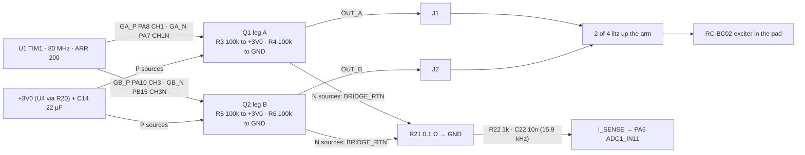

# Output: H-bridge, exciter, self-test current sense (SUB-OUTPUT)
Rev MZ-2 2026-10-07: Phase-2 packages (ECR-0018): R21 0.1 Ω 0402 ERJ2BSFR10X (OUT-02 done), R3-R6 / R22 / C22 0201; bridge on B of the 30 x 12 board; +3V0 from the In2 plane; R21 Kelvin fix (two pad-hugging GND vias): LN-M03 1.29 % PASS; Rev F/G facts -> "Reference design" at the end.
Status: schematic = Rev G nets (leg B on CH3/CH3N, ECR-0003; Q1/Q2 Fig. 32 footprint, ECR-0004) with the MZ-2 packages (`hw/pod/pod_mz2.net`, `hw/pod/bom_jlc_mz2.csv`; bom_check [nets] PASS 2026-10-07) · board `hw/pod/draft_r2/out/routed.kicad_pcb` (f6291e6): DRC 0, 0 unconnected · noise model on it valid (`sim/noise/out_r2/budget.json`, sha da4e8b13): LN-M03 1.29 % PASS, LN-M05 8.72 µV PASS · firmware not written · exciter not measured (E1). Updated 2026-10-07.

```yaml
abbrev: {AD: "2-level PWM, legs complementary", MZ-2: "Phase-2 package set (ECR-0018)", "F/B": "board face to the lid / to the cell", FS: full scale, LN-Mxx: "layout-noise metric, docs/sim/layout-noise.yaml", OUT-0x: "simplification-study item, docs/research/simplification-study.md 2026-10-02"}
item: SUB-OUTPUT
src_of_truth: [hw/current.yaml, "hw/pod/gen.py (blocks BRIDGE, SELFTEST, ARM_PADS J1/J2; MZ2 table L93)", hw/pod/draft_r2/out/routed.kicad_pcb, hw/pod/kelvin_r21.py, docs/system/pin-contract.yaml, "docs/spec.md D6 D7 D17 §6 §7"]
functions: {F3: drive the exciter, F4: "self-test exciter |Z| (O15)", F15: "output side; D1/D2 deleted in Rev F (OUT-04)"}   # integration-map.md §1
owner_decisions: [O9/O15 test hooks R21/R22/C22, O13 Extended count, O18 firmware knobs, O21 no orders until freeze, O25 Claude lays out (owner review), O26 Phase 2]
ecrs:
  ECR-0003: "leg B -> CH3/CH3N: implemented (nets carried into pod_mz2.net); awaiting owner review (vcrm.py 2026-10-07)"
  ECR-0004: "Q1/Q2 Fig. 32 footprint pod:Nexperia_SOT1216_DFN1010B-6: on the Phase-2 board; awaiting owner review"
  ECR-0018: "Phase 2 package set: R21 0402 (MZD-4), C14 22 µF 0603 kept (MZD-5); approved, implementing"
  ECR-0005: "U4 300 mA vs bridge peaks: open; closed by OUT-07 clamp if the owner accepts it (study L215)"
  ECR-0007: "buy exciters, E1/E2: open"
  ECR-0009: "no output while docked: conflicts with the docked self-test (issue 12)"
  ECR-0013: "S2 PB15 UCPD dead-battery pull-down on GB_N: firmware order (issue 13)"
  ECR-0015/0016: "packages B/C carry OUT-01 OUT-03 OUT-05 OUT-07 (not in the design)"
```

## Purpose
- F3: DSP duty stream → current in the bone-conduction exciter at the tragus. AD PWM 200 kHz, 3rd-order noise shaping, discrete bridge (spec D6).
- Silent when nothing to hear (T6); no clicks, fixed loudness ceiling (D17).
- F4: R21 shunt → PA6 for the USB self-test |Z| sweep (O15).

## Big picture



```yaml
mechanism:
  legs: "each leg = one N+P pair; TIM1 CHx -> P gate (polarity inverted in firmware), CHxN -> N gate, dead time between (gen.py L180-189)"
  AD: "legs switch as complements: exciter sees ±3.0 V; 200 kHz ripple current ~12.5 mA pp at 0.3 mH crosses zero every period, cancelling dead-time error for quiet signals (C3 §2)"
  reset_safety: "TIM1 pins = analog mode at reset (RM0456 Rev 7 GPIO chapter); R3/R5 hold P off, R4/R6 hold N off. PB15 additionally gets the UCPD dead-battery 5.1k pull-down while PB14 (I2C_SDA) is high (pin-contract.yaml PB15, ECR-0013 S2): N gate off, safe"
  ROM_loader: "PA10 = ROM USART1_RX; R5 (GB_P pull-up) keeps it high, no R11 (gen.py docstring, AN2606 Table 199)"
  shunt: "both N sources -> BRIDGE_RTN -> R21 -> GND; lift R21 = bridge disconnected. R22/C22 low-pass into PA6. PA6 reads bridge supply current i·(2d−1), not coil current: |Z| and phase sit at 2f (issue 1)"
```

## Elements
| Ref | Part (what it is) | LCSC · class · $ (src, date) | Notes |
|---|---|---|---|
| Q1, Q2 | **PMCXB290UE**: Nexperia 20 V complementary N+P MOSFET pair, DFN1010B-6 (SOT1216), 1.1 × 1.0 × 0.37 mm | C19654206 · Ext · $0.1706 (B-parts §2, 2026-09-30) | Pins 1 S_N, 2 G_N, 3 D_P, 4 S_P, 5 G_P, 6/7 D_N, 8 D_P (datasheet 30 May 2023 Table 2; gen.py L113-125). Q1 (17.9, 9.0), Q2 (21.0, 9.0) B (routed board 2026-10-07). Footprint `pod:Nexperia_SOT1216_DFN1010B-6` (Fig. 32 land pattern, ECR-0004, `sim/checks/sot1216_footprint.py` PASS; sot1216-footprint.md). gen.py docstring L116-117 "FOOTPRINT TODO" is stale |
| R3, R5 / R4, R6 | 100 kΩ 0201 (0201WMF1003TEE): P-gate pull-ups to +3V0 / N-gate pull-downs to GND | C270364 (bom_jlc_mz2.csv, 2026-10-07) | Mandatory (D6). R4/R6 kept on purpose (triage Q19; OUT-01 would drop them, ECR-0015). 0.06 mA total (`power.py`) |
| C14 | **CL10A226MQ8NRNC**: Samsung 22 µF 6.3 V X5R 0603 MLCC (class-2 ceramic) | C59461 · Basic · $0.0311 (B-parts, 2026-09-30) | Bridge bulk on +3V0, (19.45, 9.0) B between Q1 and Q2. 0603 kept (MZD-5: B height is mic-pinned; OUT-07 pending). §6 cap rule: issue 5 |
| R21 | **ERJ2BSFR10X**: Panasonic 0.1 Ω 1 % 0402 current-sense chip resistor | C409058 · Extended · stock 15,878 · $0.0732 (bom.md, JLC API 2026-10-07T11:31Z) | Low-side shunt (OUT-02 / MZD-4), (19.45, 6.45) r180 B, near the board centre (MZD-4 asks for the board edge: tried 2026-10-07, LN-M03 2.48 % FAIL at the bottom edge or an unroutable BRIDGE_RTN when flipped; kept here, reg-board issue 20); pad 2 (GND) at (18.94, 6.45) with two GND vias at (18.55, 6.45) and (18.94, 6.01) (`hw/pod/kelvin_r21.py`, f6291e6). Full-scale DC dissipation 10 mW; power rating [TBD: Panasonic ERJ2BS data sheet not read here] |
| R22, C22 | 1 kΩ 0201 (0201WMF1001TEE) / 10 nF X7R 25 V 0201 (GRM033R71E103KE14D) | C270365 / C85930 (bom_jlc_mz2.csv) | (15.4, 3.55) / (15.4, 4.4) B, near PA6 = U1 pin 16. 15.9 kHz pole; 200 kHz attenuated ~13×. Kept until OUT-07 (OUT-03 would delete C22) |
| J1, J2 | 1.0 mm hand-solder pads (`TestPoint_Pad_D1.0mm`), B face, rear pad zone (board x 25-30) | copper only | J1 (28.9, 9.9), J2 (27.0, 10.95); nets OUT_A / OUT_B |
| XDCR | **RC-BC02**: tiny inertial bone-conduction exciter, 300–19,000 Hz, 0.3 W nominal / 0.8 W max | not JLC; price [TBD] (bom.md) | **8 Ω or 12 Ω** (sellers disagree, D7). L unknown (0.3 mH placeholder). In the pad: `reg-pad.md` |

## Interfaces
| To | Nets / pins (integration-map.md, pin-contract.yaml) | What crosses / invariant |
|---|---|---|
| [sub-processing](sub-processing.md) | GA_P PA8 (pin 29, TIM1_CH1), GA_N PA7 (17, CH1N), GB_P PA10 (31, CH3), GB_N PB15 (28, CH3N), all AF1; I_SENSE PA6 (16, ADC1_IN11) | TIM1 centre-aligned ARR 200 at 80.009 MHz = 200.02 kHz; one GPDMA burst per period covering CCR1..CCR3 (DBL = 2, ECR-0003; CCR2 unused); dead-time tick 12.5 ns. **Set OSSI and OISx/OISxN before MOE.** Set PWR_UCPDR.UCPD_DBDIS before CH3N drives (issue 13). PA9/PB0 spare (gen.py) |
| [sub-power](sub-power.md) | +3V0 → Q1.4/Q2.4 S_P, R3/R5, C14 | Avg 0.5–1.0 mA bridge + 0.4–2.5 mA exciter; +3V0 peak 326 mA vs U4 300 mA (`tools/checks/interfaces.py` rails WARN, 2026-10-07; ECR-0005). +3V0 reaches S_P through the In2 plane: U4.1 → Q1.4 / Q2.4 40.4 / 39.5 mΩ (budget.json 2026-10-07). Reactive energy flows back into +3V0 (issue 1); U4 can't sink it, so C14 and the loads take it |
| [sub-debug-test](sub-debug-test.md) | BRIDGE_RTN → R21; I_SENSE (R22/C22) | Lift R21 = bridge off. Self-test sweep over USB (O15). Docked sweeps heat U4 (sub-power issue 5). **ECR-0009 "no output while VBUS present" forbids the docked sweep as written** (issue 12) |
| [reg-arm](reg-arm.md) | OUT_A (J1), OUT_B (J2) | 2 of the 4 litz wires: 0–3.0 V square at 200 kHz, 10–30 ns edges (C3 §3), ~0.3 A peaks. ~0.1 Ω per conductor (1.25 Ω/m × ~80 mm, hardware.md §3, derived). Wires reach J1/J2 on B through the stowage gap behind the board (pod x 60.55–66.7, R-BOARD-ARM) |
| [reg-pad](reg-pad.md) | OUT_A, OUT_B → pad board J1/J2 → J5/J6 PTH → exciter leads | Exciter leads unknown (E1). Pad-board J4 LED_K 0.45 mm from J2 OUT_B (reg-pad issue 13) |
| [physical](physical.md) | OUT_A/OUT_B wires | J1/J2 on B in the rear pad zone (board x 25–30 = pod x 55.55–60.55, dims_r2 PAD_ZONE); wires come up the stowage space behind the board (pod x 60.55–66.7, above the cell) and are soldered on the B face before the board is hung on the lid. Right pod: pads mirrored top-to-bottom (one board, mirrored shells) |
| [reg-board](reg-board.md) | All on B (routed board probe 2026-10-07): Q1 (17.9, 9.0), Q2 (21.0, 9.0), R3/R4 (17.9, 10.8 / 7.35), R5/R6 (21.0, 10.8 / 7.35), C14 (19.45, 9.0) r270, R21 (19.45, 6.45) r180, R22 (15.4, 3.55), C22 (15.4, 4.4), J1 (28.9, 9.9), J2 (27.0, 10.95) | GND return through the In1 plane; +3V0 from the In2 plane. Routed copper (0.1 mm): OUT_A 13.2 mm / 2 vias, OUT_B 8.5 mm / 2 vias, BRIDGE_RTN 11.8 mm / 0 vias, I_SENSE 3.0 mm / 0 vias. Kelvin: R21 pad 2 → two GND vias (18.55, 6.45), (18.94, 6.01); LN-M03 1.29 % (budget.json kelvin 2026-10-07). J-pad neighbours: issue 9 |
| [sub-audio-in](sub-audio-in.md) | (no net) | Bridge ~16 mm from the mic port (Q1 centre (17.9, 9.0) vs port (1.88, 6.0), derived). Shaper noise −35 dB re FS across 20–85 kHz (MP-01, D6): any rail, ground or mechanical coupling is heard by the mic. Copper conduction: LN-M01 26.5 dB pessimistic PASS (worst-case PSRR 14.0 dB, at A01 SMPS, not the bridge); F01 bridge-output → mic-line pickup far below limits (l2_rows, > 100 dB margin) (sim/noise/out_r2/budget.json 2026-10-07) |
| [sub-ui](sub-ui.md) | (no net) LED_A/LED_K share the arm bundle | 200 kHz edges may make the LED glow faintly when off (pcb-mech-interface.md §6 item 5); fix if seen: 1 nF across J7/J8 |
| firmware ([sub-processing](sub-processing.md)) | TIM1, GPDMA, ADC1 | Volume (D3) → ceiling (D17) → ×16 interpolate → 3rd-order shaper + TPDF dither → TIM1 CCR. Dither off when squelched; soft start/stop |

## Constraints
```yaml
D6: "200 kHz, centre-aligned, 201 levels, AD, dead time 1-2 ticks, gate pulls mandatory, integrated bridge ICs rejected (DRV8837/8210/8833 timing 10-40x too coarse)"
D7: "exciter disputed: 8 ohm / 12.5x5x3.5 mm vs 12 ohm / 12.6x6x4 mm; no inductance data; E1 measures it"
D17: "fixed ceiling, identical both sides; no clicks. No ceiling number in spec; SPICE assumes -12 dBFS (C3 §5)"
s7_rail: "bridge on regulated 3.0 V so gain doesn't track charge (~1.8 dB otherwise); AD prefers full 3.0 V"
s6_caps: "keep audio-rate ripple off class-2 ceramics on the bridge rail, or use low-acoustic-noise types"
T6: "self-noise no louder than ambient; owner hears high (8-16 kHz band to protect)"
JLC: "0.15 mm SMD pad-to-pad gap; the Fig. 32 SOT1216 meets it with no margin (sot1216-footprint.md)"
LN-M03: "I_SENSE Kelvin error <= 2 % of R21 at 5 kHz (layout-noise.yaml kelvin_pct_max; owner: enforce or calibrate)"
LN-M05: "bridge rail ripple 1.5-8 kHz x 10 % leg asymmetry <= 50 uV rms"
```

## Key numbers
| Quantity | Value | Source (date) |
|---|---|---|
| PWM | 200.02 kHz, ARR 200, 201 levels; TIM1 clock 80.009 MHz | `sub-processing.md`, A3-u575-plan §2 (2026-09-30) |
| Dead time | start 12.5 ns (1 tick); option 25 ns + firmware compensation | C3 §5, D6 (2026-09-30) |
| Loud mode `loud_db` (knob, 0..12 dB, default 0 = off, bit-identical) | +loud_db dB drive ahead of the limiter while the user toggle is on; still bounded by the look-ahead limiter and the FWSIM-R64 208 mA clamp (`fw/test/test_loud.c` test_loud_mode, 2026-10-08). D17 ruling pending (NEXT.md #2) | `fw/spec/knobs.yaml`, bf5d6bd |
| Loud flat-top `loud_shape` (0/1, default 0 = bit-identical) + `loud_shape_k` (x0.1, default 25) | I-034 (docs/brainstorm/D-r6-crest.md): tanh flat-top (65-pt table, no libm) between loud gain and look-ahead limiter, active only while loud mode is on; S = ceiling x loud gain; limiter + 208 mA clamp still bound the output (`test_loud_shape`, FWSIM-R64: off bit-identical, clamp hits 0, >= 2 dB). Port Meadow 54 clips (sim/perf/port_meadow.py `A+loud12+shape`, 2026-10-08, model): call level p50 -22.3 -> -14.3 dBFS, mean 13.6 -> 17.3 mA (x1.27 mean; per-call x1.7), expected runtime 10.9 -> 8.6 h (175 mAh). Owner decides with D17 |
| Idle Hi-Z `hiz_idle` (knob, 0/1, default 0) | 1 = bridge Hi-Z (MOE 0, break disarmed) while the squelch holds the exact 50 % square wave; saves ~0.4-0.5 mA at 1 tick dead time (SPICE only, not bench; E1/PWR-I12 closes). Interacts with F3 break/dead-time | `sim/checks/bridge_hiz_idle.py`, `docs/brainstorm/D-hiz-idle.md`, fdac294 (2026-10-08) |
| Idle bus current (DMC2400UV model as stand-in) | 0 ns: 4.3 mA (shoot-through) · 12.5 ns: 0.49 / 0.42 mA (0.3 / 1.26 mH) · 25 ns: 0.20 / 0.10 mA | `sim/checks/bridge_spice.py`, C3 §5 |
| Gate drive / gate pulls | 0.28 mA (SPICE); 0.30 mA est. for PMCXB290UE / 0.06 mA | C3 §5; B-parts §2; `power.py` |
| THD+N at 12.5 ns | −61 dB at −40 dBFS; −52 dB at −12 dBFS | C3 §5 |
| Idle ripple, clean range | Vbus/(4·L·f): 12.5 mA at 0.3 mH, 3.75 mA at 1 mH; clean ≲ −30 dBFS at 0.3 mH | C3 §2, spec §6 |
| Shaper noise | −93 / −90 / −72 dB re FS in 0.2–8 / 8–20 / 20–40 kHz; −35 dB across 20–85 kHz at 200 kHz PWM (−45 at 400 kHz, −59 at 800 kHz, +0.8 mA) | `ntf_compare.py`, `pwm_ultrasonic_leak.py`, D6 |
| Rds(on) at Vgs 3.0 V | N 0.34 / P 0.88 Ω typ (max ~0.44 / 1.2) | B-parts §2 (interpolated, Nexperia 30 May 2023) |
| Full-scale peak current | 3.0 / (8 + 1.22 + 0.1) ≈ 0.32 A into 8 Ω; ≈ 0.23 A into 12 Ω. gen.py R21 comment ~315 mA; interfaces.py rails: +3V0 peak 326 mA | derived; gen.py; interfaces.py (2026-10-07) |
| Full-scale sine power | ≈ 0.42 W into 8 Ω (> D7 0.3 W nominal); ≈ 0.31 W into 12 Ω; −12 dBFS ≈ 26 mW into 8 Ω | derived |
| Signal current at −12 dBFS ceiling | ~85 mA peak (0.3 mH, 8 Ω) | C3 §5 |
| OUT-07 clamp |2d−1| ≤ 0.5 | +3V0 peak 326 → ~81-92 mA | simplification-study L34, L283 (2026-10-02) |
| Exciter avg current at listening level | 0.6–1.7 mA `[Low]`; model 0.4 / 1.1 / 2.5 mA, "untraced guess" | spec §7; `power.py` |
| Drive level needed at the tragus | unknown: E2. Tragus ~10 dB louder than condyle-arch site (predicted) | D1; bone-conduction.md §1, §3 |
| R21 at full-scale DC | 32 mV, ~170 counts of 14-bit, 10 mW (0402 rating [TBD], 1206 was 250 mW) | gen.py R21 comment (derived) |
| Q thermal, worst case | full-scale DC: 0.13 W in the P-FET while on, ≤ 65 mW avg, +25 K at 386 K/W | sot1216-footprint.md |
| Copper U4.1 → Q1.4 / Q2.4 | 40.4 / 39.5 mΩ (≈ 13 mV at 0.32 A) via the In2 +3V0 plane | sim/noise/out_r2/budget.json dc_rail_paths_mohm (board sha da4e8b13, 2026-10-07) |
| Copper Q1.1 → R21.1 / R21.2 → U1.8 / C14.2 → R21.2 | 25.2 / 5.9 / 6.0 mΩ | same |
| LN-M03 Kelvin error | 1.29 mΩ at 5 kHz = 1.29 % of R21: PASS vs ≤ 2 % (options scored: stub 3.31 / one edge via 2.38 / two edge vias 1.29 chosen / via-in-pad 1.54 %, needs filled vias) | budget.json metrics + kelvin; hw/pod/kelvin_r21.py docstring (2026-10-07) |
| LN-M05 bridge rail ripple × 10 % asymmetry | 8.72 µV rms ≤ 50: PASS (A05 CPU hop 1562 Hz) | sim/noise/out_r2/budget.json metrics (2026-10-07) |

## Open issues
1. **F4: R21 reads bridge supply current i·(2d−1); |Z| lives at 2f, not f.** R21 carries +i in one AD state, −i in the other; after the 15.9 kHz filter PA6 sees i·(2d−1). With d = ½(1 + m·sin ωt), i = I·sin(ωt − φ):
   - i·(2d−1) = (mI/2)·[cos φ − cos(2ωt − φ)] (derived 2026-10-01).
   - 2f term amplitude mI/2, phase φ → |Z| = 3.0·m / I and phase via lock-in at 2f; DC term = real power; nothing at f.
   - R22/C22 passes 2f ≤ 8 kHz at −1.0 dB / −27°: fixed, calibrate out.
   - Signal small and swings negative (scratch run: 0.3 mH, −6 dBFS: mean 2.4–3.7 mV, negative 8–17 % of the time; 1.26 mH, 4 kHz, −20 dBFS: negative 52 %, φ ≈ 74–76°). Single-ended ADC clips the negative half.
   - gen.py L194-195 comment "one ADC pin reads the exciter current" is wrong (supply current); fix in the next schematic commit.
   - **Option D verified 2026-10-07** (`sim/checks/selftest_lockin.py`: switched AD bridge at the 12.5 ns tick, R21 → R22/C22 + 100 kΩ offset, 14-bit ADC1 one sample per PWM period, 2f lock-in; R 8 Ω, L 0.3/1.26 mH, 0.5-4 kHz; ideal rail, no motional term, Rds P 0.88 / N 0.34 Ω subtracted as known): the offset keeps PA6 ≥ 29.5 mV (no negative samples, clipping solved); **−12 dBFS: |Z| ≤ 1.9 %, phase ≤ 0.7° in 10-80 ms per point**; −22 dBFS: ≤ 3.0 % / 3.4° with 0.25 s per point (≤ 22 % / 13° in 10 ms); −32 dBFS: unusable (≤ 17 % / 13° even at 0.25 s; the 2f signal is 2-10 µV vs a 183 µV LSB). So: sweep at −12 dBFS (inside the ECR-0009 capped-exemption level and the ECR-0005 peak, ~85 mA); hardware unchanged except the (B) offset resistor (not yet in gen.py: a schematic + layout addition, router-blocked for parallel agents). Open: Rds tolerance biases |Z| (1.22 Ω of ~9.4 Ω; calibrate with a known resistor on J1/J2 at bring-up), and the coil's motional term is not modelled.
   - options: **(D, recommended)** keep R21/R22/C22, firmware 2f synchronous detection + DC term, add (B) offset; verify in `sim/checks/bridge_spice.py` first · (A) fit R, L from the DC term of a slow sweep (no phase) · (B) offset R +3V0 → I_SENSE ~100 kΩ (≈ +30 mV, 30 µA, derived) · (C) drop C22, sample R21 at TIM1 mid-state with (B) · **(OUT-03, ECR-0015)** drop C22 and the offset, sample R21 at the state centre from TRGO2 + OC5/OC6: signed coil current, +0.1/+0.5/+1.7 % at −12/−22/−32 dBFS (SPICE ideal ADC), sample window ±25–50 ns; requires OUT-07 (study L282, L354). **(B) offset built 2026-10-07:** R23 1M (+3V0 -> I_SENSE: +3.0 mV, 3.0 uA; 100k would have drawn 29.7 uA, more than the Off budget; lock-in at -12 dBFS |Z| 2.07 %, phase 0.89 deg with 1M) on the board at (19.2, 5.15) B (reg-board, ECR-0018 log round 8).
2. **Exciter unmeasured (E1):** 8 vs 12 Ω, L, lead exit, mass. Sets peak current (ECR-0005), clean range, PWM-rate fallback (100 kHz if L ≥ ~1 mH), pad lead holes. closes: ECR-0007 (buy 3+ from two listings, LCR meter); O21 blocks the purchase until lifted.
3. **U4 300 mA vs full-scale peaks (ECR-0005):** +3V0 peak 326 mA (interfaces.py). Only FS tones or a fault reach it; −12 dBFS peaks ~85 mA. closes: OUT-07 clamp + capped self-test (owner acceptance; rail-budget.yaml edit in the same commit, study L215, L283), or E1 = 12 Ω (0.23 A), or a bigger LDO.
4. **Q1/Q2 footprint:** Fig. 32 land pattern wired in (Rev F). Remaining: written JLCDFM verdict on the 0.15 mm gaps (OUT-06 fallback NTZD3155C only if refused; DMC2400UV-7 stock 0 at 2026-10-02 22:22Z, study L284); ask JLC for a 0.10 mm stencil (paste area ratio 0.53 at 0.12 mm, sot1216-footprint.md).
5. **C14 class-2 X5R on the bridge rail** (§6 "sing" risk; reactive energy returns to it, issue 1). closes: S2/E7 listening with the bridge running; else low-acoustic-noise MLCC or polymer cap (none sourced). OUT-05 (→ 1 µF 0402) would shrink it and add +4 mV carrier on +3V0 (scope TP4).
6. **No hardware fault cut-off:** PA6 is I_SENSE, not TIM1_BKIN; errata say faults must use BKIN (sub-processing issue 6). FW-1 adds an over-current cutoff only while the self-test runs; normal listening relies on the OUT-07 clamp, IWDG, R3/R5 (study L286). closes: owner/firmware decision on an always-on ADC1 guard (+0.15–0.34 mA). New option found 2026-10-07 (sub-processing issue 6): **ADC1 (PA6) → MDF1 out-of-limit detector → mdf1_break0 → TIM1 break**: a hardware-speed, CPU-independent cut-off with no board change, same current. Options: **(A, recommended)** that MDF break chain always on during playback; (B) self-test-only over-current (today); (C) software ADC1 guard (ISR latency, dies with a hung CPU). **Decided: option A** (decided 2026-10-07, decisions-log 9330d9c): ADC1 → MDF1 out-of-limit → TIM1 break, always on in playback; firmware requirement FWSIM-R65.
7. **Dead time unverified on the real part:** SPICE used the DMC2400UV model (Diodes, 2014-11-18); Nexperia blocks scripted downloads. closes: S2 bench measurement or Nexperia SPICE model fetched in a browser.
8. **MP-01:** shaper noise lands in the mic band; PWM rate is a firmware choice (200/400/800 kHz). closes: bench coupling measurement, then the lowest rate under the mic floor.
9. **Layout (Phase 2 board, O25: Claude lays out, owner reviews):**
   - (closed 2026-10-07) LN-M03 Kelvin: 3.31 % with the 0.55 mm R21 GND stub → 1.29 % with two pad-hugging GND vias (`hw/pod/kelvin_r21.py`, f6291e6; DRC 0).
   - (closed) +3V0 trunk: In2 +3V0 plane, 40 mΩ U4 → bridge (was 0.2 Ω on Rev F, LF-2).
   - J-pad neighbours (copper gaps, routed board 2026-10-07; all ≥ 0.8 mm, MZD-10): J1 OUT_A–J2 OUT_B 1.17 mm (exciter shorted), J2 OUT_B–J8 LED_K 1.20 (200 kHz onto PB7), J1–J7 LED_A ~1.2 (derived from centres (28.9, 9.9)/(28.9, 7.7): 1.2 mm). No cell pad next to J1/J2 any more (J5 VBAT is at (28.9, 1.1)). Meter J1–J2 and J2–J8 before power (sub-debug-test bring-up step 1).
   - OUT_A 13.2 mm vs OUT_B 8.5 mm copper; Rds P vs N (0.88 vs 0.34 Ω) dominates leg mismatch, not copper (LF-9 reasoning).
10. **Diagrams:** `B1-mosfet-compare.png` (cited by B-parts-selection.md) missing from `docs/diagrams/`; no bridge-level circuit diagram (legs, pulls, shunt, current paths in both AD states) to show issue 1. Real schematic sheets pending (`hw/pod/sch.py`, untracked 2026-10-02).
11. **Spec text behind the design (owner; agents never edit spec.md):** D6 "1.6 mm package"; §9 lists NTZD3155C/DMC2400UV; B1 "IN PROGRESS"; D6 reset note cites RM0394 (L4) not RM0456 (U5).
12. **ECR-0009 vs the docked self-test:** "no exciter output while VBUS present" blocks the O15 |Z| sweep and PWM-noise A/B (both run on USB). options: **(a, recommended)** written self-test-only exemption in ECR-0009, drive capped ≤ −12 dBFS (keeps the peak far under U4, ECR-0005; limits U4 heating at 4.5 V VSYS, sub-power issue 5) · (b) sweep on battery, log to flash, read over USB. Same item in sub-debug-test, sub-power.
13. **PB15 = GB_N carries the UCPD dead-battery 5.1 kΩ pull-down** (UCPD1_DBCC2 armed by PB14 high; pin-contract.yaml, ECR-0013 S2). Safe at reset (N held off). Firmware sets PWR_UCPDR.UCPD_DBDIS before TIM1 CH3N drives; effect of driving CH3N against the 5.1 kΩ if the order is wrong [TBD]. Bench check: bring-up (study L207).

## Before you change this, check
```yaml
exciter_part_or_ohms: [sub-power peak vs U4 (ECR-0005), D6 clean range and PWM rate, reg-pad cup and lead holes, exciter mass]
mosfets_or_footprint: [gate charge (§7), Rds at 3.0 V, dead time, JLC 0.15 mm gap, JLCDFM verdict, reg-board placement (>= 10 mm from the mic port), OUT-06]
tim1_pins: ["integration-map.md §4 one job per pin", "pin-contract.yaml (PA10 ROM USART1_RX held by R5; PB15 UCPD pull-down)", "complementary pairs only on TIM1 CHx/CHxN"]
r21_r22_c22: [F4 method (issue 1), sub-debug-test, PA6 vs BKIN (issue 6), ECR-0009 (issue 12), LN-M03 Kelvin vias at R21 pad 2 (re-run sim/noise after any move)]
c14_or_rail: ["§6 cap rule", "U4 stability (C18 stays at U4)", "D11 no switching regulator for the bridge", OUT-05 needs OUT-07]
wires: [reg-arm bores (heel Ø1.0, strut Ø1.2), J-pad neighbours (issue 9), stowage gap behind the board (physical)]
process: ["integration-map.md §10", "python3 tools/plm.py impact SUB-OUTPUT", "python3 tools/checks/interfaces.py"]
```

## Reference design (Rev F/G)
- hw/current.yaml `reference` (env `ULTRASONIC_DESIGN=revg`): `hw/pod/draft_r1/pod_r1_routed.kicad_pcb`, `hw/pod/pod.net`; history = git.
- R21 1206W4F100LT5E 1206 (C25334, Basic, 250 mW) at (21.6, 7.6) B; R3-R6 / R22 / C22 0402 (C25741 / C11702 / C15195); R22/C22 on F under PA6; J1/J2 on F at x 33.0.
- Noise on Rev F (sim/noise smoke, sha e159bccb, 2026-10-02): LN-M03 5.2 % FAIL (R21 pad-2 stub + via 4.6 of 5.2 mΩ), LN-M05 14.3 µV; U4 → Q1/Q2 202.5 / 198.1 mΩ on 0.1 mm tracks. J1 was 0.71 mm from J5 VBAT (cell onto OUT_A if bridged).
