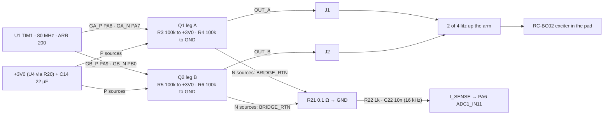

# Output: H-bridge, exciter, self-test current sense
Status: schematic Rev E (gen.py; ERC 0 errors / 335 warnings, `hw/pod/gen.erc` 2026-10-01), rough-draft layout (1 of the 7 unrouted connections is here: an OUT_A stub at Q1 pad 3, `hw/pod/draft_r1/drc.json` 2026-10-01 19:44), firmware not written, exciter not measured (E1). Updated 2026-10-01.
· Source of truth: `hw/pod/gen.py` (blocks BRIDGE, SELFTEST, ARM_PADS J1/J2), `hw/pod/place_r1.py`, `docs/spec.md` D6, D7, D17, §6
· Owner decisions: O9/O15 (test hooks R21/R22/C22), O13 (Extended part count), O14 (layout together), O18 (firmware knobs, board measures itself) · Open ECRs: ECR-0003 (leg B pins), ECR-0004 (Q1/Q2 footprint), ECR-0005 (LDO vs peaks), ECR-0007 (buy exciters, E1/E2), ECR-0009 (no output while docked: conflicts with the docked self-test, open issue 12)

## Purpose
- Carries **F3** Drive the exciter and **F4** Self-test exciter |Z| (`integration-map.md` §1); the output side of **F15** (D1/D2, now DNP).
- Turns the DSP's duty stream into current in the bone-conduction exciter at the tragus: 2-level ("AD") PWM, 200 kHz, 3rd-order noise shaping, discrete bridge (D6).
- Must stay silent when there is nothing to hear (T6), never click (D17), and cap loudness at a fixed ceiling (D17).

## Big picture

1. Each leg is one N+P MOSFET pair. TIM1 CHx drives the P gate (polarity inverted in firmware), CHxN the N gate, with a dead time between them.
2. **2-level (AD):** the legs switch as complements, so the exciter always sees ±3.0 V. The coil smooths it; its 200 kHz ripple current (~12.5 mA at 0.3 mH) crosses zero every period, which cancels dead-time error for quiet signals (C3 §2).
3. Gate pulls hold every FET off from reset until TIM1 takes over (TIM1 pins float at reset: U5 GPIO reset state = analog mode, RM0456 Rev 7 GPIO chapter. The A3-clock §4 note says the same but was written for the L452 from RM0394).
4. Both N sources return through **R21** (lift it = bridge disconnected). R22/C22 low-pass the shunt voltage into PA6 for the USB self-test (O15). It reads the bridge supply current i·(2d−1), not the coil current; |Z| and phase sit in its **2f** component (open issue 1).

## Elements
| Ref | Part (what it is) | LCSC · class · $ (source, date) | Notes |
|---|---|---|---|
| Q1, Q2 | **PMCXB290UE**: Nexperia 20 V complementary N+P MOSFET pair, DFN1010B-6 (SOT1216), 1.1 × 1.0 × 0.37 mm | C19654206 · Ext · 5,000 · $0.1706 (B-parts §2, 2026-09-30) | Pins 1 S_N, 2 G_N, 3 D_P, 4 S_P, 5 G_P, 6 D_N, 7 D_N, 8 D_P. Footprint today: EasyEDA `lcsc:SOT1216_L1.1-W1.0-P0.35-BL-EP` (too-small pads) |
| R3, R5 / R4, R6 | 100 kΩ 0402: P-gate pull-ups to +3V0 / N-gate pull-downs to GND | C25741 · Basic | Mandatory (D6 reset safety). Cost 0.06 mA in total (`power.py`) |
| C14 | **CL10A226MQ8NRNC**: Samsung 22 µF 6.3 V X5R 0603 MLCC (class-2 ceramic) | C59461 · Basic · $0.0311 (B-parts, 2026-09-30) | Bridge bulk on +3V0. See open issue 5 (capacitor rule, §6) |
| R21 | **1206W4F100LT5E**: 0.1 Ω 1 % 1206 chip resistor | C25334 · Basic · $0.0055 (bom.md, 2026-10-01) | Low-side shunt, 250 mW rating (gen.py). Was 0.33 Ω 0603 Ext before the 2026-10-01 audit |
| R22, C22 | 1 kΩ 0402 / 10 nF 0402 | C11702 / C15195 · Basic | 15.9 kHz pole: passes the 1.5–4 kHz band, attenuates 200 kHz ~13× |
| D1, D2 | **PESD5V0S1BL**: Nexperia 5 V bidirectional ESD diode, DFN1006, 35 pF | C84374 · Ext · **DNP** (footprints kept) | Removed in the audit: the outputs reach only the sealed exciter; FET body diodes clamp to the rails |
| J1, J2 | 1.0 mm hand-solder pads (`TestPoint_Pad_D1.0mm`), F face, rear edge | copper only | Value labels XDCR_A / XDCR_B; nets OUT_A / OUT_B |
| XDCR | **RC-BC02**: tiny inertial bone-conduction exciter, 300–19,000 Hz, 0.3 W nominal / 0.8 W max | not JLC; price TBD (bom.md) | **8 Ω or 12 Ω** (seller pages disagree, D7). Inductance unknown (0.3 mH placeholder). In the pad: `reg-pad.md` |

## Interfaces
| To | Nets / pins (as in integration-map.md) | What crosses / invariant |
|---|---|---|
| [sub-processing](sub-processing.md) | GA_P PA8 (pin 29, TIM1_CH1), GA_N PA7 (17, CH1N), GB_P PA9 (30, CH2), GB_N PB0 (18, CH2N), all AF1; I_SENSE PA6 (16, ADC1_IN11) | TIM1 centre-aligned ARR 200 at 80.009 MHz = 200.02 kHz; one GPDMA duty burst per period; dead-time tick 12.5 ns. **Set OSSI and idle levels (OISx/OISxN) before MOE.** ECR-0003 proposes leg B on CH3/CH3N (GB_P PA10, GB_N PB15) |
| [sub-power](sub-power.md) | +3V0 → Q1.4/Q2.4 S_P, R3/R5, C14 | Avg 0.5–1.0 mA bridge + 0.4–2.5 mA exciter; full-scale peaks ~0.32 A vs U4's 300 mA rating (ECR-0005). Reactive energy flows back into +3V0 (open issue 1); U4 can't sink it, so C14 and the loads take it |
| [sub-debug-test](sub-debug-test.md) | BRIDGE_RTN → R21; I_SENSE (R22/C22) | Lift R21 = bridge off. Self-test sweep over USB (O15). Docked sweeps heat U4 (`sub-power.md` issue 5). **ECR-0009's "no output while VBUS is present" forbids this docked sweep as written** (open issue 12) |
| [reg-arm](reg-arm.md) | OUT_A (J1), OUT_B (J2) | 2 of the 4 litz wires: 0–3.0 V square at 200 kHz, 10–30 ns edges (C3 §3), ~0.3 A peaks. ~0.1 Ω per conductor (1.25 Ω/m × ~80 mm, hardware.md §3, derived) |
| [reg-pad](reg-pad.md) | OUT_A, OUT_B → pad board J1/J2 → J5/J6 PTH → exciter leads | Exciter leads unknown (E1) |
| [physical](physical.md) | OUT_A/OUT_B wires (interface 3) | J1/J2 at the rear column; the wires fold into the 2.1 mm gap behind the board (1.1 mm behind the cell). In the right pod the J column is mirrored top-to-bottom (one board, mirrored shells) |
| [reg-board](reg-board.md) | Q1 (15.8, 8.0) B, Q2 (18.6, 8.0) B, R3–R6 at x 15.5/18.9, R21 (21.6, 7.6) B, C14 (17.3, 11.4) B, D1/D2 (16.0/19.6, 10.3) B DNP, R22 (12.6, 11.6) F and C22 (10.6, 11.6) F under PA6, J1 (33.0, 6.6) F, J2 (33.0, 8.2) F | GND return through In1. OUT_A/OUT_B run ~15 mm to the rear pads. J1 sits beside J6 (BAT−, GND) and J10 (USB_DP), 0.6 mm pad gaps: a solder bridge J1–J6 shorts leg A's P-FET to GND |
| [sub-audio-in](sub-audio-in.md) | (no net) | Bridge ~12 mm from the mic (U2 at board x 3.9). The shaper's noise sits at −35 dB re full scale across 20–85 kHz (MP-01, D6): any rail, ground or mechanical coupling is heard by the mic |
| [sub-ui](sub-ui.md) | (no net) LED_A/LED_K share the arm bundle | 200 kHz edges may couple into the LED pair and make it glow faintly when "off" (pcb-mech-interface.md §6 item 5); fix if seen: 1 nF across J7/J8 |
| firmware ([sub-processing](sub-processing.md)) | TIM1, GPDMA, ADC1 | Volume (D3) → ceiling (D17) → ×16 interpolate → 3rd-order shaper + TPDF dither → TIM1 CCR (`sub-processing.md`). Dither off when squelched; soft start/stop for long silences |

## Constraints
- **D6:** 200 kHz, centre-aligned, 201 levels, AD modulation, dead time 1–2 ticks, gate pulls mandatory, integrated bridge ICs rejected (DRV8837/8210/8833 timing 10–40× too coarse).
- **D7:** the exciter is disputed: 8 Ω / 12.5 × 5 × 3.5 mm vs 12 Ω / 12.6 × 6 × 4 mm. No inductance data anywhere. **E1 measures it.**
- **D17:** fixed output ceiling, identical both sides; no clicks. The spec gives no ceiling number; the SPICE check assumes −12 dBFS (C3 §5).
- **§7 supply rail:** the bridge stays on the regulated 3.0 V rail, so gain doesn't track charge (≈1.8 dB otherwise). AD prefers the full 3.0 V (more ripple, wider clean range).
- **§6 capacitor rule:** keep audio-rate ripple off class-2 ceramics on the bridge rail, or use low-acoustic-noise types.
- **§1.2.3 / T6:** self-noise no louder than ambient; the owner hears high (8–16 kHz is the band to protect).
- **JLC:** 0.15 mm SMD pad-to-pad gap for assembly, which the redrawn SOT1216 meets with no margin (sot1216-footprint.md).

## Key numbers
| Quantity | Value | Source (date) |
|---|---|---|
| PWM | 200.02 kHz, ARR 200, 201 levels; TIM1 clock 80.009 MHz | `sub-processing.md`, A3-u575-plan §2 (2026-09-30) |
| Dead time | start 12.5 ns (1 tick); option 25 ns + firmware compensation | C3 §5, D6 (2026-09-30) |
| Idle bus current (DMC2400UV model as stand-in) | 0 ns: 4.3 mA (shoot-through) · 12.5 ns: 0.49 / 0.42 mA (0.3 / 1.26 mH) · 25 ns: 0.20 / 0.10 mA | `sim/checks/bridge_spice.py`, C3 §5 |
| Gate drive / gate pulls | 0.28 mA (SPICE); 0.30 mA est. for PMCXB290UE / 0.06 mA | C3 §5; B-parts §2; `power.py` |
| THD+N at 12.5 ns | −61 dB at −40 dBFS; −52 dB at −12 dBFS | C3 §5 |
| Idle ripple, clean range | Vbus/(4·L·f): 12.5 mA at 0.3 mH, 3.75 mA at 1 mH; clean for quiet listening ≲ −30 dBFS at 0.3 mH | C3 §2, spec §6 |
| Shaper noise | −93 / −90 / −72 dB re FS in 0.2–8 / 8–20 / 20–40 kHz; −35 dB across 20–85 kHz at 200 kHz PWM (−45 at 400 kHz, −59 at 800 kHz, +0.8 mA) | `ntf_compare.py`, `pwm_ultrasonic_leak.py`, D6 |
| On-resistance at Vgs 3.0 V | N 0.34 / P 0.88 Ω typ (max ~0.44 / 1.2) | B-parts §2 (interpolated from Nexperia 30 May 2023) |
| Full-scale peak current | 3.0 V / (8 + 1.22 + 0.1 Ω) ≈ 0.32 A into 8 Ω; ≈ 0.23 A into 12 Ω. gen.py states ~315 mA | derived; gen.py R21 comment |
| Full-scale sine power | ≈ 0.42 W into 8 Ω (above D7's 0.3 W nominal); ≈ 0.31 W into 12 Ω; −12 dBFS ≈ 26 mW into 8 Ω | derived from the line above |
| Signal current at the −12 dBFS ceiling | ~85 mA peak (0.3 mH, 8 Ω model) | C3 §5 |
| Exciter average current at listening level | 0.6–1.7 mA `[Low]`; model 0.4 / 1.1 / 2.5 mA, "untraced guess" | spec §7; `power.py` |
| Drive level needed at the tragus | unknown: E2. Tragus site predicted ~10 dB louder than the condyle-arch site | D1; bone-conduction.md §1, §3 |
| R21 at full-scale DC | 32 mV, ~170 counts of 14-bit, 10 mW of 250 mW | gen.py |
| Q thermal, worst case | full-scale DC: 0.13 W in the P-FET while on, ≤ 65 mW avg, +25 K at 386 K/W | sot1216-footprint.md |

## Open issues
1. **F4: R21 reads the bridge supply current i·(2d−1), and |Z| lives at 2f, not f.** In AD mode R21 carries +i in one state and −i in the other, so after the 16 kHz filter PA6 sees i·(2d−1) (= instantaneous power ÷ 3.0 V). With d = ½(1 + m·sin ωt) and i = I·sin(ωt − φ):
   - i·(2d−1) = (mI/2)·[cos φ − cos(2ωt − φ)] (derived 2026-10-01, docs-editor pass).
   - The **2f term** has amplitude mI/2 and phase φ, so |Z| = 3.0·m / I and the phase come out of a lock-in at 2f. The DC term (mI/2)·cos φ is the real power. Nothing sits at f, which is why the earlier scratch correlation at f came out 0.00.
   - R22/C22 (15.9 kHz pole) passes 2f ≤ 8 kHz at −1.0 dB / −27°: fixed, so calibrate it out.
   - The signal is small and swings negative (scratch run: 0.3 mH, −6 dBFS: mean 2.4–3.7 mV, negative 8–17 % of the time; 1.26 mH, 4 kHz, −20 dBFS: negative 52 %, φ ≈ 74–76°). A single-ended ADC clips the negative half.

   gen.py's comment (L172–174, "one ADC pin reads the exciter current") is wrong: it reads supply current; fix it in the next schematic commit. Options:
   - **(D, recommended)** Keep R21/R22/C22. Firmware does synchronous detection at 2f plus the DC term; add the (B) offset so negative swings are readable. **Verify in `sim/checks/bridge_spice.py` before relying on it.**
   - (A) Fit R and L from the DC (real-power) term of a slow sweep with heavy averaging, plus open/short checks. Weaker than D: no phase.
   - (B) Offset resistor from +3V0 to I_SENSE (~100 kΩ, ≈ +30 mV, 30 µA; derived). Needed by D.
   - (C) Read the real coil current: drop C22 and trigger the ADC from TIM1 mid-state, with (B).

   Decide in the simplification study.
2. **The exciter is unmeasured (E1):** 8 vs 12 Ω, inductance, lead exit and mass are all unknown. They set the peak current (ECR-0005), the clean range, the PWM-rate fallback (100 kHz if L ≥ ~1 mH) and the pad's lead holes. **Closes:** buy 3+ from two listings (bom.md) and measure with an LCR meter.
3. **U4 300 mA vs full-scale peaks (ECR-0005).** Only full-scale tones or a fault reach ~0.32 A; the assumed −12 dBFS ceiling peaks at ~85 mA. gen.py's "~315 mA" is 2–4 % under the same formula's 0.32–0.33 A (B-parts says ≈ 330 mA); either way it's over 300 mA. **Closes:** E1 (12 Ω makes it 0.23 A), a firmware drive cap on self-test, or a bigger LDO (simplification study).
4. **Q1/Q2 footprint.** gen.py and the netlist still use EasyEDA's SOT1216 (0.16 × 0.20 pads, smaller than Nexperia Fig. 32). The redraw is built and checked (`hw/lib/pod.pretty/Nexperia_SOT1216_DFN1010B-6`, `sim/checks/sot1216_footprint.py` PASS, KiCad DRC 0). Pads 7/8 are copper under resist; the pin map is unchanged. **ECR-0004 is on hold for the simplification study.** It must land before any release. Ask JLC for a 0.10 mm stencil: the paste area ratio is 0.53 at 0.12 mm.
5. **C14 is a class-2 X5R on the bridge rail,** exactly what §6 warns can "sing", and reactive energy returns to that rail (issue 1). **Closes:** S2/E7 listening with the bridge running. If it sings, use a low-acoustic-noise MLCC or a polymer cap (none sourced yet).
6. **No hardware fault cut-off:** A3 planned PA6 as TIM1_BKIN; Rev E uses PA6 for I_SENSE, and the errata say faults must use BKIN (`sub-processing.md` issue 6). **Closes:** decide whether a BKIN source is needed.
7. **Dead time is unverified on the real part.** The SPICE used the DMC2400UV model (Diodes, 2014-11-18), because Nexperia's site blocks scripted downloads. **Closes:** S2 bench measurement, or fetch Nexperia's SPICE model in a browser.
8. **MP-01:** shaper noise lands in the mic band. PWM rate is a firmware choice (200/400/800 kHz). **Closes:** bench coupling measurement, then the lowest rate below the mic's floor.
9. **Layout:** OUT_A stub at Q1 pad 3 unrouted (drc.json 19:44). Layout is done with the owner (O14).
10. **Diagrams:**
    - `schematic-rev1.png` still shows R21 as 0.33 Ω and "58 placed parts" (now 0.1 Ω and 56).
    - `B1-mosfet-compare.png`, cited by B-parts-selection.md, is missing from `docs/diagrams/`.
    - No bridge-level circuit diagram exists (legs, pulls, shunt, current paths in both PWM states). It would make issue 1 visible.
11. **Spec text behind the design:** D6 still says "1.6 mm package" and "B1 prefers the DMC2400UV class"; §9 still lists NTZD3155C/DMC2400UV; B1 is still "IN PROGRESS"; D6's reset note cites RM0394 (the L4 manual; the U5 is RM0456). Raise these with the owner.
12. **ECR-0009 vs the docked self-test.** ECR-0009 (R23 safety) adds "no exciter output while VBUS is present". The O15 self-test runs over USB, so VBUS is always present, and its \|Z\| sweep and PWM-noise A/B both need the bridge running. Owner decides:
    - **(a, recommended)** A written self-test-only exemption in ECR-0009: output only in the USB self-test mode, drive capped (e.g. ≤ −12 dBFS, which also keeps the peak far under U4's 300 mA, ECR-0005, and limits U4 heating at 4.5 V VSYS, sub-power issue 5), never in normal docked operation.
    - (b) Run the sweep on battery, log to flash, read the results over USB afterwards.
    - Same decision recorded in [sub-debug-test](sub-debug-test.md) and [sub-power](sub-power.md); proposed amendment noted in ECR-0009.

## Before you change this, check
- **Exciter (part or ohms):** peak current vs U4 (sub-power, ECR-0005); clean range and PWM rate (D6); pad cup and lead holes (reg-pad); exciter mass in the pad.
- **MOSFETs or footprint:** gate charge (battery, §7); Rds at 3.0 V; dead time; ECR-0004; JLC 0.15 mm gap; reg-board placement under U1.
- **TIM1 pins:** `integration-map.md` §4 (one job per pin); ECR-0003 (PA10 is also the bootloader's USART1_RX pull-up today); complementary pairs only on TIM1 CHx/CHxN.
- **R21/R22/C22:** F4 method (issue 1: the 2f lock-in needs the 15.9 kHz pole and an offset); sub-debug-test; PA6 vs a BKIN need; ECR-0009's docked interlock (issue 12).
- **C14 or the rail:** §6 capacitor rule; U4 stability (C18 stays at U4); D11 (no switching regulator for the bridge).
- **Wires (count, gauge, route):** reg-arm bores (heel Ø1.0, strut Ø1.2); wire pad neighbours on the board.
- Walk any change through `integration-map.md` §10 and `tools/plm.py impact`.

## Change log
- 2026-10-01: created from gen.py Rev E, place_r1.py draft (drc 19:44), C3/B-parts/sot1216 notes, spec v0.14. New findings: the F4 shunt reads supply current, not exciter current (issue 1); C14 vs the §6 capacitor rule; peak-current arithmetic; stale diagram and spec text.
- 2026-10-01 (editor pass): issue 1 rewritten: the shunt signal carries |Z| and phase at 2f (option D, recommended); issue 12 (ECR-0009 interlock vs the docked self-test); TIM1 reset-state citation moved to RM0456; ECR-0007/0009 added to the status line; interface rows link their docs.
