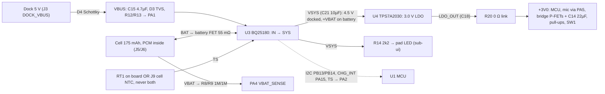

# Power: cell, charger, power path, LDO, rails
Status: schematic Rev E (gen.py; ERC 0 errors / 335 warnings, `hw/pod/gen.erc` 2026-10-01 19:34), rough-draft layout (4 of the 7 unrouted connections are in this subsystem), charger firmware not written. Updated 2026-10-01.
· Source of truth: `hw/pod/gen.py` (blocks CHARGER, LDO, VBAT_SENSE, CELL_PADS), `hw/pod/place_r1.py`, `hw/mech/shell_r1.py` (`CELL`), `docs/spec.md` §7, D11, D12, D18
· Owner decisions: O1, O5, O12(c), O13, O16(1)(2), O9/O15 (R20 test link), O19 (cell replaced as it ages) · Open ECRs: ECR-0002 (U3 cluster), ECR-0005 (LDO rating), ECR-0008 (cell quote / supply), ECR-0009 (R23 safety: interlocks, charge logging, supervised first charge)

## Purpose
- Carries **F5** Charge the cell, **F6** Temperature-safe charge, **F7** System power rail, **F8** Battery level, and the power side of **F13** Charger link (`integration-map.md` §1).
- Feeds every +3V0 load, plus VSYS → the LED (**F12**, sub-ui).
- Must give ≥ 8 h per charge, target ~12 h (D18). Must charge as fast as the cell allows, with temperature qualification (O12c). Self-noise no louder than ambient: linear regulators only, the MCU core SMPS is the one exception (D11). Must provide an Off mode (D12).

## Big picture

1. **Docked:** dock 5 V → D4 → VBUS → U3 IN. U3 holds VSYS at 4.5 V (SYS_REG default). It charges the cell CC/CV to 4.2 V through its battery FET.
2. **Undocked:** U3 connects the cell to VSYS through the same FET, so VSYS ≈ VBAT (3.0–4.2 V). The battery-undervoltage lockout (BUVLO) cuts the cell off at 3.0 V.
3. **U4** makes the quiet 3.0 V rail from VSYS. R20 (0 Ω) joins LDO_OUT to +3V0. Lift R20 to put a meter in series, or to feed a bench 3.0 V into TP4.
4. **The MCU runs the charger:** it sets current and limits over I2C, takes interrupts on PA15, reads VBAT/2 on PA4 and the NTC voltage on PA2. With no firmware, U3 charges at **10 mA** (its default).
5. **Temperature:** one 10 kΩ NTC on TS. With the dock attached, a 38 µA bias current turns its resistance into a voltage that U3 compares against JEITA thresholds (on battery only, TS/MR is instead pulsed with 60 µA as a push-button input: register plan, EN_PUSH). JEITA is the battery-industry rule set that cuts or stops charging when the cell is cold or hot.

## Elements
| Ref | Part (what it is) | LCSC · class · JLC stock · $ (JLC API 2026-10-02T00:02Z) | Notes |
|---|---|---|---|
| BT1 | **Renata ICP501233PA-02**: 3.7 V Li-ion polymer pouch cell, 175 mAh, protection circuit (PCM) built in, 2 × AWG 30 leads, **no NTC** | not JLC; distributor quote only (bom.md, 2026-10-01) | Hand-soldered to J5 BAT+ / J6 BAT− |
| U3 | **BQ25180YBGR**: TI single-cell linear charger with power path, I2C, NTC/JEITA, ship mode; DSBGA-8, 1.6 × 1.1 mm, 0.4 mm ball pitch | C3682423 · Extended · 4,788 · $2.04 | Pins: A1 /INT, A2 IN, B1 SCL, B2 SYS, C1 SDA, C2 BAT, D1 TS/MR, D2 GND |
| U4 | **TPS7A2030PDQNR**: TI 300 mA ultra-low-noise 3.0 V LDO, X2SON-4 1 × 1 mm, active output discharge | C5220164 · Extended · 3,286 · $0.22 | IN and EN both on VSYS |
| RT1 | **NCP15XH103F03RC**: Murata 10 kΩ B3435 NTC thermistor, 0402 | C77131 · Extended · 289,853 · $0.02 | Fitted by default. Measures **board** temperature 3.2 mm from U3, not the cell's |
| J9 | copper pad | – | Optional NTC taped to the cell (other lead to BAT−). If used, RT1 is not fitted |
| R20 | 0 Ω 0402 link, LDO_OUT → +3V0 | C17168 · Basic | Test hook (Rev E). Carries every +3V0 milliamp, bridge peaks included |
| R8, R9, C19 | 1 MΩ / 1 MΩ divider + 100 nF hold cap | C26083, C1525 · Basic | VBAT/2 → PA4. Always connected: 2.1 µA at 4.2 V |
| R15, R16, R17 | 10 kΩ pull-ups to +3V0 on I2C_SCL, I2C_SDA, CHG_INT | C25744 · Basic | TI asks for 10 kΩ on SCL/SDA (SLUSE99C Table 6-1) |
| C16, C21, C17, C18 | 4.7 µF VBAT, 10 µF VSYS, 1 µF LDO in, 1 µF LDO out | C23733, C19702, C52923 · Basic | TI: ≥ 10 µF on SYS. C18 must stay at U4 for stability |
| C15 | 4.7 µF on VBUS at U3 IN (block DOCK_USB) | C23733 · Basic | ≤ 10 µF USB attach limit (gen.py) |
| J5, J6 | 1.0 mm hand-solder pads, BAT+ / BAT−, F face, rear edge | – | board (33.0, 3.4) and (33.0, 5.0) |

## Interfaces
| To | Nets / pins (as in integration-map.md) | What crosses / invariant |
|---|---|---|
| [sub-dock-usb](sub-dock-usb.md) | VBUS (D4.K, D3.C, C15, R12 → U3.A2 IN) | 5 V in, minus D4's drop. U3 runs from 3.0–5.5 V; overvoltage cut at 5.7 V typ. Input current limit ILIM = 500 mA (default) |
| [sub-processing](sub-processing.md) | +3V0 → U1 VDD/VDDA/VDDSMPS/VBAT; I2C_SCL PB13 ↔ U3.B1; I2C_SDA PB14 ↔ U3.C1; CHG_INT PA15 ← U3.A1; TS PA2 ↔ U3.D1; VBAT_SENSE PA4 | I2C2 at **address 0x6A**. /INT is a 128 µs low pulse (EXTI). PA4 = ADC4, which works in Stop 2. **PA2 must stay an analog input:** TS held < 90 mV for 10 s puts U3 into ship mode |
| [sub-output](sub-output.md) | +3V0 → Q1/Q2 S_P, C14 22 µF | Bridge peaks ~315 mA at full drive into 8 Ω (gen.py R21 note) vs U4's 300 mA rating: ECR-0005 |
| [sub-audio-in](sub-audio-in.md) | +3V0 → PA5 → MIC_VDD | Mic 1.1–2.15 mA (power.py). Rail noise reaches the mic directly, which is why U4 is the 7 µVrms part |
| [sub-ui](sub-ui.md) | VSYS → R14 → LED_A (J7); SW1 pins 1/2 on +3V0 | LED 0.14–0.73 mA on battery (VSYS 3.0–4.2 V), 0.82–0.86 mA docked (4.5 V), VF 2.6–2.7 V (sub-ui Key numbers; integration-map §5 still says 0.35–0.75). Pressing SW1 draws 3.0 V / 2.2 kΩ ≈ 1.4 mA |
| [sub-debug-test](sub-debug-test.md) | TP4 +3V0, TP5 GND, TP6 VSYS; R20 | Lift R20: meter the rail, or inject 3.0 V on TP4 |
| [reg-board](reg-board.md) | U3 (17.0, 3.0) B; C15 (15.3, 2.2), C16 (18.7, 2.2), C21 (17.0, 4.9), RT1 (19.8, 4.6), U4 (24.2, 7.4), C17/C18, R20 (23.4, 11.4), R8/R9/C19 (10–12, 2.0), all B; J5/J6 F rear | Unrouted (drc.json 2026-10-01 19:44): VBUS U3.A2–C15, VSYS at U3.B2, I2C_SDA ×2. C15 and C16 sit on the wrong sides of U3's balls (ECR-0002 item 2) |
| [reg-pod-body](reg-pod-body.md) / [physical](physical.md) | cell envelope x 30.6–65.6, y 5.4–10.7, z −8.1…3.9 (`shell_r1.CELL`) | Under the board's B face. The foam strips meant to sit on the cell overlap it by only 0.1 mm each (board 13 wide, cell 12): the board's spring has no floor (reg-pod-body issue 11). Taped to the inner wall with 0.25 mm VHB 4914 in a 0.3 mm gap (tolerances.md). The dock target sits directly below the cell (sub-dock-usb). O19: the cell is a service part, but VHB is permanent (physical, Service) |
| firmware ([sub-processing](sub-processing.md)) | I2C2 driver, EXTI PA15, ADC4 PA4, ADC PA2 | Register plan below. TS is only measured while docked (SLUSE99C Table 8-6) |

## Constraints
- **D11:** U3 and U4 are both linear, so nothing here switches. **D12 Off** = MCU Stop 2. **D18 / O1:** ≥ 8 h, ~12 h target. **§7 supply rail:** the bridge stays on the regulated 3.0 V rail (so gain doesn't track charge).
- **O16:** Renata 175 mAh cell and BQ25180 are owner choices. **O12(c):** fastest practical charge, temperature-qualified. **O13:** board may grow a little for charging.
- **Cell limits (Renata spec Rev V03, 08/2019, fetched 2026-10-01):**
  - CC/CV charge to 4.2 V; normal 0.5C = 87.5 mA, **max 1C = 175 mA**.
  - **Charge only at 0–45 °C.**
  - Cut-off 3.0 V.
  - Discharge: 175 mA continuous, 350 mA (2C) in pulses.
  - Storage −20…45 °C (0–30 °C if longer than 3 months).
- **U3 step size:** above 35 mA, ICHG moves in 10 mA steps (SLUSE99C §8.5.1.5). So "1C" means **170 mA**: the next step, 180 mA, exceeds the cell's 1C maximum.
- **TS rule: RT1 or J9, never both.** Two 10 kΩ NTCs in parallel read 5 kΩ at 25 °C: 5 kΩ × 38 µA = 0.19 V, which is U3's 45 °C "warm" entry (0.185 V). U3 would treat room temperature as warm.
- **U4:** input 1.6–6.0 V (VSYS ≤ 4.9 V by design); output 3.0 V ± 1.5 %; rated 300 mA.

## Key numbers
| Quantity | Value | Source (date) |
|---|---|---|
| Cell capacity / size / mass | 175 nom (170 min) mAh; ≤ 5.3 × 12 × 35 mm; ~4.2 g; < 480 mΩ at 30 % SOC | Renata spec V03 08/2019, fetched 2026-10-01 |
| Charge current | 170 mA (20–45 °C), 50 mA below 20 °C (firmware rule) | gen.py U3 comment (2026-10-01), adjusted to U3's 10 mA steps |
| U3 defaults | ICHG 10 mA, VBATREG 4.20 V, BUVLO 3.0 V, ILIM 500 mA, SYS 4.5 V, safety timer 6 h, watchdog 160 s → defaults | SLUSE99C (Jan 2023) §8.5.1, fetched 2026-10-01 |
| U3 TS thresholds (default) | 0 / 10 / 45 / 60 °C (cold / cool = ½ ICHG / warm = −100 mV / hot); bias 38 µA with an adapter, 60 µA pulsed (4 ms on / 196 ms off) on battery only; VTSMR 90 mV | SLUSE99C §7.5, §8.5.1.12 (local copy re-read 2026-10-01) |
| U3 battery FET / quiescent | 55 mΩ typ (90 max); battery-only 3 µA (4–5 µA with push-button on); ship 3.2 µA; shutdown 15 nA | SLUSE99C §7.5 |
| U3 thermal | θJA 107 °C/W (JEDEC), 65 °C/W (TI EVM); thermal regulation 100 °C | SLUSE99C §7.3, §8.5.1.6 |
| U4 output | 3.0 V ± 1.5 % (2.955–3.045 V) over 1–300 mA, line and temperature | TPS7A20 SBVS338H (Jul 2024) §5.5; local copy 2026-09-30 |
| U4 limits | dropout ≤ 140 mV at 300 mA; current limit 360 / 520 / 730 mA (min/typ/max); short-circuit 160 mA | SBVS338H §5.5 |
| U4 noise / Iq / θJA | 7 µVrms; PSRR 95 dB at 1 kHz, 75 dB at 100 kHz; 6.5 µA typ (8.5 max at 25 °C); 166 °C/W | SBVS338H §5.4–5.5 |
| Bridge peak on +3V0 | ~315 mA (3.0 V into 8 Ω + 1.2 Ω FETs) | gen.py R21 comment; integration-map §5 |
| VBAT_SENSE | VBAT/2 = 1.5–2.1 V at PA4; divider 2.1 µA; τ = 50 ms | gen.py R8/R9/C19 (derived) |
| Rail hold on peaks | +3V0 holds at a 315 mA peak while VBAT ≥ ~3.32 V (3.0 + 0.14 dropout + 0.315 × (0.48 + 0.09)) | derived, Renata + SLUSE99C + SBVS338H |

### Rails
| Rail | Source | Range | Loads |
|---|---|---|---|
| VBUS | dock via D4 | 5 V − D4 drop (TBD: Vf at ~0.2 A unmeasured) | U3 IN, R12/R13 (25 µA), D3, C15 |
| VSYS | U3 SYS | 4.5 V docked; ≈ VBAT − I × 55 mΩ on battery (3.0–4.2 V) | U4 IN/EN, C17, R14 LED, TP6 |
| VBAT | cell ↔ U3 BAT | 3.0–4.2 V | U3, R8/R9, C16 |
| LDO_OUT → +3V0 | U4 via R20 | 2.955–3.045 V | MCU, mic (PA5), bridge, pull-ups, SW1, TP4 |
| VDD11 / MIC_VDD | MCU SMPS / PA5 | see sub-processing / sub-audio-in | – |

### Power budget and runtime
Model: `sim/checks/power.py` rev 2, which is spec §7 v0.14 (l.405–417). The spec's l.365 table is the older v0.6 budget.
- **Full chain awake:** 5.0 / 6.8 / 9.8 mA (low / nominal / high).
- **Idle detector only:** 1.7 / 2.2 / 3.4 mA.
- **Not in the model:**
  - LED: 0.14–0.73 mA on battery, 0.82–0.86 mA docked (O8; sub-ui).
  - U3 battery-only quiescent: 3–5 µA.
  - SW1 while pressed: 1.4 mA.
- Spec §7 only gives runtimes for 105–150 mAh cells. The table below is the same model at 175 mAh (run 2026-10-01, no file written), with the LED at 0.55 mA nominal and 0.75 mA pessimistic. That LED charge is conservative: on battery the LED draws ≤ 0.73 mA, and if firmware holds brightness at the 3.0 V floor it is ~0.14 mA. Values are pessimistic … nominal, in hours:

| Full chain awake | Without LED | With LED (solid, O8) |
|---|---|---|
| 100 % (never idles) | 13.4 … 22.0 | **12.5 … 20.3** |
| 50 % | 19.9 … 33.2 | 17.8 … 29.6 |
| 18 % (quiet room, idle detector rev 2) | 28.7 … 49.2 | 24.6 … 41.7 |

**The 175 mAh cell meets 12 h even in the pessimistic case of never sleeping with the LED on.** The 105 mAh cell gave 8.0 h in that case.

### Charge time, Off, storage
- **Charge (1C):** ≥ 1.0 h of constant current (175 mAh / 170 mA), plus a constant-voltage taper down to the 17 mA termination current. **Total TBD:** measure on the bench. Below 20 °C (50 mA) it's ≥ 3.5 h. Below 10 °C, U3 halves that again (≥ 7 h), which outlasts the 6 h safety timer unless 2XTMR_EN is set. The old spec figure (§7 l.386, "2.5–3 h at ≤ 0.5C, MCP73831") is obsolete.
- **Off (D12, MCU in Stop 2), estimated ≈ 16.5–24 µA:**
  - MCU 3.9–8.55 µA (A3 §5);
  - U4 6.5–8.5 µA;
  - U3 4–5 µA;
  - VBAT divider 2.1 µA.
  - About **260–375 days** on 85 % of 175 mAh (derived).
- **Storage (proposed, not decided):** U3 shutdown mode (EN_RST_SHIP = 01). SYS goes off and the pod wakes only when docked. The VBAT divider (2.1 µA) is then the only drain, because it sits on the cell side of U3's battery FET.
  - Ship mode's button wake doesn't help here: SW1 is on PA0, not on TS/MR.

### Charger register plan (proposed from SLUSE99C; firmware not written)
| Register | Default | Set | Why |
|---|---|---|---|
| ICHG_CTRL 0x4 | 10 mA | code 44 = **170 mA** at 20–45 °C; code 32 = 50 mA below 20 °C | Cell max 1C; 20 °C step from gen.py. TS on PA2 is read while docked |
| TS_CONTROL 0xB TS_HOT | 60 °C | **45 °C** (2b11) | The cell may only charge at 0–45 °C. **The default is unsafe for this cell** |
| IC_CTRL 0x7 WATCHDOG_SEL | 00: registers revert to defaults after 160 s without I2C | see open issue 3 | A revert also restores TS_HOT = 60 °C |
| IC_CTRL 2XTMR_EN | 0 | 1 | Cold, slow charges must not hit the 6 h safety timer |
| VBAT_CTRL, BUVLO, ILIM, SYS_REG | 4.20 V, 3.0 V, 500 mA, 4.5 V | keep (SYS_REG 000 = battery tracking is a heat lever) | These already match the cell (4.2 V CV, 3.0 V cut-off) |
| MASK_ID PG_INT_MASK | 0 (enabled) | keep | Docking pulses CHG_INT, which wakes the MCU from Stop 2 to write this plan |
| SHIP_RST 0x9 EN_PUSH | 1 (push-button on TS/MR enabled on battery: 60 µA pulsed 4 ms / 196 ms; TS < 90 mV for 10 s (MR_LPRESS 01) → PB_LPRESS_ACTION 10 = ship mode) | **0** | No button is wired to TS/MR. Disabling it removes three paths into ship mode on battery: a J8–J9 solder bridge with the LED on, PA2 driven low, and the NTC above ~84 °C (1.5 kΩ × 60 µA = 90 mV, derived) |

## Open issues
1. **LDO 300 mA rating vs ~315 mA bridge peaks.** Below its 360 mA minimum current limit, but outside the rated and dropout-specified range. A 12 Ω exciter (3.0 / 13.3 Ω ≈ 226 mA) removes the problem; an 8 Ω one doesn't. **Closes:** E1 (exciter resistance) + ECR-0005 (simplification study).
2. **Charger register defaults are unsafe or useless for this cell.** TS_HOT is 60 °C against the cell's 45 °C limit. ICHG is 10 mA: a flat cell can't fill inside the 6 h timer, so it faults. **Closes:** firmware writes the plan above at boot and on every power-good interrupt; bench-verify by reading the registers back.
3. **U3 watchdog: pick one** (owner/firmware).
   - (A) Disable it (11). Simple, but U3 never resets on its own.
   - **(B, recommended)** 01 = U3 power-cycles SYS after 160 s without I2C, so the MCU must talk to it at least every ~2 min, waking from Stop 2 if needed (cost ≈ µA). Optionally add WATCHDOG_15S_ENABLE: a hung pod reboots 15 s after docking. That's valuable in a bonded pod with no reset button.
   - **B breaks ROM DFU unless handled:** the ST bootloader never talks I2C, so a DFU session longer than 160 s (40 s with setting 10) power-cycles the pod mid-update. Rule: **the boot stub sets WATCHDOG_SEL = 11 before jumping to ROM DFU**; the application re-arms it (sub-dock-usb DFU step 3).
   - (C) The default 00 restores TS_HOT = 60 °C after a firmware hang. Don't use it.
4. **RT1 sits 3.2 mm from U3.** U3 dissipates up to ~0.2 W at 1C: (4.5 − 3.3 V) × 0.17 A at 107 °C/W ≈ +21 °C at its die. RT1 therefore reads hot, which errs safe but may stop 1C charging on warm days. **Closes:** log TS against a cell thermocouple during a 1C charge. Levers: SYS_REG battery tracking, moving RT1 (reg-board), or J9.
5. **Self-test while docked heats U4, and ECR-0009 forbids it as written.** VSYS is 4.5 V when docked, so a full-scale |Z| sweep (F4, run over USB) puts ~1.5 V × the bridge current across U4 (166 °C/W). ECR-0009 adds "no exciter output while VBUS is present". **Closes:** the owner's ECR-0009 decision (sub-output issue 12): recommended a capped self-test-only exemption (≤ ~−12 dBFS), or SYS_MODE = 01 (system from the battery) during the sweep, or sweep on battery and read back later.
6. **R20 (0402 0 Ω) carries the whole rail, peaks included.** Its jumper current rating isn't in any source yet. **Closes:** read the Uni-Royal 0402 jumper rating (TBD).
7. **Rail tolerance vs USB.** +3V0 can be 2.955 V; USB FS needs VDDUSB ≥ 3.0 V, bonded to VDD on this package (A3 §3; datasheet-provenance.md). Details in sub-dock-usb.
8. **Unrouted around U3** (VBUS, VSYS, I2C_SDA). The fix candidates (swap C15/C16, I2C pull-ups beside U3) are in ECR-0002, **on hold for the simplification study**.
9. **Missing research note:** spec O12 cites `docs/research/battery-and-charging.md`, which doesn't exist. Cell and charger facts here come straight from the two datasheets, fetched 2026-10-01 (BQ25180 SLUSE99C, SHA-256 prefix c2008f613723fec3; Renata V03, c3bb2ebe9c1d78af). Neither is in `datasheet-provenance.md`.
10. **Not yet known:**
    - Renata price (quote only);
    - where the cell's leads and PCM exit;
    - the cell's own self-discharge;
    - D4's forward drop at ~0.2 A;
    - real charge time;
    - E4 currents (the whole budget is [Low] until then).
11. **Diagrams:** no dedicated power-tree PNG (the Mermaid above stands in). `schematic-rev1.png` labels the cell "NTC taped on", but the Renata pack has no NTC: RT1 on the board is the default.
12. **Thermal placement vs cell safety (R23).** U3 (up to ~0.2 W at 1C, ~+21 °C die rise) sits on the B face 0.2 mm above a pouch that may only charge at 0–45 °C, with RT1 beside it. Moving U3 or changing the stack-up changes the cell's temperature during charge. **Closes:** ECR-0009 item 3 (board and cell temperature logged through a full charge before any wear).
13. **ILIM vs the dock cable.** ILIM defaults to 500 mA and charging runs at 170 mA from docking. A CC-less USB-A cable on an unenumerated PC port is limited to 100 mA by USB 2.0. **Closes:** firmware sets ILIM from CC_SENSE (PA3) or from enumeration (sub-dock-usb issue 9).

## Before you change this, check
- **Charge current or cell:** Renata 1C limit; U3's 10 mA steps; the safety timer; U3 heat → RT1; runtime table; the 2C peak limit vs bridge peaks (sub-output).
- **U4 or the 3.0 V value:** USB VDDUSB ≥ 3.0 V (sub-dock-usb); mic supply limits (sub-audio-in); bridge gain and peak current (sub-output); D11; ECR-0005.
- **NTC:** never fit both RT1 and J9. Keep PA2 analog-only (TS < 90 mV for 10 s = ship mode).
- **Moving U3/U4/C15/C16/C21/RT1 (reg-board):** 0.4 mm ball escape; RT1 distance from U3; ECR-0002.
- **VBAT_SENSE:** PA4 must stay < VDDA (VBATREG max 4.65 V → 2.33 V, still OK).
- **VSYS loads:** the LED (sub-ui) brightens when docked; U4 input ≤ 6 V.
- **Cell envelope or position:** reg-pod-body, physical; the dock target sits directly below the cell (sub-dock-usb).
- Walk any change through `integration-map.md` §10 and `tools/plm.py impact`.

## Change log
- 2026-10-01: created from gen.py Rev E, place_r1.py draft (drc 19:44), shell_r1.py, spec v0.14. Added primary data from the BQ25180 (SLUSE99C) and Renata (V03) datasheets. New findings: TS_HOT default exceeds the cell's 45 °C limit; 170 mA, not 175 mA; watchdog behaviour; 175 mAh runtime table; Off and storage drain.
- 2026-10-01 (editor pass): register plan adds EN_PUSH = 0 (no button on TS/MR); TS bias 38 µA only with an adapter (60 µA pulsed on battery); watchdog option B needs the boot stub to disable it before ROM DFU; LED current on the sub-ui basis (0.14–0.73 battery, 0.82–0.86 docked); issue 5 tied to ECR-0009; issues 12 (U3 heat vs cell, R23) and 13 (ILIM vs cable); foam-floor note; ECR-0008/0009 in the status line.
