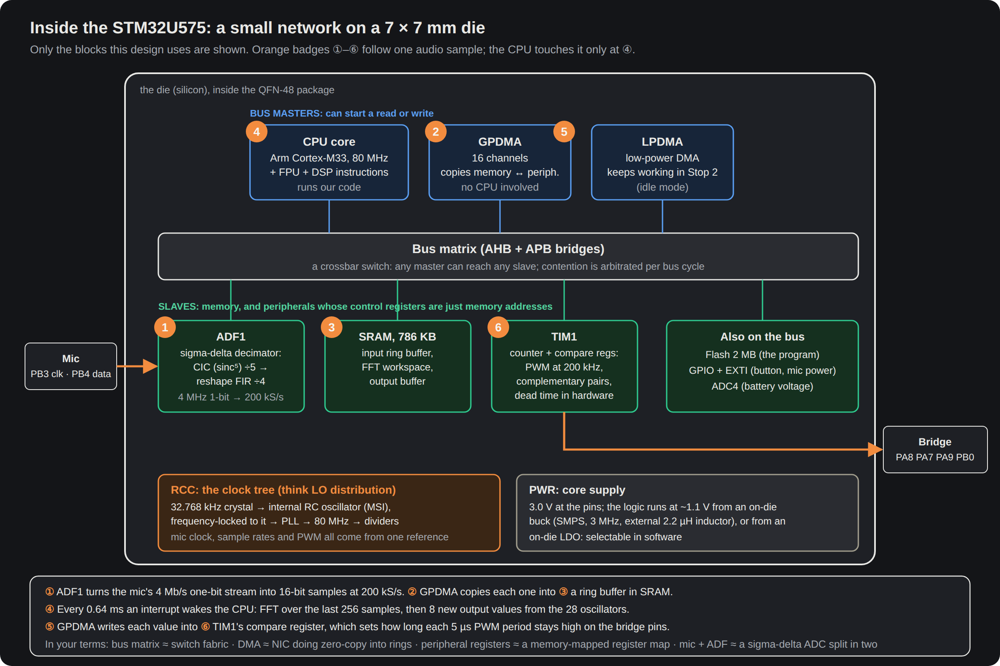

# Processing: MCU, core SMPS, clocks, firmware
Status: schematic Rev E (ERC 0), rough layout draft (routed 2026-10-01 19:44); **firmware: none written** (Python reference models only); updated 2026-10-01 · Source of truth: `hw/pod/gen.py` (MCU + SMPS + clock, lines 116-139; spare pins 262-264), `docs/research/A3-u575-plan.md` (chip plan), `docs/spec.md` D5/D11/D12/D14-D16 and §5 · Owner decisions: O6 (resolved -> D11), O9, O14, O15, **O18** (fail informatively: spare pins to pads, board measures itself, every uncertain value a firmware knob; spec L644), O19 (changes via firmware only) · Open ECRs: ECR-0003 (leg B pins), ECR-0008 (reserve MCUs: 8 at JLC), ECR-0009 (firmware interlocks: no output while docked, ceiling), ECR-0010 (firmware tested before the board order)

## Purpose
- Carries **F2 Process** (`integration-map.md` §1): turn 200 kS/s mic samples into a 1.5-4 kHz signal and a 200 kHz PWM duty stream.
- It is the hub of almost every other function: F1 (ADF1), F3 (TIM1), F4 (ADC on PA6), F6 (TS on PA2), F8 (ADC4 on PA4), F9 (PA1), F10 (USB FS), F11 (wake on PA0), F12 (LED on PB7), F13 (I2C2), F14 (SWD, boot).
- Must hold D12's modes (Full, Transient-only, Off) and the runtime budget (D18; `sub-power.md`), with self-noise no louder than ambient (§1.2.3, D11).

## Big picture



```
LSE 32.768 kHz (Y1) -lock-> MSIS 48.005 MHz -/3-> 16.00 -x20-> VCO 320.03 -/4-> SYSCLK = HCLK = TIM1 clock 80.009 MHz
   ADF1 kernel HCLK -/2-> proc_ck 40 MHz -/10-> mic clock 4.0004 MHz -> CIC5 /5 -> RSFLT /4 -> 200.02 kS/s
   TIM1 centre-aligned, ARR 200 ------------------------------------------> PWM 200.02 kHz (one DMA update per period)
HSI48 (+ CRS trim) -> USB FS 48 MHz            internal SMPS 3 MHz: VLXSMPS -> L1 -> VDD11 (core ~1.1-1.2 V)
```
- One crystal-locked clock feeds everything, so mic clock, sample rate and PWM rate are exact integer ratios (A3 §2). Bridge-carrier leakage into the mic folds to 0 Hz (D14).
- The core runs from the chip's own buck converter (SMPS); D11 allows this one switcher only. It switches at a fixed 3 MHz in voltage Ranges 1-3, far above hearing.
- The CPU wakes every 0.64 ms hop, runs the DSP on a RAM ring that GPDMA fills from ADF1, and GPDMA feeds TIM1 its duty values (`docs/learn/02-inside-the-chip.png` caption).

## Elements
### Silicon and support parts
| Ref | What it is | LCSC · class | Draft position | Why |
|---|---|---|---|---|
| U1 | **STM32U575CIU6Q**: ST Cortex-M33 MCU, 160 MHz max, FPU + DSP, 2 MB flash, 786 KB SRAM; C = 48 pins, I = 2 MB, U = UFQFPN 7x7, 6 = -40-85 C, Q = internal-SMPS pinout | C5271013 · Extended | F, (13.0, 6.5) | D5; ADF1 for the mic; ~40-45 µA/MHz on the SMPS (DS13737 Rev 10 §7 ordering code) |
| L1 | **DFE201610E-2R2M=P2**: Murata 2.2 µH shielded metal-alloy inductor, 2.0 x 1.6 x 1.0 mm, ~140 mΩ, 2.4 A | C337891 · Extended | F, (20.4, 10.6) | SMPS coil; ST: 2.2 µH +-20 %, Isat > 0.5 A, DCR < 200 mΩ (B-parts-selection.md §3) |
| C8, C9 | 2.2 µF 0402, **6.3 V** (since the 2026-10-01 audit) | C12530 · Basic | F, near pin 23 | VDD11 COUT; **DS asks >= 10 V** (Open issue 1) |
| C7 | 10 µF 10 V X5R 0603 (Samsung CL10A106KP8NNNC) | C19702 · Basic | F, (18.0, 6.5) | VDDSMPS CIN (DS: 10 µF, >= 10 V, ESR < 10 mΩ) |
| C1-C3 | 100 nF 16 V X7R 0402 (Samsung CL05B104KO5NNNC), one per VDD pin | C1525 · Basic | F | AN5373 Rev 7 |
| C4 | 10 µF 0603 bulk on +3V0 | C19702 · Basic | F | AN5373: 10 µF typ, 4.7 µF min after DC bias |
| C5, C6 | 1 µF 25 V X5R + 100 nF on VDDA | C52923, C1525 · Basic | F | AN5373 |
| C20 / C10 | 100 nF at VBAT pin 1 / on NRST | C1525 · Basic | F | AN5373 |
| Y1 | **Q13FC13500004**: Epson FC-135 32.768 kHz watch crystal, 3.2 x 1.5 mm, CL 12.5 pF | C32346 · Basic | F, (6.6, 4.2) | D16: pitch matched between the two unlinked pods |
| C11, C12 | 15 pF C0G 0402 (Fenghua 0402CG150J500NT) | C1548 · Basic | F | LSE load (B-parts §4) |
| R1 | 10 k, PH3-BOOT0 to GND | C25744 · Basic | F | boot from flash |
| R11 | 100 k pull-up on PA10 (net N$3) | C25741 · Basic | **B**, (10.5, 11.2) | stops the ROM bootloader seeing a floating USART1_RX |

Drop-in alternative: **STM32U585CIU6Q** (same die plus crypto), C5271021, 15 in stock, $12.52 (spec D5, 2026-09-30).

### Pins (from integration-map §4; 40 of 48 used)
| Job | Pins |
|---|---|
| Supplies | 1 VBAT, 9 VDDA, 21 VDDSMPS, 25/36/48 VDD on +3V0; 20 VLXSMPS; 23/46 VDD11; 8/22/24/35/47/49 grounds |
| Clock, reset, boot | 3 PC14 LSE_IN, 4 PC15 LSE_OUT, 7 NRST, 44 PH3-BOOT0 (N$1), 31 PA10 (N$3) |
| Mic (ADF1, AF3) | 15 PA5 MIC_VDD, 39 PB3 N$2 (clock), 40 PB4 MIC_DATA |
| Bridge (TIM1, AF1) | 29 PA8 GA_P, 17 PA7 GA_N, 30 PA9 GB_P, 18 PB0 GB_N |
| Analog in | 11 PA1 VBUS_SENSE, 12 PA2 TS, 13 PA3 CC_SENSE, 14 PA4 VBAT_SENSE (ADC4), 16 PA6 I_SENSE (ADC1_IN11) |
| Charger | 26 PB13 I2C_SCL, 27 PB14 I2C_SDA, 38 PA15 CHG_INT |
| USB / debug / UI | 32 PA11 USB_DM, 33 PA12 USB_DP, 34 PA13 SWDIO, 37 PA14 SWCLK, 10 PA0 BTN, 43 PB7 LED_K |
| **Free** | 2 PC13 (keep static: ES0499 §2.2.1), 5 PH0, 6 PH1, 19 PB1, 28 PB15, 41 PB5, 42 PB6, 45 PB8 |

Costs of this map: PB3 loses SWO trace; PB4 is NJTRST after reset (fine with SWD, but its pull-up back-feeds the unpowered mic in reset and ROM DFU: `sub-audio-in.md` issue 11). The MDF fallback pins PB8/PB1 are free but not wired to the mic (`sub-audio-in.md` issue 5).

### Modes (D12, `spec.md` lines 218-222)
| Mode | Clock / range / regulator | Mic | Bridge | MCU draw | Source |
|---|---|---|---|---|---|
| Full / Transient-only, alg. B | P80, Range 2, SMPS 3 MHz | on | on | 2.3 / 2.7 / 3.2 mA + periph. 0.6-0.8 | `sim/checks/power.py` lines 27-28 |
| Same, alg. A | P48 (MSIS direct), Range 3 | on | on | ~1.3-1.8 mA | A3 §5 |
| Idle listening (C9) | **two plans** (Open issue 4) | on | stopped | 0.5-1.0 mA (16 MHz run) or ~0.1 mA (Stop 2 + LPDMA) `[Low]` | power.py line 39; A3 §1.3 |
| Off | Stop 2 on SMPS (asynchronous) | unpowered | stopped | 3.90 / 4.25 (RTC on LSE) / 8.55 µA | DS Table 58 (Rev 10 p.183) |
| Docked (charge, DFU) | not specified | - | - | unknown | integration-map F9/F10 |

### Firmware: architecture, algorithms, status
**Status (checked 2026-10-01): no firmware source in the repo** (no `.c`, `.h`, linker script, CMake or Makefile). What exists:
- `sim/dsp/pipeline.py`: float64 reference of the whole chain (mic model, decimation, A, B, idle detector). It models the D2 fallback decimation (400 kS/s + 31-tap half-band), not ADF D1.
- `sim/dsp/run_phase1.py` (synthetic scenes), `sim/dsp/nature_demo.py` (real Port Meadow bats, 3 WAVs in `sim/out/nature/`), `sim/checks/idle_detector.py`, `ntf_compare.py` (noise shaper), `pwm_ultrasonic_leak.py`, `deadtime_switching.py`, `power.py`.

Planned structure (D15, D14, §5, D6):
```
ADF1 -GPDMA-> SRAM ring 200 kS/s -IRQ every hop 128 = 0.64 ms-> CPU
  B: 256-pt real FFT -> 28-32 log bands 20-85 kHz -> mic EQ -> floor / transient gate -> envelopes
     -> oscillator bank at 12.5 kS/s (8 samples per hop)
  A: x LO -> low-pass -> /16 -> 12.5 kS/s -> envelope squelch
  -> volume (D3) -> ceiling (D17) -> x16 interpolate -> 3rd-order shaper + TPDF dither -GPDMA-> TIM1 CCR, 200 kHz
Control: EXTI PA0 (modes, volume, reset), I2C2 + EXTI PA15 (charger), ADC/ADC4, TIM4 LED, USB FS (CDC self-test, ROM DFU), SWD
```
| | A: heterodyne | B: log frequency compression |
|---|---|---|
| Shift method | out = in - LO; one band at a time; LO tunable (model: 38 kHz) | channel vocoder: band energies drive tones at log-mapped pitches, f_out = 1.5 kHz x (4/1.5)^u, u = ln(f/20k)/ln(85k/20k) (`pipeline.py` map_freq) |
| CPU (C2, M4F counts, 80 MHz) | 19-39 Mcycle/s = 23-48 % | 44-65 Mcycle/s = 55-81 % |
| Clock | 48-64 MHz | 80 MHz |
| Owner listening (NEXT.md §2, 2026-09-30) | "informative but aesthetically poor": fallback | transient-only good for noisy places; full acceptable |
| Status | fallback only if B won't fit (D12 v0.11) | leading; owner asked for a 7-WAV real-recording set (NEXT.md §2), not yet made |

Toolchain (D15): C11, arm-none-eabi-gcc, CMake, CMSIS + ST LL drivers, CMSIS-DSP; CubeMX read-only.

Firmware rules already fixed by sources:
1. Raise the voltage range before REGSEL = 1; **never Range 4 on the SMPS** (A3 §4; DS Table 35 note: asynchronous in Range 4 and low-power modes).
2. Stop 2 stays on the SMPS (ES0499 §2.2.22: LDO + partial RAM can lock the part).
3. MSI PLL unlock interrupt: disable and re-enable PLL mode (ES0499 Rev 12).
4. PLL2/PLL3/HSI48/SHSI off and RDY clear before Stop 2 (ES0499 §2.2.5).
5. LSEDRV = high; low and medium-low drive are unusable (ES0499 §2.2.3/§2.2.16; B-parts §4).
6. ADF: dividers only while stopped; even CCKDIV+1; mic starts in standard mode (`sub-audio-in.md`).
7. TIM1: OSSI and idle levels before MOE; faults via BKIN, never ocref_clr (ES0499 Rev 11).
8. ADC reference is VDDA = the 3.0 V LDO (no VREF+ pin): calibrate against VREFINT (A3 §3).
9. Diff RM0456 Rev 7 (PWR, RCC, GPIO, GPDMA, ADC4, TIM1) against Rev 6 before writing code (datasheet-provenance.md).

## Interfaces
| To | Nets / pins | Peripheral / firmware |
|---|---|---|
| [sub-audio-in](sub-audio-in.md) | MIC_VDD PA5, N$2 PB3, MIC_DATA PB4 | GPIO supply, ADF1 (Stop-2 capable), GPDMA |
| [sub-output](sub-output.md) | GA_P PA8, GA_N PA7, GB_P PA9, GB_N PB0; I_SENSE PA6 | TIM1 complementary PWM + dead time (12.5 ns steps at P80); ADC1_IN11 self-test |
| [sub-power](sub-power.md) | +3V0 on VDD/VDDA/VDDSMPS/VBAT; VBAT_SENSE PA4; TS PA2; I2C_SCL PB13, I2C_SDA PB14; CHG_INT PA15 | ADC4 (works in Stop 2), I2C2, EXTI; MCU is the largest load |
| [sub-dock-usb](sub-dock-usb.md) | USB_DP PA12, USB_DM PA11, VBUS_SENSE PA1, CC_SENSE PA3 | USB FS from HSI48 + CRS (DS §3.12 p.51: trims from USB SOF or LSE); ROM DFU. Boot stub disables U3's watchdog before the DFU jump (sub-power issue 3) |
| [sub-ui](sub-ui.md) | BTN PA0, LED_K PB7 | WKUP1/EXTI0; TIM4_CH2 open-drain PWM > 20 kHz |
| [sub-debug-test](sub-debug-test.md) | SWDIO PA13, SWCLK PA14, NRST, N$1 (BOOT0), N$3 (PA10) | SWD, ROM bootloader, USB self-test (O15) |
| [reg-board](reg-board.md) | U1 + SMPS on F, exposed-pad GND vias to In1 | SMPS loop, decoupling distances (Key numbers) |

## Constraints
- **D5**: STM32U575CIU6Q. **D11**: only the core SMPS may switch; fixed frequency; owner listening test E11 (full chain, 16 MHz idle, Stop 2).
- **D14 / A3 §2**: every rate an integer ratio of HCLK; mic divider even; a SYSCLK change restarts the ADF.
- **D16**: crystal reference. **D12**: modes. **D15**: toolchain. **D17**: fixed ceiling, no clicks.
- **DS13737 Rev 10 §5.1.6 (p.153)**: COUT 2 x 2.2 µF +-20 %, ESR < 20 mΩ at 3 MHz, rated >= 10 V; CIN 10 µF, ESR < 10 mΩ, >= 10 V; L 2.2 µH.
- UFQFPN48-SMPS pinout: PB2, PB9, PB10, PB12 do not exist; no VDDUSB/VREF+ pins (A3 §3; datasheet-provenance.md).
- **O14**: layout is done together; positions below are a draft. A board simplification/cost study is about to start.
- **O18** (spec L644): rev 1 fails informatively. Spare MCU pins go to pads (today the 8 free pins go nowhere); the board measures itself (rails and key signals readable by the MCU); every uncertain value is a firmware knob (registers, PWM parameters, clock rates); DFU is the most-verified path. **O19:** after rev 1, changes come through firmware only.
- **ECR-0009** (proposed): firmware interlocks: no exciter output while VBUS is present, ceiling (D17) independent of volume, pop-free start. Its docked-self-test conflict is `sub-output.md` issue 12.

## Key numbers
| Quantity | Value | Source | Date |
|---|---|---|---|
| JLC stock, U1 | **8**, $8.93 | `docs/build/bom.md` (JLC API) | 2026-10-01 |
| SYSCLK (P80) / range | 80.009 MHz / Range 2 (<= 110 MHz) | A3 §2 | 2026-09-30 |
| MSIS locked | 48.005 MHz = 1465 x LSE (+107 ppm, same both sides) | A3 §2 | 2026-09-30 |
| SMPS switching | 3 MHz (VDD > 1.9 V), Ranges 1-3 | DS Rev 10 Table 35, p.160 | Jul 2024 |
| SMPS ripple | ~110 mA p-p | A3 §4 | 2026-09-30 |
| Run current, 80 MHz on SMPS | ~3.3 mA flat out (~41 µA/MHz), interpolated | A3 §5 (DS Rev 8 Table 39) | 2026-09-30 |
| MCU, alg. B duty-cycled | 2.3 / 2.7 / 3.2 mA | power.py line 27 | 2026-09-30 |
| Stop 2 on SMPS, 3.0 V | 3.90 / 4.25 / 8.55 µA | DS Table 58 | Jul 2024 |
| LSE margin | gm_crit 2.16 vs Gmcritmax 2.7 µA/V (high drive) = 1.25x | B-parts §4 (DS Table 80) | 2026-09-30 |
| CPU, alg. B | 55-81 % of 80 MHz (M4 counts, +-50 %) | C2-cpu-budget.md | 2026-09-30 |
| CPU, idle detector rev 2 | ~3.4 Mcycle/s, ~21 % at 16 MHz | power.py line 38; spec §7 | 2026-09-30 |
| Latency target | <= 20 ms end to end | spec §5.3 | 2026-09-30 |
| Draft: VDD11 pin 46 to nearest 2.2 µF | **10.2 mm** (pin 23: C8 at 2.4 mm) | probe of `pod_r1_routed.kicad_pcb` | 2026-10-01 |
| Draft: VDDSMPS pin 21 to C7 / VLXSMPS track | 4.6 mm / 6.8 mm | same probe | 2026-10-01 |
| Draft: VDD pin 48 to C1 | 6.1 mm (C20 at 1.85 mm) | same probe | 2026-10-01 |
| Draft: LSE tracks | LSE_IN 4.5 mm, LSE_OUT 8.0 mm, F only | same probe | 2026-10-01 |
| Draft: L1 to mic | ~17 mm, opposite face (D11 satisfied) | same probe | 2026-10-01 |
| Draft: unrouted at U1 | BTN pin 10, I2C_SDA pin 27 (x2), N$3 pin 31 to R11 | `hw/pod/draft_r1/drc.json` | 2026-10-01 19:44 |

## Open issues
1. **C8/C9 are 6.3 V parts; DS13737 Rev 10 §5.1.6 says rated >= 10 V.** The audit (gen.py line 31) swapped Extended C107369 (10 V) for Basic C12530; `sourcing-lock.csv` and B-parts §3 still say >= 10 V. *Closes it:* owner picks: (a) back to C107369 (Extended, +1 type); (b) Basic 0603 16 V C23630 (2.5x area); (c) keep 6.3 V and accept a datasheet deviation. **Recommend (a):** the datasheet line is explicit, the 0402 footprint stays, and one more Extended type is ~$3 per order (`docs/build/bom.md`). Feed this into the cost study, not around it.
2. **MCU stock: 8 at JLC.** Two pods need 2; spares need more. *Closes it:* reserve or pre-order before the board order, or plan the U585 drop-in (15 in stock, +$3.59).
3. **SMPS layout (draft):** VDD11 pin 46 has no local cap (audit LD-05 still open); CIN 4.6 mm from VDDSMPS; 6.8 mm switch node. *Closes it:* the together-session (O14).
4. **Idle mode has two plans:** 16 MHz Range 3 run (power.py) vs Stop 2 + ADF + LPDMA (A3 §1.3). Stop 2 makes the SMPS asynchronous while the mic listens. *Closes it:* pick one; E11 listens in it; E4 measures it.
5. **CPU budget is an L452 estimate:** M4 cycle counts, a 2nd-order shaper and 32-48 oscillators; the design is an M33, 3rd-order shaper, 28-32 bands, and the ADF removes the 5-10 Mcycle/s half-band. The 800 kHz PWM option (MP-01) runs the interpolator and shaper 4x as often: **not costed anywhere.** *Closes it:* re-cost C2 for the U575; benchmark on the first board (S3).
6. **No bridge-fault input:** A3 §3 named PA6 as TIM1_BKIN; Rev E uses PA6 for I_SENSE. Errata say faults must use BKIN. *Closes it:* decide whether a hardware cut-off is needed; if so, find a BKIN source.
7. ROM-DFU entry ("boot stub", integration-map F10) and the self-test firmware (O15) have no design note; `docs/research/self-test-firmware.md` is referenced by the spec but does not exist.
8. USB needs VDDUSB 3.0-3.6 V (DS §3.9.1 p.34); this package has no VDDUSB pin and +3V0 sits at the minimum. Owned by `sub-dock-usb.md`.
9. Unverified: SMPS 3 MHz synchronous or free-running (spur check S1/E11); 80 MHz current interpolated (E4).
10. Missing diagrams: a clock tree and an MCU pin map as PNGs (both only as text today).
11. **SMPS inductor differs from the spec.** Spec D5 (L152) names Murata **LQM21PN2R2MGHL** (0805 chip inductor, C341781). Rev E uses **DFE201610E-2R2M=P2** (C337891, shielded metal-alloy). D11 (L214) asks for a low-magnetostriction part, and the sourcing lock notes the DFE's magnetostriction isn't published. *Closes it:* raise with the owner (spec or schematic changes); E11 listens for whine, including with the dock magnets near L1 (`sub-dock-usb.md` issue 11).

## Before you change this, check
- **Pin moves:** `integration-map.md` §4 (one job per pin), the AF table for the SMPS package, ADF only on PB3/PB4, TIM1 complementary pairs, ADC4 pins for Stop 2, WKUP1 = PA0, USB fixed on PA11/PA12; `sub-audio-in`, `sub-output`, `sub-power`, `sub-dock-usb`, `sub-ui`, `sub-debug-test`.
- **Clock changes:** D14 integer ratios, even mic divider, TIM1 ARR and dead-time tick, HSI48 for USB, D16 crystal margin.
- **SMPS parts or range/mode policy:** DS §5.1.6 ratings, D11, E11, ES0499 rules above.
- **Algorithm, PWM rate or clock per mode:** CPU budget (Open issue 5), power budget (`sub-power.md`), MP-01 (`sub-output.md`).
- **MCU swap:** the U585 is a drop-in; anything else redoes A3.
- Run the cross-check in `integration-map.md` §10.

## Change log
- 2026-10-01: created from gen.py Rev E, A3-u575-plan.md, C2, spec v0.14, DS13737 Rev 10, the rev-1 draft board probe (19:44 route). Found issues 1, 3-6.
- 2026-10-01 (editor pass): O18/O19 added to owner decisions and Constraints; ECR-0003/0008/0009/0010 in the status line; issue 11 (spec D5 names a different SMPS inductor); PB4 back-feed note; boot-stub watchdog rule.
