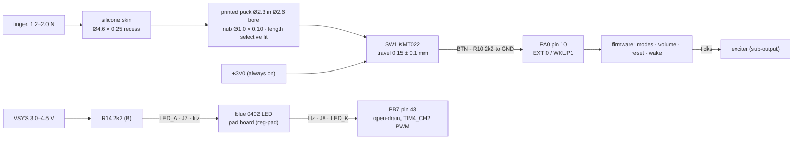

# UI: button and power LED
Rev MZ-2 2026-10-07: body rewritten to the Phase-2 design (`hw/current.yaml`, ECR-0018): SW1 alone on F at (18.5, 6.0) in a 4.3 x 3.1 lid pocket under a selective-fit printed puck + silicone skin; board hangs from the lid on VHB (no foam, no ribs); R10/R14 0201 on B; J7/J8 on B with >= 1.17 mm copper gaps; LED_K routed. Rev F/G facts moved to the last section.
Status: schematic = Rev G nets, MZ-2 packages (`hw/pod/pod_mz2.net`, bom_check nets PASS 2026-10-07); board `hw/pod/draft_r2/out/routed.kicad_pcb` DRC 0, 0 unconnected (BTN and LED_K routed, probe 2026-10-07); shell `hw/mech/shell_r2.py` (pocket, puck kit, skin recess; constants `hw/mech/dims_r2.py`); skin material not chosen; gesture model partly specified; no firmware. Updated 2026-10-07.
· Source of truth: `hw/pod/gen.py` (UI block; MZ2 table R10/R14), the routed board, `hw/mech/dims_r2.py` (SW, SW1, POCKET, BORE_D/PUCK_D/NUB_D/NUB_H, SKIN_D/SKIN_T, PRE_GAP, PUCK_L/PUCK_KIT, `switch_stack()`), `hw/mech/shell_r2.py::lid_base, puck`, `hw/padboard/gen.py` (LED D1), `docs/spec.md` D3, D12, §5.4
· Owner decisions: O8 (solid LED in the pad), O16(5) (switch on the board centre line), O16(7) (IP68 switch), O12(b) (sealing), O18 (rev 1 fails informatively), O26/O27 (Phase 2) · Open ECRs: ECR-0018 (Phase 2); ECR-0001 touches frame.py's stale `BUTTON`

> 2026-10-07 round 11 (NON-DEFAULT, packet Q1/Q2): K1 duct options (K1_DUCT, sim/acoustics/duct_options.py), k1t (walls/lid 0.6), 0.6 wall coupon (hw/mech/coupon_wall06.py). Phase 2 unchanged (dims snapshot: only new names REAR_GAP; shell checks add info fields puck_feasible / puck_guide_bore / pocket_breaks_outer_face). Facts: reg-pod-body.md Variants.

> 2026-10-07 round 12 (NON-DEFAULT, packet Q2): K1-thin button concepts (sim/checks/button_concepts.py, K1_BUTTON=dome in dims_k1). Recommended: Phi4 metal dome on new F pads (board F-copper edit only); fallback: skin 0.20 proud over KMT022 (no board change). Phase 2 unchanged (dims snapshot identical; shell adds info field trace_groove).

## Purpose
- Carries **F11** Wake / button and **F12** Power LED (solid) (`integration-map.md` §1).
- **One button does everything (D3, §5.4):** modes, volume, reset, and wake from Off. The wearer's only feedback is **ticks played through the exciter** (D3). The LED faces outward, so she never sees it while wearing the pod (`pad-led.md` L63). It tells other people, and her with the pod in her hand, that the pod is on (O8).
- **Must:** stay sealed in light rain (O12b: IPX4 minimum, IPX5 preferred); sit in the same place on both pods (O16-5: board centre line y 6.0); cost nothing in Off beyond leakage.

## Big picture

*CAD: `hw/mech/out/r2/` (shell_r2.py: section.png, plan.png).*

1. **Button:** pressing the skin pushes the puck onto SW1, whose contacts join +3V0 to BTN. R10 holds BTN at 0 V when released. While pressed, R10 makes the contact carry ~1.36 mA; the KMT0 needs at least 1 mA to keep its contacts reliable.
2. **Wake and input:** PA0's EXTI line (the MCU's pin-change interrupt) wakes the MCU from Stop 2 (Off) or interrupts it while running. Firmware debounces the press (C&K bounce ≤ 6 ms) and times it.
3. **No hardware power switch.** U4's EN is tied to VSYS, so +3V0 is always up, and the button works in Off. Exception: if U3 is put in shutdown/ship mode (proposed for storage in sub-power), VSYS is off and only docking wakes the pod.
4. **LED:** current flows VSYS → R14 → J7 → wire → LED → wire → J8 → PB7. "Open-drain" means PB7 can only pull low (LED on) or let go (LED off). Firmware PWMs PB7 above 20 kHz and sets the duty from the measured supply, so brightness stays steady (gen.py UI block).

### Button stack (pod y, pointing outward from the head; one pod, at pod (49.05, -2.45) = board (18.5, 6.0))
Source: `hw/mech/dims_r2.py` (run 2026-10-07).
| Layer | y (mm) | Source |
|---|---|---|
| Armour plate top | 14.70 | Y_TOP |
| Silicone skin Ø4.6 × 0.25 in its recess (floor 14.45) | 14.45–14.70 | SKIN_D, SKIN_T, SKIN_FLOOR |
| **Puck top ↔ skin underside: 0.07 nominal (PRE_GAP)** | 14.38–14.45 | PRE_GAP |
| Puck Ø2.3 in a Ø2.6 bore (0.15 radial clearance), nominal length 0.83 incl. nub; bore runs from the pocket ceiling 13.80 to the plate top | 13.55–14.38 | PUCK_D, BORE_D, PUCK_L |
| Puck nub Ø1.0 × 0.10 on the SW1 actuator | 13.55–13.65 | NUB_D, NUB_H |
| Lid pocket 4.3 × 3.1, lid inner face 13.2 → ceiling 13.80 (0.25 above SW1, worst 0.082) | 13.20–13.80 | POCKET; switch_stack() |
| SW1 body 3.0 × 2.6 × 0.65 (C&K nominal; height tolerance not given; F band 0.90 in the pocket, margin 0.25) | 12.90–13.55 | SW1; interfaces.py [heights] 2026-10-07 |
| VHB 0.25 (cut to the pocket outline round SW1) bonding the board's F face to the lid | 12.95–13.20 | VHB_T; shell_r2.vhb() |
| Board 0.8 (F 12.9, B 12.1), hung from the lid; nothing touches its long edges | 12.10–12.90 | Y_B, Y_F |
| B gap 1.4 to the cell; B parts ≤ 1.08 (U2). Under SW1 on B: R21 0402 (19.45, 6.45), R10 (17.3, 6.4), R4 (17.9, 7.35), L1 (15.65, 7.0) | 10.70–12.10 | B_GAP; board probe |
| Cell (on 0.25 VHB in the tub) | 5.40–10.70 | Y_CELL0/1 |

**What sets pre-press or no-click:** puck top ↔ skin underside. A fixed-length puck fails: the worst-case stack runs from −0.198 (pre-pressed beyond the 0.05 minimum travel) to +0.287 mm (`switch_stack()` fixed_worst, fixed_worst_prepress = True). Therefore the puck is **selective fit**: print five lengths 0.73 / 0.78 / 0.83 / 0.88 / 0.93 (PUCK_KIT, 0.05 apart), gauge the skin-floor → SW1-top depth through the bore (±0.02), measure each puck (±0.02), fit the one that leaves 0.07: residual gap 0.005–0.135 mm (selective_fit_ok = True).
**What reacts the press:** the board is bonded to the lid by VHB everywhere except the pocket and the TP cut-outs; a press pushes SW1 (and the board under it) toward the cell, so the VHB round the pocket takes it in tension/peel. Board deflection and VHB stiffness are not modelled (open issue 2).

### Interaction model
| Input / state | What the spec says | Source |
|---|---|---|
| Short press | cycles modes | §5.4 L340 |
| Press-and-hold | steps volume, ~4 dB per step, with a tick pattern that says which step | §5.4 L340; D3 L123–124 |
| Long press | returns **that** side to defaults, so both sides re-match in two presses | D3 L125 |
| Power-on | volume and mode reset to known defaults | D3 L121 |
| Modes | Full; **Transient-only (indoor default)**; Off = Stop 2, mic unpowered, bridge stopped | D12 L218–221 |
| LED | solid while on; no pulsing | O8 L634 |
| **Not specified** | on/off gesture; hold vs long-press timing; volume direction and wrap; DFU gesture (sub-dock-usb proposes "hold while docking"); LED toggle and auto-off below ~20 % (only Claude's recommendation in O8's right-hand column, not the owner's decision); charge indication; low-battery warning; behaviour while docked | open issue 5 |

## Elements
| Ref | Part (what it is) | LCSC · class · stock · $ | Where (routed board, probe 2026-10-07) / notes |
|---|---|---|---|
| SW1 | **C&K KMT022NGJLHS**: nano tactile switch, top-actuated, 3.0 × 2.6 × 0.65 mm, IP68, 1.6 N, silver long-life contacts, 600k cycles | C221707 · Extended · 4,884 · $0.3902 (JLC API 2026-10-02T00:21Z; bom.md) | **F, the only part on F**, at (18.5, 6.0) rot 0, footprint `SW-SMD_4P-L3.0-W2.6-P1.85-LS3.4`. Pads 1–2 = +3V0, 3–4 = BTN (board pad nets checked 2026-10-07; C&K row pairing checked 2026-10-01) |
| R10 | 2.2 kΩ 0201 (0201WMF2201TEE), BTN pull-down | C473508 · lock yes (bom_jlc_mz2.csv) | B (17.3, 6.4), almost under SW1. Sets the ≥ 1 mA contact current; 4.1 mW pressed of 50 mW (derived) |
| R14 | 2.2 kΩ 0201, LED series resistor from VSYS | C473508 | B (25.0, 8.3) |
| J7, J8 | 1.0 mm hand-solder pads LED+ / LED− (`TestPoint_Pad_D1.0mm`) | copper only | **B** rear columns: J7 (28.9, 7.7), J8 (27.0, 8.75). Copper gaps (centre distance − 1.0): J7–J8 1.17; J7–J1 OUT_A 1.20, J7–J10 USB_DP 1.20, J7–J11 USB_DM 1.22; J8–J2 OUT_B 1.20, J8–J11 1.20, J8–J1 1.22 (derived from board positions; MZD-10 rule ≥ 0.8) |
| D1 (pad board) | **Everlight 16-213/BHC-AN1P2/3T**: blue 0402 chip LED, 464.5–476.5 nm, 120°; 28.5–72 mcd and VF 2.7/3.3/3.7 V at 5 mA; ESD 150 V HBM | C131223 · Extended · 25,755 · $0.0291 (2026-10-02) | JLC-placed on the 5.0 × 9.3 mm pad board under a cast clear-epoxy ring (`hw/padboard/gen.py`; `pad.md`). Pad-board pads J3 LED+ / J4 LED− (not the pod's J3/J4) |
| Puck | printed resin: Ø2.3 body + Ø1.0 × 0.10 nub, length from the 5-length kit | printed | `shell_r2.puck(length)` |
| Skin | silicone membrane Ø4.6 × 0.25 over the bore: the seal **and** the return spring and the puck's retainer | TBD | material, thickness tolerance, adhesive not chosen |

## Interfaces
| To | Nets / pins (as in integration-map.md) | What crosses / invariant |
|---|---|---|
| [sub-processing](sub-processing.md) | BTN → PA0 (pin 10, EXTI0 / WKUP1); LED_K → PB7 (pin 43, FT, TIM4_CH2) | Any EXTI line wakes Stop 2 (A3 §3). **In Stop 2 every pin keeps its Run state** (RM0456 Rev 7 §10.7.8, p.430), so firmware must release PB7 before Off or the LED stays lit. TIM4 doesn't run in Stop 2 (autonomous list: ADC4, DAC1, LPTIM1/3, LPUART1, SPI3, I2C3, ADF1, LPDMA1; RM0456 p.422). Rel R-PROC-UI |
| [sub-power](sub-power.md) | +3V0 → SW1 pins 1/2; VSYS → R14 | 1.33–1.40 mA from +3V0 while pressed. LED 0.14–0.73 mA on battery, 0.82–0.86 mA docked (Key numbers). Rel R-PWR-UI |
| [sub-output](sub-output.md) | (no net) the tick feedback is played by the bridge; LED_A/LED_K share the 4-wire arm bundle with OUT_A/OUT_B | 200 kHz edges may couple a few pF into the LED pair, giving a faint glow when "off" (`pcb-mech-interface.md` §6 item 5, [Low]). Fix if seen: 1 nF across J7/J8 |
| [sub-dock-usb](sub-dock-usb.md) | BTN PA0; VBUS_SENSE PA1 | Proposed DFU gesture: button held at reset with VBUS present (sub-dock-usb). Docked VSYS = 4.5 V changes the LED current |
| [sub-debug-test](sub-debug-test.md) | BTN (R10 pad (17.62, 6.4) B), LED_K | Self-test reports BTN state and a stuck-button flag. In ROM DFU, PB7 is I2C1_SDA with a pull-up to 3.0 V (AN2606 Rev 69 Table 199), so the LED stays dark (derived: 4.5 − 3.0 V < VF) |
| [reg-pod-body](reg-pod-body.md) | SW1 ↔ pocket ↔ puck ↔ bore ↔ skin; board ↔ VHB | Switch at pod x 49.05 = board x 18.5 + PCB x0 30.55. interfaces.py [switch] WARN 2026-10-07: nominal offset 0.000 mm, worst-case lateral stack 0.20 (board 0.1 + lid 0.1, tolerances.md) vs limit 0.15. Changing the switch changes the lid. Rel R-UI-BODY |
| [reg-board](reg-board.md) | SW1 (18.5, 6.0) F; R10 (17.3, 6.4) B; R14 (25.0, 8.3) B; J7 (28.9, 7.7) B; J8 (27.0, 8.75) B | BTN routed F 11.4 + B 2.4 mm, 2 vias; LED_K routed F 21.6 + B 4.7 mm, 4 vias (probe 2026-10-07). SW1 alone on F (one-face layout). Rel R-UI-BOARD |
| [reg-arm](reg-arm.md) | LED_A (J7), LED_K (J8) | 2 of the 4 litz wires; the 4-wire count sets heel Ø1.0 and strut Ø1.2 (R-UI-ARM) |
| [reg-pad](reg-pad.md) | LED_A/LED_K → pad-board J3/J4 → LED D1 | Cast epoxy ring, 0.6 mm wide (Ø4.1 plug in Ø5.3); LED top at y 3.88 (`pad.md` L107–109). Pad-board J4 LED_K is 0.45 mm from J2 OUT_B (reg-pad issue 13). Rel R-UI-PAD |
| [physical](physical.md) | button stack (interface 2), LED wires (interface 3) | puck selected at assembly after the board is bonded to the lid and the skin is in |

## Constraints
- **D3 / §5.4:** one button, fixed gain, stepped volume, tick feedback, long-press reset, defaults at power-on. §5.4 is **not** locked (only §1 is), so the gesture set can change with the owner's OK.
- **D12:** Off = Stop 2 with the mic unpowered and the bridge stopped; the button is the way out of Off.
- **O8:** LED solid while on, in the pad housing; battery cost accepted. **O16(7):** an IP68 switch (KMT0 class), not a printed flexure. **O16(5):** switch on the board centre line y 6.0, so one board fits both pods.
- **O18:** every uncertain value gets a firmware knob. Gesture timings, debounce and LED brightness are firmware constants, not parts.
- **C&K KMT0 limits:** contact current 1–50 mA, 20 mV–32 VDC; actuator at least Ø1.0, and C&K recommends a flat surface covering the whole switch top.
- **Pocket:** ≥ ~4.1 × 2.9 for the J-lead pads (skeptic, shell_r2 docstring); 4.3 × 3.1 used.
- **§1.2.3:** self-noise no louder than ambient. The LED PWM runs above 20 kHz (gen.py; `pad-led.md` L63).
- **PB7:** FT (5 V-tolerant) pin; absolute maximum 20 mA per pin (`pcb-mech-interface.md` L33).

## Key numbers
| Quantity | Value | Source (date) |
|---|---|---|
| SW1 force / life | 1.6 N ± 25 % (1.2–2.0 N), tactile feel ≥ 30 %, 600,000 cycles | C&K KMT0 datasheet p.B-9, 21 Mar 2018; LCSC copy fetched 2026-10-01 (SHA-256 a7791d9888a26610) |
| SW1 travel / height / size | 0.15 ± 0.1 mm / 0.65 mm / 3.0 × 2.6 mm | same |
| SW1 electrical | 1–50 mA, 20 mV–32 VDC, 0.5 VA max, ≤ 150 mΩ contact, bounce ≤ 6 ms, −40…85 °C, IP68 | same |
| Contact current while pressed | 1.33–1.40 mA (2.955–3.045 V / 2.2 kΩ ± 1 %) | derived: SBVS338H rail via sub-power |
| Cost of a stuck (pre-pressed) switch | +1.36 mA continuous, 57–82× the 16.5–24 µA Off budget; empties 175 mAh in ~5.4 days | derived; Off budget from sub-power |
| Puck / bore / skin recess / pocket | puck Ø2.3, nub Ø1.0 × 0.10; bore Ø2.6; recess Ø4.6 × 0.25; pocket 4.3 × 3.1, ceiling y 13.8 | dims_r2.py (2026-10-07) |
| Puck kit | 0.73 / 0.78 / 0.83 / 0.88 / 0.93 mm (nominal 0.83) | dims_r2.PUCK_KIT (2026-10-07) |
| Puck top ↔ skin underside | nominal 0.07; fixed-length worst −0.198…+0.287 (pre-press); RSS −0.007…+0.197; selective fit 0.005…0.135 | dims_r2.switch_stack() run 2026-10-07; tolerances [A] |
| Pocket ceiling ↔ SW1 top | 0.25 nominal, 0.082 worst | same |
| Lateral axis offset SW1 ↔ bore | 0.000 nominal; worst stack 0.20 vs 0.15 limit (WARN) | interfaces.py [switch] 2026-10-07 |
| LED current = (VSYS − VF) / 2.2 kΩ, VF 2.6–2.7 V | 0.14–0.18 mA at 3.0 V; 0.45–0.50 at 3.7 V; 0.68–0.73 at 4.2 V; **0.82–0.86 mA docked (4.5 V)** | derived; VF at low current from `pad-led.md` L29 (datasheet gives 5 mA only) |
| LED brightness at 0.3–0.5 mA | ~2–7 mcd `[Med]`: visible indoors and at night, not in daylight | `pad-led.md` L23 |
| LED PWM | > 20 kHz, TIM4_CH2 on PB7 | gen.py UI block |
| Runtime with the LED | always awake, pessimistic: 12.5 h with LED vs 13.4 h without (175 mAh) | sub-power (power.py, run 2026-10-01) |

## Open issues (IDs stable; gaps = closed, see git)
1. **Puck reach: answered by selective fit, unproven.** The stack and the kit are in CAD (`switch_stack()`), but every tolerance is [A] (VHB ±0.0375 (3M TDS 2024-09, ±15 %), SW1 height ±0.05 (C&K gives nominal only), solder lift 0–0.05, print ±0.05, recess floor ±0.05, lid face ±0.03) and the depth gauge procedure is not written. Too long = +1.36 mA forever, pod never sleeps; too short = no click. Fit procedure written 2026-10-07 (physical.md assembly step 9: gauge, depth − 0.07, pick, unbonded click test, bond, retest). **Closes (remaining):** doing it on the test build; firmware stuck-button flag (fw agent).
2. **Press reaction through the VHB: analysed 2026-10-07, bench test remains.** `sim/checks/sw1_press_fem.py` (Kirchhoff plate on a VHB foundation over the bonded area, lid rigid; VHB modulus swept 0.15-10 MPa because it is rate- and confinement-dependent [A]; mesh-converged within 3 %; plot `sim/out/mech/sw1_press_fem.png` (regenerated by the script)). At **2.0 N**: SW1 moves 1.4-20 µm toward the cell (vs 320 µm B-part margin and the 150 µm KMT022 stroke: the stroke is untouched), VHB peak tension 12-52 kPa = 0.14-0.61 of 3M's 85 kPa dynamic design factor (3M VHB 4914 TDS rev 2024-09, SHA-256 prefix 2fc355523c5e5dff; normal tensile 900 kPa), board strain ≤ 196 µε; the mic end lifts 2-5 µm toward the lid (compresses the duct seal, harmless). **10 N abuse jab**: 7-99 µm, tension 59-261 kPa (stiff-tape case 3.1× over the design factor, 3.4× under the 900 kPa strength: momentary, no creep; repeated jabs are the coupon's job), strain ≤ 982 µε near SW1 (the 0402/0201 parts under it are below typical MLCC flex-crack strains [A]). Static creep: none (no standing load: the puck sits 0.005-0.135 above SW1 by selective fit). **Closes (remaining):** the test-build press test (1.6 N ≈ 163 g on a kitchen scale; watch the board) and RPB-17's press coupon.
   **K4 (2026-10-08, K4-SHELLCHK/K4-SW1-PRESS):** `SW1_BOARD=k4 python3 sim/checks/sw1_press_fem.py` (-> sim/out/mech/sw1_press_fem_k4*.json): M 14.0 x 12.0 x 0.8, SW1 at (5.3, 6.0), VHB over the 11 mm stack footprint (or all 14), cut-outs SW1 pocket + duct + TP6. At 2.0 N SW1 moves 1.6-34 um (all 14 mm bonded: same) vs KMT022 minimum travel 50 um: stroke survives, margin 16 um in the softest VHB case (E 0.15 MPa, [A]); VHB tension 23-59 kPa vs 85 kPa; 10 N jab 8-171 um, 114-297 kPa (as r2: momentary). P hangs on the BM28 0.2 mm above the floor: not loaded while M moves <= 0.17 mm; plug tilt 0.2-1.5 mrad at 2 N (end-to-end lift 2-10 um over the 7 mm connector, 0.35 mm contacts: negligible). Worst case P resting on the floor (BM28 as a stiff column, [A]): 1.1-1.85 N of the 2 N goes through the BM28, SW1 moves 1-3 um. Bench test RPB-17 stays.
3. **Nub Ø1.0 meets C&K's Ø1.0 minimum, not its recommendation** (a flat surface covering the switch top). Trade: a wider foot shrinks the pocket ceiling clearance margin. **Closes:** decide in CAD with the pocket clearance (worst 0.082).
4. **Skin not chosen.** It is the seal (the switch's own IP68 does not seal the lid bore), the return spring and the puck's only retainer; its thickness tolerance enters the stack. **Closes:** pick material, thickness and adhesive with the sealing work (reg-pod-body), then spray-test (O12b). **Options 2026-10-07 (technical pick; feel = owner-confirm, backlog UI-4):** **(A, rec) Wacker ELASTOSIL Film 2030**, precision platinum-cure silicone film (TDS v1.1 2016-04-28, distributor copy SHA-256 556ad7dea9dc5884: thickness variation < ±5 %, elongation 450 %, compression set 5 % (22 h 100 °C), −45…200 °C, glues with standard silicone adhesives; Shore A 27 per Wacker's product listing [not on the sheet]); standard 200 or 300 µm (250 not standard): pick 300 µm and deepen the recess to 0.30 (dims_r2 SKIN_T; the puck kit shifts 0.05 shorter) or 200 µm in a 0.20 recess; die-cut Ø4.6 discs, bond with silicone primer + RTV. Low compression set = the return spring keeps its shape over years. (B) 0.25 mm TPU film: bonds to resin with CA/epoxy easily, but stiffer (~85A [A]) and creeps more; no datasheet fetched. (C) moulded Sugru skin (owner already uses Sugru): no purchase, self-bonds, but thickness control poor (enters the flush/press feel). Skin thickness tolerance does not enter the puck pre-gap (the skin lies on the recess floor; the gap is measured to the floor).
5. **The gesture model has holes** (table above). §5.4 gives no on/off gesture, and "press-and-hold = volume" vs "long press = reset" has no timing rule. Options for the owner:
   - **(A)** Keep §5.4 and add timings: short = next mode (Full → Transient-only → Off); hold = volume steps with ticks, wrapping at the top; reset = off then on (power-on defaults, D3). Re-matching takes up to 3 presses.
   - **(B, recommended)** Short = Full ↔ Transient-only; double-press = one volume step with ticks (wraps); **hold ≥ ~2 s = Off, which is also the reset**; any press in Off = On at defaults. Meets D3's "re-match in two presses" exactly; volume can never change by accident while turning off. Cost: a single press waits ~0.3 s to rule out a double.
   - **(C)** Spec gestures plus a third hold length for Off. Three hold lengths on one button is error-prone.

   All timings are firmware knobs (O18). Also open (owner): DFU gesture, LED toggle and auto-off, charge indication, low-battery warning, power-on state (On or Off after the cell is fitted).
6. **LED vs low-power modes.**
   - Firmware must release PB7 before Stop 2, because pins hold their state there (RM0456 §10.7.8). **`pad-led.md` L30 is wrong to say the pin goes high-impedance by itself.**
   - TIM4 stops in Stop 2. If idle listening uses Stop 2 + LPDMA (sub-processing, plan 2), the "solid, steady" LED can't be PWM'd while idle: full current (0.14–0.73 mA) or off. PB7 has no LPTIM output.
   - **Closes:** pick the idle plan with this in mind (sub-processing).
7. **Brightness hold.** Firmware must use 4.5 V for the duty when PA1 shows VBUS (docked VSYS); VF below 5 mA isn't in the datasheet; holding brightness down to 3.0 V caps the target at ~0.14 mA. **Closes:** bench-measure VF at 0.1–1 mA on a pad board; choose the target as a firmware constant.
8. **PB7 is unprotected against arm-wire faults.** LED_K runs straight into PB7, in the same bundle as OUT_A/OUT_B; a nicked wire can push tens of mA into the pin (limit 20 mA). On the pod board the J7/J8 copper gaps are now ≥ 1.17 mm (bridge risk much lower than Rev F's 0.60). On the **pad board**, LED_K (J4) still sits 0.45 mm from OUT_B (J2) under the epoxy dam (reg-pad issue 13). **Closes:** R14 split (one half in series with PB7) or pad-board pad order; meter J-pad neighbours before power (sub-debug-test step 1).
9. **Stale text elsewhere** (not edited here): gen.py "Fed from VBAT" comment (the code uses VSYS); `hw/padboard/gen.py` docstring and `hw/mech/notes/pad.md` L64 ("R14 … from VBAT"); `datasheet-provenance.md` L24 (SW1 = KXT321LHS); `B-parts-selection.md` §5 (KXT321); `docs/learn/make_board_parts.py` L80 (R10 "100 kΩ"; it is 2k2). **Closed 2026-10-07:** values/comments fixed (learn script R1 10 kΩ, R10 2.2 kΩ; gen.py and pad.md 'VSYS'; provenance SW1 = KMT022) and dated 'superseded in parts' banners on electronics.md, shell.md, pcb-mech-interface.md, B-parts-selection.md.
10. **Diagrams missing:** a dimensioned button stack section (skin → puck → SW1 → board → VHB → cell, with the selective-fit chain) and a gesture state diagram, both as PNGs. The table and Mermaid above stand in. **Button stack drawn 2026-10-07** (`docs/diagrams/button-stack.svg`, generated from dims_r2 by `docs/diagrams/make_button_stack.py`, to scale). Gesture state diagram still open (waits on UI-5, owner).

## Before you change this, check
- **Switch part or position:** pocket, bore, skin and SW in `dims_r2.py` (reg-pod-body); VHB cut-out (`shell_r2.vhb()`); centre line y 6.0 (O16-5); 1 mA minimum vs R10; F band 0.90 in the pocket (`interfaces.py` [heights], [switch]); `switch_stack()` and the puck kit.
- **R10:** contact current ≥ 1 mA; pressed and stuck current vs the Off budget (sub-power).
- **R14, the LED or its supply:** VSYS range including 4.5 V docked; PB7 20 mA limit; runtime (sub-power); arm wire count (reg-arm); pad-board ring and cap (reg-pad).
- **Pins:** PA0 is WKUP1/EXTI0; PB7 needs a timer output and FT. Check `integration-map.md` §4 and ECR-0003.
- **Gestures or LED behaviour:** D3, D12, O8, the idle-mode plan (sub-processing), the DFU entry (sub-dock-usb).
- **VHB, lid thickness, board thickness, B parts under SW1:** the press reaction path (issue 2) and the puck stack.
- Walk any change through `integration-map.md` §10 and `tools/plm.py impact SUB-UI`.

## Reference design (Rev F/G)
`ULTRASONIC_DESIGN=revg`: SW1 on F at (22.0, 6.5) (pod x 52.6) of the two-face 34 × 13 board, under a free printed plunger (head Ø2.9 in a Ø3.2 bore, stem Ø1.2, no shoulder) and a skin in a Ø5.2 recess; the plunger seated 0.40 mm below the recess floor; the board clamped by lid ribs on 0.6 mm edge bands over foam strips with 0.1 mm of cell under them; R10/R14 0402 (C25879); J7/J8 on F with 0.60–0.89 mm neighbour gaps; LED_K→J8 unrouted in the draft. History: git.
