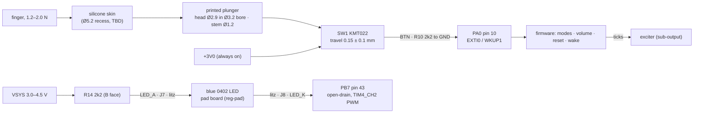

# UI: button and power LED
Status: schematic Rev F, block UI (SW1, R10, R14) + pads J7/J8 (gen.py; ERC 0 errors / 311 warnings, `hw/pod/gen.erc` 2026-10-02 20:01). Routed draft: BTN routed; LED_K→J8 unrouted (`hw/pod/draft_r1/drc.json` 2026-10-02T20:07). Plunger and lid bore are modelled in `shell_r1.py`; the skin is not chosen. The gesture model is only partly specified. No firmware. Updated 2026-10-01.
· Source of truth: `hw/pod/gen.py` L262–275 (L269 "Fed from VBAT"), `hw/pod/place_r1.py` L47, L54, L72, `hw/mech/shell_r1.py` (`SWITCH` L46, lid bore/recess L104–105, `plunger` L113–116), `hw/padboard/gen.py` (LED D1), `docs/spec.md` D3, D12, §5.4
· Owner decisions: O8 (solid LED in the pad), O16(5) (switch on the board centre line), O16(7) (IP68 switch), O12(b) (sealing), O18 (rev 1 fails informatively) · Open ECRs: none on this block (ECR-0001 touches frame.py's stale `BUTTON`)

## Purpose
- Carries **F11** Wake / button and **F12** Power LED (solid) (`integration-map.md` §1).
- **One button does everything (D3, §5.4):** modes, volume, reset, and wake from Off. The wearer's only feedback is **ticks played through the exciter** (D3). The LED faces outward, so she never sees it while wearing the pod (`pad-led.md` L63). It tells other people, and her with the pod in her hand, that the pod is on (O8).
- **Must:** stay sealed in light rain (O12b: IPX4 minimum, IPX5 preferred); sit in the same place on both pods (O16-5: board centre line); cost nothing in Off beyond leakage.

## Big picture

*CAD render with the lid off (plunger on SW1, LED ring on the pad): `hw/mech/out/r1/spine/open.png`.*

1. **Button:** pressing the skin pushes the plunger onto SW1, whose contacts join +3V0 to BTN. R10 holds BTN at 0 V when released. While pressed, R10 makes the contact carry ~1.36 mA; the KMT0 needs at least 1 mA to keep its contacts reliable.
2. **Wake and input:** PA0's EXTI line (the MCU's pin-change interrupt) wakes the MCU from Stop 2 (Off) or interrupts it while running. Firmware debounces the press (C&K bounce ≤ 6 ms) and times it.
3. **No hardware power switch.** U4's EN is tied to VSYS, so +3V0 is always up, and the button works in Off. Exception: if U3 is put in shutdown/ship mode (proposed for storage in sub-power), VSYS is off and only docking wakes the pod.
4. **LED:** current flows VSYS → R14 → J7 → wire → LED → wire → J8 → PB7. "Open-drain" means PB7 can only pull low (LED on) or let go (LED off). Firmware PWMs PB7 above 20 kHz and sets the duty from the measured supply, so brightness stays steady (gen.py L15–17).

### Button stack (pod y, pointing outward from the head; one pod, at pod x 52.6, z −2.1)
| Layer | y (mm) | Source |
|---|---|---|
| Silicone skin, bonded in the Ø5.2 recess in the 0.7 mm armour plate (recess floor y 15.85, plate top 16.1) | 15.85 + skin | `shell_r1.py` L105; physical.md (material, thickness TBD) |
| Plunger head Ø2.9 in a straight Ø3.2 bore (no shoulder: only the skin retains it). CAD draws it at 15.2–16.1, flush with the plate top, but **it can't float there: it drops until the stem rests on SW1**, putting the head top at **15.45** | 14.55–15.45 seated (CAD 15.2–16.1) | L104, L114; derived |
| Plunger stem Ø1.2, 1.2 long | 13.55–14.75 seated (CAD 14.2–15.4) | L115; derived |
| **Head top ↔ recess floor: 0.40 mm** when seated. A skin bonded flat in the recess spans that gap; one that touches the CAD head (0.25 above the floor) would press the plunger. The "0.65 mm CAD gap" (stem tip 14.2 vs switch top 13.55) is not the real stack | 15.45–15.85 | derived; open issue 1 |
| SW1 body 3.0 × 2.6 × 0.65 (C&K nominal; height tolerance not given) | 12.9–13.55 | L174; C&K KMT0 p.B-9 |
| Board F face, pushed onto the lid ribs by the foam (0.05 mm gap in CAD) | 12.9 | tolerances.md L18 |
| Board 0.8 mm; below it B parts ≤ 1.2 mm, with foam strips only at the two 0.6 mm edge bands. **Each strip overlaps the cell by only 0.1 mm** (board 13 wide, cell 12): the strips have almost no floor (reg-pod-body issue 11). R21 (1206) sits directly under SW1 on B | 10.7–12.9 | `shell_r1.py` L42–43, L177–178 |
| Cell | 5.4–10.7 | `shell_r1.py` L42 |

**What sets pre-press or no-click:** head top ↔ skin underside. The foam pushes the board onto the ribs, so board thickness drops out of the chain (derived). The chain is rib height (lid print), plunger length (print), switch height (C&K gives only 0.65 nominal) and skin thickness. **Nothing rigid backs SW1:** the press is reacted only by the edge foam strips, which barely sit on the cell (open issue 2).

### Interaction model
| Input / state | What the spec says | Source |
|---|---|---|
| Short press | cycles modes | §5.4 L340 |
| Press-and-hold | steps volume, ~4 dB per step, with a tick pattern that says which step | §5.4 L340; D3 L123–124 |
| Long press | returns **that** side to defaults, so both sides re-match in two presses | D3 L125 |
| Power-on | volume and mode reset to known defaults | D3 L121 |
| Modes | Full; **Transient-only (indoor default)**; Off = Stop 2, mic unpowered, bridge stopped | D12 L218–221 |
| LED | solid while on; no pulsing | O8 L634 |
| **Not specified** | on/off gesture; hold vs long-press timing; volume direction and wrap; DFU gesture (sub-dock-usb proposes "hold while docking"); LED toggle and auto-off below ~20 % (only Claude's recommendation in O8's right-hand column, not the owner's decision); charge indication; low-battery warning; behaviour while docked | open issue 5 |

## Elements
| Ref | Part (what it is) | LCSC · class · JLC stock · $ (JLC API 2026-10-02T00:21–25Z = 2026-10-01 local) | Notes |
|---|---|---|---|
| SW1 | **C&K KMT022NGJLHS**: nano tactile switch, top-actuated, 3.0 × 2.6 × 0.65 mm, IP68, 1.6 N, silver long-life contacts, 600k cycles | C221707 · Extended · 4,884 · $0.3902 | F at board (22.0, 6.5). Pads 1–2 = +3V0, 3–4 = BTN. Checked 2026-10-01: footprint pads 1/2 are the top row and 3/4 the bottom row; the C&K diagram joins each row, so this matches gen.py |
| R10 | 2.2 kΩ ±1 % 0402 (Uni-Royal 0402WGF2201TCE), BTN pull-down | C25879 · Basic · 2.24 M · $0.0013 | F (23.0, 9.5). Sets the ≥ 1 mA contact current |
| R14 | 2.2 kΩ ±1 % 0402, LED series resistor from VSYS | C25879 · Basic | B (26.42, 11.8) |
| J7, J8 | 1.0 mm hand-solder pads LED+ / LED− (`TestPoint_Pad_D1.0mm`) | copper only | F rear edge: J7 (31.4, 10.4) inner column, J8 (33.0, 11.0) outer. Neighbours (pad edge gaps, PLACE L54): J7–J9 TS 0.60, J7–J8 0.71, J7–J2 OUT_B 0.89; J8–J2 OUT_B 0.60 |
| D1 (pad board) | **Everlight 16-213/BHC-AN1P2/3T**: blue 0402 chip LED, 464.5–476.5 nm, 120°; 28.5–72 mcd and VF 2.7/3.3/3.7 V at 5 mA; ESD 150 V HBM | C131223 · Extended · 25,755 · $0.0291 | JLC-placed on the 5.0 × 9.3 mm pad board under a cast clear-epoxy ring (`hw/padboard/gen.py`; `pad.md`). Pad-board pads J3 LED+ / J4 LED− (not the pod's J3/J4) |
| Plunger | printed resin: head Ø2.9 × 0.9, stem Ø1.2 × 1.2 | printed | `shell_r1.py` L113–116 |
| Skin | silicone membrane over the bore: the seal **and** the return spring | TBD | Material, thickness and adhesive not chosen (physical.md L91) |

## Interfaces
| To | Nets / pins (as in integration-map.md) | What crosses / invariant |
|---|---|---|
| [sub-processing](sub-processing.md) | BTN → PA0 (pin 10, EXTI0 / WKUP1); LED_K → PB7 (pin 43, FT, TIM4_CH2) | Any EXTI line wakes Stop 2 (A3 §3). **In Stop 2 every pin keeps its Run state** (RM0456 Rev 7 §10.7.8, p.430), so firmware must release PB7 before Off or the LED stays lit. TIM4 doesn't run in Stop 2 (autonomous list: ADC4, DAC1, LPTIM1/3, LPUART1, SPI3, I2C3, ADF1, LPDMA1; RM0456 p.422) |
| [sub-power](sub-power.md) | +3V0 → SW1 pins 1/2; VSYS → R14 | 1.33–1.40 mA from +3V0 while pressed. LED 0.14–0.73 mA on battery, 0.82–0.86 mA docked (Key numbers; sub-power uses the same basis). VSYS = VBAT − I × 55 mΩ on battery, 4.5 V docked (sub-power) |
| [sub-output](sub-output.md) | (no net) the tick feedback is played by the bridge; LED_A/LED_K share the 4-wire arm bundle with OUT_A/OUT_B | 200 kHz edges may couple a few pF into the LED pair, giving a faint glow when "off" (`pcb-mech-interface.md` §6 item 5, [Low]). Fix if seen: 1 nF across J7/J8 |
| [sub-dock-usb](sub-dock-usb.md) | BTN PA0; VBUS_SENSE PA1 | Proposed DFU gesture: button held at reset with VBUS present (sub-dock-usb issue 4). Docked VSYS = 4.5 V changes the LED current |
| [sub-debug-test](sub-debug-test.md) | BTN, LED_K | Self-test reports BTN state and a stuck-button flag. In ROM DFU, PB7 is I2C1_SDA with a pull-up to 3.0 V (AN2606 Rev 69 Table 199), so the LED stays dark (derived: 4.5 − 3.0 V < VF) |
| [reg-pod-body](reg-pod-body.md) | SW1 ↔ plunger ↔ bore ↔ skin; board ↔ ribs/foam | Switch at pod x 52.6 = board x 22.0 + 30.6. Changing the switch changes the lid (integration-map §7) |
| [reg-board](reg-board.md) | SW1 (22.0, 6.5) F; R10 (23.0, 9.5) F; R14 (26.42, 11.8) B; J7 (31.4, 10.4) F; J8 (33.0, 11.0) F | BTN routed (not in the drc.json 2026-10-02T20:07 unconnected list). **Unrouted: LED_K→J8**: U1 PB7 stub end (14.27, 1.20) ↔ J8 stub end (32.44, 11.56), ~20.9 mm. R21 (1206, B) sits under SW1 on the other face |
| [reg-arm](reg-arm.md) | LED_A (J7), LED_K (J8) | 2 of the 4 litz wires; the 4-wire count sets heel Ø1.0 and strut Ø1.2 (R-UI-ARM) |
| [reg-pad](reg-pad.md) | LED_A/LED_K → pad-board J3/J4 → LED D1 | Cast epoxy ring, 0.6 mm wide (Ø4.1 plug in Ø5.3); LED top at y 3.88 (`pad.md` L107–109). Pad-board J4 LED_K is 0.45 mm from J2 OUT_B (reg-pad issue 13) |
| [physical](physical.md) | button stack (interface 2), LED wires (interface 3) | Plunger seated on SW1, skin spans 0.40 mm; assembly step 11 sets the plunger; the foam that backs SW1 has no floor (physical issue 12) |

## Constraints
- **D3 / §5.4:** one button, fixed gain, stepped volume, tick feedback, long-press reset, defaults at power-on. §5.4 is **not** locked (only §1 is), so the gesture set can change with the owner's OK.
- **D12:** Off = Stop 2 with the mic unpowered and the bridge stopped; the button is the way out of Off.
- **O8:** LED solid while on, in the pad housing; battery cost accepted. **O16(7):** an IP68 switch (KMT0 class), not a printed flexure. **O16(5):** switch on the board centre line y 6.5, so one board fits both pods.
- **O18:** every uncertain value gets a firmware knob. Gesture timings, debounce and LED brightness are firmware constants, not parts.
- **C&K KMT0 limits:** contact current 1–50 mA, 20 mV–32 VDC; actuator at least Ø1.0, and C&K recommends a flat surface covering the whole switch top.
- **§1.2.3:** self-noise no louder than ambient. The LED PWM runs above 20 kHz (gen.py L17; `pad-led.md` L63).
- **PB7:** FT (5 V-tolerant) pin; absolute maximum 20 mA per pin (`pcb-mech-interface.md` L33).

## Key numbers
| Quantity | Value | Source (date) |
|---|---|---|
| SW1 force / life | 1.6 N ± 25 % (1.2–2.0 N), tactile feel ≥ 30 %, 600,000 cycles | C&K KMT0 datasheet p.B-9, dated 21 Mar 2018; LCSC copy fetched 2026-10-01 (SHA-256 a7791d9888a26610) |
| SW1 travel / height / size | 0.15 ± 0.1 mm / 0.65 mm / 3.0 × 2.6 mm | same |
| SW1 electrical | 1–50 mA, 20 mV–32 VDC, 0.5 VA max, ≤ 150 mΩ contact, bounce ≤ 6 ms, −40…85 °C, IP68 | same |
| Contact current while pressed | 1.33–1.40 mA (2.955–3.045 V / 2.2 kΩ ± 1 %) | derived: SBVS338H rail via sub-power; gen.py L246 |
| Cost of a stuck (pre-pressed) switch | +1.36 mA continuous, 57–82× the 16.5–24 µA Off budget; empties 175 mAh in ~5.4 days | derived; Off budget from sub-power |
| Plunger / bore / skin recess | head Ø2.9, stem Ø1.2; bore Ø3.2 (0.15 mm per side); recess Ø5.2 × 0.25 | `shell_r1.py` L104–105, L113–116; tolerances.md L19 |
| Plunger head top ↔ skin recess floor, plunger seated on SW1 | 0.40 mm (head top 15.45, floor 15.85); the CAD's 0.65 mm stem gap assumes a floating plunger | derived from `shell_r1.py` L105, L114–115, L174 |
| LED current = (VSYS − VF) / 2.2 kΩ, VF 2.6–2.7 V | 0.14–0.18 mA at 3.0 V; 0.45–0.50 at 3.7 V; 0.68–0.73 at 4.2 V; **0.82–0.86 mA docked (4.5 V)** | derived; VF at low current from `pad-led.md` L29 (datasheet gives 5 mA only) |
| LED brightness at 0.3–0.5 mA | ~2–7 mcd `[Med]`: visible indoors and at night, not in daylight | `pad-led.md` L23 |
| LED PWM | > 20 kHz, TIM4_CH2 on PB7 | gen.py L15–17 |
| Runtime with the LED | always awake, pessimistic: 12.5 h with LED vs 13.4 h without (175 mAh) | sub-power (power.py, run 2026-10-01) |

## Open issues
1. **Plunger reach.** With no shoulder the plunger rests on SW1, so its head top sits 0.40 mm below the skin recess floor (stack table). The quantity that decides pre-press or no-click is **head top ↔ skin underside**, and no doc or CAD sets it. tolerances.md L20 says "print the stem 0.2 mm long and sand to a light touch". Travel is only 0.15 ± 0.1 mm.
   - **Too long:** SW1 is pre-pressed. That's +1.36 mA forever (the cell is empty in ~5 days), the pod never sleeps, and the button is dead.
   - **Too short:** no click.
   - **Closes:** in CAD, set the head length so that "skin just touching the head = SW1 just not pressed", and say whether the skin is the plunger's retainer (reg-pod-body). Add a firmware stuck-button flag: firmware can't stop the current, only report it. Run physical.md's final check ("one click per press, none with the lid just closed").
2. **Nothing rigid backs SW1.** The 1.2–2.0 N press goes into a 13 mm-wide, 0.8 mm board that is held only by foam strips at its edges, and those strips have only 0.1 mm of cell under them (the board is 1 mm wider than the cell; reg-pod-body issue 11). If the foam yields, the board moves ~0.2 mm until B-face parts land on the pouch: R21 (1206, directly under SW1), Q1/Q2, U3's 0.4 mm DSBGA. That loads solder joints, presses the Li-ion pouch, and can swallow the KMT0's 0.15 ± 0.1 mm stroke. Foam stiffness is unknown.
   - **Closes:** first give the foam a floor (reg-pod-body issue 11: tub ledges recommended). Then a test-build press test (press the skin on a kitchen scale: 1.6 N ≈ 163 g; watch the board).
3. **Stem Ø1.2 meets C&K's Ø1.0 minimum, but not its recommendation** (a flat surface covering the switch). **Closes:** widen the stem foot toward the 3.0 × 2.6 body top in CAD.
4. **Skin not chosen.** It is the seal (the switch's own IP68 does not seal the lid bore), the return spring and the plunger's only retainer. **Closes:** pick material, thickness and adhesive with the sealing work (reg-pod-body; `sealing-and-service.md` is cited by O10 but doesn't exist), then spray-test (O12b).
5. **The gesture model has holes** (table above). §5.4 gives no on/off gesture, and "press-and-hold = volume" vs "long press = reset" has no timing rule. Options for the owner:
   - **(A)** Keep §5.4 and add timings: short = next mode (Full → Transient-only → Off); hold = volume steps with ticks, wrapping at the top; reset = off then on (power-on defaults, D3). Re-matching takes up to 3 presses.
   - **(B, recommended)** Short = Full ↔ Transient-only; double-press = one volume step with ticks (wraps); **hold ≥ ~2 s = Off, which is also the reset**; any press in Off = On at defaults. That meets D3's "re-match in two presses" exactly, and volume can never change by accident while turning off. Cost: a single press waits ~0.3 s to rule out a double.
   - **(C)** Spec gestures plus a third hold length for Off. Three hold lengths on one button is error-prone.

   All timings are firmware knobs (O18). Also open (owner): DFU gesture, LED toggle and auto-off, charge indication, low-battery warning, power-on state (On or Off after the cell is fitted).
6. **LED vs low-power modes.**
   - Firmware must release PB7 before Stop 2, because pins hold their state there (RM0456 §10.7.8). **`pad-led.md` L30 is wrong to say the pin goes high-impedance by itself.**
   - TIM4 stops in Stop 2. If idle listening uses Stop 2 + LPDMA (sub-processing issue 4, plan 2), the "solid, steady" LED can't be PWM'd while idle: it is either full current (0.14–0.73 mA) or off. PB7 has no LPTIM output.
   - **Closes:** pick the idle plan with this in mind (sub-processing).
7. **Brightness hold.**
   - gen.py and integration-map F12 say "duty from VBAT", but docked VSYS is 4.5 V: firmware must use 4.5 V when PA1 shows VBUS.
   - VF below 5 mA isn't in the datasheet.
   - Holding brightness down to 3.0 V caps the target at ~0.14 mA.
   - **Closes:** bench-measure VF at 0.1–1 mA on a pad board; choose the target (≤ the VBAT floor) as a firmware constant.
8. **PB7 is unprotected against arm-wire faults.**
   - LED_K runs straight into PB7, in the same bundle as OUT_A/OUT_B. A nicked wire can push tens of mA into the pin; its limit is 20 mA (`pcb-mech-interface.md` L33). The proposed fix, R14 split so one half sits in series with PB7, was not adopted in Rev E.
   - J8–J9 is not a bridge pair in Rev F (1.72 mm apart, PLACE L52-54); the ship-mode path (TS < 90 mV for 10 s, sub-power) now needs J9 against a pad that holds TS low (J2 OUT_B 0.71, J1 OUT_A 0.89; depends on the TIM1 idle state [TBD]).
   - On the **pad board**, LED_K (J4) sits 0.45 mm from OUT_B (J2) under the epoxy dam: a bridge there drives the bridge output straight into PB7 (reg-pad issue 13).
   - **Closes:** decide in the simplification study (R14 split, pad-board pad order); meter-check J-pad neighbours before power (sub-debug-test bring-up step 1).
9. **Stale text elsewhere** (not edited here):
   - gen.py L269 "Fed from VBAT" (the code uses VSYS);
   - `hw/padboard/gen.py` docstring and `hw/mech/notes/pad.md` L64 ("R14 … from VBAT");
   - `datasheet-provenance.md` L24 (SW1 = KXT321LHS, no datasheet);
   - `B-parts-selection.md` §5 (KXT321);
   - `docs/learn/make_board_parts.py` L80 (R10 "100 kΩ"; it is 2k2).
10. **Diagrams missing:** a button stack-up section (skin → plunger → SW1 → board → foam → cell, with the tolerance chain) and a gesture state diagram, both as PNGs. The table and Mermaid above stand in.

## Before you change this, check
- **Switch part or position:** lid bore, plunger, skin and switch x in `shell_r1.py` (reg-pod-body); centre line y 6.5 (O16-5, one board for both pods); 1 mA minimum vs R10; travel vs the CAD gap; F-face height band ≤ 1.2 mm.
- **R10:** contact current ≥ 1 mA; pressed and stuck current vs the Off budget (sub-power).
- **R14, the LED or its supply:** VSYS range including 4.5 V docked; PB7 20 mA limit; runtime table (sub-power); the arm wire count (reg-arm: 4 wires set the heel and strut bores); pad-board ring and cap (reg-pad).
- **Pins:** PA0 is WKUP1/EXTI0; PB7 needs a timer output and FT. Check `integration-map.md` §4 (one job per pin) and ECR-0003.
- **Gestures or LED behaviour:** D3 (re-match in two presses), D12, O8 (solid, no pulsing), the idle-mode plan (sub-processing), the DFU entry (sub-dock-usb).
- **Foam, ribs, board thickness:** the button's reaction path and plunger gap (physical, reg-pod-body).
- Walk any change through `integration-map.md` §10 and `tools/plm.py impact SUB-UI`.

## Change log
- 2026-10-01: created from gen.py Rev E, place_r1.py (drc 19:44), shell_r1.py, tolerances.md, spec v0.14 + O18. Fetched the C&K KMT0 datasheet (2018-03-21) and checked SW1's pin pairs against it.
  - New findings: the stuck-switch drain (5 days); no rigid backing under SW1; stem vs C&K's actuator advice; PB7 keeps its state in Stop 2 and TIM4 stops there; docked LED current ~0.8 mA; J8–J9 bridge → ship mode; the gesture-model gaps.
- 2026-10-01 (editor pass): button stack restated with the plunger seated on SW1 (head top 15.45, recess floor 15.85: the skin spans 0.40 mm); the edge foam has almost no floor; issue 8 cites the pad-board J2–J4 adjacency (reg-pad issue 13); O8 line ref moved to v0.15 (L634).
